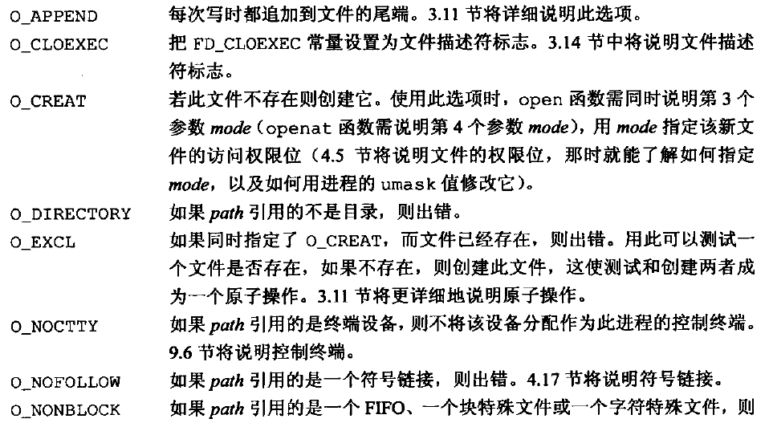
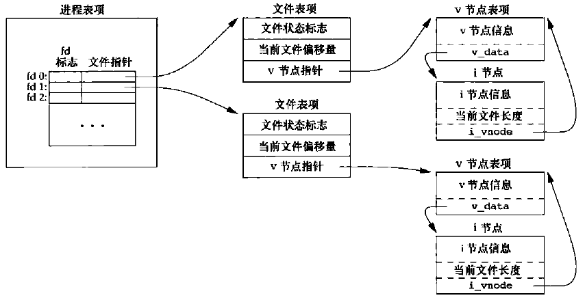

[TOC]


# 3.1 引言

* 文件I/O函数——打开文件、读文件、写文件等：open、read、write、lseek、close五个函数。
* 不同缓冲长度对read和write函数的影响。
* 不带缓冲的I/O。


# 3.2 文件描述符

对于内核而言，所有打开的文件都通过文件描述符引用。

文件描述符是一个非负整数。当打开一个现有文件或创建一个新文件时，内核向进程返回一个文件描述符。

UNIX系统shell把文件描述符0与进程的标准输入关联，文件描述符1与标准输出关联，文件描述符2与标准错误关联。(这个惯例与UNIX内核无关)

```C++
#include <unistd.h>
/* Standard file descriptors.  */
#define	STDIN_FILENO	0	/* Standard input.  */
#define	STDOUT_FILENO	1	/* Standard output.  */
#define	STDERR_FILENO	2	/* Standard error output.  */
```


# 3.3 函数 open 和 openat

调用`open`或`openat`函数可以打开或创建一个文件。

```C++
#include <fcntl.h>
extern int open (const char *file, int oflag, ...);
extern int openat (int fd, const char *file, int oflag, ...);
//两函数的返回值：若成功，返回文件描述符；若出错，返回-1
```
oflag选项：
> 以下五个选项必须指定一个且只能指定一个：
>
> 
>
> 可选的选项:
> 
> 
> 

由`open`和`openat`函数返回的文件描述符一定是最小的未用描述符数值。

fd参数把`open`和`openat`函数区分开，共有3种可能性：
1. path参数指定的是绝对路径名，在这种情况下，fd参数被忽略，openat函数就相当于open函数。
2. path参数指定的是相对路径名，fd参数指出了相对路径名在文件系统中的开始地址。fd参数是通过打开相对路径名所在的目录来获取。
3. path参数指定了相对路径名，fd参数具有特殊值AT_FDCWD。在这种情况下，路径名在当前工作目录中获取，openat函数在操作上与open函数类似。


# 3.4 函数 creat

调用`creat`函数可以创建一个新文件。

```C++
#include <fcntl.h>
extern int creat (const char *file, mode_t mode);
//返回值：若成功，返回为只写打开的文件描述符；若出错，返回-1
```

creat函数等效于 `open(file, O_WRONLY | O_CREATE | O_TRUNC, mode);`


# 3.5 函数 close

调用`close`函数可以关闭一个打开文件。

```C++
#include <unistd.h>
extern int close (int fd);
//返回值：若成功，返回0；若出错，返回-1
```

关闭一个文件时还会释放该进程加在该文件上的所有记录锁。
当一个进程终止时，内核自动关闭它所有的打开文件。


# 3.6 函数 lseek

每个打开文件都有一个与其相关联的“**当前文件偏移量**”。它通常是一个非负整数，用以度量从文件开始处计算的字节数。通常，读、写操作都从当前文件偏移量处开始，并使偏移量增加所读写的字节数。按系统默认的情况，当打开一个文件时，除非指定O_APPEND选项，否则该偏移量被设置为0。

可以调用`lseek`显式地为一个打开文件设置偏移量。

```C++
#include <unistd.h>
extern off_t lseek (int fd, off_t offset, int whence);
//返回值：若成功，返回新文件的偏移量；若出错，返回-1
```

* 若whence是SEEK_SET，则将该文件的偏移量设置为距文件开始处offset个字节。
* 若whence是SEEK_CUR，则将该文件的偏移量设置为其当前值加offset，offset可为正或负。
* 若whence是SEEK_END，则将该文件的偏移量设置为文件长度加offset，offset可正可负。

代码示例
```C++
#include <stdio.h>
#include <stdlib.h>
#include <unistd.h>

int main(int argc, char *argv[])
{
    __off_t curpos;
    if((curpos = lseek(STDIN_FILENO,0,SEEK_END)) == -1)//要和-1比较，不能和小于0比较，因为有些操作系统允许负的偏移量
    {
        printf("lseek error!\n");
    }
    else{
        printf("current position: %ld \n",(long int)curpos);
        printf("lseek OK!\n");
    }

    exit(0);
}
```

运行结果
> taojikun@taojikun-virtual-machine:~/taojikun/APUE/03-文件IO$ ./lseek < lseek.c
>> current position: 335 
>> lseek OK!

lseek仅将当前的文件偏移量记录在内核中，它并不引起任何I/O操作，然后，该偏移量用于下一个读或写操作。

文件偏移量可以大于文件的当前长度，在这种情况下，对该文件的下一次写将加长该文件，并在文件中构成一个空洞。位于文件中但没有写过的字节都被读为0。

文件中的空洞部分并不要求在磁盘上占用存储区。


# 3.7 函数 read

调用`read`函数可以从打开的文件中读数据。

```C++
#include <unistd.h>
extern ssize_t read (int fd, void *buf, size_t nbytes);
//返回值：读到的字节数，若已到文件尾，返回0(EOF)；若出错,返回-1
```

实际读到的字节数少于要求读的字节数的情况：
* 读普通文件时，在读到要求字节数之前已到达了文件尾端。
* 当从终端设备读时，通常一次最多读一行。
* 当从网络读时，网络中的缓冲机制可能造成返回值小于所要求读的字节数。
* 当从管道或FIFO读时，如若管道包含的字节少于所需的数量，那么read将只返回实际可用的字节数。
* 当从某些**面向记录**的设备(如磁带)读时，一次最多返回一个记录。
* 当一信号造成中断，而已经读了部分数据量时。


# 3.8 函数 write

调用`write`函数可以向打开的文件中写数据。

```C++
#include <unistd.h>
extern ssize_t write (int fd, const void *buf, size_t nbytes);
//返回值：若成功、返回已写的字节数；若出错,返回-1
```

write出错原因：磁盘写满，或者超过了一个给定进程的文件长度限制。

对于普通文件，写操作从文件的当前偏移量处开始。如果在打开该文件时，指定了O_APPEND选项，则在每次写操作之前，将文件偏移量设置在文件的当前结尾处。在一次成功写之后，该文件偏移量增加实际写的字节数。


# 3.9 I/O的效率

大多数文件系绕为改善性能都采用某种预读(read ahead)技术。当检测到正进行顺序读取时，系统就试图读入比应用所要求的更多数据，并假想应用很快就会读这些数据。


# 3.10 文件共享

UNIX 系统支持在不同进程间共享打开文件。

内核使用3种数据结构表示打开文件，它们之间的关系决定了在文件共享方面一个进程对另一个进程可能产生的影响。
> (1) 每个进程在进程表中都有一个记录项，记录项中包含一张打开文件描述符表，可将其视为一个矢量，每个描述符占用一项。与每个文件描述符相关联的是：
>> a. 文件描述符标志(close_on_exec);
>> b. 指向一个文件表项的指针。
>
> (2) 内核为所有打开文件维持一张文件表。每个文件表项包含：
>> a. 文件状态标志(读、写、添写、同步和非阻塞等);
>> b. 当前文件偏移量;
>> c. 指向该文件v节点表项的指针。
> 
> (3) 每个打开文件(或设备)都有一个对虚拟文件系统提供支持的v节点(v-node)结构。v节点包含了文件类型和对此文件进行各种操作函数的指针。对于大多数文件，v节点还包含了该文件的i节点(i-node，索引节点)。这些信息是在打开文件时从磁盘上读入内存的，所以，文件的所有相关信息都是随时可用的。例如，i节点包含了文件的所有者、文件长度、指向文件实际数据块在磁盘上所在位置的指针等。

下图显示了一个进程对应的3张表之间的关系。该进程有两个不同的打开文件：一个文件从标准输入打开（文件描述符0），另一个从标准输出打开（文件描述符为1）：


两个**独立进程**各自打开同一个文件时三张表的关系：


可能有多个文件描述符项指向同一文件表项(例如父子进程中各自的每一个打开文件描述符共享同一个文件表项)。

文件描述符标志和文件状态标志在作用范围方面的区别：前者只用于一个进程的一个描述符，而后者则应用于指向该给定文件表项的任何进程中的所有描述符。


# 3.11 原子操作

## 追加到一个文件
假设这样一种情况，有两个独立的进程A和B都对同一文件进行追加写操作。每个进程都已打开了该文件，但**未使用O_APPEND标志**。每个进程都有它自己的文件表项，但是共享一个v节点表项。假定进程A调用了lseek，它将进程A的该文件当前偏移量设置为1500字节(当前文件尾端处)然后内核切换进程，进程B运行。进程B执行lseek，也将其对该文件的当前偏移量设置为1500字节(当前文件尾端处)。然后B调用write，它将B的该文件当前文件偏移量增加至1600。因为该文件的长度已经增加了，所以内核将v节点中的当前文件长度更新为1600。然后，内核又进行进程切换，使进程A恢复运行。当A调用write时，就从其当前文件偏移量(1500)处开始将数据写入到文件。这样也就覆盖了进程B刚才写入到该文件中的数据。

上述问题出在逻辑操作“先定位到文件尾端，然后写”，它使用了两个分开的函数调用。解决问题的方法是使这两个操作对于其他进程而言成为一个**原子操作**。任何要求多于一个函数调用的操作都不是原子操作，因为在两个函数调用之间，内核有可能会临时挂起进程。

UNIX系统为这样的操作提供了一种原子操作方法，即在打开文件时设置O_APPEND标志。这样做使得内核在每次写操作之前，都将进程的当前偏移量设置到该文件的尾端处，于是在每次写之前就不再需要调用lseek。


## 函数 pread 和函数 pwrite
```C++
#include <unistd.h>
extern ssize_t pread (int fd, void *buf, size_t nbytes, off_t offset);
//返回值:读到的字节数，若己到文件尾，返回0;若出错,返回-1。

extern ssize_t pwrite (int fd, const void *buf, size_t n, off_t offset);
//返回值：若成功，返回已写的字节数；若出错,返回-1。
```

调用pread相当于调用lseek后调用read，但是pread又与这种顺序调用有下列重要区别(调用pwrite相当于调用lseek后调用write，但也与它们有类似的区别)。
* 调用pread时，无法中断其定位和读操作。
* 不更新当前文件偏移量。


## 创建一个文件
```C++
if((fd = open(pathname, O_WRONLY)) < 0)
{
    if(erro == ENOENT)
    {
        if((fd = creat(path, mode)) < 0)
        {
            err_sys("create error!\n");
        }
    }
    else
    {
        err_sys("open error!\n");
    }
}
```
对于上面代码段，如果检查文件是否存在和创建文件两个操作不是作为原子操作执行的，那么，如果在open和creat之间，另一个进程创建了该文件，并且写入了一些数据，然后，原先进程执行这段程序中的creat，这时，刚由另一进程写入的数据就会被擦去。如若将这两者合并在一个原子操作中，这种问题就不会出现。

**原子操作**指的是由多步组成的一个操作。如果该操作原子地执行，则要么执行完所有步骤，要么一步也不执行，不可能只执行所有步骤的一个子集。


# 3.12 函数 dup 和 dup2

调用`dup`和`dup2`函数可以用来复制一个现有的文件描述符。

```C++
#include <unistd.h>
extern int dup (int fd);
extern int dup2 (int fd, int fd2);
//返回值：若成功，返回新的文件描述符；若出错,返回-1。
```

由dup返回的新文件描述符一定是当前可用文件描述符中的最小数值。

对于dup2，可以用fd2参数指定新描述符的值。如果fd2已经打开，则先将其关闭。如若fd等于fd2，则dup2返回fd2，而不关闭它。否则，fd2的FD_CLOEXEC文件描述符标志就被清除，这样fd2在进程调用exec时是打开状态。

dup和dup2函数返回的新文件描述符与参数fd共享同一个文件表项。


# 3.13 函数 sync、fsync 和 fdatasync

延迟写：向文件写数据时，内核先将数据复制到缓冲区，然后排入队列，晚些时候再写入磁盘。

通常，当内核需要重用缓冲区来存放其他磁盘块数据时，它会把所有延迟写数据块写入磁盘。为了保证磁盘上实际文件系统与缓冲区中内容的一致性，UNIX系统提供了sync、fsync和fdatasync三个函数。
```C++
#include <unistd.h>
extern int fsync (int fd);
extern int syncfs (int fd);
//返回值：若成功，返回0；若出错,返回-1。

extern void sync (void);
```
sync只是**将所有修改过的块缓冲区排入写队列**，然后就返回，它并不等待实际写磁盘操作结束。通常，称为update的系统守护进程周期性地调用(一般每隔30秒)sync函数，这就保证了定期冲洗(flush)内核的块缓冲区。

fsync函数只对由文件描述符fd指定的一个文件起作用，并且等待写磁盘操作结束才返回。fsync可用于数据库这样的应用程序，这种应用程序需要确保修改过的块立即写到磁盘上。

fdatasync函数类似于fsync，但它**只影响文件的数据部分**。而除数据外，fsync还会**同步更新文件的属性**。


# 3.14 函数 fcntl

[FD_CLOEXEC介绍](https://blog.csdn.net/chrisniu1984/article/details/7050663)

调用`fcntl`函数可以改变已经打开文件的属性。

```C++
#include <fcntl.h>
extern int fcntl (int fd, int cmd, ...);
//返回值：若成功，则依赖于cmd；若出错,返回-1。
```
fcntl函数有以下5种功能：
1. 复制一个已有的描述符(cmd = F_DUPFD 或F_DUPFD_CLOEXEC)。
2. 获取/设置文件描述符标志(cmd = F_GETFD或F_SETFD)。
3. 获取/设置文件状态标志(cmd = F_GETEL或F_SETFL)。
4. 获取/设置异步IO所有权(cmd = F_GETOWN 或F_SETOWN)。
5. 获取/设置记录锁(cmd = F_GETLK、 F_SETLK或F_SETLKW)。

> cmd选项：
> 
> 
> 
> 

在修改文件描述符标志或文件状态标志时，必须要先获得当前的标志值，然后将当前标志值和期望标志值进行逻辑求或修改它，最后设置新标志值。不能只是执行F_SETFD或F_SETFL命令，这样会关闭以前设置的标志位。

开启同步写标志：`set_fl(STDOUT_FILENO, O_SYNC);`这使得每次write都要等待，直至数据已经写到磁盘上再返回（在UNIX系统中，通常write只是将数据排入队列，而实际的写磁盘操作则可能延迟在以后的某个时刻进行。而数据库系统则需要使用O_SYNC，这样一来，当它从write返回时就知道数据已确实写到了磁盘上，以免在系统异常时产生数据丢失）。相应的，设置O_SYNC标志会增加系统时间和时钟时间。


# 3.15 函数 ioctl

```C++
#include <unistd.h>     /* System V */
#include <sys/ioctl.h>  /* BSD and Linux */

extern int ioctl (int fd, unsigned long int request, ...) ;
```