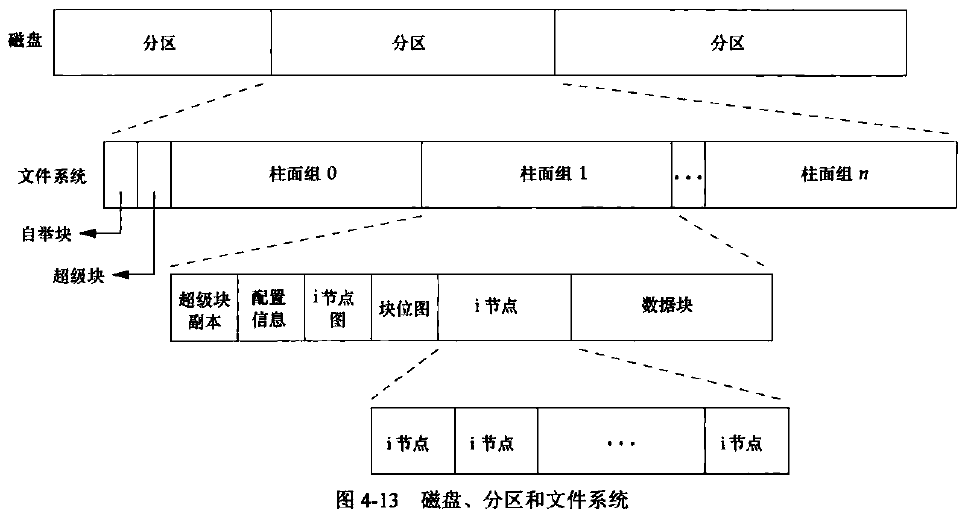
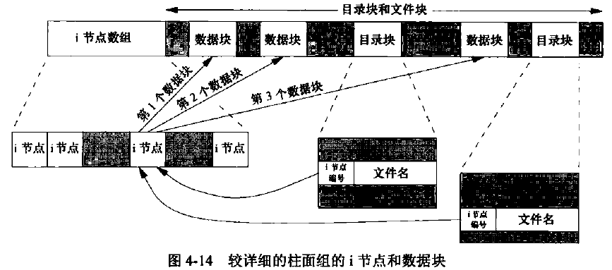

[TOC]


# 4.1 引言

* 普通文件I/O——打开文件、读文件、写文件
* 文件系统的特征和文件的性质
* Unix文件系统的结构和符号链接


# 4.2 函数 stat、fstat、fstatat 和 lstat

```C++
#include <sys/stat.h>

extern int stat (const char *restrict pathname, struct stat *restrict buf);

extern int fstat (int fd, struct stat *buf);

extern int lstat (const char *restrict pathname, struct stat *restrict buf);

extern int fstatat (int fd, const char *restrict pathname, struct stat *restrict buf, int flag);

//所有4个函数的返回值：若成功，返回0；若出错，返回-1。
```

stat函数将返回与给出的pathname命名文件有关的信息结构。

fstat函数获得已在描述符fd上打开文件的有关信息。

lstat函数类似于stat，但是当命名的文件是一个符号链接时，lstat返回该符号链接的有关信息，而不是由该符号链接引用的文件的信息。

fstatat函数为一个相对于当前打开目录（由fd参数指向）的路径名返回文件统计信息。flag参数控制着是否跟随着一个符号链接。当AT_SYMLINK_NOFOLLOW标志被设置时， fstatat不会跟随符号链接，而是返回符号链接本身的信息。否则，在默认情况下，返回的是符号链接所指向的实际文件的信息。如果fd参数的值是AT_FDCHD，并且，pathname参数是一个相对路径名，fstatat会计算相对于当前目录的pathname参数。如果pathname是一个绝对路径，fd参数就会被忽略。这两种情况下，根据flag的取值，fstatat的作用就跟stat或lstat一样。


# 4.3 文件类型

| 文件类型 | 宏 | 含义 |
| :----: | :----: | :----: |
| 普通文件 | S_ISREG() | 包含了某种形式的数据 |
| 目录文件 | S_ISDIR() | 包含了其他文件的名字以及指向与这些文件有关信息的指针 |
| 块特殊文件 | S_ISBLK() | 提供对设备（如磁盘）带缓冲的访问每次访问，以固定长度为单位进行 |
| 字符特殊文件 | S_ISCHR() | 提供对设备不带缓冲的访问，每次访问长度可变。系统中的所有设备要么是字符特殊文件，要么是块特殊文件 |
| 管道 | S_ISFIFO() | 用于进程间通信，有时也称为命名管道 |
| 套接字 | S_ISSOCK() | 用于进程间的网络通信。套接字也可用于在一台宿主机上进程之间的非网络通信 |
| 符号链接 | S_ISLNK() | 指向另一个文件 |


# 4.4 设置用户ID和设置组ID

* 实际用户ID和实际组ID：标识我们究竟是谁。这两个字段在登录时取自口令文件中的登录项。通常，在一个登录会话期间这些值并不改变，但是超级用户进程有方法改变它们。
* 有效用户ID、有效组ID以及附属组ID：决定了我们的文件访问权限。
* 保存的设置用户ID和保存的设置组ID：在执行一个程序时包含了有效用户ID和有效组ID的副本。


# 4.5 文件访问权限

所有文件类型(目录、字符特别文件等)都有访问权限。

* 用名字打开任一类型的文件时，对该名字中包含的每一个目录，包括它可能隐含的当前工作目录都应具有执行权限。
* 对于一个文件的读权限决定了我们是否能够打开现有文件进行读操作。
* 对于一个文件的写权限决定了我们是否能够打开现有文件进行写操作。
* 为了在open函数中对一个文件指定O_TRUNC标志，必须对该文件具有写权限。
* 为了在一个目录中创建一个新文件，必须对该目录具有写权限和执行权限。
* 为了删除一个现有文件，必须对包含该文件的目录具有写权限和执行权限。对该文件本身则不需要有读、写权限。
* 如果用7个exec函数中的任何一个执行某个文件，都必须对该文件具有执行权限，该文件还必须是一个普通文件。

进程每次打开、创建或删除一个文件时，内核就进行文件访问权限测试，按顺序执行以下4步：
1. 若进程的有效用户ID是0(超级用户)，则允许访问。这给予了超级用户对整个文件系统进行处理的最充分的自由。
2. 若进程的有效用户ID等于文件的所有者ID(也就是进程拥有此文件)，那么如果所有者适当的访问权限位被设置，则允许访问；否则拒绝访问。适当的访问权限位指的是，若进程为读而打开该文件，则用户读位应为1；若进程为写而打开该文件，则用户写位应为1；若进程将执行该文件，则用户执行位应为1。
3. 若进程的有效组ID或进程的附属组ID之一等于文件的组ID，那么如果组适当的访问权限位被设置，则允许访问；否则拒绝访问。
4. 若其他用户适当的访问权限位被设置，则允许访问；否则拒绝访问。


# 4.6 新文件和目录的所有权

新文件的用户ID设置为进程的有效用户ID。
新文件的组ID可以是：Ⅰ进程的有效组ID；Ⅱ它所在目录的组ID。


# 4.7 函数 access 和 faccessat

access和faccessat函数按实际用户ID和实际组ID进行访问权限测试的。

```C++
#include <unistd.h>

int access(const char *pathname, int mode);

int faccessat(int dirfd, const char *pathname, int mode, int flags);
//两个函数的返回值：若成功，返回0；若出错，返回-1。
```

faccessat函数与access函数在下面两种情况下是相同的：一种是pathname参数为绝对路径，另一种是fd参数取值为AT_FDCWD而pathname参数为相对路径。否则，faccessat计算相对于打开目录（由fd参数指向）的pathname。

flag参数可以用于改变faccessat的行为，如果flag设置为AT_EACCESS，访问检查用的是调用进程的有效用户ID和有效组ID，而不是实际用户ID和实际组ID。


# 4.8 函数 umask

umask函数为进程设置文件模式创建屏蔽字，并返回之前的值。

```C++
#include <sys/types.h>
#include <sys/stat.h>
mode_t umask(mode_t mask);
//返回值：之前的文件模式创建屏蔽字。
```

代码示例
```C++
#include <stdio.h>
#include <stdlib.h>
#include <sys/stat.h>
#include <fcntl.h>

#define RWRWRW S_IRUSR|S_IWUSR|S_IRGRP|S_IWGRP|S_IROTH|S_IWOTH

int main(void)
{
    umask(0);//无屏蔽字
    if(creat("foo",RWRWRW) < 0){
        puts("creat() error!");
    }
    umask(S_IRGRP|S_IWGRP|S_IROTH|S_IWOTH);//屏蔽所有组和其他用户的访问权限
    if(creat("bar",RWRWRW) < 0){
        puts("creat() error!");
    }

    exit(0);
}
```

运行结果
> taojikun@taojikun-virtual-machine:~/taojikun/APUE/04-文件和目录$ **umask**
> 0002
> 
> taojikun@taojikun-virtual-machine:~/taojikun/APUE/04-文件和目录$ **gcc umask.c -o umask**
>
> taojikun@taojikun-virtual-machine:~/taojikun/APUE/04-文件和目录$ **./umask**
>
> taojikun@taojikun-virtual-machine:~/taojikun/APUE/04-文件和目录$ **ls -l foo bar**
> -rw------- 1 taojikun taojikun 0 10月 31 22:28 bar
> -rw-rw-rw- 1 taojikun taojikun 0 10月 31 22:28 foo
> 
> taojikun@taojikun-virtual-machine:~/taojikun/APUE/04-文件和目录$ **umask**
> 0002

UNIX系统的大多数用户从不处理他们的umask值。通常在登录时，由shell的启动文件设置一次，然后，再不改变。

当编写创建新文件的程序时，如果我们想确保指定的访问权限位已经激活，那么必须在进程运行时修改umask值。

更改进程的文件模式创建屏蔽字并不影响其父进程(常常是shell)的屏蔽字。


# 4.9 函数 chmod、fchmod 和 fchmodat

chmod、 fchmod和fchmodat这3个函数使我们可以更改现有文件的访问权限。
```C++
#include <sys/stat.h>

int chmod(const char *pathname, mode_t mode);

int fchmod(int fd, mode_t mode);

int fchmodat(int dirfd, const char *pathname, mode_t mode, int flags);
//3个函数返回值：若成功，返回0；若出错。返回-1。
```

chmod函数在指定的文件上进行操作。

fchmod函数则对已打开的文件进行操作。

fchmodat函数与chmod函数在下面两种情况下是相同的：一种是pathname参数为绝对路径，另一种是fd参数取值为AT_FDCWD而pathname参数为相对路径。否则，fchmodat计算相对于打开目录(由fd参数指向)的pathname。flag参数可以用于改变fchmodat的行为，当设置了AT_SYMLINK_NOFOLLOW标志时，fchmodat并不会跟随符号链接。

为了改变一个文件的权限位，进程的有效用户ID必须等于文件的所有者ID，或者该进程必须具有超级用户权限。

代码示例
```C++
#include <stdio.h>
#include <stdlib.h>
#include <sys/stat.h>

int main(void)
{
    struct stat statbuf;

    //获取"foo"文件的stat
    if(stat("foo",&statbuf) < 0){
        puts("stat() error!");
        exit(1);
    }
    
    //打开"foo"文件的执行时设置用户ID模式，关闭组执行模式
    if(chmod("foo",(statbuf.st_mode & ~S_IXGRP) | S_ISGID) < 0){
        puts("chmod() error!");
        exit(1);
    }

    //将"bar"文件设置为"rw-r--r--"模式
    if(chmod("bar", S_IRUSR|S_IWUSR|S_IRGRP|S_IROTH) < 0){
        puts("chmod() error!");
        exit(1);
    }

    exit(0);
}
```

运行结果
> taojikun@taojikun-virtual-machine:~/taojikun/APUE/04-文件和目录$ **gcc chmod.c -o chmod**
> 
> taojikun@taojikun-virtual-machine:~/taojikun/APUE/04-文件和目录$ **./chmod**
> 
> taojikun@taojikun-virtual-machine:~/taojikun/APUE/04-文件和目录$ **ls -l foo bar**
> 
> -rw-r--r-- 1 taojikun taojikun 0 10月 31 22:55 bar
> -rw-rwSrw- 1 taojikun taojikun 0 10月 31 22:55 foo

chmod函数在下列条件下自动清除两个权限位：
* Solaris等系统对用于普通文件的粘着位赋予了特殊含义，在这些系统上如果我们试图设置普通文件的粘着位，而且又没有超级用户权限，那么mode中的粘着位自动被关闭。这意味着只有超级用户才能设置普通文件的粘着位。这样做的理由是防止恶意用户设置粘着位，由此影响系统性能。
* 新创建文件的组ID可能不是调用进程所属的组(新文件的组ID可能是父目录的组ID)。特别地，如果新文件的组ID不等于进程的有效组ID或者进程附属组ID中的一个，而且进程没有超级用户权限，那么设置组ID位会被自动被关闭。这就防止了用户创建一个设置组ID文件，而该文件是由并非该用户所属的组拥有的。


# 4.10 粘着位

如果一个可执行程序文件的**粘着位**被设置了，那么当该程序第一次被执行，在其终止时，程序正文部分的一个副本仍被保存在**交换区**(程序的正文部分是机器指令)。这使得下次执行该程序时能较快地将其装载入内存。

如果对一个目录设置了粘着位，只有对该目录具有写权限的用户并且满足下列条件之一，才能删除或重命名该目录下的文件：1. 拥有此文件；2. 拥有此目录；3. 是超级用户。


# 4.11 函数 chown、fchow、fchownat 和 lchown

以下几个chown函数可用于更改文件的用户ID和组ID。如果两个参数owner或group中的任意一个是-1，则对应的ID不变。

```C++
#include <unistd.h>

int chown(const char *pathname, uid_t owner, gid_t group);

int fchown(int fd, uid_t owner, gid_t group);

int lchown(const char *pathname, uid_t owner, gid_t group);

int fchownat(int dirfd, const char *pathname, uid_t owner, gid_t group, int flags);
//4个函数的返回值：若成功，返回0；若出错，返回-1。
```

除了所引用的文件是符号链接以外，这4个函数的操作类似。在符号链接情况下，lchown和fchownat（设置了Ar_SYMLINK_NOFOLLOw标志）更改符号链接本身的所有者，而不是该符号链接所指向的文件的所有者。

fchown函数改变fd参数指向的打开文件的所有者，既然它在一个已打开的文件上操作，就不能用于改变符号链接的所有者。

fchownat函数与chown或者lchown函数在下面两种情况下是相同的：一种是pathname参数为绝对路径，另一种是fd参数取值为AT_FDCWD而pathname参数为相对路径。在这两种情况下，如果flag参数中设置了AR_SYMLINK_NOFOLLOW标志，fchownat与lchowr行为相同，如果flag参数中清除了AT_SYMLINK_NOFOLLOW标志，则fchownat与chown行为相同。如果fd参数设置为打开目录的文件描述符，并且pathname参数是一个相对路径名，fchownat函数计算相对于打开目录的pathname。


# 4.12 文件长度

`stat`结构成员`st_size`表示以字节为单位的文件的长度。此字段只对普通文件、目录文件和符号链接有意义。

对于普通文件，其文件长度可以是0，在开始读这种文件时，将得到文件结束(EOF)指示。
对于目录，文件长度通常是一个数(如16或512)的整倍数。
对于符号链接，文件长度是在文件名中的实际字节数。


# 4.13 文件截断

有时我们需要在文件尾端处截去一些数据以缩短文件。将一个文件的长度截断为0是一个特例，在打开文件时使用О_TRUNC标志可以做到这一点。为了截断文件可以调用函数truncate和ftruncate。

```C++
#include <unistd.h>

int truncate(const char *path, off_t length);

int ftruncate(int fd, off_t length);
//两个函数的返回值：若成功，返回0；若出错，返回-1。
```

这两个函数将一个现有文件长度截断为length。如果该文件以前的长度大于length，则超过length以外的数据就不再能访问。如果以前的长度小于length，文件长度将增加，在以前的文件尾端和新的文件尾端之间的数据将读作0（也就是可能在文件中创建了一个空洞)。


# 4.14 文件系统

我们可以把一个磁盘分成一个或多个分区。每个分区可以包含一个文件系统。i节点是固定长度的记录项，它包含有关文件的大部分信息。


硬链接——每个i节点中都有一个链接计数，其值是指向该i节点的目录项数。只有当链接计数减少至0时，才可删除该文件(也就是可以释放该文件占用的数据块)。

符号链接——符号链接文件的实际内容（在数据块中）包含了该符号链接所指向的文件的名字。

i节点包含了文件有关的所有信息：文件类型、文件访问权限位、文件长度和指向文件数据块的指针等。stat结构中的大多数信息都取自i节点。只有两项重要数据存放在目录项中:文件名和i节点编号。





# 4.15 函数 link、linkat、unlink、unlinkat 和 remove


# 4.16 函数 rename 和 renameat


# 4.17 符号链接


# 4.18 创建和读取符号链接


# 4.19 文件的时间


# 4.20 函数 futimens、utimensat 和 utimes


# 4.21 函数 mkdir、mkdirat 和 rmdir


# 4.22 读目录


# 4.23 函数 chdir、fchdir 和 getcwd


# 4.24 设备特殊文件


# 4.25 文件访问权限小结


