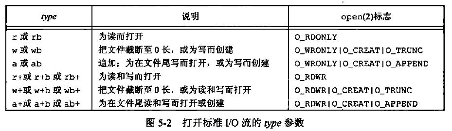
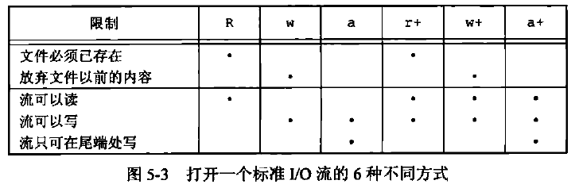
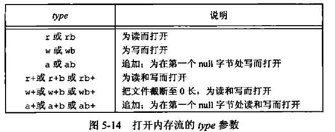

[TOC]

# 5.1 引言

缓冲区长度、以优化的块长度执行I/O


# 5.2 流和FILE对象

所有I/O函数都是围绕文件描述符的，当打开一个文件时，即返回一个文件描述符，然后该文件描述符就用于后续的I/O操作。
对于标准I/O库，它们的操作是围绕流进行的，当用标准I/O库打开或创建一个文件时，使一个流与一个文件相关联。

对于ASCII字符集，一个字符用一个字节表示。对于国际字符集，一个字符可用多个字节表示。

标准I/O文件流可用于单字节或多字节(“宽”)字符集。流的定向(stream's orientation)决定了所读、写的字符是单字节还是多字节的。

当一个流最初被创建时，它并没有定向。如若在未定向的流上使用一个多字节I/O函数，则将该流的定向设置为宽定向的。若在未定向的流上使用一个单字节I/O函数，则将该流的定向设为字节定向的。

`fwide`函数可用于设置流的定向。
```C++
#include <stdio.h>
#include <wchar.h>

int fwide(FILE *stream, int mode);
//返回值：若流是宽定向的。返回正值；若流是字节定向的，返回负值；若流是未定向的，返回0。
```
* 如若mode参数值为负，fwide将试图使指定的流是字节定向的。
* 如若mode参数值为正，fwide将试图使指定的流是宽定向的。
* 如若mode参数值为0，fwide将不试图设置流的定向，但返回标识该流定向的值。

注意，fwide并不改变已定向流的定向。
还应注意的是，fwide无出错返回。在调用fwide前需要先清除errno，从fwide返回时检查errno的值，以判断当前的流是否是无效的。

当打开一个流时，标准I/O函数`fopen`返回一个指向`FILE`对象的指针（指向FILE对象的指针称为文件指针）。该对象通常是一个结构，它包含了标准IO库为管理该流需要的所有信息，包括用于实际I/O的文件描述符、指向用于该流缓冲区的指针、缓冲区的长度、当前在缓冲区中的字符数以及出错标志等。


# 5.3 标准输入、标准输出和标准错误

| 标准I/O | 文件描述符 | 文件指针 |
| :----: | :----: | :----: |
| 标准输入 | STDIN_FILENO | stdin |
| 标准输出 | STDOUT_FILENO | stdout |
| 标准错误 | STDERR_FILENO | stderr |


# 5.4 缓冲

标准I/O库提供缓冲的目的是尽可能减少使用read和write调用的次数，此外它也对每个I/O流自动地进行缓冲管理，从而避免了应用程序需要考虑这一点所带来的麻烦。

标准I/O提供以下3种类型的缓冲：
1. 全缓冲：在填满标准I/O缓冲区后才进行实际I/O操作。对于驻留在磁盘上的文件通常是由标准I/O库实施全缓冲的。术语冲洗(flush)说明标准I/O缓冲区的写操作，缓冲区可由标准I/O例程自动地冲洗（例如，当填满一个缓冲区时），或者可以调用函数`fflush`冲洗一个流。
在UNIX环境中，flush有两种意思。在标准IO库方面，flush（冲洗）意味着将缓冲区中的内容写到磁盘上（该缓冲区可能只是部分填满的)。在终端驱动程序方面，flush（刷清）表示丢弃已存储在缓冲区中的数据。
2. 行缓冲：当在输入和输出中遇到换行符时，标准I/O库执行I/O操作。当流涉及一个终端时（如标准输入和标准输出)，通常使用行缓冲。
标准I/O库用来收集每一行的缓冲区的长度是固定的，所以只要填满了缓冲区，那么即使还没有写一个换行符，也进行I/O操作。
任何时候只要通过标准I/O库要求从一个不带缓冲的流，或者一个行缓冲的流（它从内核请求需要数据）得到输入数据，那么就会冲洗所有行缓冲输出流。
3. 不带缓冲：标准I/O库不对字符进行缓冲存储。
标准错误流stderr通常是不带缓冲的，以此使得错误信息尽快显示。

使用`setbuf`、`setvbuf`函数更改缓冲类型（**一定要在流打开后调用**）。
```C++
#include <stdio.h>

extern void setbuf (FILE *restrict stream, char *restrict buf)

extern int setvbuf (FILE *restrict stream, char *restrict buf, int modes, size_t n);
//返回值：若成功，返回0；若出错，返回非0。
```

可以使用setbuf函数打开或关闭缓冲机制。为了带缓冲进行I/O，参数buf必须指向一个长度为`BUFSIZ`的缓冲区。通常在此之后该流就是全缓冲的，但是如果该流与一个终端设备相关，那么某些系统也可将其设置为行缓冲的。为了关闭缓冲，将buf设置为NULL。

使用setvbuf可以用mode参数精确地说明所需的缓冲类型：
* **_IOFBF**——全缓冲
* **_IOLBF**——行缓冲
* **_IONBF**——不带缓冲

如果指定一个不带缓冲的流，则忽略buf和size参数。如果指定全缓冲或行缓冲，则buf和size可选择地指定一个缓冲区及其长度。如果该流是带缓冲的，而buf是NULL，则标准IO库将自动为该流分配适当长度的缓冲区（适当长度指的是由常量BUFSIZ指定的值）。

通过函数`fflush`强制冲洗一个流。
```C++
#include <stdio.h>
int fflush(FILE *stream);
//返回值：若成功，返回0；若出错，返回EOF。
```
此函数使该流所有未写的数据都被传送至内核。作为一种特殊情形，如若p是NULL，则此函数将导致所有输出流被冲洗。


# 5.5 打开流

```C++
#include <stdio.h>

FILE *fopen (const char *restrict filename, const char *restrict type);

FILE *freopen (const char *restrict filename, const char *restrict type, FILE *restrict stream);

FILE *fdopen (int fd, const char *type);
//3个函数的返回值：若成功，返回文件指针；若出错，返回NULL。
```

fopen函数打开路径名为pathname的一个指定的文件。

freopen函数在一个指定的流上打开一个指定的文件，如若该流已经打开，则先关闭该流。若该流已经定向，则使用freopen清除该定向。此函数一般用于将一个指定的文件打开为一个预定义的流：标准输入、标准输出或标准错误。

fdopen函数取一个已有的文件描述符，并使一个标准的I/O流与该描述符相结合(将文件描述符转换为文件指针)。此函数常用于由创建管道和网络通信通道函数返回的描述符。因为这些特殊类型的文件不能用标准I/O函数fopen打开，所以我们必须先调用设备专用函数以获得一个文件描述符，然后用fdopen使一个标准I/O流与该描述符相结合。




调用`fclose`函数关闭一个打开的流。
```C++
#include <stdio.h>
int fclose(FILE *stream);
//返回值：若成功，返回0；若出错，返回EOF。
```
在文件被关闭之前，冲洗缓冲中的输出数据。缓冲区中的任何输入数据被丢弃。如果标准I/O库已经为该流自动分配了一个缓冲区，则释放此缓冲区。

当一个进程正常终止时（直接调用exit函数，或从main函数返回），则所有带未写缓冲数据的标准IO流都被冲洗，所有打开的标准IO流都被关闭。


# 5.6 读和写流

对流进行读写操作的3种非格式化的I/O类型：
1. 每次一个字符I/O：一次读或写一个字符。
2. 每次一行I/O：一次读或写一行，每行以换行符终止(`fgets`、`fputs`)。
3. 直接I/O：每次I/O都读或写某种数量的对象，而每个对象具有指定的长度(`fread`、`fwrite`)。


## 输入函数

函数`getc`、`fgetc`、`getchar`可用于一次读一个字符。
```C++
#include <stdio.h>

int getc(FILE *stream);

int fgetc(FILE *stream);

int getchar(void);
//3个函数的返回值：若成功，返回下一个字符；若已到达文件尾端或出错，返回EOF。
```

函数getchar()等同于getc(stdin)。

getc可被实现为宏，而fgetc不能实现为宏。

在<stdio.h>头文件中，EOF被要求是一个负值（通常为-1），为了从上述三个函数的返回值中区分出出错和到达文件尾端，必须调用函数`ferror`和`feof`。
```C++
#include <stdio.h>

int ferror(FILE *stream);

int feof(FILE *stream);
//两个函数返回值：若条件为真，返回非0（真）；否则，返回0（假）。

void clearerr(FILE *stream);
```
大多数实现中，为每个流在FILE对象中维护了两个标志：出错标志、文件结束标志。调用`clearerr`函数可以清楚这两个标志。

从流中读取数据以后，可以调用ungetc将字符再压送回流中。
```C++
#include <stdio.h>
int ungetc(int c, FILE *stream);
//返回值：若成功，返回c；若出错，返回EOF。
```
压送回到流中的字符以后又可从流中读出，但读出字符的顺序与压送回的顺序相反。

回送的字符，不一定必须是上一次读到的字符。不能回送EOF。但是当已经到达文件尾端时，仍可以回送一个字符。下次读将返回该字符，再读则返回EOF。之所以能这样做的原因是，一次成功的ungetc调用会清除该流的文件结束标志。


## 输出函数

函数`putc`、`fputc`、`putchar`可用于一次写一个字符。
```C++
#include <stdio.h>

int fputc(int c, FILE *stream);

int putc(int c, FILE *stream);

int putchar(int c);
//3个函数的返回值：若成功，返回c；若出错，返回EOF。
```


# 5.7 每次一行I/O

函数`fgets`、`gets`可用于一次读一行字符。
```C++
#include <stdio.h>

char *fgets (char *restrict buf, int n, FILE *restrict stream);

char *gets(char *buf);
//两个函数的返回值：若成功，返回buf；若已到达文件尾端或出错，返回NULL。
```
gets从标准输入读，而fgets则从指定的流读。

对于fgets，必须指定缓冲的长度n。此函数一直读到下一个换行符为止，但是不超过n-1个字符，读入的字符被送入缓冲区buf，该缓冲区以null字节结尾。如若该行包括最后一个换行符的字符数超过n-1，则fgets只返回一个不完整的行，但是，缓冲区总是以null字节结尾。对fgets的下一次调用会继续读该行。

gets是一个不推荐使用的函数。其问题是调用者在使用gets时不能指定缓冲区的长度。这样就可能造成缓冲区溢出（如若该行长于缓冲区长度），写到缓冲区之后的存储空间中，从而产生不可预料的后果。

gets与fgets的另一个区别是：**gets并不将换行符存入缓冲区中，而fgets会将换行符存入缓冲区中**。


函数`fputs`、`puts`可用于一次写一行字符。
```C++
#include <stdio.h>

int fputs (const char *restrict str, FILE *restrict stream);

int puts (const char *str);
//两个函数的返回值：若成功。返回非负值；若出错，返回EOF。
```
函数fputs将一个以null字节终止的字符串写到指定的流，尾端的终止符null不写出。

puts将一个以null字节终止的字符串写到标准输出，终止符不写出。但是，puts随后又将一个换行符写到标准输出。

puts并不像它所对应的gets那样不安全。但是我们还是应避免使用它，以免需要记住它在最后是否添加了一个换行符。如果总是使用fgets和fputs，那么就会熟知在每行终止处我们必须自己处理换行符。


# 5.8 标准I/O的效率


# 5.9 二进制I/O

函数`fread`、`fwrite`可用于执行二进制I/O操作。
```C++
#include <stdio.h>

size_t fread (void *restrict ptr, size_t size, size_t nobj, FILE *restrict stream);

size_t fwrite (const void *restrict ptr, size_t size, size_t nobj, FILE *restrict stream);
//两个函数的返回值：读或写的对象数。
```
fread和fwrite返回读或写的对象数。对于读，如果出错或到达文件尾端，则此数字可以少于nobj。在这种情况，应调用ferror或feof以判断究竟是那一种情况。对于写，如果返回值少于所要求的nobj，则出错。

使用示例：
```C++
//既可以是内置类型，也可以是一个结构体/类
float data[10];
if(fwrite(&data[2], sizeof(float), 4, fp) != 4)
    fputs("fwrite error!\n");

struct {
    short count;
    long tolal;
    char name[NAMESIZE];
} item;
if(fwrite(&item, sizeof(item), 1, fp) != 1)
    fputs("fwrite error!\n");
```
使用二进制I/O的基本问题是，它只能用于读在同一系统上已写的数据。而现在，很多异构系统通过网络相互连接起来，常常要在一个系统上写的数据，在另一个系统上进行处理，这两个函数就可能不能正常工作，其原因是：
1. 在一个结构中，同一成员的偏移量可能随编译程序和系统的不同而不同。
2. 用来存储多字节整数和浮点值的二进制格式在不同的系统结构间也可能不同。

因此，在不同系统之间交换二进制数据的实际解决方案是使用互认的规范格式。


# 5.10 定位流

有3种方法定位标准I/O流：
1. ftell和fseek函数：它们都假定文件的位置可以存放在一个长整型中。
2. ftello和fseeko函数：文件偏移量可以不必一定使用长整型，它们使用off_t数据类型代替了长整型。
3. fgetpos和fsetpos函数：它们使用一个抽象数据类型fpos_t记录文件的位置。这种数据类型可以根据需要定义为一个足够大的数，用以记录文件位置。

需要移植到非UNIX系统上运行的应用程序应当使用fgetpos和fsetpos函数。

```C++
#include <stdio.h>

long ftell(FILE *stream);
//返回值：若成功，返回当前文件位置指示；若出错，返回-1L。

int fseek(FILE *stream, long offset, int whence);
//返回值：若成功，返回0；若出错，返回-1。

void rewind(FILE *stream);//将一个流设置到文件的起始位置
```

```C++
#include <stdio.h>

off_t ftello(FILE *stream);
//返回值：若成功，返回当前文件位置指示；若出错，返回(off_t)-1。

int fseeko(FILE *stream, off_t offset, int whence);
//返回值：若成功，返回0；若出错，返回-1。
```


# 5.11 格式化I/O

## 格式化输出
```C++
#include <stdio.h>

int printf(const char *restrict format, ...);
int fprintf(FILE *restrict stream, const char *restrict format, ...);
int dprintf(int fd, const char *restrict format, ...);
//3个函数返回值：若成功，返回输出字符数；若输出出错，返回负值。

int sprintf(char *restrict buf, const char *restrict format, ...);
//返回值；若成功，返回存入数组的字符数；若编码出错，返回负值。

int snprintf(char *restrict buf, size_t size, const char *restrict format, ...);
//返回值：若缓冲区足够大，返回将要存入数组的字符数；若编码出错，返回负值。
```
printf将格式化数据写到标准输出。
fprintf写至指定的流。
dprintf写至指定的文件描述符。
sprintf将格式化的字符送入数组buf中，并在该数组的尾端自动加一个null字节，但该字符不包括在返回值中。
snprintf函数解决了sprintf函数可能会造成由buf指向的缓冲区的溢出的问题，在该函数中，缓冲区长度是一个显式参数，超过缓冲区尾端写的所有字符都被丢弃。

下列5种printf族的变体类似于上面的5种，但是可变参数表(...)替换成了va_list类型参数arg。
```C++
#include <stdarg.h>

int vprintf(const char *format, va_list arg);
int vfprintf(FILE *stream, const char *format, va_list arg);
int vdprintf(int fd, const char *format, va_list arg);
//3个函数返回值：若成功，返回输出字符数；若输出出错，返回负值。

int vsprintf(char *buf, const char *format, va_list arg);
//返回值；若成功，返回存入数组的字符数；若编码出错，返回负值。

int vsnprintf(char *buf, size_t size, const char *format, va_list arg);
//返回值：若缓冲区足够大，返回将要存入数组的字符数；若编码出错，返回负值。
```


## 格式化输入

```C++
#include <stdio.h>

int scanf(const char *format, ...);
int fscanf(FILE *stream, const char *format, ...);
int sscanf(const char *buf, const char *format, ...);
//3个函数返回值：赋值的输入项数；若输入出错或在任一转换前已到达文件尾端，返回EOF。
```
scanf族用于分析输入字符串，并将字符序列转换成指定类型的变量。在格式之后的各参数包含了变量的地址，用转换结果对这些变量赋值。

格式说明控制如何转换参数，以便对它们赋值。转换说明以%字符开始。除转换说明和空白字符外，格式字符串中的其他字符必须与输入匹配。若有一个字符不匹配，则停止后续处理，不再读输入的其余部分。

scanf族也使用由<stdarg.h>说明的可变长度参数表。
```C++
#include <stdarg.h>

int vscanf(const char *format, va_list arg);
int vfscanf(FILE *stream, const char *format, va_list arg);
int vsscanf(const char *buf, const char *format, va_list arg);
//3个函数返回值：指定的输入项数；若输入出错或在任一转换前已到达文件尾端，返回EOF。
```


# 5.12 实现细节

每个标准I/O流都有一个与其相关联的文件描述符，可以对一个流调用`fileno`函数以获得其描述符。
```C++
#include <stdio.h>

int fileno(FILE *stream);
//返回值：与该流相关联的文件描述符。
```


# 5.13 临时文件

函数`tmpnam`、`tmpfile`用以帮助创建临时文件。
```C++
#include <stdio.h>

char *tmpnam(char *s);
//返回值：指向唯一路径名的指针。

FILE *tmpfile(void);
//返回值：若成功，返回文件指针：若出错，返回NULL。
```
tmpnam函数产生一个与现有文件名不同的一个有效路径名字符串。每次调用它时，都产生一个不同的路径名，最多调用次数是TMP_MAX。TMP_MAX定义在<stdio.h>中。若ptr是NULL，则所产生的路径名存放在一个静态区中，指向该静态区的指针作为函数值返回。后续调用tmpnam时，会重写该静态区。如若ptr不是NULL，则认为它应该是指向长度至少是常量L_tmpnam个字符的数组，所产生的路径名存放在该数组中，ptr也作为函数值返回。

tmpfile创建一个临时二进制文件（类型wb+），在**关闭该文件或程序结束时将自动删除这种文件**。

代码示例
```C++
#include <stdio.h>
#include <stdlib.h>

#define MAXLINE 4096

int main(void)
{
    char name[L_tmpnam], line[MAXLINE];
    FILE *fp;

    printf("%s \n", tmpnam(NULL));//获取静态区临时路径名的名称

    tmpnam(name);
    printf("%s \n",name);

    if((fp = tmpfile()) == NULL)//创建临时文件，并返回文件指针
    {
        printf("tmpfile() error!\n");
        exit(1);
    }

    fputs("one line of output!\n", fp);
    rewind(fp);//倒退到流的开头，如果没有这一步，fputs结束后文件指针指向文件的尾端，后面的fgets会失败

    if(fgets(line, sizeof(line),fp) == NULL)
    {
        printf("fgets() error!\n");
        exit(1);
    }

    fputs(line, stdout);

    exit(0);

}
```

运行结果
> /tmp/filelafKWt 
> /tmp/fileuUs04F 
> one line of output!

tmpfile函数经常使用的标准UNIX技术是先调用tmpnam产生一个唯一的路径名，然后，用该路径名创建一个文件，并立即unlink它。对一个文件解除链接并不删除其内容，关闭该文件时才删除其内容。而关闭文件可以是显式的，也可以在程序终止时自动进行。

Singlle Unix Specification为处理临时文件定义了两个XSI扩展部分的函数`mkdtemp`、`mkstemp`。
```C++
#include <stdlib.h>

char *mkdtemp(char *template);
//返回值：若成功，返回指向目录名的指针；若出错，返回NULL。

int mkstemp(char *template);
//返回值：若成功，返回文件描述符；若出错，返回-1。
```
mkdtemp函数创建了一个**目录**，该目录有一个唯一的名字。由mkdtemp函数创建的目录使用下列访问权限位集：S_IRUSR | S_IWUSR | S_IXUSR。注意，调用进程的文件模式创建屏蔽字可以进一步限制这些权限。如果目录创建成功，mkdtemp返回新目录的名字。

mkstemp函数创建了一个**文件**，该文件有一个唯一的名字。mkstemp函数以唯一的名字创建一个普通文件并且打开该文件，该函数返回的文件描述符以读写方式打开。由mkstemp创建的文件使用访问权限位：S_IRUSR | S_IWUSR。

目录/文件名字是通过template字符串进行选择的。这个字符串是后6位设置为XXXXXX的路径名。函数将这些占位符替换成不同的字符来构建一个唯一的路径名。如果成功的话，这两个函数将修改template字符串反映临时文件的名字。

与tmpfile不同，mkstemp创建的临时文件并不会自动删除。如果希望从文件系统命名空间中删除该文件，必须自己对它解除链接。

使用tmpnam和tempnam至少有一个缺点：在返回唯一的路径名和用该名字创建文件之间存在一个时间窗口，在这个时间窗口中，另一进程可以用相同的名字创建文件。因此应该使用tmpfile和mkstemp函数，因为它们不存在这个问题。

示例代码
```C++
#include <stdio.h>
#include <stdlib.h>
#include <unistd.h>
#include <errno.h>
#include <string.h>
#include <sys/stat.h>


void make_temp(char *template);


int main(void)
{
    char good_template[] = "/tmp/dirXXXXXX";//将字符串常量拷贝到了栈中
    char *bad_template = "/tmp/dirXXXXXX";//bad_template指针指向在全局数据区的字符串常量，属于只读内存，不可修改末尾的6位XXXXXX占位符
    
    //下面这样拷贝一份字符串常量就可以了
    /*char *bad_template;
    bad_template = (char*)malloc(sizeof(char)*14);
    memcpy(bad_template,good_template,14);*/

    printf("trying to create first temp file...\n");
    make_temp(good_template);
    printf("trying to create second temp file...\n");
    make_temp(bad_template);
    exit(0);
}


void make_temp(char *template)
{
    int fd;
    struct stat sbuf;
    
    if((fd = mkstemp(template)) < 0)//创建临时文件
    {
        printf("mkstemp() error!\n");
    }

    printf("temp name = %s \n", template);

    close(fd);

    if(stat(template, &sbuf) < 0)//stat函数获取临时文件的状态，判断临时文件是否存在
    {
        if(errno == ENOENT){
            printf("file doesn't exist!\n");
        }
        else{
            printf("stat() error!\n");
        }
    }
    else{
        printf("file exists!\n");
        unlink(template);
    }
}
```

运行结果
> trying to create first temp file...
> temp name = /tmp/dir3euGPM 
> file exists!
> trying to create second temp file...
> 段错误 (核心已转储)

两个模板字符串声明方式的不同带来了不同的运行结果。对于第一个模板，因为使用了数组，名字是在栈上分配的。但第二种情况使用的是指针，在这种情况下，只有指针自身驻留在栈上，编译器把字符串存放在可执行文件的**只读段**，当mkstemp函数试图修改字符串时，出现了段错误。


# 5.14 内存流

内存流：虽然仍使用FILE指针进行访问，但其实并没有底层文件。所有的I/O都是通过在缓冲区与主存之间来回传送字节来完成的。


`fmemopen`函数用于创建内存流。
```C++
#include <stdio.h>

FILE *fmemopen(void *buf, size_t size, const char *mode);
//返回值：若成功，返回流指针；若错误，返回NULL。
```
fmemopen函数允许调用者提供缓冲区用于内存流：buf参数指向缓冲区的开始位置，size参数指定了缓冲区大小的字节数。如果buf参数为空，fmemopen函数分配size字节数的缓冲区，在这种情况下当流关闭时缓冲区会被释放。



1. 无论何时以追加写方式打开内存流时，当前文件位置设为缓冲区中的第一个null字节。如果缓冲区中不存在null字节，则当前位置就设为缓冲区结尾的后一个字节。当流并不是以追加写方式打开时，当前位置设为缓冲区的开始位置。因为追加写模式通过第一个null字节确定数据的尾端，内存流并不适合存储二进制数据（二进制数据在数据尾端之前就可能包含多个null字节）。
2. 如果buf参数是一个null指针，打开流进行读或者写都没有任何意义。因为在这种情况下缓冲区是通过fmemopen进行分配的，没有办法找到缓冲区的地址，只写方式打开流意味着无法读取已写入的数据，同样，以读方式打开流意味着只能读取那些我们无法写入的缓冲区中的数据。
3. 任何时候需要增加流缓冲区中数据量以及调用fclose、fflush、fseek、fseeko以及fsetpos时都会在当前位置写入一个null字节。

代码示例
```C++
#include <stdio.h>
#include <string.h>

#define BSZ 48

int main()
{
    FILE *fp;
    char buf[BSZ];
    
    memset(buf, 'a', BSZ-2);
    buf[BSZ-2] = '\0';
    buf[BSZ-1] = 'X';//将buf的前46个字符置为'a',buf[46]置为结束符'\0'
    if ((fp = fmemopen(buf, BSZ, "w+")) == NULL)//将buf创建为内存流，同时在缓冲区开始处放置null(结束符\0)，并返回内存流指针，
    {
        printf("fmemopen() failed!\n");
    }
    
    printf("initial buffer contents: %s\n", buf);
    fprintf(fp, "hello, world");//向内存流的缓冲区（非buf）中写入数据
    printf("before flush: %s\n", buf);
    fflush(fp);//冲洗内存流，然后文件位置为12，null(结束符\0)字节被加到字符串结尾处
    printf("after fflush: %s\n", buf);//前面写的数据已经写入内存流中了
    printf("len of string in buf = %ld\n", (long)strlen(buf));//输出起始位置到第一个结束符处的长度

    memset(buf, 'b', BSZ-2);
    buf[BSZ-2] = '\0';
    buf[BSZ-1] = 'X';//将buf的前46个字符置为'b',buf[46]置为结束符'\0'
    fprintf(fp, "hello, world");//向内存流的缓冲区中写入数据
    fseek(fp, 0, SEEK_SET);//先冲洗流，null(结束符\0)字节被加到字符串结尾处，再将内存流定位到起始位置
    printf("after  fseek: %s\n", buf);
    printf("len of string in buf = %ld\n", (long)strlen(buf));

    memset(buf, 'c', BSZ-2);
    buf[BSZ-2] = '\0';
    buf[BSZ-1] = 'X';//将buf的前46个字符置为'b',buf[46]置为结束符'\0'
    fprintf(fp, "hello, world");//向内存流的缓冲区中写入数据
    fclose(fp);//先冲洗流（这里由于写入的数据长度小于内存流实际长度，故未附加null），再关闭内存流
    printf("after fclose: %s\n", buf);
    printf("len of string in buf = %ld\n", (long)strlen(buf));

    return(0);
}
```

运行结果
> initial buffer contents: 
> before flush: 
> after fflush: hello, world
> len of string in buf = 12
> after  fseek: bbbbbbbbbbbbhello, world
> len of string in buf = 24
> after fclose: hello, worldcccccccccccccccccccccccccccccccccc
> len of string in buf = 46

[👍！！！代码分析解释](https://www.cnblogs.com/zuilehongdou/p/6114083.html)


函数`open_memstream`、`open_wmemstream`也可用于创建内存流。
```C++
#include <stdio.h>

FILE *open_memstream(char **ptr, size_t *sizeloc);

#include <wchar.h>

FILE *open_wmemstream(wchar_t **ptr, size_t *sizeloc);
//两个函数的返回值：若成功，返回流指针；若出错，返回NULL。
```
open_memstream函数创建的流是面向字节的，open_wmemstream函数创建的流是面向宽字节的。这两个函数与fmemopen函数的不同在于：
1. 创建的流只能**写打开**；
2. 不能指定自己的缓冲区，但可以分别通过bufp和sizep参数访问缓冲区地址和大小；
3. 关闭流后需要自行释放缓冲区；
4. 对流添加字节会增加缓冲区大小。


# 5.15 标准I/O的替代软件

