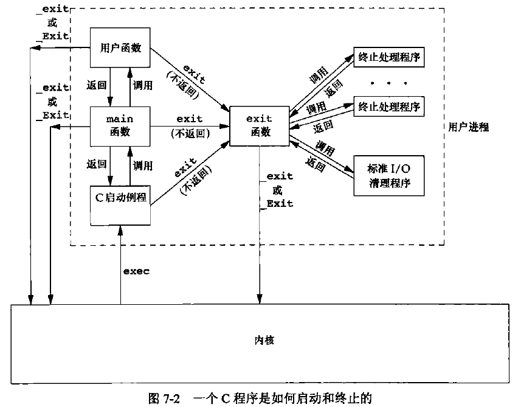
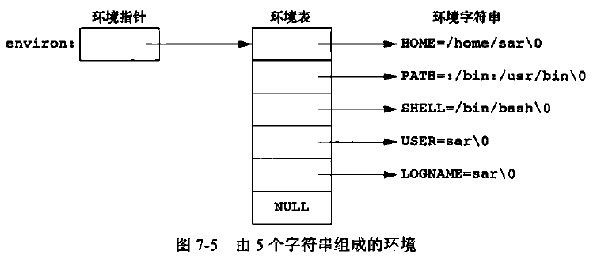
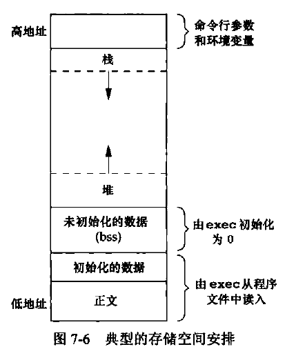
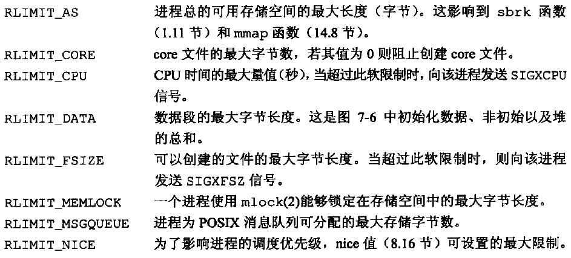
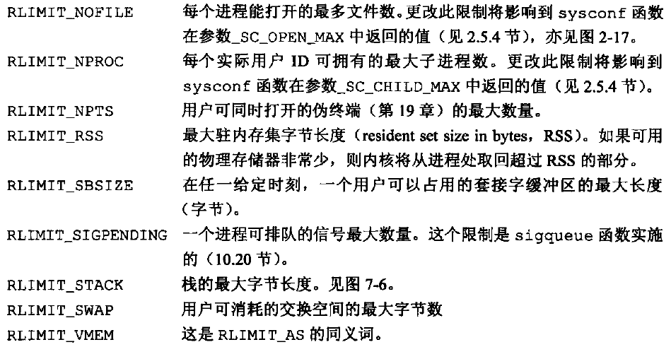

[TOC]


# 7.1 引言

* 当程序执行时，其main函数是如何被调用的；
* 命令行参数是如何传递给新程序的；
* 典型的存储空间布局是什么样式；
* 如何分配另外的存储空间；
* 进程如何使用环境变量；
* 进程的各种不同终止方式；
* 查看进程的资源限制。


# 7.2 main 函数

C程序总是从`main`函数开始执行。main函数的原型：
```C++
int main(int argc, char *argv[]);
```
其中，argc是命令行参数的数目，argv是指向参数的各个指针所构成的数组。

当内核执行C程序时，在调用main前先调用一个特殊的**启动例程**。可执行程序文件将此启动例程指定为程序的起始地址。启动例程从内核取得命令行参数和环境变量值，然后为调用main函数做好安排。


# 7.3 进程终止

有8种方式使进程终止，其中5种为正常终止，它们是:
1. 从main返回；
2. 调用exit；
3. 调用_exit或_Exit；
4. 最后一个线程从其启动例程返回；
5. 从最后一个线程调用pthread_exit。
异常终止有3种方式，它们是:
6. 调用abort；
7. 接到一个信号；
8. 最后一个线程对取消请求做出响应。


## 退出函数

3个函数用于正常终止一个程序：**_exit和_Exit立即进入内核，exit则先执行一些清理处理，然后返回内核**。
```C++
#include <stdlib.h>

void exit(int status);

void _Exit(int status);


#include <unistd.h>

void _exit(int status);
```
exit函数总是执行一个标准I/O库的清理关闭操作：对于所有打开流调用fclose函数。这造成输出缓冲中的所有数据都被冲洗。

3个退出函数都带一个整型参数，称为终止状态/退出状态。

如果（a）调用这些函数时不带终止状态，或（b）main执行了一个无返回值的return语句，或（c）main没有声明返回类型为整型，则该进程的终止状态是未定义的。其状态取决于main函数返回时栈和寄存器的内容。

main函数返回一个整型值与用该值调用exit是等价的，即在main函数中`exit(0);`等价于`return(0);`。


## 函数 atexit

一个进程可以登记多至32个函数，这些函数将由exit自动调用。我们称这些函数为终止处理程序，并调用`atexit`函数来登记这些函数。
```C++
#include <stdlib.h>

int atexit(void (*function)(void));
//返回值：如成功，返回0；若出错，返回非0。
```
atexit的参数是一个函数地址，当调用此函数时无需向它传递任何参数，也不期望它返回一个值。exit调用这些函数的顺序与它们登记时候的顺序**相反**。同一函数如若登记多次,也会被调用多次。



注意，**内核使程序执行的唯一方法是调用一个exec函数**。进程自愿终止的唯一方法是显式或隐式地（通过调用exit）调用_exit或_Exit。进程也可非自愿地由一个信号使其终止（图中没有显示)。

代码示例
```C++
#include <stdio.h>
#include <stdlib.h>

static void my_exit1(void);
static void my_exit2(void);

int main(void)
{
    if (atexit(my_exit2) < 0){
        printf("can't register my_exit1!\n");
    }
    if (atexit(my_exit1) < 0){
        printf("can't register my_exit1!\n");
    }
    if (atexit(my_exit1) < 0){
        printf("can't register my_exit1!\n");
    }

    printf("main is done!\n");
    return(0);//相当于exit(0)，先执行终止处理函数后再返回内核
    //_Exit(0);//_Exit(0)和exit(0)都直接返回内核，故不会打印终止处理程序中的输出信息
}

static void my_exit1(void)
{
    printf("first exit handler!\n");
}

static void my_exit2(void)
{
    printf("second exit handler!\n");
}
```

运行结果
> main is done!
> first exit handler!
> first exit handler!
> second exit handler!


# 7.4 命令行参数

当执行一个程序时，调用exec的进程可将命令行参数传递给该新程序。

代码示例
```C++
#include <stdio.h>
#include <stdlib.h>

int main(int argc, char *argv[])
{
    for (int i = 0; i < argc; i++)
    {
        printf("argv[%d]: %s \n",i,argv[i]);
    }

    exit(0);
}
```

运行结果
> taojikun@taojikun-virtual-machine:~/taojikun/APUE/07-进程环境$ **./echoarg cat echoarg.c**
> 
> argv[0]: ./echoarg 
> argv[1]: cat 
> argv[2]: echoarg.c 


# 7.5 环境表

每个程序都接收到一张环境表。与参数表一样，环境表也是一个字符指针数组，其中每个指针包含一个以null结束的C字符串的地址。全局变量environ（环境指针）则包含了该指针数组的地址：`extern char **environ;`。



通常用`getenv`和`putenv`函数来访问特定的环境变量，而不是用environ变量。但是，如果要查看整个环境，则必须使用environ指针。


# 7.6 C程序的存储空间布局

C程序由下列几部分组成：
* **正文段**。这是由CPU执行的机器指令部分。通常，正文段是可共享的，所以即使是频繁执行的程序（如文本编辑器、C编译器和shell等）在存储器中也只需有一个副本，另外，正文段常常是只读的，以防止程序由于意外而修改其指令。
* **初始化数据段**。通常将此段称为数据段，它包含了程序中需明确地赋初值的变量（已初始化的全局变量、全局静态变量、局部静态变量、常量数据）。
* **未初始化数据段**。通常将此段称为bss段，在程序开始执行之前内核将此段中的数据初始化为0或空指针（未初始化的全局变量、全局静态变量）。
* **栈**。自动变量以及每次函数调用时所需保存的信息都存放在此段中。每次函数调用时，其返回地址以及调用者的环境信息（如某些机器寄存器的值）都存放在栈中。然后，最近被调用的函数在栈上为其自动和临时变量分配存储空间。通过以这种方式使用栈，C递归函数可以工作。递归函数每次调用自身时，就用一个新的栈帧，因此一次函数调用实例中的变量集不会影响另一次函数调用实例中的变量。
* **堆**。通常在堆中进行动态存储分配。堆位于未初始化数据段和栈之间。



注意，未初始化数据段的内容并不存放在磁盘程序文件中。其原因是，内核在程序开始运行前将它们都设置为0。需要存放在磁盘程序文件中的段只有正文段和初始化数据段。

**Q**：如果一个进程将某个初始化数据段的全局变量的值改变了，但此时内存告急，将此页内存置换出去了，那么下一次再将此可执行文件加载进内存，此时全局变量的值是否是前面修改过后的值？
**A**：不是的。初始化数据段的数据存放在可执行文件中，在进行页面置换的时候，将进程的数据置换到磁盘中的交换区，并没有改变可执行文件中的内容，故再一次加载此可执行文件时，全局变量的值依旧是可执行文件中存储的值。

size(1)命令报告正文段、数据段和bss段的长度（以字节为单位)。输出结果中，第4列和第5列是分别以十进制和十六进制表示的3段总长度。
> taojikun@taojikun-virtual-machine:~/taojikun/APUE/07-进程环境$ **size echoarg**
>    text    data     bss     dec     hex    filename
>    1654     608       8    2270     8de    echoarg


# 7.7 共享库

共享库使得可执行文件中不再需要包含公用的库函数，而只需在所有进程都可引用的存储区中保存这种库例程的一个副本。

程序第一次执行或者第一次调用某个库函数时，用动态链接方法将程序与共享库函数相链接。这**减少了每个可执行文件的长度，但增加了一些运行时间开销**。这种时间开销发生在该程序第一次被执行时，或者每个共享库函数第一次被调用时。共享库的另一个优点是**可以用库函数的新版本代替老版本而无需对使用该库的程序重新连接编辑**。


# 7.8 存储空间分配

函数`malloc`、`calloc`、`realloc`用于动态分配存储空间。这3个分配函数所返回的指针一定是适当对齐的，使其可用于任何数据对象。
```C++
#include <stdlib.h>

void *malloc(size_t size);
void *calloc(size_t nmemb, size_t size);
void *realloc(void *ptr, size_t newsize);
//3个函数返回值；若成功，返回非空指针；若出错，返回NULL。

void free(void *ptr);
```
malloc函数分配指定字节数的存储区。此存储区中的初始值不确定。
calloc函数为指定数量指定长度的对象分配存储空间。该空间中的每一位（bit）都初始化为0。
realloc函数增加或减少以前分配区的长度。当增加长度时，可能需将以前分配区的内容移到另一个足够大的区域，以便在尾端提供增加的存储区，而新增区域内的初始值则不确定。若ptr是一个空指针，则realloc的功能与malloc相同，用于分配一个指定长度为newsize的存储区。
函数free释放ptr指向的存储空间，被释放的空间通常被送入可用存储区池。

上述三个分配例程通常用sbrk(2)系统调用实现，该系统调用扩充（或缩小）进程的堆。虽然sbrk可以扩充或缩小进程的存储空间，但是大多数malloc和free的实现都不减小进程的存储空间。释放的空间可供以后再分配，但将它们保持在malloc池中而不返回给内核。


# 7.9 环境变量

环境字符串的形式是：`name=value`。

函数`getenv`可以用于取环境变量值。
```C++
#include <stdlib.h>

char *getenv(const char *name);
//返回值；指向与name关联的value的指针；若未找到，返回NULL。
```

```C++
#include <stdlib.h>

int putenv(char *string);
//函数返回值：若成功，返回0；若出错，返回非0。

int setenv(const char *name, const char *value, int rewrite);

int unsetenv(const char *name);
//两个函数返回值：若成功，返回0；若出错，返回-1。
```
putenv取形式为name=value的字符串，将其放到环境表中。如果name已经存在，则先删除其原来的定义。
setenv将name设置为value。如果在环境中name已经存在，那么若rewrite非0，则首先删除其现有的定义；若rewrite为0，则不删除其现有定义（name不设置为新的value，而且也不出错）。
unsetenv删除name的定义。即使不存在这种定义也不算出错。

改变现有变量的值，或者是增加新的环境变量，能影响的只是当前进程及其后生成和调用的任何子进程的环境，但不能影响父进程的环境。

环境表（指向实际name=value字符串的指针数组）和环境字符串通常存放在进程存储空间的顶部（栈之上）。

删除一个字符串只要先在环境表中找到该指针，然后将所有后续指针都向环境表首部顺次移动一个位置。

增加一个字符串或修改一个现有的字符串就困难得多。环境表和环境字符串通常占用的是进程地址空间的顶部，所以它不能再向高地址方向扩展，同时也不能移动在它之下的各栈帧，所以它也不能向低地址方向扩展。两者组合使得该空间的长度不能再增加。

1. 如果修改一个现有的name：
a. 如果新value的长度少于或等于现有value的长度，则只要将新字符串复制到原字符串所用的空间中；
b. 如果新value的长度大于原长度，则必须调用malloc为新字符串分配空间，然后将新字符串复制到该空间中，接着使环境表中针对name的指针指向新分配区。
2. 如果要增加一个新的name，首先必须调用malloc为name=value字符串分配空间，然后将该字符串复制到此空间中。
a. 如果这是第一次增加一个新name，则必须调用malloc为新的指针表分配空间。接着，将原来的环境表复制到新分配区，并将指向新name=value字符串的指针存放在该指针表的表尾，然后又将一个空指针存放在其后。最后使environ指向新指针表。如果原来的环境表位于栈顶之上，那么必须将此表移至堆中。但是，此表中的大多数指针仍指向栈顶之上的各name=value字符串。
b. 如果这不是第一次增加一个新name，则可知以前已调用malloc在堆中为环境表分配了空间，所以只要调用realloc，以分配比原空间多存放一个指针的空间。然后将指向新name=value字符串的指针存放在该表表尾，后面跟着一个空指针。


# 7.10 函数 setjmp 和 longjmp

在C中，goto语句是不能跨越函数的，而执行这种类型跳转功能的是函数`setjmp`和`longjmp`。这两个函数对于**处理发生在很深层嵌套函数调用中的出错情况**是非常有用的。（普通的C语言goto语句在一个函数内实施的跳转，而setjmp和longjmp函数是在栈上跳过若干调用帧，返回到当前函数调用路径上的某一个函数中。）
```C++
#include <setjmp.h>

int setjmp(jmp_buf env);
//返回值：若直接调用，返回0；若从longjmp返回，则为非0。

void longjmp(jmp_buf env, int val);
```
在希望返回到的位置调用setjmp，setjmp参数env的类型是一个特殊类型jmp_buf，这一数据类型是某种形式的数组，其中存放在调用longjmp时能用来恢复栈状态的所有信息。因为需在另一个函数中引用env变量，所以通常将env变量定义为全局变量。
当检查到一个错误时，以两个参数调用longjmp函数（第一个参数是在调用setjmp时所用的erv；第二个参数是具非0值的val，它将成为从setjmp处返回的值）。

使用第二个参数的原因是对于一个setjmp可以有多个longjmp。

代码示例
```C++
#include <stdio.h>
#include <stdlib.h>
#include <setjmp.h>

int func1(int i, int j, int k, int l);
void func2();

static jmp_buf jumpbuffer;
static int globval;

int main(void)
{
    int autoval;
    register int regival;
    volatile int volaval;
    static int statval;

    globval = 1; autoval = 2; regival = 3; volaval = 4; statval = 5;

    if (setjmp(jumpbuffer) != 0) {
        printf("after longjmp:\n");
        printf("globval = %d, autoval = %d, regival = %d,"
            " volaval = %d, statval = %d\n",
            globval, autoval, regival, volaval, statval);
        exit(0);
    }


    globval = 95; autoval = 96; regival = 97; volaval = 98;
    statval = 99;
    
    func1(autoval, regival, volaval, statval);	/* never returns */
    exit(0);
}


int func1(int i, int j, int k, int l)
{
    printf("in func1():\n");
    printf("globval = %d, autoval = %d, regival = %d,"
        " volaval = %d, statval = %d\n", globval, i, j, k, l);
    func2();
}


void func2()
{
    longjmp(jumpbuffer,1);
}
```

运行结果
> *不进行任何优化的编译*
> taojikun@taojikun-virtual-machine:~/taojikun/APUE/07-进程环境$ **gcc testjmp.c -o testjmp**
> 
> taojikun@taojikun-virtual-machine:~/taojikun/APUE/07-进程环境$ **./testjmp** 
> 
> in func1():
> globval = 95, autoval = 96, regival = 97, volaval = 98, statval = 99
> after longjmp:
> globval = 95, autoval = 96, regival = 3, volaval = 98, statval = 99
> 
> *进行全部优化的编译*
> taojikun@taojikun-virtual-machine:~/taojikun/APUE/07-进程环境$ **gcc -O  testjmp.c -o testjmp**
> 
> taojikun@taojikun-virtual-machine:~/taojikun/APUE/07-进程环境$ **./testjmp** 
> 
> in func1():
> globval = 95, autoval = 96, regival = 97, volaval = 98, statval = 99
> after longjmp:
> globval = 95, autoval = 2, regival = 3, volaval = 98, statval = 99

由结果可看出：全局变量、静态变量和易失变量(volatile)不受优化的影响，在longjmp过后他们的值是最近所呈现的值。

在我这个系统里面，存放在存储器中的变量将具有longjmp时的值，而在CPU和浮点寄存器中的变量则恢复为调用setjmp时的值。不进行优化时，代码中5个变量都存放在存储器中（忽略了对regival变量的register存储类说明）。而进行了优化后，autoval和regival都存放在寄存器中，volatile变量则仍存放在存储器中。


# 7.11 函数 getrlimit 和 setrlimit

每个进程都有一组资源限制，其中一些可以用`getrlimit`和`setrlimit`函数查询和更改。
```C++
#include <sys/time.h>
#include <sys/resource.h>

int getrlimit(int resource, struct rlimit *rlim);

int setrlimit(int resource, const struct rlimit *rlim);
//两个函数返回值；若成功，返回0；若出错，返回非0。

struct rlimit {
    rlim_t rlim_cur;  /* Soft limit */
    rlim_t rlim_max;  /* Hard limit (ceiling for rlim_cur) */
};
```
在更改资源限制时，须遵循下列3条规则：
1. 任何一个进程都可将一个软限制值更改为小于或等于其硬限制值。
2. 任何一个进程都可降低其硬限制值，但它必须大于或等于其软限制值。这种降低，对普通用户而言是不可逆的。
3. 只有超级用户进程可以提高硬限制值。

常量RLIM_INFINITY指定了一个无限量的限制。

> 这两个函数的resowrce参数取值如下：
> 
> 

