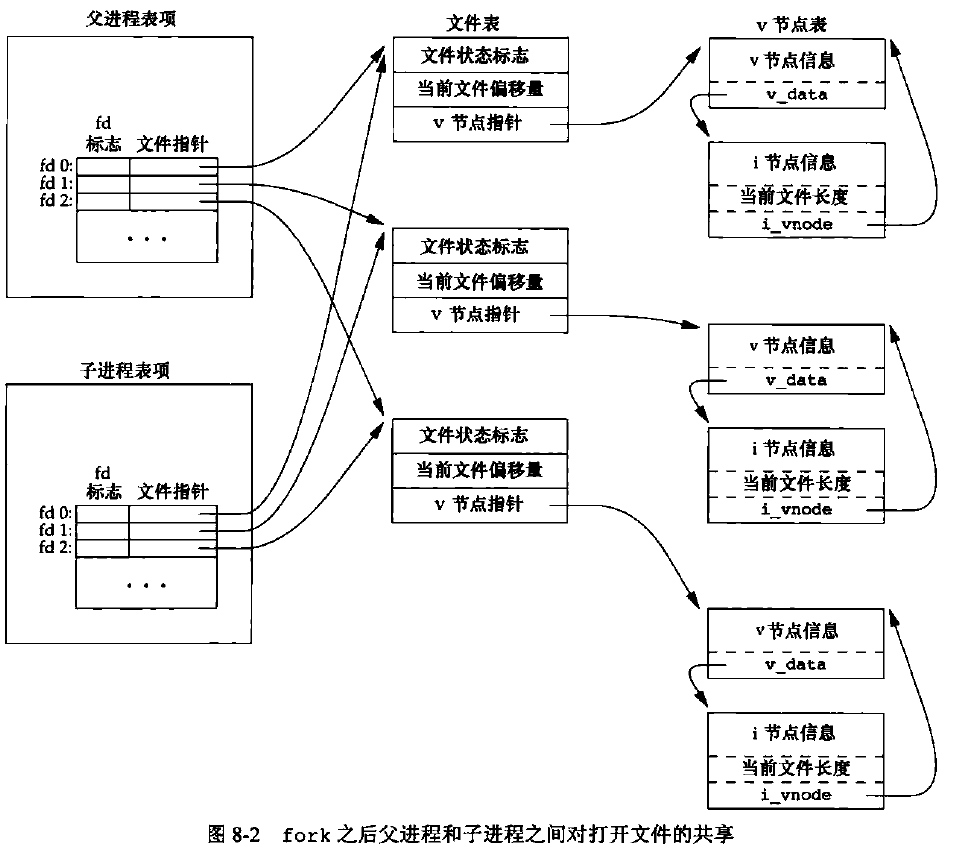
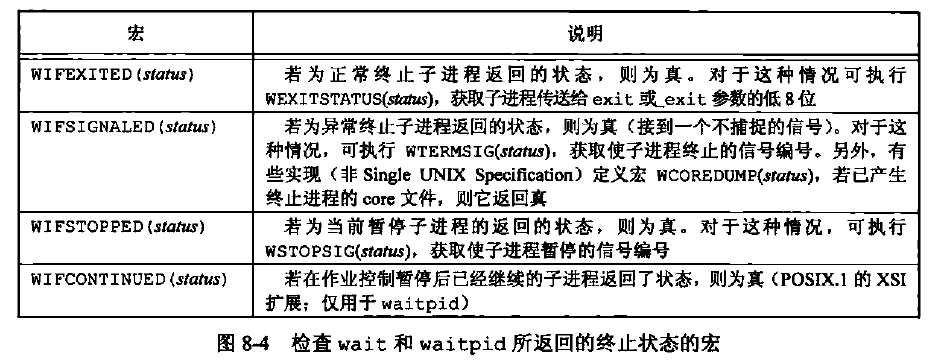
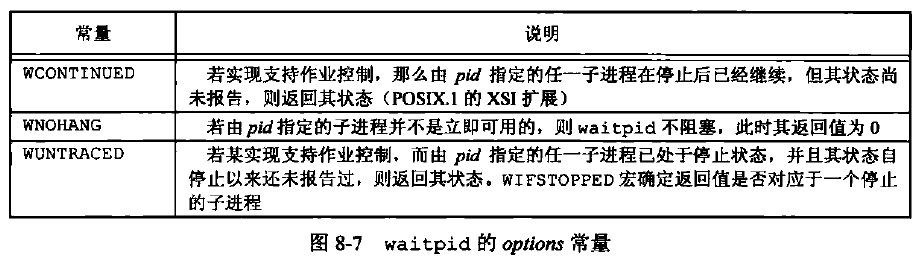
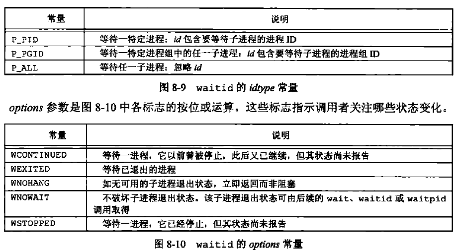
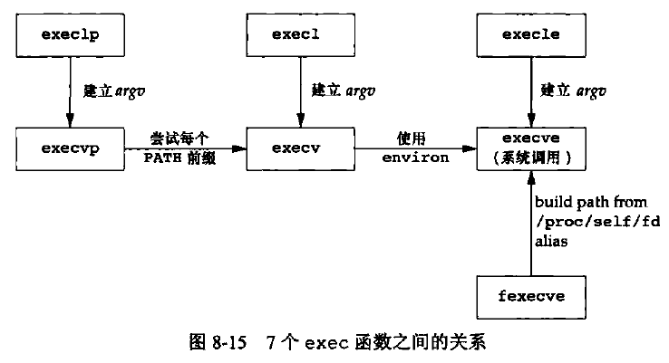
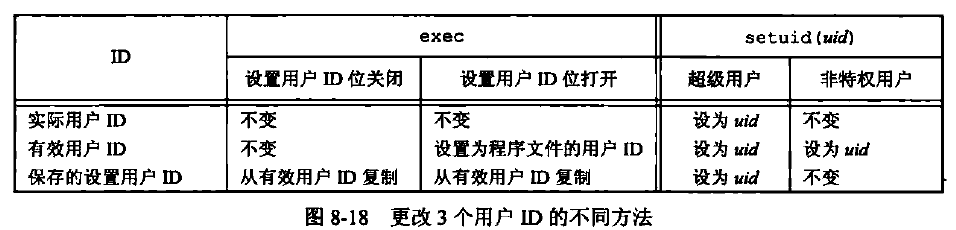
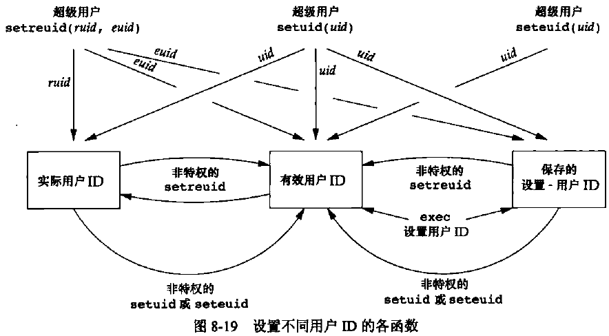

[TOC]


# 8.1 引言

创建新进程、执行程序、进程终止、进程属性ID（实际、有效和保存的用户ID和组ID）、解释器文件、system函数、进程会计机制


# 8.2 进程标识

每个进程都有一个**非负整型**表示的**唯一**进程ID。

进程ID标识符总是唯一的，常将其用作其他标识符的一部分以保证其唯一性。虽然是唯一的，但是**进程ID是可复用的**。当一个进程终止后，其进程ID就成为复用的候选者。大多数UNIX系统实现**延迟复用算法**，使得赋予新建进程的ID不同于最近终止进程所使用的ID。这防止了将新进程误认为是使用同一ID的某个已终止的先前进程。

ID为0的进程通常是**调度进程**，常常被称为交换进程。该进程是**内核的一部分**，它并不执行任何磁盘上的程序，因此也被称为系统进程。

进程ID为1的进程通常是**init进程**，在自举过程结束时由内核调用。此进程负责在自举内核后启动一个UNIX系统。init通常读取与系统有关的初始化文件，并将系统引导到一个状态（如多用户)。**init进程决不会终止**。它是一个**普通的用户进程**（与交换进程不同，它不是内核中的系统进程)，但是它**以超级用户特权运行**。

```C++
#include <unistd.h>

pid_t getpid(void);
//返回值：调用进程的进程ID

pid_t getppid(void);
//返回值：调用进程的父进程ID

uid_t getuid(void);
//返回值：调用进程的实际用户ID

uid_t geteuid(void);
//返回值：调用进程的有效用户ID

gid_t getgid(void);
//返回值：调用进程的实际组ID

gid_t getegid(void);
//返回值：调用进程的有效组ID
```


# 8.3 函数fork

一个现有的进程可以调用`fork`函数创建一个新进程。
```C++
#include <unistd.h>

pid_t fork(void);
//返回值：子进程返回0，父进程返回子进程ID；若出错，返回-1。
```

父子进程共享正文段，但是不共享数据空间、栈和堆空间。
在fork之后是父进程先执行还是子进程先执行一般来说是不确定的。

代码示例
```C++
#include <stdio.h>
#include <stdlib.h>
#include <unistd.h>

int globval = 6;
char buf[] = "a write to stdout!\n";

int main(void)
{
    int var;
    pid_t pid;

    var =88;
    if (write(STDOUT_FILENO,buf,sizeof(buf)-1) != sizeof(buf)-1)
    {
        printf("write() error!\n");
    }
    printf("before fork()\n");

    if ((pid = fork()) < 0)
    {
        printf("fork() error!\n");
    }

    if (pid == 0)
    {
        /* child */
        globval++;
        var++;
    }
    else
    {
        /* parent */
        sleep(2);
    }

    printf("pid = %ld, globval = %d, var = %d \n",(long)getpid(),globval,var);

    exit(0);
}
```

运行结果
> taojikun@taojikun-virtual-machine:~/taojikun/APUE/08-进程控制$ **./fork1** 
> a write to stdout!
> before fork()
> pid = 11208, globval = 7, var = 89 
> pid = 11207, globval = 6, var = 88  
> 
> taojikun@taojikun-virtual-machine:~/taojikun/APUE/08-进程控制$ **./fork1 > temp.out**
> 
> taojikun@taojikun-virtual-machine:~/taojikun/APUE/08-进程控制$ **cat temp.out** 
> a write to stdout!
> before fork()
> pid = 11702, globval = 7, var = 89 
> before fork()
> pid = 11701, globval = 6, var = 88 

将./fork1的结果重定向到临时文件temp.out后，输出两次before fork() 的原因：
- 当以交互方式运行该程序时，只得到该printf输出的行一次，其原因是标准输出缓冲区由换行符冲洗。
- 当将标准输出重定向到一个文件时，却得到printf输出行两次。其原因是,在fork之前调用了printf一次，但当调用fork时，该行数据仍在缓冲区中，然后在将父进程数据空间复制到子进程中时，该缓冲区数据也被复制到子进程中，此时父进程和子进程各自有了带该行内容的缓冲区。

fork的一个特性是父进程的所有打开文件描述符都被复制到子进程中。父进程和子进程每个相同的打开描述符共享一个文件表项。

父进程和子进程共享同一个文件偏移量。


使fork失败的两个主要原因是:（a）系统中已经有了太多的进程；（b）该实际用户ID的进程总数超过了系统限制（CHILD_MAX规定了每个实际用户ID在任一时刻可拥有的最大进程数）。


# 8.4 函数 vfork

vfork函数用于创建一个新进程，而该新进程的目的是exec一个新程序。

```C++
#include <unistd.h>

pid_t vfork(void);
//返回值：子进程返回0，父进程返回子进程ID；若出错，返回-1。
```
vfork与fork一样都创建一个子进程，但是它并不将父进程的地址空间完全复制到子进程中，因为子进程会立即调用exec或exit，于是也就不会引用该地址空间。不过**在子进程调用exec或exit之前，它在父进程的空间中运行**。这种优化工作方式在某些UNIX系统的实现中提高了效率，但如果子进程修改数据（除了用于存放vfork返回值的变量）、进行函数调用、或者没有调用exec或exit就返回都可能会带来未知的结果。

vfork和fork之间的另一个区别是: **vfork保证子进程先运行，在它调用exec或exit之后父进程才可能被调度运行**，当子进程调用这两个函数中的任意一个时，父进程会恢复运行（如果在调用这两个函数之前子进程依赖于父进程的进一步动作，则会导致死锁）。

代码示例
```C++
#include <stdio.h>
#include <stdlib.h>
#include <unistd.h>

int globval = 6;

int main(void)
{
    int var;
    __pid_t pid;

    var =88;
    printf("before fork()\n");

    if ((pid = vfork()) < 0)
    {
        printf("vfork() error!\n");
    }

    if (pid == 0)
    {
        /* child */
        //在exit之前它在父进程的空间中运行，因此会改变父进程之中的变量值
        globval++;
        var++;
        printf("pid = %ld, globval = %d, var = %d \n",(long)getpid(),globval,var);
        _exit(0);//不像exit那样会执行清理操作，某些实现下exit可能会关闭标准I/O流，那么父进程就不会有任何输出

        //子进程执行了exit函数后父进程才会被调度运行
    }

    printf("pid = %ld, globval = %d, var = %d \n",(long)getpid(),globval,var);

    exit(0);
}
```

运行结果
> before fork()
> pid = 12209, globval = 7, var = 89 
> pid = 12208, globval = 7, var = 89 


# 8.5 函数 exit

五种正常终止方式：
1. 在main函数内执行return语句，等效于调用exit；
2. 调用exit函数，其调用包括调用各种终止程序，然后关闭所有的标准I/O；
3. 调用_Exit或_exit函数，为进程提供一种无需运行终止处理程序或信号处理程序而终止的方法；
4. 进程的最后一个线程在其启动例程中执行return语句。但是，该线程的返回值不用作进程的返回值。当最后一个线程从其启动例程返回时，该进程以终止状态0返回；
5. 进程的最后一个线程调用pthread_exit函数。在这种情况中，进程终止状态总是0。

三种异常终止方式：
1. 调用abort，产生SIGABRT信号；
2. 当进程接收到某些信号时。信号可由进程自身（如调用abort函数）、其他进程或内核产生；
3. 最后一个线程对“取消”请求作出响应。默认情况下，“取消”以延迟方式发生：一个线程要求取消另一个线程，若干时间之后，目标线程终止。

对于exit、_exit和_Exit3个终止函数，将其退出状态作为参数传送给函数。

在异常终止情况，内核（不是进程本身）产生一个指示其异常终止原因的终止状态，在任意一种情况下，该终止进程的父进程都能用`wait`或`waitpid`函数取得其终止状态。

**init进程收养**：对于父进程已经终止的所有进程，它们的父进程都改变为init进程。其操作过程大致是：在一个进程终止时，内核逐个检查所有活动进程，如果它是否是正要终止进程的子进程，则该进程的父进程ID就更改为1（init进程的ID）。这种处理方法保证了每个进程有一个父进程。

**僵死进程**：已经终止、但是其父进程尚未对其进行善后处理（获取终止子进程的有关信息、释放它仍占用的资源）的进程。

init进程被编写成无论何时只要有一个子进程终止，init进程就会调用一个wait函数取得其终止状态，以防止在系统中塞满僵死进程。


# 8.6 函数 wait 和 waitpid

当一个进程正常或异常终止时，内核就向其父进程发送STGCELD信号。

子进程终止是个异步事件（这可以在父进程运行的任何时候发生），所以这种信号也是内核向父进程发的异步通知。父进程可以选择忽略该信号，或者提供一个该信号发生时即被调用执行的函数（信号处理程序）。

调用wait或waitpid的进程可能会发生：
* 如果其所有子进程都还在运行，则阻塞；
* 如果一个子进程已终止，正等待父进程获取其终止状态，则取得该子进程的终止状态立即返回。
* 如果它没有任何子进程，则立即出错返回。

```C++
#include <sys/wait.h>

pid_t wait(int *wstatus);

pid_t waitpid(pid_t pid, int *wstatus, int options);
//两个函数返回值：若成功，返回进程ID；若出错，返回0或-1。
```
在一个子进程终止前，wait使其调用者阻塞，而waitpid有一选项，可使调用者不阻塞。
wait等待在其调用之后的第一个终止子进程，而waitpid它有若干个选项，可以控制它所等待的进程。


waitpid的pid参数的作用：
* pid == -1：等待任一子进程，此时和wait等效；
* pid > 0：等待进程ID等于pid的进程；
* pid == 0：等待组ID等于调用进程组ID的任一进程；
* pid < -1：等待组ID等于pid绝对值的任一进程。

wait出错原因：调用进程没有子进程。
waitpid出错原因：指定的进程或进程组不存在，或者参数pid指定的进程不是调用进程的子进程。



waitpid相较于wait的优势：
* waitpid可等待一个特定的进程，而wait则返回任一终止子进程的状态；
* waitpid提供了一个wait的非阻塞版本；
* waitpid通过WUNTRACED和WCONTINUED选项支持作业控制。


# 8.7 函数 waitid

```C++
#include <sys/wait.h>

int waitid(idtype_t idtype, id_t id, siginfo_t *infop, int options);
//返回值：若成功，返回0；若出错，返回-1。
```
与waitpid相似，waitid允许一个进程指定要等待的子进程，但它使用两个单独的参数表示要等待的子进程所属的类型，而不是将此与进程ID或进程组ID组合成一个参数。


WCONTINUED、WEXTTED或WSTOPPED这3个常量之一必须在options参数中指定。
infop参数是指向siginfo结构的指针。该结构包含了造成子进程状态改变有关信号的详细信息。


# 8.8 函数 wait3 和 wait4

```C++
#include <sys/types.h>
#include <sys/time.h>
#include <sys/resource.h>
#include <sys/wait.h>

pid_t wait3(int *wstatus, int options, struct rusage *rusage);

pid_t wait4(pid_t pid, int *wstatus, int options, struct rusage *rusage);
//两个函数返回值：若成功，返回进程ID；若出错，返回-1。
```
wait3、wait4函数提供的功能比wait、waitpid和waitid函数所提供功能的要多一个，这与附加参数有关。该参数允许内核返回由终止进程及其所有子进程使用的用户CPU时间总量、系统CPU时间总量、缺页次数、接收到信号的次数等资源概况。


# 8.9 竞争条件

代码示例
```C++
#include <stdio.h>
#include <stdlib.h>
#include <unistd.h>


void charactatime(char *str);


int main()
{
    __pid_t pid;
    if ((pid = fork()) < 0)
    {
        printf("fork() error!\n");
    }
    else if(pid == 0)
    {
        charactatime("output from child!\n");
    }
    else
    {
        charactatime("output from parent!\n");
    }
    exit(0);
}


void charactatime(char *str)
{
    char *ptr;
    int c;

    setbuf(stdout,NULL);//将标准输出设置为无缓冲的，使得每一次输出都要进行I/O
    for(ptr = str;*ptr!=0;++ptr)
    {
        c=*ptr;
        putc(c,stdout);
    }
}
```

运行结果
> output from parenotu!t
> put from child!


# 8.10 函数 exec

用fork函数创建新的子进程后，子进程往往要调用一种exec函数以执行另一个程序。当进程调用一种exec函数时，该进程执行的程序完全替换为新程序，而新程序则从其main函数开始执行。因为调用exec并不创建新进程，所以前后的进程ID并未改变。

exec只是用磁盘上的一个新程序替换了当前进程的正文段、数据段、堆段和栈段。

```C++
#include <unistd.h>

int execl(const char *path, const char *arg, ... /* (char  *) NULL */);

int execv(const char *path, char *const argv[]);

int execle(const char *path, const char *arg, ... /*, (char *) NULL, char * const envp[] */);

int execve(const char *filename, char *const argv[], char *const envp[]);

int execlp(const char *file, const char *arg, ... /* (char  *) NULL */);

int execvp(const char *file, char *const argv[]);

int fexecve(int fd, char *const argv[], char *const envp[]);
//7个函数返回值：若成功，不返回；若出错，返回-1。
```
这些函数之间的第一个区别是前4个函数取路径名作为参数，后两个函数则取文件名作为参数，最后一个取文件描述符作为参数。

当指定filename 作为参数时：如果filename中包含/，则就将其视为路径名；否则就按PATH环境变量，在它所指定的各目录中搜寻可执行文件。

在执行exec后，进程ID没有改变，但新程序从调用进程继承了的下列属性：进程ID和父进程ID、实际用户ID和实际组ID、附属组ID、进程组ID、会话ID、控制终端、闹钟尚余留的时间、当前工作目录、根目录、文件模式创建屏蔽字、文件锁、进程信号屏蔽、未处理信号资源限制、nice值、tms_utime、tms_stime、tms_cutime以及tns_cstime值。



对于FD_CLOEXEC标志：进程中每个打开描述符都有一个执行时关闭标志。若设置了此标志，则在执行exec时关闭该描述符；否则该描述符仍打开。除非特地用fcntl设置了该执行时关闭标志，否则系统的默认操作是在exec后仍保持这种描述符打开。


# 8.11 更改用户ID和更改组ID

可以用setuid函数设置实际用户ID和有效用户ID，可以用setgid函数设置实际组ID和有效组ID。
```C++
#include <unistd.h>

int setuid(uid_t uid);

int setgid(gid_t gid);
//两个函数返回值：若成功，返回0；若出错，返回-1。
```

更改用户ID规则：
* 若进程具有超级用户特权，则setuid函数将实际用户ID、有效用户ID以及保存的设置用户ID设置为uid。
* 若进程没有超级用户特权，但是uid等于实际用户ID或保存的设置用户ID，则setuid只将有效用户ID设置为uid。不更改实际用户ID和保存的设置用户ID。
* 如果上面两个条件都不满足，则errno设置为EPERM，并返回-1。

关于内核所维护的3个用户ID（实际用户ID、有效用户ID、保存的设置用户ID），还要注意以下几点：
1. 只有超级用户进程可以更改实际用户ID。通常，实际用户ID是在用户登录时，由login(1)程序设置的，而且决不会改变它。因为 login是" 一个超级用户进程，当它调用setuid时，设置所有3个用户ID.
2. 仅当对程序文件设置了设置用户ID位时，exec函数才设置有效用户ID。如果设置用户ID位没有设置，exec函数不会改变有效用户ID，而将维持其现有值。任何时候都可以调用setuid，将有效用户ID设置为实际用户ID或保存的设置用户ID。自然地，不能将有效用户ID设置为任一随机值。
3. 保存的设置用户ID是由exec复制有效用户ID而得到的。如果设置了文件的设置用户ID位，则在exec根据文件的用户ID设置了进程的有效用户ID以后，这个副本就被保存起来了。




setreuid函数的功能是交换实际用户ID和有效用户ID的值。
```C++
#include <unistd.h>

int setreuid(uid_t ruid, uid_t euid);
int setregid(gid_t rgid, gid_t egid);
//两个函数返回值：若成功，返回0；若出错，返回-1。
```
如若其中任一参数的值为-1，则表示相应的ID应当保持不变。

相关规则很简单：一个非特权用户总能交换实际用户ID和有效用户ID。这就允许一个设置用户ID程序转换成只具有普通用户的普通权限，以后又可再次转换回设置用户ID所得到的额外权限。

setuid和setgid函数只更改有效用户ID和有效组ID。
```C++
#include <unistd.h>

int seteuid(uid_t uid);
int setegid(gid_t gid);
//两个函数返回值：若成功，返回0；若出错，返回-1。
```
一个非特权用户可将其有效用户ID设置为其实际用户ID或其保存的设置用户ID。对于一个特权用户，则可将其有效用户ID设置为uid。（这有别于setuid函数，它会更改所有三个用户ID）。




# 8.12 解释器文件

所有现今的UNIX系统都支持解释器文件（也可称为解释器脚本）。这种文件是文本文件，其起始行格式是：`#! pathname [optional-argument]`

pathname通常是绝对路径名，对它不使用PATH进行路径搜索。对这种文件的识别是由内核作为exec系统调用处理的一部分来完成的。内核调用exec函数的进程实际执行的并不是该解释器文件，而是该解释器文件第一行中pathname所指定的文件。一定要将解释器文件（文本文件，它以#!开头）和解释器（由该解释器文件第一行中的pathname指定）区分开来。

要知道很多系统对解释器文件的第一行有长度限制。这些限制包括#!、pathname、可选参数、终止换行符以及空格数。

解释器文件的优点：
1. 有些程序是用某种语言编写的脚本，解释器文件可将这一事实隐藏起来。
2. 解释器脚本在效率方面也提供了好处，其代价是内核的额外开销（因为识别解释器文件的是内核）。
3. 解释器脚本使我们可以使用除/bin/sh以外的其他shell来编写shell脚本。


# 8.13 函数 system

在程序中执行一个命令字符串。
```C++
#include <stdlib.h>

int system(const char *command);
```
如果cmdstring是一个空指针，则仅当命令处理程序可用时，system返回非0值，这一特征可以确定在一个给定的操作系统上是否支持system函数。在UNIX中，system总是可用的。

因为system在其实现中调用了fork、exec和waitpid，因此有三种返回值：
1. 如果fork失败或者waitpid返回除EINTR之外的出错，则system返回-1，并且在errno中设置相应的错误类型值。
2. 如果exec失败（表示不能执行shell），则其返回值如同shell执行了exit(127)一样。
3. 否则所有三个函数（fork、exec和waitpid）都执行成功，并且system的返回值是shell的终止状态，其格式已在waipid中说明。

使用system而不是直接使用fork和exec的优点是：system进行了所需的各种出错处理，以及各种信号处理。

如果一个进程正以特殊的权限（设置用户ID或设置组ID）运行，它又想生成另一个进程执行另一个程序，则它应当直接使用fork和exec，而且在fork之后、exec之前要改回到普通权限。设置用户ID或设置组ID程序决不应调用system函数。


# 8.14 进程会计

大多数UNIX系统提供了一个选项以进行进程会计（process accounting）处理。启用该选项后，每当进程结束时内核就写一个会计记录。典型的会计记录包含总量较小的二进制数据，一般包括命令名、所使用的CPU时间总量、用户ID和组ID、启动时间等。

会计记录所需的各种数据（如CPU时间、传输的字符数）都由内核保存在进程表中，并在一个新进程被创建时置初值（例如调用fork之后在子进程中）。每次进程终止时都会编写一条会计记录。

会计记录对应于进程而不是程序。在fork之后，内核为子进程初始化一个记录，而不是在一个新程序被执行时做这项工作。虽然exec并不创建一个新的会计记录，但改变了相应记录中的命令名，并且AFORK标志会被清除。这意味着，如果一个进程顺序执行了三个程序（A exec B，然后B exec C，最后C exit），但只会写一条会计记录。该记录中的命令名对应于程序C，但CPU时间是程序A、B、C之和。


# 8.15 用户标识

一个用户可以有多个登录名，这些登录名可以对应着同一个用户ID。

系统通常记录用户登陆时使用的名字，可以使用`getlogin`函数获取此登录名。
```C++
#include <unistd.h>

char *getlogin(void);
//返回值：若成功，返回指向登录名字符串的指针；若出错，返回NULL。
```
如果调用此函数的进程没有连接到用户登录时所用的终端，则本函数会失败。通常称这些进程为守护进程。


# 8.16 进程调度

UNIX系统历史上对进程提供的只是基于调度优先级的粗粒度的控制。调度策略和调度优先级是由内核确定的。进程可以通过调整nice值选择以更低优先级运行（通过调整nice值降低它对CPU的占有，因此该进程是“友好的”）。只有特权进程允许提高调度权限。

进程可以通过nice函数获取或更改它的nice值。使用这个函数，进程只能影响自己的nice值，不能影响任何其他进程的nice值。
```C++
#include <unistd.h>

int nice(int incr);
//返回值：若成功，返回新的nice值NZERO；若出错，返回-1。
```
incr参数被增加到调用进程的nice值上。如果incr太大，系统直接把它降到最大合法值，不给出提示。类似地，如果incr太小，系统也会无声息地把它提高到最小合法值。由于-1是合法的成功返回值，在调用nice函数之前需要清楚errno，在nice函数返回-1时，需要检查它的值。如果nice调用成功，并且返回值为-1，那么errno仍然为0。如果errno不为0，说明nice调用失败。

`getpriority`函数可以像nice函数那样用于获取进程的nice值，但是getpriority还可以获取一组相关进程的nice值。`setpriority`函数可用于为进程、进程组和属于特定用户ID的所有进程设置优先级。
```C++
#include <sys/resource.h>

int getpriority(int which, id_t who);
//返回值：若成功，返回-NZERO～NZERO-1之间的nice值；若出错，返回-1。

int setpriority(int which, id_t who, int prio);
//返回值：若成功，返回0；若出错，返回-1。
```
which参数可以取以下三个值之一：PRIO_PROCESS表示进程，PRIO_PGRP表示进程组，PRTO_USER表示用户ID。

which参数控制who参数是如何解释的，who参数选择感兴趣的一个或多个进程。如果who参数为0，表示调用进程、进程组或者用户（取决于which参数的值)。当which设为PRIO_USER并且who为0时，使用调用进程的实际用户ID。如果which参数作用于多个进程，则返回所有作用进程中优先级最高的(最小的nice值)。

setpriority的value参数增加到NZERO上，然后变为新的nice值。


# 8.17 进程时间

任一进程都可调用times函数获得它自己以及已终止子进程的墙上时钟时间、用户CPU时间和系统CPU时间。

```C++
 #include <sys/times.h>

clock_t times(struct tms *buf);
//返回值：若成功，返回流逝的墙上时钟时间（以时钟滴答数为单位）；若出错，返回-1。

struct tms {
    clock_t tms_utime;  /* user CPU time */
    clock_t tms_stime;  /* system CPU time */
    clock_t tms_cutime; /* user CPU time of children */
    clock_t tms_cstime; /* system CPU time of children */
};
```
该结构中两个针对子进程的字段包含了此进程用wait族函数已等待到的各个子进程的值。

times函数返回墙上时钟时间作为其函数值。此值是相对于过去的某一时刻测量的，所以不能用其绝对值，而必须使用其相对值。

所有由此函数返回的clock_t值都用_SC_CLK_TCK（由sysconf函数返回的每秒钟滴答数）变换成秒数。