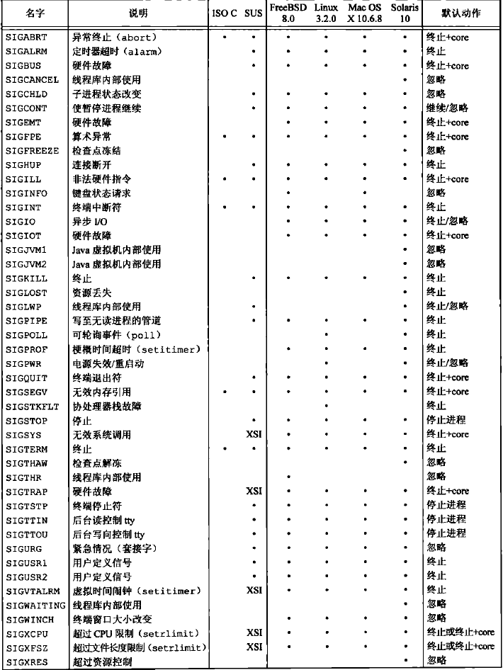
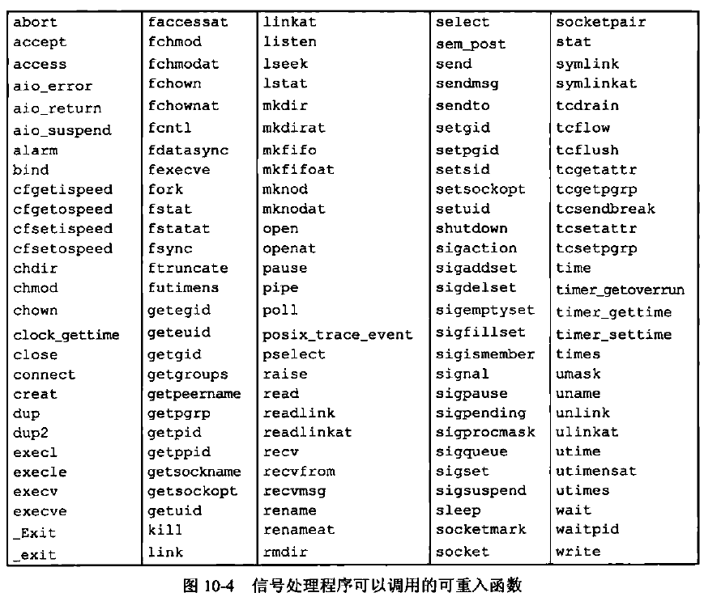
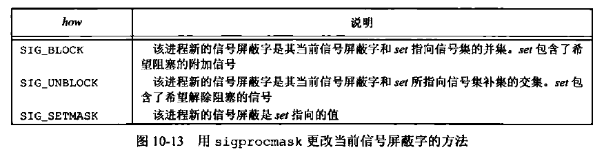

[TOC]


# 10.1 引言

信号是软件中断，信号提供了一种处理异步事件的方法。


# 10.2 信号概念

每个信号都有一个名字。这些名字都以3个字符SIG开头。在头文件<signal.h>中，信号名都被定义为正整数常量（信号编号）。不存在编号为0的信号。在终端中可以使用`kill -l`命令查看所有信号。

产生信号的条件：
1. 用户按某些终端键；
2. 硬件异常产生信号；
3. 进程调用kill(2)函数可将任意信号发送给另一个进程或进程组；
4. 用户可用kill(1)命令将信号发送给其他进程；
5. 检测到某种软件条件已经发生，并应将其通知有关进程时也产生信号。

在某个信号出现时，可以告诉内核按下列3种方式之一进行处理：
1. **忽略此信号**。大多数信号都可使用这种方式进行处理，但STGKILL和SIGSTOP两种信号却决不能被忽略，因为它们向内核和超级用户提供了使进程终止或停止的可靠方法。另外，如果忽略某些由硬件异常产生的信号（如非法内存引用或除以0），则进程的运行行为是未定义的。
2. **捕捉信号**。通知内核在某种信号发生时，调用一个用户函数。在用户函数中，可执行用户希望对这种事件进行的处理。注意，不能捕捉SIGKILL和SIGSTOP信号。
3. **执行系统默认动作**。对大多数信号的系统默认动作是终止该进程。




# 10.3 函数 signal

```C++
#include <signal.h>

void (*signal(int signo, void(*func) (int))) (int);

//等价于👇
typedef void (*sighandler_t)(int);
sighandler_t signal(int signo, sighandler_t handler);
//返回值：若成功，返回以前的信号处理配置；若出错，返回SIG_ERR。
```
signo参数是信号名。func的值是常量SIG_IGN、常量SIG_DFL或当接到此信号后要调用的函数的地址。如果指定SIG_IGN，则向内核表示忽略此信号（信号SIGKILL和SIGSTOP不能忽略）。如果指定SIG_DFL，则表示接到此信号后的动作是系统默认动作。当指定函数地址时，则在信号发生时由内核调用该信号捕捉函数。

代码示例
```C++
#include <stdio.h>
#include <stdlib.h>
#include <unistd.h>
#include <signal.h>

static void sig_usr(int sig);

int main(void)
{
    if(signal(SIGUSR1,sig_usr) == SIG_ERR)
    {
        perror("can't catch SIGUSR1!\n");
    }
    if(signal(SIGUSR2,sig_usr) == SIG_ERR)
    {
        perror("can't catch SIGUSR2!\n");
    }
    for(;;){
        pause();
    }
}

static void sig_usr(int sig)
{
    if (sig == SIGUSR1)
    {
        printf("received SIGUSR1!\n");
    }
    else if(sig == SIGUSR2)
    {
        printf("received SIGUSR2!\n");
    }
    else
    {
        printf("recevied signal %d",sig);
    }
    
}
```

运行结果
> taojikun@taojikun-virtual-machine:~/taojikun/APUE/10-信号$ **./sigusr &**
> > [1] 76187
> 
> taojikun@taojikun-virtual-machine:~/taojikun/APUE/10-信号$ **kill -USR1 76187**
> > received SIGUSR1!
> 
> taojikun@taojikun-virtual-machine:~/taojikun/APUE/10-信号$ **kill -USR2 76187**
> > received SIGUSR2!
> 
> taojikun@taojikun-virtual-machine:~/taojikun/APUE/10-信号$ **kill 76187**
> 
> taojikun@taojikun-virtual-machine:~/taojikun/APUE/10-信号$ 

exec函数将原先设置为要捕捉的信号都更改为默认动作，其他信号的状态则不变（一个进程原先要捕捉的信号，当其执行一个新程序后，就不能再捕捉了，因为信号捕捉函数的地址很可能在所执行的新程序文件中已无意义)。

当一个进程调用fork时，其子进程继承父进程的信号处理方式。因为子进程在开始时复制了父进程内存映像，所以信号捕捉函数的地址在子进程中是有意义的。


# 10.4 不可靠的信号


# 10.5 中断系统的调用

早期UNIX系统的一个特性是：如果进程在执行一个低速系统调用而阻塞期间捕捉到一个信号，则该系绕调用就被中断不再继续执行。该系统调用返回出错，其errno设置为EINTR。

为了支持这种特性，将系统调用分成两类：低速系统调用和其他系统调用。

低速系统调用是可能会使进程永远阻塞的一类系统调用，包括:
* 如果某些类型文件（如读管道、终端设备和网络设备）的数据不存在，则读操作可能会使调用者永远阻塞；
* 如果这些数据不能被相同的类型文件立即接受，则写操作可能会使调用者永远阻塞；
* 在某种条件发生之前打开某些类型文件，可能会发生阻塞（例如要打开一个终端设备，需要先等待与之连接的调制解调器应答);
* pause 函数（按照定义，它使调用进程休眠直至捕捉到一个信号）和wait函数；
* 某些ioctl操作；
* 某些进程间通信函数。

在这些低速系统调用中，一个值得注意的例外是与磁盘I/O有关的系统调用。虽然读写一个磁盘文件可能暂时阻塞调用者（在磁盘驱动器将请求排入队列，然后在适当时间执行请求期间），但是除非发生硬件错误，I/O操作总会很快返回，并使调用者不再处于阻塞状态。


# 10.6 可重入函数

可重入函数主要用于多任务环境中，一个可重入的函数简单来说就是可以被中断的函数（可以在这个函数执行的任何时刻中断它，转入OS调度下去执行另外一段代码，而返回控制时不会出现什么错误）；而不可重入的函数由于使用了一些系统资源，比如全局变量区，中断向量表等，所以它如果被中断的话，可能会出现问题，这类函数是不能运行在多任务环境下的。


其他函数不可重入的原因：
1. 使用了静态数据结构；
2. 调用malloc和free；
3. 它们是标准I/O函数。

由于每个线程只有一个errno变量，所以信号处理程序可能会修改其原先值。因此，作为一个通用的规则，当在信号处理程序中可重入函数时，应当在调用前保存、在调用后恢复errno。


# 10.7 SIGCLD 语义

SIGCHLD信号：是BSD的一个信号，子进程状态改变后产生此信号。
SIGCLD信号：是System V的一个信号

早期SIGCLD信号的处理方式：
1. 如果进程将该信号的配置设置为SIG_IGN，则调用进程的子进程不产生僵死进程。子进程终止时将其状态丢弃。如果这种情况下调用wait，则会阻塞到所有子进程终止后返回-1，并将errno设置为ECHILD。
2. 如果将SIGCLD的配置设置为捕捉，则内核立即检查是否有子进程准备好被等待，如果有则立即执行SIGCLD处理程序。


# 10.8 可靠信号术语和语义

当造成信号的事件发生时，为进程产生一个信号（或向进程发送一个信号）。事件可以是硬件异常、软件条件、终端产生的信号或调用kill函数。

当产生了信号时，内核通常在进程表中设置一个某种形式的标志。

在信号产生和递送到进程之间的时间间隔，称信号是未决的（pending）。

进程可以选用信号递送阻塞。如果为进程产生了一个选择为阻塞的信号，而且对该信号的动作是系统默认动作或捕捉该信号，则为该进程将此信号保持为未决状态，直到该进程（a）对此信号解除了阻塞，或者（b）将对此信号的动作更改为忽略。

内核在递送一个原来被阻塞（现在解除了阻塞）的信号给进程时（而不是在产生该信号时），才决定对它的处理方式。于是进程在信号递送给它之前仍可改变对该信号的动作。进程调用`sigpending`函数来判定哪些信号是设置为阻塞并处于未决状态的。

如果进程解除对某个信号的阻塞之前，这个信号发生了多次，POSIX.1会对这些信号进行排队。但大多数UNIX并不对信号进行排队，只递送这个信号一次。

如果有多个信号要低送给一个进程，建议在其他信号之前递送与进程当前状态有关的信号。

每个进程都有一个信号屏蔽字（signal mask），它规定了当前要阻塞递送到该进程的信号集。对于每种可能的信号，该屏蔽字中都有一位与之对应。对于某种信号，若其对应位已设置，则它当前是被阻塞的。进程可以调用`sigprocmask`来检测和更改其当前信号屏蔽字。

信号数量可能会超过整型所包含的二进制位数，因此POSIX.1定义了一个新数据类型sigset_t，用于保存一个信号集。


# 10.9 函数 kill 和 raise

kill函数将信号发送给进程或进程组。raise函数则允许进程向自身发送信号。
```C++
#include <signal.h>

int kill(pid_t pid, int signo);

int raise(int sig);
//两个函数返回值：若成功，返回0；若出错，返回-1。
```
调用`raise(signo);`等价于`kill(getpid(), signo);`。

kill的pid的四种情况：
* pid > 0 ：将该信号发送给进程ID为pid的进程。
* pid == 0 ：将该信号发送给与发送进程属于同一进程组的除系统进程外的所有进程，而且发送进程具有向这些进程发送信号的权限。
* pid < 0 ：将信号发送给其进程组ID等于pid的绝对值的进程组中除系统进程外的所有进程，而且发送进程具有向其发送信号的权限。
* pid == –1 ：将该信号发送给发送进程有权限向它们发送信号的系统上除系统进程外的所有进程。

进程将信号发送给其他进程需要权限：超级用户可将信号发送给任一进程。对于非超级用户，其基本规则是发送者的实际或有效用户ID必须等于接收者的实际或有效用户ID。在对权限进行测试时也有一个特例：如果被发送的信号是SIGCONT，则进程可将它发送给属于同一会话的任何其他进程。

编号为0的信号定义为空信号。如果signo参数是0，则kill仍执行正常的错误检查，但不发送信号。这常被用来确定一个特定进程是否仍旧存在。如果向一个并不存在的进程发送空信号，则kill返回-1，并将errno设置为ESRCH。


# 10.10 函数 alarm 和 pause

使用alarm函数可以设置一个计时器，在将来某个指定的时间，该计时器会超时。当计时器超时时，产生SIGALRM信号。如果不忽略或不捕捉此信号，则其默认动作是终止调用该alarm函数的进程。
```C++
#include <unistd.h>

unsigned int alarm(unsigned int seconds);
//返回值：0或以前设置的闹钟时间的余留秒数。
```
每个进程只能有一个闹钟时钟。如果在调用alarm时，以前已为该进程设置过闹钟时钟，而且它还没有超时，则将该闹钟时钟的余留值作为本次alarm函数调用的返回值。以前登记的闹钟时钟则被新值代替。
如果有以前为进程登记的尚未超过的闹钟时钟，而且本次调用的seconds值是0，则取消以前的闹钟时钟，其余留值仍作为alarm函数的返回值。

pause函数使调用进程挂起直至捕捉到一个信号。
```C++
#include <unistd.h>

int pause(void);
//返回值：-1，errno设置为EINTR。
```
只有执行了一个信号处理程序并从其返回时，pause才返回。在这种情况下，pause返回-1，errno设置为EINTR。


# 10.11 信号集

信号集是一个能够表示多个信号的数据类型。

```C++
#include <signal.h>

int sigemptyset(sigset_t *set);

int sigfillset(sigset_t *set);

int sigaddset(sigset_t *set, int signum);

int sigdelset(sigset_t *set, int signum);
//4个函数返回值：若成功，返回0；若出错，返回-1。

int sigismember(const sigset_t *set, int signum);
//返回值：若真，返回1；若假，返回0。
```
函数sigemptyset初始化由set指向的信号集，清除其中所有信号。
函数sigfillset初始化由set指向的信号集，使其包括所有信号。

所有应用程序在使用信号集前，要对该信号集调用sigemptyset或sigfillset一次。这是因为C编译程序将不赋初值的外部变量和静态变量都初始化为0，而这是否与给定系统上信号集的实现相对应却并不清楚。

一旦已经初始化了一个信号集，以后就可在该信号集中增、删特定的信号。函数sigaddset将一个信号添加到已有的信号集中，sigdelset则从信号集中删除一个信号。

对所有以信号集作为参数的函数，总是以信号集地址作为向其传送的参数。

sigemptyset函数将整型量设置为0，sigfillset函数则将整型量中的各个位都设置为1。


# 10.12 函数 sigprocmask

一个信号的"生命周期"为：产生(generation)、未决(pending)、递送(delivery)

如果将信号设置为阻塞，那么，在信号产生和递送之间的时间间隔内，称信号是未决的(pending)。 

如果信号被设置成阻塞，且该信号的动作是系统默认动作或捕获该信号，当该信号产生后，则进程将此信号的状态保持为未决(pending)状态，直到对该信号解除了阻塞或将该信号的动作改为忽略。（在同一个进程中：屏蔽->产生信号（阻塞）->解除屏蔽->信号处理程序）

一个进程的信号屏蔽字规定了当前阻塞而不能递送给该进程的信号集。调用函数`sigprocmask`可以检测或更改其信号屏蔽字，或者在一个步骤中同时执行这两个操作。
```C++
#include <signal.h>

int sigprocmask(int how, const sigset_t *set, sigset_t *oldset);
//返回值：若成功，返回0；若出错，返回-1。
```
首先，若oldset是非空指针，那么进程的当前信号屏蔽字通过oldset返回。其次，若set是一个非空指针，则参数how指示如何修改当前信号屏蔽字。



如果set是空指针，则不改变该进程的信号屏蔽字，how的值也无意义。

在调用sigprocmask后如果有任何未决的、不再阻塞的信号，则在sigprocmask返回前，至少会将其中一个信号递送给该进程。

sigprocmask是仅为单线程的进程定义的。

❗❗❗
从代码测试结果来看`sigprocmask(0, NULL, &sigset);`和`sigpending(&sigmask);`返回的sigset并不一样，sigprocmask返回的sigset是当前尚且未完成信号处理函数的所有信号，而sigpending返回的是当前进程屏蔽的信号。


# 10.13 函数 sigpending

`sigpending`函数返回信号集。对于调用进程而言，其中的各个信号对于调用进程是**阻塞的而不能递送**，因而也一定是当前未决的。该信号集通过set参数返回。
```C++
#include <signal.h>

int sigpending(sigset_t *set);
//返回值：若成功，返回0；若出错，返回-1。
```

代码示例
```C++
#include <stdio.h>
#include <stdlib.h>
#include <unistd.h>
#include <signal.h>

static void sig_quit(int signo);

int main(void)
{
    sigset_t newmask, oldmask, pendmask;

    if(signal(SIGQUIT,sig_quit) == SIG_ERR)//注册SIGQUIT的信号处理函数
    {
        printf("signal() error!\n");
    }

    sigemptyset(&newmask);//将newmask置为空
    sigaddset(&newmask,SIGQUIT);//将SIGQUIT添加到newmask中
    
    if(sigprocmask(SIG_BLOCK,&newmask,&oldmask) < 0)//将当前信号屏蔽字和newmask中的信号屏蔽字求并集
    {
        printf("sigprocmask() error!\n");
    }

    sleep(5); //此时在终端中键入ctrl+\，产生SIGQUIT信号，但是此时该信号被阻塞

    if(sigpending(&pendmask) < 0)//获取在送往进程的时候被阻塞挂起的信号集合
    {
        printf("\nsigpending() error!\n");
    }

    if(sigismember(&pendmask,SIGQUIT))//判断SIGQUIT信号是否在送往进程是会被阻塞
    {
        printf("SIGQUIT pending!\n");
    }
    
    if (sigprocmask(SIG_SETMASK, &oldmask, NULL) < 0)//将信号屏蔽字还原，这时SIG_QUIT被解除阻塞，将前面产生的SIGQUIT信号递送给该进程
    {
        printf("SIG_SETMASK error!\n");
    }
    printf("SIGQUIT unblocked\n");
    
    sleep(5);
    exit(0);


}

void sig_quit(int signo)
{
    printf("Caught SIGQUIT!\n");
    if(signal(SIGQUIT,SIG_DFL) == SIG_ERR)
    {
        printf("can't reset SIGQUIT!\n");
    }
}
```

运行结果
> ^\ 
> SIGQUIT pending!
> Caught SIGQUIT!
> SIGQUIT unblocked
> ^\退出 (核心已转储)


# 10.14 函数 sigaction

`sigaction`函数的功能是检查或修改与指定信号相关联的处理动作。
```C++
#include <signal.h>

int sigaction(int signo, const struct sigaction *act, struct sigaction *oldact);
//返回值：若成功，返回0；若出错，返回-1。

struct sigaction {
    void    (*sa_handler)(int);    /* addr of signal handler, or SIG_IGN, or SIG_DFL */
    sigset_t    sa_mask;           /* additional signals to block */
    int    sa_flags;               /* signal options */

    /* alternate handler */
    void    (*sa_sigaction)(int, siginfo_t *, void *);
};
```
其中，参数signo是要检测或修改其具体动作的信号编号。若act指针非空，则要修改其动作。如果oact指针非空，则系统经由oact指针返回该信号的上一个动作。

当更改信号动作时，如果act结构的sa_handler字段包含一个信号捕捉函数的地址（不是常量SIG_IGN或SIG_DFL），则sa_mask字段说明了一个信号集，在调用该信号捕捉函数之前，这一信号集要加到进程的信号屏蔽字中。仅当从信号捕捉函数返回时再将进程的信号屏蔽字复位为原先值。这样，在调用信号处理程序时就能阻塞某些信号。在信号处理程序被调用时，操作系统建立的新信号屏蔽字包括正被递送的信号。因此保证了在处理一个给定的信号时，如果这种信号再次发生，那么它会被阻塞到对前一个信号的处理结束为止。

act结构的sa_flags字段指定对信号进行处理的各个选项。
.bmp)

sa_sigaction字段是一个替代的信号处理程序，当在sigaction结构中使用了SA_SIGINFO标志时，使用该信号处理程序。对于sa_sigaction字段和sa_handler字段这两者，其实现可能使用同一存储区，所以应用程序只能一次使用这两个字段中的一个。

通常，按下列方式调用信号处理程序：`void handler(int signo);`，但是，如果设置了SA_SIGINFO标志，那么按下列方式调用信号处理程序：`void handler(int signo, siginfo_t *info, void *context);`。

sa_sigaction中的siginfo字段的结构如下：
```C++
struct siginfo {
    int      si_signo;        /* signal number */
    int      si_errno;        /* if nonzero, errno value from <errno.h> */
    int      si_code;         /* additional info (depends on signal) */
    pid_t    si_pid;          /* sending process ID */
    uid_t    si_uid;          /* sending process real user ID */
    void    *si_addr;         /* address that caused the fault */
    int      si_status;       /* exit value or signal number */
    long     si_band;         /* band number for SIGPOLL */
    /* possibly other fields also */
};
```


# 10.15 函数 sigsetjmp 和 siglongjmp

在信号处理程序中经常调用longjmp函数以返回到程序的主循环中，而不是从该处理程序返回。但是，调用longjmp有一个问题。当捕捉到一个信号时，进入信号捕捉函数，此时当前信号被自动地加到进程的信号屏蔽字中。这阻止了后来产生的这种信号中断该信号处理程序（仅当从信号捕捉函数返回时再将进程的信号屏蔽字复位为原先值）。如果用longjmp跳出信号处理程序，对此进程的信号屏蔽字是否进行保存和恢复在不同的实现中是不同的。

为了允许两种形式的行为并存，定义了两个新函数`sigsetjmp`和`siglongjmp`，在信号处理程序中进行非局部转移时使用这两个函数。
```C++
#include <setjmp.h>

int sigsetjmp(sigjmp_buf env, int savemask);
//返回值：若直接调用，返回0；若从siglongjmp调用返回，则返回非0。

void siglongjmp(sigjmp_buf env, int val);
```
这两个函数与setjmp和longjmp之间的唯一区别是sigsetjmp增加了一个参数。如果savemask非0，则sigsetjmp在env中保存进程的当前信号屏蔽字。调用siglongjmp时，如果带非0 savemask的sigsetjmp调用已经保存了env，则siglongjmp从其中恢复保存的信号屏蔽字。


# 10.16 函数 sigsuspend

`sigsuspend`函数提供在一个原子操作中先恢复信号屏蔽字，然后使进程休眠。
```C++
#include <signal.h>

int sigsuspend(const sigset_t *sigmask);
//返回值：-1，并将errno设置为EINTR。
```
进程的信号屏蔽字设置为由sigmask指向的值。在捕捉到一个信号或发生了一个会终止该进程的信号之前，该进程被挂起。如果捕捉到一个信号而且从该信号处理程序返回，则sigsuspend返回，并且将该进程的信号屏蔽字设置为调用sigsuspend之前的值。此函数没有成功返回值。如果它返回到调用者，则总是返回-1，并将errno设置为EINTR（表示一个被中断的系统调用）。


# 10.17 函数 abort

abort函数的功能是使异常程序终止。
```C++
#include <stdlib.h>

void abort(void);
//此函数不返回值。
```
此函数将SIGABRT信号发送给调用进程（进程不应忽略此信号）。

让进程捕捉SIGABRT的意图是：在进程终止之前由其执行所需的清理操作。

ISO C要求若捕捉到此信号而且相应信号处理程序返回，abort仍不会返回到其调用者。POSIX.1也说明abort并不理会进程对此信号的阻塞和忽略。如果进程并不在信号处理程序中终止自己，POSIX.1声明当信号处理程序返回时，abort终止该进程。

ISO C针对abort后是否要冲洗输出流以及是否要删除临时文件由实现决定。POSIX.1则要求如果abort调用终止进程，则它对所有打开标准I/O流的效果应当与进程终止前对每个流调用fclose相同。


# 10.18 函数 system

POSIX.1要求system忽略SIGINT和SIGQUIT，阻塞SIGCHLD。

注意system的返回值，它是shell的终止状态，但shell的终止状态并不总是执行命令字符串进程的终止状态。

仅当shell本身异常终止时，system的返回值才报告一个异常终止。


# 10.19 函数 sleep、nanosleep、clock_nanosleep

```C++
#include <unistd.h>

unsigned int sleep(unsigned int seconds);
//返回值：0或未休眠完的秒数。
```

此函数使调用进程被挂起，直到满足以下条件之一：
1. 已经过了seconds所指定的墙上时钟时间（返回值为0）。
2. 调用进程捕捉到一个信号并从信号处理程序返回（返回值是未睡够的秒数）。

如果alarm信号一样，由于其他系统活动，实际返回时间比所要求的会迟一些。

`nanosleep`函数与sleep函数类似，但提供了纳秒级的精度。
```C++
#include <time.h>

int nanosleep(const struct timespec *reqtp, struct timespec *remtp);
//返回值：若休眠到要求的时间，返回0；若出错，返回-1。
```
这个函数挂起调用进程，直到要求的时间已经超时或者某个信号中断了该函数。reqtp参数用秒和纳秒指定了需要休眠的时间长度。如果某个信号中断了休眠间隔，进程并没有终止，remtp参数指向的timespec结构就会被设置为未休眠完的时间长度。如果对未休眠完的时间并不感兴趣，可以把该参数置为NULL。

如果系统并不支持纳秒这一精度，要求的时间就会取整。因为nanosleep函数并不涉及产生任何信号，所以不需要担心与其他函数的交互。

随着多个系统时钟的引入，需要使用相对于特定时钟的延迟时间来挂起调用线程。`clock_nanosleep`函数提供了这种功能。
```C++
#include <time.h>

int clock_nanosleep(clockid_t clock_id, int flags, const struct timespec *request, struct timespec *remain);
//返回值：若休眠要求的时间，返回0；若出错，返回错误码。
```
clock_id参数指定了计算延迟时间基于的时钟。
flags参数用于控制延迟是相对的还是绝对的。flags为0时表示休眠时间是相对的，如果flags值设置为TIMER_ABSTIME，表示休眠时间是绝对的。

调用`clock_nanosleep(CLOCK_REALTIME, 0, reqtp, remtp);`和`nanosleep(reqtp, remtp);`的效果是一样的。


# 10.20 函数 sigqueue

使用排队信号必须做以下几个操作：
1. 使用sigaction函数安装信号处理程序时指定SA_STGINFO标志。如果没有给出这个标志，信号会延迟，但信号是否进入队列要取决于具体实现。
2. 在sigaction结构的sa_sigaction成员中（而不是通常的sa_handler字段）提供信号处理程序。实现可能允许用户使用sa_handler字段，但不能获取sigqueue函数发送出来的额外信息。
3. 使用sigqueue函数发送信号。

```C++
#include <signal.h>

int sigqueue(pid_t pid, int sig, const union sigval value);
//返回值:若成功，返回:若出错，返回-1。
```
sigqueue函数只能把信号发送给单个进程，可以使用value参数向信号处理程序传递整数和指针值，除此之外，sigqueue函数与kil1函数类似。

信号不能被无限排队，到达相应的限制以后，sigqueue就会失败，将errno设为EAGAIN。随着实时信号的增强，引入了用于应用程序的独立信号集。这些信号的编号在SIGRTMIN～SIGRTMAX之间，包括这两个限制值。注意，这些信号的默认行为是终止进程。


# 10.21 作业控制信号

有6个与作业控制有关：
* SIGCHLD——子进程已停止或终止。
* SIGCONT——如果进程已停止，则使其继续运行。
* SIGSTOP——停止信号（不能被捕捉或忽略）。
* SIGTSTP——交互式停止信号。
* SIGTTIN——后台进程组成员读控制终端。
* SIGTTOU——后台进程组成员写到控制终端。


# 10.22 信号名和编号

某些系统提供数组：`extern char *sys_siglist[];`，数组下标是信号编号，给出一个指向信号字符串名字的指针。

可以使用`psignal`函数可移植地打印与信号编号对应的字符串。
```C++
#include <signal.h>

void psignal(int signo, const char * msg);
```
字符串msg（通常是程序名）输出到标准出错文件，后接一个冒号和一个空格，再接着对该信号的说明，最后是一个换行符。该函数类似于perror。

如果在sigaction信号处理程序中有siginfo结构，可以使用`psiginfo`函数打印信号信息。
```C++
#include <signal.h>

void psiginfo(const siginfo_t *pinfo, const char *s);
```

如果只需要信号的字符描述部分，也不需要把它写到标准错误文件中(如可以写到日志文件中)，可以使用strsignal函数，它类似于strerror。给出一个信号编号，strsignal将返回描述该信号的字符串。
```C++
#include <string.h>

char *strsignal( int signo);
//返回值：指向描述该信号的字符串的指针。
```

Solaris提供一对函数，一个函数将信号编号映射为信号名，另一个则反之。
```C++
#include <signal.h>

int sig2str(int signo, char *str);

int str2sig(const char *str, int *signop);
//两个函数的返回值：若成功则返回0，若出错则返回-1
```
sig2str函数将给定的信号编号翻译成字符串，并将结果存放在str指向的存储区。
str2sig函数将给出的名字翻译成信号编号。该信号编号存放在signop指向的整型中。名字要么是不带“SIG”前缀的信号名，要么是表示十进制信号编号的字符串（例如“9”）。