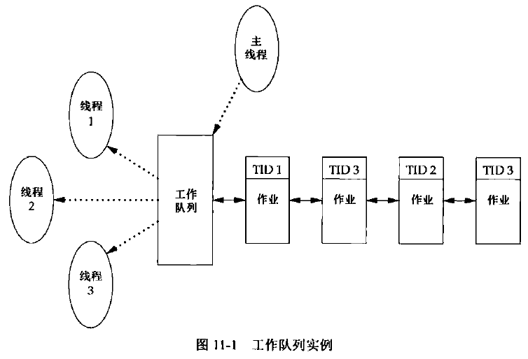
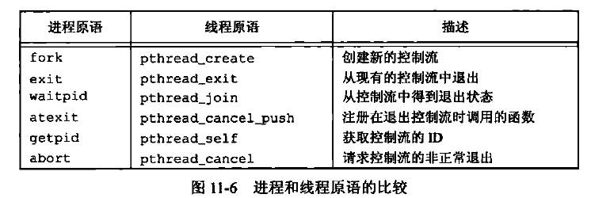
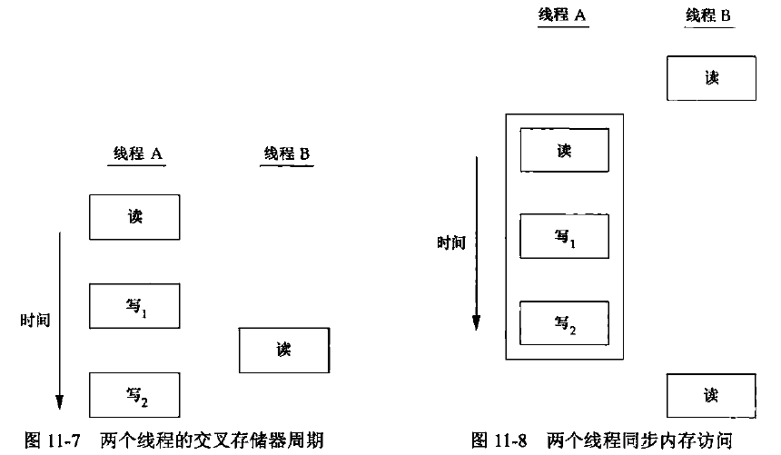
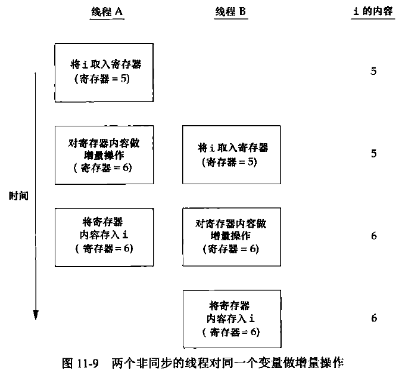

[TOC]


# 11.1 引言

* 如何使用多个控制线程在单进程环境中执行多个任务
* 单个资源要在多个用户间共享，必须处理一致性问题
* 目前可用的同步机制，防止多个线程在共享资源时出现不一致问题


# 11.2 线程概念

典型的UNIX进程可以看成只有一个控制线程：一个进程在同一时刻只做一件事情。

有了多个控制线程（或简称为线程）以后，在程序设计时可以把进程设计成在同一时刻能够做不止一件事，每个线程处理各自独立的任务。

线程的优点：
* 通过为每种事件类型的处理分配单独的线程，能够简化处理异步事件的代码。每个线程在进行事件处理时可以采用**同步编程**模式，同步编程模式要比异步编程模式简单得多。
* 多个进程必须使用操作系统提供的复杂机制才能实现实现内存和文件描述符的共享，而多个线程自动地可以**访问相同的存储地址空间和文件描述符**。
* 有些问题可以通过将其分解从而**改善整个程序的吞吐量**。在只有一个控制线程的情况下，单个进程需要完成多个任务时，实际上需要把这些任务串行化；有了多个控制线程，相互独立的任务的处理就可以交叉进行，只需要为每个任务分配一个单独的线程，当然只有在处理过程互不依赖的情况下，两个任务的执行才可以穿插进行。
* 交互的程序同样可以通过使用多线程**实现响应时间的改善**，多线程可以把程序中处理用户输入输出的部分与其他部分分开。

线程包含了表示进程内执行环境必需的信息，其中包括进程中标识线程的线程ID、一组寄存器值、栈、调度优先级和策略、信号屏蔽字、errno变量以及线程私有数据。**进程的所有信息对该进程的所有线程都是共享的**，包括可执行的程序文本、程序的全局内存和堆内存、栈以及文件描述符。


# 11.3 线程标识

每个线程也有一个线程ID。进程ID在整个系统中是唯一的，但线程ID不同，线程ID只在它所属的进程上下文中有效（不同进程之间的线程ID可以是相同的）。

进程ID用`pid_t`数据类型来表示，是一个非负整数。线程ID则用`pthread_t`数据类型来表示，实现的时候可以用一个结构来代表pthread_t数据类型，所以可移植的操作系统实现不能把它作为整数处理。因此必须使用函数`pthread_equal`来对两个线程ID进行比较。
```C++
#include <pthread.h>

int pthread_equal(pthread_t t1, pthread_t t2);
//返回值：若相等则返回非0值，否则返回0。
```

用结果表示pthread_t数据类型的后果是不能用一种可移植的方式打印该数据类型的值。线程可以通过调用`pthread_self`函数获得自身的线程ID。
```C++
#include <pthread.h>

pthread_t pthread_self(void);
//返回值：调用线程的线程ID。
```

使用实例：
主线程可能把工作任务放在一个队列中，用线程ID来控制每个工作线程处理哪些作业。主线程把新的作业放到一个工作队列中，由3个工作线程组成的线程池从队列中移出作业。主线程不允许每个线程任意处理从队列顶端取出的作业，而是由主线程控制作业的分配，主线程会在每个待处理作业的结构中放置处理该作业的线程ID，每个工作线程只能移出标有自己线程ID的作业。




# 11.4 线程创建

传统的进程模型中每个进程只有一个线程，线程模型程序开始运行时也是以单进程中的单个线程启动的，在创建多个线程之前和传统的进程没有区别。新增的线程可以通过调用`pthread_create`函数创建。
```C++
#include <pthread.h>

int pthread_create(pthread_t *thread, const pthread_attr_t *attr, void *(*start_rtn) (void *), void *arg);
//返回值：若成功，返回0；否则，返回错误编号。
```
当pthread_create成功返回时，由tidp指向的内存单元被设置为新创建的线程的线程ID。attr参数用于定制各种不同的线程属性，设置为NULL可创建默认属性的线程。

新创建的线程从start_rtn函数的地址开始运行，该函数只有一个无类型指针参数arg，如果需要向start_rtn函数传递的参数不止一个，那么需要把这些参数放到一个结构中，然后把这个结构的地址作为arg参数传入。

线程创建时并不能保证是新创建的线程会先运行还是调用线程会先运行。新创建的线程可以访问进程的地址空间，并且继承调用线程的浮点环境和信号屏蔽字，但是该线程的**未决信号集被清除**。

pthread函数在调用失败时通常会返回错误码，它们并不像其他的POSIX函数一样设置errno。**每个线程都提供errno的副本**，这只是为了与使用errno的现有函数兼容。在线程中，从函数中返回错误码更为清晰整洁，不需要依赖那些随着函数执行不断变化的全局状态，因而可以把错误的范围限制在引起出错的函数中。

示例代码
```C++
#include <stdio.h>
#include <unistd.h>
#include <stdlib.h>
#include <pthread.h>

pthread_t ntid;


void printids(const char *s);

void* thread_fun(void *arg);


int main(void)
{
    int err;
    err = pthread_create(&ntid, NULL, thread_fun, NULL);//主线程创建一个线程，新线程调用自定义打印函数
    if (err != 0)
    {
        printf("%d can't create thread!\n", err);
    }
    printids("main thread: ");

    sleep(1);//主线程需要休眠，如果主线程不休眠，它就可能退出，这样在新线程有机会运行之前整个进程可能就已经终止了。
    exit(0);
    
}

void printids(const char *s)
{
    pid_t pid;
    pthread_t tid;

    pid = getpid();
    tid = pthread_self();//获取调用线程的线程ID

    printf("%s pid %lu tid %lu (0x%lx)\n", s, (unsigned long)pid, (unsigned long)tid, (unsigned long)tid);
}

void* thread_fun(void *arg)
{
    printids("new thread: ");
    return((void*)0);
}
```

运行结果
> taojikun@taojikun-virtual-machine:~/taojikun/APUE/11-线程$ **gcc prthreadid.c -o prthreadid -lpthread**
> **./prthreadid** 
> main thread:  pid 35014 tid 140565307496256 (0x7fd7e9389740)
> new thread:  pid 35014 tid 140565298972416 (0x7fd7e8b68700)

注意，pthread库不是Linux系统默认的库，连接时需要使用静态库libpthread.a，所以在使用pthread_create()创建线程，以及调用pthread_atfork()函数建立fork处理程序时，需要链接该库。

在上例子中：
1. 需要处理主线程和新线程之间的竞争。首先是主线程需要休眠，如果主线程不休眠，它就可能退出，这样在新线程有机会运行之前整个进程可能就已经终止了。这种行为特征依赖于操作系统中的线程实现和调度算法。
2. 新线程是通过调用pthread_self函数获取自己的线程ID，而不是从共享内存中读出或者从线程的启动例程中以参数的形式接收到。pthread_create函数会通过第一个参数（tidp）返回新建线程的线程ID。在本例中，主线程把新线程ID存放在ntid中，但是新建的线程并不能安全地使用它，如果新线程在主线程调用pthread_create返回之前就运行了，那么新线程看到的是未经初始化的ntid的内容，这个内容并不是正确的线程ID。


# 11.5 线程终止

如果信号的默认动作是终止进程，那么，把该信号发送到线程会终止整个进程。

单个线程可以通过下列三种方式退出，在不终止整个进程的情况下停止它的控制流。
1. 线程只是从启动例程中返回，返回值是线程的退出码。
2. 线程可以被同一进程中的其他线程取消。
3. 线程调用pthread_exit。

```C++
#include <pthread.h>

void pthread_exit(void *rval_ptr);
```
rval_ptr是一个无类型指针，与传给启动例程的单个参数类似。进程中的其他线程可以通过调用pthread_join函数访问到这个指针（即进程中的其他线程可以通过调用pthread_join函数获得该线程的退出状态）。
```C++
#include <pthread.h>

int pthread_join(pthread_t thread, void **rval_ptr);
//返回值：若成功，返回0；否则，返回错误编号。
```
调用pthread_join函数的线程将一直阻塞，直到指定的线程调用pthread_exit、从启动例程中返回或者被取消。如果线程只是从它的启动例程返回，rval_ptr将包含返回码。如果线程被取消，由rval_ptr指定的内存单元就置为PTHREAD_CANCELED。

可以通过调用pthread_join自动把线程置于分离状态，这样资源就可以恢复。如果线程已经处于分离状态，pthread_join调用就会失败，返回EINVAL。

如果对线程的返回值并不感兴趣，可以把rval_ptr置为NULL。在这种情况下，调用pthread_join函数将等待指定的线程终止，但并不获取线程的终止状态。

代码示例
```C++
#include <stdio.h>
#include <stdlib.h>
#include <unistd.h>
#include <pthread.h>

struct foo{
    int a,b,c,d;
};


void printfoo(char *s , const struct foo *fp);

void* thread_fun1(void *arg);
void* thread_fun2(void *arg);


int main(void)
{
    int err;
    pthread_t tid1,tid2;
    struct foo *fp;

    err = pthread_create(&tid1, NULL, thread_fun1, NULL);
    if(err != 0)
    {
        printf("%d can't create thread 1",err);
    }

    err = pthread_join(tid1,(void*)&fp);//阻塞等待线程tid1终止，并获取其返回码
    if(err != 0)
    {
        printf("%d can't join with thread 1",err);
    }
    sleep(1);

    printf("parent starting second thread\n");

    err = pthread_create(&tid2, NULL, thread_fun2, NULL);
    if(err != 0)
    {
        printf("%d can't create thread 2",err);
    }
    sleep(1);

    printfoo("parent: \n",fp);

    exit(0);
}

void printfoo(char *s , const struct foo *fp)
{
    printf("%s",s);
    printf(" struct foo at 0x%lx \n",(unsigned long)fp);
    printf(" foo.a = %d\n",fp->a);
    printf(" foo.b = %d\n",fp->b);
    printf(" foo.c = %d\n",fp->c);
    printf(" foo.d = %d\n",fp->d);
}

void* thread_fun1(void *arg)
{
    struct foo fp = {1,2,3,4};
    printfoo("thread 1 :\n",&fp);
    pthread_exit((void*)&fp);//返回码为局部变量，主线程调用pthread_join后获得的返回码结构体已经被析构
}

void* thread_fun2(void *arg)
{
    printf("thread 2 : ID is %lu\n", (unsigned long)pthread_self());
    pthread_exit((void*)0);
}
```

运行结果
> thread 1 :
>  struct foo at 0x7fba8422ded0 
>  foo.a = 1
>  foo.b = 2
>  foo.c = 3
>  foo.d = 4
> parent starting second thread
> thread 2 : ID is 140439057524480
> parent: 
>  struct foo at 0x7fba8422ded0 
>  foo.a = -2073991328
>  foo.b = 32698
>  foo.c = -2076396190
>  foo.d = 32698

线程可以通过调用`pthread_cancel`函数来请求取消同一进程中的其他线程。
```C++
#include <pthread.h>

int pthread_cancel(pthread_t tid);
//返回值：若成功则返回0，否则返回错误编号。
```
在默认情况下，pthread_cancel函数会使得由tid标识的线程的行为表现为如同调用了参数为PTHREAD_CANCELED的pthread_exit函数，但是，线程可以选择忽略取消方式或是控制取消方式。注意，pthread_cancel并不等待线程终止，它仅仅提出请求。

线程可以安排它退出时需要调用的函数，这与进程可以用atexit函数安排进程退出时需要调用的函数是类似的。这样的函数称为**线程清理处理程序**。线程可以建立多个清理处理程序。处理程序记录在栈中，也就是说它们的**执行顺序与它们注册时的顺序相反**。
```C++
#include <pthread.h>

void pthread_cleanup_push(void (*rtn)(void *), void *arg);

void pthread_cleanup_pop(int execute);
```
当线程执行以下动作时调用清理函数（调用参数为arg，清理函数rtn的调用顺序是由pthread_cleanup_push函数来调度的）：
* 调用pthread_exit时；
* 相应取消请求时；
* 用非零execute参数调用pthread_cleanup_pop时。

**如果execute参数置为0，清理函数将不被调用**。无论上述哪种情况，pthread_cleanup_pop都将删除上次pthread_cleanup_push调用建立的清理处理程序（需要把pthread_cleanup_pop调用和pthread_cleanup_push调用匹配起来）。

代码示例
```C++
#include <stdio.h>
#include <stdlib.h>
#include <unistd.h>
#include <pthread.h>

void cleanup(void *arg);
void* thread_fun1(void *arg);
void* thread_fun2(void *arg);

int main(void)
{
    int err;
    pthread_t tid1,tid2;
    void *tret;

    err = pthread_create(&tid1,NULL,thread_fun1,(void*)1);
    if (err != 0)
    {
        printf("%d can't create thread 1\n",err);
    }
    sleep(1);
    
    err = pthread_create(&tid2,NULL,thread_fun2,(void*)2);
    if (err != 0)
    {
        printf("%d can't create thread 2\n",err);
    }
    sleep(1);
    
    err = pthread_join(tid1,&tret);
    if(err!=0)
    {
        printf("%d can't join thread 1\n",err);
    }
    printf("thread 1 exit code %ld\n",(long)tret);

    err = pthread_join(tid2,&tret);
    if(err!=0)
    {
        printf("%d can't join thread 2\n",err);
    }
    printf("thread 2 exit code %ld\n",(long)tret);

    exit(0);
}

void cleanup(void *arg)
{
    printf("cleanup: %s\n",(char*)arg);
}

void* thread_fun1(void *arg)
{
    printf("thread 1 start\n");
    pthread_cleanup_push(cleanup,"thread 1 first handler");
    pthread_cleanup_push(cleanup,"thread 1 second handler");
    printf("thread 1 push complete\n");
    if (arg)
    {
        return ((void*)1);
    }
    pthread_cleanup_pop(0);
    pthread_cleanup_pop(0);
    return ((void*)1);
}

void* thread_fun2(void *arg)
{
    printf("thread 2 start\n");
    pthread_cleanup_push(cleanup,"thread 2 first handler");
    pthread_cleanup_push(cleanup,"thread 2 second handler");
    printf("thread 2 push complete\n");
    if (arg)
    {
        pthread_exit((void*)2);
    }
    pthread_cleanup_pop(0);
    pthread_cleanup_pop(0);
    pthread_exit((void*)2);
}
```

运行结果
> thread 1 start
> thread 1 push complete
> thread 2 start
> thread 2 push complete
> cleanup: thread 2 second handler
> cleanup: thread 2 first handler
> thread 1 exit code 1
> thread 2 exit code 2



在任何一个时间点上，线程是可结合的（joinable），或者是分离的（detached）。一个可结合的线程能够被其他线程收回其资源和杀死，在被其他线程回收之前，它的存储器资源（如栈）是不释放的。相反，一个分离的线程是不能被其他线程回收或杀死的，它的存储器资源在它终止时由系统自动释放。

线程的分离状态决定一个线程以什么样的方式来终止自己。线程的默认属性为非分离状态（即可结合的，joinable，需要回收），这种情况下，原有的线程等待创建的线程结束，只有当pthread_join函数返回时，创建的线程才算终止，才能释放自己占用的系统资源。而分离线程没有被其他的线程所等待，自己运行结束了，线程也就终止了，马上释放系统资源。

当线程被分离时，并不能用pthread_join函数等待它的终止状态。对分离状态的线程进行pthread_join的调用会产生失败，返回EINVAL。可以调用pthread_detach函数使线程进入分离状态。
```C++
#include <pthread.h>

int pthread_detach(pthread_t tid);
//返回值：若成功则返回0，否则返回错误编号。
```


# 11.6 线程同步

当某个线程可以修改变量，而其他线程也可以读取或修改这个变量的时候，就需要对这些线程进行同步，以确保它们在访问变量的存储内容时不会访问到无效的数值。



当两个或多个线程试图在同一时间修改同一变量时，也需要进行同步。以变量递增操作为例子，增量操作通常可分为三步：
（1）从内存单元读入寄存器。
（2）在寄存器中进行变量值的增加。
（3）把新的值写回内存单元。

如果两个线程试图在几乎同一时间对同一变量做增量操作而不进行同步的话，结果就可能出现不一致。变量可能比原来增加了1，也有可能比原来增加了2，具体是1还是2取决于第二个线程开始操作时获取的数值。


在现代计算机系统中，存储访问需要多个总线周期，多处理器的总线周期通常在多个处理器上是交叉的，所以无法保证数据是顺序一致的。


## 11.6.1 互斥量

可以通过使用pthread的互斥接口保护数据，确保同一时间只有一个线程访问数据。

互斥量（mutex）从本质上说是一把**锁**，在访问共享资源前对互斥量进行加锁，在访问完成后释放互斥量上的锁。对互斥量进行加锁以后，任何其他试图再次对互斥量加锁的线程将会被阻塞直到当前线程释放该互斥锁。如果释放互斥锁时有多个线程阻塞，所有在该互斥锁上的阻塞线程都会变成可运行状态，第一个变为运行状态的线程可以对互斥量加锁，其他线程将会看到互斥锁依然被锁住，只能回去再次等待它重新变为可用。

在设计时需要规定所有的线程必须遵守相同的数据访问规则，只有这样，互斥机制才能正常工作。

互斥变量用`pthread_mutex_t`数据类型表示，在使用互斥变量以前，必须首先对它进行初始化，可以把它置为常量PTHREAD_MUTEX_INITIALIZER（只对静态分配的互斥量），也可以通过调用`pthread_mutex_init`函数进行初始化。如果动态地分配互斥量（例如通过调用malloc函数），那么在释放内存前需要调用pthread_mutex_destroy。
```C++
#include <pthread.h>

int pthread_mutex_init(pthread_mutex_t *restrict mutex, const pthread_mutexattr_t *restrict attr);

int pthread_mutex_destroy(pthread_mutex_t *mutex);
//两个函数返回值：若成功则返回0，否则返回错误编号。
```
要用默认的属性初始化互斥量，只需把attr设置为NULL。

对互斥量进行加锁，需要调用pthread_mutex_lock，如果互斥量已经上锁，调用线程将阻塞直到互斥量被解锁。对互斥量解锁，需要调用pthread_mutex_unlock。
```C++
#include <pthread.h>

int pthread_mutex_lock(pthread_mutex_t *mutex);

int pthread_mutex_trylock(pthread_mutex_t *mutex);

int pthread_mutex_unlock(pthread_mutex_t *mutex);
//所有函数返回值：若成功则返回0，否则返回错误编号。
```
如果线程不希望被阻塞，它可以使用pthread_mutex_trylock尝试对互斥量进行加锁。如果调用pthread_mutex_trylock时互斥量处于未锁住状态，那么pthread_mutex_trylock将锁住互斥量，不会出现阻塞并返回0，否则pthread_mutex_trylock就会失败，不能锁住互斥量，而返回EBUSY。


## 11.6.2 避免死锁

出现死锁的必要条件：
* 互斥：任何时刻只能有一个进程使用一个资源实例；
* 持有并等待：进程保持至少一个资源，并正在等待获取其他进程持有的资源；
* 非抢占：资源只能在进程使用后自愿释放；
* 循环等待：T0等待T1所占用资源，T1等待T2所占用资源，......，Tn等待T0所占用资源。

可以通过小心地控制互斥量加锁的顺序来避免死锁的发生。但在复杂的情况下，可以先释放占有的锁，然后过一段时间再试。这种情况可以使用pthread_mutex_trylock接口避免死锁。如果已经占有某些锁而且pthread_mutex_trylock接口返回成功，那么就可以前进；但是，如果不能获取锁，可以先释放已经占有的锁，做好清理工作，然后过一段时间重新尝试。


## 11.6.3 函数 pthread_mutex_timedlcok

当线程试图获取一个已加锁的互斥量时，`pthread_mutex_timedlock`互斥量原语**允许绑定线程阻塞时间**。pthread_mutex_timedlock函数与pthread_mutex_lock是基本等价的，但是在达到超时时间值时，pthread_mutex_timedlock不会对互斥量进行加锁，而是返回错误码ETIMEDOUT.
```C++
#include <pthread.h>
#include <time.h>

int pthread_mutex_timedlock(pthread_mutex_t *restrict mutex, const struct timespec *restrict tsptr );
//返回值：若成功则返回0，失败则返回错误代码。
```
超时指定愿意等待的**绝对时间**（与相对时间对比而言，指定在时间X之前可以阻塞等待，而不是说愿意阻塞Y秒）。这个超时时间是用timespec结构来表示的，它用秒和纳秒来描述时间。


## 11.6.4 读写锁

读写锁与互斥量类似，不过**读写锁允许更高的并行性**。

互斥量要么是锁住状态要么是不加锁状态，而且一次只有一个线程可以对其加锁。

读写锁可以有三种状态：读模式下加锁状态，写模式下加锁状态，不加锁状态。**一次只有一个线程可以占有写模式的读写锁，但是多个线程可以同时占有读模式的读写锁**。

* 当读写锁是写加锁状态时，在这个锁被解锁之前，所有试图对这个锁加锁的线程都会被阻塞。
* 当读写锁在读加锁状态时，所有试图以读模式对它进行加锁的线程都可以得到访问权，但是任何希望以写模式对此锁进行加锁的线程都会阻塞，直到所有的线程释放它们的读锁为止。
* 当读写锁处于读模式锁住的状态，而这时有一个线程试图以写模式获取锁时，读写锁通常会阻塞随后的读模式锁请求。这样可以避免读模式锁长期占用，而等待的写模式锁请求一直得不到满足。

**读写锁非常适合于对数据结构读的次数远大于写的情况**。当读写锁在写模式下时，它所保护的数据结构就可以被安全地修改，因为一次只有一个线程可以在写模式下拥有这个锁。当读写锁在读模式下时，只要线程先获取了读模式下的读写锁，该锁所保护的数据结构就可以被多个获得读模式锁的线程读取。

读写锁也叫做**共享互斥锁**。当读写锁是读模式锁住时，就可以说成是以共享模式锁住的。当它是写模式锁住的时候，就可以说成是以互斥模式锁住的。

与互斥量相比，读写锁在使用之前必须初始化，在释放它们底层的内存之前必须销毁。
```C++
#include <pthread.h>
int pthread_rwlock_init(pthread_rwlock_t *restrict rwlock， const pthread_rwlockattr_t *restrict attr);

int pthread_rwlock_destroy(pthread_rwlock_t *rwlock);
//两个函数的返回值：若成功则返回0，失败则返回错误代码。
```
读写锁通过调用pthread_rwlock_init进行初始化。如果希望读写锁有默认的属性，可以传一个空指针给attr。在释放读写锁占用的内存之前，需要调用pthread_rwlock_destroy做清理工作。

要在读模式下锁定读写锁，需要调用`pthread_rwlock_rdlock`；要在写模式下锁定读写锁，需要调用`pthread_rwlock_wrlock`。不管以何种方式锁住读写锁，都可以调用`pthread_rwlock_unlock`进行解锁。
```C++
#include <pthread.h>

int pthread_rwlock_rdlock(pthread_rwlock_t *rwlock);

int pthread_rwlock_wrlock(pthread_rwlock_t *rwlock);

int pthread_rwlock_unlock(pthread_rwlock_t *rwlock);
//所有函数的返回值：若成功则返回0，失败则返回错误代码。
```

Single UNIX Specification同样定义了有条件的读写锁原语的版本。
```C++
#include <pthread.h>

int pthread_rwlock_tryrdlock(pthread_rwlock_t *rwlock);

int pthread_rwlock_trywrlock(pthread_rwlock_t *rwlock);
//两个函数的返回值：若成功则返回0，失败则返回错误编号。
```
可以获取锁时，函数返回0，否则，返回错误EBUSY。这些函数可以用于遵循某种锁层次但还不能完全避免死锁的情况。


## 11.6.5 带有超时的读写锁

与互斥量一样，Single UNIX Specification提供了带有超时的读写锁加锁函数，使应用程序在获取读写锁时避免陷入永久阻塞状态。这两个函数是`pthread_rwlock_timedrdlock`和`pthread_rwlock_timedwrlock`。
```C++
#include <pthread.h>
#include <time.h>

int pthread_rwlock_timedrdlock( pthread_rwlock_t *restrict rwlock, const struct timespec *restrict tsptr );

int pthread_rwlock_timedwrlock( pthread_rwlock_t *restrict rwlock, const struct timespec *restrict tsptr );
//两个函数的返回值：若成功则返回0，失败则返回错误编号。
```


## 11.6.6 条件变量

条件变量是线程可用的另一种同步机制。

条件变量给多个线程提供了一个会合的场所。条件变量与互斥量一起使用时，允许线程以无竞争的方式等待特定的条件发生。

条件本身是由互斥量保护的。线程在改变条件状态前必须首先锁住互斥量，其他线程在获得互斥量之前不会察觉到这种改变，因为必须锁定互斥量以后才能计算条件。

条件变量使用之前必须首先进行初始化，pthread_cond_t数据类型代表的条件变量可以用两种方式进行初始化，可以把常量PTHREAD_COND_INITIALIZER赋给静态分配的条件变量，但是如果条件变量是动态分配的，可以使用pthread_cond_init函数进行初始化。

在释放底层的内存空间之前，可以使用pthread_cond_destroy函数对条件变量进行去除初始化。

```C++
#include <pthread.h>

int pthread_cond_init( pthread_cond_t *restrict cond, pthread_condattr *restrict attr);

int pthread_cond_destroy( pthread_cond_t *cond );
//两个函数的返回值：若成功则返回0，否则返回错误编号。
```

使用pthread_cond_wait等待条件变为真，如果在给定的时间内条件不能满足，那么会生成一个代码出错码的返回值。

```C++
#include <pthread.h>

int pthread_cond_wait(pthread_cond_t *restrict cond,
pthread_mutex_t *restrict mutex);

int pthread_cond_timedwait(pthread_cond_t *restrict cond, pthread_mutex_t *restrict mutex, const struct timespec *restrict timeout);
//两个函数的返回值：若成功则返回0，否则返回错误编号。
```
传递给pthread_cond_wait的互斥量对条件进行保护，调用者把锁住的互斥量传给函数。函数把调用线程放到等待条件的线程列表上，然后对互斥量解锁，这两个操作是原子操作。这样就关闭了条件检查和线程进入休眠状态等待条件改变这两个操作之间的时间通道，这样线程就不会错过条件的任何变化。pthread_cond_wait返回时，互斥量再次被锁住。

如果时间值到了但是条件还是没有出现，pthread_cond_timedwait将重新获取互斥量，然后返回错误ETIMEDOUT。从pthread_cond_wait或者pthread_cond_timedwait调用成功返回时，线程需要重新计算条件，因为其他的线程可能已经在运行并改变了条件。

有两个函数可以用于通知线程条件已经满足。`pthread_cond_signal`函数将唤醒等待该条件的某个线程，而`pthread_cond_broadcast`函数将唤醒等待该条件的所有线程。
```C++
#include <pthread.h>

int pthread_cond_signal( pthread_cond_t *cond );

int pthread_cond_broadcast( pthread_cond_t *cond );
//两个函数的返回值：若成功则返回0，否则返回错误编号。
```
调用pthread_cond_signal或者pthread_cond_broadcast，也称为向线程或条件发送信号。必须注意一定要在改变条件状态以后再给线程发送信号。


## 11.6.7 自旋锁

自旋锁与互斥量类似，区别是：若线程不能获取锁，互斥量是通过休眠的方式（线程被暂时取消调度，切换至其他可运行的线程）来阻塞线程；而自旋锁则是通过忙等（自旋）的方式（线程不会被取消调度，一直在处于运行状态）来阻塞线程。

自旋锁适于用这样的情况：锁被其他线程短期持有（很快会被释放），而且线程并不希望在重新调度上花费太多的成本。

当一个线程在自旋等待一个锁的时候，CPU不能做其他任何事了，这就浪费了CPU资源。这就是为什么要求自旋锁只能被短期保持的原因。

自旋锁接口与互斥量接口类似。我们可以通过`pthread_spin_init`函数初始化一个自旋锁。使用`pthread_spin_destroy`函数对一个自旋锁取消初始化。
```C++
#include <pthread.h>

int pthread_spin_init(pthread_spinlock_t *lock, int pshared);

int pthread_spin_destroy(pthread_spinlock_t *lock);
//两个函数的返回值：若成功则返回0，否则返回错误编号。
```

可以用`pthread_spin_lock`或`pthread_spin_trylock`对自旋锁进行加锁，前者在获取锁之前一直自旋，后者如果不能获取锁，就立即返回EBUSY错误。注意，pthread_spin_trylock不能自旋。不管以何种方式加锁，自旋锁都可以调用`pthread_spin_unlock`函数解锁。
```C++
#include <pthread.h>

int pthread_spin_lock(pthread_spinlock_t *lock);

int pthread_spin_trylock(pthread_spinlock_t *lock);

int pthread_spin_unlock(pthread_spinlock_t *lock);
//所有函数的返回值：若成功则返回0，否则返回错误编号。
```
注意，如果自旋锁当前在解锁状态的话，pthread_spin_lock函数不要自旋就可以对它加锁。如果线程已经对它加锁了，结果就是未定义的，调用pthread_spin_lock会返回EDEADLK错误（或其他错误），或者调用可能会永久自旋，具体行为依赖于实际的实现。试图对没有加锁的自旋锁进行解锁，结果也是未定义的。

不要调用在持有自旋锁情况下可能会进入休眠状态的函数。如果调用了这些函数，会浪费CPU资源，其他线程需要获取自旋锁需要等待的时间就延长了。


## 11.6.8 屏障

屏障（barrier）是用户协调多个线程并行工作的同步机制。屏障允许每个线程等待，直到所有的合作线程都到达某一点，然后从该点继续执行。

屏障允许任意数量的线程等待，直到所有的线程完成处理工作而线程不需要退出。所有线程达到屏障后可以接着工作。

可以使用`pthread_barrier_init`函数初始化一个关卡，使用`pthread_barrier_destroy`函数对一个关卡进行去除初始化。
```C++
#include <pthread.h>

int pthread_barrier_init(pthread_barrier_t *restrict barrier, const pthread_barrierattr_t *restrict attr, unsigned int count);

int pthread_barrier_destroy(pthread_barrier_t *barrier);
//两个函数的返回值：若成功则返回0，否则返回错误编号。
```
初始化屏障时，可以使用count参数指定在允许所有线程继续运行之前必须到达屏障的线程数目。使用attr参数指定屏障对象的属性，设置attr为NULL使用默认属性初始化屏障。如果使用pthread_barrier_init函数为屏障分配资源，那么在反初始化屏障时可以调用pthread_barrier_destroy函数释放相应的资源。

可以使用`pthread_barrier_wait`函数来表明，线程已完成工作，准备等所有其他线程赶上来。
```C++
#include <pthread.h>

int pthread_barrier_wait(pthread_barrier_t *barrier);
//返回值：若成功，则返回0或PTHREAD_BARRIER_SERIAL_THREAD；否则，返回错误编号。
```
调用pthread_barrier_wait的线程在屏障计数（调用pthread_barrier_init时设定）未满足条件时，会进入休眠状态。如果该线程是最后一个调用pthread_barrier_wait的线程，就满足了屏障计数，所有的线程都被唤醒。

对于一个任意线程，pthread_barrier_wait函数返回了PTHREAD_BARRIER_SERIAL_THREAD。剩下的线程看到的返回值是0。这使得一个线程可以作为主线程，它可以工作在其他所有线程已完成的工作结果上。

一旦达到屏障计数值，而且线程处于非阻塞状态，屏障就可以被重用。但是除非在调用了pthread_barrier_destroy函数之后，又调用了pthread_barrier_init函数对计数用另外的数进行初始化、否则屏障计数不会改变。

