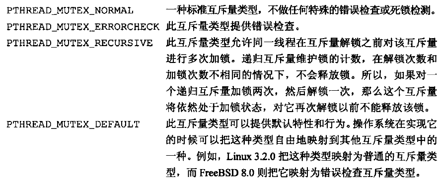

[TOC]


# 12.1 引言

线程属性、同步原语属性、同一进程中的多个线程保持数据私有性、基于进程的系统调用与线程的交互


# 12.2 线程限制


# 12.3 线程属性

可以使用`pthread_attr_t`结构修改线程默认属性，并把这些属性与创建的线程联系起来。可以使用`pthread_attr_init`函数初始化pthread_attr_t结构。调用pthread_attr_init以后，pthread_attr_t结构所包含的内容就是操作系统实现支持的线程所有属性的默认值。
```C++
#include <pthread.h>

int pthread_attr_init(pthread_attr_t *attr);

int pthread_attr_destroy(pthtread_attr_t *attr);
//两个函数的返回值：若成功，返回0；否则，返回错误编号。
```
如果要反初始化pthread_attr_t结构，可以调用`pthread_attr_destroy`函数。如果pthread_attr_init的实现对属性对象的内存空间是动态分配的，pthread_attr_destroy就会释放该内存空间。除此之外，pthread_attr_destroy还会用无效的值初始化属性对象，因此，如果该属性对象被误用，将会导致pthread_create函数返回错误码。

POSIX.1线程属性：
| 名称 | 描述 |
| :----: | :----: |
| detachstate| 线程的分离状态属性 |
| guardsize | 线程栈末尾的警戒缓冲区大小（字节数） |
| stackaddr | 线程栈的最低地址 |
| stacksize | 线程栈的大小（字节数） |

如果在创建线程时就知道不需要了解线程的终止状态，则可以修改pthread_attr_t结构中的detachstate线程属性，让线程以分离状态启动。可以使用`pthread_attr_setdetachstate`函数把线程属性detachstate设置为下面的两个合法值之一：设置为PTHREAD_CREATE_DETACHED，以分离状态启动线程；或者设置为PTHREAD_CREATE_JOINABLE，正常启动线程，应用程序可以获取线程的终止状态。
```C++
#include <pthread.h>

int pthread_attr_getdetachstate(const pthread_attr_t *restrict attr, int *detachstate);

int pthread_attr_setdetachstate(pthread_attr_t *attr, int detachstate);
//两个函数的返回值：若成功，返回0；否则，返回错误编号。
```
可以调用pthread_attr_getdetachstate函数获取当前的detachstate线程属性，第二个参数所指向的整数用来保存获取到的detachstate属性值：PTHREAD_CREATE_DETACHED，或PTHREAD_CREATE_JOINABLE）。

可以使用函数`pthread_attr_getstack`和`pthread_attr_setstack`对线程栈属性进行管理。
```C++
#include <pthread.h>

int pthread_attr_getstack(const pthread_attr_t *restrict attr, void **restrict stackaddr, size_t *restrict stacksize);

int pthread_attr_setstack(const pthread_attr_t *attr, void *stackaddr, size_t *stacksize);
//两个函数的返回值：若成功，返回0；否则，返回错误编号。
```

对进程来说，虚拟地址的大小是固定的，进程中只有一个栈，所以它的大小通常不是问题。但对线程来说，同样大小的虚拟地址空间必须被所有的线程栈共享。如果应用程序使用了太多的线程，致使线程栈的累计大小超过了可用的虚拟空间，这时就需要减少线程默认的栈大小。另一方面，如果线程调用的函数分配了大量的自动变量或者调用的函数涉及很深的栈帧，那么这时需要的栈大小可能要比默认的大。

如果用完了线程栈的虚拟地址空间，可以使用malloc或者mmap来为其他栈分配空间，并用pthread_attr_setstack函数来改变新建线程的栈位置。线程栈所占内存范围中**可寻址的最低地址**可以由stackaddr参数指定，该地址与处理器结构相应的边界对齐。

stackaddr线程属性被定义为栈的内存单元的最低地址，但这并不必然是栈的开始位置。对于某些处理器结构来说，栈是从高地址向低地址方向伸展的，那么stackadd线程属性就是栈的结尾而不是开始位置。

应用程序也可以通过`pthread_attr_getstacksize`和`pthread_attr_setstacksize`函数读取或设置线程属性stacksize。

设置stacksize属性时，选择的stacksize不能小于PTHREAD_STACK_MIN。

线程属性guardsize控制着线程栈末尾之后用以避免栈溢出的**扩展内存的大小**。这个属性默认设置为PAGESIZE个字节。可以把guardsize线程属性设为0，从而不允许属性的这种特征行为发生：在这种情况下不会提供警戒缓冲区。同样地，如果对线程属性stackaddr作了修改，系统就会假设我们会自己管理栈，并使警戒栈缓冲区机制无效，等同于把guardsize属性设为0。
```C++
#include <pthread.h>

int pthread_attr_getguardsize(const pthread_attr_t *restrict attr, size_t *restrict guardsize);

int pthread_attr_setguardsize(pthread_attr_t *attr, size_t guardsize);
//两个函数的返回值：若成功，返回0；否则，返回错误编号。
```
如果guardsize线程属性被修改了，操作系统可能把它取为页大小的整数倍。如果线程的栈指针溢出到警戒区域，应用程序就可能通过信号接收到出错信息。


# 12.4 同步属性

## 12.4.1 互斥量属性

互斥量属性是用`pthread_mutexattr_t`结构表示的。

对于非默认属性，可以用`pthread_mutexattr_init`初始化pthread_mutexattr_t结构，用`pthread_nutexattr_destroy`来反初始化。
```C++
#include <pthread.h>

int pthread_mutexattr_init(pthread_mutexattr_t *attr);

int pthread_mutexattr_destroy(pthread_mutexattr_t *attr);
//两个函数的返回值：若成功，返回0；否则，返回错误编号。
```
pthread_mutexattr_init函数将用默认的互斥量属性初始化pthread_mutexattr_t结构。值得注意的3个属性是：**进程共享属性、健壮属性以及类型属性**。

在进程中，多个线程可以访问同一个同步对象，这是默认的行为。在这种情况下，进程共享互斥量属性需要设置为PTHREAD_PROCESS_PRIVATE。

多个进程访问共享数据通常也需要同步。如果进程共享互斥量属性设置为PTHREAD_PROCESS_SHARED，从多个进程共享的内存区域中分配的互斥量就可以用于这些进程的同步。

可以使用pthread_mutexattr_getpshared函数查询pthread_mutexattr_t结构，得到它的进程共享属性；可以用pthread_mutexattr_setpshared函数修改进程共享属性。
```C++
#include <pthread.h>

int pthread_mutexattr_getpshared(const pthread_mutexattr_t *restrict attr, int *restrict pshared);

int pthread_mutexattr_setpshared(pthread_mutexattr_t *attr, int pshared);
//两个函数的返回值：若成功，返回0；否则，返回错误编号。
```

互斥量健壮属性与在多个进程间共享的互斥量有关。这意味着，当持有互斥量的进程终止时，需要解决互斥量状态恢复的问题。这种情况发生时，互斥量处于锁定状态，恢复起来很困难。其他阻塞在这个锁的进程将会一直阻塞下去。

可以使用`pthread_mutexattr_getrobust`函数获取健壮的互斥量属性的值。可以调用`pthread_mutexattr_setrobust`函数设置健壮的互斥量属性的值。
```C++
#include <pthread.h>

int pthread_mutexattr_getrobust(const pthread_mutexattr_t *attr, int *robustness);

int pthread_mutexattr_setrobust(const pthread_mutexattr_t *attr, int robustness);
//两个函数的返回值：若成功，返回0；否则，返回错误编号。
```
健壮属性取值有两种可能的情况。默认值是PTHREAD_MUTEX_STALLED，这意味着持有互斥量的进程终止时不需要采取特别的动作。这种情况下，使用互斥量后的行为是未定义的，等待该互斥量解锁的应用程序会被有效地"拖住"。另一个取值是PTHREAD_MUTEX_ROBUST。这个值将导致线程调用pthread_mutex_lock获取锁，而该锁被另一个进程持有，但它终止时并没有对该锁进行解锁，此时线程会阻塞，从pthread_mutex_lock返回的值为EOWNERDEAD而不是0。

使用健壮的互斥量改变了我们使用pthread_mutex_lock的方式，因为现在必须检查3个返回值而不是之前的两个：不需要恢复的成功、需要恢复的成功以及失败。

如果应用状态无法恢复，在线程对互斥量解锁以后，该互斥量将处于永久不可用状态。为了避免这样的问题，线程可调用`pthread_mutex_consistent`函数，指明与该互斥量相关的状态在互斥量解锁之前是一致的。
```C++
#include <pthread.h>

int pthread_mutex_consistent(pthread_mutex_t *mutex);
//返回值：若成功，返回0；否则，返回错误编号。
```
如果线程没有先调用pthread_mutex_consistent就对互斥量进行了解锁，那么其他试图获取该互斥量的阻塞线程就会得到错误码ENOTRECOVERABLE。如果发生这种情况，互斥量将不再可用。线程通过提前调用pthread_mutex_consistent能让互斥量正常工作，这样它就可以持续被使用。

类型互斥量属性控制着互斥量的特性。POSIX.1定义了四种类型:



可以用pthread_mutexattr_gettype函数得到互斥量类型属性，用pthread_mutexattr_settype函数修改互斥量类型属性。
```C++
#include <pthread.h>

int pthread_mutexattr_gettype(const pthread_mutexattr_t * restrict attr, int *restrict type);

int pthread_mutexattr_settype(pthread_mutexattr_t *attr, int type);
//两个函数的返回值：若成功，返回0；否则，返回错误编号。
```


## 12.4.2 读写锁属性

读写锁与互斥量类似，也具有属性。用`pthread_rwlockattr_init`初始化`pthread_rwlockattr_t`结构，用`pthread_rwlockattr_destroy`回收结构。
```C++
#include <pthread.h>

int pthread_rwlockattr_init(pthread_rwlockattr_t *attr);

int pthread_rwlockattr_destroy(pthread_rwlockattr_t *attr);
//两个函数的返回值：若成功，返回0；否则，返回错误编号。
```
**读写锁支持的唯一属性是进程共享属性**，该属性与互斥量的进程共享属性相同。就像互斥量的进程共享属性一样，用一对函数来读取和设置读写锁的进程共享属性。
```C++
#include <pthread.h>

int pthread_rwlockattr_getpshared(const pthread_rwlockattr_t * restrict attr, int *restrict pshared);

int pthread_rwlockattr_setpshared(pthread_rwlockattr_t *attr, int pshared);
//两个函数的返回值：若成功，返回0；否则，返回错误编号。
```


## 12.4.3 条件变量属性

Single UNIX Specification目前定义了**条件变量的两个属性：进程共享属性和时钟属性**。与其他的属性对象一样，有一对函数用于初始化和反初始化条件变量属性。
```C++
#include <pthread.h>

int pthread_condattr_init(pthread_condattr_t *attr);

int pthread_condattr_destroy(pthread_condattr_t *attr);
//两个函数的返回值：若成功，返回0；否则，返回错误编号。
```

与其他的同步属性一样，条件变量支持进程共享属性。它控制着条件变量是可以被单进程的多个线程使用，还是可以被多进程的线程使用。要获取进程共享属性的当前值，可以用`pthreadcondattr_getpshared`函数。设置该值可以用`pthread_condattr_setpshared`函数。
```C++
#include <pthread.h>

int pthread_condattr_getpshared(const pthread_condattr_t *restrict attr, int *restrict pshared);

int pthread_condattr_setpshared(pthread_condattr_t *attr, int pshared);
//两个函数的返回值：若成功，返回0；否则，返回错误编号。
```

时钟属性控制计算pthread_cond_timedwait函数的超时参数（tsptr）时采用的是哪个时钟。可以使用`pthread_condattr_getclock`函数获取可被用于pthread_cond_timedwait函数的时钟ID，在使用pthread_cond_timedwait函数前需要用pthread_condattr_t对象对条件变量进行初始化。可以用`pthread_condattr_setclock`函数对时钟ID进行修改。
```C++
#include <pthread.h>

int pthread_condattr_getclock(const pthread_condattr_t *restrict attr, clockid_t *restrict clock_id);

int pthread_condattr_setpshared(pthread_condattr_t *attr, clockid_t clock_id);
//两个函数的返回值：若成功，返回0；否则，返回错误编号。
```


## 12.4.4 屏障属性

屏障也具有属性。我们可以使用`pthread_barrierattr_init`函数初始化一个屏障属性，使用`pthread_barrierattr_destroy`函数回收屏障属性。
```C++
#include <pthread.h>

int pthread_barrierattr_init(pthread_barrierattr_t *attr);

int pthread_barrierattr_destroy(pthread_barrierattr_t attr);
//两个函数的返回值：若成功，返回0；否则，返回错误编号。
```
目前定义的**屏障属性只有进程共享属性**，它控制着屏障是可以被多进程的线程使用，还是只能被初始化屏障的进程内的多线程使用。与其他属性对象一样，有一个获取属性值的函数(`pthread_barrierattr_getpshared`）和一个设置属性值的函数（`pthread_barrierattr_setpshared`）。
```C++
#include <pthread.h>

int pthread_barrierattr_getpshared(const pthread_barrierattr_t *restrict attr, int *restrict pshared);

int pthread_barrierattr_setpshared(pthread_barrierattr_t *attr, int *pshared);
//两个函数的返回值：若成功，返回0；否则，返回错误编号。
```


# 12.5 重入

如果一个函数在同一时刻可以被多个线程安全地调用，就称该函数是线程安全的。

如果一个函数对多个线程来说是可重入的，则说这个函数是线程安全的，但这并不能说明对信号处理程序来说该函数也是可重入的。如果函数对异步信号处理程序的重入是安全的，那么就可以说函数是异步信号安全的。

POSIX.1还提供了以线程安全的方式管理FILE对象的方法。可以使用`flockfile`和`ftrylockfile`获取与给定FILE对象关联的锁。这个锁是递归的，当占有这把锁的时候，还可以再次获取该锁，这并不会导致死锁。
```C++
#include <stdio.h>

int ftrylockfile(FILE *fp);
//返回值：若成功，返回0；若不能获取锁，返问非0数值。

void flockfile(FILE *fp);
void funlockfile(FILE *fp);
```

如果标准I/O例程都获取它们各自的锁，那么在做一次一个字符的I/O操作时性能就会出现严重的下降。在这种情况下，需要对每一个字符的读或写操作进行获取锁和释放锁的动作。为了避免这种开销，出现了不加锁版本的基于字符的标准I/O例程。
```C++
#include <stdio.h>

int getchar_unlocked(void);
int getc_unlocked(FILE *fp);
//两个函数的返回值：若成功；返回下一个字符；若已到达文件结尾或出错，返回EOF。

int putchar_unlocked(int c);
int putc_unlocked(int c, FILE *fp);
//两个函数的返回值：若成功，返回c；若出错，返回EOF。
```
除非被flockfile（或ftrylockfile）和funlockfile的调用包围，否则尽量不要调用这四个函数，因为它们会导致不可预期的结果（即由多个控制线程非同步地访问数据所引起的种种问题）。


# 12.6 线程特定数据

线程特定数据（也称线程私有数据）是存储和查询与某个线程相关的数据的一种机制。

线程模型促进了进程中数据和属性的共享，但在这样的模型中提出一些合适的用于阻止共享的接口，有两个原因：
1. 有时候需要维护基于每个线程的数据；
2. 提供了让基于进程的接口适应多线程环境的机制。

进程中的所有线程都可以访问进程的整个地址空间。除了使用寄存器以外，线程没有办法阻止其他线程访问它的数据，线程私有数据也不例外。虽然底层的实现部分并不能阻止这种访问能力，但管理线程私有数据的函数可以提高线程间的数据独立性，使得线程不太容易访问到其他线程的线程特定数据。

在分配线程私有数据之前，需要创建与该数据关联的**键**。这个键将用于获取对线程私有数据的访问权。使用`pthread_key_create`创建一个键。
```C++
#include <pthread.h>

int pthread_key_create(pthread_key_t *keyp, void (*destructor)(void *));
//返回值：若成功，返回0；否则，返回错误编号。
```
创建的键存放在keyp指向的内存单元，这个键可以被进程中的所有线程使用，但每个线程把这个键与不同的线程私有数据地址进行关联。创建新键时，每个线程的数据地址设为null值。

pthread_key_create可以选择为该键关联析构函数，当线程退出时，如果数据地址已经被置为非null数值，那么析构函数就会被调用，它唯一的参数就是该数据地址。如果传入的destructor参数为null，就表明没有析构函数与键关联。当线程调用pthread_exit或者线程执行返回，正常退出时，析构函数就会被调用，但如果线程调用了exit、_exit、_Exit、abort或出现其他非正常的退出时，就不会调用析构函数。

线程通常使用malloc为线程私有数据分配内存空间，析构函数通常释放已分配的内存。如果线程没有释放内存就退出了，那么这块内存将会丢失，即线程所属进程出现了内存泄漏。

线程可以为线程私有数据分配多个键，每个键都可以有一个析构函数与它关联。各个键的析构函数可以互不相同，当然它们也可以使用相同的析构函数。每个操作系统在实现的时候可以对进程可分配的键的数量进行限制。

线程退出时，线程私有数据的析构函数将按照操作系统实现中定义的顺序被调用。析构函数可能会调用另一个函数，该函数可能会创建新的线程私有数据而且把这个数据与当前的键关联起来。当所有的析构函数都调用完成以后，系统会检查是否还有非null的线程私有数据值与键关联，如果有的话，再次调用析构函数。这个过程会一直重复直到线程所有的键都为null值线程私有数据，或者已经做了PTHREAD_DESTRUCTOR_ITERATIONS中定义的最大次数的尝试。

对所有的线程，都可以通过调用`pthread_key_delete`来取消键与线程私有数据值之间的关联关系。
```C++
#include <pthread.h>

int pthread_key_delete(pthread_key_t *key);
//返回值：若成功，返回0；否则，返回错误编号。
```
注意，调用pthread_key_delete并不会激活与键关联的析构函数。要释放任何与键对应的线程私有数据值的内存空间，需要在应用程序中采取额外的步骤。

需要确保分配的键并不会由于在初始化阶段的竞争而发生变动。解决这种竞争的办法是使用`pthread_once`。
```C++
#include <pthread.h>

pthread_once_t initflag = PTHREAD_ONCE_INIT;
int pthread_once(pthread_once_t *initflag, void (*initfn)(void));
//返回值：若成功，返回0；否则，返回错误编号。
```
initflag必须是一个非本地变量（即全局变量或静态变量），而且必须初始化为PTHREAD_ONCE_INIT。如果每个线程都调用pthread_once，系统就能保证初始化例程initfn只被调用一次，即在系统首次调用pthread_once时。

键一旦创建，就可以通过`pthread_setspecific`函数把键和线程私有数据关联起来。可以通过`pthread_getspecific`函数获得线程私有数据的地址。
```C++
#include <pthread.h>

void *pthread_getspecific(pthread_key_t key);
//返回值：线程特定数据值；若没有值与该键关联，返回NULL

int pthread_setspecific(pthread_key_t key, const void *value);
//返回值：若成功，返回0；否则，返回错误编号。
```


# 12.7 取消选项

有两个线程属性并没有包含在pthread_attr_t结构中，它们是**可取消状态**和**可取消类型**。这两个属性影响着线程在响应pthread_cancel函数调用时所呈现的行为。

可取消状态属性可以是PTHREAD_CANCEL_ENABLE，也可以是PTHREAD_CANCEL_DISABLE。线程可以通过调用`pthread_setcancelstate`修改它的可取消状态。
```C++
#include <pthread.h>

int pthread_setcancelstate(int state, int *oldstate);
//返回值：若成功，返回0；否则，返回错误编号。
```
pthread_setcancelstate把当前的可取消状态设置为state，把原来的可取消状态存放在由oldstate指向的内存单元中，这两步是**原子操作**。

pthread_cancel调用并不等待线程终止。在默认情况下，线程在取消请求发出以后还是继续运行，直到线程到达某个取消点。取消点是线程检查它是否被取消的一个位置，如果取消了，则按照请求行事。POSX.1保证在线程调用图中列出的任何函数时，取消点都会出现。


线程启动时的默认的可取消状态时PTHREAD_CANCEL_ENABLE。当状态设为PTHREAD_CANCEL_DISABLE时，对pthread_cancel的调用并不会杀死线程；相反，取消请求对这个线程来说处于未决状态。当取消状态再次变为PTHREAD_CANCEL_ENABLE时，线程将在下一个取消点上对所有未决的取消请求进行处理。

可以调用`phread_testcancel`函数在程序中自己添加取消点。
```C++
#include <pthread.h>

void pthread_testcancel(void);
```
调用pthread_testcancel时，如果有某个取消请求正处于未决状态，而且取消并没有置为无效，那么线程就会被取消。但是如果取消被置为无效时，pthread_testcancel调用就没有任何效果。

默认取消类型也称为延迟取消。调用pthread_cancel以后，在线程到达取消点之前，并不会出现真正的取消。可以通过调用`pthread_setcanceltype`来修改取消类型。
```C++
#include <pthread.h>

int pthread_setcanceltype(int type, int *oldtype);
//返回值：若成功，返回0；否则，返回错误编号。
```
type参数可以是PTHREAD_CANCEL_DEFERRED，也可以是PTHREAD_CANCEL_ASYNCHRONOUS，pthread_setcanceltype函数把取消类型设置为type，把原来的取消类型返回到oldtype指向的整数单元。

异步取消与延迟取消不同，使用异步取消时，线程可以在任意时间取消，而不是非得遇到取消点才能被取消。


# 12.8 线程和信号

每个线程都有自己的信号屏蔽字，但是信号的处理是进程中所有线程共享的。这意味着尽管单个线程可以阻止某些信号，但当线程修改了与某个信号相关的处理行为以后，所有的线程都必须共享这个处理行为的改变。

进程中的信号是递送到单个线程的。如果信号与硬件故障或计时器超时相关，该信号就被发送到引起该事件的线程中去，而其他的信号则被发送到任意一个线程。

进程使用sigprocmask来阻止信号发送。但是sigpromask的行为在多线程的进程中并没有定义，线程必须使用`pthread_sigmask`。
```C++
#include <signal.h>

int pthread_sigmask(int how, const sigset_t *restrict set, sigset_t *restrict oset);
//返回值：若成功，返回0；否则，返回错误编号。
```
pthread_sigmask函数与sigprocmask函数基本相同，除了pthread_sigmask工作在线程中，并且失败时返回错误码，而不像sigprocmask中那样设置errno并返回-1。how参数有三个取值：SIG_BLOCK（添加）、SIG_UNBLOCK（移除）、SIGSETMASK（替换）。当set参数设置为NULL时，并把oset设置为sigset_t结构的地址来获取当前的信号屏蔽字，这种情况下how参数会被忽略。

线程可以通过调用sigwait等待一个或多个信号发生。
```C++
#include <signal.h>

int sigwait(const sigset_t *restrict set, int *restrict signop);
//返回值：若成功，返回0；否则，返回错误编号。
```
set参数指出了线程等待的信号集，signop指向的整数将作为返回值，表明信号编号。

如果信号集中的某个信号在sigwait调用的时候处于未决状态，那么sigwait将无阻塞地返回，在返回之前，sigwait将从进程中移除那些处于挂起等待状态的信号。

为了避免错误动作发生，线程在调用sigwait之前，必须阻塞那些它正在等待的信号。sigwait函数会自动取消信号集的阻塞状态，直到有新的信号被递送。在返回之前，sigwait将恢复线程的信号屏蔽字。如果信号在sigwait调用的时候没有被阻塞，在完成对sigwait调用之前会出现一个时间窗，在这个时间窗口期，某个信号可能在完成sigwait调用之前就被递送了。

使用sigwait的好处在于它可以简化信号处理，允许把异步产生的信号用同步的方式处理。为了防止信号中断线程，可以把信号加到每个线程的信号屏蔽字中，然后安排专用线程作信号处理。这些专用线程可以进行函数调用，不需要担心在信号处理程序中调用哪些函数是安全的，因为这些函数调用来自正常的线程环境，而非传统的信号处理程序，传统信号处理程序通常会中断线程的正常执行。

如果多个线程在sigwait的调用中因等待同一个信号而阻塞，那么在信号递送的时候，就只有一个线程可以从sigwait中返回。如果一个信号被捕获（例如进程通过使用sigaction建立了一个信号处理程序），而且一个线程正在sigwait调用中等待同一信号，那么这时将由操作系统实现来决定以何种方式递送信号。操作系统实现可以让sigwait返回，也可以激活信号处理程序，但这两种情况不会同时发生。

要把信号发送到进程，可以调用kill；要把信号发送到线程，可以调用`pthread_kill`。
```C++
#include <signal.h>

int pthread_kill(pthread_t thread, int signo);
//返回值：若成功，返回0；否则，返回错误编号。
```
可以传一个0值的signo来检查线程是否存在。如果信号的默认处理动作是终止该进程，那么把信号传递给某个线程仍然会杀掉整个进程。

注意闹钟定时器是进程资源，并且所有的线程共享相同的alarm。所以进程中的多个线程不可能互不干扰（或互不合作）地使用闹钟定时器。


# 12.9 线程和fork

当线程调用fork时，就为子进程创建了整个进程地址空间的副本。子进程与父进程是完全不同的进程，只要两者都没有对内存作出改动，父进程和子进程之间还可以共享内存页的副本。

子进程通过继承整个地址空间的副本，也从父进程那里继承了所有互斥量、读写锁和条件变量的状态。如果父进程包含多个线程，子进程在fork返回以后，如果紧接着不是马上调用exec的话，就需要清理锁状态。

在子进程内部只存在一个线程，它是由父进程中调用fork的线程的副本构成的。如果父进程中的线程占有锁，子进程同样占有这些锁。问题是子进程并不包含占有锁的线程的副本，所以子进程没有办法知道它占有了哪些锁并且需要释放哪些锁。

如果子进程从fork返回以后马上调用某个exec函数，就可以避免这样的问题。这种情况下，老的地址空间被丢弃，所以锁的状态无关紧要。但如果子进程需要继续做处理工作的话，这种方法就行不通，还需要使用其他的策略。

要清除锁状态，可以通过调用`pthread_atfork`函数建立fork处理程序。
```C++
#include <pthread.h>

int pthread_atfork(void (*prepare)(void), void (*parent)(void), void (*child)(void));
//返回值：若成功，返回0；否则，返回错误编号。
```
用pthread_atfork函数最多可以安装三个帮助清理锁的函数：
* prepare fork处理程序**由父进程在fork创建子进程前调用**，这个fork处理程序的任务是获取父进程定义的所有锁。
* parent fork处理程序是在fork创建了子进程以后，但在fork返回之前在父进程上下文中调用的，这个fork处理程序的任务是对prepare fork处理程序获得的所有锁进行解锁。
* child fork处理程序在fork返回之前在子进程环境中调用，与parent fork处理程序一样，child fork处理程序也必须释放prepare fork处理程序获得的所有锁。

使用多个fork处理程序时，处理程序的调用顺序并不相同。parent和child fork处理程序是以它们注册时的顺序进行调用的，而prepare fork处理程序的调用顺序与它们注册时的顺序相反。这样可以允许多个模块注册它们自己的fork处理程序，并且保持锁的层次。


# 12.10 线程和I/O

pread/pwrite函数可以视为lseek+read/lseek+write的原子操作。在多线程环境下是非常有帮助的，因为进程中的所有线程共享相同的文件描述符。

