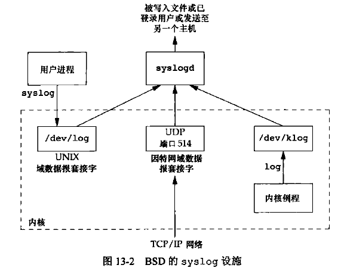
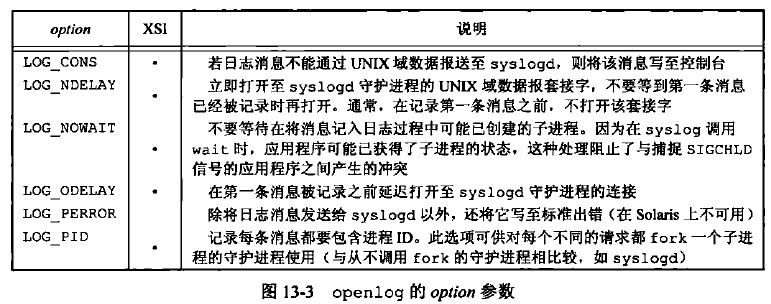
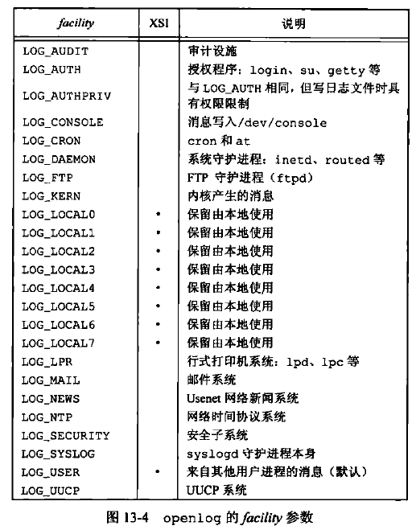

[TOC]


# 13.1 引言

守护进程（daemon）是生存期长的一种进程。它们常常**在系统引导装入时启动，仅在系统关闭时才终止**。因为它们没有控制终端，所以说它们是在后台运行的。

UNLX系统有很多守护进程,它们执行日常事务活动。

守护进程结构、编写守护进程程序、守护进程报告出错情况。


# 13.2 守护进程的特征

ps(1)命令打印系统中各个进程的状态。

父进程ID为0的各进程通常是**内核进程**，它们作为系统自举过程的一部分而启动（init是此种进程的例外，它是内核在自举时启动的用户层命令）。内核进程是特殊的，通常存在于系统的整个生命期中。它们以超级用户特权运行，无控制终端，无命令行。

进程1通常是init进程。它是一个系统守护进程，主要负责启动各运行层次特定的系统服务。这些服务通常是在它们自己拥有的守护进程的帮助下实现的。

注意，大多数守护进程都以超级用户（root）特权运行。所有的守护进程都没有控制终端，其终端名设置为问号。内核守护进程以无控制终端方式启动。用户层守护进程缺少控制终端可能是守护进程调用了setsid的结果。大多数用户层守护进程都是进程组的组长进程以及会话的首进程，而且是这些进程组和会话中的唯一进程（rsyslogd是一个例外）。最后，应当引起注意的是**用户层守护进程的父进程是init进程**。


# 13.3 编程规则

在编写守护进程时需遵循以下基本规则，以便防止产生并不需要的交互作用。
1. 首先要做的是调用umask将文件模式创建屏蔽字设置为一个已知值（通常为0）。由继承得来的文件模式创建屏蔽字可能会拒绝设置某些权限。如果守护进程要创建文件，那么可能要设置
2. 调用fork，然后使父进程exit。这样做实现了下面几点：第一，如果该守护进程是作为一条简单shell命令启动的，那么父进程终止使得shell认为这条命令已经执行完毕（也就没有了控制终端）；第二，子进程继承了父进程的进程组ID，但具有一个新的进程ID，这就保证了子进程不是一个进程组的组长进程。这对于下面就要做的setsid调用是必要的前提条件。
3. 调用setsid以创建一个新会话。于是执行三个操作，使调用进程：（a）成为新会话的首进程，（b）成为一个新进程组的组长进程，（c）没有控制终端。
4. 将当前工作目录更改为根目录。从父进程出继承过来的当前工作目录可能在一个挂载的文件系统中。因为守护进程通常在系统再引导之前是一直存在的，所以如果守护进程的当前工作目录在一个挂载的文件系统中，那么该文件系统就不能被卸载。这与挂载文件系统的原意不符。另外，某些守护进程可能会把当前工作目录更改到某个指定位置，在那里做它们的工作。
5. 关闭不再需要的文件描述符。这使守护进程不再持有从其父进程继承来的某些文件描述符（父进程可能是shell进程，或某个其他进程）。可以使用open_max函数或getrlimit函数来判定最高文件描述符值，并关闭直到该值的所有描述符。
6. 某些守护进程打开/dev/null使其具有文件描述符0、1和2，这样，任何一个试图读标准输入、写标准输出和标准出错的库例程都不会产生任何效果。因为守护进程并不与终端设备相关联，所以不能在终端设备上显示其输出，也无处从交互式用户那里接受输入。即使守护进程是从交互式会话启动的，但因为守护进程是在后台运行的，所以登录会话的终止并不影响守护进程。如果其他用户在同一终端设备上登录，我们也不会在该终端上见到守护进程的输出，用户也不可期望他们在终端上的输入会由守护进程读取。

守护进程在一个孤儿进程组中，它不是会话首进程，因此没有机会被分配到一个控制终端。


# 13.4 出错记录

由于守护进程没有控制终端，所以处理出错消息时，不能只是简单地写到标准出错上。故需要一个集中的守护进程出错记录设施。


有三种方法产生日志消息：
1. 内核例程可以调用log函数。任何一个用户进程通过打开（open）然后读取（read）/dev/klog设备就可以读取这些消息。
2. 大多数用户进程（守护进程）调用syslog(3)函数以产生日志消息。这使消息发送至UNIX域数据报套接字/dev/log。
3. 无论一个用户进程是在此主机上，还是在通过TCP/P网络连接到此主机的其他主机上，都可将日志消息发向UDP端口514。注意，syslog函数并不产生这些UDP数据报，而是要求产生此日志消息的进程进行显示的网络编程。

通常，syslog守护进程读取三种格式的日志消息。此守护进程在启动时读一个配置文件，一般其文件名为/etc/syslog.conf，该文件决定了不同种类的消息应送向何处。

syslog设施的接口是syslog函数。
```C++
#include <syslog.h>

void openlog(const char *ident, int option, int facility);

void syslog(int priority, const char *format, ...);

void closelog(void);

int setlogmask(int maskpri);//返回值：前日志记录优先级屏蔽字值
```
调用openlog是可选择的。如果不调用openlog，则在第一次调用syslog时，自动调用openlog。调用closelog也是可选择的，它只是关闭曾被用于与syslogd守护进程通信的描述符。

调用openlog使我们可以指定一个ident，将它加至每则日志消息中。ident一般是程序的名称。option参数是指定许多选项的位屏蔽。


openlog的参数facility可以选取表中列举的值。设置facility（设施）参数的目的是可以让配置文件说明，来自不同设施的消息将以不同的方式进行处理。如果不调用openlog，或者以facility为0来调用它，那么在调用syslog时，可将设施作为priority参数的一个部分进行说明。


调用syslog产生一个日志消息。其priority参数是facility和level的组合，它们可选取的值分别列于表13-2和表13-3中。level值按优先级从最高到最低按序排列。
.bmp)

format参数以及其他参数传至vsprintf函数以便进行格式化。在format中，每个%m都先被代换成对应于errno值的出错消息字符串（strerror）。

setlogmask函数用于设置进程的记录优先级屏蔽字。它返回调用它之前的屏蔽字。当设置了记录优先级屏蔽字时，除非消息的优先级已在记录优先级屏蔽字中设置，否则消息不被记录。注意，试图将该屏蔽字设置为0并不产生任何作用。

很多系统也提供logger（1）程序，以其作为向syslog设施发送日志消息的方法。logger命令本是为了用于以非交互方式运行但又要产生日志消息的shell脚本的。

除了syslog，很多平台还提供它的一种变体处理可变参数列表。
```C++
#include <syslog.h>
#include <stdarg.h>

void vsyslog(int priority, const char *format, va_list arg);
```

大多数syslog实现将使消息短时间处于队列中。如果在此段时间中到达了重复消息，那么syslog守护进程将不把它写到日记记录中，而是打印输出一条消息，类似于“上一条消息重复了N次”。


# 13.5 单实例守护进程

为了正常运行，某些守护进程实现为单实例的，也就是在任一时刻只运行该守护进程的一个副本。

如果守护进程需要访问一设备，而该设备驱动程序将阻止多次打开在/dev目录下的相应设备节点，那么这就达到了任何时刻只运行守护进程一个副本的要求。但是如果没有这种设备可供使用，那么我们就需要自行处理。

文件锁和记录锁机制是一种方法的基础，该方法用来保证一个守护进程只有一个副本在运行。如果每一个守护进程创建一个文件，并且在整个文件上加上一把写锁，那就只允许创建一把这样的写锁，所以在此之后如试图再创建一把这样的写锁就将失败，以此向后续守护进程副本指明已有一个副本正在运行。

文件锁和记录锁提供了一种方便的互斥机制。如果守护进程在整个文件上得到一把写锁，那么在该守护进程终止时，这把写锁将被自动删除。这就简化了复原所需的处理，去除了对以前的守护进程实例需要进行清理的有关操作。


# 13.6 守护进程的惯例


# 13.7 客户进程-服务器进程模型


