[TOC]


# 14.1 引言

非阻塞I/O、记录锁、I/O多路转接（select函数和poll函数）、异步I/O、readv和writev函数、存储映射I/O（mmap）


# 14.2 非阻塞I/O

系统调用分成“低速”系统调用和其他系统调用两类。低速系统调用是**可能会使进程永远阻塞**的一类系统调用，它们包括下列调用：
* 如果某些文件类型（例如管道、终端设备和网络设备）的数据并不存在，则读操作可能会使调用者永远阻塞。
* 如果数据不能立即被上述同样类型的文件接受（由于在管道中无空间、网络流控制等），则写操作也会使调用者永远阻塞。
* 在某种条件发生之前，打开某些类型的文件会被阻塞（例如打开一个终端设备可能需等到与之连接的调制解调器应答；又例如在没有其他进程已用读模式打开该FIFO时，若以只写模式打开FIFO，那么也要等待）。
* 对已经加上强制性记录锁的文件进行读、写。
* 某些ioctl操作。
* 某些进程间通信函数。

虽然读、写磁盘文件会使调用者在短暂时间内阻塞，但并不能将与磁盘I/O有关的系统调用视为“低速”。

非阻塞I/O使我们可以调用open、read和write这样的I/O操作，并使这些操作不会永远阻塞。**如果这种操作不能完成，则调用立即出错返回，表示该操作如继续执行将阻塞**。

对于一个给定的描述符有两种方法对其指定非阻塞I/O：
1. 如果调用open获得描述符，则可指定O_NONBLOCK标志。
2. 对于已经打开的一个描述符，则可调用fcntl，由该函数打开O_NONBLOCK文件状态标志。


# 14.3 记录锁

记录锁的功能是：当一个进程正在读或修改文件的某个部分时，它可以阻止其他进程修改同一文件区。

记录锁更准确的表述应该是字节范围锁，因为它锁定的是文件中的一个区域（也可能是整个文件）。


## fcntl 记录锁

```C++
#include <fcntl.h>
int fcntl(int filedes, int cmd, ... /* struct flock *flockptr */);
//返回值：若成功，依赖于cmd；否则，返回-1。

struct flock {
    ...
    short l_type;    /* Type of lock: F_RDLCK,
                        F_WRLCK, F_UNLCK */
    short l_whence;  /* How to interpret l_start:
                        SEEK_SET, SEEK_CUR, SEEK_END */
    off_t l_start;   /* Starting offset for lock */
    off_t l_len;     /* Number of bytes to lock */
    pid_t l_pid;     /* PID of process blocking our lock
                        (set by F_GETLK and F_OFD_GETLK) */
    ...
};
```

对于记录锁，cmd是F_GETLK、F_SETLK或F_SETLKW。第三个参数（称其为flockptr）是一个指向flock结构的指针。

对flock结构说明如下：
* 所希望的锁类型：F_RDLCK（共享读锁）、F_WRLCK(独占性写锁）或F_UNLCK（解锁一个区域）。
* 要加锁或解锁区域的起始字节偏移量，这由l_start和l_whence两者决定。
* 区域的字节长度，由l_len表示。
* 具有能阻塞当前进程的锁，其持有进程的ID存放在l_pid中（仅由F_GETLK返回）。

关于加锁和解锁区域的说明还要注意下列各点：
* l_start是相对偏移量（字节），l_whence则决定了相对偏移量的起点。这与lseek函数中最后两个参数类似。确实，l_whence可选用的值是SEEK_SET、SEEK_CUR或SEEK_END。
* 该区域可以在当前文件尾端处开始或越过其尾端处开始，但是不能在文件起始位置之前开始。
* 如若l_len为0，则表示锁的区域从其起点（由l_start和l_whence决定）开始直至最大可能偏移量为止，也就是不管添写到该文件中多少数据，它们都处于锁的范围内（不必猜测会有多少字节被追加到文件之后）。
* 为了锁整个文件，我们设置l_start和l_whence，使锁的起点在文件起始处，并且说明长度（l_len）为0。（有多种方法可以指定文件起始处，但常用的方法是将l_start指定为0，l_whence指定为SEEK_SET。）

共享读锁（l_type为F_RDLCK）和独占写锁（F_WRLCK）的基本规则是：多个进程在一个给定的字节上可以有一把共享的读锁，但是在一个给定字节上只能有一个进程独用的一把写锁。进一步而言，如果在一个给定字节上已经有一把或多把读锁，则不能在该字节上再加上写锁；如果在一个字节上已经有一把独占性的写锁，则不能再对它加任何读锁。
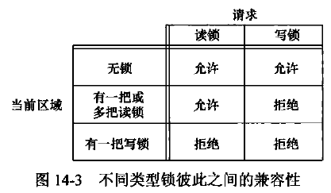

上面说明的兼容性规则适用于不同进程提出的锁请求，并不适用于单个进程提出的多个锁请求。如果一个进程对一个文件区间已经有了一把锁，后来该进程又企图在同一文件区间再加一把锁，那么新锁将替换老锁。

加读锁时，该描述符必须是读打开；加写锁时，该描述符必须是写打开。

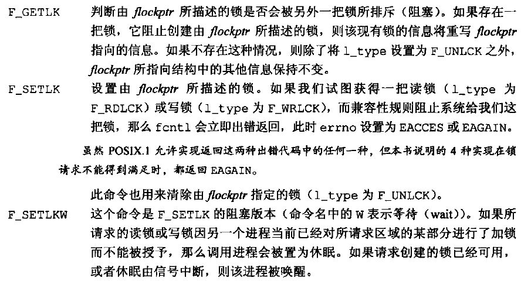

设置或释放文件上的锁时，**系统按要求组合或裂开相邻区**。例如，若字节100-199是加锁的区，需解锁地150字节，则内核将维持两把锁，一把用于字节100-149，另一把用于字节151-199。假定我们又对第150字节设置锁，那么系统将会把三个相邻的加锁区合并成一个区（从字节100至199）。其结果如图中的第一图所示，于是我们又回到了出发点。
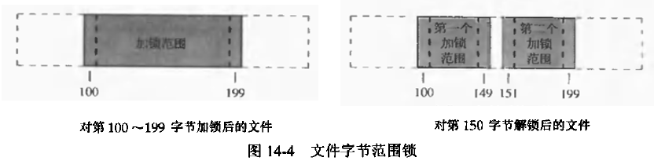


## 锁的隐含继承和释放

关于记录锁的自动继承和释放有三条规则：
* 锁与进程和文件两方面有关。这有两重含义：第一重是当一个进程终止时，它所建立的锁全部释放；第二重是无论何时关闭一个描述符时，则该进程通过这一描述符引用的文件上的任何一把锁都被释放（这些锁都是该进程设置的）。这就意味着如果执行下列四步：
```C++
fd = open(pathname, ...);
read_lock(fd1, ...);
fd2 = dup(fd1);  //fd2 = open(pathname, ...);也是一样的效果
close(fd2);
```
* 由fork产生的子进程不继承父进程所设置的锁。这意味着，若一个进程得到一把锁，然后调用fork，那么对于父进程获得的锁而言，子进程被视为另一个进程，对于从父进程处继承过来的任一描述符，子进程需要调用fcntl才能获得它自己的锁。这与锁的作用是相一致的。锁的作用是阻止多个进程同时写同一文件（或同一文件区域）。如果子进程继承父进程的锁，则父、子进程就可以同时写同一个文件。
* 在执行exec后，新程序可以继承原执行程序的锁。但是注意，如果对一个文件描述符设置了close-on-exec标志，那么当作为exec的一部分关闭该文件描述符时，对相应文件的所有锁都被释放了。


## 在文件尾端加锁

对于下面代码：
```C++
writew_lock(fd, 0, SEEK_END, 0);//在文件尾端加锁
write(fd, buf, 1);//在文件尾端追加的一个字符，该字符将被加锁
un_lock(fd, 0, SEEK_END);//对文件尾端进行解锁
write(fd, buf, 1);//在文件尾端追加的一个字符，该字符将不会被加锁
```
如果想要解除第一次write所写1个字节上的锁，那么应指定解锁长度为-1。
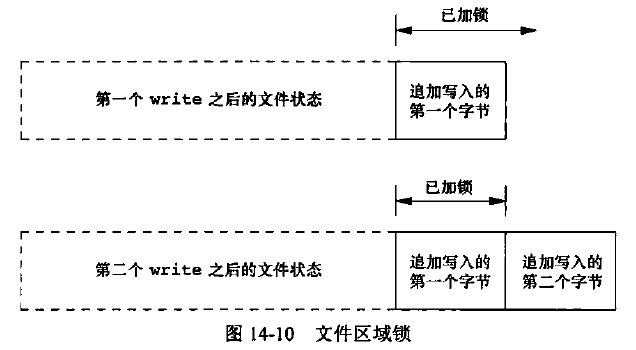


当对文件的一部分加锁时，内核将指定的偏移量变换成绝对文件偏移量。另外，除了指定一个绝对偏移量（SEEK_SET）之外，fcntl还允许我们相对于文件中的某个点（当前偏移量（SEEK_CUR）或文件尾端（SEEK_END））指定该偏移量。当前偏移量和文件尾端是可能不断变化的，而这种变化又不应影响现存锁的状态，所以内核必须独立于当前文件偏移量或文件尾端而记住锁。


## 建议性锁和强制性锁


# 14.4 I/O多路转接

如果从两个描述符进行读操作，如果仍旧使用阻塞I/O，那么就可能长时间阻塞在一个描述符上，而另一个描述符虽有很多数据却不能得到及时处理。
* 解决方案一：用fork将一个进程变成两个进程，每个进程处理一条数据通路。但是操作终止时，如果子进程接收到文件结束符，该子进程终止，然后父进程接收到SIGCHILD信号。但是，如若父进程终止，那么父进程应通知子进程停止，为此可以使用一个信号（例如SIGUSR1），但这使程序变得更加复杂。
* 解决方案二：使用一个进程中的两个线程。这避免了终止的复杂性，但却要求处理线程之间的同步，在减少复杂性方面可能会是得不偿失。
* 解决方案三：使用一个进程执行该程序，但使用非阻塞I/O读取数据。基本方法是将两个输入描述符都设置为非阻塞的，对第一个描述符发一个read。如果该输入上有数据，则读数据并处理它；如果无数据可读，则read立即返回。然后对第二个描述符作同样的处理。在此之后，等待若干秒，然后再读第一个描述符。这种形式的循环称为**轮询**。这种方法的不足之处是浪费CPU时间。因为大多数时间实际上是无数据可读的，但是仍花费时间不断反复执行read系统调用。在每次循环后要等多长时间再执行下一轮循环也很难确定。虽然轮询技术在支持非阻塞I/O的系统上都可使用，但是在多任务系统中应当避免使用这种方法。
* 解决方案四：使用异步I/O技术。其基本思想是进程告诉内核，当一个描述符已准备好可以进行I/O时，用一个信号通知它。该技术主要有两个问题：第一，并非所有系统都支持这种机制；第二，这种信号对每个进程而言只有1一个（SIGPOLL或SIGIO），如果使该信号对两个描述符都起作用，那么在接到此信号时进程无法判别是哪一个描述符已准备好可以进行I/O。为了确定是哪一个，仍需将这两个描述符都设置为非阻塞的，并顺序试执行I/O。

有效的解决方案：**I/O多路转接**。先构造一张有关描述符的列表，然后调用一个函数，直到这些描述符中的一个已准备好进行I/O时，该函数才返回。在返回时，它告诉进程哪些描述符已准备好可以进行I/O。


## 14.4.1 函数 select 和 pselect

在所有依从POSIX的平台上，`select`函数使我们可以执行I/O多路转接。传向select的参数告诉内核：
* 我们所关心的描述符。
* 对于每个描述符我们所关心的状态。（是否读一个给定的描述符？是否想写一个给定的描述符？是否关心一个描述符的异常状态？）
* 愿意等待多长时间（可以永远等待，等待一个固定量时间，或完全不等待）。

从select返回时，内核告诉我们：
* 已准备好的描述符的数量。
* 对于读、写或异常这三个状态中的每一个，哪些描述符已准备好。

使用这些返回信息，就可调用相应的I/O函数（一般是read或write），并且确知该函数不会阻塞。
```C++
#include <sys/select.h>
int select(int maxfdpl, fd_set *restrict readfds, fd_set *restrict writefds, fd_set *restrict exceptfds, struct timeval *restrict tvptr);
//返回值：准备就绪的描述符数；若超时，返回0；若出错，返回-1。


int  FD_ISSET(int fd, fd_set *set);
//返回值：若fd在描述符集中，返回非0值；否则，返回0。

void FD_CLR(int fd, fd_set *set);

void FD_SET(int fd, fd_set *set);

void FD_ZERO(fd_set *set);
```
对于最后一个参数tvptr：
* `tvptr == NULL`表示永远等待。如果捕捉到一个信号则中断此无限期等待。当所指定的描述符中的一个已准备好或捕捉到一个信号则返回。如果捕捉到一个信号，则select返回-1，errno设置为EINTR。
* `tvptr->tv_sec==0 && tvptr->tv_usec==0`表示根本不等待。测试所有指定的描述符并立即返回。这是得到多个描述符的状态而不阻塞select函数的轮询方法。
* `tvptr->tv_sec!=0 || tvptr->tv_usec!=0`表示等待指定的秒数和微秒数。当指定的描述符之一已准备好，或当指定的时间值已经超过时立即返回。如果在超时时还没有一个描述符准备好，则返回值是0。与第一种情况一样，这种等待可被捕捉到的信号中断。

中间的三个参数readfds、writefds和exceptfds是指向描述符集的指针。这三个描述符集说明了我们关心的可读、可写或处于异常条件的各个描述符。每个描述符集存放在一个fd_set数据类型中。这个数据类型可以为每一个可能的描述符保持一位。

调用FD_ZERO将一个fd_set变量的所有位设置为0。要开启描述符集中的一位，可以调用FD_SET。调用FD_CLR可以清除一位。最后，可以调用FD_ISSET测试描述符集中的一个指定位是否已打开。

select的中间三个参数（指向描述符集的指针）中的任意一个或全部都可以是空指针，这表示对相应状态并不关心。如果所有三个指针都是空指针，则select提供了较sleep更精确的计时器（sleep等待整数秒，而对于select，其等待的时间可以小于1s；其实际分辨率取决于系统时钟）。

select的第一个参数maxfdpl的意思是“最大描述符加1”。在三个描述符集中找出最大描述符编号值，然后加1，这就是第一个参数值。也可将第一个参数设置为FD_SETSIZE，这是<sys/select.h>中的一个常量，它说明了最大的描述符数（经常是1024）。但是对大多数应用程序而言，此值太大了，多数应用程序只使用3～10个描述符。

select有三个可能的返回值：
1. 返回值-1表示出错。出错是有可能的，例如在指定的描述符都没有准备好时捕捉到一个信号。在此种情况下，将不修改其中任何描述符集。
2. 返回值0表示没有描述符准备好。若指定的描述符都没有准备好，而且指定的时间已经超过，则发生这种情况。此时，所有描述符集皆被清0。
3. 正返回值表示已经准备好的描述符数，该值是三个描述符集中已准备好的描述符数之和，所以如果同一描述符已准备好读和写，那么在返回值中将其记为2。在这种情况下，三个描述符集仍旧打开的位对应于已准备好的描述符。

对于“准备好”的意思要作一些更具体的说明：
* 若对读集（readfds）中的一个描述符的read操作将不会阻塞，则此描述符是准备好的。
* 若对写集（writefds）中的一个描述符的write操作将不会阻塞，则此描述符是准备好的。
* 若异常状态集（exceptfds）中的一个描述符有一个未决异常状态，则此描述符是准备好的。
* 对于读、写和异常状态，普通文件描述符总是返回准备好。

**一个描述符阻塞与否并不影响select是否阻塞**。也就是说，如果希望读一个非阻塞描述符，并且以超时值为5s调用select，则select最多阻塞5s。相类似地，如果指定一个无限超时值，则在该描述符数据准备好或捕捉到一个信号之前，select一直阻塞。

如果在一个描述符上碰到了文件结尾处（EOF），则select认为该描述符是可读的。然后调用read，它返回0，这是UNIX系统指示到达文件结尾处的方法。

POSIX.1也定义了一个select的变体，即`pselect`函数。
```C++
#include <sys/select.h>

int pselect(int maxffdpl, fd_set *restrict readfds, fd_set *restrict writefds, fd_set *restrict exceptfds, const struct timespec *restrict tsptr, const sigset_t *restrict sigmask);
//返回值：准备就绪的描述符数；若超时，返回0；若出错，返回-1。
```
除下列几点外，pselect与select相同：
* select的超时值用timeval结构指定，但pselect使用timespec结构。timespec结构以秒和纳秒表示超时值，而非秒和微秒。如果平台支持这样精细的粒度，那么timespec就提供了更精准的超时时间。
* pselect的超时值被声明为const，这保证了调用pselect不会改变此值。
* 对于pselect可使用一可选择的信号屏蔽字。若sigmask为空，那么在与信号有关的方面，pselect的运行状况和select相同。否则，sigmask指向一信号屏蔽字，在调用pselect时，以原子操作的方式安装该信号屏蔽字。在返回时回复以前的信号屏蔽字。


## 14.4.2 函数 poll

poll函数类似于select，但是其程序员接口则有所不同。poll函数可用于任何类型的文件描述符。
```C++
#include <sys/select.h>

int poll(struct pollfd fdarray[], nfds_t nfds, int timeout);
//返回值：准备就绪的描述符数；若超时，返回0；若出错，返回-1。

struct pollfd {
    int       fd;         /* file descriptor to check, or <0 to ignore */
    short     events;     /* events of interest on fd */
    short     revents;    /* events that occurred on fd */
};
```
与select不同，poll不是为每个状态（可读性、可写性和异常状态）构造一个描述符集，而是构造一个pollfd结构数组，每个数组元素指定一个描述符编号以及其所关心的状态。fdarray数组中的元素数由nfds指定。

应将每个数组元素的events成员设置为下表中所示的值。通过这些值告诉内核我们对该描述符关心的是什么。返回时，内核设置revents成员，以说明对于该描述符已经发生了什么事件。（注意，poll没有更改events成员，这与select不同，select修改其参数以指示哪一个描述符已准备好了。）
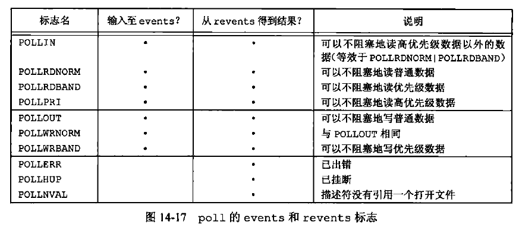

表中的前4行测试的是可读性，接下来的3行测试的是可写性，最后3行测试的是异常条件。最后3行是由内核在返回时设置的。即使在events字段中没有指定这3个值，如果相应条件发生，在revents中也会返回它们。

当一个描述符被挂断（POLLHUP）后，就不能再写该描述符。但是仍可能从该描述符读取到数据。

poll的最后一个参数说明我们愿意等待多少时间。如同select一样，有三种不同的情形：
* `timeout == –1`表示永远等待。（某些系统在<stropts.h>中定义了常量INFTIM，其值通常是-1。）当所指定的描述符中的一个已准备好，或捕捉到一个信号时则返回。如果捕捉到一个信号，则poll返回-1，errno设置为EINTR。
* `timeout == 0`表示不等待。测试所有描述符并立即返回。这是一种轮询系统的方法，可以找到多个描述符的状态而不阻塞poll函数。
* `timeout > 0`表示等待timeout毫秒。当指定的描述符之一已经准备好，或指定的时间值已超过时立即返回。如果已超时但是还没有一个描述符准备好，则返回值是0（如果系统不提供毫秒分辨率，则timeout值取整到最近的支持值）。

select和poll的可中断性：
中断的系统调用的自动再启动是由4.2BSD引进的，但当时select函数是不再启动的。这种特性在大多数系统中一直延续了下来，即使指定了SA_RESTART也是如此。但是，在SVR4之下，如果指定了SA_RESTART，那么select和poll也是自动再启动的。为了在将软件移植到SVR4派生的系统上时防止这一点，如果信号可能终端对select或poll的调用，则总是使用signal_intr函数。


# 14.5 异步I/O

关于描述符的状态，系统并不主动告诉我们任何信息，我们需要进行查询（调用select或poll）。

由BSD和System V派生的所有系统都提供了某种形式的异步I/O，使用一个信号（在System V中是STGPOLL，在 BSD中是SIGIO）通知进程，对某个描述符所关心的某个事件已经发生。

这些形式的异步I/O是受限制的：它们并不能用在所有的文件类型上，而且只能使用一个信号。如果要对一个以上的描述符进行异步I/O，那么在进程接收到该信号时并不知道这一信号对应于哪一个描述符。

当使用POSIX 异步I/O接口时，将会更加复杂：
* 每个异步操作有3处可能产生错误的地方：一处在操作提交的部分，一处在操作本身的结果，还有一处在用于决定异步操作状态的函数中。
* 与传统的接口相比，这些接口本身涉及大量额外的设置和处理规则。
* 从错误中恢复可能会比较困难。


## 14.5.1 System V 异步I/O

在系统V中，异步I/O是STREAMS系统的一部分。它只对STREAMS设备和STREAMS管道起作用。**System V的异步I/O信号是SIGPOLL**。

为了对一个STREAMS设备启动异步I/O，需要调用ioctl，它的第二个参数（request）是I_SETSIG。第三个参数是由表中的常量构成的整型值。这些常量在<stropts.h>中定义。
```C++
#include <sys/ioctl.h>

int ioctl(int fd, unsigned long request, ...);
```
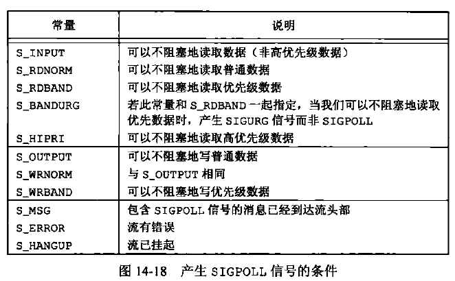

除了调用ioctl说明产生SIGPOLL信号的条件以外，还应为该信号建立信号处理程序。对于SIGPOLL信号的默认动作是终止该进程，所以应当在调用ioctl之前建立信号处理程序。


## 14.5.2 BSD异步I/O

**在BSB派生的系统中，异步I/O是SIGIO和SIGURG两个信号的组合**。前者是通用异步I/O信号，后者则用来通知进程在网络连接上到达了带外的数据。为了接收SIGIO信号，需执行下列三步：
1. 调用signal或sigaction为SIGIO信号建立信号处理程序。
2. 以命令F_SETOWN调用fcntl来设置进程ID和进程组ID，它们将接收对于该描述符的信号。
3. 以命令F_SETFL调用fcntl设置O_ASYNC文件状态标志，使在该描述符上可以进行异步I/O。

第3步仅能对指向终端或网络的描述符执行，这是BSD异步I/O设施的一个基本限制。

对于SIGURG信号，只需执行第1步和第2步。该信号仅对引用支持带外数据的网络连接描述符而产生。


## 14.5.3 POSIX异步I/O

POSIX异步I/O接口为对不同类型的文件进行异步IO提供了一套一致的方法。这些异步IO接口使用AIO控制块来描述I/O操作。aiocb结构定义了AIO控制块。该结构至少包括下面这些字段（具体的实现可能还包含有额外的字段）：
```C++
struct aiocb {
    int              aio_fildes;        /* file descriptor */
    off_t            aio_offset;        /* file offset for I/O */
    volatile void   *aio_buf;           /* buffer for I/O */
    size_t           aio_nbytes;        /* number of bytes to transfer */
    int              aio_reqprio;       /* priority */
    struct sigevent  aio_sigevent;      /* signal information */
    int              aio_lio_opcode;    /* operation for list I/O */
};
```
aio_fields字段表示被打开用来读或写的文件描述符。读或写操作从aio_offset指定的偏移量开始。对于读操作，数据会复制到缓冲区中，该缓冲区从aio_buf指定的地址开始。对于写操作，数据会从这个缓冲区中复制出来。aio_nbytes字段包含了要读或写的字节数。

注意，异步I/O操作必须显式地指定偏移量。异步I/O接口并不影响由操作系统维护的文件偏移量。只要不在同一个进程里把异步I/O函数和传统I/O函数混在一起用在同一个文件上，就不会导致什么问题。同时值得注意的是，如果使用异步I/O接口向一个以追加模式（使用O_APPEND）打开的文件中写入数据，AIO控制块中的aio_offset字段会被系统忽略。

其他字段和传统I/O函数中的不一致。应用程序使用aio_reqprio字段为异步I/O请求提示顺序。然而，系统对于该顺序只有有限的控制能力，因此不一定能遵循该提示。aio_lio_opcode字段只能用于基于列表的异步I/O。aio_sigevent字段控制在I/O事件完成后，如何通知应用程序，这个字段通过sigevent结构来描述。
```C++
struct sigevent {
    int         　　　sigev_notify;         　　　　　　/* notify type */
    int         　　　sigev_signo;        　　　　　　 /* signal number */
    union sigval     sigev_value;         　　　　　　/* notify argument */
    void (*sigev_notify_function)(union sigval);   　/* notify function */
    pthread_attr_t   *sigev_notify_attributes;     　/* notify attrs */
};
```
sigev_notify控制通知的类型。它可以取如下三个值：
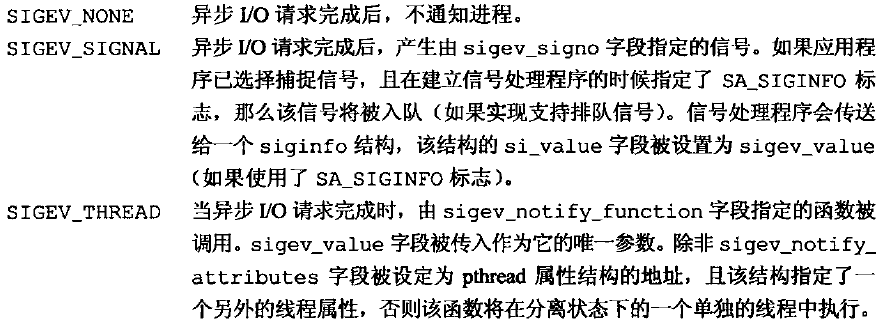

在进行异步I/O之前需要先初始化AIO控制块，调用`aio_read`函数来进行异步读操作，或调用`aio_write`函数来进行异步写操作。
```C++
#include <aio.h>

int aio_read(struct aiocb *aiocb);

int aio_write(struct aiocb *aiocb);
//两个函数的返回值：若成功，返回0；若出错，返回-1。
```
当这些函数返回成功时，异步I/O请求便已经被操作系统放入等待处理的队列中了。这些返回值与实际I/O操作的结果没有任何关系。I/O操作在等待时，必须注意确保AIO控制块和数据库缓冲区保持稳定；它们下面对应的内存必须始终是合法的，除非I/O操作完成，否则不能被复用。

要想强制所有等待中的异步操作不等待而写入持久化的存储中，可以设立一个AIO控制块并调用`aio_fsync`函数。
```C++
#include <aio.h>

int aio_fsync(int op, struct aiocb *aiocb);
//两个函数的返回值：若成功，返回0；若出错，返回-1。
```
AIO控制块中的aio_fildes字段指定了其异步写操作被同步的文件。如果op参数设定为O_DSYNC，那么操作执行起来就会像调用了fdatasync一样。否则，如果op参数设定为O_SYNC,那么操作执行起来就会像调用了fsync一样。

像aio_read和 aio_write函数一样，在安排了同步时，aio_fsync操作返回。在异步同步操作完成之前，数据不会被持久化。AIO控制块控制我们如何被通知，就像aio_read和aio_write函数一样。

为了获知一个异步读、写或者同步操作的完成状态，需要调用`aio_error`函数。
```C++
#include <aio.h>

int aio_error(const struct aiocb *aiocb);
```
返回值为下面4种情况中的一种。
* 0：异步操作成功完成。需要调用aio_return函数获取操作返回值。
* -1：对aio_error的调用失败。这种情况下，errno会告诉我们错误原因。
* EINPROGRESS：异步读、写或同步操作仍在等待。
* 其他情况：其他任何返回值是相关的异步操作失败返回的错误码。

如果异步操作成功，我们可以调用aio_return函数来获取异步操作的返回值。
```C++
#include <aio.h>

ssize_t aio_return(const struct aiocb *aiocb);
```
直到异步操作完成之前，都需要小心不要调用aio_return函数。操作完成之前的结果是未定义的。还需要小心对每个异步操作只调用一次aio_return。一旦调用了该函数，操作系统就可以释放掉包含了I/O操作返回值的记录。

如果aio_return函数本身失败，会返回-1，并设置errno。其他情况下，它将返回异步操作的结果，即会返回read、 write或者fsync在被成功调用时可能返回的结果。

执行I/O操作时，如果还有其他事务要处理而不想被I/O操作阻塞，就可以使用异步I/O。然而，如果在完成了所有事务时，还有异步操作未完成时，可以调用`aio_suspend`函数来阻塞进程，直到操作完成。
```C++
#include <aio.h>

int aio_suspend(const struct aiocb *const list[], int nent, const struct tiimespec *timeout);
//返回值：若成功，返回0；若出错，返回-1。
```
aio_suspend可能会返回三种情况中的一种。
* 如果我们被一个信号中断，它将会返回-1，并将errno设置为EINTR。
* 如果在没有任何I/O操作完成的情况下，阻塞的时间超过了函数中可选的 timeout参数所指定的时间限制，那么aio_suspend将返回-1，并将errno 设置为EAGAIN（不想设置任何时间限制的话，可以把空指针传给timeout参数）。
* 如果有任何I/O操作完成，aio_suspend将返回0。如果在我们调用aio_suspend操作时，所有的异步I/O操作都已完成，那么aio_suspend将在不阻塞的情况下直接返回。

list参数是一个指向AIO控制块数组的指针，nent参数表明了数组中的条目数。数组中的空指针会被跳过，其他条目都必须指向已用于初始化异步I/O操作的AIO控制块。

当还有我们不想再完成的等待中的异步I/O操作时，可以尝试使用`aio_cancel`函数来取消它们。
```C++
#include <aio.h>

int aio_cancel(int fd, struct aiocb *aiocb);
```
fd参数指定了那个未完成的异步I/O操作的文件描述符。如果aiocb参数为NULL，系统将会尝试取消所有该文件上未完成的异步I/O操作。其他情况下，系统将尝试取消由AIO控制块描述的单个异步I/O操作。我们之所以说系统“尝试”取消操作，是因为无法保证系统能够取消正在进程中的任何操作。

aio_cancel函数可能会返回以下4个值中的一个：
* AIO_ALLDONE：所有操作在尝试取消它们之前已经完成。
* AIO_CANCELED：所有要求的操作已被取消。
* AIO_NOTCANCELED至少有一个要求的操作没有被取消。
* -1：对aio_cancel的调用失败，错误码将被存储在errno 中。

如果异步I/O操作被成功取消，对相应的AIO控制块调用aio_error函数将会返回错误ECANCELED。如果操作不能被取消，那么相应的AIO控制块不会因为对aio_cancel的调用而被修改。

还有一个函数也被包含在异步IO接口当中，尽管它既能以同步的方式来使用，又能以异步的方式来使用，这个函数就是`lio_listio`。该函数提交一系列由一个AIO控制块列表描述的I/O请求。
```C++
#include <aio.h>

int lio_listio(int mode, struct aiocb *restrict const list[restrict], int nent, struct sigevent *restrict sigev);
//返回值：若成功，返回0；若出错，返回-1。
```
mode参数决定了I/O是否真的是异步的。
- 如果该参数被设定为LIO_WAIT，lio_listio函数将在所有由列表指定的I/O操作完成后返回。在这种情况下，sigev参数将被忽略。
- 如果mode参数被设定为LIO_NOWAIT，lio_listio函数将在I/O请求入队后立即返回。进程将在所有I/O操作完成后，按照sigev参数指定的，被异步地通知。如果不想被通知，可以把sigev设定为NULL。注意，每个AIO控制块本身也可能启用了在各自操作完成时的异步通知。被sigev参数指定的异步通知是在此之外另加的，并且只会在所有的I/O操作完成后发送。

list参数指向AIO控制块列表，该列表指定了要运行的I/O操作的。nent参数指定了数组中的元素个数。AIO控制块列表可以包含NULL指针，这些条目将被忽略。

在每一个AIO控制块中，aio_lio_opcode字段指定了该操作是一个读操作(LIO_READ)、写操作〈LIO_WRITE)，还是将被忽略的空操作（LIO_NOP)。读操作会按照对应的AIO控制块被传给了aio_read函数来处理。类似地，写操作会按照对应的AIO控制块被传给了aio_write函数来处理。

实现会限制我们不想完成的异步I/O操作的数量。这些限制都是运行时不变量。
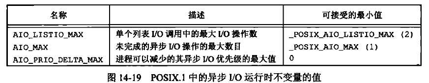

可以通过调用sysconf函数并把name参数设置为_SC_TO_LISTIO_MAX来设定ATO_LISTIO_MAX的值。类似地，可以通过调用sysconf并把name参数设置为_SC_AIO_MAX来设定AIO_MAX的值，通过调用sysconf并把其参数设置为_SC_AIO_PRIO_DELTA_MAX来设定AIO_PRIO_DELTA_MAX的值。

引入POSIX异步操作I/O接口的初衷是为实时应用提供一种方法，避免在执行I/O操作时阻塞进程。


# 14.6 函数 readv 和 writev

readv和writev函数用于在一次函数调用中读、写多个非连续缓冲区。有时也将这两个函数称为散布读（scatter read）和聚集写（gather write）。
```C++
#include <sys/uio.h>

ssize_t readv(int filedes, const struct iovec *iov, int iovcnt);
ssize_t writev(int filedes, const struct iovec *iov, int iovcnt);
//两个函数的返回值：已读或已写的字节数；若出错，返回-1。


struct iovec {
    void      *iov_base;      /* starting address of buffer */
    size_t    iov_len;        /* size of buffer */
};
```
iov数组中的元素数由iovcnt说明。其最大值受限于IOV_MAX。
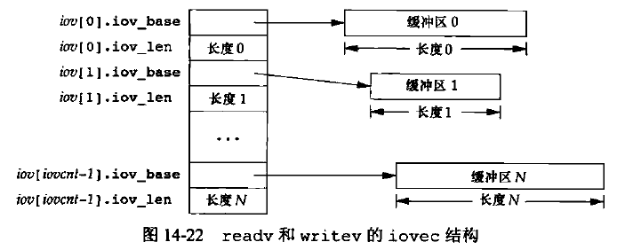

- writev函数从缓冲区中聚集输出数据的顺序是:iov[0]、iov[1]直至iov[ iovcnt-1]。writev返回输出的字节总数，通常应等于所有缓冲区长度之和。
- readv函数则将读入的数据按上述同样顺序散布到缓冲区中。readv总是先填满一个缓冲区，然后再填写下一个。readv返回读到的字节总数。如果遇到文件尾端，己无数据可读，则返回0。


# 14.7 函数 readn 和 writen

管道、FIFO以及某些设备（特别是终端、网络）有下列两种性质：
1. 一次read操作所返回的数据可能少于所要求的数据，即使还没有达到文件尾端也可能是这样。这不是一个错误，应当继续读该设备。
2. 一次write操作的返回值也可能少于指定输出的字节数。这可能是由某个因素造成的，例如，内核输出缓冲区变满。这也不是错误，应当继续写余下的数据至该设备。（通常，只有对非阻塞描述符，或捕捉到一个信号时，才发生这种write的中途返回。）

在读、写磁盘文件时从未见到过这种情况，除非文件系统用完了空间，或者我们接近了配额限制，而不能将要求写的数据全部写出。

通常当读、写一个管道、网络设备或终端时，我们需要考虑这些特性。下面两个函数`readn`和`writen`的功能是读、写指定的N字节数据，并处理返回值小于要求值的情况。这两个函数只是按需多次调用read和write直至读、写了N字节数据。
```C++
/* 自定义函数，具体实现见rwn.c */
ssize_t readv(int filedes, const struct iovec *iov, int iovcnt);
ssize_t writev(int filedes, const struct iovec *iov, int iovcnt);
//两个函数的返回值：读、写的字节数；若出错，返回-1。
```‘
注意，若在已经读、写了一些数据后出错，则这两个函数返回已经传输的数据量，而非出错返回。与此类似，在读时如达到文件尾，而且在此之前已经成功地读了一些数据，但尚未满足所要求的量，则readn返回已复制到调用者缓冲区中的字节数。

readn函数和writen函数具体实现：
```C++
#include <stdio.h>
#include <unistd.h>
#include <sys/types.h>

ssize_t readn(int fd, void *ptr, size_t n)
{
    size_t nleft;
    ssize_t nread;

    nleft = n;
    while(nleft>0)
    {
        if((nread = read(fd, ptr, nleft)) < 0)
        {
            if(nleft == n)
            {
                return(-1);//出错
            }
            else
            {
                break;//出错，终止循环，返回已经读过的字节数
            }
        }
        else if(nread == 0)
        {
            break;//EOF
        }
        nleft -= nread;
        ptr += nread;
    }

    return (n-nleft);
}


ssize_t writen(int fd, void *ptr, size_t n)
{
    size_t nleft;
    ssize_t nwriteten;

    nleft = n;
    while(nleft > 0)
    {
        if((nwriteten = write(fd, ptr, n)) < 0)
        {
            if(nleft == n)
            {
                return(-1);//出错
            }
            else
            {
                break;//出错，终止循环，返回已经写过的字节数
            }
        }
        else if(nwriteten == 0)
        {
            break;
        }
        nleft -= nwriteten;
        ptr += nwriteten;
    }
    return (n-nleft);
}
```


# 14.8 存储映射I/O

存储映射I/O能**将一个磁盘文件映射到存储空间中的一个缓冲区上**，于是，当从缓冲区中取数据时，就相当于读文件中的相应字节。与此类似，将数据存入缓冲区时,相应字节就自动写入文件。这样，就可以在不使用read和write的情况下执行I/O。

为了使用这种功能，应首先告诉内核将一个给定的文件映射到一个存储区域中。这是由mmap函数实现的。
```C++
#include <sys/mman.h>

void *mmap(void *addr, size_t len, int prot, int flag, int fd, off_t off);
//返回值：若成功，返回映射区的起始地址；若出错，返回MAP_FAILED。
```
addr参数用于指定映射存储区的起始地址。通常将其设置为0，这表示由系统选择该映射区的起始地址。此函数的返回地址是该映射区的起始地址。

fd指定要被映射文件的描述符。在映射该文件到一个地址空间之前，先要打开该文件。len是映射的字节数。off是要映射字节在文件中的起始偏移量。

prot参数说明对映射存储区的保护要求，**对指定映射存储区的保护要求不能超过文件open模式访问权限**。prot参数的取值如下表所示（除PROT_NONE外的选项可以按位或）：
| prot | 说明 |
| :----:| :----: |
| PROT_READ | 映射区可读 |
| PROT_WRITE | 映射区可写 |
| PROT_EXEC | 映射区可执行 |
| PROT_NONE | 映射区不可访问 |

flag参数影响映射存储区的多种属性：
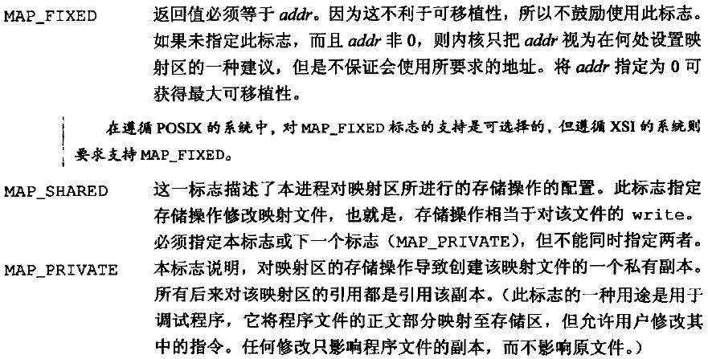

下图显示了一个存储映射文件。其中，“起始地址”是mmap的返回值。映射存储区位于堆和栈之间，这属于实现细节，各种实现之间可能不尽相同。
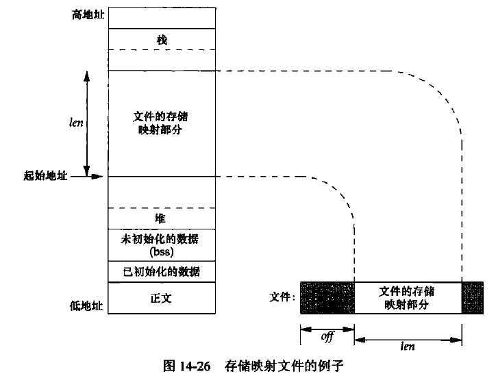

off和addr的值（如果指定了MAP_FIXED）通常应当是系统虚存页长度的倍数。虚存页长可用带参数_SC_PAGESIZE或_SC_PAGE_SIZE的sysconf函数得到。因为off和addr常常指定为0，所以这种要求一般并不重要。

因为映射文件的起始偏移量受系统虚拟存储页长度的限制，那么如果映射区的长度不是页长的整数倍时，映射区中超过起始偏移量的部分都会被设置为0。我们可以修改这部分字节，但是任何变动都不会在文件中反映出来。因此，不能用mmap将数据添加到文件中。我们必须先加长该文件。


与映射区相关的信号有SIGSEGV和SIGBUS。
* 信号SIGSEGV通常用于指示进程试图访问对它不可用的存储区。如果映射存储区被mmap 指定成了只读的，那么进程试图将数据存入这个映射存储区的时候，也会产生此信号。
* 如果映射区的某个部分在访问时已不存在，则产生SIGBUS信号。例如，假设用文件长度映射了一个文件，但在引用该映射区之前，另一个进程已将该文件截断。此时，如果进程试图访问对应于该文件已截去部分的映射区，将会接收到SIGBUS信号。

子进程能通过fork继承存储映射区（因为子进程复制父进程地址空间，而存储映射区是该地址空间中的一部分），但是由于同样的原因，新程序则不能通过exec继承存储映射区。

调用`mprotect`可以更改一个现存映射存储区的权限。
```C++
#include <sys/mman.h>

int mprotect(void *addr, size_t len, int prot);
//返回值：若成功，返回0；若出错，返回-1。
```
prot的许可值与mmap中prot参数一样。注意，地址参数addr的值必须是系统页长的整数倍。

如果修改的页是通过MAP_SHARED标志映射到地址空间的，那么修改并不会立即写回到文件中。相反，何时写回脏页由内核的守护进程决定，决定的依据是系统负载和用来限制在系统失败事件中的数据损失的配置参数。因此，如果只修改了一页中的一个字节，当修改被写回到文件中时，整个页都会被写回。

如果共享映射中的页已修改，那么可以调用`msync`将该页冲洗到被映射的文件中（写回磁盘）。msync函数类似于fsync，但作用于存储映射区。
```C++
#include <sys/mman.h>

int msync(void *addr, size_t len, int flags);
//返回值：若成功，返回0；若出错，返回-1。
```

如果映射是私有的，那么不修改被映射的文件。与其他存储映射函数一样，地址必须与页边界对齐。

flags参数使我们对如何冲洗存储区有某种程度的控制。我们可以指定MS_ASYNC标志以简化被写页的调度。如果我们希望在返回之前等待写操作完成，则可指定MS_SYNC标志。一定要指定MS_ASYNC和MS_SYNC中的一个。MS_INVALIDATE是一个可选标志，使用它以通知操作系统丢弃与底层存储器没有同步的任何页。若使用了此标志，某些实现将丢弃在指定范围中的所有页，但这并不是所期望的。

当进程终止时，会自动解除存储映射区的映射，或者直接调用`munmap`函数也可以解除映射区。关闭映射存储区时使用的文件描述符并不解除映射区。
```C++
#include <sys/mman.h>

int munmap(caddr_t addr, size_t len);
//返回值：若成功，返回0；若出错，返回-1。
```
munmap并不影响被映射的对象，也就是说，调用munmap并不会使映射区的内容写到磁盘文件上。对于MAP_SHARED区磁盘文件的更新，会在我们将数据写到存储映射区后的某个时刻，按内核虚拟存储算法自动进行。在存储区解除映射后，对MAP_PRIVATE存储区的修改会被丢弃。

`read+write`和`mmap+memcpy`的主要区别在于：
与mmap和memcpy相比，read和write执行了更多的系统调用，并做了更多的复制。read和write将数据从内核缓冲区中复制到应用缓冲区（read），然后再把数据从应用缓冲区复制到内核缓冲区（write）。而mmap和memcpy则直接把数据从映射到地址空间的一个内核缓冲区复制到另一个内核缓冲区。当引用尚不存在的内存页时，这样的复制过程就会作为处理页错误的结果而出现（每次错页读发生一次错误，每次错页写发生一次错误）。如果系统调用和额外的复制操作的开销和页错误的开销不同，那么这两种方法中就会有一种比另一种表现更好。

将一个普通文件复制到另一个普通文件中时，存储映射I/O比较快。但是有一些限制，例如，不能用其在某些设备（例如网络设备或终端设备）之间进行复制，并且在对被复制的文件进行映射后，也要注意该文件的 长度是否改变。