[TOC]


# 15.1 引言

同一台主机的两个进程之间的IPC、不同主机上的两个进程之间的IPC

管道、FIFO、消息队列、信号量、共享存储


# 15.2 管道

管道的两种局限性：历史上管道是半双工的；管道只能在具有公共祖先的两个进程之间使用。

每当在管道中键入一个命令序列，让shell执行时，shell都会为每一条命令单独创建一个进程，然后用管道将前一条命令进程的标准输出与后一条命令的标准输入相连接。

管道是通过调用`pipe`函数创建的。
```C++
#include <unistd.h>

int pipe(int fd[2]);
//返回值：若成功，返回0；若出错，返回-1。
```
经由参数fd返回的两个文件描述符：fd[0]为读而打开，fd[1]为写而打开。fd[1]的输出是fd[0]的输入。

向管道的读端写数据，或者从管道的写端读数据都会导致错误。

下图给出了两种描绘半双工管道的方法。左图显示管道的两端在一个进程中相互连接，右图则强调**数据需要通过内核在管道中流动**。
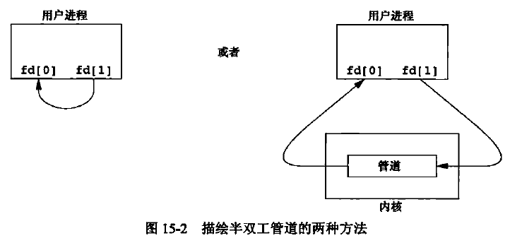

fstat函数对管道的每一端都返回一个FIFO类型的文件描述符。可以用S_ISFIFO宏来测试管道。

当管道的一端被关闭后，下列两条规则起作用：
* 当读一个写端已被关闭的管道时，在所有数据都被读取后，read返回0，表示达到了文件结尾处。
* 如果写一个读端已被关闭的管道，则产生信号SIGPIPE。如果忽略该信号或者捕捉该信号并从其处理程序返回，则write返回-1，errno设置为EPIPE。

在写管道（或FIFO）时，常量PIPE_BUF规定了内核的管道缓冲区大小。如果对管道调用write，而且要求写的字节数小于等于PIPE_BUF，则此操作不会与其他进程对同一管道（或FIFO）的write 操作交叉进行。但是，若有多个进程同时写一个管道（或FIFO），而且我们要求写的字节数超过PIPE_BUF，那么我们所写的数据可能会与其他进程所写的数据相互交叉。用pathconf或fpathconf函数可以确定PIPE_BUF的值。


# 15.3 函数 popen 和 pclose

常见的操作是创建一个管道连接到另一个进程，然后读其输出或向其输入端发送数据，为此，标准I/O库提供了两个函数`popen`和`pclose`。这两个函数实现的操作是：创建一个管道，调用fork产生一个子进程，关闭管道的不使用端，执行一个shell以运行命令，然后等待命令终止。
```C++
#include <stdio.h>

FILE *popen(const char *cmdstring, const char *type);
//返回值：若成功，返回文件指针；若出错，返回NULL。

int pclose(FILE *fp);
//返回值：若成功，返回cmdstring的终止状态；若出错，返回-1。
```
函数popen先执行fork，然后调用exec以执行cmdstring，并且返回一个标准I/O文件指针。如果type是“r”，则文件指针连接到cmdstring的标准输出；如果type是“w”，则文件指针连接到cmdstring的标准输入。
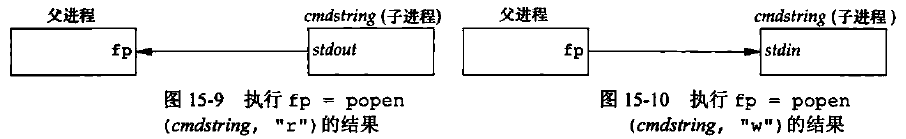

pclose函数关闭标准I/O流，等待命令执行结束，然后返回shell的终止状态。如果shell不能被执行，则pclose返回的终止状态与shell已执行exit（127）一样。


# 15.4 协同进程

UNIX系统过滤程序从标准输入读取数据，向标准输出写数据。几个过滤程序通常在shell管道中线性连接。当一个过滤程序既产生某个过滤程序的输入，又读取该过滤程序的输出时，它就变成了协同进程（coprocess）。

popen只提供连接到另一个进程的标准输入或标准输出的一个单向管道，而对于协同进程，则它有连接到另一个进程的两个单向管道——一个接到其标准输入，另一个则来自其标准输出。

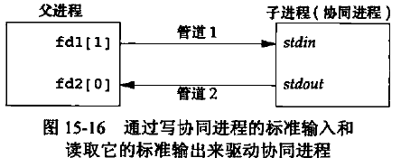


# 15.5 FIFO

FIFO有时被称为命名管道。未命名的管道只能在两个相关的进程之间使用，而且这两个相关的进程还要有一个共同的祖先进程。但是，通过FIFO，不相关的进程也能交换数据。

创建FIFO类似于创建文件。确实，FIFO的路径名存在于文件系统中。
```C++
#include <sys/stat.h>

int mkfifo(const char *path, mode_t mode);

int mkfifoat(int fd, const char *path, mode_t mode);
//两个函数的返回值：若成功，返回0；若出错，返回-1。
```
mkfifo函数中mode参数的规格说明与open函数中mode的相同。

mkfifoat函数和mkfifo函数相似，但是mkfifoat函数可以被用来在fd文件描述符表示的目录相关的位置创建一个FIFO。像其他*at函数一样，这里有3种情形:
1. 如果path参数指定的是绝对路径名，则fd参数会被忽略掉，并且mkfifoat函数的行为和mkfifo类似。
2. 如果path参数指定的是相对路径名，则fd参数是一个打开目录的有效文件描述符，路径名和目录有关。
3. 如果path参数指定的是相对路径名，并且fd参数有一个特殊值AT_FDCWD，则路径名以当前目录开始，mkfifoat和rnkfifo类似。

一旦已经用mkfifo创建了一个FIFO，就可用open打开它。其实，一般的文件I/O函数（close、read、write、unlink等）都可用于FIFO。

当打开一个FIFO时，非阻塞标志（O_NONBLOCK）产生下列影响：
* 在一般情况中（没有指定O_NONBLOCK），只读open要阻塞到某个其他进程为写而打开此FIFO。类似地，只写open要阻塞到某个其他进程为读而打开它。
* 如果指定了O_NONBLOCK，则只读open立即返回。但是，如果没有进程已经为读而打开一个FIFO，那么只写open将出错返回-1，其errno是ENXIO。

类似于管道，若用write写一个尚无进程为读而打开的FIFO，则产生信号SIGPIPE。若某个FIFO的最后一个写进程关闭了该FIFO，则将为该FIFO的读进程产生一个文件结束标志。

一个给定的FIFO有多个写进程是很常见的。这就意味着如果不希望多个进程所写的数据互相穿插，则需考虑原子写操作。正如对于管道一样，常量PIPE_BUF说明了可被原子地写到FIFO的最大数据量。

FIFO有下面两种用途：
1. shell命令使用FIFO将数据从一条管道线传送到另一条时，无需创建中间临时文件。
2. FIFO用于客户进程-服务器进程应用程序中，以在客户进程和服务器进程之间传送数据。


# 15.6 XSI IPC

有3种被称为XSI IPC的IPC：消息队列、信号量、共享存储器。

## 15.6.1 标识符和键

每个内核中的IPC结构（消息队列、信号量或共享存储段）都用一个非负整数的标识符加以引用。与文件描述符不同，IPC标识符不是小的整数。当一个IPC结构被创建，然后又被删除时，与这种结构相关的标识符连续加1，直到达到一个整型数的最大正值，然后又回转到0。

标识符是IPC对象的内部名。为使多个合作进程能够在同一IPC对象上汇聚，需要提供一个外部名方案。为此使用了键（key），每个IPC对象都与一个键相关联，于是键就用作为该对象的外部名。

无论何时创建IPC结构（通过调用`msgget`、`semget`或`shmget`创建），都应指定一个键。这个键的数据类型是基本系统数据类型`key_t`，通常在头文件<sys/types.h>中被定义为长整型。这个键由内核变换成标识符。

有多种方法使客户进程和服务器进程在同一IPC结构上汇聚：
1. 服务器进程可以指定键IPC_PRIVATE创建一个新IPC结构，将返回的标识符存放在某处（如一个文件）以便客户进程取用。键IPC_PRIVATE保证服务器进程创建一个新IPC结构。这种技术的缺点是：文件系统操作需要服务器进程将整型标识符写到文件中，此后客户进程又要读这个文件取得此标识符。
IPC_PRIVATE键也可用于父进程子关系。父进程指定IPC_PRIVATE创建一个新IPC结构，所返回的标识符可供fork后的子进程使用。接着，子进程又可将此标识符作为exec函数的一个参数传给一个新程序。
2. 可以在一个公用头文件中定义一个客户进程和服务器进程都认可的键。然后服务器进程指定此键创建一个新的IPC结构。这种方法的问题是该键可能已与一个IPC结构相结合，在此情况下，get函数（msgget、 semget或shmget）出错返回。服务器进程必须处理这一错误，删除已存在的IPC结构,然后试着再创建它。
3. 客户进程和服务器进程认同一个路径名和项目ID（项目ID是0~255之间的字符值），接着调用函数ftok将这两个值变换为一个键。然后在方法（2）中使用此键。

`ftok`提供的唯一服务就是由一个路径名和项目ID产生一个键。
```C++
#include <sys/ipc.h>

key_t ftok(const char *path, int id);
//返回值：若成功，返回键；若出错，返回（key_t）-1。
```
path参数必须引用一个现有的文件。当产生键时，只使用id参数的低8位。

ftok创建的键通常是用下列方式构成的：按给定的路径名取得其stat结构中的部分st_dev和st_ino字段，然后再将它们与项目ID组合起来。如果两个路径名引用的是两个不同的文件，那么ftok通常会为这两个路径名返回不同的键。但是，因为i节点编号和键通常都存放在长整型中，所以创建键时可能会丢失信息。这意味着，对于不同文件的两个路径名，如果使用同一项目ID，那么可能产生相同的键。

3 个get函数（msgget、semget和 shmget）都有两个类似的参数：一个key和一个整型flag。在创建新的IPC结构（通常由服务器进程创建）时，如果key是IPC_PRIVATE或者和当前某种类型的IPC结构无关，则需要指明flag的IPC_CREAT标志位。为了引用一个现有队列（通常由客户进程创建），key必须等于队列创建时指明的key的值，并且IPC_CREAT必须不被指明。

注意，决不能指定IPC_PRIVATE作为键来引用一个现有队列，因为这个特殊的键值总是用于创建一个新队列。为了引用一个用IPC_PRIVATE键创建的现有队列，一定要知道这个相关的标识符，然后在其他IPC调用中（如msgsnd、msgrcv）使用该标识符，这样可以绕过get函数。

如果希望创建一个新的IPC结构，而且要确保没有引用具有同一标识符的一个现有IPC结构，那么必须在flag中同时指定IPC_CREAT和IPC_EXCL位。这样做了以后，如果IPC结构已经存在就会造成出错，返回EEXIST（这与指定了O_CREAT和O_EXCL标志的open相类似）。


## 15.6.2 权限结构

XSI IPC为每一个IPC结构设置了一个ipc_perm结构。该结构规定了权限和所有者。它至少包括下列成员：
```C++
struct ipc_perm {
    uid_t    uid;     /* owner's effective user id */
    gid_t    gid;     /* owner's effective group id */
    uid_t    cuid;    /* creator's effective user id */
    gid_t    cgid;    /* creator's effective group id */
    mode_t   mode;    /* access modes */
    ...
};
```
在创建IPC结构时，对所有字段都赋初值。以后，可以调用`msgctl`、`semctl`或`shmctl`修改uid、gid和mode字段。为了改变这些值，调用进程必须是IPC结构的创建者或超级用户。更改这些字段类似于对文件调用chown和chmod。

对于任何IPC结构都不存在执行权限。

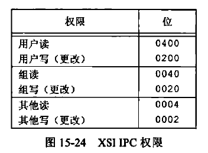


## 15.6.3 结构限制

三种形式的XSI IPC都有内置限制。这些限制的大多数可以通过重新配置内核而加以更改。


## 15.6.4 优点和缺点

IPC结构是在系统范围内起作用的，没有引用计数。例如，如果进程创建了一个消息队列，并且在该队列中放入了几则消息，然后终止，那么该消息队列及其内容不会被删除。它们会一直留在系统中直至发生下列动作为止：由某个进程调用msgrcv或msgctl读消息或删除消息队列；或某个进程执行ipcrm(1)命令删除消息队列；或正在自举的系统删除消息队列。

IPC结构在文件系统中没有名字。我们不能用第3章和第4章中所述的函数来访问它们或修改它们的属性。为了支持这些IPC对象，内核中增加了十几个全新的系统调用（msgget、semop、shmat等）。我们不能用1s命令查看IPC对象，不能用rm命令删除它们，也不能用chmod命令修改它们的访问权限。于是，又增加了两个新命令ipcs(1)和ipcrm(1)。

因为这些形式的IPC不使用文件描述符，所以不能对它们使用多路转接I/O函数（select和pol1）。这使得它很难一次使用一个以上这样的IPC结构，或者在文件或设备I/O中使用这样的IPC结构。

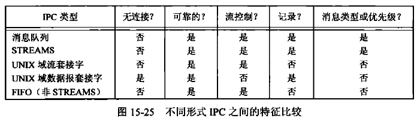


# 15.7 消息队列

消息队列是消息的链接表，存储在**内核**中，由消息队列标识符标识。

`msgget`用于创建一个新队列或打开一个现有队列。
`msgsnd`将新消息添加到队列尾端。每个消息包含一个正的长整型类型的字段、一个非负的长度以及实际数据字节数（对应于长度），所有这些都在将消息添加到队列时，传送给msgsnd。
`msgrcv`用于从队列中取消息。我们并不一定要以先进先出次序取消息，也可以按消息的类型字段取消息。

每个队列都有一个`msqid_ds`结构与其相关联:
```C++
struct msqid_ds {
    struct ipc_perm    msg_perm;      /* see section 15.6.2 */
    msgqnum_t          msg_qnum;      /* # of messages on queue */
    msglen_t           msg_qbytes;    /* max # of bytes no queue */
    pid_t              msg_lspid;     /* pid of last msgsnd() */
    pid_t              msg_lrpid;     /* pid of last msgrcv() */
    time_t             msg_stime;     /* last-msgsnd() time */
    time_t             msg_rtime;     /* last-msgrcv() time */
    time_t             msg_ctime;     /* last-change time */
    ...
};
```
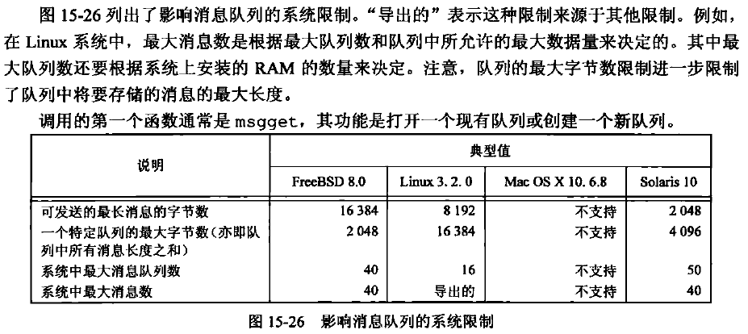

调用的第一个函数通常是`msgget`，其功能是打开一个现存队列或创建一个新队列。
```C++
#include <sys/msg.h>

int msgget(key_t key, int flag);
//返回值：若成功，返回消息队列ID；若出错，返回-1。
```
当创建一个新队列时，要初始化msqid_ds结构的下列成员：
* ipc_perm结构中mode成员按flag中的相应权限位设置。
* msg_qnum、msg_lspid、msg_lrpid、msg_stime和msg_rtime都设置为0。
* msg_ctime设置为当前时间。
* msg_qbytes设置为系统限制值。

若msgget函数执行成功，msgget返回非负队列ID。此后，该值就可被用于其他三个消息队列函数（msgsnd、msgrcv和msgctl）。

msgctl函数对队列执行多种操作。它和另外两个与信号量和共享存储有关的函数（semctl和shmctl）是XSI IPC的类似于ioctl的函数（亦即垃圾桶函数）。
```C++
#include <sys/msg.h>

int msgctl(int msqid, int cmd, struct msqid_ds *buf);
//返回值：若成功，返回0；若出错，返回-1。
```
cmd参数说明对由msqid指定的队列要执行的命令：
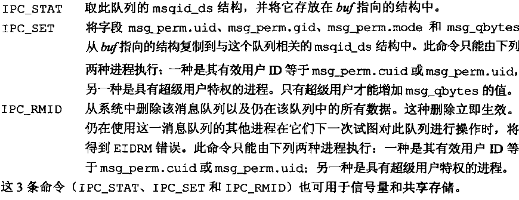

调用msgsnd将数据放到消息队列中。每个消息都由三部分组成：一个正的长整型类型的字段、一个非负的长度（nbytes）以及实际数据字节数（对应于长度）。消息总是放在队列尾端。
```C++
#include <sys/msg.h>

int msgsnd(int msqid, const void *ptr, size_t nbytes, int flag);
//返回值：若成功，返回0；若出错，返回-1。
```
ptr参数指向一个长整型数，它包含了正的整型消息类型，在其后紧跟着消息数据（若nbytes是0，则无消息数据）。若发送的最长消息是512字节，则可定义下列结构：
```C++
struct mymesg {
    long    mtype;         /* positive message type */
    char    mtext[512];    /* message data, of length nbytes */
};
```
ptr就是一个指向mymesg结构的指针。接收者可以使用消息类型以非先进先出的次序取消息。

参数flag的值可以指定为IPC_NOWAIT。这类似于文件I/O的非阻塞I/O标志。若消息队列己满（或者是队列中的消息总数等于系统限制值，或队列中的字节总数等于系统限制值)，则指定IPC_NOWAIT使得msgsnd立即出错返回EAGAIN。如果没有指定IPC_NOWAIT,则进程会一直阻塞到：有空间可以容纳要发送的消息；或者从系统中删除了此队列；或者捕捉到一个信号并从信号处理程序返回。在第二种情况下，会返回EIDRM错误（“标识符被删除”）。最后一种情况则返回EINTR错误。

注意，对删除消息队列的处理不是很完善。因为每个消息队列没有维护引用计数器（打开文件有这种计数器），所以在队列被删除以后，仍在使用这一队列的进程在下次对队列进行操作时会出错返回。信号量机构也以同样方式处理其删除。相反，删除一个文件时，要等到使用该文件的最后一个进程关闭了它的文件描述符以后，才能删除文件中的内容。

当msgsnd返回成功时，消息队列相关的msqid_ds结构会随之更新，表明调用的进程ID(mnsg_lspid)、调用的时间（nsg_stime）以及队列中新增的消息（msg_qnum）。

msgrcv从队列中取用消息。
```C++
#include <sys/msg.h>

ssize_t msgrcv(int msqid, void *ptr, size_t nbytes, long type, int flag);
//返回值：若成功，返回消息数据部分的长度；若出错，返回-1。
```
和msgsnd一样，ptr参数指向一个长整型数（其中存储的是返回的消息类型），其后跟随的是存储实际消息数据的缓冲区。nbytes指定数据缓冲区的长度。若返回的消息长度大于nbytes，而且在flag中设置了MSG_NOERROR位，则该消息会被截断（在这种情况下，没有通知告诉我们消息截断了，消息被截去的部分被丢弃)。如果没有设置这一标志，而消息又太长，则出错返回E2BIG（消息仍留在队列中）。

参数type可以指定想要哪一种消息，type值非0用于以非先进先出次序读消息：
* type == 0：返回队列中的第一个消息。
* type > 0：返回队列中消息类型为type的第一个消息。
* type < 0：返回队列中消息类型值小于等于type绝对值的消息，如果这种消息有若干个，则取类型值最小的消息。

可以将flag值指定为IPC_NOWAIT，使操作不阻塞，这样，如果没有所指定类型的消息可用，则msgrcv返回-1，error设置为ENOMSG。如果没有指定IPC_NOWAIT，则进程会一直阻塞到有了指定类型的消息可用，或者从系统中删除了此队列（返回-1，error设置为EIDRM），或者捕捉到一个信号并从信号处理程序返回（这会导致msgrcv返回-1，errno设置为EINTR）。

msgrcv成功执行时，内核会更新与该消息队列相关联的msgid_ds结构，以指示调用者的进程ID（msg_lrpid）和调用时间（msg_rtime），并指示队列中的消息数减少了1个（msg_qnum）。


# 15.8 信号量

信号量（semaphore）与已经介绍过的IPC机构（管道、FIFO以及消息队列）不同。它是一个计数器，用于多进程对共享数据对象的访问。

为了获得共享资源，进程需要执行下列操作：
* 测试控制该资源的信号量。
* 若此信号量的值为正，则进程可以使用该资源。进程将信号量值减1，表示它使用了一个资源单位。
* 若此信号量的值为0，则进程进入休眠状态，直至信号量值大于0，进程被唤醒后，它返回至第（1）步。

当进程不再使用由一个信号量控制的共享资源时，该信号量值增1。如果有进程正在休眠等待此信号量，则唤醒它们。

为了正确地实现信号量，**信号量值的测试及减1操作应当是原子操作**。为此，信号量通常是在内核中实现的。

常用的信号量形式被称为二元信号量。它控制单个资源，其初始值为1。但是，一般而言，信号量的初值可以是任意一个正值，该值表明有多少个共享资源单位可供共享应用。

以下3种特性造成了XSI信号量的不必要的复杂性：
1. 信号量并非是单个非负值，而必需定义为含有一个或多个信号量值的集合。当创建信号量时，要指定集合中信号量值的数量。
2. 信号量的创建（`semget`）是独立于它的初始化（`semctl`）。这是一个致命的缺点，因为不能原子地创建一个信号量集合，并且对该集合中的各个信号量值赋初值。
3. 即使没有进程正在使用各种形式的XSI IPC，它们仍然是存在的。有的程序在终止时并没有释放已经分配给它的信号量。

内核为每个信号量集合维护着一个semid_ds结构:
```C++
struct semid_ds {
    struct ipc_perm    sem_perm;    
    unsigned short     sem_nsems;    /* # of semaphores in set */
    time_t             sem_otime;    /* last-semop() time */
    time_t             sem_ctime;    /* last-change time */
    ...
};
```

每个信号量由一个无名结构表示，它至少包含下列成员：
```C++
struct {
    unsigned short    semval;     /* semaphore value, always >= 0 */
    pid_t             sempid;     /* pid for last operation */
    unsigned short    semncnt;    /* # processes awaiting semval>curval */
    unsigned short    semzcnt;    /* # processes awaiting semval==0 */
};
```

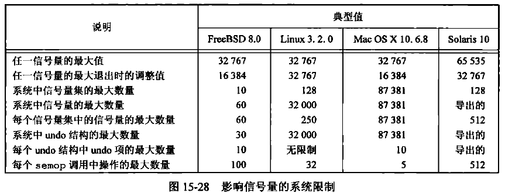

通过调用semget函数来获得一个信号量ID。
```C++
#include <sys/sem.h>

int semget(key_t key, int nsems, int flag);
//返回值：若成功，返回信号量ID；若出错，返回-1。
```

创建一个新集合时，对semid_ds结构的下列成员赋初值：
* 初始化ipc_perm结构。该结构中mode成员按flag中的相应权限位设置。
* sem_otime设置为0.
* sem_ctime设置为当前时间。
* sem_nsems设置为nsems。

nsems是该集合中的信号量数。如果是创建新集合（一般在服务器进程中），则必须指定nsems。如果引用一个现存的集合（一个客户进程），则将nsems指定为0。

semctl函数包含了多种信号量操作。
```C++
#include <sys/sem.h>

int semctl(int semid, int semnum, int cmd, ... /* union semun arg */);
```
第4个参数是可选的，是否使用取决于所请求的命令，如果使用该参数，则其类型是semun，它是多个命令特定参数的联合（union）:
```C++
union semun {
    int                 val;      /* for SETVAL */
    struct semid_ds    *buf;      /* for IPC_STAT and IPC_SET */
    unsigned short     *array;    /* for GETALL and SETALL */
};
```

cmd参数指定下列10种命令中的一种，这些命令是运行在semid指定的信号量集合上的。其中有5种命令是针对一个特定的信号量值的，它们用semnum指定该信号量集合中的一个成员。semnum值在0和nsems—1之间，包括0和nsems—1。
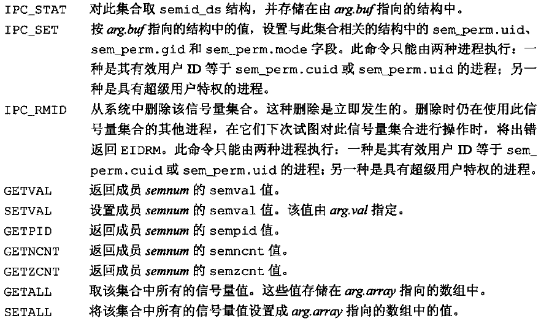

对于除GETALL以外的所有GET命令，semctl函数都返回相应的值。其他命令的返回值为0。

函数`semop`自动执行信号量集合上的操作数组，这是个原子操作。
```C++
#include <sys/sem.h>

int semop(int semid, struct sembuf semoparray[], size_t nops);
//返回值：若成功，返回0；若出错，返回-1。
```
参数nops规定该数组中操作的数量（元素数），参数semoparray是一个指针，它指向一个由sembuf结构表示的信号量操作数组：
```C++
struct sembuf {
    unsigned short    sem_num;         /* member # in set ( 0, 1, ..., nsems-1) */
    short             sem_op;          /* operation (negtive, 0, or positive) */
    short             sem_flag;        /* IPC_NOWAIT, SEM_UNDO */
};
```

对集合中每个成员的操作由相应的sem_op值规定。此值可以是负值、0或正值。（下面的讨论将提到信号量的“undo”标志。此标志对应于相应的sem_f1g成员的SEM_UNDO位。）
1. 最易于处理的情况是sem_op为正值。这对应于进程释放的占用的资源数。sem_op值会加到信号量的值上。如果指定了undo标志，则也从该进程的此信号量调整值中减去sem_op。
2. 若sem_op为负值，则表示要获取由该信号量控制的资源。
如若该信号量的值大于等于semn_op的绝对值（具有所需的资源），则从信号量值中减去sem_op的绝对值。这能保证信号量的结果值大于等于0。如果指定了undo标志，则sem_op的绝对值也加到该进程的此信号量调整值上。
如果信号量值小于sem_op的绝对值（资源不能满足要求），则适用下列条件：
    a. 若指定了IPC_NOWAIT，则semop出错返回EAGAIN.
    b. 若未指定IPC_NOWAIT，则该信号量的semncnt值加1（因为调用进程将进入休眠状态)），然后调用进程被挂起直至下列事件之一发生。
        i. 此信号量值变成大于等于sem_op的绝对值（即某个进程已释放了某些资源）。此信号量的semncnt值减1（因为已结束等待），并且从信号量值中减去sem_op的绝对值。如果指定了undo标志，则sem_op的绝对值也加到该进程的此信号量调整值上。
        ii. 从系统中删除了此信号量。在这种情况下，函数出错返回EIDRM。
        iii. 进程捕捉到一个信号，并从信号处理程序返回，在这种情况下，此信号量的semncnt值减1（因为调用进程不再等待），并且函数出错返回EINTR。
3. 若sem_op为0，这表示调用进程希望等待到该信号量值变成0。
如果信号量值当前是0，则此函数立即返回。如果信号量值非0，则适用下列条件。
    a. 若指定了IPC_NOWAIT，则出错返回EAGAIN。
    b. 若未指定IPC_NOWAIT，则该信号量的semzcnt值加1（因为调用进程将进入休眠状态)，然后调用进程被挂起，直至下列的一个事件发生。
        i. 此信号量值变成0。此信号量的 semzcnt值减1（因为调用进程已结束等待）。
        ii. 从系统中删除了此信号量。在这种情况下，函数出错返回EIDRM。
        iii. 进程捕捉到一个信号，并从信号处理程序返回。在这种情况下，此信号量的semzcnt值减1（因为调用进程不再等待），并且函数出错返回EINTR。

semop函数具有原子性，它或者执行数组中的所有操作，或者一个也不做。

exit时信号量调整：
正如前面提到的，如果在进程终止时，它占用了经由信号量分配的资源，那么就会成为一个问题。无论何时，只要为信号量操作指定了SEM_UNDO标志，然后分配资源（sem_op值小于0），那么内核就会记住对于该特定信号量，分配给调用进程多少资源（sem_op的绝对值）。当该进程终止时，不论自愿或者不自愿，内核都将检验该进程是否还有尚未处理的信号量调整值，如果有，则按调整值对相应信号量值进行处理。

如果用带有SETVAL或SETALL命令的semctl设置一信号量的值，则在所有进程中，对于该信号量的调整值都设置为0。


# 15.9 共享存储

共享存储允许两个或更多进程共享一个给定的存储区。因为数据不需要在客户进程和服务器进程之间复制，所以这是**最快**的一种IPC。使用共享存储时要掌握的唯一窍门是多个进程之间**对一个给定存储区的同步访问**。若服务器进程正在将数据放入共享存储区，则在它做完这一操作之前，客户进程不应当去取这些数据。通常，信号量被用来实现对共享存储访问的同步。（记录锁或互斥量也可以用于这种场合。）

我们已经看到了共享存储的一种形式，就是在多个进程将同一个文件映射到它们的地址空间的时候。XSI共享存储和内存映射的文件的不同之处在于，前者没有相关的文件。XSI 共享存储段是内存的匿名段。

内核为每个共享存储段维护着一个结构，该结构至少要为每个共享存储段包含以下成员:
```C++
struct shmid_ds {
    struct ipc_perm    shm_perm;    
    size_t             shm_segsz;       /* size of segment in bytes */
    pid_t              shm_lpid;        /* pid of last shmop() */
    pid_t              shm_cpid;        /* pid of creator */
    shmatt_t           shm_nattch;      /* number of current attaches */
    time_t             shm_atime;       /* last-attach time */
    time_t             shm_dtime;       /* last-detach tiime */
    time_t             shm_ctime;       /* last-change time */
    ...
};
```
shmatt_t类型定义为不带符号整型，它至少与unsigned short一样大。
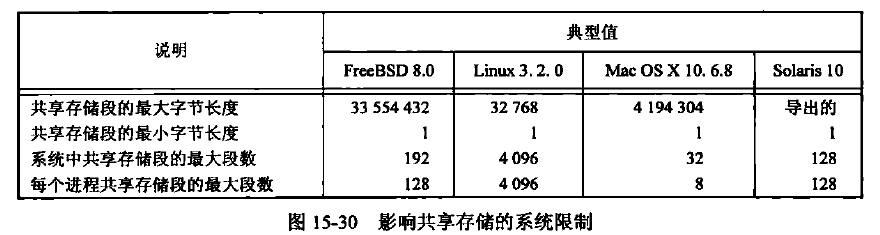

为获得一个共享存储标识符，调用的第一个函数通常是`shmget`。
```C++
#include <sys/shm.h>

int shmget(key_t key, size_t size, int flag);
//返回值：若成功，返回共享存储ID；若出错，返回-1。
```
当创建一个新段时，初始化shmid_ds结构的下列成员：
* 初始化ipc_perm结构。该结构中mode成员按flag中的相应权限位设置。
* shm_lpid、shm_nattach、shm_atime、以及shm_dtime都设置为0。
* shm_ctime设置为当前时间。
* shm_segsz设置为请求的长度（size）。

参数size是该共享存储段的长度（单位：字节）。实现通常将其**向上取为系统页长的整数倍**。但是，若应用指定的size值并非系统页长的整数倍，那么最后一页的余下部分是不可使用的。如果正在创建一个新段（一般是在服务器进程中），则必须指定其size。如果正在引用一个现存的段（一个客户进程），则将size指定为0。当创建一新段时，段内的内容初始化为0。

shmctl函数对共享存储段执行多种操作。
```C++
#include <sys/shm.h>

int shmctl(int shmid, int cmd, struct shmid_ds *buf);
//返回值：若成功，返回0；若出错，返回-1。
```
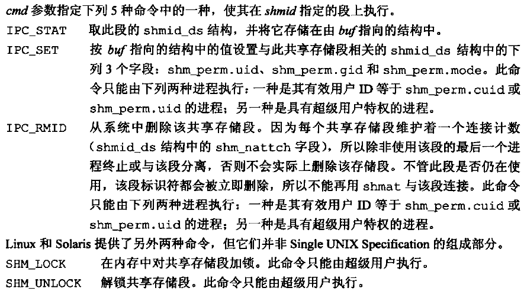

一旦创建了一个共享存储段，进程就可调用shmat将其连接到它的地址空间中。
```C++
#include <sys/shm.h>

void *shmat(int shmid, const void *addr, int flag);
//返回值：若成功，返回指向共享存储的指针；若出错，返回-1。
```

共享存储段连接到调用进程的哪个地址上与addr参数以及在flag中是否指定SHM_RND位有关：
* 如果addr为0，则此段连接到由内核选择的第一个可用地址上。这是推荐的使用方式。
* 如果addr非0，并且没有指定SHM_RND，则此段连接到addr所指定的地址上。
* 如果addr非0，并且指定了SHM_RND，则此段连接到（addr-(addr mod SHMLBA)）所表示的地址上。SHM_RND命令的意思是“取整”。SHMLBA的意思是“低边界地址倍数”，它总是2的乘方。该算式是将地址向下取最近1个SHMLBA的倍数。

除非只计划在一种硬件上运行应用程序（这在当今是不大可能的），否则不应指定共享段所连接到的地址。所以一般应指定addr为0，以便由内核选择地址。

如果在flag中指定了SHM_RDONLY位，则以只读方式连接此段。否则以读写方式连接此段。

shmat的返回值是该段所连接的实际地址，如果出错则返回-1。如果shmat成功执行，那么内核将使该共享存储段shmid_ds结构中的shm_nattach计数器值加1。

当对共享存储段的操作已经结束时，则调用`shmdt`函数脱接该段。注意，这并不从系统中删除其标识符以及数据结构。该标识符仍然存在，直至某个进程（一般是服务器进程）带命令IPC_RMID调用shmctl特地删除它。
```C++
#include <sys/shm.h>

int shmdt(void *addr);
//返回值：若成功，返回0；若出错，返回-1。
```
addr参数是以前调用shmat时的返回值。如果成功，shmdt将使相关shmid_ds结构中的shm_nattach计数器值减1。


# 15.10 POSIX信号量

POSIX信号量接口，意在解决XSI信号量接口的几个不足之处：
* POSIX信号量接口相比于XSI信号量接口，允许更高性能的实现。
* POSIX信号量接口简单易用：没有信号量集，其中一些接口模仿了我们熟悉的文件系统操作。
* POSIX信号量删除时的处理更加合理。XSI信号量被删除后，使用该信号量标识符的操作将会出错返回，并将errno设置为EIDRM。而对于POSIX信号量，操作可以继续正常执行，直到对该信号量的最后一个引用被释放。

POSIX信号量有两种形式：命名的和未命名的。它们的差异在于创建和销毁的形式上，但其他工作一样。未命名信号量只存在于内存中，并要求能使用信号量的进程必须可以访问内存。这意味着它们只能应用在同一进程中的线程，或者不同进程中已经映射相同内存内容到它们的地址空间中的线程。相反，命名信号量可以通过名字访问，因此可以被任何已知它们名字的进程中的线程使用。

我们可以调用`sem_open`函数来创建一个新的命名信号量或者使用一个现有信号量。
```C++
#include <semaphore.h>

sem_t *sem_open(const char *name, int oflag, ... /* mode_t mode, unsigned int value */ );
//返回值：若成功，返回指向信号量的指针；若出错，返回SEM_FAILED。
```
当使用一个现有的命名信号量时，我们仅仅指定两个参数：信号量的名字和oflag参数的0值。

当这个oflag参数有O_CREAT标志集时，如果命名信号量不存在，则创建一个新的。如果它已经存在，则会被使用，但是不会有额外的初始化发生。

当我们指定O_CREAT标志时，需要提供两个额外的参数。mode参数指定谁可以访问信号量。mode的取值和打开文件的权限位相同：用户读、用户写、用户执行、组读、组写、组执行、其他读、其他写和其他执行。赋值给信号量的权限可以被调用者的文件创建屏蔽字修改。注意，只有读和写访问要紧，但是**当我们打开一个现有信号量时接口不允许指定模式。实现经常为读和写打开信号量**。

在创建信号量时, value参数用来指定信号量的初始值。它的取值是0~SEM_VALUE_MAX。

如果我们想确保创建的是信号量，可以设置oflag参数为`O_CREAT | O_EXCL`。如果信号量已经存在，会导致sem_open失败。

为了增加可移植性，在选择信号量命名时必须遵循一定的规则：
* 名字的第一个字符应该为斜杠(/)。尽管没有要求POSIX信号量的实现要使用文件系统，但是如果使用了文件系统，我们就要在名字被解释时消除二义性。
* 名字不应包含其他斜杠以此避免实现定义的行为。例如，如果文件系统被使用了，那么名字`/mysem`和`//mysem`会被认定为是同一个文件名，但是如果实现没有使用文件系统，那么这两种命名可以被认为是不同的。
* 信号量名字的最大长度是实现定义的。名字不应该长于_POSIX_NAME_MAX个字符长度。因为这是使用文件系统的实现能允许的最大名字长度的限制。

如果想在信号量上进行操作，sem_open函数会为我们返回一个信号量指针，用于传递到其他信号量函数上。当完成信号量操作时，可以调用`sem_close`函数来释放任何信号量相关的资源。
```C++
#include <semaphore.h>

int sem_close(sem_t *sem);
//返回值：若成功，返回0；若出错，返回-1。
```
如果进程没有首先调用sem_close而退出，那么内核将自动关闭任何打开的信号量。注意，这不会影响信号量值的状态——如果已经对它进行了增1操作，这并不会仅因为退出而改变。类似地，如果调用sem_close，信号量值也不会受到影响。在XSI信号量中没有类似SEM_UNDO标志的机制。

可以使用`sem_unlink`函数来销毁一个命名信号量。
```C++
#include <semaphore.h>

int sem_unlink(const char *name);
//返回值：若成功，返回0；若出错，返回-1。
```
sem_unlink函数删除信号量的名字。如果没有打开的信号量引用，则该信号量会被销毁。否则，销毁将延迟到最后一个打开的引用关闭。

不像XSI信号量，我们只能通过一个函数调用来调节POSIX信号量的值。计数减1和对一个二进制信号量加锁或者获取计数信号量的相关资源是相类似的。

可以使用`sem_wait`或者`sem_trywait`函数来实现信号量的减1操作。
```C++
#include <semaphore.h>

int sem_trywait(sem_t *sem);

int sem_wait(sem_t *sem);
//两个函数的返回值：若成功，返回0；若出错，返回-1。
```
使用sem_wait函数时，如果信号量计数是0就会发生阻塞。直到成功使信号量减1或者被信号中断时才返回。可以使用sem_trywait函数来避免阻塞。调用sem_trywait时，如果信号量是0，则不会阻塞，而是会返回-1并且将errno置为EAGAIN。第三个选择是阻塞一段确定的时间。为此，可以使用`sem_timewait`函数。
```C++
#include <semaphore.h>
#include <time.h>

int sem_timedwait(sem_t *restrict sem, const struct timespec *restrict tsptr);
//返回值：若成功，返回0；若出错，返回-1。
```
想要放弃等待信号量的时候，可以用tsptr参数指定绝对时间。超时是基于CLOCK_REALTIME时钟的。如果信号量可以立即减1，那么超时值就不重要了，尽管指定的可能是过去的某个时间，信号量的减1操作依然会成功。如果超时到期并且信号量计数没能减1，sem_timedwait将返回-1且将errno设置为ETIMEDOUT。

可以调用`sem_post`函数使信号量值增1。这和解锁一个二进制信号量或者释放一个计数信号量相关的资源的过程是类似的。
```C++
#include <semaphore.h>

int sem_post(sem_t *sem);
//返回值：若成功，返回0；若出错，返回-1。
```
调用sem_post时，如果在调用sem_wait（或者sem_timedwait）中发生进程阻塞，那么进程会被唤醒并且被sem_post增1的信号量计数会再次被sem_wait（或者sem_timedwait）减1。

当我们想在单个进程中使用POSIX信号量时，使用未命名信号量更容易。这仅仅改变创建和销毁信号量的方式。可以调用`sem_init`函数来创建一个未命名的信号量。
```C++
#include <semaphore.h>

int sem_init(sem_t *sem, int pshared, unsigned int value);
//返回值：若成功，返回0；若出错，返回-1。
```
pshared参数表明是否在多个进程中使用信号量。如果是，将其设置成一个非0值。value参数指定了信号量的初始值。

需要声明一个sem_t类型的变量并把它的地址传递给sem_init来实现初始化，而不是像semopen函数那样返回一个指向信号量的指针。如果要在两个进程之间使用信号量，需要确保sem参数指向两个进程之间共享的内存范围。

对未命名信号量的使用已经完成时，可以调用`sem_destroy`函数丢弃它。
```C++
#include <semaphore.h>

int sem_destroy(sem_t *sem);
//返回值：若成功，返回0；若出错，返回-1。
```
调用sem_destroy后，不能再使用任何带有sem的信号量函数，除非我们再次使用sem_init对sem进行初始化。

我们可以调用`sem_getvalue`函数来获取信号量值。
```C++
#include <semaphore.h>

int sem_getvalue(sem_t *sem, int *restrict valp);
//返回值：若成功，返回0；若出错，返回-1。
```
成功后，valp指向的整数值将包含信号量值。但是请注意，我们试图要使用我们刚读出来的值的时候，信号量的值可能已经变了。除非使用额外的同步机制来避免这种竞争，否则sem_getvalue函数只能用于调试。


# 15.11 客户进程—服务器进程属性


