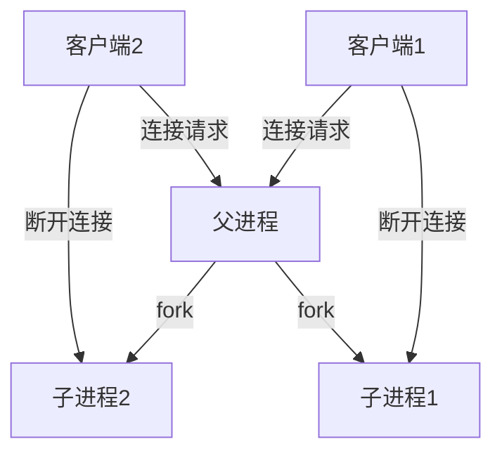

[TOC]
# 10.1进程概念及引用

## 并发服务器端的实现方法
1、多进程服务器：通过创建多个进程提供服务。
2、多路复用服务器：通过捆绑并统一管理I/O对象提供服务。
3、多线程服务器：通过生成与客户端等量的线程提供服务。


## 进程
定义：占用内存空间的正在运行的程序。
进程是资源分配的最小单位。

多核CPU（具有多个运算器）的核的个数与可同时运行的进程数相同；如果进程数超过核数，进程将分时使用CPU资源。


## 进程ID（PID）
创建进程时会从操作系统分配到进程ID，其值大于2（1号进程ID被分配给操作系统启动后的用于协助操作系统的首个进程）。


## 通过调用fork函数创建进程
```C++
#include <unistd.h> //头文件
pid_t fork(void);   //函数原型，成功时返回进程ID，失败返回-1。
```
fork函数将创建当前调用的进程的副本，两个进程接下来都执行fork函数返回之后的语句。
fork函数执行后，父进程返回子进程的PID，子进程返回0。

代码示例：
```C++
#include <stdio.h>
#include <unistd.h>

int gval = 10;
int main(int argc, char *argv[])
{
    pid_t pid;
    int lval = 20;
    gval++;
    lval+=5;

    pid = fork();
    if(pid==0){
        //该进程是子进程
        gval+=2;
        lval+=2;
    }
    else{
        //该进程是父进程
        gval-=2;
        lval-=2;
    }

    if(pid==0)
        printf("Child Proc: [%d, %d] \n",gval,lval);
    else
        printf("Parent Proc: [%d, %d] \n",gval,lval);

    return 0;
}
```

运行结果
> Parent Proc: [9, 23]
> Child Proc: [13, 27]

调用fork函数后,父子进程拥有完全独立的内存结构。


# 10.2进程和僵尸进程

## 僵尸进程和其产生原因
僵尸进程：进程完成工作后，未被销毁，从而变成僵尸进程，继续占用系统中的重要资源。

设置僵死（zombie）状态的目的是维护子进程的信息，以便父进程在以后某个时候获取。这些信息包括子进程的进程ID、终止状态以及资源利用信息（CPU时间、内存使用量等等)。

向exit函数传递的参数值和main函数的return语句返回的值都会传递给操作系统。而操作系统不会销毁子进程，直到把这些值传递给产生该子进程的父进程。

如果父进程未主动要求获得子进程的结束状态值，操作系统将一直保存，并让子进程长时间处于僵尸进程状态。

如果一个父进程终止了，内核会安排**init进程**成为它的孤儿进程的养父。init进程的PID为1, 是在系统启动时由内核创建的，它不会终止，是所有进程的祖先。如果父进程没有回收它的僵死子进程就终止了，那么内核会安排init进程去回收它们。

代码示例
``` C++
#include <stdio.h>
#include <unistd.h>

int main(int argc, char *argv[])
{
    __pid_t pid = fork();
    
    if(pid==0){
        //该进程是子进程
        puts("Hi, I am a child process");
    }
    else{
        //该进程是父进程
        printf("Child Process ID: %d \n",pid);
        sleep(30);//休眠30秒
    }

    if(pid==0)
        puts("End child process");
    else
        puts("End parent process");

    return 0;
}
```

运行结果
>Child Process ID: 6641 
>Hi, I am a child process
>End child process
> / * *中间间隔30秒，因为休眠了,> 此时载终端中运行 ps au指令，有：* * /
> / *  **taojikun   6641  0.0  0.0      0     0 pts/3    Z+   13:33   0:00 [zombie] <defunct>** * /
> / *  *可见子进程现在为僵尸进程* * /
>End parent process
>/ * *30秒过去后，再运行ps au指令，会发现父进程和子进程均被销毁*  * /


## 销毁僵尸进程：利用wait/waitpid函数
```C++
#include <sys/wait.h>       //头文件
pid_t wait(int * statloc);  //wait函数原型，成功时返回子进程ID，失败返回-1。
pid_t waitpid(pid_t pid, int * statloc, int options);  //waitpid函数原型，成功时返回子进程ID或0，失败返回-1。
```

**wait/waitpid会令调用者阻塞直至某个子进程终止**。

函数wait和waitpid均返回两个值:已终止子进程的进程ID号，以及通过statloc指针返回的子进程终止状态（一个整数)。

如果调用wait的进程没有已终止的子进程，不过有一个或多个子进程仍在执行，那么wait将阻塞到现有子进程第一个终止为止。

waitpid函数就等待哪个进程以及是否阻塞给了我们更多的控制。首先，pid参数允许我们指定想等待的进程ID，**值-1表示等待第一个终止的子进程**（即当pid=-1时，相当于wait函数）。其次，options参数允许我们指定附加选项,最常用的选项是 **<font color="#dd0000">WNOHANG</font>** ，它告知内核在没有已终止子进程时不要阻塞。

wait代码示例
``` C++
#include <stdio.h>
#include <stdlib.h>
#include <unistd.h>
#include <sys/wait.h>

int main(int argc, char *argv[])
{
    int status;
    __pid_t pid=fork();

    if(pid==0){
        return 3;
    }
    else{
        printf("Child PID: %d \n",pid);
        pid = fork();
        if ((pid==0)){
            exit(7);
        }
        else{
            printf("Child PID: %d \n",pid);
            wait(&status);
            if(WIFEXITED(status)){
                printf("Child send one: %d \n", WEXITSTATUS(status));
            }

            wait(&status);
            if(WIFEXITED(status)){
                printf("Child send two: %d \n", WEXITSTATUS(status));
            }
            sleep(30);
        }
        

        
    }

    return 0;
}
```

运行结果
> Child PID: 8322 
> Child PID: 8323 
> Child send one: 3 
> Child send two: 7 


waitpid代码示例
``` C++
#include <stdio.h>
#include <unistd.h>
#include <sys/wait.h>

int main(int argc, char *argv[])
{
    int status;
    __pid_t pid=fork();

    if(pid==0){
        sleep(15);
        return 24;
    }
    else{
        while(!(pid = waitpid(-1,&status,WNOHANG)))
        {
            printf("Child PID: %d \n",pid);
            //没有终止进程时，waitpid返回0
            printf("waitpid return pid %d ,sleep 3 sec.\n", pid);
            sleep(3);
        }

        if(WIFEXITED(status)){
            printf("waitpid return pid %d \n", pid);
            printf("Child send %d \n", WEXITSTATUS(status));
        }
    }

    return 0;
}
```

运行结果
> Child PID: 8842 
> waitpid return pid 0 ,sleep 3 sec.
> waitpid return pid 0 ,sleep 3 sec.
> waitpid return pid 0 ,sleep 3 sec.
> waitpid return pid 0 ,sleep 3 sec.
> waitpid return pid 0 ,sleep 3 sec.
> waitpid return pid 8842 
> Child send 24 

参考：[waitpid函数详解](https://blog.csdn.net/weixin_45227610/article/details/122841209)


# 10.3信号处理

## 信号与signal函数
``` C++
#include <signal.h>     //头文件
void (*signal(int signo, void (*func)(int)))(int);  //为了在产生信号时调用,返回之前注册的函数指针。
```

对于第一个参数signo，表示某些特殊情况的信息（信号），常见以下信号：
* SIGALRM: 已到通过调用alarm函数注册的时间。
* SIGINT: 输入CTRL+C。
* SIGCHLD: 在子进程终止时，会给父进程发送一个SIGCHLD信号。

对于第二个参数func(函数指针)，表示当第一个参数表示的信号发生时，操作系统要调用对应的func函数进行处理。


## 利用信号处理技术消灭僵尸进程
代码示例
``` C++
#include <stdio.h>
#include <stdlib.h>
#include <unistd.h>
#include <signal.h>
#include <sys/wait.h>

void read_childproc(int signo)
{
    int status;
    pid_t pid;
    while((pid = waitpid(-1,&status,WNOHANG)) > 0)
    {
        if(WIFEXITED(status)){
            printf("Remove proc pid: %d \n", pid);
            printf("Child send %d \n", WEXITSTATUS(status));
        }
    }
}

int main(int argc, char *argv[])
{
    struct sigaction act;
    act.sa_handler=read_childproc;
    sigemptyset(&act.sa_mask);
    act.sa_flags=0;
    sigaction(SIGCHLD,&act,0);
    

    __pid_t pid=fork();

    if(pid==0){
        puts("Hi!I am Child Process1!");
        sleep(10);
        return 12;
    }
    else{
        printf("Child PID: %d \n",pid);
        pid = fork();
        if ((pid==0)){
            puts("Hi,I am child process2!");
            sleep(10);
            exit(24);
        }
        else{
            int i;
            printf("Child PID: %d \n",pid);
            for(i=0;i<5;++i)
            {
                puts("wait...");
                sleep(5);
            }
        }
    }

    return 0;
}
```

运行结果
> Child PID: 9820 
> Hi!I am Child Process1!
> Child PID: 9821 
> wait...
> Hi,I am child process2!
> wait...
> Remove proc pid: 9820 
> Child send 12 
> Remove proc pid: 9821 
> Child send 24 
> wait...
> wait...
> wait...


# 10.4基于多任务的并发服务器


## 基于进程的并发服务器模型



## 通过fork函数复制文件描述符
从严格意义上说，套接字属于操作系统，只是进程拥有代表相应套接字的文件描述符。调用fork函数后，父子进程的文件描述符指向操作系统中的同一套接字。调用close函数后，只会销毁该套接字在该进程中的文件描述符，当套接字的所有文件描述符都被销毁时，才能销毁套接字。

