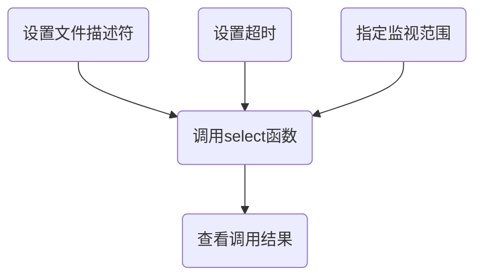

[TOC]

# 12.1基于IO复用的服务器端

## 多进程服务器端的缺点和解决方法
为了构建并发服务器，只要有客户端连接请求就会创建新进程。

缺点：创建进程时需要大量的运算和内存空间，由于每个进程都具有独立的内存空间，所以相互间的数据交换也要求采用相对复杂的方法（IPC)。

## 复用技术在服务器端的应用
引入复用技术，可以减少进程数，重要的是，无论连接多少客户端，提供服务的进程只有1个。


# 12.2理解select函数并实现服务器端

## select函数的功能和调用顺序
select函数允许进程指示内核等待多个事件中的任何一个发生，并只在有一个或多个事件发生或经历一段指定的时间后才唤醒它。

``` C++
#include <sys/select.h>
#include <sys/time.h>
int select(inr maxfd, fd_set * readset, fd_set * writeset, fd_set * exceptset, const struct timeval * timeout);
//若有就绪描述符则为其数目，若超时则为0，若出错则为-1。
```

select函数调用顺序：



## 设置文件描述符
* FD_ZERO(fd_set * fdset)：将fd_set变量的所有位初始化为0。
* FD_SET(int fd, fd_set* fdset)：在参数fdset指向的变量中注册文件描述符fd的信息。
* FD_CLR(int fd, fd_set* fdset):从参数fdset指向的变量中清除文件描述符fd的信息。
* FD_ISSET(int fd, fd_set * fdset)：若参数fdset指向的变量中包含文件描述符fd的信息，则返回“真”。


## 设置检查（监视）范围及超时
select函数要求通过第一个参数传递监视对象文件描述符的数量。每次新建文件描述符时，其值都会增1，故只需将最大的文件描述符值加1再传递到select函数即可（加1是因为文件描述符的值从0开始）。

select函数的超时时间与select函数的最后一个参数有关，其中timeval结构体定义如下：
```C++
struct timeval
{
    int tv_sec;
    int tv_usec;
}
```
* 永远等下去：仅在有描述符准备好后返回，timeval设置为空指针。
* 等待一段固定时间：在有描述符准备好时返回，且时间不超过指定时间，在timeval结构中指定秒数和微秒数。
* 根本不等待：检查描述符后立即返回，timeval中的秒数和微秒数设置为0。


## 调用select函数后查看结果
select函数返回后，我们使用FD_ISSET宏来测试fd_set数据类型中的描述符。描述符集内任何与未就绪描述符对应的位返回时均清成0。为此，每次重新调用select函数时，我们都得再次把所有描述符集内所关心的位均置为1。


代码示例
```C++
#include <stdio.h>
#include <unistd.h>
#include <sys/time.h>
#include <sys/select.h>

#define BUF_SIZE 30

int main(int argc, char *argv[])
{
    fd_set readset,tempset;
    int result,str_len;
    char buf[BUF_SIZE];
    struct timeval timeout;
    FD_ZERO(&readset);
    FD_SET(0,&readset);//标准IO的输入的描述符为0


    while(1)
    {
        tempset = readset;
        timeout.tv_sec=5;
        timeout.tv_usec=0;
        result = select(1,&tempset,NULL,NULL,&timeout);
        if(result == -1)
        {
            //select失败
            puts("select() error!");
            break;
        }
        else if(result == 0)
        {
            //超时
            puts("time out!");
        }
        else
        {
            if(FD_ISSET(0,&tempset))
            {
                //监视的描述符已就绪(标准IO输入已经准备好了数据)
                str_len = read(0,buf,BUF_SIZE);
                buf[str_len]=0;
                printf("message from console: %s \n",buf);
            }
        }
    }

    return 0;
}
```

运行结果
> hih
> message from console: hih
> sdfs
> message from console: sdfs
> time out!
> csdc
> message from console: csdc
> csd
> message from console: csd
> time out!
> time out!
> ^C


# poll函数

poll函数提供的功能与select类似，不过在处理流设备时，它能够提供额外的信息。
```C++
#include <poll.h>
int poll(struct pollfd *fdarray, unsigned long nfds, int timeout);//若有就绪描述符则为其数目，若超时则为0，若出错则为-1。

//timeout参数指定poll函数返回前等待多长时间。它是一个指定应等待毫秒数的正值。
//为负数时永远等待；为0时立即返回，不阻塞进程；>0时等待指定的毫秒数。

struct pollfd
{
    int fd;         //要检查的描述符
    short events;   //指定要测试的条件
    short revents;  //返回该描述符的状态
}
//如果不关心某个描述符，则可以将对应的epollfd结构的fd成员设为负数，poll函数将忽略这样的pollfd结构的event成员，返回时将revent置0。
```