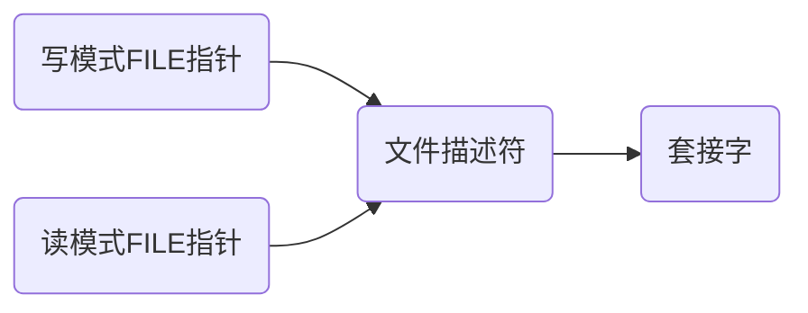
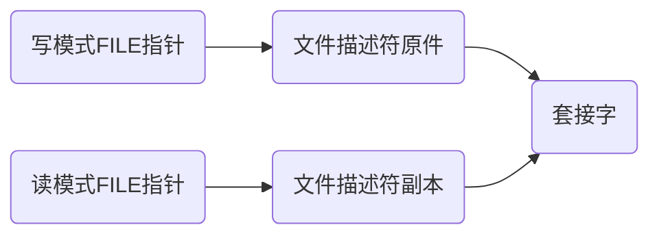

[TOC]

# 第13章 多种I/O函数

## 13.1 send & revc函数

### Linux中的send & revc
```C++
#include <sys/socket.h>
ssize_t send(int sockfd, const void * buf, size_t nbytes, int flags);//成功时返回发送的字节数，失败时返回-1。

ssize_t recv(int sockfd, void * buf, size_t nbytes, int flags)//成功时返回接收的字节数(收到EOF时返回0)，失败时返回-1。
```
send函数和recv函数的最后一个参数是收发数据时的可选项。该可选项可利用位或运算(|运算符)同时传递多个信息。

| 可选项 | 含义 | send | recv |
| :----: | :----: | :----: | :----: |
| MSG_OOB  | 用于传输带外数据(Out-of-band data) | √ | √ |
| MSG_PEEK  | 允许我们查看已可读取的数据，而且系统不在recv或recvfrom返回后丢弃这些数据 |  | √ |
| MSG_DONTROUTE  | 告知内核目的主机在某个直接连接的本地网络上，因而无需执行路由表查找 | √ |  |
| MSG_DONTWAIT  | 在无需打开相应套接字的非阻塞标志的前提下，把单个IO操作临时指定为非阻塞，接着执行IO操作，然后关闭非阻塞标志 | √ | √ |
| MSG_WAITALL  | 告知内核不要在尚未读入请求数目的字节之前让一个读操作返回 |  | √ |


### MSG_OOB和紧急模式工作原理
MSG_OOB可选项用于创建特殊发送方法和通道以发送紧急消息。

通过MSG OOB可选项传递数据时不会加快数据传输速度，而且通过信号处理函数读取数据时也只能读1个字节。剩余数据只能通过未设置MSG_OOB可选项的普通输入函数读取。这是因为TCP不存在真正意义上的“带外数据”。实际上，真正意义上的Out-of-band需要通过单独的通信路径高速传输数据，但TCP不另外提供，只利用TCP的紧急模式(Urgent mode)进行传输。

MSG_OOB的真正的意义在于督促数据接收对象尽快处理数据。这是紧急模式的全部内容，而且TCP“保持传输顺序”的传输特性依然成立。


## 13.2 readv & writev函数

### 使用readv & writev函数
通过writev函数可以**将分散保存在多个缓冲中的数据一并发送**，通过readv函数可以**由多个缓冲分别接收**。因此，适当使用这2个函数可以减少I/O函数的调用次数。

```C++
#include <sys/uio.h>
ssize_t writev(int filedes, const struct iovec * iov, int iovcnt);//成功时返回发送的字节数，失败时返回-1。

ssize_t readv(int filedes, const struct iovec * iov, int iovcnt)//成功时返回接收的字节数，失败时返回-1。

struct iovec
{
    void * iov_base;//缓冲地址
    size_t iov_len;//缓冲大小
}
```

writev函数代码示例
```C++
#include <stdio.h>
#include <sys/uio.h>

int main(int argc, int *argv[])
{
    struct iovec vec[2];
    char buf1[] = "ABCDEFG";
    char buf2[] = "1234567";
    int str_len;
    vec[0].iov_base = buf1;
    vec[0].iov_len = 3;
    vec[1].iov_base = buf2;
    vec[1].iov_len = 4;

    str_len = writev(1,vec,2);
    puts("");
    printf("Write bytes: %d \n",str_len);
    return 0;
}
```

运行结果
>ABC1234
>Write bytes: 7 

readv代码示例
```C++
#include <stdio.h>
#include <sys/uio.h>

#define BUF_SIZE 100

int main(int argc, int *argv[])
{
    struct iovec vec[2];
    char buf1[BUF_SIZE] = {0,};
    char buf2[BUF_SIZE] = {0,};
    int str_len;
    vec[0].iov_base = buf1;
    vec[0].iov_len = 5;
    vec[1].iov_base = buf2;
    vec[1].iov_len = BUF_SIZE;

    str_len = readv(0,vec,2);
    printf("Read bytes: %d \n",str_len);
    printf("First Message: %s \n",buf1);
    printf("Second Message: %s \n",buf2);
    return 0;
}
```

运行结果
>taojikun@taojikun-virtual-machine:~/unp/TCPIP网络编程/13-IOfunc$ ./readv
>i like tcp/ip socket programming!
>Read bytes: 34 
>First Message: i lik 
>Second Message: e tcp/ip socket programming!


# 第15章 套接字和标准I/O

## 15.1标准I/O函数的优缺点

标准IO函数的**优点**：
* 标准I/O函数具有良好的移植性。
* 标准I/O函数可以利用缓冲提高性能。

标准IO函数的**缺点**：
* 不容易进行双向通信。
* 有时可能频繁调用`fflush()`函数(`fflush()`用于冲洗流中的信息，会强迫将缓冲区内的数据写回参数stream指定的文件中)。
* 需要以`FILE`结构体指针的形式返回文件描述符。


IO缓冲和套接字缓冲之间的关系：

使用标准I/O函数传输数据时，经过2个缓冲。例如，通过fputs函数传输字符串“Hello”时，首先将数据传递到标准I/O函数的缓冲。然后数据将移动到套接字输出缓冲，最后将字符串发送到对方主机。

设置缓冲的主要目的是为了提高性能，但套接字中的缓冲主要是为了实现TCP协议而设立的(保存可能会进行重传的数据)。与之相反，使用标准I/O函数缓冲的主要目的是为了提高性能。


## 15.2使用标准I/O函数

* 利用`fdopen()`函数将文件描述符转换为`FILE`结构体指针
```C++
#include <stdio.h>
FILE * fdopen(int fildes, const char * mode);//成功时返回转换的FILE结构体指针，失败时返回NULL。
//对于第二个参数，'r'表示读模式，'w'表示写模式。
```


* 利用`fileno()`函数将`FILE`结构体指针转换为文件描述符
```C++
#include <stdio.h>
FILE * fileno(FILE * stream);//成功时返回转换的文件描述符，失败时返回-1。
```

其他函数：
```C++
#include <stdio.h>

int fputs (const char * message, FILE * stream);//将message写入FILE指针的文件中。

char * fgets (char * str, int n, FILE * stream);//从FILE指针的文件中读取n字节存入str。

int fflush (FILE *__stream);//用于冲洗流中的信息，会强迫将缓冲区内的数据写回参数stream指定的文件中。

int feof (FILE *__stream);//检测流上的文件结束符，结束则返回非0的值。

int fclose (FILE *__stream);//关闭FILE指针文件，且无需再关闭文件描述符(文件描述符在fclose后变为无意义的整数)。
```


# 第16章 关于I/O流分离的其他内容

## 16.1分离I/O流

分离流的好处：
* 为了将`FILE`指针按读模式和写模式加以区分。
* 可以通过区分读写模式降低实现难度。
* 通过区分I/O缓冲提高缓冲性能。

将一个套接字转化为只读和只写的FILE指针文件，当调用fclose函数时会完全终止套接字，而不是半关闭。


## 16.2文件描述符的复制和关闭

### 终止“流”时无法半关闭的原因
FILE指针的关系：


读模式FILE指针和写模式FILE指针都是基于同一文件描述符创建的，因此针对任意一个FILE指针调用fclose函数时都会关闭文件描述符，也就终止套接字。

FILE指针半关闭模型：

创建FILE指针前先复制文件描述符，复制后利用各自的文件描述符生成读模式FILE指针和写模式FILE指针，这就为半关闭准备好了环境。
针对写模式FILE指针调用fclose函数时，只能销毁与该FILE指针相关的文件描述符，无法销毁套接字（销毁所有文件描述符后才能销毁套接字）。
注意：此时还不是半关闭状态，只是为半关闭做好了准备，因为剩余的那个文件描述符可以同时进行I/O。


### 复制文件描述符
```C++
#include <unistd.h>
int dup(int fildes);//复制fildes文件描述符，返回复制的文件描述符
int dup2(int fildes,int fildes2);//复制fildes文件描述符，并将副本指定为fildes2。
//成功时返回复制的文件描述符，失败时返回-1。
```

代码示例
```C++
#include <stdio.h>
#include <unistd.h>

int main(int argc, char * argv[])
{
    int cfd1,cfd2;
    char str1[] = "Hi~\n";
    char str2[] = "It's a nice day~\n";

    cfd1 = dup(1);//复制标准输出的文件描述符
    cfd2 = dup2(cfd1,7);//复制cdf1的文件描述符，并将副本文件描述符整数值指定为7

    printf("fd1=%d, fd2=%d \n",cfd1,cfd2);
    write(cfd1,str1,sizeof(str1));
    write(cfd2,str2,sizeof(str2));

    close(cfd1);
    close(cfd2);
    //两个副本都被关闭了，但是原始的文件描述符还存在，故依旧能写
    write(1,str1,sizeof(str1));
    close(1);
    //原始的文件描述符也被关闭了，故不能在写了
    write(1,str2,sizeof(str2));

    return 0;
}
```

运行结果
> fd1=3, fd2=7 
> Hi~
> It's a nice day~
> Hi~

