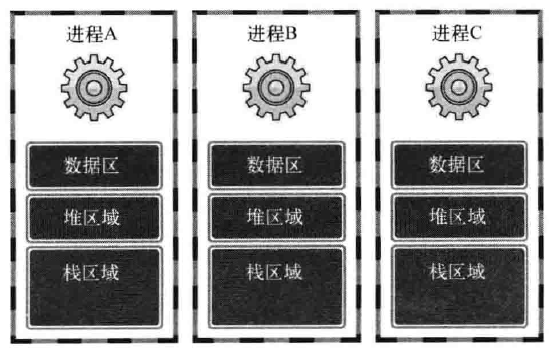
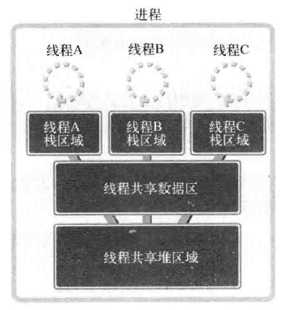
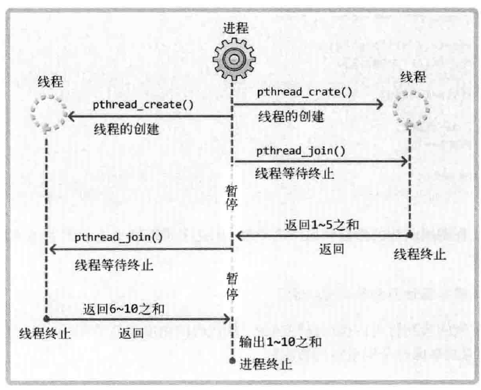

[TOC]

# 18.1 理解线程概念

## 引入线程的背景
多进程模型的缺点：
* 创建进程的过程会带来一定的开销。
* 为了完成进程间数据交换,需要特殊的进程间通信技术(IPC)。
* CPU每秒要进行少则数十次、多则上千次的上下文切换。

为了保持多进程的优点，同时在一定程度上克服其缺点，人们引入了线程(Thread)。这是为了将进程的各种劣势降至最低限度（不是直接消除）而设计的一种“轻量级进程”。

线程相比于进程具有如下优点：
* 线程的创建和上下文切换比进程的创建和上下文切换更快。
* 线程间交换数据时无需特殊技术。


## 线程和进程的差异
> 进程：在操作系统构成单独执行流的单位(操作系统最小的调度单位)。
> 线程：在进程构成单独执行流的单位(最小的资源分配单元)。

每个进程的内存空间都由保存全局变量的“数据区”、向malloc等函数的动态分配提供空间的堆(Heap)、函数运行时使用的栈(Stack)构成。每个进程都拥有这种独立空间，多个进程的内存结构下图所示。


如果以获得多个代码执行流为主要目的，则不应该完全分离内存结构，而只需分离栈区域。
线程为了保持多条代码执行流而隔开了栈区域，因此具有如下图所示的内存结构。


线程的优势：
* 上下文切换时不需要切换数据区和堆。
* 可以利用数据区和堆交换数据。


# 18.2 线程的创建及运行

## 线程的创建和执行流程
```C++
#include <pthread.h>
int pthread_create (
    pthread_t * restrict thread, 
    const pthread_attr_t * restrict attr, 
    void * (* start_routine) (void *), 
    void * restrict arg);
//thread————保存新创建线程ID的变量地址值。线程与进程相同，也需要用于区分不同线程的ID。
//attr————用于传递线程属性的参数,传递NULL时，创建默认属性的线程。
//start_routine————相当于线程main函数的、在单独执行流中执行的函数地址值（函数指针)。
//arg————通过第三个参数传递调用函数时包含传递参数信息的变量地址值。
```

代码示例
```C++
#include <stdio.h>
#include <unistd.h>
#include <pthread.h>
//线程相关代码在编译时需要添加-lpthread选项声明需要链接线程库，只有这样才能调用头文件pthread.h中声明的函数。


void* thread_main(void* argv);

int main(int argc, char *argv[])
{
    pthread_t thread_id;
    int thread_param = 5;

    if(pthread_create(&thread_id, NULL, thread_main, (void*)&thread_param)!=0)
    {
        puts("pthread_cread() error!");
        return -1;
    }
    printf("thread id: %ld \n",thread_id);
    sleep(10);
    puts("end of main!");
    return 0;
}


void* thread_main(void* argv)
{
    int i;
    int cnt = *((int*)argv);
    for(i=0;i<cnt;++i)
    {
        sleep(1);
        puts("running thread!");
    }
    return NULL;
}
```

运行结果
> thread id: 140123523823360 
> running thread!
> running thread!
> running thread!
> running thread!
> running thread!
> end of main!


利用`phread_join`函数控制线程的执行流，调用该函数的进程（或线程）将进入等待状态，直到第一个参数为ID的线程终止为止。
```C++
#include <pthread.h>
int pthread_join(pthread_t thread, void ** status);//成功时返回0，失败时返回其他值。
```

代码示例
```C++
#include <stdio.h>
#include <stdlib.h>
#include <string.h>
#include <unistd.h>
#include <pthread.h>

void* thread_main(void* argv);

int main(int argc, char *argv[])
{
    pthread_t thread_id;
    int thread_param = 5;
    void* thread_ret;

    if(pthread_create(&thread_id, NULL, thread_main, (void*)&thread_param)!=0)
    {
        puts("pthread_cread() error!");
        return -1;
    }
    
    if(pthread_join(thread_id,&thread_ret) != 0)
    {
        puts("pthread_join() error!");
        return -1;
    }

    printf("Thread Return Message: %s \n", (char*)thread_ret);
    free(thread_ret);
    puts("end of main!");
    return 0;
}


void* thread_main(void* argv)
{
    int i;
    int cnt = *((int*)argv);
    char * msg = (char*)malloc(sizeof(char)*50);
    strcpy(msg,"Hello, I'am thread~ \n");

    for(i=0;i<cnt;++i)
    {
        sleep(1);
        puts("running thread!");
    }
    return (void*)msg;
}
```

运行结果
> running thread!
> running thread!
> running thread!
> running thread!
> running thread!
> Thread Return Message: Hello, I'am thread~ 
> end of main!


## 可在临界区内调用的函数
多个线程同时执行**临界区**代码时可能会引起数据污染等问题。
> 线程安全函数
> 非线程安全函数


## 工作者(Worker)线程模型
工作者线程模型示例：
计算1到10的和，但并不是在main函数中进行累加运算，而是创建2个线程，其中一个线程计算1到5的和，另一个线程计算6到10的和，main函数只负责输出运算结果。这种方式的编程模型称为“工作者线程(Worker thread)模型”。


代码示例
```C++
#include <stdio.h>
#include <pthread.h>

void* thread_sumation(void* argv);
int sum=0;

int main(int argc, char *argv[])
{
    pthread_t thread_id1,thread_id2;
    int range1[] = {1,5};
    int range2[] = {6,10};

    pthread_create(&thread_id1,NULL,thread_sumation,(void*)&range1);
    pthread_create(&thread_id2,NULL,thread_sumation,(void*)&range2);

    pthread_join(thread_id1,NULL);
    pthread_join(thread_id2,NULL);

    printf("result: %d \n",sum);

    return 0;
}


void* thread_sumation(void* argv)
{
    int start = ((int*)argv)[0];
    int end = ((int*)argv)[1];
    while(start <= end)
    {
        sum+=start;
        start++;
    }

    return NULL;
}
```

运行结果
> result: 55 


示例代码(增加发生临界区相关错误可能性)
```C++
#include <stdio.h>
#include <stdlib.h>
#include <unistd.h>
#include <pthread.h>

#define NUM_THREAD 100

void* thread_inc(void *argv);
void* thread_dec(void *argv);

long long num=0;

int main(int argc, int *argv[])
{
    pthread_t thread_id[NUM_THREAD];

    for (int i = 0; i < NUM_THREAD; i++)
    {
        if(i%2)
            pthread_create(&(thread_id[i]),NULL,thread_inc,NULL);
        else
            pthread_create(&(thread_id[i]),NULL,thread_dec,NULL);
    }

    for (int i = 0; i < NUM_THREAD; i++)
    {
        pthread_join(thread_id[i],NULL);
    }

    printf("result: %ld \n",num);    

    return 0;
}


void* thread_inc(void* argv)
{
    for(int i=0;i<50000000;i++)
        num++;
    return NULL;
}

void* thread_dec(void* argv)
{
    for(int i=0;i<50000000;i++)
        num--;
    return NULL;
}
```

运行结果
> **result: 10420088**

上述示例中共创建了100个线程，其中一半执行thread_inc函数中的代码，另一半则执行thread_des函数中的代码。全局变量num经过增减过程后应存有0，但实际运行结果不为0。


# 18.3 线程存在的问题和临界区

## 多个线程访问同一变量的问题
上一节中运行结果不为0的原因分析：
* **理想情况**：线程1先将num=99读入CPU，通过CPU对num进行+1，然后将加1后的值100重新写入变量num中，然后线程2进行上述同样的过程，最终得到的num值为101。

* **可能的实际情况**：线程1先将num=99读入CPU，通过CPU对num进行+1，然而CPU尚未将新的值写入num变量，发生了时钟中断，执行流程跳到了线程2，这时线程2依旧是将num=99读入CPU，进行加1操作后将100写入num，执行流程又跳到线程1，线程1将先前计算得到的结果100写入num，最终得到的num值为100。

线程访问变量时应该阻止其他线程访问该变量，直到该线程完成运算，这就是**同步**。


## 临界区位置
临界区并非变量本身，而是访问共享资源的代码段，一定不能给多线程同时执行。


# 18.4 线程同步

## 同步的两面性
线程同步用于解决线程访问顺序引发的问题。有以下情况需要考虑同步;
* 同时访问同一内存空间时发生的情况（互斥）。
* 需要指定访问同一内存空间的线程执行顺序的情况（同步）。

互斥：保证一个线程在临界区执行时，其他线程应该被阻止进入临界区（同样适用于进程）。

同步：并发进程/线程在一些关键的点上可能需要互相等待与互通消息，这种相互制约的等待与互通信息成为进程/线程同步。


## 互斥量
互斥量表示不允许多个线程同时访问，主要用于解决线程同步访问的问题。
```C++
#include <pthread.h>

int pthread_mutex_init(pthread_mutex_t *mutex, const pthread_mutexattr_t *attr);//创建互斥量

int pthread_mutex_lock(pthread_mutex_t *mutex);//加锁

int pthread_mutex_unlock(pthread_mutex_t *mutex);//解锁

int pthread_mutex_destroy(pthread_mutex_t *mutex);//销毁互斥量

//成功时返回0，失败时返回其他值。
```

代码示例
```C++
#include <stdio.h>
#include <stdlib.h>
#include <unistd.h>
#include <pthread.h>

#define NUM_THREAD 100

void* thread_inc(void *argv);
void* thread_dec(void *argv);

long long num=0;
pthread_mutex_t mutex;

int main(int argc, int *argv[])
{
    pthread_t thread_id[NUM_THREAD];

    pthread_mutex_init(&mutex,NULL);

    for (int i = 0; i < NUM_THREAD; i++)
    {
        if(i%2)
            pthread_create(&(thread_id[i]),NULL,thread_inc,NULL);
        else
            pthread_create(&(thread_id[i]),NULL,thread_dec,NULL);
    }

    for (int i = 0; i < NUM_THREAD; i++)
    {
        pthread_join(thread_id[i],NULL);
    }

    printf("result: %ld \n",num);    

    pthread_mutex_destroy(&mutex);

    return 0;
}


void* thread_inc(void* argv)
{
    pthread_mutex_lock(&mutex);
    for(int i=0;i<50000000;i++)
        num++;
    pthread_mutex_unlock(&mutex);
    return NULL;
}

void* thread_dec(void* argv)
{
    for(int i=0;i<50000000;i++)
    {
        pthread_mutex_lock(&mutex);
        num--;
        pthread_mutex_unlock(&mutex);
    }
    return NULL;
}
```

运行结果
> result: 0 


## 信号量
通常信号量表示资源的数量，对应的变量是一个整型(sem)变量。

通过两个**原子操作**的系统调用函数来控制信号量的：
* P操作：将sem减1，相减后，如果sem<0，则进程/线程进入阻塞等待，否则继续，表明P操作可能会阻塞。
* V操作：将sem加1，相加后，如果sem<=0，唤醒一个等待中的进程/线程，表明V操作不会阻塞。

```C++
#include <semaphore.h>

int sem_init(sem_t *sem, int pshared, unsigned int value);//创建信号量

int sem_wait(sem_t *sem);//P操作

int sem_post(sem_t *sem);//V操作

int sem_destroy(sem_t *sem);//销毁信号量

//成功时返回0，失败时返回其他值。
```
调用sem_init函数时，操作系统将创建信号量对象，此对象中记录着“信号量值"整数。该值在调用sem_post函数时增1，调用sem_wait函数时减1。但信号量的值不能小于0，因此，在信号量为0的情况下调用sem_wait函数时，调用函数的线程将进入阻塞状态（因为函数未返回)。当然，此时如果有其他线程调用sem_post函数，信号量的值将变为1，而原本阻塞的线程可以将该信号量重新减为0并跳出阻塞状态。


示例代码
```C++
#include <stdio.h>
#include <pthread.h>
#include <semaphore.h>

void* read(void *arg);
void* accu(void* arg);

static sem_t sem_one;
static sem_t sem_two;
static int num;

int main(int argc, char *argv[])
{
    pthread_t id_t1,id_t2;
    sem_init(&sem_one,0,0);
    sem_init(&sem_two,0,1);

    pthread_create(&id_t1,NULL,read,NULL);
    pthread_create(&id_t2,NULL,accu,NULL);

    pthread_join(id_t1,NULL);
    pthread_join(id_t2,NULL);

    sem_destroy(&sem_one);
    sem_destroy(&sem_two);

    return 0;
}

void* read(void *arg)
{
    for(int i=0;i<5;++i)
    {
        fputs("Input num: ",stdout);

        sem_wait(&sem_two);
        scanf("%d",&num);
        sem_post(&sem_one);
    }
    return NULL;
}

void* accu(void* arg)
{
    int sum=0;
    for (int i = 0; i < 5; i++)
    {
        sem_wait(&sem_one);
        sum+=num;
        sem_post(&sem_two);
    }
    printf("Result: %d \n",sum);
    return NULL;
}
```

运行结果
> Input num: 5
> Input num: 6
> Input num: 7
> Input num: 8
> Input num: 9
> Result: 35 


# 18.5 线程的销毁和多线程并发服务器端的实现

## 销毁线程的3种方法
Linux线程并不是在首次调用的线程main函数返回时自动销毁，所以用如下2种方法之一加以明确，否则由线程创建的内存空间将一直存在。
* 调用pthread_join函数。
* 调用pthread_detach函数。

调用过pthread _join函数时，不仅会等待线程终止，还会引导线程销毁。但该函数的问题是，线程终止前，调用该函数的线程将进入阻塞状态。因此，通常通过pthread_detach函数调用引导线程销毁。
```C++
#include<pthread.h>
int pthread_detach(pthread_t thread);//成功时返回0，失败时返回其他值。
```
调用pthread_detach函数不会引起线程终止或进入阻塞状态，可以通过该函数引导销毁线程创建的内存空间。调用该函数后不能再针对相应线程调用pthread_join函数，这需要格外注意。


