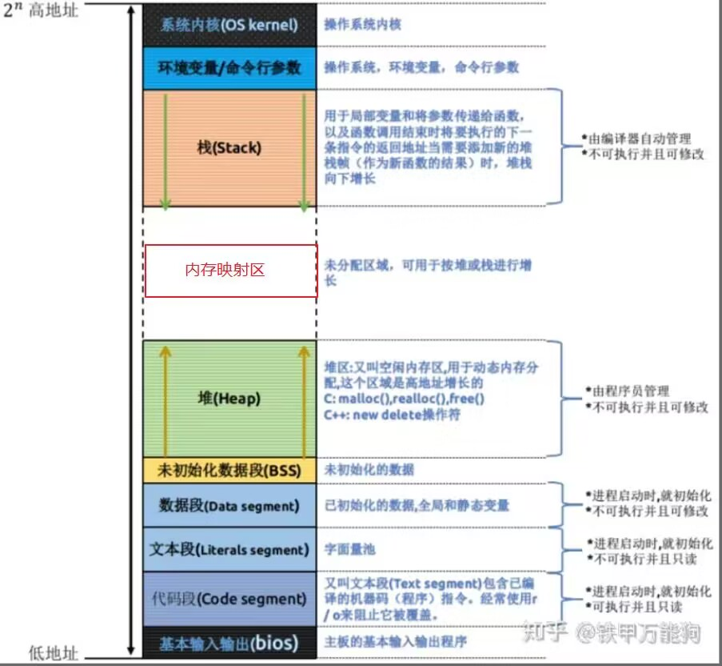

[toc]

# 1、类的对象存储空间？

* 非静态成员的数据类型的大小之和
* 编译器加入的额外的成员变量（例如指向虚函数表的虚指针）
* 内存对齐时所加上的padding

注意：空类的大小为1字节，基类为空时其大小为0。


# 2、简要说明C++的内存分区

C++中的内存分区，分别是堆、栈、自由存储区、全局/静态存储区、常量存储区和代码区。


32位操作系统的内存大小为4G，其中高地址的1G被分配给了操作系统内核。

* 栈：在执行函数时，函数内局部变量的存储单元都可以在栈上创建，函数执行结束时这些存储单元自动被释放。栈内存分配运算内置于处理器的指令集中，效率很高，但是分配的内存容量有限，从高地址向低地址扩容。
* 保留区：堆和栈之间未使用的区域，可用于对堆和栈进行扩容。
* 内存映射区：映射装载的动态链接库、共享内存等。
* 堆：动态分配的内存块，从低地址向高地址扩容。
* 未初始化数据段(.bss)：保存未初始化的数据，和.data段共同构成了全局/静态存储区。
* 初始化数据段(.data)：保存已经初始化的数据，和.bss段共同构成了全局/静态存储区。
* 常量存储段：存储常量，只读。
* 代码段：存储函数体的二进制代码。


# 3、什么是内存池，如何实现？

由于所申请内存块的大小不定，当频繁使用时会造成大量的内存碎片并进而降低性能。

内存池则是在真正使用内存之前，先申请分配一定数量的、大小相等(一般情况下)的内存块留作备用。当有新的内存需求时，就从内存池中分出一部分内存块， 若内存块不够再继续申请新的内存。这样做的一个显著优点是尽量避免了内存碎片，使得内存分配效率得到提升。

SGI空间配置器分两级，第一级配置器直接采用malloc和free管理内存；第二级采用内存池管理内存。申请空间时，如果区块够大，超过128字节，移交第一级配置器处理。当区块小于128字节时，以内存池管理。

内存池管理流程：
客户端请求分配大小为n bytes的内存（n <= 128，n已经圆整为8的倍数）
1. 检查n对应的free_list是否为空，不为空，直接分配一个内存块给客户，如果为空，到第2步；
2. 向内存池申请20个n bytes的内存，如果申请成功，一个返回给客户，另外19个挂到对应free_list节点下；如果有不到20个n bytes的空间，返回一个给客户，另外的全部交给对应free_list节点；如果连一个n bytes的空间都没法分配，进入第3步；
3. 向堆申请40个n bytes的空间，如果申请成功，20个n bytes交给内存池，1个返回给客户，19个留给free_list下的节点；如果堆内存不够，进入第四步；
4. 从比当前n还大的free_list节点中查找是否有内存可用，如果有，分n bytes给客户，另外部分交给内存池；如果n之后的所有free_list上都没有内存可用，进入第5步；
5. 调用第一级配置器的out_of_memory处理机制，尝试释放其它内存。如果可以，返回给客户。


# 4、可以说一下你了解的C++得内存管理吗？

goto 2


# 5、C++中类的数据成员和成员函数内存分布情况

* 一个类对象的地址就是类所包含的内存空间的首地址，这个首地址对应着类的某一个成员的地址。
* 类的成员函数不占用类对象的内存，因为成员函数是放置在代码段的。
* 静态成员函数没有this指针，故不能访问非静态成员以及非静态成员函数。
* 静态成员函数也放在代码段。


# 6、关于this指针你知道什么？

* this指针是隐含在每一个非静态成员函数中的特殊指针，它指向调用该成员函数的那个对象。
* 对每一个类对象调用成员函数时，程序先将对象的地址赋给this指针，然后调用成员函数，每次成员函数存取数据成员时，都隐式使用this指针。
* 当一个成员函数被调用时，都自动地向它传递一个隐含的参数，即指向这个成员函数所在对象的对象的this指针。
* this在成员函数的开始前构造，在成员函数的结束后清除。
* this指针被隐含地声明为：`A * const this`，是一个常量指针，即不能给this指针赋值；在const成员函数中，this指针的声明为`const A * const this`，即一个指向常量的常量指针，因此this指向的对象是不可以被修改的。
* this不是一个常规的变量，而**是一个右值**，故不可以取this指针的地址（不可以&this）。
* this指针只在非静态成员函数中才有定义，且存储的位置会因编译器的不同而不同。
* this指针并不是对象一部分，不影响sizeof结果，它的作用域一般在类成员函数内部。

this指针的用处：
在调用类对象的成员函数时，隐式地将指向类对象的this指针作为第一个形参传递给成员函数。

this指针的使用：
* 在类的非静态成员函数中返回类对象本身的时候，直接使用`return *this;`。
* 当形参名称与成员变量名称相同时用于区分，如`this->n = n`。


# 7、几个this指针的易混问题

Q：this指针是什么时候创建的？
A：this指针在调用类对象成员函数之前被创建，调用结束后清除。

Q：this指针存放在何处？堆、栈、全局变量，还是其他？
A：this指针的存储随着编译器的不同而不同。可能是栈，也可能时寄存器，甚至可能是全局区。从汇编角度看，this指针不是放在寄存器就是放在内存中。

Q：this指针是如何作为参数传递给成员函数的？
A：this指针作为成员函数参数的首参数。

Q：this指针是如何访问类中的变量的？
A：this指针在类中存储对象地址，通过对象去调用成员变量。

Q：我们只有获得一个对象后，才能通过对象使用this指针。如果我们知道一个对象this指针的位置，可以直接使用吗？
A：this指针只有在成员函数中才有定义。因此，你获得一个对象后，也不能通过对象使用this指针。即便在成员函数内部，也不能获取this指针的地址，因为this指针是一个右值。所以，我们无法知道一个对象的this指针的位置。

Q：每个类编译后，是否创建一个类中函数表保存函数指针，以便用来调用函数？
A：普通的类函数（不论是成员函数，还是静态函数）不会创建一个函数表来保存函数指针。只有虚函数才会被放到函数表中。但是，即使是虚函数，如果编译期就能明确知道调用的是哪个函数，编译器就不会通过函数表中的指针来间接调用，而是会直接调用该函数。


# 8、内存泄漏的后果？如何监测？解决方法？

内存泄漏：内存泄漏一般指堆内存的泄露，堆内存使用完后必须显示地使用free或delete释放该内存块，否则这块内存不能再次被使用，即为内存泄漏。

后果：泄露的内存无法被再次使用，导致性能下降到内存逐渐使用完。

检测工具：Linux下可使用Valgrid工具，Windows下可以使用CRT库

解决方法：智能指针

检查、定位内存泄漏

检查方法：在main函数最后面一行，加上一句`_CrtDumpMemoryLeaks()`。调试程序，自然关闭程序让其退出，查看输出：输出这样的格式`{453}normal block at 0x02432CA8,868 bytes long`，被{}包围的453就是我们需要的内存泄漏定位值，868 bytes long就是说这个地方有868比特内存没有释放。
定位代码位置：在main函数第一行加上`_CrtSetBreakAlloc(453)`;意思就是在申请453这块内存的位置中断。然后调试程序，程序中断了，查看调用堆栈。加上头文件#include <crtdbg.h>


# 9、在成员函数中调用delete this会出现什么问题？对象还可以使用吗？

delete this是合法的，因为在类对象的内存空间中，只有数据成员和虚函数表指针，并不包含代码内容，类的成员函数单独放在代码段中。当调用delete this时，类对象的内存空间被释放。在delete this之后进行的其他任何函数调用，只要不涉及到this指针的内容，都能够正常运行。

但是要注意：
* this所指向的对象必须是动态分配的。
* delete this之后进行的其他任何函数调用，不能涉及到this指针的内容（即不能去检查它、将它和其他指针比较、和NULL比较、打印它、转换它，以及其它的任何事情）。
* 必须保证调用delete this的成员函数是最后一个调用this的成员函数。
* delete this后，不能访问该对象任何的成员变量及虚函数（delete this回收的是数据，这包括对象的数据成员以及vtable，不包括函数代码）。
* delete this后，不能再访问this指针。


# 10、delete this之后的操作如果再涉及到this指针，为什么会发生不可预期的错误？

delete this之后释放了类对象的内存空间，但是这段内存并不会立马被操作系统回收，因此这段内存还是能够访问的，只不过其值并不确定，访问成员时可能获取的是很长一段的随机数，访问虚函数表时可能造成系统崩溃。


# 11、如果在类的析构函数中调用delete this，会发生什么？

delete this会先调用类对象的析构函数，然后释放空间，如果在析构函数中delete this会导致无限递归调用析构函数，最终造成堆栈溢出。


# 12、你知道空类的大小是多少吗？

* 通常空类的大小为1字节。
* C++标准不允许一个对象的大小为0，不同的对象不能具有相同的地址。
* 当空类为基类的时候，在派生类对象中的基类部分的大小就为0。
* 带有虚函数的C++类的大小不为1，因为其中至少有一个指向虚函数表的指针（4/8字节），抽象基类也是一样。


# 13、下面几个类的大小各是多少？

```C++
class A {}; //1字节，空类

class A { virtual Fun(){} }; //4字节，带有指向虚函数表的指针

class A { static int a; }; //1字节，静态成员存放在静态存储区，不占用类的大小

class A { int a; }; //4字节

class A { static int a; int b; }; //4字节
```


# 14、this指针调用成员变量时，堆栈会发生什么变化？

在调用类对象的非静态成员函数时，会将this指针作为一个隐式参数传递给成员函数。

G++中将this指针作为第一个参数，因此在调用成员函数时，先压入函数的返回地址，然后从右至左将参数压入栈中，即this指针最后一个被压入栈中，然后再将调用函数中的变量压入栈中。

当然了，this是作为第一个参数还是最后一个参数，取决于编译器。


# 15、类对象的大小受哪些因素影响？

* 类对象中的非静态成员的大小（静态成员位于静态区，成员函数位于代码段，均不占据类空间）。
* 内存对齐分配的空间的大小。
* 如果存在虚函数，还需要插入指向虚函数表的虚指针（vptr）。
* 如果派生于某个基类，那么派生类继承基类的部分也会存在于派生类空间中（派生类的大小按照将基类的成员迁移下来，然后重新计算对齐）。