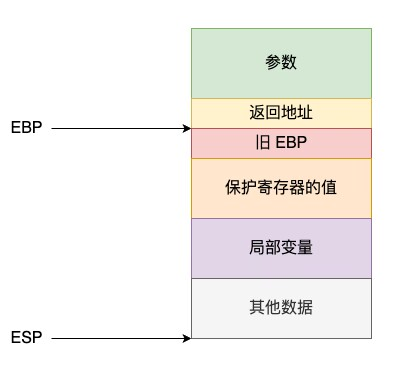

[TOC]


# √ 1、在main执行之前和之后执行的代码可能是什么？

main函数执行之前，初始化相关系统资源：
* **设置栈指针**；
* **初始化**全局变量、静态变量、常量，即.data段的内容；
* 将未初始化的全局变量**赋初值**：数值型short，int，long等为0，bool为FALSE，指针为NULL等等，即.bss段的内容（这里对于未初始化的全局静态变量和未初始化的局部静态变量，VS2013的优化是，如果代码正文使用了该变量，就进行初始化，否则不初始化）；
* **全局对象初始化**，在main之前调用构造函数，这是可能会执行前的一些代码；
* 将main函数的**参数argc，argv等传递**给main函数，然后才真正运行main函数
* 使用`__attribute__((constructor))`设置构造函数属性

main函数执行之后：
* **全局对象的析构**函数会在main函数之后执行；
* 使用atexit注册至多32个**终止处理函数**，它会在main之后执行；
* 使用`__attribute__((destructor))`设置析构函数属性

注意：`__attribute__((constructor))`和`__attribute__((destructor))` ：在程序中有时希望在main()函数之前运行一段函数，比如初始化函数，注册函数等，会使用到gcc的函数属性attribute((constructor))，当函数被设置constructor属性，会在main()函数之前运行，完成预期的行为。


# √ 2、结构体内存对齐问题？

为了保证每个对象拥有彼此独立的内存地址，C++空类的内存大小为1字节。而**非空类的大小与类中非静态成员变量和虚函数表的多少有关**。其中，类中非静态成员变量的大小则与编译器的位数以及内存对齐的设置有关。

类中的成员变量在内存中并不一定是连续的。它是按照编译器的设置，按照内存块来存储的，这个内存块大小的取值，就是内存对齐。

结构体内存对齐规则：
1. 第一个成员在结构体变量偏移量为0的地址处。
2. 其他成员变量要对齐到某个数字（对齐数）的整数倍的地址处。
    **对齐数 = 编译器默认的对齐数与该成员大小的较小值**。
3. 结构体总大小为最大对齐数的整数倍（每个成员变量都有一个对齐数）。
4. 如果嵌套了结构体，嵌套的结构体对齐到自己最大对齐数的整数倍处，**结构体的整体大小就是所有最大的对齐数的整数倍（包含嵌套结构体的对齐数）**。
5. 所谓继承关系实质上是派生类继承了基类中的元素（虚函数表和成员变量），而非继承已经内存对齐固化的基类结构，基类中的元素被继承到派生类中与派生类中新添加的元素需要**重新按照元素的排列组合内存对齐**。

* 结构体内成员按照声明顺序存储，第一个成员地址和整个结构体地址相同。
* 未特殊说明时，按结构体中size最大的成员对齐（若有double成员，按8字节对齐）。
* c++11以后引入两个关键字`alignas`与`alignof`。其中`alignof`可以计算出类型的对齐方式，`alignas`可以指定结构体的对齐方式。若alignas小于自然对齐的最小单位，则被忽略。
* 如果想使用单字节对齐的方式，使用alignas是无效的。应该使用#pragma pack(push,1)或者使用__attribute__((packed))。

[一文读懂C++内存对齐](https://juejin.cn/post/6916122498505539591)


# √ 3、指针和引用的区别

* 指针是一个变量，存储的是一个所指向对象的地址；引用是一个变量的别名。
* 指针可以有多级；引用只能有一级（不能有引用的引用）。
* 指针可以为空，故指针的声明和定义可以分开；引用不能为NULL，且必须在声明时就初始化。
* 指针在初始化后可以改变指向；引用在初始化后不能改变（不能将a的引用改为引用b）。
* sizeof得到是指针的大小（32位编译环境为4字节，64位编译环境为8字节）；sizeof引用得到的是所引用的对象的大小。
* 对指针进行传参的时候，将实参拷贝给了形参，实参和形参指向同一个地址，但是两者所在的地址不同，不是同一个变量，在函数中改变指针的指向不影响实参；对引用进行传参的时候，形参是实参的引用，两者是同一个对象，在函数中修改引用会影响实参。
* 引用本质上是一个指针，同样会占4/8字节内存。


# 4、在传递函数参数时，什么时候该使用指针，什么时候该使用引用呢？

* 需要返回函数内局部变量的内存时使用指针；而返回局部变量的引用是无意义的。
* 对栈空间的大小比较敏感（递归、string）时使用引用，使用引用不需要创建局部变量，开销较小。
* 类对象作为参数传递时要使用引用（C++类对象的标准传递方式）。


# √ 5、堆和栈的区别

* 管理方式不同：栈由系统自动分配；堆由用户自己手动申请和释放。
* 分配方式不同：栈有静态和动态分配，静态分配由编译器完成，动态分配由alloc函数分配并由编译器进行释放；堆都是动态分配内存。
* 内存管理机制：只要栈的剩余空间大于所申请空间，系统为程序提供内存，否则报异常提示栈溢出；而堆分配大于128字节时使用一级配置器（malloc），小于128字节时使用二级配置器（链表+内存池）。
* 申请大小限制不同：栈由高地址向低地址扩展，栈底位置确定，可通过`ulimit -a`查看栈的大小（本机的栈大小为8M），使用`ulimit -s`修改；堆是由低地址向高地址扩展，是不连续的内存空间（所以可能有内存碎片等问题），大小可以灵活调整，一般是1~4G。
* 效率不同：栈由系统分配，操作系统在底层对栈提供支持，速度快，不会有内存碎片问题；堆由用户申请和释放，由标准库提供支持，机制复杂，速度慢，存在内存碎片问题。


# 6、堆快一点还是栈快一点？

栈快一点。

操作系统会在底层对栈提供支持，会分配专门的寄存器存放栈的地址，栈的入栈出栈操作也十分简单，并且有专门的指令执行，所以栈的效率比较高也比较快。

堆的操作是由C/C++函数库提供的，在分配堆内存的时候需要一定的算法寻找合适大小的内存。并且获取堆的内容需要两次访问，第一次访问指针，第二次根据指针保存的地址访问内存，因此堆比较慢。


# 7、区别以下指针类型？
```C++
int *p[10]  //数组，这个数组含有10个元素，元素类型为指向int的指针
int (*p)[10]  //指针，指向一个10个int类型元素的数组
int *p(int)  //函数声明，函数名是p，参数类型为int，返回值类型为int*
int (*p)(int)  //函数指针，指向一个函数，这个函数的参数是int，返回值是int
```


# √ 8、new / delete 与 malloc / free的异同

* 相同点：都可以用于内存的动态申请和释放。
* 不同点：
    - new和delete是C++运算符；malloc和free是C/C++语言标准库函数。
    - new自动计算所需要分配的内存；malloc需要手动计算。
    - new/delete不用库函数文件，malloc/delete需要包含库函数文件（C中是stdlib.h，C++中是malloc.h）。
    - new调用标准库函数`operator new`分配足够空间，然后调用相应的构造函数，delete调用相应的析构函数，然后调用标准库函数`operator delete`释放内存；malloc和free只负责申请和释放内存，不会取构造和析构对象。
    - new返回的是具体类型指针；malloc返回的是void类型指针（必须进行类型转换）。
    - new分配内存失败时，会抛出bad_alloc异常；malloc分配内存失败时会返回NULL。
    - new/delete可以被重载，malloc和free支持覆盖。
    - new是类型安全的；malloc不是类型安全的。
        ```C++
        int* p = new float[2]; //编译错误
        int* p = (int*)malloc(2*sizeof(float)); //编译通过
        ```


# 9、new和delete是如何实现的？

new的实现过程是：首先调用名为operator new的标准库函数，分配足够大的原始为类型化的内存，以保存指定类型的一个对象；接下来运行该类型的一个构造函数，用指定初始化构造对象；最后返回指向新分配并构造后的的对象的指针。
delete的实现过程：对指针指向的对象运行适当的析构函数；然后通过调用名为operator delete的标准库函数释放该对象所用内存。


# 10、malloc和new的区别？

goto 8


# 11、既然有了malloc/free，C++中为什么还需要new/delete呢？直接用malloc/free不好吗？

new/delete相较于malloc/free额外提供了构造/析构对象的功能。


# 12、被free回收的内存是立即返还给操作系统吗？

不会立即返还给操作系统。
对于二级配置器分配的小于128字节的内存，被free回收的内存会首先被二级配置器中的free_list链表保存起来，当用户下一次申请内存的时候，会尝试从这些内存中寻找合适的返回。这样就避免了频繁的系统调用，占用过多的系统资源。同时free_list也会尝试对小块内存进行合并，避免过多的内存碎片。

阿秀的答案：
被free回收的内存会首先被ptmalloc使用双链表保存起来，当用户下一次申请内存的时候，会尝试从这些内存中寻找合适的返回。这样就避免了频繁的系统调用，占用过多的系统资源。同时ptmalloc也会尝试对小块内存进行合并，避免过多的内存碎片。

小林的答案：
malloc 通过 brk() 方式申请的内存，free 释放内存的时候，并不会把内存归还给操作系统，而是缓存在 malloc 的内存池中，待下次使用；
malloc 通过 mmap() 方式申请的内存，free 释放内存的时候，会把内存归还给操作系统，内存得到真正的释放。


# √ 13、宏定义和函数有何区别？

* 宏定义会在预编译阶段进行宏展开，将代码中的宏替换为对应的文本，一次文本参与编译，运行时不会有函数调用，执行起来更快；而函数在运行时会跳转到具体被调用的函数中。
* 宏定义没有返回值；函数有返回值。
* 宏定义没有参数类型，不进行类型检查；函数有参数类型，会进行类型检查。
* 宏定义不是语句，无需在后面加分号。


# √ 14、宏定义和typedef区别？

* 宏定义主要用于定义常量以及书写复杂的内容；typedef主要用于定义类型别名。
* 宏定义会在预编译阶段进行宏展开，属于文本替换；typedef时编译的一部分。
* 宏定义不进行类型检查；typedef进行类型检查。
* 宏定义不是语句，无需在后面加分号；typedef是语句，需要在后面加分号。
* 对指针操作时有很大区别
    ```C++
    #define p_char char*
    typedef char* pchar;

    p_char x,y; //相当于 char* x,y; 故x为cahr*，y为char
    pchar a,b;  //相当于 char* a; char* b; a、b都为char*
    ```


# 15、变量声明和定义区别？

声明仅仅是把变量的声明的位置及类型提供给编译器，并不分配内存空间；定义要在定义的地方为其分配存储空间。

相同变量可以在多处声明（外部变量extern），但只能在一处定义。


# √ 16、strlen和sizeof区别？

* strlen获取一个char*类型字符串的长度（参数只能是字符指针且结尾为'\0'的字符串）；sizeof获取一个对象/类型所占字节的大小（参数可以为类型或对象）。
* strlen是字符处理的库函数，在运行过程中获得结果；sizeof是运算符，在编译过程中即获得结果。
* sizeof值在编译时确定，所以不能用来得到动态分配（运行时分配）存储空间的大小。


# √ 17、常量指针和指针常量区别？

* 常量指针是一个常量的指针，它不能改变指向，常量指针必须被初始化，例如：int * const p。
* 指针常量是一个指针，它指向的对象是常量（指向常量的指针），例如：int const *p或者const int *p。

注：const在 * 的左侧为指向只读常量的指针，const在 * 右侧即为常量指针。


# 18、a和&a有何区别？

&：引用、取地址符


# 19、C++和Python的区别

* Python是一种脚本语言，是解释执行的，而C++是编译语言，是需要编译后在特定平台运行的。python可以很方便的跨平台，但是效率没有C++高。
* Python使用缩进来区分不同的代码块，C++使用花括号来区分
* C++中需要事先定义变量的类型，而Python不需要，Python的基本数据类型只有数字，布尔值，字符串，列表，元组等等
* Python的库函数比C++的多，调用起来很方便


# √ 20、C++和C语言的区别

* C语言面向过程编程；C++面向对象编程。
* C语言是C++的子集，C++可以很好兼容C语言。但是C++又有很多新特性，如引用、智能指针、auto变量等。
* C语言有一些不安全的语言特性，如指针使用的潜在危险、强制转换的不确定性、内存泄露等。而C++对此增加了不少新特性来改善安全性，如const常量、引用、cast转换、智能指针、try—catch等等。
* C++可复用性高，C++引入了模板的概念，后面在此基础上，实现了方便开发的标准模板库STL。C++的STL库相对于C语言的函数库更灵活、更通用。
* C++可以重载；C语言不可以。
* C++语言中，允许变量定义语句在程序中的任何地方，只要在是使用它之前就可以；而C语言中，必须要在函数开头部分。


# 21、C++与java的区别？


# √ 22、C++中struct和class的区别？

* C++的struct的默认访问控制权限为public；class的访问控制权限为private。
* 在继承关系中，C++的struct默认是public继承；class默认是private继承。
* 在模板中，class可以用于定义模板参数（typename的作用），但是struct不可以。


C和C++的struct的区别：
* C++的struct是C的struct的扩充
* C的struct不可以有成员函数和静态成员；C++的struct可以有成员函数和静态成员。
* C的struct的访问控制权限为public，且不能修改；C++的struct默认访问控制权限为public，也可以显示设置为private和protected。
* C的struct不可以继承；C++的struct可以从其他结构体或类继承。
* C的struct不能直接初始化数据成员；C++的struct可以直接初始化数据成员。
* 一个结构标记声明后，在C中必须在结构标记前加上struct，才能做结构类型名（除：typedef struct class{};）；C++中结构体标记（结构体名）可以直接作为结构体类型名使用。


# √ 23、define宏定义和const的区别？

* define是在预编译时期进行文本替换；const是在编译、运行时修饰变量。
* 宏定义只做文本替换，不进行类型检查，容易产生错误；const修饰的常量有数据类型，编译器会对其进行安全检查。
* 宏定义会将所有使用到的地方都进行文本替换，会产生多个副本；const在程序运行中只存在一个备份。
* 宏定义的数据没有分配内存空间，只在预编译期间插入替换；const定义的变量要分配空间，且值不能改变。
* define可以通过#undef取消某个符号的定义，进行重定义；const不能重定义


# √ 24、C++中const和static的作用？

答案一：
static：
* 修饰普通变量：修改变量的存储区域和生命周期，使变量存储在静态区，在main函数运行前就分配了空间，如果有初始值就用初始值初始化它，如果没有初始值系统用默认值初始化它。
* 修饰普通函数：表明函数的作用范围，仅在定义该函数的文件内才能使用。
* 修饰类的成员变量：修饰成员变量使所有的对象只保存一个该变量，而且不需要生成对象就可以访问该成员。
* 修饰成员函数：修饰成员函数使得不需要生成对象就可以访问该函数，但是在static函数内不能访问非静态成员。

答案二：
static：
* 不考虑类的情况：
    - 所有不加static的全局变量和函数都具有全局可见性，可以在其他的文件中使用，加了static后就只能在该文件所编译的模块中使用。
    - 默认初始化为0，包括未初始化的局部静态变量和全局静态变量（都属于.bss段）。
    - 静态变量在函数内定义，始终存在，且只进行一次初始化，具有记忆性，其作用范围与局部变量相同，函数退出后仍然存在，但不能使用。
* 考虑类的情况：
    - static成员变量：只与类关联，不与类的对象关联（即一个程序中的所有该类对象都公用同一个static成员变量），定义时要分配空间，不能在类声明内初始化，必须在类定义体外部初始化，可被类内非static成员函数访问。
    - static成员函数：不具有this指针，无法访问类内非static成员变量和非static成员函数，**不能被声明为const、虚函数、volatile**，可被非static成员函数访问。

注意：**当调用一个非static成员函数时，系统会把该对象的起始地址赋给成员函数的this指针；而static函数不属于任一对象，因此static成员函数中没有this指针，也就不能对非static函数、成员进行调用**。


答案一：
const：
* 修饰变量，说明该变量不可以被改变；
* 修饰指针，分为指向常量的指针（pointer to const）和自身是常量的指针（常量指针，const pointer）；
* 修饰引用，指向常量的引用（reference to const），用于形参类型，即避免了拷贝，又避免了函数对值的修改；
* 修饰成员函数，说明该成员函数内不能修改成员变量。

答案二：
const：
* 不考虑类的情况
    - const常量在定义时必须初始化，之后无法更改。
    - const形参可以接收const和非const类型的实参，例如// i 可以是 int 型或者 const int 型void fun(const int& i){ //...}
* 考虑类的情况
    - const成员变量：不能在类定义外部初始化，只能通过构造函数初始化列表进行初始化，并且必须有构造函数；不同类对其const数据成员的值可以不同，所以不能在类中声明时初始化
    - const成员函数：const对象不可以调用非const成员函数；非const对象都可以调用；不可以改变非mutable（用该关键字声明的变量可以在const成员函数中被修改）数据的值。

注意：const修饰变量是也与static有一样的隐藏作用。只能在该文件中使用，其他文件不可以引用声明使用。 因此在头文件中声明const变量是没问题的，因为即使被多个文件包含，链接性都是内部的，不会出现符号冲突。


# √ 25、C++的顶层const和底层const

顶层const：const修饰的变量本身是常量，例如指针的const在 * 右边。
底层const：指针指向的变量或引用所引用的变量是常量，例如指针的const在 * 左边。

* 执行对象拷贝时，常量的底层const不能赋给非常量的底层const
    ```C++
    const int* p1 = &i;
    int* p2 = p1; //错误，const int* 不能用于初始化int*，否则可以通过p2修改p1指向的常量
    ```
* 使用命名的强制类型转换函数const_cast时，只能改变运算对象的底层const


# √ 26、数组名和指针（这里为指向数组首元素的指针）区别？

* 在使用到数组名的时候，编译器会自动将数组名替换为一个指向数组首地址的指针。
    ```C++
    int nums[10];
    int *p = nums; //等价于int *p = &nums[0];
    ```
* 两者都能通过增加偏移量来访问数组中的元素。
* 不能对数组名进行自增/自减操作。
* 当函数名作为参数传递给函数后，就会退化为一般的指针，多了自增、自减操作，但是也就无法通过sizeof获取数组的大小。


# √ 27、final和override关键字

override：在父类中使用了虚函数时，需要在子类中重写虚函数，override能够保证子类的虚函数是重写的基类的虚函数（不会出现因为打错函数名字而将其当作一个新函数）。

final：接在类名后面，标志这个类不会被继承；接在类的成员函数后面，表示这个成员函数不会被派生类重写。


# √ 28、拷贝初始化和直接初始化

当用于类类型对象时，初始化的拷贝形式和直接形式有所不同：**直接初始化直接调用与实参匹配的构造函数，拷贝初始化总是调用拷贝构造函数**。拷贝初始化首先使用指定构造函数创建一个临时对象，然后用拷贝构造函数将那个临时对象拷贝到正在创建的对象。


# √ 29、初始化和赋值的区别？

初始化调用默认构造函数、拷贝构造函数、参数匹配的构造函数；而赋值调用赋值运算符=


# √ 30、extern "C" 的用法

为了能够在C++语言中正确的调用C语言代码，可以在程序中加上extern "C"，用来告诉编译器这部分的代码C语言，需要使用C语言的规则编译和链接。
```C++
#ifdef __cplusplus
extern "C" {
#endif 
    {
        ... 
    }
#ifdef __cplusplus
}
#endif
```


# √ 31、野指针和悬空指针

野指针：没有被初始化过的指针。
悬空指针：最初指向的内存已经被释放的指针。

产生原因及解决办法：
野指针：指针变量未及时初始化 ==> 定义指针时及时初始化或置为nullptr。
悬空指针：指针所指向的对象被释放后未及时对指针置空 ==> 释放后及时将指针置空，或者使用智能指针。


# √ 32、C和C++的类型安全

C++提供了一些新的机制保障类型安全：
* 操作符new返回的指针类型严格与对象匹配，而不是void*。
* C中很多以void*为参数的函数可以改写为C++模板函数，而模板是支持类型检查的。
* 引入const关键字代替#define constants，它是有类型、有作用域的，而#define constants只是简单的文本替换
* 一些#define宏可被改写为inline函数，结合函数的重载，可在类型安全的前提下支持多种类型，当然改写为模板也能保证类型安全。
* C++提供了dynamic_cast关键字，使得转换过程更加安全，因为dynamic_cast比static_cast涉及更多具体的类型检查。


# √ 33、C++中的重载、重写（覆盖）和隐藏的区别

重载（overload）：重载是指在同一范围定义中的同名成员函数才存在重载关系。主要特点是**函数名相同，参数类型和数目有所不同**，不能出**仅依靠返回值不同来区分的函数**。

重写（override）：重写指的是在派生类中覆盖基类中的同名函数，重写就是重写函数体，要求基类函数必须是虚函数且与基类的虚函数有相同的参数个数、相同的参数类型、相同的返回值类型。

隐藏（hide）：隐藏指的是某些情况下，派生类中的函数屏蔽了基类中的同名函数（1、两个函数的函数签名相同，但是基类函数不是虚函数；2、两个函数参数不同，无论基类函数是否为虚函数都会被隐藏）。

Effective C++条款33：避免遮掩继承而来的名称。


# √ 34、C++有哪几种的构造函数？

默认构造函数、初始化构造函数、拷贝构造函数、移动构造函数、委托构造函数（委托别的构造函数进行构造）、转换构造函数（将其他类型的变量，隐式转换为本类对象）。

注意：C++空类中的默认函数：默认构造函数、默认拷贝构造函数、默认赋值运算符、默认析构函数、取地址运算符、const取址运算符。


# √ 35、浅拷贝和深拷贝的区别？

浅拷贝：浅拷贝只是拷贝指针，拷贝前和拷贝后的指针指向同一块地址，即两个对象指向同一个数据副本，有一个被析构后就会影响另一个的使用。
深拷贝：深拷贝会开辟一块新的内存，构造一个值和原对象相同的对象，即两个对象指向不同的数据副本，两者之间的析构不会相互影响。


# √ 36、内联函数和宏定义的区别？

* 宏定义在预编译时期进行文本替换；内联函数会将其函数体直接嵌入到代码中。就这一点来说两者类似。
* 宏定义无类型检查、无返回值；内联函数会在编译时进行类型检查，且具有返回值，且可以被重载。


内联函数特征：
* 把内联函数函数体的内容写在调用内联函数处；
* 不用执行进入函数的步骤，直接执行函数体；
* 相当于宏，却比宏多了类型检查，真正具有函数特性；
* 编译器一般不内联包含循环、递归、switch等复杂操作的内联函数；
* 在类声明中定义的函数，除了虚函数的其他函数都会自动隐式地当成内联函数。


# √ 37、public，protected和private访问控制权限和继承权限public/protected/private的区别？

访问控制权限：
* public的变量和函数在类的内部外部都可以访问。
* protected的变量和函数只能在类的内部和其派生类中访问。
* private修饰的元素只能在类内访问。

继承权限：
* public继承：公有继承的特点是基类的公有成员和保护成员作为派生类的成员时，都保持原有的状态，而基类的私有成员仍然是私有的，不能被这个派生类的子类所访问。
* protected继承：保护继承的特点是基类的所有公有成员和保护成员都成为派生类的保护成员，并且只能被它的派生类成员函数或友元函数访问，基类的私有成员仍然是私有的。
* private继承：私有继承的特点是基类的所有公有成员和保护成员都成为派生类的私有成员，并不被它的派生类的子类所访问，基类的成员只能由自己派生类访问，无法再往下继承。

基类的访问控制权限在派生类中的可见情况：
* public继承：
    父类的public->子类public；
    父类的protected->子类protected；
    父类的private在子类中不可见
* protected：
    父类的public->子类protected；
    父类的protected->子类protected；
    父类的private在子类中不可见
* private
    父类的public->子类private；
    父类的protected->子类private；
    父类的private在子类中不可见


# √ 38、如何用代码判断大小端存储？

大端存储：数据的低字节存放在高地址。
小端存储：数据的低字节存放在低地址。

对于数字12345678：
            高地址     低地址
               ↓         ↓
大端存储         12345678
小端存储         87654321

判断大端字节序、小段字节序的方法：
方法一：使用强制转换
```C++
int a = 0x123456;
//由于int和char的长度不同，借助int型转换成char型，只会留下低地址的部分
char c = (char)a;
if(c == 0x12){
    cout << "big endian" << endl;
}
else if(c == 0x56){
    cout << "little endian" << endl;
}
```

方法二：使用union联合体
```C++
//union联合体的重叠式存储，endian联合体占用内存的空间为每个成员字节长度的最大值
union endian
{
    int i;
    char c;
}

endian val;
val.i = 0x123456;
if(val.c == 0x12){
    cout << "big endian" << endl;
}
else if(val.c == 0x56){
    cout << "little endian" << endl;    
}
```


# √ 39、volatile、mutable、explicit关键字的用法

volatile：
* volatile关键字是一种类型修饰符，用它声明的类型变量表示可以被某些编译器未知的因素（操作系统、硬件、其它线程等）更改。所以使用volatile**告诉编译器不应对这样的对象进行优化**，从而可以提供对特殊地址的稳定访问（例如在多线程场景下，避免一个线程读寄存器中的值，而另一个线程读内存中的值导致的错误）。
* volatile关键字声明的变量，每次访问时都必须从内存中取出值（没有被volatile修饰的变量，可能由于编译器的优化，从CPU寄存器中取值）。
* volatile指针和被const修饰的指针类似，也有指向volatile变量的指针和本身时volatile的指针。

mutable：容许在即便包含它的对象被声明为const时仍可修改声明为mutable的类成员。

explicit：用来修饰类的构造函数，被修饰的构造函数的类，不能发生相应的隐式类型转换，只能以显示的方式进行类型转换。


# √ 40、什么时候会调用拷贝构造函数？

* 用一个类的实例化对象去初始化另一个对象；
* 函数的参数是类对象时（非引用，即值传递时）；
* 函数的返回值是函数体内局部对象的类的对象时（如果发生NRV优化则有可能不存在调用拷贝构造函数，但具体要看编译器而定）。

注意：NRV优化（named return value优化），指的是当返回值为函数局部变量时，编译器会进行优化，直接将返回值的变量作为局部变量。


# √ 41、C++中有几种类型的new？

* plain new：普通的new，在空间分配失败时抛出bad_alloc异常，而不是返回一个空指针。
* nothrow new：在空间分配失败时不抛出异常，而是返回null。
* placement new：允许在一块已经分配成功的内存上重新构造对象或对象数组。placement new不用担心内存分配失败，因为它根本不分配内存，它做的唯一一件事情就是调用对象的构造函数。

注意，palcement new构造的对象要显示调用析构函数来销毁，不能直接使用delete，因为placement new构造起来的对象或数组大小并不一定等于原来分配的内存大小，使用delete会造成内存泄漏或者之后释放内存时出现运行时错误。


# √ 42、C++异常处理方法

* try、throw、catch关键字：先执行try包裹的语句块，如果发生异常则使用throw进行抛出，再由catch捕获异常，并执行catch包裹的异常处理语句块。
* 函数的异常声明列表：开发者在定义函数的时候知道函数可能发生的异常，可以在函数声明和定义时，指出所能抛出异常的列表。
```C++
int func() throe(double,int,A,B,C); //函数func可能会抛出int、double、A、B、C类型的异常
//如果throw中为空，则不会抛出任何异常，没有throw则可能抛出任何异常
```
* C++标准异常类exception


# √ 43、static的用法和作用

* 修饰普通变量：修改变量的存储区域和生命周期，使变量存储在静态区，在main函数运行前就分配了空间，如果有初始值就用初始值初始化它，如果没有初始值系统用默认值初始化它。
* 修饰普通函数：表明函数的作用范围，仅在定义该函数的文件内才能使用。
* 修饰类的成员变量：修饰成员变量使所有的对象只保存一个该变量，而且不需要生成对象就可以访问该成员。
* 修饰成员函数：修饰成员函数使得不需要生成对象就可以访问该函数，但是在static函数内不能访问非静态成员。


# 44、指针和const的用法


# √ 45、形参和实参的区别

* 形参只有在函数被调用时才会分配内存，调用结束后即刻释放内存，即形参之在函数内部有效；实参可以是常量、变量、表达式、函数等，在进行函数调用前实参必须要有确定的值。
* 形参和实参在数量、类型、顺序上要保持严格一致，否则会发生类型不匹配错误。
* 如果是值传递时，形参会调用拷贝构造函数进行初始化，将实参的数据拷贝一份；如果是引用传递，形参是实参的引用，两者共享同一份数据；如果是指针传递，形参会拷贝实参的值（拷贝实参指针所指向的地址），形参和实参都指向同一个地址，但是实参和形参指针本身的地址不一样。


# √ 46、值传递、引用传递、指针传递的区别和效率

* 值传递：形参调用拷贝构造函数拷贝实参，如果值传递的对象是类对象或大的结构体，则耗费一定时间空间。
* 指针传递：形参只拷贝实参指针所指向的地址值。
* 引用传递：形参即为实参的别名。

效率：指针传递和引用传递比值传递的效率高。

对于内置类型，要使用值传递；对于类对象或大的结构体，建议使用引用传递。


# √ 47、静态变量什么时候初始化？

C语言中，静态变量在编译时就会为其分配内存，然后进行初始化，因此C中无法使用变量初始化静态变量。
C++中，由于类对象初始化时需要调用构造函数（其中可能需要进行特定的操作），并非简单地分配内存，所以C++中静态对象是在程序加载后，首次使用到的地方才会被初始化（例如：`static int a = x+y;`在编译中为a分配内存，然后将a的值记录为x+y，然后在程序加载时，在对a初始化为x+y），因此C++中可以使用变量对静态变量进行初始化。


# √ 48、const关键字的作用有哪些？

* 修饰变量，说明该变量不可以被改变；
* 修饰指针，分为指向常量的指针（pointer to const）和自身是常量的指针（常量指针，const pointer）；
* 修饰引用，指向常量的引用（reference to const），用于形参类型，即避免了拷贝，又避免了函数对值的修改；
* 修饰成员函数，说明该成员函数内不能修改成员变量。


对于简单类型的static变量：（全局、局部、类内）
1. 定义时赋字面值：则该变量在编译时初始化，放入.data段。
2. 定义时不赋字面值（如用表达式赋值或者未赋值）：则该变量在加载时初始化（main之前），放入.bss段。

对于复杂类型的static变量：
1. 运行时初始化，放入.bss段。


# √ 49、什么是类的继承？

继承就是一个类继承了另一个类的属性和方法，这个新的类包含了上一个类的属性和方法，被称为子类或者派生类，被继承的类称为父类或者基类。

子类拥有父类的所有属性和方法，子类可以拥有父类没有的属性和方法，子类对象可以当做父类对象使用。

继承访问控制：public、private、protected


# √ 50、从汇编层去解释引用？

从汇编层面看，引用是通过指针实现的。对于`int &a = x;`，会将x的地址放入到一个临时寄存器当中，然后将临时寄存器中x的地址存入变量a中。


# √ 51、深拷贝和浅拷贝

浅拷贝：浅拷贝只是拷贝指针，拷贝前和拷贝后的指针指向同一块地址，即两个对象指向同一个数据副本，有一个被析构后就会影响另一个的使用。
深拷贝：深拷贝会开辟一块新的内存，构造一个值和原对象相同的对象，即两个对象指向不同的数据副本，两者之间的析构不会相互影响。


# 52、new和malloc的区别

goto 8


# √ 53、delete p、delete [] p、allocator都有什么作用？

delete p：析构指针p所指向的对象，并将其内存释放。
delete [] p：p是一个数组的首地址，delete [] p按逆序分别析构数组中的每一个元素，并释放整个数组的空间。注意，对于new []开辟的空间，一定要使用delete []释放，使用delete会导致程序崩溃（但是内置类型这种其实不会，而且起到的作用和delete []是一样的）。
allocator：new将内存分配和构造对象绑定在了一起，delete将析构对象和内存释放绑定到了一起，而allocator则是将两者分开进行，allocator申请内存，但是不进行初始化，当需要初始化的时候在进行初始化。


# √ 54、new和delete的实现原理， delete是如何知道释放内存的大小的？

对于简单类型（trival）：
new直接调用operator new分配内存，然后位逐次拷贝。
new[]先计算好要分配的内存的大小，调用operator new分配内存，然后位主次拷贝。
简单类型时delete和delete[]等同，都会直接调用free。

对于复杂类型（nontrival）：
new先调用operator new分配内存，然后调用构造函数。
new[]先计算要分配的内存大小，调用operator new分配内存，然后在分配的内存的钱一个字节中记录下数组的大小（即实际上多分配了一个字节），然后调用n次构造函数。
delete先析构，再调用free。
delete[]从数组的最后一个元素开始析构，然后调用free释放内存，注意如果使用delete会使程序崩溃。


# 55、malloc申请的存储空间能用delete释放吗?

不能，malloc/free主要为了兼容C，new和delete 完全可以取代malloc/free的。

malloc/free的操作对象都是必须明确大小的，而且不能用在动态类上。

new和delete会自动进行类型检查和大小，malloc/free不能执行构造函数与析构函数，所以动态对象它是不行的。

当然从理论上说使用malloc申请的内存是可以通过delete释放的。不过一般不这样写的。而且也不能保证每个C++的运行时都能正常。


# √ 56、malloc与free的实现原理？

可以基于伙伴系统实现，也可以使用基于链表的实现。
* 将所有空闲内存块连成链表，每个节点记录空闲内存块的地址、大小等信息；
* 分配内存时，找到大小合适的块，切成两份，一分给用户，一份放回空闲链表；
* free时，直接把内存块返回链表；
* 解决外部碎片：将能够合并的内存块进行合并。


# 57、malloc、realloc、calloc、alloca的区别

malloc：函数声明`void* malloc(unsigned int num_size);`，申请的空间的值是随机初始化的。
calloc：函数声明`void* calloc(size_t n, size_t size);`，不需要认为计算总的空间大小，且申请的空间的值会初始化为0.
realloc：函数声明`void realloc(void* p, size_t new_size);`，给动态分配的空间进行扩容。
alloca：函数声明`void *alloca(size_t size);`，在栈上申请空间，用完马上就释放。


# √ 58、类成员初始化方式？构造函数的执行顺序？为什么用成员初始化列表会快一些？

类成员初始化方式：列表初始化（使用成员初始化列表，在给数据成员分配空间时就进行初始化）；赋值初始化（在所有数据成员被分配内存之后，再在构造函数的函数体内进行赋值）。

一个派生类构造函数执行顺序：
1. 虚基类构造函数（多个虚基类则按照继承列表的声明顺序构造）；
2. 基类构造函数（多个普通基类则按照继承列表的声明顺序构造）；
3. 派生类的类成员的构造函数（按照声明顺序初始化）；
4. 派生类构造函数的函数体。

成员初始化列表快的原因：
成员初始化列表在分配内存过后即进行初始化；在函数体中内进行赋值初始化的方法多了一步赋值操作，故相对来说会慢。


# √ 59、有哪些情况必须用到成员列表初始化？作用是什么？

* 初始化一个引用成员时（引用分配内存后就要立即初始化）。
* 初始化一个常量成员时（常量只读，不可被修改）。
* 当调用一个基类的构造函数，且只有含有参数的构造函数；
* 当调用类成员的构造函数，且只有含有参数的构造函数。

成员列表初始化的作用：
在进入构造函数函数体之前，以合适的顺序进行初始化。


# 60、C++中新增了string，它与C语言中的 char *有什么区别吗？它是如何实现的？

string继承自basic_string,其实是对char* 进行了封装，封装的string包含了char* 数组，容量，长度等等属性。

string可以进行动态扩展，在每次扩展的时候另外申请一块原空间大小两倍的空间（2*n），然后将原字符串拷贝过去，并加上新增的内容。


# √ 61、什么是内存泄露，如何检测与避免？

内存泄漏一般指堆内存的泄露，堆内存使用完后必须显示地使用free或delete释放该内存块，否则这块内存不能再次被使用，即为内存泄漏。

避免内存泄漏的方式：
* 将基类的析构函数声明为虚函数
* 对象数组的释放一定要用delete[]
* 保证new和delete、malloc和free成对出现
* 使用智能指针

检测工具：Linux下可使用Valgrid工具，Windows下可以使用CRT库


# √ 62、对象复用、零拷贝

对象复用：
对象复用的本质是一种设计模式——Flyweight享元模式。享元模式尝试重用现有的同类对象，如果未找到匹配的对象，则创建新对象。主要用于减少创建对象的数量，以减少内存占用和提高性能。

通过将对象存储到“对象池”中实现对象的重复利用，这样可以避免多次创建重复对象的开销，节约系统资源。

场景一：每个学生类有一个评语，评语只有三种内容，那么可以将评语提炼出来，创建一个工厂类，使用工厂类来管理评语，和创建学生对象，所有的学生对象使用的评语都共享使用厂类中的评语。

场景二：数据库连接的创建和销毁比较耗时，可以创建一个数据库连接池，预先创建一定数量的连接，如果需要使用数据库连接就直接从池中取，用完后不析构直接放回池中，程序结束后再进行统一析构连接。

零拷贝：
答案一：
零拷贝是一种避免CPU将数据从一块存储拷贝到另外一块存储的技术。

零拷贝技术可以减少数据拷贝和共享总线操作的次数。

例如：vector的push_back()需要调用拷贝构造函数，而emplace_back()只需要原地构造，不需要出发拷贝构造，效率更高。

答案二：
* **减少甚至避免用户空间和内核空间之间的数据拷贝**：在一些场景下，用户进程在数据传输过程中并不需要对数据进行访问和处理，那么数据在 Linux 的 Page Cache 和用户进程的缓冲区之间的传输就完全可以避免，让数据拷贝完全在内核里进行，甚至可以通过更巧妙的方式避免在内核里的数据拷贝。这一类实现一般是是通过增加新的系统调用来完成的，比如 Linux 中的 mmap()，sendfile() 以及 splice() 等。
* **绕过内核的直接I/O**：允许在用户态进程绕过内核直接和硬件进行数据传输，内核在传输过程中只负责一些管理和辅助的工作。这种方式其实和第一种有点类似，也是试图避免用户空间和内核空间之间的数据传输，只是第一种方式是把数据传输过程放在内核态完成，而这种方式则是直接绕过内核和硬件通信，效果类似但原理完全不同。
* **内核缓冲区和用户缓冲区之间的传输优化**：这种方式侧重于在用户进程的缓冲区和操作系统的页缓存之间的 CPU 拷贝的优化。这种方法延续了以往那种传统的通信方式，但更灵活。


# √ 63、介绍面向对象的三大特性，并且举例说明

三大特性：封装、继承、多态

封装：
将数据和代码捆绑在一起，避免外界干扰和不确定性访问。
把客观事物封装成抽象的类，并且类可以把自己的数据和方法只让可信的类或者对象操作，对不可信的进行信息隐藏，例如：将公共的数据或方法使用public修饰，而不希望被访问的数据或方法采用private修饰。
* public 成员：可以被任意实体访问
* protected 成员：只允许被子类及本类的成员函数访问
* private 成员：只允许被本类的成员函数、友元类或友元函数访问

继承：
让某种类型对象获得另一个类型对象的属性和方法。它可以使用现有类的所有功能，并在无需重新编写原来的类的情况下对这些功能进行扩展。
常见的继承有三种方式：
* 实现继承：指使用基类的属性和方法而无需额外编码的能力
* 接口继承：指仅使用属性和方法的名称、但是子类必须提供实现的能力
* 可视继承：指子窗体（类）使用基窗体（类）的外观和实现代码的能力（C++里好像不怎么用）

多态：
多态，即同一事物表现出不同事物的能力，即向不同对象发送同一消息，不同的对象在接收时会产生不同的行为。
多态是以封装和继承为基础的。
C++多态分类及实现：
* 重载多态（编译期）：函数重载、运算符重载
* 子类型多态（运行期）：虚函数
* 参数多态性（编译期）：类模板、函数模板
* 强制多态（编译期/运行期）：基本类型转换、自定义类型转换


# √ 64、成员初始化列表的概念，为什么用它会快一些？

got 58


# √ 65、C++的四种强制转换reinterpret_cast/const_cast/static_cast/dynamic_cast

reinterpret_cast：
* 用于位的简单重新解释。
* 滥用reinterpret_cast 运算符可能很容易带来风险。 除非所需转换本身是低级别的，否则应使用其他强制转换运算符之一。
* 允许将任何指针转换为任何其他指针类型（如 char* 到 int* 或 One_class* 到 Unrelated_class* 之类的转换，但其本身并不安全）
* 允许将任何整数类型转换为任何指针类型以及反向转换。
* reinterpret_cast 运算符不能丢掉 const、volatile 或 __unaligned 特性。
* reinterpret_cast 的一个实际用途是在哈希函数中，即，通过让两个不同的值几乎不以相同的索引结尾的方式将值映射到索引。

const_cast：
* 用于删除 const、volatile 和 __unaligned 特性（如将 const int 类型转换为 int 类型 ）

static_cast：
* 用于非多态类型的转换。
* 不执行运行时类型检查（转换安全性不如 dynamic_cast）。
* 通常用于转换数值数据类型（如 float -> int）。
* 可以在整个类层次结构中移动指针，子类转化为父类安全（向上转换），父类转化为子类不安全（因为子类可能有不在父类的字段或方法）。

dynamic_cast：
* 用于多态类型的转换。
* 执行行运行时类型检查。
* 只适用于指针或引用。
* 对不明确的指针的转换将失败（返回 nullptr），但不引发异常。
* 可以在整个类层次结构中移动指针，包括向上转换、向下转换。


# 66、C++函数调用的压栈过程

//《程序员的自我修养》中是如下答案：
机器用栈来传递过程参数、存储返回信息、保存寄存器用于以后恢复，以及本地存储。而为单个过程分配的那部分栈称为栈帧；栈帧可以认为是程序栈的一段，它有两个端点，一个标识起始地址，一个标识着结束地址，两个指针结束地址指针esp（栈底），开始地址指针ebp（栈顶）。

函数调用栈，是将一个个函数的所用的信息，称之为活动记录或者栈帧，按照调用的顺序依次压入栈中，等最上层的函数执行完了，就弹出相应的栈帧，栈帧主要包括以下几个内容：
* 函数的返回地址和参数
* 调用位置上下文
* 本地变量

具体过程
1. 压栈形参：调用者函数把被调函数所需要的参数按照与被调函数的形参顺序相反的顺序压入栈中，即：从右向左依次把被调函数所需要的参数压入栈；
2. 压栈返回地址：调用者函数使用call指令调用被调函数，并把call指令的下一条指令的地址当成返回地址压入栈中(这个压栈操作隐含在call指令中)；
3. 压栈**调用者**的ebp&esp：在被调函数中，被调函数会先保存调用者函数的栈底地址(push ebp)，然后再保存调用者函数的栈顶地址esp，即：当前被调函数的栈底地址(mov ebp,esp)。以及其他相关的寄存器数据；
4. 压栈局部变量：在被调函数中，从ebp的位置处开始存放被调函数中的局部变量和临时变量，并且这些变量的地址按照定义时的顺序依次减小，即：这些变量的地址是按照栈的延伸方向排列的，先定义的变量先入栈，后定义的变量后入栈。



--------------------------------------


函数的调用过程：
1. 从栈空间分配存储空间
2. 记录主函数执行的上下文，并记录要调用函数的返回地址
3. 从实参的存储空间复制值到形参栈空间（从右至左）
4. 进行运算
5. 执行完被调用的函数后，将栈中被调用函数的变量依次弹出，回到主函数调用处，恢复上下文

形参在函数未调用之前都是没有分配存储空间的，在函数调用结束之后，形参弹出栈空间，清除形参空间。

数组作为参数的函数调用方式是地址传递，形参和实参都指向相同的内存空间，调用完成后，形参指针被销毁，但是所指向的内存空间依然存在，不能也不会被销毁。

当函数有多个返回值的时候，不能用普通的return的方式实现，需要通过传回地址的形式进行，即地址/指针传递。

```C++
int f(int n) 
{
	cout << n << endl;
	return n;
}

void func(int param1, int param2)
{
	int var1 = param1;
	int var2 = param2;
	printf("var1=%d,var2=%d", f(var1), f(var2));
}

int main(){
    func(1,2);
    return 0;
}
//输出结果
//2
//1
//var1=1,var2=2
```
上面例子中，函数从入口函数main开始执行，先记录操作系统的运行状态，然后将main函数的返回地址、main函数的参数从右至左、main函数中的变量依次压栈；执行func函数调用时，又先保存main函数当前的状态，然后将func的返回地址、func函数的参数从右到左、func函数定义的参数一依次压栈；同样的对printf函数进行调用，在传递最右侧参数时执行f(var2)函数调用，输出2，将返回值2压栈，然后再调用f(var1)，输出1，将返回值1压栈。


# 67、写C++代码时有一类错误是coredump ，很常见，你遇到过吗？怎么调试这个错误？

coredump是程序由于异常或者bug在运行时异常退出或者终止，在一定的条件下生成的一个叫做core的文件，这个**core文件会记录程序在运行时的内存，寄存器状态，内存指针和函数堆栈信息**等等。对这个文件进行分析可以定位到程序异常的时候对应的堆栈调用信息。

使用gdb命令对core文件进行调试.


# √ 68、移动构造函数

移动构造函数的设计初衷：使用对象a构造对象b后对象a就不再使用了，那么就可以直接使用a的空间构造b，避免了新空间的分配，降低了构造成本。

拷贝构造函数对于指针要采用深拷贝，而在移动构造函数中指针采用浅拷贝，在执行完移动拷贝后将原始指针置为NULL，就能避免释放内存。

拷贝构造函数使用的参数是左值引用，而移动构造函数使用的参数是右值引用，即需要传递一个右值或者将亡值的引用（使用std::move将一个左值转换为将亡值）


# √ 69、C++中将临时变量作为返回值时的处理过程

函数调用结束后，返回值被临时存储到寄存器中，并没有放到堆或栈中，也就是说与内存没有关系了。当退出函数的时候，临时变量可能被销毁，但是返回值却被放到寄存器中与临时变量的生命周期没有关系。


# √ 70、如何获得结构成员相对于结构开头的字节偏移量

```C++
//方法一：这里返回的是16进制的结果，而且不能使用cout输出
printf("%p\n", &S::x);
printf("%p\n", &S::y);
printf("%p\n", &S::z);
printf("%p\n", &S::a);

//方法二：使用<stddef.h>中的offsetof宏，这里返回的是十进制的结果
cout << offsetof(S, x) << endl;
cout << offsetof(S, y) << endl;
cout << offsetof(S, z) << endl;
cout << offsetof(S, a) << endl;
```


# √ 71、静态类型和动态类型，静态绑定和动态绑定的介绍

静态类型：对象在声明时的类型，在编译器确定。
动态类型：一个指针或引用目前所指的对象的类型，在运行时才能确定。

静态绑定：绑定的是静态类型，所对应的函数或属性依赖于静态类型，发生在编译器。
动态绑定：绑定的是动态类型，所对应的函数或属性依赖于动态类型，发生在运行时。

静态绑定和动态绑定的区别：
* 静态绑定发生在编译期，动态绑定发生在运行期；
* 对象的动态类型可以更改，但是静态类型无法更改；
* 要想实现多态，必须使用动态绑定；
* 在继承体系中只有虚函数使用的是动态绑定，其他的全部是静态绑定。

注意：不要重新定义继承而来的缺省函数值（Effective C++条款37），因为**缺省函数值都是静态绑定的**。


# √ 72、引用是否能实现动态绑定，为什么可以实现？

可以。引用在创建的时候必须初始化，在访问虚函数时，编译器会根据其所绑定的对象类型决定要调用哪个函数。注意只能调用虚函数。

引用在汇编层面来说就是一个指针。


# √ 73、全局变量和局部变量有什么区别？

* 所属空间：初始化了的全局变量位于.data段，未初始化的全局变量位于.bss段；非static变量位于堆栈区。
* 生命周期：全局变量随主程序的创建和销毁而创建和销毁；局部变量在语句块内部创建和销毁。
* 作用域：全局变量在程序的各个部分都能可见；局部变量只在语句块内部可见。


# 74、指针加减计算要注意什么？

**指针加减本质是对其所指地址的移动**，移动的步长跟指针的类型是有关系的，指针每移动一位，它实际跨越的内存间隔是指针类型的长度。因此在涉及到指针加减运算需要十分小心，加多或者减多都会导致指针指向一块未知的内存地址，如果再进行操作就会很危险。


# 75、怎样判断两个浮点数是否相等？

计算机在使用二进制表示十进制小数的时候，可能会出现某个小数的二进制表示是无限循环的（比如0.1），由于计算机的资源是有限的，所以是没办法用二进制精确的表示，只能用近似值来表示，就是在有限的精度情况下，最大化接近该小数的二进制数，于是就会造成精度缺失的情况。

由于会有精度丢失，那么就不能使用==来判断两个浮点数相等，只能通过相减取绝对值来和预定的精度相比较来判断。

计算机表示浮点数的方法：符号位 + 指数位 + 尾数位
单精度浮点数的指数位有8位，尾数位有23位；双精度浮点数的指数位有11位，尾数位有52位。


# 76、函数调用的原理（栈、汇编）

机器用栈来传递过程参数、存储返回信息、保存寄存器用于以后恢复，以及本地存储。而为单个过程分配的那部分栈称为帧栈；帧栈可以认为是程序栈的一段，它有两个端点，一个标识起始地址，一个标识着结束地址，两个指针结束地址指针esp，开始地址指针ebp;

由一系列栈帧构成，这些栈帧对应一个过程，而且每一个栈指针+4的位置存储函数返回地址；每一个栈帧都建立在调用者的下方，当被调用者执行完毕时，这一段栈帧会被释放。由于栈帧是向地址递减的方向延伸，因此如果我们将栈指针减去一定的值，就相当于给栈帧分配了一定空间的内存。如果将栈指针加上一定的值，也就是向上移动，那么就相当于压缩了栈帧的长度，也就是说内存被释放了。

过程实现：
①备份原来的帧指针，调整当前的栈帧指针到栈指针位置；
②建立起来的栈帧就是为被调用者准备的，当被调用者使用栈帧时，需要给临时变量分配预留内存；
③使用建立好的栈帧，比如读取和写入，一般使用mov，push以及pop指令等等。
④恢复被调用者寄存器当中的值，这一过程其实是从栈帧中将备份的值再恢复到寄存器，不过此时这些值可能已经不在栈顶了。
⑤释放被调用者的栈帧，释放就意味着将栈指针加大，而具体的做法一般是直接将栈指针指向帧指针，因此会采用类似下面的汇编代码处理。
⑥恢复调用者的栈帧，恢复其实就是调整栈帧两端，使得当前栈帧的区域又回到了原始的位置。
⑦弹出返回地址，跳出当前过程，继续执行调用者的代码。

过程调用和返回指令：
① call指令 
② leave指令
③ ret指令


# √ 77、C++中的指针参数传递和引用参数传递有什么区别？底层原理你知道吗？

指针参数传递：
指针参数传递本质上是值传递，它所传递的是一个地址值。值传递过程中，被调函数的形式参数作为被调函数的局部变量处理，会在栈中开辟内存空间以存放由主调函数传递进来的实参值，从而形成了实参的一个副本（替身）。

被调函数对形式参数的任何操作都是作为局部变量进行的，不会影响主调函数的实参变量的值。

引用参数传递：
被调函数的形式参数**也作为局部变量在栈中开辟了内存空间**，但是这时存放的是由主调函数放进来的实参变量的地址。

被调函数对形参（本体）的任何操作都被处理成间接寻址，即通过栈中存放的地址访问主调函数中的实参变量。


# 78、类如何实现只能静态分配和只能动态分配？

```C++
//只能动态分配
class A
{
protected:
    A(){}
    ~A(){} //即便只有析构函数对外不可见时，栈也会拒绝分配内存
public:
    static A* create(){return new A();}
    void destory(){delete this;}
};

//只能静态分配
class B
{
private:
    void* operator new(size_t t){}          //注意函数的第一个参数和返回值都是固定的
    void operator delete(void* ptr){}       //重载了new就需要重载delete
public:
    B(){}
    ~B(){}
};
```


# 79、如果想将某个类用作基类，为什么该类必须定义而非声明？

派生类中包含从基类继承而来的成员，为了使用这些成员，派生类必须知道他们的定义。


# √ 80、继承机制中对象之间如何转换？指针和引用之间如何转换？

不能将基类对象转换为派生类对象；可以将派生类对象转换为基类对象，但是会发生类型截断。

将派生类指针或引用转换为基类的指针或引用被称为向上类型转换，向上类型转换会自动进行，而且向上类型转换是安全的。

将基类指针或引用转换为派生类指针或引用被称为向下类型转换，向下类型转换不会自动进行，因为一个基类对应几个派生类，所以向下类型转换时不知道对应哪个派生类，所以在向下类型转换时必须加动态类型识别技术。RTTI技术，用dynamic_cast进行向下类型转换。


# √ 81、知道C++中的组合吗？它与继承相比有什么优缺点吗？

组合是设计类的时候把要组合的类的对象加入到该类中作为自己的成员变量。

组合的优点：
1. 当前对象只能通过所包含的那个对象去调用其方法，所以所包含的对象的内部细节对当前对象时不可见的。
2. 当前对象与包含的对象是一个低耦合关系，如果修改包含对象的类中代码不需要修改当前对象类的代码。
3. 当前对象可以在运行时动态的绑定所包含的对象。可以通过set方法给所包含对象赋值。

组合的缺点：
1. 容易产生过多的对象。
2. 为了能组合多个对象，必须仔细对接口进行定义。


继承是is-a的关系，继承的优点是子类可以重写父类的方法来方便地实现对父类的扩展。

继承的缺点有以下几点：
1. 父类的内部细节对子类是可见的。
2. 子类从父类继承的方法在编译时就确定下来了，所以无法在运行期间改变从父类继承的方法的行为。
3. 如果对父类的方法做了修改的话（比如增加了一个参数），则子类的方法必须做出相应的修改。所以说子类与父类是一种高耦合，违背了面向对象思想。


# √ 82、函数指针

函数指针指向的地址是该函数的入口地址，函数指针的类型是由其返回的数据类型和其参数列表共同决定的，而函数的名称则不是其类型的一部分。

声明：
```C++
int (*pfunc)(const int&, const int&);
```

一个函数地址是该函数的进入点，也就是调用函数的地址。函数的调用可以通过函数名，也可以通过指向函数的指针来调用。函数指针还允许将函数作为变量传递给其他函数。

两种方法赋值：
指针名 = 函数名； 指针名 = &函数名
```C++
int func(int a,int b); //函数声明

int (*pf)(int,int); //声明函数指针
pf = func;
pf = &func;
```


# 83、说一说你理解的内存对齐以及原因

goto 2

内存对齐的原因：
* 便于移植：不是所有硬件平台都能任意访问任意地址上的任意数据。
* 提升性能：为了访问未对齐的内存，处理器可能会做两次内存访问（未对齐的内存可能跨越了两个内存块）。


# 84、结构体变量比较是否相等？

重载==运算符。


# 85、函数调用过程栈的变化，返回值和参数变量哪个先入栈？

1. 调用者函数使用call指令调用被调函数，并把call指令的下一条指令的地址当成返回地址压入栈中(这个压栈操作隐含在call指令中)；
2. 调用者函数把被调函数所需要的参数按照与被调函数的形参顺序相反的顺序压入栈中，即:从右向左依次把被调函数所需要的参数压入栈；
3. 在被调函数中，被调函数会先保存调用者函数的栈底地址(push ebp)，然后再保存调用者函数的栈顶地址，即：当前被调函数的栈底地址(mov ebp，esp)；
4. 在被调函数中，从ebp的位置处开始存放被调函数中的局部变量和临时变量，并且这些变量的地址按照定义时的顺序依次减小,即:这些变量的地址是按照栈的延伸方向排列的，先定义的变量先入栈，后定义的变量后入栈。


# 86、define、const、typedef、inline的使用方法？他们之间有什么区别？

goto 14、23、36


# √ 87、printf函数的实现原理是什么？

在C/C++中，对函数参数的扫描是从后向前的。函数参数是通过压入堆栈的方式来给函数传参数的（堆栈是一种先进后出的数据结构），最先压入的参数最后出来，在计算机的内存中，数据有2块，一块是堆，一块是栈（函数参数及局部变量在这里），而栈是从内存的高地址向低地址生长的，控制生长的就是堆栈指针了，最先压入的参数是在最上面，就是说在所有参数的最后面，最后压入的参数在最下面，结构上看起来是第一个，所以最后压入的参数总是能够被函数找到，因为它就在堆栈指针的上方。

printf的第一个被找到的参数就是那个字符指针，就是被双引号括起来的那一部分，**函数通过判断字符串里控制参数的个数来判断参数个数及数据类型，通过这些就可算出数据需要的堆栈指针的偏移量了**。


# 88、为什么模板类一般都是放在一个h文件中？

由模板处理的东西都意味着编译器在当时不会为其分配空间，只有当遇到模板的实例化时才会被分配存储空间。

此外，在分离式编译环境下，编译器编译某一个.cpp文件时并不知道另一个.cpp文件的存在，也不会去查找（当遇到未决符号时它会寄希望于连接器）。这种模式在没有模板的情况下运行良好，但遇到模板时就傻眼了，因为模板仅在需要的时候才会实例化出来，所以，当编译器只看到模板的声明时，它不能实例化该模板，只能创建一个具有外部连接的符号并期待连接器能够将符号的地址决议出来。然而当实现该模板的.cpp文件中没有用到模板的实例时，编译器懒得去实例化，所以，整个工程的.obj中就找不到一行模板实例的二进制代码，于是连接器也黔驴技穷了。


# 89、C++中类成员的访问权限和继承权限问题

goto 37


# 90、cout和printf有什么区别？

cout是一个函数，cout后面可以接不同的类型是因为针对各种类型进行了重载。输出过程会首先将输出字符放入缓冲区，然后输出到屏幕。
```C++
//以下两者等价
cout << "abc" << endl;
cout << "abc\n" << flush; //flush立即强迫缓冲输出。
```

printf是行缓冲输出，不是无缓冲输出。


# √ 91、你知道重载运算符吗？

* 使用运算符本质上就是调用函数，重载运算符某种程度上也就相当于重载函数。
* 只能重载已有的运算符，且对于重载的运算符，其优先级和结合律应该和内置类型相同，且不应该重载`&&`、`||`、`，`运算符。
* 可分为成员运算符和非成员运算符，成员运算符比非成员运算符少一个参数（第一个参数为类的this指针），下标运算符、箭头运算符必须为成员运算符。
* 引入运算符重载是为了实现类的多态性。
* 下标运算符必须是成员函数，下标运算符通常以所访问元素的引用作为返回值，同时最好定义下标运算符的常量版本和非常量版本。
* 箭头运算符必须是类的成员，解引用通常也是类的成员；重载的箭头运算符必须返回类的指针。


# √ 92、当程序中有函数重载时，函数的匹配原则和顺序是什么？

函数匹配的顺序：
1. 选定本次调用对应的重载函数集合（候选函数），候选函数要满足与被调用函数同名，且其声明在调用点可见。
2. 考察调用提供的实参，从候选函数中选出能被这组实参调用的函数（可行函数），可行函数要满足其形参数量和调用提供的实参数量相等，且每个参数的类型于对应形参的类型相同，或者能转换成形参类型。
3. 从可行函数中选择与本次调用最匹配的函数，如果有一个函数满足以下条件，则匹配成功：
    - 该函数每个实参的匹配都不劣于其他可行函数需要的匹配；
    - 至少有一个实参的匹配优于其他可行函数提供的匹配结果。  
如果没有任何函数匹配，或者匹配有二义性，则编译器会报错。

为了确定最佳匹配，将实参类型到形参类型的转换分了几个等级：
1. 精确匹配：不做转换或只做微不足道的转换
    - 实参类型和形参类型相同；
    - 实参从数组类型或函数类型转换为指针类型；
    - 向实参添加顶层const或者删除顶层const。
2. 通过const实现的转换。
3. 通过类型提升实现的匹配：即整数提升（bool到int，char到int，short到int，float到double）。
4. 通过算数类型转换或指针转换实现的匹配：int到double、double到int、Devived *到Base *等。
5. 通过类类型转换实现的匹配。


# √ 93、定义和声明的区别？

变量的声明和定义：变量的声明只是告诉编译器会有某个类型的变量会被使用，并不会为其分配内存；而变量的定义会为其分配内存。

函数的声明和定义：函数的声明一般在头文件中，告诉编译器有一个函数存在，并提供了其函数名、参数数量及类型、返回值信息；函数的定义一般在源文件中，即函数的具体实现过程。


# √ 94、全局变量和static变量的区别？

* 两者存储空间并无不同，都是初始化了的在.data段，未初始化的在.bss段。
* 非static全局变量的具有全局作用域，只需要定义在某个源文件中，就可以在所有的源文件中使用；局部static变量具有局部作用域，仅在定义它的函数中可见；全局static变量具有全局作用域，但是它只能作用于定义它的文件中，不能像非static全局变量那样作用于其他源文件。

static函数和普通函数的区别：
* 用static修饰的函数，本限定在本源码文件中，不能被本源码文件以外的代码文件调用。而普通的函数，默认是extern的，可以被其它代码文件调用该函数。
* 类中的static成员函数无this指针，不能访问类中的非static成员及函数；类中的普通成员函数有this指针，指向类对象，可以访问非static成员和函数。


# √ 95、静态成员与普通成员的区别是什么？

* 生命周期：静态成员变量从类被加载开始到类被卸载一直存在，且在内存中只存在一份数据；普通成员在类对象被创建是开始存在，到类对象被析构后生命期结束，每个类对象中都会存在一份数据。
* 共享方式：静态变量所有的类对象共享；普通成员只被每个类对象单独使用。
* 存储空间：静态成员变量存储在全局静态区；普通成员存储在堆栈。
* 初始化位置：静态成员在类外初始化；普通成员在类内初始化。
* 默认实参：可以使用静态成员变量作为默认形参。
    ```C++
    class A{
        A(int a = m_a){} //错误，普通成员不能作为默认形参
        A(char b = m_a){} //正确，静态成员可以作为默认形参
    private:
        int m_a;
        static char m_b;
    };
    ```


# √ 96、ifdef endif代表着什么？

一般情况下，源程序中所有的行都参加编译。但是有时希望对其中一部分内容只在满足一定条件才进行编译，也就是**对一部分内容指定编译的条件**，这就是“条件编译”。可以避免重定义错误。
```C++
#ifdef
    { ... //代码段1 }
#else
    { ... //代码段2 }
#endif
```


# √ 97、隐式转换，如何消除隐式转换？

隐式转换：不需要用户干预，编译器私下进行的类型转换。

C++中的类型并非完全对立，部分数据类型之间是可以进行隐式转换的。例如类型提升、数值和布尔之间的转换、整数和浮点数之间的转换、子类对象转换成父类对象等。

消除隐式转换：
* C++中提供了explicit关键字，在构造函数声明的时候加上explicit关键字，能够禁止隐式转换。关键字explicit只对一个实参的构造函数有效，需要多个实参的构造函数不能用于执行隐式转换，所以无需将这些构造函数指定为explicit，而且explicit只能在类内使用。


# √ 98、C++如何处理多个异常的？

C++中的异常情况：
* 编译错误：即语法错误，比如变量未定义、括号不匹配、关键字拼写错误等等编译器在编译时能发现的错误，这类错误可以及时被编译器发现，而且可以及时知道出错的位置及原因，方便改正。
* 运行错误：比如数组下标越界、系统内存不足等等。这类错误不易被程序员发现，它能通过编译且能进入运行，但运行时会出错，导致程序崩溃。

C++异常处理机制：
* 异常处理思想：执行一个函数的过程中发现异常，可以不用在本函数内立即进行处理， 而是抛出该异常，让函数的调用者直接或间接处理这个问题。
*  C++异常处理机制由3个模块组成：try(检查)、throw(抛出)、catch(捕获) 。


# √ 99、如何在不使用额外空间的情况下，交换两个数？你有几种方法

```C++
//方法一：使用加减运算
a = a + b;
b = a - b;
a = a - b;

//方法二：使用异或运算(因为x^x=0)
a = a ^ b;
b = a ^ b;
a = a ^ b;
```


# 100、你知道strcpy和memcpy的区别是什么吗？

1、复制的内容不同。strcpy只能复制字符串，而memcpy可以复制任意内容，例如字符数组、整型、结构体、类等。
2、复制的方法不同。strcpy不需要指定长度，它遇到被复制字符的串结束符"\0"才结束，所以容易溢出。memcpy则是根据其第3个参数决定复制的长度。
3、用途不同。通常在复制字符串时用strcpy，而需要复制其他类型数据时则一般用memcpy。


# 101、程序在执行int main(int argc, char *argv[])时的内存结构，你了解吗？

参数含义：argc表示程序在命令行下运行时要输入的参数的个数，每个参数以char*类型输入，依次放在数组argv[]中。

char*指向的内存中，数组的中元素的个数为argc个，第一个参数为程序的路径。


# 102、volatile关键字的作用

* volatile是类型修饰符，表示该变量是易变的，可以被编译器未知的因素（操作系统、硬件、其他线程等）更改。对于使用了volatile修饰的变量，编译器不应该对其进行优化，从而可以提供对特殊地址的稳定访问。
* volatile关键字修饰的变量，每次访问时都必须从内存中进行读取，而不能直接从寄存器中读取，即便cpu刚刚访问过它（因为未使用volatile的变量是可能被编译器这样子优化的）。

volatile用在如下的几个地方：
* 中断服务程序中修改的供其它程序检测的变量需要加volatile；
* 多任务环境下各任务间共享的标志应该加volatile(一个线程修改该内存中某个变量的值，然而另一个线程还在读取寄存器中该变量的值)；
* 存储器映射的硬件寄存器通常也要加volatile说明，因为每次对它的读写都可能由不同意义


# 103、如果有一个空类，它会默认添加哪些函数？

默认构造函数、拷贝构造函数、赋值运算符、析构函数、取地址运算符、const取地址运算符

```C++
class Empty{
    Empty() {}
    Empty(const Empty &rhs) {}
    Empty& operator=(const Empty &rhs) {}
    ~Empty() {}
    Empty* operator&() { return this; }
    const Empty* operator&() { return this; }
};
```


# 104、C++中标准库是什么？

C++标准库是**类库和函数的集合**，其使用核心语言写成，由c++标准委员会制定，并不断维护更新。 

这样做的直接好处包括：
* 成本：已经作为标准提供，不必再花费时间、人力重新开发。
* 质量：标准库的都是经过严格测试的，正确性有保证。
* 效率：关于人的效率已经体现在成本中了，关于代码的执行效率要相信实现标准库的前辈的水平。
* 良好的编程风格：采用行业中普遍的做法进行开发。


# √ 105、你知道const char* 与string之间的关系是什么吗？

string是C++标准库中对字符串以及其操作进行了封装的一个类。

char* 、const char* 和string之间的转换：
```C++
//1、string转const char* 
string s = "abc";
const char* c_ch = s.c_str();

//2、const char* 转string，直接赋值即可
const char* c_ch = "abc";
string s1(c_ch);
string s2 = c_ch;

//3、string 转char*
string s = "abc";
char* ch = new char[s.length()+1]; //char*最后要存储一个'\0'，而length不包括这个
strcpy(ch,s.c_str());

//4、char* 转string 
char* ch = "abc";
stirng s(ch);

//5、const char* 转char* 
const char* c_ch = "abc";
char* ch = new char[strlen(c_ch)+1]; //strlen返回的是不包括字符串结尾的'\0'的字符个数
strcpy(ch,c_ch);

//6、char* 转const char*，直接赋值即可 
 char* ch = “abc”; 
 const char* c_ch = ch;
```


# √ 106、什么情况用指针当参数，什么时候用引用，为什么？

使用引用参数的主要原因有两个：
* 程序员能修改调用函数中的数据对象；
* 通过传递引用而不是整个数据对象，可以提高程序的运行速度。

对于使用实参值而不作修改的函数：
* 如果数据对象很小，如内置类型或小型结构，使用值传递。
* 如果数据对象是数组，使用指针传递，并且指针声明为指向const的指针。
* 如果数据类型为较大的结构，使用const指针或引用传递，提高程序的效率。
* 如果数据对象是类对象，使用const引用传递（传递类对象参数的标准方法）。

对于修改函数中数据的函数：
* 如果数据是内置数据类型，则使用指针；
* 如果数据对象是结构，则使用引用或者指针；
* 如果数据是类对象，则使用引用。


# √ 107、你知道静态绑定和动态绑定吗？

goto 71


# √ 108、如何设计一个计算仅单个子类的对象个数？

1. 为类设计一个static静态变量count作为计数器；
2. 类定义结束后初始化count；
3. 在构造函数中对count进行+1；
4. 设计拷贝构造函数，在进行拷贝构造函数中进行count +1，操作；
5. 在析构函数中对count进行-1。


# 109、怎么快速定位错误出现的地方?


# 110、成员初始化列表会在什么时候用到？它的调用过程是什么？

goto 58、59

初始化引用成员、初始化常量成员、初始化构造函数有一组参数的基类对象、初始化构造函数有一组参数的类成员成员对象

调用过程与初始化列表中的顺序无关。调用过程：
1. 虚基类构造函数（多个虚基类则按照继承列表的声明顺序构造）；
2. 基类构造函数（多个普通基类则按照继承列表的声明顺序构造）；
3. 派生类的类成员的构造函数（按照声明顺序初始化）。


# 111、在进行函数参数以及返回值传递时，可以使用引用或者值传递，其中使用引用的好处有哪些？

值传递相当于形参拷贝了实参，是实参的副本，在函数内部对形参的任何更改都不会影响到实参。

对比值传递，引用传参的好处：
* 在函数内部可以对此参数进行修改；
* 提高函数调用和运行的效率（因为没有了传值和生成副本的时间和空间消耗）。

但是引用传递有以下的限制：
* 不能返回局部变量的引用。因为函数返回以后局部变量就会被销毁。
* 不能返回函数内部new分配的内存的引用。虽然不存在局部变量的被动销毁问题，可对于这种情况（返回函数内部new分配内存的引用），又面临其它尴尬局面。例如，被函数返回的引用只是作为一个临时变量出现，而没有被赋予一个实际的变量，那么这个引用所指向的空间（由new分配）就无法释放，造成内存泄漏。
* 可以返回类成员的引用，但是最好是const。因为如果其他对象可以获得该属性的非常量的引用，那么对该属性的单纯赋值就会破坏业务规则的完整性。


# √ 112、strcpy、sprintf与memcpy这三个函数的不同之处

* 定义的头文件和功能不同：
```C++
#include <string.h>
char *strcpy(char *dest, const char *src); //把含有'\0'结束符的字符串复制到另一个地址空间

#include <stdio.h>
int sprintf(char *str, const char *format, ...); //把格式化的数据写入某个字符串中

#include <string.h>
void *memcpy(void *dest, const void *src, size_t n); //从源内存地址的起始位置开始拷贝若干个字节到目标内存地址中
```
* 操作对象不同：strcpy两个操作对象均为字符串；sprintf的源操作对象可以是多种数据类型，目标操作对象是字符串；memcpy两个对象就是两个任意可操作的内存地址，并不限于何种数据类型。
* 执行效率不同：memcpy效率 > strcpy效率 > sprintf效率


# 113、将引用作为函数参数有哪些好处？

goto 111


# 114、数组和指针的区别吗？

goto 26


# √ 115、如何阻止一个类被实例化？有哪些方法？

* 定义为虚基类（存在纯虚函数）
* 将构造函数声明为private


# √ 116、如何禁止程序自动生成拷贝构造函数？

* 将类的拷贝构造函数和赋值运算符声明为private的（但是成员函数和友元还是可以调用）；
* 定义一个UnCopyable的基类，将基类的拷贝构造函数和赋值运算符声明为private的，然后使禁止调用拷贝构造函数的类继承于这个UnCopyale基类；
* C++11中可以将拷贝构造函数和赋值运算符声明为=delete。


# √ 117、你知道Debug和Release的区别是什么吗？

Debug：调试版本，包含调式信息，容量比Release大，并且不进行任何优化（优化会使调试复杂化，因为源代码和生成的指令间关系会更复杂），便于程序员调试。Debug模式下生成两个文件，除了.exe或.dll文件外，还有一个.pdb文件，该文件记录了代码中断点等调试信息。

Release：发布版本，不对源代码进行调试，编译时对应用程序的速度进行优化，使得程序在代码大小和运行速度上都是最优的。（调试信息可在单独的PDB文件中生成）。Release模式下生成一个文件.exe或.dll文件。


# 118、main函数的返回值有什么值得考究之处吗？

程序运行过程入口点main函数，main（）函数返回值类型必须是int，这样返回值才能传递给程序激活者（如操作系统）表示程序正常退出。


# 119、模板会写吗？写一个比较大小的模板函数

```C++
template <typename T1, typename T2>
	T1 ttMax(T1 a, T2 b)
{
		return a>b ? a : b;
}
```


# 120、strcpy函数和strncpy函数的区别？哪个函数更安全？

```C++
#include <string.h>

char *strcpy(char *dest, const char *src);

char *strncpy(char *dest, const char *src, size_t n);
```

strcpy函数: 如果参数 dest 所指的内存空间不够大，可能会造成缓冲溢出(buffer Overflow)的错误情况，在编写程序时请特别留意，或者用strncpy()来取代。

strncpy函数：用来复制源字符串的前n个字符，src 和 dest 所指的内存区域不能重叠，且 dest 必须有足够的空间放置n个字符。

* 如果目标长 > 指定长 > 源长，则将源长全部拷贝到目标长，自动加上'\0'
* 如果指定长 < 源长，则将源长中按指定长度拷贝到目标字符串，不包括'\0'
* 如果指定长 > 目标长，运行时错误。


# 121、static_cast比C语言中的转换强在哪里？

* 更加安全，static_cast转换时两个类型必须是可以相互转换的（虽然安全程度不及dynamic_cast）；而C语言中的转换可以将两个任意类型进行转换，不会有类型检查。
* 更直接明显，能够一眼看出是什么类型转换为什么类型，容易找出程序中的错误；可清楚地辨别代码中每个显式的强制转；可读性更好，能体现程序员的意图。


# 122、成员函数里`memset(this,0,sizeof(*this));`会发生什么？

```C++
#include <string.h>

//将s指向的内存的前n个字节填充为c
void *memset(void *s, int c, size_t n);
```

有时候类里面定义了很多int,char,struct等c语言里的那些类型的变量，我习惯在构造函数中将它们初始化为0，但是一句句的写太麻烦，所以**直接使用`memset(this,0,sizeof(*this))`将整个对象的内存全部置为0**。

但是一下场景不能这么使用：
* 类含有虚函数表：这么做会破坏虚函数表，后续对虚函数的调用都将出现异常；
* 类中含有C++类型的对象：例如，类中定义了一个list的对象，由于在构造函数体的代码执行之前就对list对象完成了初始化，假设list在它的构造函数里分配了内存，那么我们这么一做就破坏了list对象的内存。


# 123、回调函数及其作用

回调函数：把函数的指针（地址）作为参数传递给另一个函数，当这个指针被用来调用其所指向的函数。

回调函数就相当于一个中断处理函数，由系统在符合你设定的条件时自动调用。为此，你需要做三件事：1，声明；2，定义；3，设置触发条件，就是在你的函数中把你的回调函数名称转化为地址作为一个参数，以便于系统调用。

可以把调用者与被调用者分开（解耦）。调用者不关心谁是被调用者，所有它需知道的，只是存在一个具有某种特定原型、某些限制条件（如返回值为int）的被调用函数。


# 124、什么是一致性哈希？

[一致性哈希](https://xiaolincoding.com/os/8_network_system/hash.html)


# 125、C++从代码到可执行程序经历了什么？

1. 预编译：主要处理源代码文件中的以“#”开头的预编译指令，生成.i或.ii文件。
    - 对所有的宏定义进行文本替换；
    - 处理所有的条件预编译指令；
    - 处理#include预编译指令，将被包含的文件插入到该预编译指令的位置（此过程递归进行，因为包含的文件中还会包含其他文件）；
    - 过滤所有的注释；
    - 保留所有的#pragma编译器指令，编译器需要使用他们；
    - 添加行号和文件名标识。
2. 编译：把预编译之后生成的.i或.ii文件，进行一系列词法分析、语法分析、语义分析及优化后，生成相应的汇编代码（.s）文件。
    - 词法分析：将源代码的字符序列分割成一系列的记号。
    - 语法分析：对记号进行语法分析，产生语法树。
    - 语义分析：判断表达式是否有意义。
    - 代码优化：源代码级别的一个优化过程
    - 目标代码生成：生成汇编代码。
    - 目标代码优化：目标代码优化器对上述的目标代码进行优化，例如寻找合适的寻址方式、使用位移来替代乘法运算、删除多余的指令等
3. 汇编：将汇编代码转变成机器可以执行的指令，生成.o文件。
    汇编器的汇编过程相对于编译器来说更简单，只是根据汇编指令和机器指令的对照表一一翻译过来。
4. 链接：将不同的源文件产生的目标文件进行链接，连接器进行地址和空间分配、符号决议、重定位，从而形成一个可以执行的程序，生成.out文件。链接可分为静态链接和动态链接。

静态链接：
* 函数和数据被编译进一个二进制文件。在使用静态库的情况下，在编译链接可执行文件时，链接器**从库中复制这些函数和数据并把它们和应用程序的其它模块组合起来**创建最终的可执行文件。
* 空间浪费：由于可执行文件对目标文件要有一份副本，所以当有多个应用程序使用了同一个目标文件时，就会出现同一个目标文件在内存中存在多个副本的情况。
* 更新困难：当库函数被修改后，需要重新编译链接形成可执行文件（被拷贝进可执行文件中的库函数发生了更改，需要重新链接）
* 运行速度快：由于在可执行文件中已经包含了所有需要的其他模块，故运行起来更快（运行时也不依赖于静态库）。

动态链接：
* 把程序按照模块拆分成各个相对独立部分，在程序运行时才将它们链接在一起形成一个完整的程序，而不是像静态链接一样把所有程序模块都链接成一个单独的可执行文件。
* 节省空间：每个程序都依赖于一个共享库，但不会像静态链接那样在内存中存在多个副本，而是在执行程序时共享同一个副本。
* 更新方便：更新时只需要替换原来的目标文件，而无需将所有的程序再重新链接一遍。当程序下一次运行时，新版本的目标文件会被自动加载到内存并且链接起来，程序就完成了更新。
* 性能损耗：因为把链接推迟到了程序运行时，所以每次执行程序都需要进行链接，所以性能会有一定损失（运行时依赖动态链接库）。

[程序的编译、链接、装载与运行](https://www.nosuchfield.com/2018/11/23/Program-compilation-linking-loading-and-running/
)

动态链接库有两种加载方式：
* 隐式加载：又叫载入时加载，指在主程序载入内存时搜索DLL，并将DLL载入内存。隐式加载也会有静态链接库的问题，如果程序稍大，加载时间就会过长，用户不能接受。
* 显式加载：又叫运行时加载，指主程序在运行过程中需要DLL中的函数时再加载。显式加载是将较大的程序分开加载的，程序运行时只需要将主程序载入内存，软件打开速度快，用户体验好。


# 126、友元函数既可以声明在内内部，也可以声明在内外部

友元函数可以声明在类内：
1. 定义在类外；
2. 定义在类内（但这就相当于普通成员函数，无法单独调用）。

友元函数可以声明在类外：
1. 定义在类内（若类内使用了友元函数，声明必须在类前）；
2. 定义在类外（那么类内还是得有一个friend的声明，相当于声明了友元关系）。


# 127、友元函数和友元类的基本情况

友元：友元为不同类的成员函数之间、类成员函数和普通函数之间提供了数据共享机制。通过友元，一个函数或者一个类的函数可以访问另外一个类中protected和private的成员变量。

友元的正确使用能提高程序的运行效率，但同时也破坏了类的封装性和数据的隐藏性，导致程序可维护性变差。

友元函数：不属于任何类，可以访问其他类的私有成员。类的定义中声明所有可以访问它的友元函数。可被多个类作为友元函数时必须在每个类中都进行友元的声明。

友元类：友元类的所有成员函数都是另一个类的友元函数，都可以访问另一个类中的隐藏信息（包括私有成员和保护成员）。

友元类注意事项：
* 友元关系不能被继承；
* 友元关系是单向的（B是A的友元，而A不一定是B的友元，需要在B中声明A是B的友元）；
* 友元关系不具有传递性（B是A的友元，C是B的友元，那么C不一定是A的友元，同样也要在A中声明C是A的友元）。


# 128、如何用C语言实现C++继承？

* 使用结构体嵌套实现子对象对基类对象的继承
* 使用函数指针实现虚函数的继承

```C++
#include <iostream>

using namespace std;

//对照组：C++中的继承与多态
struct A

{

  virtual void fun()  //C++中的多态:通过虚函数实现

  {
    cout<<"A:fun()"<<endl;

  }

  int a;

};

struct B:public A     //C++中的继承:B类公有继承A类

{
  virtual void fun()  //C++中的多态:通过虚函数实现（子类的关键字virtual可加可不加）

  {

   cout<<"B:fun()"<<endl;

  }
  int b;

};

//实验组：C语言模拟C++的继承与多态

typedef void (*FUN)();   //定义一个函数指针来实现对成员函数的继承

struct _A    //父类

{

  FUN _fun;  //由于C语言中结构体不能包含函数，故只能用函数指针在外面实现
  int _a;

};

struct _B     //子类

{

  _A _a_;   //在子类中定义一个基类的对象即可实现对父类的继承

  int _b;

};

void _fA()    //父类的同名函数

{

  printf("_A:_fun()\n");

}

void _fB()    //子类的同名函数

{

  printf("_B:_fun()\n");

}

void Test()

{

  //测试C++中的继承与多态

  A a;  //定义一个父类对象a

  B b;  //定义一个子类对象b

 

  A* p1 = &a;  //定义一个父类指针指向父类的对象

  p1->fun();  //调用父类的同名函数

  p1 = &b;   //让父类指针指向子类的对象

  p1->fun();  //调用子类的同名函数

 

  //C语言模拟继承与多态的测试

  _A _a;  //定义一个父类对象_a

  _B _b;  //定义一个子类对象_b

  _a._fun = _fA;    //父类的对象调用父类的同名函数

  _b._a_._fun = _fB;  //子类的对象调用子类的同名函数


  _A* p2 = &_a;  //定义一个父类指针指向父类的对象

  p2->_fun();   //调用父类的同名函数

  p2 = (_A*)&_b; //让父类指针指向子类的对象,由于类型不匹配所以要进行强转

  p2->_fun();   //调用子类的同名函数

}

```


# 129、动态编译与静态编译

goto 125

静态链接：在生成可执行文件的时候，连接器将应用程序所使用到的函数和数据从库函数中复制一份，和应用程序的其他模块组合起来，创建最终的可执行文件。运行时不依赖静态链接库，运行速度快，但是编译时耗时、耗费空间、不易进行更新。

动态链接：生成可执行文件时不会将应用程序所使用到的函数和数据从库中复制一份，而是会附带一个动态链接库，在运行时依赖动态链接库，执行时才将库函数和应用程序链接起来。运行时依赖动态链接库，节省空间、加快了编译速度，但是运行时会有性能损耗。


# 130、hello.c 程序的编译过程

goto 125

[hello.c 程序的编译过程](https://interviewguide.cn/notes/03-hunting_job/02-interview/01-01-07-basic.html#_130%E3%80%81hello-c-%E7%A8%8B%E5%BA%8F%E7%9A%84%E7%BC%96%E8%AF%91%E8%BF%87%E7%A8%8B)


# √ 131、介绍一下几种典型的锁

读写锁：
- 多个读者可以同时读；
- 写者互斥（只允许一个写者写，有写者写时不允许读者读，读者读时不允许写者写）。
- 读写锁在读多写少的场景，能发挥出优势。

读写锁类型：
- 读优先锁：读锁能被更多的线程持有，以便提高读线程的并发性。当线程先持有了读锁，后续的线程获取写锁时会被阻塞，但是获取读锁的线程依然可以获取读锁，直到所有读锁释放后阻塞的获取写锁的线程才能成功获取写锁。如果一直有要获取读锁的线程，那么写线程将永远获取不到写锁，造成了写线程饥饿。
- 写优先锁：优先服务写线程。当读线程先持有了读锁，写线程在获取写锁的时候，会被阻塞，并且在阻塞过程中，后续来的读线程获取读锁时会失败而被阻塞，只要读线程释放读锁后，写线程就可以成功获取写锁。如果一直有写线程获取写锁，读线程也会被饿死。
- 公平读写锁：用队列把获取锁的线程排队，不管是写线程还是读线程都按照先进先出的原则加锁即可，这样读线程仍然可以并发，也不会出现饥饿的现象。


互斥锁：
* 一次只能一个线程拥有互斥锁，其他线程只有等待。互斥锁加锁失败后，线程会释放 CPU ，给其他线程。
* 对于互斥锁加锁失败而阻塞的现象，是由操作系统内核实现的，内核帮我们切换线程，从而造成了两次上下文切换成本（内核将无法获取互斥锁的线程从运行状态切换至休眠状态，唤醒时又从休眠状态切换至运行状态）。
* 如果被锁住的代码执行时间很短，就不应该用互斥锁，而应该选用自旋锁。


条件变量：
互斥锁一个明显的缺点是他只有两种状态：锁定和非锁定。而条件变量通过允许线程阻塞和等待另一个线程发送信号的方法弥补了互斥锁的不足，他常和互斥锁一起使用，以免出现竞态条件。当条件不满足时，线程往往解开相应的互斥锁并阻塞线程然后等待条件发生变化。一旦其他的某个线程改变了条件变量，他将通知相应的条件变量唤醒一个或多个正被此条件变量阻塞的线程。总的来说互斥锁是线程间互斥的机制，条件变量则是同步机制。


自旋锁：
* 自旋锁是通过 CPU 提供的 CAS 函数（Compare And Swap），在「用户态」完成加锁和解锁操作，不会主动产生线程上下文切换，所以相比互斥锁来说，会快一些，开销也小一些（自旋锁加锁失败后，线程会忙等待，直到它拿到锁）。
* 自旋锁开销少，在多核系统下一般不会主动产生线程切换，适合异步、协程等在用户态切换请求的编程方式，但如果被锁住的代码执行时间过长，自旋的线程会长时间占用 CPU 资源，故自旋锁一般应用于加锁时间很短的场景，这个时候效率比较高。


# 132、delete和delete[]区别？

goto 53

delete调用一次析构函数、delete[]调用多次析构函数


# √ 133、为什么不能把所有的函数写成内联函数？

内联函数在编译时将代码嵌入到调用处，以减少函数调用带来的开销，常用于规模较小、流程直接、平凡调用的函数。

对于频繁调用的简单函数，执行函数体的时间和函数调用的开销差距不大的话，那么就应该将其声明为内联函数，以减少函数调用的开销。

不宜使用内联函数的场景：
* 函数体内的代码较长，内联会导致内存消耗代价。
* 函数体内有循环、递归，函数的执行时间要远大于函数调用的开销。

注意：将函数声明为内联函数，只是向编译器发出一个请求，但编译器并不一定会接受这个内联请求。


# 134、为什么C++没有垃圾回收机制？这点跟Java不太一样。

* 实现一个垃圾回收器会带来额外的空间和时间开销。你需要开辟一定的空间保存指针的引用计数和对他们进行标记mark。然后需要单独开辟一个线程在空闲的时候进行free操作。
* 垃圾回收会使得C++不适合进行很多底层的操作。