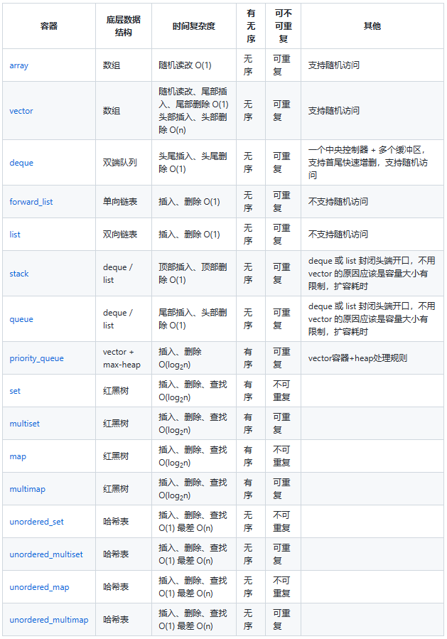

[toc]

# 1、什么是STL？

* STL是标准程序库，其目的是为了提升代码的复用性。
* STL分为配置器、迭代器、容器、算法、仿函数、配接器六大组件。
    - 配置器：负责空间配置和管理。
    - 迭代器：用于连接容器和算法。泛型的指针，用于遍历容器中的所有元素。
    - 容器：各种数据结构，用来存放数据，分为序列式容器和关联式容器。
    - 算法
    - 仿函数：行为类似函数，可作为算法的策略。
    - 配接器：用来修饰容器或仿函数或迭代器接口。


# 2、解释一下什么是trivial destructor？

平凡析构函数（trival destructor）要满足一下要求：
* 析构函数不是用户提供的（表示它是隐式声明，或在其首个声明显示定义为预置的）；
* 析构函数非虚（即基类析构函数非虚）；
* 所有直接基类都拥有平凡析构函数；
* 所有类类型（或类的数组类型）的非静态数据成员都拥有平凡析构函数。

平凡析构函数是不进行任何动作的析构函数。有平凡析构函数的对象不要求delete表达式，并**可以通过简单地解分配其存储进行释放**。所有与C语言兼容的数据类型（POD类型）都是可平凡析构的。

如果能够对是否trivial进行区分，可以采用内存处理函数memcpy()、malloc()等更加高效的完成相关操作，提升效率。

用户自定义了析构函数，则称之为“non-trivial destructor”，这种析构函数如果申请了新的空间一定要显式的释放，否则会造成内存泄露。


# 3、使用智能指针管理内存资源，RAII是怎么回事？

RAII：Resoruse acquisition is initialization，即资源获取即初始化，也就是说在构造函数中申请分配资源，在析构函数中释放资源。

C++的语言机制保证了，当一个对象创建的时候，自动调用构造函数，当对象超出作用域的时候会自动调用析构函数。所以，在RAII的指导下，我们应该**使用类来管理资源，将资源和对象的生命周期绑定**。

智能指针是RAII最具代表性的实现。


# 4、迭代器++it、it++哪个好，为什么？

* 前置++返回一个引用（++后的值）；后置++返回一个临时对象（++前的副本）。
* 前置++不会产生临时变量；后置++会产生临时变量，导致效率降低。

```C++
//前置++实现：
T& operator ++(){
    *this += 1;
    return *this;
}

//后置++实现：
T operator ++(int){
    T tmp = *this;
    ++(*this);
    return tmp;
}
```


# 5、说一下C++左值引用和右值引用

左值和右值：
左值和右值是变量属性，在C语言中，可以理解为左值可以位于赋值语句的左侧，右值则不能。
在C++中，一个对象被用作右值时使用的是对象的值（内容），表达式结束后就不存在的临时对象；当对象被用作左值时使用的是对象的身份（在内存中的位置），表达式结束后依旧持久存在的持久性对象。

区分左值和右值：看能不能对表达式取地址，能取地址即为左值，不能则为右值。

左值引用：常规引用，一般表示对象的身份。
右值引用：右值引用就是必须绑定到右值（一个临时对象、将要销毁的对象）的引用，一般表示对象的值。

右值引用可实现转移语义（Move Sementics）和精确传递（Perfect Forwarding），它的主要目的有两个方面：
* 消除两个对象交互时不必要的对象拷贝，节省运算存储资源，提高效率。
* 能够更简洁明确地定义泛型函数。

1. C++11中所有值必属于左值或者右值（简单来说可以取地址的就是左值，不能的就是右值）。
2. C++11中右值又可以分为纯右值（临时变量和不与对象关联的字面值）和将亡值（不再被使用或者即将被销毁），将亡值可以理解成盗取其他变量的内存空间的方式获取到的值，这样就可以避免空间的释放和分配，延长变量的生命周期。
3. 左值引用就是对一个左值进行引用的类型。右值引用就是对一个右值进行引用的类型。无论声明左值还是右值，都必须立即进行初始化（别名而已）。
4. 右值值引用通常不能绑定到任何的左值，要想绑定一个左值到右值引用，通常需要std::move()将左值强制转换为右值。

[左值引用和右值引用](https://interviewguide.cn/notes/03-hunting_job/02-interview/01-04-01-STL.html#_5%E3%80%81%E8%AF%B4%E4%B8%80%E4%B8%8Bc-%E5%B7%A6%E5%80%BC%E5%BC%95%E7%94%A8%E5%92%8C%E5%8F%B3%E5%80%BC%E5%BC%95%E7%94%A8)


# 6、STL中hashtable的实现？

SGI中hashtable使用bucket数组和自定义的链表（非stl的list）实现的，进行哈希时采用除余法。

hashtable的bucket数组是使用vector使用的，对应hashtable的桶子。hashtable中使用开链法解决哈希冲突，故每个桶子中维护了一个LinkedList，将对应同一个桶子（相同键值）的节点连接到LinkedList的尾部。

hashtable的迭代器只提供前进操作，不提供后退操作。

在hashtable设计bucket的数量上，其内置了28个质数[53, 97, 193,...,429496729]，在创建hashtable时，会根据存入的元素个数选择大于等于元素个数的质数作为hashtable的容量（vector的长度），其中每个bucket所维护的linked-list长度也等于hashtable的容量。如果**插入hashtable的元素个数超过了bucket的容量，就要进行重建table操作**，即找出下一个质数，创建新的buckets vector，重新计算元素在新hashtable的位置。


# 7、简单说一下traits技法

traits技法利用“内嵌型别“的编程技巧与编译器的template参数推导功能，增强C++未能提供的关于型别认证方面的能力。常用的有iterator_traits和type_traits。

iterator_traits被称为特性萃取机，能够方便的让外界获取以下5种型别：
* value_type：迭代器所指对象的型别
* difference_type：两个迭代器之间的距离
* pointer：迭代器所指向的型别
* reference：迭代器所引用的型别
* iterator_category：迭代器的类型，分为只读、只写、单向、双向、随机访问迭代器

type_traits关注的是型别的特性，例如这个型别是否具备non-trivial defalt ctor（默认构造函数）、non-trivial copy ctor（拷贝构造函数）、non-trivial assignment operator（赋值运算符） 和non-trivial dtor（析构函数）、是否是POD类型，如果答案是否定的，可以采取直接操作内存的方式提高效率。


答案二：
一句话概括：出于泛型算法操纵迭代器，需要知道迭代器所指的具体类型而设计出来的一种中间层，内部使用了偏特化的技术以支持原生指针等原生类型的特性萃取。
泛型算法操纵容器的数据的时候，使用的迭代器，在泛型算法内部无可避免的会使用迭代器所指数据的具体类型，泛型算法接收的泛型指针有可能是迭代器，也有可能是原生指针（比如vector，array的迭代器就是原生指针），所以不能仅依靠在迭代器内部定义类型，而是需要提供一个中间层iterator_traits，用于萃取迭代器指向类型的信息，使用偏特化技术为原生指针提供偏特化版本。
```C++
//使用iterator提供的信息
//主模板函数
template<typename Iterator>
struct iterator_traits
{
	typedef typename Iterator::iterator_category iterator_category;
	typedef typename Iterator::value_type        value_typep;
	typedef typename Iterator::difference_type   difference_type;
	typedef typename Iterator::pointer           pointer;
	typedef typename Iterator::reference         reference;
};

//由于无法使用iterator的信息，所以traits自己提供了。
//偏特化，原生指针
template<typename T>
struct iterator_traits<T *>
{
	typedef random_access_iterator_tag iterator_category;
	typedef T                          value_type;
	typedef ptrdiff_t                  difference_type;
	typedef T*                         pointer;
	typedef T&                         reference;
};

//偏特化，原生底层const指针
template<typename T>
struct iterator_traits<const T *>
{
	typedef random_access_iterator_tag iterator_category;
	typedef T                          value_type;//注意这里不是const T;如果是const T，算法拿到这个类型，用这个类型定义变量后，却无法改变其值，那就没有作用了，所以是T。
	typedef ptrdiff_t                  difference_type;
	typedef const T*                   pointer;
	typedef const T&                   reference;
};
```


# 8、STL的两级空间配置器

使用两级空间配置器的原因：
* 频繁地开辟释放内存，在堆上造成了内存碎片，浪费内存空间，且在外碎片增多，内存分配器找不到合适内存的时候需要合并空闲块，降低了效率。
* 每次调用malloc和free，会使分配的空间中增加一些额外的信息，降低了空间的利用率。

一级配置器：
一级空间配置器是以malloc()，free()，realloc()等C函数执行实际的内存配置 。大致过程是：
1. 直接使用malloc来分配内存，成功则直接返回，失败就试图调用处理函数；
2. 如果用户自定义了内存分配失败的处理函数就调用，没有的话就抛出bad_alloc异常；
3. 如果自定义了处理函数就进行处理，并企图释放内存，如果最终能分配成功就返回，不能的话就抛出bad_alloc异常。

二级配置器：
维护16条链表，分别是0-15号链表，最小8字节，以8字节逐渐递增，最大128字节。客户端请求分配大小为n bytes的内存（n <= 128，n已经圆整为8的倍数）
1. 检查n对应的free_list是否为空，不为空，直接分配一个内存块给客户，如果为空，到第2步；
2. 向内存池申请20个n bytes的内存，如果申请成功，一个返回给客户，另外19个挂到对应free_list节点下；如果有不到20个n bytes的空间，返回一个给客户，另外的全部交给对应free_list节点；如果连一个n bytes的空间都没法分配，进入第3步；
3. 向堆申请40个n bytes的空间，如果申请成功，20个n bytes交给内存池，1个返回给客户，19个留给free_list下的节点；如果堆内存不够，进入第四步；
4. 从比当前n还大的free_list节点中查找是否有内存可用，如果有，分n bytes给客户，另外部分交给内存池；如果n之后的所有free_list上都没有内存可用，进入第5步；
5. 调用第一级配置器的out_of_memory处理机制，尝试释放其它内存。如果可以，返回给客户。

释放时调用deallocate()函数，若释放的n>128，则调用一级空间配置器，否则就直接将内存块挂上自由链表的合适位置。

二级配置器解决了外部碎片并提升了效率，但是也有缺点：
* 由于会自动将要分配的内存提升到8的倍数，会造成内部碎片问题。
* 二级空间配置器是在堆上申请大块的狭义内存池，然后用自由链表管理，供现在使用，在程序执行过程中，它将申请的内存一块一块都挂在自由链表上，即不会还给操作系统，并且它的实现中所有成员全是静态的，所以它申请的所有内存只有在进程结束才会释放内存，还给操作系统，由此带来的问题有：1.即我不断的开辟小块内存，最后整个堆上的空间都被挂在自由链表上，若我想开辟大块内存就会失败；2.若自由链表上挂很多内存块没有被使用，当前进程又占着内存不释放，这时别的进程在堆上申请不到空间，也不可以使用当前进程的空闲内存，由此就会引发多种问题。


# 9、vector与list的区别与应用？怎么找某vector或者list的倒数第二个元素？

vector：
* vector和数组类似，都是一段连续的内存空间。
* vector能进行高效的随机存取，能够通过下标直接访问元素。查询某元素的时间复杂度为O(1)，插入和删除时会导致元素的拷贝，故时间复杂度为O(n)。 
* vector可以实现动态增长。当vector中的内存空间不足时，会重新申请一块内存空间，通常在GCC中是以2倍扩容，在MSVC中是以1.5倍扩容，在申请完新的内存空间后会将原内存空间中的元素拷贝到新的内存空间中，然后释放原先的内存。

list：
* list是由环状双向链表实现的（其中包含一个空的头节点，尾迭代器指向这个节点），支持对链表的双向遍历，内存空间是不连续的。
* list由于是不连续的内存空间，故不能进行随机访问，也就不能通过下标进行访问元素，只能通过迭代器进行访问。查询元素的时间复杂度为O(n)，插入和删除能高效地进行，时间复杂度为O(1)。


# 10、STL中vector删除其中的元素，迭代器如何变化？为什么是两倍扩容？释放空间？

vector的erase函数会返回删除后的下一个有效的迭代器，被删除的元素
的迭代器和其之后的迭代器均失效，被删除元素之前的迭代器还有效。

GCC使用2倍扩容可能和伙伴系统中的页大小都是2的倍数有关（为了充分利用页空间）；同样的MSVC中使用1.5倍扩容，是为了让扩容之前所使用的所有空间能够被复用（x+x^2 >= x^3）。


# 11、vector如何释放空间?

* vector的空间通常在vector析构时才会释放。当然了，在扩容的时候也会将原空间释放掉。clear()函数只是将元素析构，空间大小并不变。
* vector的shrink_to_fit函数会将vector中可以要求退回不使用的空间，其实现是重新开辟一段大小等于size的空间，将元素拷贝过去，然后释放原空间。
* 可以使用swap来达到shrink_to_fit的效果。
    ```C++
    vector<int>(vct).swap(vct); //将vec中不使用的多余内存清除
    vector<int>().swap(vct); //清空Vec的全部内存
    ```


# 12、容器内部删除一个元素

* 顺序容器删除元素：删除的元素以及其后的元素的迭代器都失效（list除外），erase返回值是下一个有效的迭代器，不能使用earse(it++)这种写法。
* 关联容器删除元素：erase迭代器只是被删除元素的迭代器失效，但是返回值是void，所以要采用erase(it++)的方式删除迭代器。


# 13、STL迭代器如何实现？

* 迭代器是一种抽象的设计理念，可以看作一种泛化的指针，通过迭代器可以在不了解容器内部实现的情况下遍历容器中的元素，还可以通过迭代器在不暴露容器内部实现的情况下实现算法。
* 迭代器的作用是提供一个访问容器内所有元素的接口，因此迭代器内部需要保存一个于容器相关联的指针，然后通过重载各种操作符来实现遍历。其中最重要的就是对operator* 和operator->进行重载。
* 迭代器的实际实现中，使用iterator_traits技术，萃取模板类型的五种型别：value type、difference type、pointer、reference、iterator catagoly。


# 14、map、set是怎么实现的，红黑树是怎么能够同时实现这两种容器？为什么使用红黑树？

* map和set底层时使用红黑树结构实现的，红黑树满足：**节点有红色和黑色、根节点和外部节点均为黑色、如果节点为红则父子节点均为黑、从外部节点到根节点沿途黑结点的数目相等**。
* 查询、插入、删除操作的时间复杂度均为O(logn)，效率高。
* 红黑树之所以能够同时实现map和set两种容器，是因为红黑树是使用模板实现的，为红黑树的节点值定义了一个模板参数，map传入的是一个pair<KeyType,ValueType>，而set传入的就是一个类型。
* map和set要求是自动排序的，红黑树能够实现这一功能，而且时间复杂度比较低。


# 15、如何在共享内存上使用STL标准库？


# 16、map插入方式有哪几种？

```C++
mapStudent.insert(pair<int, string>(1, "student_one")); 

mapStudent.insert(map<int, string>::value_type (1, "student_one"));

mapStudent.insert(make_pair(1, "student_one")); 

mapStudent[1] = "student_one"; 
```


# 17、STL中unordered_map(hash_map)和map的区别，hash_map如何解决冲突以及扩容?

区别：
* unordered_map的底层实现是哈希表；map的底层实现是红黑树。
* unordered_map不会根据键值对元素进行自动排序；map会根据键值对元素进行自动排序。
* unordered_map的查询、插入、删除操作的时间复杂度均为O(1)；map的查询、插入、删除操作的时间复杂度均为O(logn)。

unordered_map采用开链法解决哈希冲突。对于映射到同一个散列值上的不同键值的元素，连接到对应散列值的桶子上的LinkedList。

当哈希表中的所有元素的总和大于哈希表的桶子的大小（也可能要乘以装载因子）时，就需要进行扩容，扩容到下一个质数大小，然后进行重新哈希。


# 18、vector越界访问下标，map越界访问下标？vector删除元素时会不会释放空间？

vector通过下标访问元素时会进行边界检查，确保不会访问到越界地址。

map通过下标运算符[]访问元素时，实际是查找map中键值为key的元素，如果对应的键值的元素在map中不存在，那么会在map中插入一个该键值的元素，其值为默认的。

vector的erase函数只能删除某个元素，不会改变vector的容量(capacity)的大小，也就不会释放内存。clear也是一样。


# 19、map中[]与find的区别？

map中下标运算符[]是将键值作为下标去查询，并返回对应的值，如果不存在这个键值，就将一个具有该键值和值类型的默认值的项插入这个map。

find是查询某个键值的元素是否存在于map中，如果存在，返回该元素的迭代器，如果不存在，在返回尾迭代器。


# 20、STL中list与queue之间的区别

list不再能够像vector一样以普通指针作为迭代器，因为其节点不保证在存储空间中连续存在；

list插入操作和结合才做都不会造成原有的list迭代器失效;

list不仅是一个双向链表，而且还是一个环状双向链表，所以它只需要一个指针；

list不像vector那样有可能在空间不足时做重新配置、数据移动的操作，所以插入前的所有迭代器在插入操作之后都仍然有效；

deque是一种双向开口的连续线性空间，所谓双向开口，意思是可以在头尾两端分别做元素的插入和删除操作；可以在头尾两端分别做元素的插入和删除操作；

deque和vector最大的差异，一在于deque允许常数时间内对起头端进行元素的插入或移除操作，二在于deque没有所谓容量概念，因为它是动态地以分段连续空间组合而成，随时可以增加一段新的空间并链接起来，deque没有所谓的空间保留功能。


# 21、STL中的allocator、deallocator

一级配置器、二级配置器

alocator：大于128bytes调用一级配置器，小于等于128bytes调用二级配置器。
deallocator：大于128Bytes通过一级配置器释放，小于等于128Bytes接到freelist对应的节点上。


# 22、STL中hash table扩容发生什么？

hashtable中含有的：桶子（vector）、每个桶子中的链表（LinkedList）

当哈希表中的元素个数大于了桶的大小后，就发生扩容。
将桶的大小扩大至质数表中大于当前桶大小的质数，然后遍历原来的每个桶中的开链，将每个元素重新映射到新的桶中。


# 23、常见容器性质总结？




# 24、vector的增加删除都是怎么做的？为什么是1.5或者是2倍？

新增元素：如果vector中尚且有空间，则直接在指定位置插入元素，然后将其后的元素向后移动；如果vector中已无可用空间，则分配一块更大的内存，然后先拷贝前一段，再构造要插入的元素，接着将后面的拷贝到新内存中，最后释放原先的内存。

删除元素：pop_back()直接删除vector尾部元素，erase()删除指定范围内的所有元素，并将其后的元素向前移动，这两个接口只会改变size，不会改变capacity。


扩容方式一般分为等差扩容与等比扩容，等比扩容可以达到更低的时间复杂度，而等比扩容的扩容因子一般有2与1.5，采用1.5更高，因为扩容因子为2刚好不能使用之前的释放的所有空间，而扩容因子为1.5时，可以正好使用之前分配的两个内存空间之和

MSVC下扩容因子 = 1.5
MSVC中堆管理系统，会对已释放的连续堆块进行合并，因此：vector扩容机制选择使用1.5倍的方式扩容，这样多次扩容之后，若之前分配空间连续，可以达到重用的目的。
注意，采用1.5倍是因为，假设每次分配的空间为dp[i]，则dp[i] <= dp[i - 1] + dp[i - 2]，若前两个块连续，会被堆管理系统合并，可以极大的提升内存的重用效率，防止外部碎片！

GCC下扩容因子 = 2
Linux内核通过伙伴算法来管理物理内存。伙伴系统（Buddy System）在理论上是非常简单的内存分配算法。它的用途主要是完全消除外部碎片，同时允许快速分配与回收物理页面。
GCC下选择扩容因子 = 2的原因是与linux的伙伴系统的思想相结合，达到更高效率分配内存的目的。


# 25、说一下STL每种容器对应的迭代器

vector、deque：随机访问迭代器
list、set、map、multiset、multimap：双向迭代器
slist（C++11中为forward_list）、unordered_map、unordered_set、unordered_multiset、unordered_multimap：单向迭代器
stack、queue、priority_queue：没有迭代器，不支持遍历


# 26、STL中迭代器失效的情况有哪些？

vector：
插入元素时，如果不扩容，插入位置及之后的迭代器均失效；如果扩容，所有迭代器都失效。
删除元素：删除的元素的迭代器失效，删除的元素后面的迭代器也失效。

deque的失效情况和vector类似。

list删除元素仅使当前删除的元素的迭代器失效。

map、set的元素删除不会影响下一个节点的迭代器，故可以通过递增的方式获取下一个迭代器`mp.erase(iter++);`。

unordered_map、unordered_set的迭代器会在重新哈希后失效。


# 27、STL中vector的实现

序列式容器、连续内存空间、支持空间动态增长
三个成员均为指针：begin、end、capacity
随机访问迭代器，通过下标访问
查找O(1)，插入删除O(n)


# 28、STL中slist的实现

序列式容器、不连续空间、单向链表（list才是环形双向链表）、消耗空间相对list更小
节点中存储数据和指向下一节点的指针，链表中只存储头部哨兵节点
单向迭代器（list是双向迭代器），begin()指向头部哨兵的下一个节点（即链表的第一个元素），end()指向0
查找O(n)，插入删除O(1)，由于是单向的，所以提供的是insert_after、erase_after接口


# 29、STL中list的实现

序列式容器、不连续空间、双向环形链表
节点中存储数据、指向上一个节点的指针、指向下一个节点的指针
list中引入一个哨兵节点将链表结成环
双向迭代器，begin()指向哨兵的下一个元素(即链表的第一个元素)，end()指向哨兵
查找O(n)，插入删除O(1)


# 30、STL中的deque的实现

序列式容器、双向开口、连续空间、动态分配连续空间
中控器（维持整体连续的假象+缓冲区：中控器是一段小块的连续的空间，每个元素都是指针，指向一个较）大的连续空间（缓冲区），缓冲区的大小默认为512Bytes。
随机访问迭代器（设计复杂），迭代器的成员分为cur(此迭代器所在缓冲区的当前元素)、first(此迭代器所在缓冲区的头)、last(此迭代器所在缓冲区的尾)、node(此迭代器所在缓冲区在中控器中的节点)
查找O(1)，插入删除O(n)
对于插入删除时，需要移动元素，deque会计算朝两端移动时需要移动的元素的个数，然后朝移动个数少的一端移动
对deque进行排序时，应该先将deque赋给vector，对vector排序后再赋给deque，为了提升效率


# 31、STL中stack和queue的实现

stack和queue属于容器配接器，在STL中默认使用deque实现，只需要移除某些接口的实现即可。

stack和queue也可以使用list实现，但一般不用vector实现，因为vetcor会频繁移动元素或者扩容，影响性能。

stack和queue都不能访问内部的其他元素，故不提供迭代器。


# 32、STL中的heap的实现

物理上为vector，逻辑上为完全二叉树。

第i个节点的父节点为(i-1)/2，左子节点为2i+1；右子节点为2i+2。

以大顶堆为例：
建堆：Floyd建堆算法（自下而上的下滤），从右至左遍历vector，对每个元素的父节点进行下滤（如果小于左节点或右节点，与其交换，都小于时和更大的那个交换），建堆的时间复杂度为O(n)。
插入：将插入元素置于vector尾部，然后进行上滤（和其父节点比较大小，大的话交换），堆大小加一，插入的时间复杂度O(logn)。
删除：vector首元素为最大的元素，那么就将尾部元素和首元素交换，然后进行下滤，同时堆大小减一，删除的时间复杂度O(nlogn)。


# 33、STL中的priority_queue的实现

优先队列，是一个拥有权值观念的queue，它跟queue一样是顶部入口，底部出口，在插入元素时，元素并非按照插入次序排列，它会自动根据权值（通常是元素的实值）排列，权值最高，排在最前面。

优先级队列是完全以vector实现的，属于容器配接器。默认是以大顶堆实现的。


# 34、STL中set的实现

关联式容器，所有的元素会根据值的大小进行自动排序（默认升序），set中不允许两个元素有相同的值。
set的迭代器都是const_iterator，不允许迭代器修改元素的值（实际用的还是RBtree的begin()，但是set的begin()声明成了const）。
set底层以RBtree实现，几乎所有操作都转掉RBtree的操作，RBtree的根节点和外部节点都为黑色，红节点的父子节点均为黑节点，从外部节点到根节点沿途黑结点的数目相等。
查询O(logn)，插入删除O(logn)
在插入节点时，set使用的时RBtree的insert_unique()接口，而multiset使用的RBtree的insert_equal()接口。


# 35、STL中map的实现

关联式容器，所有的元素会根据键值的大小进行自动排序（默认升序），map中不允许两个元素有相同的键值。
map的迭代器不能修改元素的键值，但是可以修改元素的实值（通过将pair的Key类型设置为const来实现的`pair<const KeyType, ValueType>`）。
map底层以RBtree实现。
map可以使用下标运算符获取某个键值对应的实值，当使用下标运算符所查找的键值在map中不存在时，先构造一个使用键值和实值类型默认值构造一个pair，然后插入到map中。


# 36、set和map的区别，multimap和multiset的区别

* set提供一个类型的接口；而map提供两个类型的接口
* multimap调用的是红黑树的insert_equal()，可以重复插入而map调用的则是独一无二的插入insert_unique()


# 37、STL中unordered_map和map的区别和应用场景

* unordered_map底层实现使用的是哈希表；map底层实现是红黑树。
* unordered_map不会对元素进行自动排序；map会根据键值进行排序。
* unordered_map查询、插入、删除的时间复杂度均为O(1)；map的均为O(logn)。
* unordered_map适用于高效查询的应用场景；map适用于有序数据的应用场景。


# 38、hashtable中解决冲突有哪些方法？

* 多槽位法：将每个桶细分为若干个槽位，用来存放冲突的元素。
    缺点：划分过细会导致空间浪费，反之又容易导致槽位不够。

* 开放链：每个表格维护一个list，如果hash函数计算出的格子相同，则按顺序存在这个list中。
    优点：任意多次冲突都可以解决
    缺点：查询需要遍历链表，而且由于空间不连续，系统缓存很难生效

* 公共溢出区：单独开辟一段连续的空间，将发生哈希冲突的元素顺序存放至此区域。
    优点：结构简单，易于实现
    缺点：处理冲突的时间正比于溢出区的规模

* 线性探测：如果当前元素被映射的位置已经被别的元素占用了，那么向后依次寻找，找到表尾则回到表头，直至找到一个空位。
    优点：在散列表内部解决冲突，无需额外附加指针、链表等，整体结构简洁，只要有空桶一定能找到
    缺点：数据堆积严重

* 平方探测：如果当前元素被映射的位置已经被别的元素占用了，那么向后以平方数（1^2、2^3、3^3……）为距离，找到表尾则回到表头，直至找到一个空位。如果移动距离是随机数，则为伪随机探测。
    缺点：有些空桶并不一定能被找到

* 再散列：发生冲突时使用另一种hash函数再计算一个地址，直到不冲突
