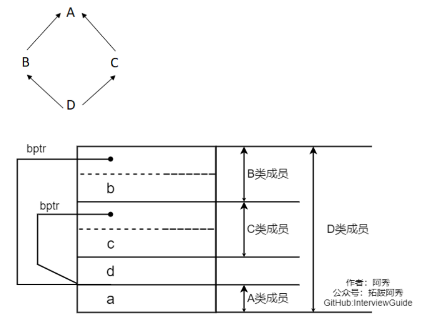

[toc]

# 1、C++的多态是如何实现的？

语言层面：
在基类的函数前加上virtual关键字，并且在派生类中重写该函数（不重写那么就直接继承基类的），那么运行时就会根据指针或引用实际指向的类型来调用相应的函数。

原理层面：
C++的多态是通过虚函数表(vtable)和虚表指针(vptr)实现的。
虚函数表：当类中含有虚函数时，编译器会自动生成一个虚函数表，其中保存了虚函数的入口地址。
虚表指针：指向虚函数表的指针，在含有虚函数的类实例化时，对象地址的前4字节存储的是虚表指针（也有可能是最后四个字节，视编译器而定）。

多态实现过程：
1. 编译器发现基类中存在虚函数时，会自动位每个含有虚函数的类生成一份虚函数表，表中的每个slot保存了虚函数的地址，虚函数表在编译器确定，属于常量数据区。
2. 编译器会在每个对象的前4个字节空间中（也可能是最后4个字节）存储一个虚表指针，指向对象所属的类的虚函数表。在构造时根据对象的类型初始化虚表指针，从而让虚表指针指向正确的类的虚函数表，进而能在调用虚函数时，找到正确的函数地址。
3. 在定义派生类对象时，程序会自动调用构造函数，在构造函数中创建虚表指针并进行初始化。构造派生类对象时，会先调用基类构造函数，此时由于只有基类对象被构造，那么会先将虚表指针指向基类的虚函数表，然后调用派生类的构造函数时，为派生类对象初始化虚表指针，指向派生类的虚函数表。
4. 当派生类没有对基类的虚函数进行重写时，派生类和基类还是会生成各自的虚函数表，而不会公用同一张虚函数表，因为即便所有的函数地址是相同的，但是在表的-1位置存储的RTTI信息还是不一样的。


# 2、为什么析构函数一般写成虚函数？

由于类的多态性，可以将一个基类的指针指向派生类的对象，在当析构函数是虚函数时，在通过基类指针释放其所指向的派生类对象时，会调用派生类的对象，先析构派生类的成员，然后再调用基类的析构函数，完成整个派生类对象的释放。

如果析构函数不声明为虚函数，那么当一个基类指针指向派生类指针时，调用析构函数时，只会调用基类的析构函数，导致派生类独有的成员无法被析构，从而造成了内存泄漏。

但存在一种特例，在CRTP模板中，不应该将析构函数声明为虚函数，理论上所有的父类函数都不应 该声明为虚函数，因为这种继承方式，不需要虚函数表。

注意：
* 析构函数可以是纯虚的，但纯虚析构函数必须有定义体，因为调用完派生类的析构函数后，再调用基类的析构函数，需要要显示实现。


# 3、构造函数能否声明为虚函数或者纯虚函数，析构函数呢？

构造函数：
* 虚函数是在运行时确定其类型，而在构造派生类对象过程中调用基类构造函数时对象尚且未被成功创建，无法知道其实际类型。
* 构造函数不能声明为虚函数或者纯虚函数，虚函数对应一个vtable(虚函数表)，类中存储一个vptr指向这个vtable。如果构造函数是虚函数，就需要通过vtable调用，可是对象没有初始化就没有vptr，无法找到vtable，所以构造函数不能是虚函数。

析构函数：
* 析构函数可以为虚函数，并且一般情况下基类析构函数要定义为虚函数。
* 只有在基类析构函数定义为虚函数时，调用操作符delete销毁指向对象的基类指针时，才能准确调用派生类的析构函数（从该级向上按序调用虚函数），才能准确销毁数据。
* 析构函数可以是纯虚函数，含有纯虚函数的类是抽象类，此时不能被实例化。但派生类中可以根据自身需求重新改写基类中的纯虚函数。

Effective C++条款9：绝不在构造和析构过程中调用virtual函数。


# 4、基类的虚函数表存放在内存的什么区，虚表指针vptr的初始化时间、

基类的虚函数表存放在常量数据区。

虚函数表的特征：
* 虚函数表是全局共享的元素，在全局仅有一个，在编译时期完成构造。
* 虚函数表类似一个数组，每个slot中存储的是虚函数的地址。

虚表指针vptr初始化时间：对于有虚函数或者继承于拥有虚函数的基类，对该类进行实例化时，在构造函数执行时会对虚表指针进行初始化，并且存在对象内存布局的最前面。


# 5、模板函数和模板类的特例化

引入原因：
编写单一的模板，它能适应多种类型的需求，使每种类型都具有相同的功能，增强复用性。但对于某种特定类型，如果要实现其特有的功能，单一模板就无法做到，这时就需要模板特例化。

特例化：对单一模板提供的一个特殊实例，它将一个或多个模板参数绑定到特定的类型或值上。

(1) 模板函数特例化：必须为原函数模板的每个模板参数都提供实参，且使用关键字template后跟一个空尖括号对<>，表明为原模板的所有模板参数提供实参。
```C++
template<typename T> //模板函数
int compare(const T &v1,const T &v2)
{
    if(v1 > v2) return -1;
    if(v2 > v1) return 1;
    return 0;
}
//模板特例化,满足针对字符串特定的比较，要提供所有实参，这里只有一个T
template<> 
int compare(const char* const &v1,const char* const &v2)
{
    return strcmp(p1,p2);
}
```
注意：
* **特例化的本质是实例化一个模板，而非重载它**。特例化不影响参数匹配。参数匹配都以最佳匹配为原则。例如，此处如果是compare(3,5)，则调用普通的模板，若为compare(“hi”,”haha”)则调用特例化版本（因为这个cosnt char*相对于T，更匹配实参类型），注意二者函数体的语句不一样了，实现不同功能。
* 模板及其特例化版本应该声明在同一个头文件中，且所有同名模板的声明应该放在前面，后面放特例化版本。


(2) 类模板特例化：对类进行特例化时，仍然用template<>表示是一个特例化版本。

(3) 类模板的部分特例化：与函数模板不同，类模板的特例化不必为所有模板参数提供实参。我们**可以只指定一部分而非所有模板参数，或是参数的一部分而非全部特性**。一个类模板的部分特例化本身是一个模板，使用它时用户还必须为那些在特例化版本中未指定的模板参数提供实参。
```C++
//主模板
template<typename T, typename alloc>
struct hash1{
	size_t operator()(char x) const {return x};
};

//偏特化1
//偏特化
template<typename T, typename alloc>
struct hash1<T*, alloc>{
	size_t operator()(int x) const {return x};
};

//偏特化2
//偏特化某个模板参数为具体类型
template<typename alloc>
struct hash1<int, alloc>{
	size_t operator()(int x) const {return x};
};
```

(4) 特例化类中的部分成员：可以特例化类中的部分成员函数而不是整个类。


注意：**只能部分特例化类模板，不能部分特例化函数模板**。


# 6、构造函数、析构函数、虚函数可否声明为内联函数？

从语言层面看：
能够将构造函数、析构函数、虚函数声明为内联的，因为将函数声明为内联的只是向编译器发出一个请求，但是编译器并不一定接受这个内联请求。

对于构造函数和析构函数：
将构造函数和析构函数声明为内联的是没有意义的，编译器并不会真正对声明为inline的构造函数和析构函数进行内联操作，因为编译器会在构造和析构函数中添加额外的操作（申请/释放内存，构造/析构对象等），致使构造函数/析构函数并不像看上去的那么精简。

对于虚函数：
当是指向派生类的指针（多态性）调用声明为inline的虚函数时，不会内联展开；当是对象本身调用虚函数时，会内联展开，当然前提依然是函数并不复杂的情况下。


# 7、C++模板是什么，你知道底层怎么实现的？

编译器并不是把函数模板处理成能够处理任意类的函数；编译器从函数模板通过具体类型产生不同的函数；编译器会对函数模板进行两次编译：在声明的地方对模板代码本身进行编译，在调用的地方对参数替换后的代码进行编译。

这是因为**函数模板要被实例化后才能成为真正的函数**，在使用函数模板的源文件中包含函数模板的头文件，如果该头文件中只有声明，没有定义，那编译器无法实例化该模板，最终导致链接错误。


# 8、构造函数为什么不能为虚函数？析构函数为什么要虚函数？

goto 2，3

如果构造函数声明为虚函数，那么在调用构造函数的时候就会通过vptr在虚函数表中查找对应的函数地址，但是由于还未将对象初始化，尚且没有vptr，也就访问不到虚函数表了。


# 9、析构函数的作用，如何起作用？

析构函数与构造函数对应，当对象结束其生命周期，系统会自动执行析构函数，对类实例化出来的对象资源进行清理，完成对象销毁前的一些清理工作（如果一个类中有指针，且在使用的过程中动态的申请了内存，那么最好显示构造析构函数在销毁类之前，释放掉申请的内存空间，避免内存泄漏）。

析构函数名也应与类名相同，只是在函数名前面加一个位取反符~，以区别于构造函数。它不能带任何参数，也没有返回值（包括void类型）。只能有一个析构函数，不能重载。

类析构顺序：1）派生类本身的析构函数；2）对象成员析构函数；3）基类析构函数。


# 10、构造函数和析构函数可以调用虚函数吗，为什么？

从语法层面来说是可以调用的，但是《Effective C++》条款9：绝不在构造和析构过程中调用virtual函数。

在执行派生类构造函数时，会先调用基类构造函数，并且构造虚表指针，但是由于此时基类构造函数并不知道派生类对象的信息，且派生类成员也都未初始化，因此基类构造函数中会将虚表指针指向基类的虚函数表，这时候在基类的构造函数中调用虚函数，并不会下沉到派生类中，即访问的还是基类的虚函数表。

同样的，派生类析构时，先调用派生类本身的析构函数，再调用基类的析构函数，这时候派生类的成员都已被析构，虚表指针也不会再指向派生类的虚函数表，在基类的析构函数中调用虚函数也不会下沉到派生类中，即访问的还是基类的虚函数表。


# 11、构造函数、析构函数的执行顺序？构造函数和拷贝构造的内部都干了啥？

构造函数执行顺序：
1. 调用虚基类的构造函数，如果有多个则按继承列表的声明顺序构造；
2. 调用基类的构造函数，如果有多个则按继承列表的声明顺序构造；
3. 调用派生类的成员的构造函数，如果有多个则按照成员的声明顺序构造；
4. 执行派生类构造函数的函数体。

析构函数执行顺序：
1. 执行派生类函数的函数体；
2. 调用派生类的成员的析构函数，如果有多个则按照成员的声明顺序逆序析构；
3. 调用基类的析构函数，如果有多个则按继承列表的声明顺序逆序析构；
4. 调用虚基类的析构函数，如果有多个则按继承列表的声明顺序逆序析构。


# 12、虚析构函数的作用，父类的析构函数是否要设置为虚函数？

goto 2

基类的析构函数一定要设置为虚函数，防止内存泄漏


# 13、构造函数析构函数可否抛出异常？

从语言层面上来说构造函数和析构函数可以抛出异常，但是通常不建议这么做。

构造函数：
析构函数只会析构已经完成构造的对象，那么如果在构造函数中发生了异常，那么该对象的析构函数不会被调用，那么在构造函数中动态分配的内存将不会被释放，造成了内存泄漏（因此可以用智能指针管理动态分配的内存）。

析构函数：
- 如果析构函数抛出异常，则异常点之后的程序不会被执行，如果析构函数在异常点之后执行了某些必要的动作比如释放某些资源，则这些动作不会被执行，会造成内存泄漏。
- 通常异常发生时，C++机制会调用已经构造对象的析构函数来释放资源，此时如析构函数本身也抛出异常，则前一个异常尚未处理，又有新的异常，会造成程序崩溃的问题。


《Effective C++》条款8：别让异常逃离析构函数。
* 如果某个操作可能会抛出异常，class应提供一个普通函数（而非析构函数），来执行该操作。目的是给客户一个处理错误的机会。
* 如果析构函数中异常非抛不可，那就用try catch来将异常吞下，必须要把这种可能发生的异常完全封装在析构函数内部，决不能让它抛出函数之外。


# 14、构造函数一般不定义为虚函数的原因

goto 3


# 15、类什么时候会析构？

* 当类对象的生命周期结束时。
* 当delete指向类对象的指针时。
* 当delete指向类对象的基类指针，且析构函数是虚函数时。
* 当类对象被析构时，其成员变量也会被析构。


# 16、构造函数或者析构函数中可以调用虚函数吗？

goto 10


# 17、构造函数的default、delete、=0关键字

default：显示地要求编译器自动合成构造函数，防止在调用相关构造函数时应为没有定义而报错。当在类内使用default修饰函数的声明时，会隐式内联；如果不需要使其内联，则在类外定义时使用default修饰（没有函数体的）。

delete：使用delete关键字将拷贝构造函数、赋值运算符等声明为删除的函数，达到阻止拷贝的目的。析构函数不能声明为delete的。

=0：将函数声明为纯虚函数，纯虚函数无需定义，=0只能出现在类内部虚函数的声明语句处；当然，也可以为纯虚函数提供定义，函数体可以定义在类的外部也可以定义在内部。


# 18、构造函数、拷贝构造函数和赋值操作符的区别

构造函数：当创建一个类的对象时，它被调用来对类的数据成员进行初始化。对象不存在。

拷贝构造函数：一种特殊的构造函数，用基于同一类的一个对象构造和初始化另一个对象。对象不存在。

赋值运算符：当一个类的对象向该类的另一个对象赋值时，就会用到该类的赋值函数。对象存在，只是重新给定一个值。


# 19、拷贝构造函数和赋值运算符重载的区别？

* 拷贝构造函数是一个函数；赋值运算符是运算符重载。
* 拷贝构造函数是使用一个已经存在的对象去构造一个新的对象；而赋值运算符是将一个对一个已经存在的对象进行赋值。
* 由于拷贝构造函数构造了一个新的对象，故在初始化之前无需做额外的检查；赋值运算符需要检查自赋值的情况，且需要对源对象分配的动态内存进行释放。

注意：`A a1 = a2;`调用拷贝构造函数；`a3 = a2;`调用赋值运算符。


# 20、什么是虚拟继承？

派生类可以通过它的两个直接基类继承其间接基类，这就构成了菱形继承。在菱形继承下，构造派生类对象，会导致派生类对象中存在多个间接基类对象。为了解决这个问题，提出了虚继承。

虚继承的目的是另某个类作出声明，承诺其愿意共享它的基类对象。其中被共享的基类称为虚基类。

在虚继承的情况下，无论间接基类被继承多少次，在派生类对象中只会存在一个间接基类的对象。

虚继承基类的子类中，子类会增加某种形式的指针，可以指向虚基类子对象，也可以指向一个相关的表格；表格中存放的是虚基类子对象的地址或者是其偏移量，此类指针被称为vbptr。如果既存在vptr又存在vbptr，某些编译器可能会将其优化，合并为一个指针。


如果虚基类中存在虚函数，那么派生了中会生成两个虚函数表指针，一个指向共享部分（虚基类中的虚函数表），另一个指向非共享部分的。


# 21、什么情况会自动生成默认构造函数？

* 类的某个成员含有默认构造函数（显示声明的或者编译器自动合成的）
* 派生类的基类对象含有默认构造函数（显示声明的或者编译器自动合成的）
* 带有虚函数的类（需要在默认构造函数中初始化vptr）
* 带有虚基类的类（需要在默认构造函数中初始化vbptr）
当然了，上面四种情况的前提是没有任何带参的构造函数和拷贝构造函数，但是有赋值运算符是可以的。

注意：合成的默认构造函数中，只有基类子对象和成员类对象会被初始化。所有其他的非静态数据成员都不会被初始化。


# 22、抽象基类为什么不能创建对象？

纯虚函数：纯虚函数并不实现功能（要实现也可以，但是派生类还是需要提供自己的实现），由派生类对其功能提供实现。

抽象类的定义：带有纯虚函数的类为抽象类，如果派生类未对纯虚函数完成定义，那么这个派生类也会成为抽象类。

抽象类的作用：抽象类的主要作用是将有关的操作作为结果接口组织在一个继承层次结构中，由它来为派生类提供一个公共的根，派生类将为这些接口提供续剧的实现。

纯虚函数引入原因 ：
1、为了方便使用多态特性，我们常常需要在基类中定义虚拟函数。 
2、在很多情况下，基类本身生成对象是不合情理的。

从实现层面来说：纯虚函数需要由派生类来提供具体的实现，在抽象类中是没有其具体实现的，那么也就无法被实例化。


# 23、模板类和模板函数的区别是什么？

函数模板的实例化是由编译程序在处理函数调用时自动完成的，而类模板的实例化必须由程序员在程序中显式地指定。即函数模板允许隐式调用和显式调用而类模板只能显示调用。在使用时类模板必须加<T>，而函数模板不必。


# 24、多继承的优缺点，作为一个开发者怎么看待多继承？

多重继承：一个派生类继承于多个基类。

多重继承的优点：派生类对象可以继承多个基类的属性，调用多个基类中的接口。

多重继承的缺点：
* 如果派生类的多个基类中存在同名的函数，则会出现二义性错误（同名但函数签名不同也会），这种情况下在调用时需要显示指定所使用接口的作用域`d->Base1::func();`。
* 出现菱形继承，导致派生类对象中还有多个间接基类的对象，浪费空间，但是可以通过虚继承解决（虽然还是引入了指向虚继承表的指针）。


# 25、模板和实现可不可以不写在一个文件里面？为什么？

模板的声明和实现都需要写在.h文件中。

在编译时，编译器不会为由template<……>处理的东西分配内存，因此在编译时模板并不能生成二进制代码，而是在编译对模板进行实例化的文件中才会去找对应的模板声明和实现。如果将模板的声明和实现分开，那么在编译实例化模板的文件时，编译器只能找到模板的声明，而找不到模板的实现，只能创建一个未决符号寄希望于在链接时找到模板的实现，然而由于模板并未生成二进制代码，链接时找不到对应的实现，就只能报错。


# 26、将字符串“hello world”从开始到打印到屏幕上的全过程?

1. 用户通过外设输入指令，通知操作系统执行HelloWorld程序。
2. 操作系统找到HelloWorld程序相关的信息，检查其是否为可执行文件，并通过首部信息确定代码和数据在可执行文件中的位置并计算出对应的磁盘块地址。
3. 操作系统创建一个新进程，将HelloWorld的可执行文件映射到该进程中，表示由该进程执行HelloWorld程序。
4. 操作系统为HelloWorld程序设置上下文环境，并跳到程序开始处。
5. 执行HelloWorld程序的第一条程序，由于先前只是将可执行文件映射到了进程空间中，并未加载入内存，故会发生缺页中断，于是将可执行文件对应的页置换入内存。
6. 操作系统将对应的页置换进内存中后，继续执行HelloWorld程序。
7. HelloWorld程序调用puts函数执行系统调用，在显示器上写一行字符串。
8. 操作系统找到要将字符串送往的显示设备，通常设备是由一个进程控制的，所以，操作系统将要写的字符串送给该进程。
9. 控制设备的进程告诉设备的窗口系统，它要显示该字符串，窗口系统确定这是一个合法的操作，然后将字符串转换成像素，将像素写入设备的存储映像区。
10. 视频硬件将像素转换成显示器可接收和一组控制数据信号，显示器解释信号，激发液晶屏。


# 27、为什么拷贝构造函数必须传引用不能传值？

当使用值传递时，需要使用实参构造形参，会调用拷贝构造函数，那么就会无限递归调用拷贝构造函数，最后导致栈溢出。

使用引用传递或指针传递时，由于形参只是实参的别名或者只拷贝指向实参的指针，那么就不会有拷贝构造函数的调用，就可以避免值传递带来的无限递归问题。


# 28、静态函数能定义为虚函数吗？常函数呢？

静态函数不能定义为虚函数，因为静态函数不属于任何一个类对象，其中没有this指针，那么也就访问不到虚表指针（虚表指针是类的成员）。

常函数可以被定义为虚函数，常函数具有this指针，只是说this指针指向的是一个常量(底层const)。


# 29、虚函数的代价是什么？

1. 每一个有虚函数的类都会在编译时期生成一个虚函数表，会记录每个函数的函数指针(即函数的入口地址)，基函数表存放在只读常量区(.rodata)，占用了内存空间。
2. 含有虚函数的类在构造的时候，会构造一个指向虚函数表的指针，并通过这个指针访问虚函数的地址，来实现多态，这增大了类成员的大小。
3. 对于通过引用或指针调用的成员函数，无法再被内联（通过对象调用的依旧可以）。


# 30、说一说你了解到的移动构造函数？

移动构造函数提出场景：使用对象a初始化对象b后不在使用对象a了，但是在析构之前a的对象还存在，那么其实就可以直接使用a的空间，避免了新的空间的分配，大大降低了构造的成本。

移动构造函数：`Type(Type&&);`，只有一个形参，或者剩余形参具有默认值。

与拷贝构造函数类似，移动构造函数也是使用源对象构造目标对象，但是区别在于，移动构造函数是对象值的真实转移（源对象转移到目标对象），源对象将让出其所占用的空间，被目标对象占用。

移动构造函数传入的参数是一个右值或者将亡值，对于一个左值可以使用std::move将其转换为右值。

拷贝构造函数对于指针要采用深拷贝（否则源对象被释放后，目标对象中的指针就悬空了）；移动构造函数对于指针可以采用浅拷贝（直接接管源对象中的指针）。


# 31、 什么情况下会合成构造函数？

goto 21

* 类的成员由默认构造函数
* 派生类的基类有默认构造函数
* 有虚函数
* 有虚基类


# 32、那什么时候需要合成拷贝构造函数呢？

总的来说，在类不展现bitwise copy semantics（位逐次拷贝）时会合成拷贝构造函数。

* 类的成员具有拷贝构造函数（显式声明的或者编译器合成的）
* 派生类的基类据有拷贝构造函数（显式声明的或者编译器合成的）
* 类中声明了虚函数（拷贝vptr）
* 带有虚基类的类（拷贝vbptr）


# 33、构造函数的执行顺序是什么？

1. 按照继承列表中的顺序调用虚基类的构造函数并设置指向虚基类表的指针。
2. 按照继承列表的顺序调用基类的构造函数并设置指向虚函数表的指针。
3. 按照声明顺序调用类成员的构造函数。
4. 执行类的构造函数函数体。


# 34、一个类中的全部构造函数的扩展过程是什么？

* 记录在成员初始化列表中的数据成员初始化操作会被放在构造函数的函数体内，并与成员的声明顺序为顺序；
* 如果一个成员并没有出现在成员初始化列表中，但它有一个默认构造函数，那么默认构造函数必须被调用；
* 如果class有虚表，那么它必须被设定初值；
* 所有上一层的基类构造函数必须被调用；
* 所有虚基类的构造函数必须被调用。


# 35、哪些函数不能是虚函数？

* 构造函数：构造函数声明为虚函数，在构造时尚且没有指向虚函数表的指针，那么就无法访问到虚函数表。
* 静态函数：静态函数没有this指针，无法通过this指针访问到指向虚函数表的指针。
* 友元函数：友元函数不属于类的成员函数，不能被继承，故没有声明为虚函数一说。
* 普通函数：普通函数不属于类的成员函数，不能被继承，故没有声明为虚函数一说。


# 36、什么是纯虚函数，与虚函数的区别？

虚函数是为了动态绑定而产生，可以通过基类类型的指针或引用，指向不同的派生类的对象时，自动调用相应和基类同名的函数，表现出多态。虚函数需要在基类中加上virtual修饰符修饰，因为virtual会被隐式继承，所以子类中相同函数都是虚函数。当一个成员函数被声明为虚函数之后，其派生类中同名函数自动成为虚函数，在派生类中重新定义此函数时要求函数名、返回值类型、参数个数和类型全部与基类函数相同。

纯虚函数只是相当于一个接口名，含有纯虚函数的类不能够实例化，纯虚函数在基类中的一般没有定义（也可以有），由派生类给出其具体的定义。


