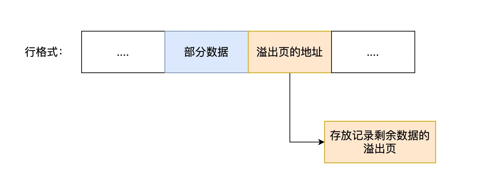
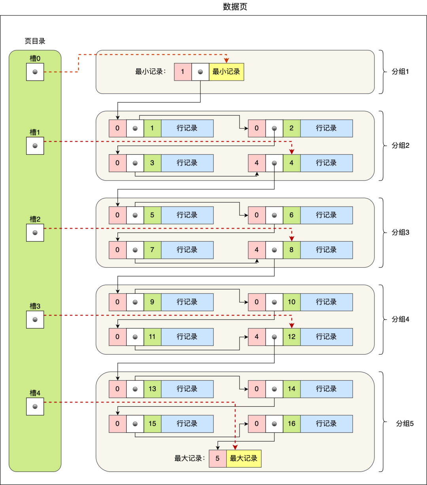
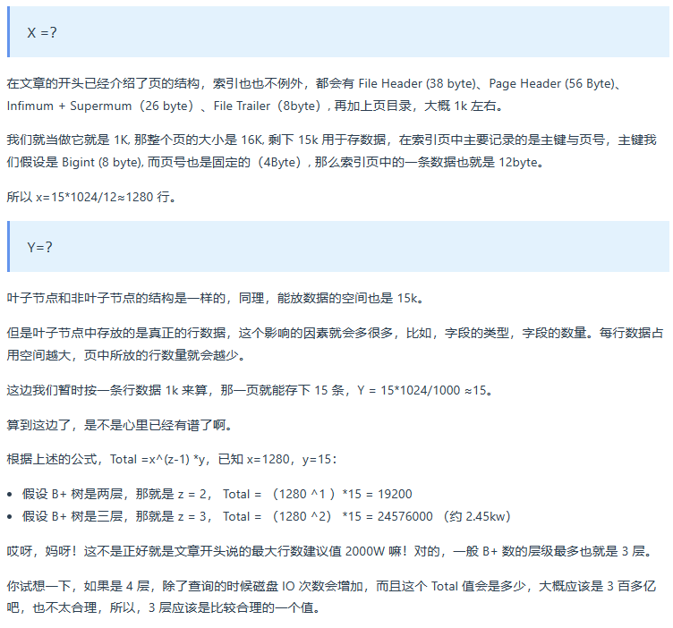

[TOC]


# 一、基础篇


## 1、执行一条select语句，期间发生了什么？


### MySQL执行流程


MySQL架构总共分为两层：Server层、存储引擎层
* Server层负责建立连接、分析和执行SQL。连接器，查询缓存、解析器、预处理器、优化器、执行器、内置函数、跨存储引擎的功能等核心模块都在Server层实现。
* 存储引擎层负责数据的存储和提取。支持InnoDB、MyISAM、Memory等多个存储引擎，不同的存储引擎共用一个Server层。


### 第一步：连接器

使用`mysql -h$ip -u&user -p`这条命令连接MySQL服务。如果是本地的MySQL服务可以不用-h参数。

连接的过程需要先经过TCP三次握手，因为MySQL是基于TCP协议进行传输的。建立好TCP连接后验证用户名和密码，验证成功后连接器就会获取该用户的权限，然后保存起来，后续该用户在此连接里的任何操作，都会基于连接开始时读到的权限进行权限逻辑的判断。

如果一个用户已经建立了连接，即使管理员中途修改了该用户的权限，也不会影响已经存在连接的权限。修改完成后，只有再新建的连接才会使用新的权限设置。

查看MySQL服务器所连接的客户端个数：`show processlist;`。

MySQL定义了空闲连接的最大空闲时长，由`wait_timeout`参数控制的，默认值是8小时（28880秒），如果空闲连接超过了这个时间，连接器就会自动将它断开。通过语句`show variables like 'wait_timeout';`可以查看`wait_timeout`参数的值。

手动断开MySQL连接：`kill connection +id;`。一个处于空闲状态的连接被服务端主动断开后，这个客户端并不会马上知道，等到客户端在发起下一个请求的时候，才会收到这样的报错“ERROR 2013 (HY000): Lost connection to MySQL server during query”。

查看MySQL的最大连接数：`show variables like 'max_connections';`。

* MySQL短连接：连接MySQL--执行sql--断开MySQL
* MySQL长连接：连接MySQL--执行sql--执行sql--......--执行sql--断开MySQL

MySQL长连接可以减少建立连接和断开连接的过程，因此推荐使用长连接。但是长连接可能会带来占用内存过多的问题（MySQL在执行查询过程中临时使用内存管理连接对象，这些连接对象资源只有在连接断开时才会释放。如果长连接累计很多，将导致MySQL服务占用内存太大，有可能会被系统强制杀掉，这样会发生MySQL服务异常重启的现象）。

解决长连接占用内存问题：
1. 定期断开长连接；
2. 客户端主动重置连接（客户端可以在执行了一个大的操作后使用`mysql_reset_connection()`函数使连接恢复到刚连接的状态，达到释放内存的效果，注意此函数不需要重新连接和重新做权限验证）。

连接器的工作总结：
* 与客户端进行TCP三次握手建立连接；
* 校验客户端的用户名和密码，如果用户名或密码不对，则会报错；
* 如果用户名和密码都对了，会读取该用户的权限，然后后面的权限逻辑判断都基于此时读取到的权限。


### 第二步：查询缓存

连接器得工作完成后，客户端就可以向MySQL服务发送SQL语句了，MySQL服务收到SQL语句后，就会解析出SQL语句的第一个字段，看看是什么类型的语句。

如果SQL是查询语句（select语句），MySQL就会先去查询缓存（Query Cache）里查找缓存数据，看看之前有没有执行过这一条命令，这个查询缓存是以key-value形式保存在内存中的，key为SQL查询语句，value为SQL语句查询的结果。

如果查询的语句命中查询缓存，那么就会直接返回value给客户端。如果查询的语句没有命中查询缓存中，那么就要往下继续执行，等执行完后，查询的结果就会被存入查询缓存中。


### 第三步：解析SQL

解析器的工作：
1. 词法分析：根据输入字符串识别出关键字，构建语法树；
2. 语法分析：根据词法分析的结果，依据语法规则，判断输入的SQL语句是否满足MySQL语法。


### 第四步：执行SQL

每条`select`查询语句流程主要分为三个阶段：
1. 预处理阶段：
    * 检查SQL查询语句中的表或者字段是否存在；
    * 将`select * `中的`*`符号，扩展为表上的所有列。
2. 优化阶段：
    优化器主要负责将SQL查询语句的执行方案确定下来（例如表中有多个索引时基于查询成本确定使用那个索引）。  
    没有使用索引时，会进行全表扫描。  
    查询语句最前面加上`explain`命令能够输出该SQL语句的执行计划，然后执行计划中的key就表示了执行过程中使用的索引方案。
3. 执行阶段：
    在执行的过程中，执行器就会和存储引擎交互了，交互是以记录为单位的。主要有以下三种执行过程：
    * 主键索引查询：
    
    * 全表查询:
    
    * 索引下推：
    索引下推能够减少二级索引在查询时的回表操作，提高查询的效率，因为它将Server层部分负责的事情，交给存储引擎层去处理了。
    
    


### 小结

执行一条SQL查询语句的过程：
1. 连接器：建立连接，管理连接、校验用户身份、保存用户权限；
2. 查询缓存：查询语句如果命中查询缓存则直接返回，否则继续往下执行。MySQL 8.0已删除该模块；
3. 解析SQL，通过解析器对SQL查询语句进行词法分析、语法分析，然后构建语法树，方便后续模块读取表名、字段、语句类型；
4. 执行SQL：执行SQL共有三个阶段：
    * 预处理阶段：检查表或字段是否存在；将 select * 中的 * 符号扩展为表上的所有列。
    * 优化阶段：基于查询成本的考虑，选择查询成本最小的执行计划；
    * 执行阶段：根据执行计划执行SQL查询语句，从存储引擎读取记录，返回给客户端。


## 2、MySQL一行记录是怎么存储的？


### MySQL的数据存放在那个文件？

MySQL 存储的行为是由存储引擎实现的，MySQL 支持多种存储引擎，不同的存储引擎保存的文件自然也不同。

以常用的InnoDB为例：通过命令`SHOW VARIABLES LIKE 'datadir';`获取MySQL数据库文件的存放目录。

每创建一个database都会在`/var/lib/mysql`目录中创建一个以datatbase为名的目录，保存表结构和表数据的文件都会存放在这个目录里。对于名为tjkdb的数据库，在`/var/lib/mysql/tjkdb`目录下有 .opt 、.frm 、.ibd 三个类型的文件：
* .opt 类型文件用来**存储当前数据库的默认字符集和字符校验规则**；
* .frm 类型文件用于保存数据库中的表结构，在MySQL中建立一张表都会生成一个.frm 文件，该文件是用来**保存每个表的元数据信息**的，主要包含表结构定义；
* .ibd 类型文件用于保存表数据，表数据既可以存在共享表空间文件（文件名：ibdata1）里，也可以存放在独占表空间文件（文件名：表名字.ibd），这个行为是由参数`innodb_file_per_table`控制的，若设置了参数innodb_file_per_table为1，则会将存储的数据、索引等信息单独存储在一个独占表空间，从MySQL 5.6.6版本开始，它的默认值就是1了，因此从这个版本之后， MySQL中每一张表的数据都存放在一个独立的 .ibd 文件。


#### 表空间文件的结构

表空间由段（segment）、区（extent）、页（page）、行（row）组成，InnoDB存储引擎的逻辑存储结构大致如下图：


* **行**：数据库表中的记录都是按行（row）进行存放的，每行记录根据不同的行格式，有不同的存储结构。  
* **页**：为了提高整体I/O的效率，InnoDB的数据是按「页」为单位来读写的。默认每个页的大小为16KB，也就是最多能保证16KB的连续存储空间。页是InnoDB存储引擎磁盘管理的最小单元。  
* **区**：B+树中每一层都是通过双向链表连接起来的，如果是以页为单位来分配存储空间，那么链表中相邻的两个页之间的物理位置并不是连续的，可能离得非常远，那么磁盘查询时就会有大量的缓慢的随机I/O。因此，在表中数据量大的时候，为某个索引分配空间的时候就不再按照页为单位分配了，而是按照区（extent）为单位分配。每个区的大小为1MB，对于16KB的页来说，连续的64个页会被划为一个区，这样就使得链表中相邻的页的物理位置也相邻，就能使用顺序I/O了。  
* **段**：表空间是由各个段（segment）组成的，段是由多个区（extent）组成的。段一般分为数据段（存放B+树的叶子节点的区的集合）、索引段（存放B+树的非叶子节点的区的集合）和回滚段等（存放回滚数据的区的集合）。  


### InnoDB的行格式类型

行格式即为一条记录的存储结构，InnoDB提供了四种行格式：Redundant（过时，非紧凑行格式）、Compact（紧凑行格式）、Dynamic（基于Compact的紧凑行格式）和 Compressed（基于Compact的紧凑行格式）。


### Compact行格式


#### 记录的额外信息

* **变长字段长度列表**：
    由于变长字段实际存储的数据的长度不固定，因此在存储数据的时候，也要把数据占用的大小存起来，存到「变长字段长度列表」里面，读取数据的时候才能根据这个「变长字段长度列表」去读取对应长度的数据。  
    变长字段的真实数据占用的字节数会按照列的顺序**逆序存放**。这样设计是因为「记录头信息」中指向下一个记录的指针，指向的是下一条记录的「记录头信息」和「真实数据」之间的位置，这样的好处是向左读就是记录头信息，向右读就是真实数据，比较方便。「变长字段长度列表」中的信息之所以要逆序存放，是因为这样可以使得位置靠前的记录的真实数据和数据对应的字段长度信息可以同时在一个CPU Cache Line中，这样就可以提高CPU Cache的命中率。同样的道理， NULL值列表的信息也需要逆序存放。  
    NULL是不会存放在行格式中记录的真实数据部分里的。  
    「变长字段长度列表」不是必须的，它只出现在数据表有变长字段的时候。  
* **NULL值列表**：
    表中的某些列可能会存储NULL值，如果把这些NULL值都放到记录的真实数据中会比较浪费空间，所以Compact行格式把这些值为NULL的列存储到NULL值列表中。  
    如果存在允许NULL值的列，则每个列对应一个二进制位（bit），二进制位按照列的顺序**逆序排列**。**二进制位的值为1时，代表该列的值为NULL，否则不为NULL**。  
    **NULL值列表必须用整数个字节的位表示**（1字节8位），如果使用的二进制位个数不足整数个字节，则在字节的高位补0。
    「NULL值列表」也不是必须的，当数据表的所有字段都定义成NOT NULL时，行格式中就不存在NULL值列表了。  
    「NULL值列表」至少占用1子节空间，但是它的空间不是固定1字节的，当一条记录有9个NULL字段时，会创建2子节空间的NULL值列表。
* **记录头信息**：
    delete_mask：标识此条数据是否被删除。执行detele删除记录的时候，并不会真正的删除记录，只是将这个记录的delete_mask标记为1(懒惰删除)。
    next_record：下一条记录的位置。记录与记录之间是通过链表组织的，指向的是下一条记录的「记录头信息」和「真实数据」之间的位置。
    record_type：表示当前记录的类型，0表示普通记录，1表示B+树非叶子节点记录，2表示最小记录，3表示最大记录。


#### 记录的真实数据

* **row_id**：如果建表的时候指定了主键或者唯一约束列，那么就没有row_id隐藏字段了。如果既没有指定主键，又没有唯一约束，那么InnoDB就会为记录添加row_id隐藏字段。row_id不是必需的，占用6个字节。
* **trx_id**：事务id，表示这个数据是由哪个事务生成的。**trx_id是必需的**，占用6个字节。
* **roll_pointer**：这条记录上一个版本的指针。roll_pointer是必需的，占用7个字节。


### varchar(n)中的n最大取值为多少？

MySQL规定除了TEXT、BLOBs这种大对象类型之外，其他所有的列（不包括隐藏列和记录头信息）占用的字节长度加起来**不能超过65535个字节**，注意，但是包含「变长字段长度列表」和 「NULL值列表」所占用的字节数。

varchar(n)字段类型的n代表的是**最多存储的字符数量，并不是字节大小**。因此n的大小和使用的字符集有关（Ascii、UTF-8、Unicode）。


#### 单字段的情况

存储字段类型为 varchar(n) 的数据时，其实分成了三个部分来存储：
* 真实数据；
* 真实数据占用的字节数；
* NULL标识，如果不允许为NULL这部分不需要。

「变长字段长度列表」所占用的字节数 = 所有「变长字段长度」占用的字节数之和：
* 如果变长字段允许存储的最大字节数小于等于255字节，就会用1字节表示「变长字段长度」；
* 如果变长字段允许存储的最大字节数大于255字节，就会用2字节表示「变长字段长度」。

在单字段的情况下，计算varchar(n)中n最大值时，需要减去「变长字段长度列表」和「NULL值列表」所占用的字节数的。


#### 多字段情况

如果有多个字段的话，要保证所有字段的长度 + 变长字段字节数列表所占用的字节数 + NULL值列表所占用的字节数 <= 65535。


### 行溢出后，MySQL是怎么处理的？

MySQL中磁盘和内存交互的基本单位是页，一个页的大小一般是16KB，也就是16384字节，而一个 varchar(n)类型的列最多可以存储65532字节，一些大对象如TEXT、BLOB可能存储更多的数据，这时一个页可能就存不了一条记录。这个时候就会发生**行溢出**，多的数据就会存到另外的「**溢出页**」中。

对于Compact行格式，当发生行溢出时，在记录的真实数据处只会保存该列的一部分数据，而把剩余的数据放在「溢出页」中，然后真实数据处用20字节存储指向溢出页的地址，从而可以找到剩余数据所在的页。


对于Compressed和Dynamic这两种行格式，采用完全的行溢出方式，记录的真实数据处不会存储该列的一部分数据，只存储20个字节的指针来指向溢出页，而实际的数据都存储在溢出页中。


# 二、索引篇


## 1、索引常见面试题


### 什么是索引？

索引的定义就是帮助存储引擎快速获取数据的一种数据结构，形象的说就是索引是数据的目录。

索引和数据就是位于存储引擎中。


### 索引的分类

* 按**数据结构**分类：B+tree索引、Hash索引、Full-text索引。
* 按**物理存储**分类：聚簇索引（主键索引）、二级索引（辅助索引）。
* 按**字段特性**分类：主键索引、唯一索引、普通索引、前缀索引。
* 按**字段个数**分类：单列索引、联合索引。


#### 按数据结构分类


在创建表时，InnoDB存储引擎会根据不同的场景选择不同的列作为索引：
* 如果有主键，默认会使用主键作为聚簇索引的索引键（key）；
* 如果没有主键，就选择第一个不包含NULL值的唯一列作为聚簇索引的索引键（key）；
* 在上面两个都没有的情况下，InnoDB将自动生成一个隐式自增id列作为聚簇索引的索引键（key）。

其它索引都属于辅助索引（Secondary Index），也被称为二级索引或非聚簇索引。**创建的主键索引和二级索引默认使用的是B+Tree索引**。

B+Tree是一种多叉树，**叶子节点才存放数据，非叶子节点只存放索引**，而且每个节点里的数据是**按主键顺序存放**的。每一层父节点的索引值都会出现在下层子节点的索引值中，因此在叶子节点中，包括了所有的索引值信息，并且每一个叶子节点都有两个指针，分别指向下一个叶子节点和上一个叶子节点，形成一个双向链表。


##### 通过主键查询数据的过程


B+Tree存储千万级的数据只需要3-4层高度就可以满足，这意味着从千万级的表查询目标数据最多需要3-4次磁盘I/O，所以B+Tree相比于B树和二叉树来说，最大的优势在于**查询效率很高**，因为即使在数据量很大的情况，查询一个数据的磁盘I/O依然维持在3-4次。


##### 通过二级索引查询数据的过程

主键索引的B+Tree和二级索引的B+Tree区别如下：
* 主键索引的B+Tree的叶子节点存放的是实际数据，所有完整的用户记录都存放在主键索引的B+Tree的叶子节点里；
* 二级索引的B+Tree的叶子节点存放的是主键值，而不是实际数据。


使用二级索引查询记录时，会先检查二级索引中的B+Tree的索引值，找到对应的叶子节点，然后获取主键值，然后再通过主键索引中的B+Tree树查询到对应的叶子节点，然后获取整行数据。**这个过程叫「回表」，也就是说要查两个B+Tree才能查到数据**。不过，当查询的数据是能在二级索引的 B+Tree的叶子节点里查询到（即要查询的就是主键值），这时就不用回表再查询主键索引，这个过程叫做**索引覆盖**。


##### 为什么InnoDB选择B+tree作为索引的数据结构？

1. **B+Tree vs BTree**
    B+Tree只在叶子节点存储数据，而B树的非叶子节点也要存储数据，所以B+Tree的**单个节点的数据量更小**，在相同的磁盘I/O次数下，就能查询更多的节点。  
    另外，B+Tree叶子节点采用的是双链表连接，适合MySQL中常见的**基于范围的顺序查找**，而B树无法做到这一点。  
2. **B+Tree vs 二叉树**
    对于有N个叶子节点的B+Tree，其搜索复杂度为O(logdN)，其中d表示节点允许的最大子节点个数为d个。在实际的应用当中，d值是大于100的，这样就保证了即使数据达到千万级别时，B+Tree的高度依然维持在3-4层左右，也就是说一次数据查询操作只需要做3-4次的磁盘I/O操作就能查询到目标数据。  
    而二叉树的每个父节点的儿子节点个数只能是2个，意味着其搜索复杂度为O(logN)，这已经比B+Tree高出不少，因此二叉树检索到目标数据所经历的磁盘I/O次数要更多。  
3. **B+Tree vs Hash**
    Hash在做等值查询的时候效率很快，搜索复杂度为O(1)。但是Hash表不适合做范围查询，它更适合做等值的查询。


#### 按物理存储分类

聚簇索引（主键索引）、二级索引（辅助索引）


#### 按字段特性分类

1. **主键索引**：建立在主键字段上的索引，通常在创建表的时候一起创建，一张表最多只有一个主键索引，索引列的值不允许有空值。
2. **唯一索引**：建立在UNIQUE字段上的索引，一张表可以有多个唯一索引，索引列的值必须唯一，但是允许有空值。
3. **普通索引**：建立在普通字段上的索引，既不要求字段为主键，也不要求字段为UNIQUE。
4. **前缀索引**：指对字符类型字段的前几个字符建立的索引，而不是在整个字段上建立的索引，前缀索引可以建立在字段类型为char、 varchar、binary、varbinary的列上。使用前缀索引的目的是为了减少索引占用的存储空间，提升查询效率。


#### 按字段个数分类

1. **单列索引**：建立在单列上的索引，比如主键索引；
2. **联合索引**：建立在多列上的索引，通过将多个字段组合成一个索引。


##### 联合索引


联合索引的非叶子节点用多个字段的值作为B+Tree的key值。

使用联合索引时，存在最**左匹配原则**，也就是按照最左优先的方式进行索引的匹配（例如，上图中当在联合索引查询数据时，先按product_no字段比较，在product_no相同的情况下再按name字段比较）。

在使用联合索引进行查询的时候，如果不遵循「最左匹配原则」，联合索引会失效，这样就无法利用到索引快速查询的特性了，因为利用索引的前提是索引里的key是有序的。


##### 联合索引的范围查询

联合索引有一些特殊情况，查询过程使用了联合索引查询，可能存在部分字段用到联合索引的B+Tree，部分字段没有用到联合索引的B+Tree的情况，即在**范围查询**时会出现这种情况。

联合索引的最左匹配原则会一直向右匹配直到遇到「范围查询」就会停止匹配。也就是**范围查询的字段可以用到联合索引，但是在范围查询字段的后面的字段无法用到联合索引**。


**联合索引的最左匹配原则，在遇到范围查询（如>、<）的时候，就会停止匹配，也就是范围查询的字段可以用到联合索引，但是在范围查询字段的后面的字段无法用到联合索引。注意，对于>=、<=、BETWEEN、like前缀匹配的范围查询，并不会停止匹配。**


##### 索引下推

索引下推优化，可以在联合索引遍历过程中，对联合索引中包含的字段先做判断，直接过滤掉不满足条件的记录，**减少回表次数**。


##### 索引区分度

建立联合索引时的字段顺序，对索引效率也有很大影响。越靠前的字段被用于索引过滤的概率越高，实际开发工作中建立联合索引时，要把区分度大的字段排在前面，这样区分度大的字段越有可能被更多的SQL使用到。

**区分度 = 某个字段column不同值的个数 / 表的总行数**

如果索引的区分度很小（例如性别这种），假设字段的值分布均匀，那么无论搜索哪个值都可能得到一半的数据。在这些情况下，还不如不要索引，因为MySQL还有一个查询优化器，查询优化器发现某个值出现在表的数据行中的百分比（惯用的百分比界线是"30%"）很高的时候，它一般会忽略索引，进行全表扫描。


##### 联合索引进行排序

对于查询命令`select * from order where status = 1 order by create_time asc`，如果只用到 status 的索引，但是这条语句还要对 create_time 排序，这时就要用文件排序 filesort。因此为了提高查询效率，可以利用联合索引的有序性，对status和create_time列建立一个联合索引，这样根据 status 筛选后的数据就是按照 create_time 排好序的，避免MySQL数据库发生文件排序，提高了查询效率。


### 什么时候需要/不需要创建索引？

索引最大的好处是提高查询速度，但是索引也是有缺点的，比如：
* 需要占用物理空间，数量越大，占用空间越大；
* 创建索引和维护索引要耗费时间，这种时间随着数据量的增加而增大；
* 会降低表的增删改的效率，因为每次增删改索引，B+树为了维护索引有序性，都需要进行动态维护。

适用索引的场景：
* 字段有唯一性限制的，比如商品编码。
* 经常用于`WHERE`查询条件的字段，这样能够提高整个表的查询速度，如果查询条件不是一个字段，可以建立联合索引。
* 经常用于`GROUP BY`和`ORDER BY`的字段，这样在查询的时候就不需要再去做一次排序了，因为我们都已经知道了建立索引之后在B+Tree 中的记录都是排序好的。

不需要创建索引的场景：
* `WHERE`条件，`GROUP BY`，`ORDER BY`里用不到的字段，索引的价值是快速定位，如果起不到定位的字段通常是不需要创建索引的，因为索引是会占用物理空间的。
* 字段中存在大量重复数据，不需要创建索引，
* 表数据太少的时候，不需要创建索引；
* 经常更新的字段不用创建索引。


### 有什么优化索引的方法？

**前缀索引优化、覆盖索引优化、主键索引最好是自增的、防止索引失效**

#### 前缀索引优化

前缀索引：使用某个字段中字符串的前几个字符建立索引。

原因：使用前缀索引是为了减小索引字段大小，可以增加一个索引页中存储的索引值，有效提高索引的查询速度。在一些大字符串的字段作为索引时，使用前缀索引可以帮助我们减小索引项的大小。

局限性：1、order by无法使用前缀索引；2、无法把前缀索引用作覆盖索引。


#### 覆盖索引优化

覆盖索引：指SQL中query的所有字段，在索引B+Tree的叶子节点上都能找得到的那些索引，从二级索引中查询得到记录，而不需要通过聚簇索引查询获得，可以避免回表的操作。

覆盖索引的好处就是，不需要查询出包含整行记录的所有信息，也就减少了大量的 I/O 操作。


#### 主键索引最好是自增的

在建表的时候，都会默认将主键索引设置为自增的。
（这里是指构建B+Tree时使用主键自增的方式，指的是按主键自增的顺序插入数据）

如果使用自增主键，那么每次插入的新数据就会按顺序添加到当前索引节点的位置，不需要移动已有的数据，当页面写满，就会自动开辟一个新页面。因为每次插入一条新记录，都是追加操作，不需要重新移动数据，因此这种插入数据的方法效率非常高。

如果使用非自增主键，由于每次插入主键的索引值都是随机的，因此每次插入新的数据时，就可能会插入到现有数据页中间的某个位置，这将不得不移动其它数据来满足新数据的插入，甚至需要从一个页面复制数据到另外一个页面，我们通常将这种情况称为页分裂。页分裂还有可能会造成大量的内存碎片，导致索引结构不紧凑，从而影响查询效率。

主键字段的长度不要太大，因为主键字段长度越小，意味着二级索引的叶子节点越小（二级索引的叶子节点存放的数据是主键值），这样二级索引占用的空间也就越小。


#### 索引最好设置为NOT NULL

原因：
1. 索引列存在 NULL 就会导致优化器在做索引选择的时候更加复杂，更加难以优化，因为可为NULL的列会使索引、索引统计和值比较都更复杂。
2. NULL值是一个没意义的值，但是它会占用物理空间，所以会带来的存储空间的问题，因为InnoDB存储记录的时候，如果表中存在允许为 NULL的字段，那么行格式中至少会用1字节空间存储NULL值列表。


#### 防止索引失效

常见的发生索引失效的情况：
* 当使用左或者左右模糊匹配的时候，也就是`like %xx`或者`like %xx%`这两种方式都会造成索引失效；
* 当我们在查询条件中对索引列做了计算、函数、类型转换操作，这些情况下都会造成索引失效；
* 联合索引要能正确使用需要遵循最左匹配原则，也就是按照最左优先的方式进行索引的匹配，否则就会导致索引失效。
* 在`WHERE`子句中，如果在`OR`前的条件列是索引列，而在`OR`后的条件列不是索引列，那么索引会失效。


### 小结


## 2、从数据页的角度看B+树


### InnoDB是如何存储数据的?

InnoDB的数据是按**数据页**为单位来读写的。InnoDB数据页的默认大小是16KB。


在文件头（File Header）中有两个指针，分别指向上一个数据页和下一个数据页，连接起来的页相当于一个双向的链表，使得数据页之间在逻辑上是连续的。

数据页中的记录按照「主键」顺序组成单向链表，单向链表的特点就是插入、删除非常方便，但是检索效率不高，最差的情况下需要遍历链表上的所有节点才能完成检索。因此，数据页中有一个页目录（Page Dictionary），起到记录的索引作用。



页目录创建的过程如下：
1. 将所有的记录划分成几个组，这些记录包括最小记录和最大记录，但不包括标记为“已删除”的记录；
2. 每个记录组的最后一条记录就是组内最大的那条记录，并且**最后一条记录的头信息中会存储该组一共有多少条记录**，作为 n_owned 字段（上图中粉红色字段）；
3. **页目录用来存储每组最后一条记录的地址偏移量**，这些地址偏移量会按照先后顺序存储起来，每组的地址偏移量也被称之为槽（slot），**每个槽相当于指针指向了不同组的最后一个记录**。

页目录就是由多个槽组成的，槽相当于分组记录的索引。然后，因为记录是按照「主键值」从小到大排序的，所以我们通过槽查找记录时，可以**依据槽指向的分组中的最后一条记录中的最大记录字段，使用二分法快速定位要查询的记录在哪个槽**（哪个记录分组），定位到槽后，再遍历槽内的所有记录，找到对应的记录，无需从最小记录开始遍历整个页中的记录链表。

InnoDB对每个分组中的记录条数都是有规定的，槽内的记录就只有几条：
* 第一个分组中的记录只能有1条记录；
* 最后一个分组中的记录条数范围只能在1~8条之间；
* 剩下的分组中记录条数范围只能在4~8条之间。


### B+树是如何进行查询的？

存储大量数据时，需要多个数据页，因此使用B+树作为索引，方便定位记录所在的页。

磁盘的I/O操作次数对索引的使用效率至关重要，因此在构造索引的时候，更倾向于采用“矮胖”的B+树数据结构，这样所需要进行的磁盘I/O次数更少，而且B+树更适合进行关键字的范围查询。

InnoDB里的B+树中的每个节点都是一个数据页。


B+树的特点：
* 只有叶子节点（最底层的节点）才存放了数据，非叶子节点（其他上层节）仅用来存放目录项作为索引；
* 非叶子节点分为不同层次，通过分层来降低每一层的搜索量；
* 所有节点按照索引键大小排序，构成一个双向链表，便于范围查询。


### 聚簇索引和二级索引

* 聚簇索引的叶子节点存放的是实际数据，所有完整的用户记录都存放在聚簇索引的叶子节点；
* 二级索引的叶子节点存放的是主键值，而不是实际数据。

因为表的数据都是存放在聚簇索引的叶子节点里，所以InnoDB存储引擎一定会为表创建一个聚簇索引，且由于数据在物理上只会保存一份，所以聚簇索引只能有一个。

创建聚簇索引会根据不同场景选择不同的列作为索引：
* 如果有主键，默认会使用主键作为聚簇索引的索引键；
* 如果没有主键，就选择第一个不包含NULL值的唯一列作为聚簇索引的索引键；
* 在上面两个都没有的情况下，InnoDB将自动生成一个隐式自增id列作为聚簇索引的索引键。

如果某个查询语句使用了二级索引，但是查询的数据不是主键值，这时在二级索引找到主键值后，需要去聚簇索引中获得数据行，这个过程就叫作「**回表**」，也就是说要查两个B+树才能查到数据。不过，当查询的数据是主键值时，因为只在二级索引就能查询到，不用再去聚簇索引查，这个过程就叫作「**索引覆盖**」，也就是只需要查一个B+树就能找到数据。


## 3、为什么MySQL采用B+树作为索引？


### 怎样的索引的数据结构是好的？

MySQL的数据是持久化的，即数据（索引+记录）是保存到磁盘上的，断电数据也不会丢失。因此，在通过索引查找数据时，需要将B+树的节点从磁盘读入到内存中，即查询过程中会发生多次磁盘I/O，而磁盘I/O次数越多，所消耗的时间也就越大。

MySQL是支持范围查找的，所以索引的数据结构不仅要能高效地查询某一个记录，而且也要能高效地执行范围查找。

适合MySQL索引的数据结构，至少满足以下要求：
* **能在尽可能少的磁盘的I/O操作中完成查询工作**；
* **要能高效地查询某一个记录，也要能高效地执行范围查找**。


### 什么是二分查找树（BST）？

索引数据最好能按顺序排列，这样可以使用「二分查找法」高效定位数据。

用数组来实现线性排序的数据虽然简单好用，但是插入新元素的时候性能太低。因为插入一个元素，需要将这个元素之后的所有元素后移一位，所以不能用一种线性结构将磁盘排序。

二叉查找树（二叉搜索树BST）的特点是**一个节点的左子树的所有节点都小于这个节点，右子树的所有节点都大于这个节点**，这样我们在查询数据时，不需要计算中间节点的位置了，只需将查找的数据与节点的数据进行比较。

二叉查找树解决了插入新节点的问题，因为二叉查找树是一个跳跃结构，不必连续排列。这样在插入的时候，新节点可以放在任何位置（直接作为叶节点插入），不会像线性结构那样插入一个元素，所有元素都需要向后排列。

但是，当每次插入的元素都是二叉查找树中最大的元素，二叉查找树就会退化成了一条链表，查找数据的时间复杂度变成了O(n)，树的高度就等于每次查询数据时磁盘IO操作的次数，导致查询性能下降。


### 什么是自平衡二叉树（AVL）？

AVL树的每个节点的左子树和右子树的高度差的绝对值不能超过1。这样查询操作的时间复杂度就会一直维持在O(logn)。

不管平衡二叉查找树还是红黑树，它们本质上都是二叉树，每个节点只能保存2个子节点，都会随着插入的元素增多，而导致树的高度变高，这就意味着磁盘I/O操作次数多，会影响整体数据查询的效率。

当树的节点越多的时候，并且树的分叉数M越大的时候，M叉树的高度会远小于二叉树的高度。


### 什么是B树？

为了解决降低二叉树树的高度的问题，后面就出来了B树，它不再限制一个节点就只能有2个子节点，而是允许M个子节点(M>2)，从而降低树的高度。 

M阶B树的每个节点最多有 M-1个数据和最多有M个子节点，超过这些要求的话，就会分裂节点。


但是**B树的每个节点都包含数据**（索引+记录），而用户的记录数据的大小很有可能远远超过了索引数据，导致一个页中可以存储的记录数较小，这就需要花费更多的磁盘I/O操作次数来读到「有用的索引数据」。而且将不会使用的非目标节点的记录读入内存中，会占用内存资源。此外，如果涉及到范围查询，使用B树需要进行中序遍历（遍历完左子树后又需要转入到右子树中查找），会增加IO的次数。


### 什么是B+树？

B+树与B树的差异：
* 叶子节点（最底部的节点）才会存放实际数据（索引+记录），非叶子节点只会存放索引；
* 所有索引都会在叶子节点出现，叶子节点之间构成一个有序链表；
* 非叶子节点的索引也会同时存在于子节点中，并且是在子节点中所有索引的最大（或最小）。
* 非叶子节点中有多少个子节点，就有多少个索引。

B+树与B树的性能区别：
1. 单点查询：
    B树进行单个索引查询时，最快可以在 O(1)的时间代价内就查到，而从平均时间代价来看，会比B+树稍快一些。  
    B+树的非叶子节点不存放实际的记录数据，仅存放索引，因此数据量相同的情况下，相比即存索引又存记录的B树，B+树的非叶子节点可以存放更多的索引，因此B+树可以比B树更「矮胖」，查询底层节点的磁盘I/O次数会更少。  
2. 插入和删除效率
    B+树有大量的冗余节点，这样使得删除一个节点的时候，可以直接从叶子节点中删除，甚至可以不动非叶子节点，这样删除非常快。
    B+树的插入也是一样，有冗余节点，插入可能存在节点的分裂（如果节点饱和），但是最多只涉及树的一条路径。而且B+树会自动平衡，不需要像更多复杂的算法，类似红黑树的旋转操作等。
3. 范围查询
    B+树所有叶子节点间还有一个链表进行连接，这种设计对范围查找非常有帮助。
    B树没有将所有叶子节点用链表串联起来的结构，因此只能通过树的遍历来完成范围查询，这会涉及多个节点的磁盘I/O操作，范围查询效率不如B+树。


### MySQL中的B+树

Innodb使用的B+树有一些特别的点，比如：
* B+树的叶子节点之间是用「双向链表」进行连接，这样的好处是既能向右遍历，也能向左遍历。
* B+树点节点内容是数据页，数据页里存放了用户的记录以及各种信息，每个数据页默认大小是16KB。


### 总结


## 4、MySQL 单表不要超过2000W行，靠谱吗？


### 单表数量限制

主键是唯一的，主键的大小可以限制表的上限。


### 表空间

表数据存放在.ibd文件中，在文件中被分为许多小份的数据页，大小为16k。


### 页的数据结构

数据页的内部被分为了七个部分：文件头、页头、最大最小记录、用户记录、空闲空间、页目录、文件尾。

最开始生成页的时候，并没有用户记录这个部分，插入记录后会从空闲空间中申请一个记录大小的空间划分到用户记录中。当空闲空间全部被用户记录使用后，这个页就使用完了，还需要再插入新的记录就需要申请新的页。


### 索引的数据结构

索引的数据结构和页的数据结构大体一致，区别是索引页中记录的是页(数据页，索引页)的最小主键id和页号，以及在索引页中增加了层级的信息，从0开始往上算，所以页与页之间就有了上下层级的概念。


### 单表建议值

假设非叶子节点内指向其他页的数量为x，叶子节点内能容纳的数据行数为y，B+树的层数为z，则总记录数Total=x^(z-1)*y。



在保持相同的层级（相似查询性能）的情况下，在行数据大小不同的情况下，其实这个最大建议值也是不同的，而且影响查询性能的还有很多其他因素，比如，数据库版本，服务器配置，sql 的编写等等。


## 5、索引失效有哪些？


### 索引存储结构长什么样？

索引的存储结构跟MySQL使用哪种存储引擎有关。

InnoDB和MyISAM引擎都支持B+树索引，但是它们数据的存储结构实现方式不同。不同之处在于：
* InnoDB存储引擎：B+树索引的叶子节点保存数据本身；
* MyISAM存储引擎：B+树索引的叶子节点保存数据的物理地址。


### 对索引使用左或者左右模糊匹配

左模糊匹配：`like %xx`
左右模糊匹配：`like %xx%`

like关键字左或者左右模糊匹配会导致索引失效，进而使用全表扫描，这是因为**索引B+树是按照「索引值」有序排列存储的，只能根据前缀进行比较**。


### 对索引使用函数

对索引使用函数会导致索引失效，因为**索引保存的是索引字段的原始值，而不是经过函数计算后的值**。

从MySQL 8.0开始，索引特性增加了**函数索引**，即可以针对函数计算后的值建立一个索引，也就是说该索引的值是函数计算后的值，所以就可以通过扫描索引来查询数据。

```
//对length(name)的计算结果建立一个名为idx_name_length的索引
alter table t_user add key idx_name_length ((length(name)));
```


### 对索引进行表达式计算

`where id + 1 = 10`在查询条件中对索引进行表达式计算，会导致索引失效，但是把查询语句的条件改成`where id = 10 - 1`就不是在索引字段进行表达式计算了，于是就可以走索引查询了。

对索引进行表达式计算导致索引失效的原因和对索引使用函数类似，索引保存的是索引字段的原始值，而不是表达式计算后的值，只能通过把索引字段的取值都取出来，然后依次进行表达式的计算来进行条件判断，因此采用的就是全表扫描的方式。


### 对索引隐式类型转换

如果索引字段是字符串类型，但是在条件查询中，输入的参数是整型的话，会在执行计划的结果发现这条语句会走全表扫描。但是如果索引字段是整型类型，查询条件中的输入参数即使字符串，是不会导致索引失效，还是可以走索引扫描。

通过`select "10" > 9`的结果来判断MySQL的数据类型转换规则：
* 如果规则是MySQL会将自动「字符串」转换成「数字」，就相当于`select 10 > 9`，这个就是数字比较，所以结果应该是 1；
* 如果规则是MySQL会将自动「数字」转换成「字符串」，就相当于`select "10" > "9"`，这个是字符串比较，字符串比较大小是逐位从高位到低位逐个比较（按ascii码），那么"10"字符串相当于"1"和"0"字符的组合，所以先是拿"1"字符和"9"字符比较，因为"1"字符比"9"字符小，所以结果应该是0。  

`select "10" > 9`的执行结果为1，说明**MySQL在遇到字符串和数字比较的时候，会自动把字符串转为数字，然后再进行比较**。

对索引进行隐式转换，相当于对索引字段调用了`CAST函数`。


### 联合索引非最左匹配

在联合索引的情况下，数据是按照索引第一列排序，第一列数据相同时才会按照第二列排序。


### WHERE子句中的OR

在WHERE子句中，只要有条件列不是索引列，那么索引会失效，进行全表扫描。(解决方法：将所有条件列都设为索引)


## 6、MySQL使用like "%x"，索引一定会失效吗？


* 如果table中含有非索引字段，`like "xxx"`和`like xxx%`会走索引，但是`like "%xxx"`和`like %xxx%`会导致索引失败，进行全表扫描。
* 如果table中不含有非索引字段，`like "xxx"`和`like xxx%`同样会走索引，但是`like "%xxx"`和`like %xxx%`也会走索引，因为二级索引的B+树的叶子节点包含「索引值+主键值」，查询的数据都在二级索引的B+树，所以查二级索引的B+树就能查到全部结果（覆盖索引），但是这里采用的是通过**全扫描二级索引的B+树(index)**的方式查询到数据的，也就是遍历了整棵索引树。

二级索引树只记录了「索引列+主键值」，而聚簇索引记录的东西会更多，所以，MySQL优化器认为直接遍历二级索引树要比遍历聚簇索引树的成本要小的多，因此MySQL选择了「全扫描二级索引树」的方式查询数据。

table中存在非索引字段时，对索引进行左模糊、左右模糊匹配会进行全表扫描，是因为MySQL认为通过全扫描二级索引B+树获取主键后，再回表在聚簇索引树中检索对应的数据行消耗成本太大，不如进行全表扫描。


## 7、count(*)和count(1)有什么区别？哪个性能最好？


### 哪种count性能最好？

**按照性能排序：count(*) = count(1) > count(主键字段) > count(字段)**


#### count()是什么？

count()是一个聚合函数，函数的参数不仅可以是字段名，也可以是其他任意表达式，该函数作用是**统计符合查询条件的记录中，函数指定的参数不为NULL的记录有多少个**。

`count(1)`统计表中表达式1不为NULL的记录的个数，但是由于表达式1是单纯的数字，永不为NULL，故`count(1)`实际是统计表中有多少条记录。


#### count(主键字段)执行过程是怎样的？

在通过count函数统计有多少个记录时，MySQL的server层会维护一个名叫count的变量。server层会循环向InnoDB读取一条记录，如果count函数指定的参数不为NULL，那么就会将变量count加1，直到符合查询的全部记录被读完，就退出循环。最后将count变量的值发送给客户端。

如果表里只有主键索引，没有二级索引时，那么，InnoDB循环遍历聚簇索引，将读取到的记录返回给server层。但是，如果表里有二级索引时，InnoDB循环遍历的对象就不是聚簇索引，而是二级索引。因为相同数量的二级索引记录可以比聚簇索引记录占用更少的存储空间，遍历二级索引的I/O成本比遍历聚簇索引的I/O成本小，因此「优化器」优先选择的是二级索引。


#### count(1)执行过程是怎样的？

执行过程基本同count(主键字段)，但是count(1)**不会读取记录中的任何字段的值**。


#### count(*)执行过程是怎样的？

count(\*)其实等于count(0)，也就是说，当使用count(*)时，MySQL会将 * 参数转化为参数0来处理。

**count(*)执行过程跟count(1)执行过程基本一样**，性能没有什么差异。

MySQL会对count(*)和count(1)有个优化，**如果有多个二级索引的时候，优化器会使用key_len最小的二级索引进行扫描**。只有当没有二级索引的时候，才会采用主键索引来进行统计。


#### count(字段)执行过程是怎样的？

count(字段)会采用**全表扫描**的方式来计数，所以它的执行效率是比较差的。


### 为什么要通过遍历的方式来计数？

MyISAM的查询速度要明显快于InnoDB。使用MyISAM引擎时，执行count函数只需要O(1)复杂度，这是因为每张MyISAM的数据表都有一个meta信息有存储了row_count值，由表级锁保证一致性，所以直接读取row_count值就是count函数的执行结果。

InnoDB不像MyISAM这样处理，是因为InnoDB是支持事务的，同一个时刻的多个查询，由于多版本并发控制（MVCC）的原因，InnoDB表“应该返回多少行”也是不确定的，所以无法像MyISAM一样，只维护一个row_count变量。

当带上where条件语句之后，MyISAM跟InnoDB就没有区别了，它们都需要扫描表来进行记录个数的统计。


### 如何优化count(*)?

#### 第一种：近似值

可以使用`show table status`或者`explain`命令来表进行估算。执行explain命令效率是很高的，因为它并不会真正的去查询。


#### 第二种：额外表保存计数值

可以将这个计数值保存到单独的一张计数表中。在新增和删除操作时，需要额外维护这个计数表。


# 三、事务篇


## 1、事务隔离级别是怎么实现的？


事务可由一条非常简单的SQL语句组成，也可以由一组复杂的SQL语句组成。**事务是访问并更新数据库中各种数据项的一个程序执行单元**。

要保证数据库的操作是不可分割的，要么全部执行成功 ，要么全部失败，不允许出现中间状态的数据。数据库中的「事务」就能达到这样的效果。

在数据库操作前先开启事务，等所有数据库操作执行完成后，才提交事务，对于已经提交的事务来说，该事务对数据库所做的修改将永久生效，如果中途发生发生中断或错误，那么该事务期间对数据库所做的修改将会被回滚到没执行该事务之前的状态。


### 事务有哪些特性？

* **原子性**（Atomicity）：一个事务中的所有操作，要么全部完成，要么全部不完成，不会结束在中间某个环节，而且事务在执行过程中发生错误，会被回滚到事务开始前的状态，就像这个事务从来没有执行过一样。
* **一致性**（Consistency）：是指事务操作前和操作后，数据满足完整性约束，数据库保持一致性状态。
* **隔离性**（Isolation）：数据库允许多个并发事务同时对其数据进行读写和修改的能力，隔离性可以防止多个事务并发执行时由于交叉执行而导致数据的不一致，因为多个事务同时使用相同的数据时，不会相互干扰，每个事务都有一个完整的数据空间，对其他并发事务是隔离的。
* **持久性**（Durability）：事务处理结束后，对数据的修改就是永久的，即便系统故障也不会丢失。

InnoDB引擎通过以下技术来保证事务的这四个特性：
* 持久性是通过redo log（重做日志）来保证的；
* 原子性是通过undo log（回滚日志）来保证的；
* 隔离性是通过MVCC（多版本并发控制）或锁机制来保证的；
* 一致性则是通过持久性+原子性+隔离性来保证。


### 并行事务会引发什么问题？

MySQL服务端是允许多个客户端连接的，这意味着MySQL会出现同时处理多个事务的情况。

在同时处理多个事务的时候，就可能出现脏读（dirty read）、不可重复读（non-repeatable read）、幻读（phantom read）的问题。

* 脏读：读到其他事务未提交的数据；
* 不可重复读：前后读取的数据不一致；
* 幻读：前后读取的记录数量不一致。


#### 脏读

如果一个事务**读到了另一个未提交事务修改过的数据**，就意味着发生了「脏读」现象。


由于事务A是还没提交事务的，也就是它随时可能发生回滚操作。如果事务A发生了回滚，那么事务B刚才得到的数据就是过期的数据，这种现象就被称为脏读。


#### 不可重复读

在一个事务内多次读取同一个数据，如果**出现前后两次读到的数据不一样**的情况，就意味着发生了「不可重复读」现象。


#### 幻读

在一个事务内多次查询某个符合查询条件的「记录数量」，如果出现**前后两次查询到的记录数量不一样**的情况，就意味着发生了「幻读」现象。


### 事务的隔离级别有哪些？

脏读、不可重复读、幻读的严重程度：
**脏读 > 不可重复读 > 幻读**

SQL标准提出了四种隔离级别来规避这些现象，：
* **读未提交**（read uncommitted），指一个事务还没提交时，它做的变更就能被其他事务看到；
* **读提交**（read committed），指一个事务提交之后，它做的变更才能被其他事务看到；
* **可重复读**（repeatable read），指一个事务执行过程中看到的数据，一直跟这个事务启动时看到的数据是一致的，InnoDB引擎的默认隔离级别；
* **串行化**（serializable ）；会对记录加上读写锁，在多个事务对这条记录进行读写操作时，如果发生了读写冲突的时候，后访问的事务必须等前一个事务执行完成，才能继续执行；

隔离级别越高，性能效率就越低。这四个隔离级别按隔离水平高低排序如下：
**串行化 > 可重复读 > 读提交 > 读未提交**


要解决脏读现象，就要升级到「读提交」及以上的隔离级别；要解决不可重复读现象，就要升级到「可重复读」的隔离级别。但是，要**解决幻读现象并不建议将隔离级别升级到「串行化」**，因为这样会导致数据库在并发事务时性能很差。

InnoDB引擎的默认隔离级别虽然是「可重复读」，但是能很大程度上避免幻读现象（注意并不是彻底避免），解决的方案有两种：
* 针对快照读（普通select语句），是通过MVCC方式解决了幻读，因为可重复读隔离级别下，事务执行过程中看到的数据，一直跟这个事务启动时看到的数据是一致的，即使中途有其他事务插入了一条数据，是查询不出来这条数据的，所以就很好了避免幻读问题。
* 针对当前读（select ... for update等语句），是通过next-key lock（记录锁+间隙锁）方式解决了幻读，因为当执行select ... for update语句的时候，会加上next-key lock，如果有其他事务在next-key lock锁范围内插入了一条记录，那么这个插入语句就会被阻塞，无法成功插入，所以就很好了避免幻读问题。

四种隔离级别具体的实现方法：
* 对于「读未提交」隔离级别的事务来说，因为可以读到未提交事务修改的数据，所以**直接读取最新的数据**就好了；
* 对于「串行化」隔离级别的事务来说，**通过加读写锁的方式来避免并行访问**；
* 对于「读提交」和「可重复读」隔离级别的事务来说，它们是**通过Read View来实现**的，它们的区别在于创建Read View的时机不同，大家可以把Read View理解成一个数据快照。**「读提交」隔离级别是在「每个语句执行前」都会重新生成一个Read View，而「可重复读」隔离级别是「启动事务时」生成一个Read View，然后整个事务期间都在用这个Read View**。


### Read View在MVCC里如何工作的？

#### Read View中四个字段的作用


* m_ids：指的是在创建Read View时，当前数据库中「活跃事务」的事务id列表，注意是一个列表，“活跃事务”指的就是，启动了但还没提交的事务。
* min_trx_id：指的是在创建Read View时，当前数据库中「活跃事务」中事务id最小的事务，也就是m_ids 的最小值。
* max_trx_id：这个并不是m_ids的最大值，而是创建Read View时当前数据库中应该给下一个事务的id值，也就是全局事务中最大的事务id值+1。
* creator_trx_id：指的是创建该Read View的事务的事务id。


#### 聚簇索引记录中两个跟事务有关的隐藏列

* trx_id：当一个事务对某条聚簇索引记录进行改动时，就会把该事务的事务id记录在trx_id隐藏列里。
* roll_pointe：每次对某条聚簇索引记录进行改动时，都会把旧版本的记录写入到undo日志中，然后这个隐藏列是个指针，指向每一个旧版本记录，于是就可以通过它找到修改前的记录。


#### MVCC

在创建Read View后，我们可以将记录中的trx_id划分这三种情况：


* 一个事务去访问记录的时候，自己的更新记录总是可见。
* 如果记录的**trx_id值小于Read View中的min_trx_id值**，表示这个版本的记录是在创建Read View前已经提交的事务生成的，所以该版本的记录对当前事务**可见**。
* 如果记录的**trx_id值大于等于Read View中的max_trx_id值**，表示这个版本的记录是在创建Read View后才启动的事务生成的，所以该版本的记录对当前事务**不可见**。
* 如果记录的trx_id值在Read View的min_trx_id和max_trx_id之间，需要判断trx_id是否在m_ids列表中：
    * 如果记录的**trx_id在m_ids列表中**，表示生成该版本记录的活跃事务依然活跃着（还没提交事务），所以该版本的记录对当前事务**不可见**。  
    * 如果记录的**trx_id不在m_ids列表中**，表示生成该版本记录的活跃事务已经被提交，所以该版本的记录对当前事务**可见**。  


### 可重复读是如何工作的？

可重复读隔离级别是启动事务时生成一个Read View，然后整个事务期间都在用这个Read View。

(具体流程见小林Coding本节内容)


### 读提交是如何工作的？

读提交隔离级别是在每次读取数据时，都会生成一个新的Read View。

(具体流程见小林Coding本节内容)


## 2、MySQL 可重复读隔离级别，完全解决幻读了吗？


### 什么是幻读？

当同一个查询在不同的时间产生不同的结果集时，事务中就会出现所谓的幻象问题。例如，如果SELECT执行了两次，但第二次返回了第一次没有返回的行，则该行是“幻像”行。


### 快照读是如何避免幻读的？

可重复读隔离级是由MVCC（多版本并发控制）实现的，实现的方式是开始事务后（执行begin语句后），在执行第一个查询语句后，会创建一个Read View，**后续的查询语句利用这个Read View在undo log版本链找到事务开始时的数据，所以事务过程中每次查询的数据都是一样的**，即使中途有其他事务插入了新纪录，是查询不出来这条数据的，所以就很好了避免幻读问题。


### 当前读是如何避免幻读的？

MySQL 里除了普通查询是快照读，其他都是当前读，比如`update、insert、delete`，这些语句执行前都会查询最新版本的数据，然后再做进一步的操作。

`select ... for update`这种查询语句是当前读，每次执行的时候都是读取最新的数据。

Innodb引擎为了解决「可重复读」隔离级别使用「当前读」而造成的幻读问题，就引出了**间隙锁**。例如表中有一个范围id为（3，5）间隙锁，那么其他事务就无法插入id = 4这条记录了，这样就有效的防止幻读现象的发生。


### 幻读被完全解决了吗？

可重复读隔离级别下虽然很大程度上避免了幻读，但是还是**没有能完全解决幻读**。


# 四、锁篇


## 1、MySQL有哪些锁？

### 全局锁

#### 全局锁怎么使用？

要使用全局锁，则要执行命令`flush tables with read lock`

执行后，**整个数据库就处于只读状态**了，这时其他线程执行以下操作，都会被阻塞：
* 对数据的增删改操作，比如`insert、delete、update`等语句；
* 对表结构的更改操作，比如`alter table、drop table`等语句。

如果要释放全局锁，则要执行命令`unlock tables`。当会话断开时，全局锁会被自动释放。


#### 全局锁的应用场景是什么？

全局锁**主要应用于做全库逻辑备份**，这样在备份数据库期间，不会因为数据或表结构的更新，而出现备份文件的数据与预期的不一样。


#### 加全局锁又会带来什么缺点呢？

加上全局锁，整个数据库都是只读状态。那么如果数据库里有很多数据，备份就会花费很多的时间，关键是备份期间，业务只能读数据，而不能更新数据，这样会造成业务停滞。


#### 既然备份数据库数据的时候，使用全局锁会影响业务，那有什么其他方式可以避免？

如果数据库的引擎支持的事务支持可重复读的隔离级别，那么在备份数据库之前先开启事务，会先创建Read View，然后整个事务执行期间都在用这个Read View，而且由于MVCC的支持，备份期间业务依然可以对数据进行更新操作。

对于MyISAM这种不支持事务的引擎，在备份数据库时就要使用全局锁的方法。


### 表级锁

MySQL里面表级别的锁有这几种：表锁、元数据锁、意向锁、AUTO-INC锁。


#### 表锁

如果想对表加表锁，可以使用下面的命令：
```
//表级别的共享锁，也就是读锁；
lock tables table_name read;

//表级别的独占锁，也就是写锁；
lock tables table_name write;
```

表锁除了会限制别的线程的读写外，也会限制本线程接下来的读写操作。

要释放表锁，可以使用命令`unlock tables`，会释放当前会话的所有表锁。当会话断开后，也会释放所有表锁。

尽量避免在使用InnoDB引擎的表使用表锁，因为表锁的颗粒度太大，会影响并发性能。


#### 元数据锁（MDL）

不需要显示的使用MDL，因为当我们对数据库表进行操作时，会自动给这个表加上MDL：
* 对一张表进行CRUD（增读改删）操作时，加的是MDL读锁；
* 对一张表做结构变更操作的时候，加的是MDL写锁。

MDL是为了保证当用户对表执行CRUD操作时，防止其他线程对这个表结构做了变更。

**MDL是在事务提交后才会释放**，这意味着事务执行期间，MDL是一直持有的。


#### 意向锁

- 在使用InnoDB引擎的表里对某些记录加上「共享锁」之前，需要先在表级别加上一个「意向共享锁」；
- 在使用InnoDB引擎的表里对某些纪录加上「独占锁」之前，需要先在表级别加上一个「意向独占锁」。

当执行插入、更新、删除操作，需要先对表加上「意向独占锁」，然后对该记录加独占锁。而普通的select是不会加行级锁的，是利用MVCC实现一致性读，是无锁的。

但是select也是可以对记录加共享锁和独占锁的：
```
//先在表上加上意向共享锁，然后对读取的记录加共享锁
select ... lock in share mode;

//先表上加上意向独占锁，然后对读取的记录加独占锁
select ... for update;
```

意向共享锁和意向独占锁是表级锁，不会和行级的共享锁和独占锁发生冲突，而且意向锁之间也不会发生冲突，只会和共享表锁（lock tables ... read）和独占表锁（lock tables ... write）发生冲突。

表锁和行锁是满足读读共享、读写互斥、写写互斥的。

**意向锁的目的是为了快速判断表里是否有记录被加锁**：
如果没有「意向锁」，那么加「独占表锁」时，就需要遍历表里所有记录，查看是否有记录存在独占锁，这样效率会很慢。  
那么有了「意向锁」，由于在对记录加独占锁前，先会加上表级别的意向独占锁，那么在加「独占表锁」时，直接查该表是否有意向独占锁，如果有就意味着表里已经有记录被加了独占锁，这样就不用去遍历表里的记录。


#### AUTO-INC锁

表里的主键通常都会设置成自增的，这是通过对主键字段声明`AUTO_INCREMENT`属性实现的。之后可以在插入数据时，可以不指定主键的值，数据库会自动给主键赋值递增的值，这主要是通过AUTO-INC锁实现的。

AUTO-INC锁是特殊的表锁机制，在插入数据时，会加一个表级别的AUTO-INC锁，AUTO-INC锁**在执行完插入语句后就会立即释放**，而不是在一个事务提交后才释放。

一个事务在持有AUTO-INC锁的过程中，其他事务的如果要向该表插入语句都会被阻塞，从而保证插入数据时，被AUTO_INCREMENT修饰的字段的值是连续递增的。这也导致对大量数据进行插入的时候，使用AUTO-INC锁会影响插入性能。

MySQL 5.1.22版本开始，InnoDB存储引擎提供了一种轻量级的锁来实现自增。在插入数据的时候，会为被AUTO_INCREMENT修饰的字段加上轻量级锁，然后**给该字段赋值一个自增的值，就把这个轻量级锁释放了，而不需要等待整个插入语句执行完后才释放锁**。

InnoDB存储引擎提供了`innodb_autoinc_lock_mode`系统变量：
* 当innodb_autoinc_lock_mode = 0，就采用AUTO-INC锁，语句执行结束后才释放锁。
* 当innodb_autoinc_lock_mode = 2，就采用轻量级锁，申请自增主键后就释放锁，并不需要等语句执行后才释放（性能最高的方式）。
* 当innodb_autoinc_lock_mode = 1：
    * 普通insert语句，自增锁在申请之后就马上释放；
    * 类似insert … select这样的批量插入数据的语句，自增锁还是要等语句结束后才被释放。


### 行级锁

InnoDB引擎是支持行级锁的，而MyISAM引擎并不支持行级锁。

普通的select语句是不会对记录加锁的，因为它属于快照读。

如果要在查询时对记录加行锁，可以使用下面这两个方式，这种查询会加锁的语句称为锁定读。
```
//对读取的记录加共享锁
select ... lock in share mode;

//对读取的记录加独占锁
select ... for update;
```

共享锁（S锁）满足读读共享，读写互斥。独占锁（X锁）满足写写互斥、读写互斥。

行级锁的类型主要有三类：
* Record Lock，记录锁，也就是仅仅把一条记录锁上；
* Gap Lock，间隙锁，锁定一个范围，但是不包含记录本身；
* Next-Key Lock：临键锁，Record Lock + Gap Lock的组合，锁定一个范围，并且锁定记录本身。


#### Record Lock（记录锁）

记录锁是有共享锁和独占锁之分的：
- 当一个事务对一条记录加了S型记录锁后，其他事务也可以继续对该记录加S型记录锁（S型与S锁兼容），但是不可以对该记录加X型记录锁（S型与X锁不兼容）;
- 当一个事务对一条记录加了X型记录锁后，其他事务既不可以对该记录加S型记录锁（S型与X锁不兼容），也不可以对该记录加X型记录锁（X型与X锁不兼容）。


#### Gap Lock（间隙锁）

Gap Lock只存在于可重复读隔离级别，目的是为了解决可重复读隔离级别下幻读的现象。

间隙锁之间是兼容的，即两个事务可以同时持有包含共同间隙范围的间隙锁，并不存在互斥关系，因为间隙锁的目的是防止插入幻影记录而提出的。


#### Next-Key Lock（临键锁：记录锁+间隙锁）

Next-Key Lock即能保护该记录，又能阻止其他事务将新纪录插入到被保护记录前面的间隙中。

如果一个事务获取了X型的next-key lock，那么另外一个事务在获取相同范围的X型的next-key lock时，是会被阻塞的。


#### 插入意向锁

一个事务在插入一条记录的时候，需要判断插入位置是否已被其他事务加了间隙锁（next-key lock也包含间隙锁）。如果有的话，插入操作就会发生阻塞，直到拥有间隙锁的那个事务提交为止（释放间隙锁的时刻），在此期间会生成一个插入意向锁，表明有事务想在某个区间插入新记录，但是现在处于等待状态。

**插入意向锁名字虽然有意向锁，但是它并不是意向锁，它是一种特殊的间隙锁，属于行级别锁。**


## 2、MySQL是怎么加锁的？


### 什么SQL语句会加行级锁？

InnoDB引擎是支持行级锁的，而MyISAM引擎并不支持行级锁。

普通的select语句是不会对记录加锁的，因为它属于快照读，是通过MVCC（多版本并发控制）实现的。

```
//对读取的记录加共享锁(S型锁)
select ... lock in share mode;

//对读取的记录加独占锁(X型锁)
select ... for update;

//对操作的记录加独占锁(X型锁)
update table .... where id = 1;

//对操作的记录加独占锁(X型锁)
delete from table where id = 1;
```
update和delete操作都会加行级锁，且锁的类型都是独占锁(X型锁)。


### 行级锁有哪些种类？

Record Lock、Gap Lock、Next-Key Lock


### MySQL是怎么加行级锁的？

**行级锁加锁的对象是索引，加锁的基本单位是next-key lock**，它是由记录锁和间隙锁组合而成的，next-key lock是前开后闭区间，而间隙锁是前开后开区间。


#### 唯一索引等值查询

可以通过`select * from performance_schema.data_locks\G;`这条语句，查看事务执行SQL过程中加了什么锁。

* 当查询的记录是「存在」的，在索引树上定位到这一条记录后，将该记录的索引中的next-key lock会退化成「记录锁」。  
    仅靠记录锁能避免幻读的原因：插入时因为索引唯一，会导致索引冲突，无法插入；删除时因为加锁，会导致删除操作被阻塞。因此不会导致两次查询的结果不同而产生幻读。  
* 当查询的记录是「不存在」的，在索引树找到第一条大于该查询记录的记录后，将该记录的索引中的next-key lock会退化成「间隙锁」。
    仅靠间隙锁能避免幻读的原因：间隙锁加锁的范围的索引都是不存在的，即便删除右边界也不会导致幻读，故不必使用next-key lock；而记录锁是加在索引上的，不能对不存在的记录加记录锁，故不能使用记录锁。


#### 唯一索引范围查询

当唯一索引进行范围查询时，会对每一个扫描到的索引加next-key锁，然后如果遇到下面这些情况，会退化成记录锁或者间隙锁：
* 情况一：针对「大于等于」的范围查询，因为存在等值查询的条件，那么如果等值查询的记录是存在于表中，那么该记录的索引中的next-key锁会退化成记录锁。
* 情况二：针对「小于或者小于等于」的范围查询，要看条件值的记录是否存在于表中：
    - 当条件值的记录不在表中，那么不管是「小于」还是「小于等于」条件的范围查询，扫描到终止范围查询的记录时，该记录的索引的next-key锁会退化成间隙锁，其他扫描到的记录，都是在这些记录的索引上加next-key锁。
    - 当条件值的记录在表中，如果是「小于」条件的范围查询，扫描到终止范围查询的记录时，该记录的索引的next-key锁会退化成间隙锁，其他扫描到的记录，都是在这些记录的索引上加next-key锁；如果「小于等于」条件的范围查询，扫描到终止范围查询的记录时，该记录的索引next-key锁不会退化成间隙锁。其他扫描到的记录，都是在这些记录的索引上加next-key锁。


#### 非唯一索引等值查询

当使用非唯一索引进行等值查询的时候，因为存在两个索引，一个是主键索引，一个是非唯一索引（二级索引），所以在加锁时，同时会对这两个索引都加锁，但是对主键索引加锁的时候，只有满足查询条件的记录才会对它们的主键索引加锁。

* 当查询的记录「存在」时，由于不是唯一索引，所以肯定存在索引值相同的记录，于是非唯一索引等值查询的过程是一个扫描的过程，直到扫描到第一个不符合条件的二级索引记录就停止扫描。在扫描的过程中，对扫描到的二级索引记录加的是next-key锁，而对于第一个不符合条件的二级索引记录，该二级索引的next-key锁会退化成间隙锁。同时，在符合查询条件的记录的主键索引上加记录锁。
* 当查询的记录「不存在」时，扫描到第一条不符合条件的二级索引记录，该二级索引的next-key锁会退化成间隙锁。因为不存在满足查询条件的记录，所以不会对主键索引加锁。

**判断某个非唯一索引值能否插入，要取决于要插入位置的下一条记录上是否存在锁**。如果存在锁，则被阻塞，不能插入。


#### 非唯一索引范围查询

非唯一索引和主键索引的范围查询的加锁也有所不同，不同之处在于**非唯一索引范围查询，索引的next-key锁不会有退化为间隙锁和记录锁的情况**。


#### 没有加索引的查询

如果锁定读查询语句，没有使用索引列作为查询条件，或者查询语句没有走索引查询，导致扫描是全表扫描。那么，**每一条记录的索引上都会加next-key锁，这样就相当于锁住的全表**，这时如果其他事务对该表进行增、删、改操作的时候，都会被阻塞（update、delete语句不使用索引也是如此）。


## 3、update没加索引会锁全表？

在update语句的where条件没有使用索引，就会全表扫描，于是就会对所有记录加上next-key锁（记录锁 + 间隙锁），相当于把整个表锁住了。

但并不意味着update语句的where带上索引就能避免全表记录加锁，因为关键还得看这条语句在执行过程种，优化器最终选择的是索引扫描，还是全表扫描，如果走了全表扫描，就会对全表的记录加锁了。

避免update未加索引锁全表：将MySQL里的`sql_safe_updates`参数设置为1，开启安全更新模式。

当`sql_safe_updates`设置为1时:
- update语句必须满足如下条件之一才能执行成功：
    * 使用where，并且where条件中必须有索引列；
    * 使用limit；
    * 同时使用where和limit，此时where条件中可以没有索引列；
- delete语句必须满足以下条件能执行成功：
    * 同时使用where和limit，此时where条件中可以没有索引列.

如果where条件带上了索引列，但是优化器最终扫描选择的是全表，而不是索引的话，我们可以使用`force index([index_name])`可以告诉优化器使用哪个索引，以此避免有几率锁全表带来的隐患。


## 4、MySQL记录锁+间隙锁可以防止删除操作而导致的幻读吗？

可以！


## 5、MySQL死锁了，怎么办？


### 死锁的发生


注意，这里间隙锁之间是兼容的，即两个事务可以同时持有包含共同间隙范围的间隙锁，并不存在互斥关系。由于间隙锁的意义只在于阻止区间被插入，因此是可以共存的。一个事务获取的间隙锁不会阻止另一个事务获取同一个间隙范围的间隙锁。

执行插入语句时，会在插入间隙上获取插入意向锁，而插入意向锁与间隙锁是冲突的，所以当其它事务持有该间隙的间隙锁时，需要等待其它事务释放间隙锁之后，才能获取到插入意向锁。

插入意向锁是一种特殊的间隙锁，但不同于间隙锁的是，该锁只用于并发插入操作。

实例中的事务A和事务B在执行完后select ... for update语句后都持有范围为(1006,+∞]的next-key锁，而接下来的插入操作为了获取到插入意向锁，都在等待对方事务的间隙锁释放，于是就造成了循环等待，导致死锁。

注意：next-key lock是包含间隙锁+记录锁的，如果一个事务获取了X型的next-key lock，那么另外一个事务在获取相同范围的X型的next-key lock时，是会被阻塞的。但是对于这种范围为(1006, +∞]的next-key lock，两个事务是可以同时持有的，不会冲突。因为+∞并不是一个真实的记录，自然就不需要考虑X型与S型关系。


### Insert语句是怎么加行级锁的？

Insert语句在正常执行时是不会生成锁结构的，它是靠聚簇索引记录自带的trx_id隐藏列来作为**隐式锁**来保护记录的。

隐式锁：当事务需要加锁的时，如果这个锁不可能发生冲突，InnoDB会跳过加锁环节，这种机制称为隐式锁。隐式锁是InnoDB实现的一种**延迟加锁机制**，其特点是只有在可能发生冲突时才加锁，从而减少了锁的数量，提高了系统整体性能。

隐式锁就是在Insert过程中不加锁，只有在特殊情况下，才会将隐式锁转换为显示锁，例如：
- 如果记录之间加有间隙锁，为了避免幻读，此时是不能插入记录的；
- 如果Insert的记录和已有记录存在唯一键冲突，此时也不能插入记录。


#### 记录之间加有间隙锁

每插入一条新记录，都需要看一下待插入记录的下一条记录上是否已经被加了间隙锁，如果已加间隙锁，此时会生成一个插入意向锁，然后锁的状态设置为等待状态，现象就是Insert语句会被阻塞。

MySQL加锁时，是先生成锁结构，然后设置锁的状态，如果锁状态是等待状态，并不是意味着事务成功获取到了锁，只有当锁状态为正常状态时，才代表事务成功获取到了锁。


#### 遇到唯一键冲突

如果在插入新记录时，插入了一个与「已有的记录的主键或者唯一二级索引列值相同」的记录，此时插入就会失败，然后**对于这条记录加上了S型的锁**。

如果主键索引重复：
* 当隔离级别为读已提交时，插入新记录的事务会给已存在的主键值重复的聚簇索引记录添加S型记录锁。
* 当隔离级别是可重复读（默认隔离级别），插入新记录的事务会给已存在的主键值重复的聚簇索引记录添加S型记录锁。

如果唯一二级索引列重复：
* 不论是哪个隔离级别，插入新记录的事务都会给已存在的二级索引列值重复的二级索引记录添加S型next-key锁。即使是读已提交隔离级别也是加next-key锁，这是读已提交隔离级别中为数不多的给记录添加间隙锁的场景。


#### 两个事务执行过程中，对唯一二级索引执行了相同的insert语句


并发多个事务的时候，第一个事务插入的记录，并不会加锁，而是会用隐式锁保护唯一二级索引的记录。当第一个事务还未提交的时候，有其他事务插入了与第一个事务相同的记录，第二个事务就会被阻塞，因为此时第一事务插入的记录中的隐式锁会变为显示锁且类型是X型的记录锁，而第二个事务是想对该记录加上S型的next-key锁，X型与S型的锁是冲突的，所以导致第二个事务会等待，直到第一个事务提交后，释放了锁。


### 如何避免死锁？

死锁的四个必要条件：互斥、占有且等待、不可强占用、循环等待。

在数据库层面，有两种策略通过「打破循环等待条件」来解除死锁状态：
* **设置事务等待锁的超时时间**。当一个事务的等待时间超过该值后，就对这个事务进行回滚，于是锁就释放了，另一个事务就可以继续执行了。在InnoDB中，参数`innodb_lock_wait_timeout`是用来设置超时时间的，默认值时50秒。
* **开启主动死锁检测**。主动死锁检测在发现死锁后，主动回滚死锁链条中的某一个事务，让其他事务得以继续执行。将参数`innodb_deadlock_detect`设置为on，表示开启这个逻辑，默认就开启。


## 6、加了什么锁，导致死锁的？


可重复读隔离级别下，以下场景**会发生死锁**：


- Time1阶段：事务A在主键索引（INDEX_NAME : PRIMARY）上加的是间隙锁，锁范围是(20, 30)。
- Time2阶段：事务B在主键索引（INDEX_NAME : PRIMARY）上加的是间隙锁，锁范围是(20, 30)。间隙锁的意义只在于阻止区间被插入，因此是可以共存的。一个事务获取的间隙锁不会阻止另一个事务获取同一个间隙范围的间隙锁，共享（S型）和排他（X型）的间隙锁是没有区别的，他们相互不冲突，且功能相同。
- Time3阶段：事务A插入一条新记录，需要看一下待插入记录的下一条记录上是否已经被加了间隙锁，如果已加间隙锁，此时会生成一个插入意向锁，然后锁的状态设置为等待状态，现象就是Insert语句会被阻塞。
- Time4阶段：事务B插入一条新记录，需要看一下待插入记录的下一条记录上是否已经被加了间隙锁，如果已加间隙锁，此时会生成一个插入意向锁，然后锁的状态设置为等待状态，现象就是Insert语句会被阻塞。

事务A和事务B在执行完后update语句后都持有范围为(20, 30）的间隙锁，而接下来的插入操作为了获取到插入意向锁，都在等待对方事务的间隙锁释放，于是就造成了循环等待，满足了死锁的四个条件：互斥、占有且等待、不可强占用、循环等待，因此发生了死锁。


# 五、日志篇


## 1、MySQL日志：undo log、redo log、binlog有什么用？


### 执行一条update语句，期间发生了什么？

对于update语句`UPDATE t_user SET name = 'xiaolin' WHERE id = 1;`，执行流程为：
* 客户端先通过连接器建立连接，连接器自会判断用户身份；
* 因为这是一条update语句，所以不需要经过查询缓存，但是表上有更新语句，是会把整个表的查询缓存清空的，所以说查询缓存很鸡肋，在MySQL 8.0就被移除这个功能了；
* 解析器会通过词法分析识别出关键字update，表名等等，构建出语法树，接着还会做语法分析，判断输入的语句是否符合MySQL语法；
* 预处理器会判断表和字段是否存在；
* 优化器确定执行计划，因为where条件中的id是主键索引，所以决定要使用id这个索引；
* 执行器负责具体执行，找到这一行，然后更新。

更新语句的流程会涉及到undo log（回滚日志）、redo log（重做日志） 、binlog（归档日志）这三种日志：
* undo log（回滚日志）：是Innodb存储引擎层生成的日志，实现了事务中的原子性，主要用于事务回滚和MVCC。
* redo log（重做日志）：是Innodb存储引擎层生成的日志，实现了事务中的持久性，主要用于掉电等故障恢复；
* binlog（归档日志）：是Server层生成的日志，主要用于数据备份和主从复制。


### 为什么需要 undo log？

在执行执行一条“增删改”语句的时候，虽然没有输入begin开启事务和commit提交事务，但是MySQL会**隐式开启事务**来执行“增删改”语句的，执行完自动提交事务。执行一条语句是否自动提交事务，是由`autocommit`参数决定的，默认是开启。

每次在事务执行过程中，都记录下回滚时需要的信息到一个日志里，那么在事务执行中途发生了MySQL崩溃后，就可以通过这个日志回滚到事务之前的数据。实现这一机制就是undo log（回滚日志），它保证了事务的ACID特性中的原子性（Atomicity）。

undo log是一种用于撤销回退的日志。在事务没提交之前，MySQL会先记录更新前的数据到undo log日志文件里面，当事务回滚时，可以利用undo log来进行回滚。


当InnoDB引擎对一条记录进行操作（修改、删除、新增）时，要把回滚时需要的信息都记录到undo log里，比如：
* 在插入一条记录时，要把这条记录的主键值记下来，这样之后回滚时只需要把这个主键值对应的记录删掉就好了；
* 在删除一条记录时，要把这条记录中的内容都记下来，这样之后回滚时再把由这些内容组成的记录插入到表中就好了；
* 在更新一条记录时，要把被更新的列的旧值记下来，这样之后回滚时再把这些列更新为旧值就好了。

一条记录的每一次更新操作产生的undo log格式都有一个roll_pointer指针和一个trx_id事务id：
* 通过trx_id可以知道该记录是被哪个事务修改的；
* 通过roll_pointer指针可以将这些undo log串成一个链表，这个链表就被称为版本链。


undo log 两大作用：
* **实现事务回滚，保障事务的原子性**。事务处理过程中，如果出现了错误或者用户执行了ROLLBACK语句，MySQL可以利用undo log中的历史数据将数据恢复到事务开始之前的状态。
* **实现MVCC（多版本并发控制）关键因素之一**。MVCC是通过ReadView + undo log实现的。undo log为每条记录保存多份历史数据，MySQL在执行快照读（普通select语句）的时候，会根据事务的Read View里的信息，顺着undo log的版本链找到满足其可见性的记录。

Q：undo log是如何刷盘（持久化到磁盘）的？
A：undo log和数据页的刷盘策略是一样的，都需要通过redo log保证持久化。buffer pool中有undo页，对undo页的修改也都会记录到redo log。redo log会每秒刷盘，提交事务时也会刷盘，数据页和undo页都是靠这个机制保证持久化的。


### 为什么需要Buffer Pool？

Innodb存储引擎设计了一个缓冲池（Buffer Pool），来提高数据库的读写性能。


有了Buffer Pool后：
* 当读取数据时，如果数据存在于Buffer Pool中，客户端就会直接读取Buffer Pool中的数据，否则再去磁盘中读取。
* 当修改数据时，如果数据存在于Buffer Pool中，那直接修改Buffer Pool中数据所在的页，然后将其页设置为脏页（该页的内存数据和磁盘上的数据已经不一致），为了减少磁盘I/O，不会立即将脏页写入磁盘，后续由后台线程选择一个合适的时机将脏页写入到磁盘。

在MySQL启动的时候，InnoDB会为Buffer Pool申请一片连续的内存空间，然后按照默认的16KB的大小划分出一个个的页，Buffer Pool中的页就叫做缓存页。此时这些缓存页都是空闲的，之后随着程序的运行，才会有磁盘上的页被缓存到Buffer Pool中。

Buffer Pool除了缓存「索引页」和「数据页」，还包括了Undo页，插入缓存页、自适应哈希索引、锁信息等等。

Undo页记录内容：开启事务后，InnoDB层更新记录前，首先要记录相应的undo log，如果是更新操作，需要把被更新的列的旧值记下来，也就是要生成一条undo log，undo log会写入Buffer Pool中的Undo页面。


### 为什么需要redo log？

Buffer Pool提高了读写效率，但是Buffer Pool是基于内存的，而内存总是不可靠，万一断电重启，还没来得及落盘的脏页数据就会丢失。为了防止断电导致数据丢失的问题，当有一条记录需要更新的时候，InnoDB引擎就会先更新内存（同时标记为脏页），然后将本次**对这个页的修改以redo log的形式记录下来**，这个时候更新就算完成了。后续，InnoDB引擎会在适当的时候，由后台线程将缓存在Buffer Pool的脏页刷新到磁盘里，这就是WAL（Write-Ahead Logging，预写日志）技术。

**WAL技术**指的是， MySQL 的写操作并不是立刻写到磁盘上，而是先写日志，然后在合适的时间再写到磁盘上。


**redo log**是物理日志，记录了某个数据页做了什么修改，比如对XXX表空间中的YYY数据页ZZZ偏移量的地方做了AAA更新，每当执行一个事务就会产生这样的一条或者多条物理日志。

**在事务提交时，只要先将redo log持久化到磁盘即可**，可以不需要等到将缓存在Buffer Pool里的脏页数据持久化到磁盘。当系统崩溃时，虽然脏页数据没有持久化，但是redo log已经持久化，接着MySQL重启后，可以根据redo log的内容，将所有数据恢复到最新的状态。

被修改Undo页面，也需要记录对应redo log！！！

redo log 和 undo log 区别：
* redo log记录了此次事务「完成后」的数据状态，记录的是更新之后的值；  
* undo log记录了此次事务「开始前」的数据状态，记录的是更新之前的值。

事务提交之前发生了崩溃，重启后会通过undo log回滚事务，事务提交之后发生了崩溃，重启后会通过redo log恢复事务。


有了redo log，再通过WAL技术，InnoDB就可以保证即使数据库发生异常重启，之前已提交的记录都不会丢失，这个能力称为crash-safe（崩溃恢复）。redo log保证了事务四大特性中的持久性。

> Q：redo log要写到磁盘，数据也要写磁盘，为什么要多此一举？
  A：写入 redo log 的方式使用了追加操作， 所以磁盘操作是顺序写，而写入数据需要先找到写入位置，然后才写到磁盘，所以磁盘操作是随机写。
  磁盘的「顺序写 」比「随机写」 高效的多，因此 redo log 写入磁盘的开销更小。
  这是WAL技术的另外一个优点：MySQL的写操作从磁盘的「随机写」变成了「顺序写」，提升语句的执行性能。这是因为MySQL的写操作并不是立刻更新到磁盘上，而是先记录在日志上，然后在合适的时间再更新到磁盘上 。
  因此，针对使用redo log的原因：
>  * **实现事务的持久性，让MySQL有crash-safe的能力**，能够保证 MySQL 在任何时间段突然崩溃，重启后之前已提交的记录都不会丢失；
>  * **将写操作从「随机写」变成了「顺序写**」，提升MySQL写入磁盘的性能。
>

> Q：产生的redo log是直接写入磁盘的吗？
  A：不是的。执行一个事务的过程中，产生的redo log不是直接写入磁盘的，因为这样会产生大量的I/O操作，而且磁盘的运行速度远慢于内存。
  redo log也有自己的缓存——**redo log buffer**，每当产生一条redo log时，会先写入到redo log buffer，后续在持久化到磁盘。
  
  redo log buffer默认大小16MB，可以通过`innodb_log_Buffer_size`参数动态的调整大小，增大它的大小可以让MySQL处理「大事务」时不必写入磁盘，进而提升写I/O性能。
>


#### redo log什么时候刷盘？

redo log刷盘主要有以下几个时机：
* MySQL正常关闭时。
* 当redo log buffer中记录的写入量大于redo log buffer内存空间的一半时，会触发落盘。
* InnoDB的后台线程每隔1秒，将redo log buffer持久化到磁盘。
每次事务提交时都将缓存在redo log buffer里的redo log直接持久化到磁盘（这个策略可由`innodb_flush_log_at_trx_commit`参数控制）。

参数`innodb_flush_log_at_trx_commit`：
* 当设置该参数为0时，表示每次事务提交时，还是将redo log留在redo log buffer中 ，该模式下在事务提交时不会主动触发写入磁盘的操作。
* 当设置该参数为1时，表示每次事务提交时，都将缓存在redo log buffer里的redo log直接持久化到磁盘，这样可以保证MySQL异常重启之后数据不会丢失。
* 当设置该参数为2时，表示每次事务提交时，都只是缓存在redo log buffer里的redo log写到redo log文件，注意写入到「redo log文件」并不意味着写入到了磁盘，因为操作系统的文件系统中有个Page Cache，Page Cache 是专门用来缓存文件数据的，所以写入「redo log文件」意味着写入到了操作系统的文件缓存。


当参数`innodb_flush_log_at_trx_commit`的值为0或者2时，InnoDB的后台线程每隔1秒：
- 针对参数0：会把缓存在redo log buffer中的redo log，通过调用write()写到操作系统的Page Cache，然后调用fsync()持久化到磁盘。所以参数为0的策略，MySQL进程的崩溃会导致上一秒钟所有事务数据的丢失;
- 针对参数2：调用fsync，将缓存在操作系统中Page Cache里的redo log持久化到磁盘。所以参数为2的策略，较取值为0情况下更安全，因为MySQL进程的崩溃并不会丢失数据，只有在操作系统崩溃或者系统断电的情况下，上一秒钟所有事务数据才可能丢失。


数据安全性：参数1 > 参数2 > 参数0
写入性能：参数0 > 参数2 > 参数1


#### redo log文件写满怎么办？

默认情况下， InnoDB存储引擎有1个重做日志文件组(redo log Group），「重做日志文件组」由有2个redo log文件组成，这两个redo日志的文件名叫：ib_logfile0和ib_logfile1。

在重做日志组中，每个redo log File的大小是固定且一致的。重做日志文件组是以循环写的方式工作的，从头开始写，写到末尾就又回到开头，相当于一个环形。所以InnoDB存储引擎会先写ib_logfile0文件，当ib_logfile0文件被写满的时候，会切换至ib_logfile1文件，当ib_logfile1文件也被写满时，会切换回ib_logfile0文件。

如果随着系统运行，Buffer Pool的脏页刷新到了磁盘中，那么redo log对应的记录也就没用了，这时候需要擦除这些旧记录，以腾出空间记录新的更新操作。

InnoDB用write pos表示redo log当前记录写到的位置，用checkpoint表示当前要擦除的位置：

* write pos和checkpoint的移动都是顺时针方向；
* write pos～checkpoint之间的部分（图中的红色部分），用来记录新的更新操作；
* check point～write pos之间的部分（图中蓝色部分）：待落盘的脏数据页记录。

如果write pos追上了checkpoint，就意味着redo log文件满了，这时MySQL不能再执行新的更新操作，也就是说MySQL会被阻塞（因此所以针对并发量大的系统，适当设置redo log的文件大小非常重要），此时会停下来将Buffer Pool中的脏页刷新到磁盘中，然后标记redo log哪些记录可以被擦除，接着对旧的redo log记录进行擦除，等擦除完旧记录腾出了空间，checkpoint就会往后移动（图中顺时针），然后MySQL恢复正常运行，继续执行新的更新操作。所以，一次checkpoint的过程就是脏页刷新到磁盘中变成干净页，然后标记redo log哪些记录可以被覆盖的过程。


### 为什么需要binlog？

MySQL在完成一条更新操作后，Server层还会生成一条binlog，等之后事务提交的时候，会将该事物执行过程中产生的所有binlog统一写入binlog文件。

binlog文件是**记录了所有数据库表结构变更和表数据修改的日志**，不会记录查询类的操作，比如SELECT和SHOW操作。

> 最开始MySQL里并没有InnoDB引擎，MySQL自带的引擎是MyISAM，但是MyISAM没有crash-safe的能力，binlog日志只能用于归档。而InnoDB是另一个公司以插件形式引入MySQL的，既然只依靠binlog是没有crash-safe能力的，所以InnoDB使用redo log来实现crash-safe能力。


#### redo log和binlog有什么区别？

1. 适用对象不同。
> * binlog是MySQL的Server层实现的日志，所有存储引擎都可以使用；
> * redo log 是 Innodb 存储引擎实现的日志；
2. 文件格式不同。
> * binlog有3种格式类型，分别是STATEMENT（默认格式）、ROW、MIXED，区别如下：
    1. STATEMENT：每一条修改数据的SQL都会被记录到binlog中（相当于记录了逻辑操作，所以针对这种格式， binlog可以称为逻辑日志），主从复制中slave端再根据SQL语句重现。但STATEMENT有动态函数的问题，比如你用了uuid或者now这些函数，你在主库上执行的结果并不是你在从库执行的结果，这种随时在变的函数会导致复制的数据不一致；
    2. ROW：记录行数据最终被修改成什么样了（这种格式的日志，就不能称为逻辑日志了），不会出现STATEMENT下动态函数的问题。但ROW的缺点是每行数据的变化结果都会被记录，比如执行批量update语句，更新多少行数据就会产生多少条记录，使binlog文件过大，而在STATEMENT格式下只会记录一个update语句而已；
    3. MIXED：包含了STATEMENT和ROW模式，它会根据不同的情况自动使用ROW模式和STATEMENT模式。
> * redo log 是物理日志，记录的是在某个数据页做了什么修改。
3. 写入的方式不同。
> * binlog是追加写，写满一个文件，就创建一个新的文件继续写，不会覆盖以前的日志，保存的是全量的日志。
> * redo log是循环写，日志空间大小是固定，全部写满就从头开始，保存未被刷入磁盘的脏页日志。
4. 用途不同：
> * binlog用于备份恢复、主从复制；
> * redo log用于掉电等故障恢复。

如果不小心整个数据库的数据被删除了，不可以使用redo log文件恢复数据，只能使用binlog文件恢复。因为redo log文件是循环写，是会边写边擦除日志的，只记录未被刷入磁盘的数据的物理日志，已经刷入磁盘的数据都会从redo log文件里擦除。而binlog文件保存的是全量的日志，也就是保存了所有数据变更的情况，理论上只要记录在binlog上的数据，都可以恢复，所以如果不小心整个数据库的数据被删除了，得用binlog文件恢复数据。


#### 主从复制是怎么实现？

MySQL的主从复制依赖于binlog ，也就是记录MySQL上的所有变化并以二进制形式保存在磁盘上。复制的过程就是将binlog中的数据从主库传输到从库上。这个过程一般是异步的，也就是主库上执行事务操作的线程不会等待复制binlog的线程同步完成。


MySQL 集群的主从复制过程梳理成3个阶段：
* 写入Binlog：主库写binlog日志，提交事务，并更新本地存储数据。
* 同步Binlog：把binlog复制到所有从库上，每个从库把binlog写到暂存日志中。
* 回放binlog：回放binlog，并更新存储引擎中的数据。

具体详细过程如下：
* MySQL主库在收到客户端提交事务的请求之后，会先写入binlog，再提交事务，更新存储引擎中的数据，事务提交完成后，返回给客户端“操作成功”的响应。
* 从库会创建一个专门的I/O线程，连接主库的log dump线程，来接收主库的binlog日志，再把binlog信息写入relay log的中继日志里，再返回给主库“复制成功”的响应。
* 从库会创建一个用于回放binlog的线程，去读relay log中继日志，然后回放binlog更新存储引擎中的数据，最终实现主从的数据一致性。

在完成主从复制之后，就可以在写数据时只写主库，在读数据时只读从库，这样即使写请求会锁表或者锁记录，也不会影响读请求的执行。


**从库不是越多越好**，因为从库数量增加，从库连接上来的I/O线程也比较多，**主库也要创建同样多的log dump线程来处理复制的请求，对主库资源消耗比较高，同时还受限于主库的网络带宽**。所以在实际使用中，一个主库一般跟2～3个从库（1套数据库，1主2从1备主），这就是**一主多从**的MySQL集群结构。

MySQL主从复制的模型：
* 同步复制：MySQL主库提交事务的线程要等待所有从库的复制成功响应，才返回客户端结果。这种方式在实际项目中，基本上没法用，原因有两个：一是性能很差，因为要复制到所有节点才返回响应；二是可用性也很差，主库和所有从库任何一个数据库出问题，都会影响业务。
* 异步复制（默认模型）：MySQL主库提交事务的线程并不会等待binlog同步到各从库，就返回客户端结果。这种模式一旦主库宕机，数据就会发生丢失。
* 半同步复制：MySQL 5.7版本之后增加的一种复制方式，介于两者之间，事务线程不用等待所有的从库复制成功响应，只要一部分复制成功响应回来就行，比如一主二从的集群，只要数据成功复制到任意一个从库上，主库的事务线程就可以返回给客户端。这种半同步复制的方式，兼顾了异步复制和同步复制的优点，即使出现主库宕机，至少还有一个从库有最新的数据，不存在数据丢失的风险。


#### binlog什么时候刷盘？

事务执行过程中，先把日志写到binlog cache（Server层的cache），事务提交的时候，再把binlog cache写到binlog文件中。

**一个事务的binlog是不能被拆开的**，因此无论这个事务有多大（比如有很多条语句），也要保证一次性写入。这是因为有一个线程只能同时有一个事务在执行的设定，所以每当执行一个begin/start transaction的时候，就会默认提交上一个事务，这样如果一个事务的binlog被拆开的时候，在备库执行就会被当做多个事务分段执行，这样破坏了原子性。

MySQL给每个线程分配了一片内存用于缓冲binlog ，该内存叫binlog cache，参数`binlog_cache_size`用于控制单个线程内binlog cache所占内存的大小。如果超过了这个参数规定的大小，就要暂存到磁盘。


在事务提交的时候，执行器把binlog cache里的完整事务写入到binlog文件中，并清空binlog cache。虽然每个线程有自己binlog cache，但是最终都写到同一个binlog文件：
- 图中的write，指的就是指把日志写入到binlog文件，但是并没有把数据持久化到磁盘，因为数据还缓存在文件系统的page cache里，write的写入速度还是比较快的，因为不涉及磁盘I/O。
- 图中的fsync，才是将数据持久化到磁盘的操作，这里就会涉及磁盘I/O，所以频繁的fsync会导致磁盘的I/O升高。

MySQL提供一个`sync_binlog`参数来控制数据库的binlog刷到磁盘上的频率：
* sync_binlog = 0的时候，表示每次提交事务都只write，不fsync，后续交由操作系统决定何时将数据持久化到磁盘；
* sync_binlog = 1的时候，表示每次提交事务都会write，然后马上执行 fsync；
* sync_binlog =N(N>1)的时候，表示每次提交事务都write，但累积N个事务后才fsync。

在MySQL中系统默认的设置是`sync_binlog = 0`，也就是不做任何强制性的磁盘刷新指令，这时候的性能是最好的，但是风险也是最大的。因为一旦主机发生异常重启，还没持久化到磁盘的数据就会丢失。而当sync_binlog设置为1的时候，是最安全但是性能损耗最大的设置。因为当设置为1的时候，即使主机发生异常重启，最多丢失一个事务的binlog，而已经持久化到磁盘的数据就不会有影响，不过就是对写入性能影响太大。如果能容少量事务的binlog日志丢失的风险，为了提高写入的性能，一般会sync_binlog设置为100~1000中的某个数值。


### 为什么需要两阶段提交？

事务提交后，redo log和binlog都要持久化到磁盘，但是这两个是独立的逻辑，可能出现半成功的状态，这样就造成两份日志之间的逻辑不一致。


MySQL为了避免出现两份日志之间的逻辑不一致的问题，使用了**两阶段提交**来解决，两阶段提交其实是分布式事务一致性协议，它可以保**证多个逻辑操作要不全部成功，要不全部失败，不会出现半成功的状态**。

两阶段提交把单个事务的提交拆分成了2个阶段，分别是「准备（Prepare）阶段」和「提交（Commit）阶段」，每个阶段都由协调者（Coordinator）和参与者（Participant）共同完成。注意，不要把提交（Commit）阶段和commit语句混淆了，commit语句执行的时候，会包含提交（Commit）阶段。


#### 两阶段提交的过程是怎样的？

在MySQL的InnoDB存储引擎中，开启binlog的情况下，MySQL会同时维护binlog日志与InnoDB的redo log，为了保证这两个日志的一致性，MySQL使用了**内部XA事务**，内部XA事务由binlog作为协调者，存储引擎是参与者。

当客户端执行commit语句或者在自动提交的情况下，MySQL内部开启一个XA事务，分两阶段来完成XA事务的提交，如下图：


事务的提交过程有两个阶段，就是将redo log的写入拆成了两个步骤：prepare和commit，中间再穿插写入binlog，具体如下：
* prepare阶段：将XID（内部XA事务的ID）写入到redo log，同时将redo log对应的事务状态设置为prepare，然后将redo log持久化到磁盘（innodb_flush_log_at_trx_commit = 1的作用）；
* commit阶段：把XID写入到binlog，然后将binlog持久化到磁盘（sync_binlog = 1的作用），接着调用引擎的提交事务接口，将redo log状态设置为commit，此时该状态并不需要持久化到磁盘，只需要write到文件系统的page cache中就够了，因为只要binlog写磁盘成功，就算redo log的状态还是prepare也没有关系，一样会被认为事务已经执行成功。


#### 异常重启会出现什么现象？


不管是时刻A（redo log已经写入磁盘，binlog还没写入磁盘），还是时刻B（redo log和binlog都已经写入磁盘，还没写入commit标识）崩溃，此时的redo log都处于prepare状态。

在MySQL重启后会按顺序扫描redo log文件，碰到处于prepare状态的redo log，就拿着redo log中的XID去binlog查看是否存在此XID；
* 如果binlog中没有当前内部XA事务的XID，说明redolog完成刷盘，但是binlog还没有刷盘，则回滚事务。对应时刻A崩溃恢复的情况。
* 如果binlog中有当前内部XA事务的XID，说明redolog和binlog都已经完成了刷盘，则提交事务。对应时刻B崩溃恢复的情况。


### 两阶段提交有什么问题？

两阶段提交虽然保证了两个日志文件的数据一致性，但是性能很差，主要有两个方面的影响：
* 磁盘I/O次数高：对于“双1”配置，每个事务提交都会进行两次fsync（刷盘），一次是redo log刷盘，另一次是binlog刷盘。
* 锁竞争激烈：两阶段提交虽然能够保证「单事务」两个日志的内容一致，但在「多事务」的情况下，却不能保证两者的提交顺序一致，因此，在两阶段提交的流程基础上，还需要加一个锁来保证提交的原子性，从而保证多事务的情况下，两个日志的提交顺序一致。


#### 组提交

MySQL引入了binlog组提交（group commit）机制，当有多个事务提交的时候，会将多个binlog刷盘操作合并成一个，从而减少磁盘I/O的次数。

引入了组提交机制后，prepare阶段不变，只针对commit阶段，将commit阶段拆分为三个过程：
* flush阶段：多个事务按进入的顺序将binlog从cache写入文件（不刷盘）；
* sync阶段：对binlog文件做fsync操作（多个事务的binlog合并一次刷盘）；
* commit阶段：各个事务按顺序做InnoDB commit操作。

上面的每个阶段都有一个队列，每个阶段有锁进行保护，因此保证了事务写入的顺序，第一个进入队列的事务会成为leader，leader领导所在队列的所有事务，全权负责整队的操作，完成后通知队内其他事务操作结束。

对每个阶段引入了队列后，锁就只针对每个队列进行保护，不再锁住提交事务的整个过程，可以看的出来，锁粒度减小了，这样就使得多个阶段可以并发执行，从而提升效率。

> Q：有binlog组提交，那有redo log组提交吗？
> A：在MySQL 5.6中没有redo log组提交，每个事务各自执行prepare阶段，也就是各自将redo log刷盘，这样就没办法对redo log进行组提交。
在MySQL 5.7版本，在prepare阶段不再让事务各自执行redo log刷盘操作，而是推迟到组提交的flush阶段，也就是说prepare阶段融合在了flush阶段。
这个优化是将redo log的刷盘延迟到了flush阶段之中，sync阶段之前。通过延迟写redo log的方式，为redo log做了一次组写入，这样binlog和redo log都进行了优化。

- **flush阶段：用于支撑redo log的组提交**
    第一个事务会成为flush阶段的Leader，此时后面到来的事务都是Follower。
    获取队列中的事务组，由事务组的Leader对rodo log做一次write + fsync操作，即一次将同组事务的redo log刷盘。
    完成了prepare阶段后，将绿色这一组事务执行过程中产生的binlog写入binlog文件（调用write，不会调用fsync，所以不会刷盘，binlog缓存在操作系统的文件系统中）。

    如果在这一步完成后数据库崩溃，由于binlog中没有该组事务的记录，所以MySQL会在重启后回滚该组事务。

- **sync阶段：用于支持binlog的组提交**
    sync阶段的事务组的事务的binlog写入到binlog文件后，并不会马上执行刷盘的操作，而是会等待一段时间，这个等待的时长由`Binlog_group_commit_sync_delay`参数控制，目的是为了组合更多事务的binlog，然后再一起刷盘。
    不过，在等待的过程中，如果事务的数量提前达到了`Binlog_group_commit_sync_no_delay_count`参数设置的值，就不用继续等待了，就马上将binlog刷盘。

    如果想提升 binlog 组提交的效果，可以通过设置下面这两个参数来实现：
    * `binlog_group_commit_sync_delay = N`，表示在等待N微秒后，直接调用fsync，将处于文件系统中page cache中的binlog刷盘。
    * `binlog_group_commit_sync_no_delay_count = N`，表示如果队列中的事务数达到N个，就忽视binlog_group_commit_sync_delay的设置，直接调用fsync，将处于文件系统中page cache中的binlog刷盘。
    
    如果在这一步完成后数据库崩溃，由于binlog中已经有了事务记录，MySQL会在重启后通过redo log刷盘的数据继续进行事务的提交。

- **commit阶段：承接sync阶段的事务，完成最后的引擎提交，使得sync可以尽早的处理下一组事务，最大化组提交的效率**
    最后进入commit阶段，调用引擎的提交事务接口，将redo log状态设置为commit。


### MySQL磁盘I/O很高，有什么优化的方法？

事务在提交的时候，需要将binlog和redo log持久化到磁盘，那么如果出现MySQL磁盘I/O很高的现象，我们可以通过控制以下参数，来“延迟”binlog和redo log刷盘的时机，从而降低磁盘I/O的频率：
* 设置组提交的两个参数：`binlog_group_commit_sync_delay`和`binlog_group_commit_sync_no_delay_count`参数，延迟binlog刷盘的时机，从而减少binlog的刷盘次数。这个方法是基于“额外的故意等待”来实现的，因此可能会增加语句的响应时间，但即使MySQL进程中途挂了，也没有丢失数据的风险，因为binlog早被写入到page cache了，只要系统没有宕机，缓存在page cache里的binlog就会被持久化到磁盘。
* 将`sync_binlog`设置为大于1的值（比较常见是100~1000），表示每次提交事务都write，但累积N个事务后才fsync，相当于延迟了binlog刷盘的时机。但是这样做的风险是，主机掉电时会丢N个事务的binlog日志。
* 将`innodb_flush_log_at_trx_commit`设置为2。表示每次事务提交时，都只是缓存在redo log buffer里的redo log写到redo log文件，注意写入到「redo log文件」并不意味着写入到了磁盘，因为操作系统的文件系统中有个Page Cache，专门用来缓存文件数据的，所以写入「redo log文件」意味着写入到了操作系统的文件缓存，然后交由操作系统控制持久化到磁盘的时机。但是这样做的风险是，主机掉电的时候会丢数据。


# 六、内存篇


## 1、揭开Buffer Pool的面纱


### 为什么要有 Buffer Pool？

Innodb存储引擎设计了一个缓冲池（Buffer Pool），来提高数据库的读写性能。

有了缓冲池后：
* 当读取数据时，如果数据存在于Buffer Pool中，客户端就会直接读取Buffer Pool中的数据，否则再去磁盘中读取。
* 当修改数据时，首先是修改Buffer Pool中数据所在的页，然后将其页设置为脏页，最后由后台线程将脏页写入到磁盘。


#### Buffer Pool有多大？

Buffer Pool是在MySQL启动的时候，向操作系统申请的一片连续的内存空间，默认配置下Buffer Pool只有**128MB**。

可以通过调整`innodb_buffer_pool_size`参数来设置Buffer Pool的大小，一般建议设置成可用物理内存的60%~80%。


#### Buffer Pool缓存什么？

在MySQL启动的时候，InnoDB会为Buffer Pool申请一片连续的内存空间，然后按照默认的16KB的大小划分出一个个的页，Buffer Pool中的页就叫做缓存页。此时这些缓存页都是空闲的，之后随着程序的运行，才会有磁盘上的页被缓存到Buffer Pool中。

Buffer Pool除了缓存「索引页」和「数据页」，还包括了Undo页，插入缓存页、自适应哈希索引、锁信息等等。

为了更好的管理这些在Buffer Pool中的缓存页，InnoDB为每一个缓存页都创建了一个控制块，控制块信息包括「缓存页的表空间、页号、缓存页地址、链表节点」等等。控制块也是占有内存空间的，它是放在Buffer Pool的最前面，接着才是缓存页，其中，控制块和缓存页之间的部分称为碎片空间：


### 如何管理Buffer Pool？

#### 如何管理空闲页？

为了能够快速找到空闲的缓存页，可以使用链表结构，将空闲缓存页的「控制块」作为链表的节点，这个链表称为Free链表（空闲链表）。


Free链表上除了有控制块，还有一个头节点，该头节点包含链表的头节点地址，尾节点地址，以及当前链表中节点的数量等信息。

Free链表节点是一个一个的控制块，而每个控制块包含着对应缓存页的地址，所以相当于Free链表节点都对应一个空闲的缓存页。

有了Free链表后，每当需要从磁盘中加载一个页到Buffer Pool中时，就从Free链表中取一个空闲的缓存页，并且把该缓存页对应的控制块的信息填上，然后把该缓存页对应的控制块从Free链表中移除。


#### 如何管理脏页？

设计Buffer Pool除了**能提高读性能，还能提高写性能**，也就是更新数据的时候，不需要每次都要写入磁盘，而是将Buffer Pool对应的缓存页标记为脏页，然后再由后台线程将脏页写入到磁盘。

为了能快速知道哪些缓存页是脏的，于是就设计出Flush链表，它跟Free链表类似的，链表的节点也是控制块，区别在于Flush链表的元素都是脏页。


#### 如何提高缓存命中率？

Buffer Pool的大小是有限的，对于一些频繁访问的数据我们希望可以一直留在Buffer Pool中，而一些很少访问的数据希望可以在某些时机可以淘汰掉，从而保证Buffer Pool不会因为满了而导致无法再缓存新的数据，同时还能保证常用数据留在Buffer Pool中。

要实现这个，最容易想到的就是LRU（Least recently used）算法。该算法的思路是，链表头部的节点是最近使用的，而链表末尾的节点是最久没被使用的。那么，当空间不够了，就淘汰最久没被使用的节点，从而腾出空间。

简单的LRU算法的实现思路是这样的：
* 当访问的页在Buffer Pool里，就直接把该页对应的LRU链表节点移动到链表的头部。
* 当访问的页不在Buffer Pool里，除了要把页放入到LRU链表的头部，还要淘汰LRU链表末尾的节点。

但是MySQL并未使用上述简单的LRU算法，主要是因为简单的LRU算法无法避免下面这两个问题：
- 预读失效；
- Buffer Pool污染。


##### 预读失效

预读失效：程序是有空间局部性的，靠近当前被访问数据的数据，在未来很大概率会被访问到。所以，MySQL在加载数据页时，会提前把它相邻的数据页一并加载进来，目的是为了减少磁盘I/O。但是可能这些被提前加载进来的数据页，并没有被访问，这就是预读失效。

要避免预读失效带来影响，最好就是让预读的页停留在Buffer Pool里的时间要尽可能的短，让真正被访问的页才移动到LRU链表的头部，从而保证真正被读取的热数据留在Buffer Pool里的时间尽可能长。

MySQL改进了LRU算法，将LRU划分了2个区域：old区域和young区域，young区域在LRU链表的前半部分，old区域则是在后半部分：


old区域占整个LRU链表长度的比例可以通过`innodb_old_blocks_pct`参数来设置，默认是37，代表整个LRU链表中young区域与old区域比例是63:37。

划分这两个区域后，预读的页就只需要加入到old区域的头部，当页被真正访问的时候，才将页插入young区域的头部。如果预读的页一直没有被访问，就会从old区域移除，这样就不会影响young区域中的热点数据。


##### Buffer Pool污染

当某一个SQL语句扫描了大量的数据时，在Buffer Pool空间比较有限的情况下，可能会**将Buffer Pool里的所有页都替换出去，导致大量热数据被淘汰了**，等这些热数据又被再次访问的时候，由于缓存未命中，就会产生大量的磁盘I/O，MySQL性能就会急剧下降，这个过程被称为Buffer Pool污染。

Buffer Pool污染并不只是查询语句查询出了大量的数据才出现的问题，即使查询出来的结果集很小，也会造成Buffer Pool污染。


#### 脏页什么时候会被刷入磁盘？

下面几种情况会触发脏页的刷新：
* 当redo log日志满了的情况下，会主动触发脏页刷新到磁盘；
* Buffer Pool空间不足时，需要将一部分数据页淘汰掉，如果淘汰的是脏页，需要先将脏页同步到磁盘；
* MySQL认为空闲时，后台线程会定期将适量的脏页刷入到磁盘；
* MySQL正常关闭之前，会把所有的脏页刷入到磁盘。

在我们开启了慢SQL监控后，如果你发现**偶尔会出现一些用时稍长的 SQL**，这可能是因为脏页在刷新到磁盘时可能会给数据库带来性能开销，导致数据库操作抖动。

如果间断出现这种现象，就需要调大Buffer Pool空间或redo log日志的大小。


### 小结

