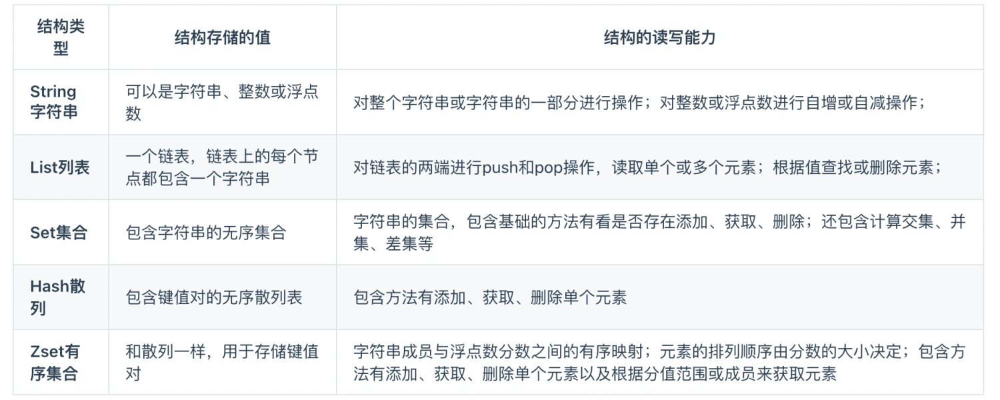
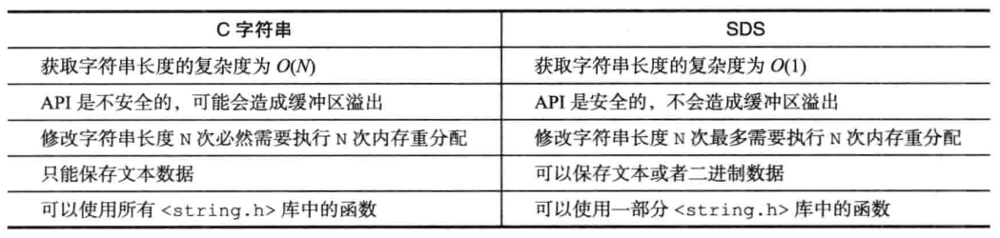
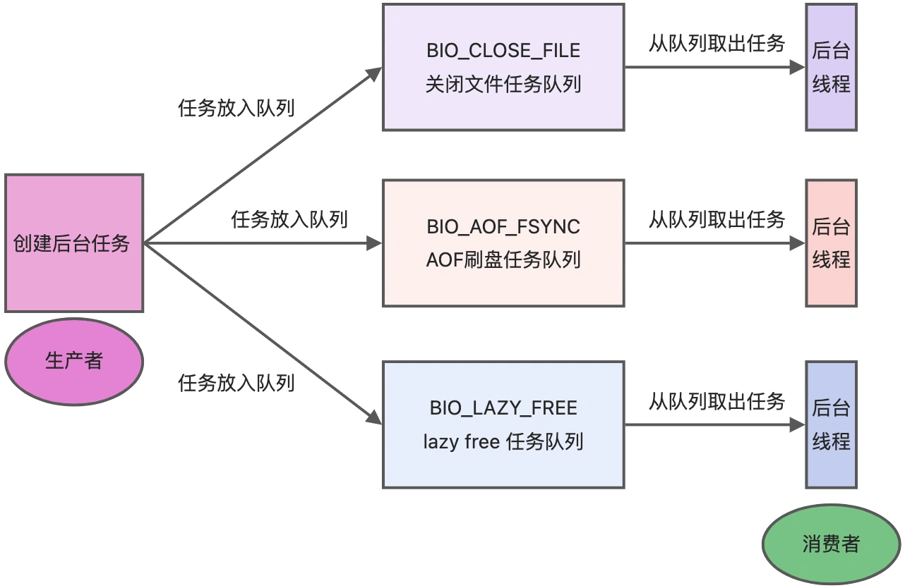

[toc]


# 一、面试篇


## 1、Redis常见面试题

### 认识Redis

#### 什么是Redis？

Redis是一种**基于内存**的数据库，对数据的读写操作都是在内存中完成的，因此**读写速度都非常快**，常用于**缓存、消息队列、分布式锁**等场景。

Redis提供的数据类型：**String(字符串)、Hash(哈希)、List(列表)、Set(集合)、ZSet(有序集合)**、Bitmaps(位图)、HyperLogLog(基数统计)、GEO(地理信息)、Stream(流)。

Redis对数据类型的操作都是**原子性**的，因为执行的命令由**单线程**负责，不存在并发问题。

Redis还支持**事务 、持久化、Lua脚本、多种集群方案（主从复制模式、哨兵模式、切片机群模式）、发布/订阅模式、内存淘汰机制、过期删除机制**等等。


#### Redis和Memcached有什么区别？

共同点：
* 都是基于内存的数据库，一般都用来当作缓存使用。
* 都有过期策略。
* 两者性能都非常高。

不同点：
* Redis支持的数据类型更加丰富（String、Hash、List、Set、ZSet）；而Memcached只支持最简单的key-value类型。
* Redis支持数据的持久化，可以将内存中的数据保持在磁盘中，重启的时候可以再次加载进行使用；Memcached没有持久化功能，数据全部存在内存之中，Memcached重启或者挂掉后，数据就没了。
* Redis原生支持集群模式；Memcached没有原生的集群模式，需要依靠客户端来实现往集群中分片写入数据。
* Redis支持发布订阅模型、Lua脚本、事务等功能；Memcached不支持。


#### 为什么用Redis作为MySQL的缓存？

1. Redis具备**高性能**。
    用户第一次访问MySQL中的数据时需要从磁盘上读取，比较低效。将MySQL中的数据缓存到Redis中，**下次再访问这些数据的时候就可以直接从Redis缓存中获取，相当于直接操作内存，速度相对较快**。
2. Redis具备**高并发**。
    单台设备的Redis的QPS（Query Per Second，每秒钟处理完请求的次数）是MySQL的10倍，Redis单机的QPS能轻松破10w，而MySQL单机的QPS很难破1w。所以，**直接访问Redis能够承受的请求是远远大于直接访问MySQL的**，所以我们可以考虑把数据库中的部分数据转移到缓存中去，这样用户的一部分请求会直接到缓存这里而不用经过数据库。


### Redis数据结构

#### Redis数据类型以及使用场景

Redis中最常见的五种数据类型：**String(字符串)、Hash(哈希)、List(列表)、Set(集合)、ZSet(有序集合)**。





Redis这五种数据类型的应用场景：
- String类型应用场景：缓存对象、常规计数、分布式锁、共享session信息等。
- List类型应用场景：消息队列（但是有两个问题：1、生产者需要自行实现全局唯一ID；2、不能以消费组形式消费数据）等。
- Hash类型应用场景：缓存对象、购物车等。
- Set类型应用场景：聚合计算（交集、并集、差集）场景，比如点赞、共同关注、抽奖活动等。
- ZSet类型应用场景：排序场景，比如排行榜、电话和姓名排序等。

随着Redis版本的更新，后面又支持了四种数据类型：BitMap（2.2版新增）、HyperLogLog（2.8版新增）、GEO（3.2版新增）、Stream（5.0版新增）。
- Bitmaps类型应用场景：二值状态统计的场景，比如签到、判断用户登陆状态、连续签到用户总数等。
- HyperLogLog类型应用场景：海量数据基数统计的场景，比如百万级网页UV计数等。
- GEO类型应用场景：存储地理位置信息的场景，比如滴滴叫车。
- Stream类型应用场景：消息队列，相比于基于List类型实现的消息队列，有这两个特有的特性：自动生成全局唯一消息ID，支持以消费组形式消费数据。


#### 五种常见的Redis数据类型的实现


##### 1、String类型的内部实现

String类型的底层的数据结构实现主要是**SDS**（Simple Dynamic String，简单动态字符串）。
```C++
struct sdshdr{
    //记录buf数组中已使用字节的数量
    //等于SDS所保存字符串的长度（不包括结尾的'\0'），未使用的部分不包括在其中
    int len;

    //记录buf数组中未使用的字节的数量
    int free;

    //字节数组，用于保存字符串
    char buf[];
};
```

**SDS相较于C字符串的优点**：
* **SDS获取字符串长度的时间复杂度是O(1)**。因为C语言的字符串并不记录自身长度，所以获取长度的复杂度为O(n)；而SDS结构里用len属性记录了字符串长度，所以复杂度为O(1)。
* **SDS不仅可以保存文本数据，还可以保存二进制数据**。因为SDS使用len属性的值而不是空字符来判断字符串是否结束，并且SDS的所有API都会以处理二进制的方式来处理SDS存放在buf[]数组里的数据。所以SDS不光能存放文本数据，而且能保存图片、音频、视频、压缩文件这样的二进制数据。
* **SDS API是安全的，拼接字符串不会造成缓冲区溢出**。因为SDS在拼接字符串之前会检查SDS空间是否满足要求，如果空间不够会自动扩容，所以不会导致缓冲区溢出的问题。
* **SDS能够减少修改字符串时带来的内存重分配次数**。因为C语言的字符串不记录自身的长度，每一次增长或者缩短一个C字符串都会导致内存重分配操作，故修改字符串长度N次**必然**需要执行N次内存重分配；而**SDS采用空间预分配和惰性空间释放策略**，使得修改字符串长度N次**最多**需要执行N次内存重分配。




**SDS的空间预分配策略**：
* 如果对SDS进行修改之后，SDS的长度（也即是len属性的值）将**小于1MB**，那么**程序分配和len属性同样大小的未使用空间**，这时SDS len属性的值将和free属性的值相同。  
    例如：如果进行修改之后，SDS的len将变成13字节，那么程序也会分配13字节的未使用空间，SDS的buf数组的实际长度将变成13+13+1=27字节，额外的一字节用于保存空字符。
* 如果对SDS进行修改之后，SDS的长度将**大于等于1MB**，那么程序会**分配1MB的未使用空间**。  
    如果进行修改之后，SDS的len将变成30MB，那么程序会分配1MB的未使用空间，SDS的buf数组的实际长度将为30MB + 1MB + 1byte。


##### 2、List类型的内部实现

List类型的底层数据结构是由**双向链表或压缩列表**实现的。  

* 如果列表的元素个数小于512个（默认值，可由`list-max-ziplist-entries`配置），列表每个元素的值都小于64字节（默认值，可由`list-max-ziplist-value`配置），Redis会使用压缩列表作为List类型的底层数据结构；
* 如果列表的元素不满足上面的条件，Redis会使用双向链表作为List类型的底层数据结构。
> 但是在Redis 3.2版本之后，List数据类型底层数据结构就只由quicklist实现了，替代了双向链表和压缩列表。

```C++
//链表节点
typedef struct listNode{
    //前置节点
    struct listNode *prev;

    //后置节点
    struct listNode *next;

    //节点的值
    void *value;
}listNode;


//链表
typedef struct list{
    //表头节点
    struct listNode *head;

    //表尾节点
    struct listNode *tail;

    //链表所包含的节点数量
    unsigned long len;
    
    //节点值赋值函数
    void *(*dup) (void *ptr);

    //节点值释放函数
    void *(*free) (void *ptr);

    //节点值对比函数
    int (*match) (void *ptr, void *key);
}list;
```


##### 3、Hash类型的内部实现

Hash类型的底层数据结构是由**压缩列表或哈希表**实现的。

* 如果哈希类型元素个数小于512个（默认值，可由`hash-max-ziplist-entries`配置），所有值小于64字节（默认值，可由`hash-max-ziplist-value`配置）的话，Redis会使用压缩列表作为Hash类型的底层数据结构；
* 如果哈希类型元素不满足上面条件，Redis会使用哈希表作为Hash类型的底层数据结构。
> 在Redis 7.0中，压缩列表数据结构已经废弃了，交由listpack数据结构来实现了。


##### 4、Set类型的内部实现

Set类型的底层数据结构是由**哈希表或整数集合**实现的。

* 如果集合中的元素都是整数且元素个数小于512（默认值，`set-maxintset-entries`配置）个，Redis会使用整数集合作为Set类型的底层数据结构；
* 如果集合中的元素不满足上面条件，则Redis使用哈希表作为Set类型的底层数据结构。


##### 5、ZSet类型的内部实现

Zset类型的底层数据结构是由**压缩列表或跳表**实现的。

* 如果有序集合的元素个数小于128个，并且每个元素的值小于64字节时，Redis会使用压缩列表作为Zset类型的底层数据结构；
* 如果有序集合的元素不满足上面的条件，Redis会使用跳表作为Zset类型的底层数据结构。
> 在Redis 7.0中，压缩列表数据结构已经废弃了，交由listpack数据结构来实现了。


### Redis线程模型

#### Redis是单线程吗？

Redis的**接受客户端请求->解析请求->进行数据读写等操作->发送数据给客户端**这一过程是单线程的。

Redis本身不是单线程的，Redis在启动是会启动后台线程：
* Redis在2.6版本，会启动2个后台线程，分别处理**关闭文件、AOF刷盘**这两个任务。  
* Redis在4.0版本之后，新增了一个新的后台线程，用来**异步释放Redis内存**，也就是lazyfree线程。  

Redis为**关闭文件、AOF刷盘、释放内存**这些任务创建后台单独的线程来处理，是因为这些操作比较耗时，由主线程处理容易发生阻塞。



关闭文件、AOF刷盘、释放内存这三个任务都有各自的任务队列：
* BIO_CLOSE_FILE，关闭文件任务队列：当队列有任务后，后台线程会调用`close(fd)`，将文件关闭。  
* BIO_AOF_FSYNC，AOF刷盘任务队列：当AOF日志配置成everysec选项后，主线程会把AOF写日志操作封装成一个任务，也放到队列中。当发现队列有任务后，后台线程会调用`fsync(fd)`，将AOF文件刷盘。  
* BIO_LAZY_FREE，lazy free任务队列：当队列有任务后，后台线程会调用`free(obj)`释放对象，或者调用`free(dict)`删除数据库所有对象，亦或者调用`free(skiplist)`释放跳表对象。


#### Redis单线程模式是怎样的？


#### Redis采用单线程为什么还这么快？

单线程的Redis吞吐量可以达到**10W/每秒**。

Redis采用单线程还很快的原因：
1. Redis的大部分操作都**在内存中完成，并且采用了高效的数据结构**，因此Redis瓶颈可能是机器的内存或者网络带宽，而并非CPU。  
2. Redis采用单线程模型可以**避免了多线程之间的竞争，省去了多线程切换带来的时间和性能上的开销**，而且也不会导致死锁问题。  
3. Redis采用了I/O多路复用机制处理大量的客户端Socket请求。  


#### Redis6.0之前为什么使用单线程？

* **CPU并不是制约Redis性能表现的瓶颈**，更多情况下是受到内存大小和网络I/O的限制，所以Redis核心网络模型使用单线程。  
* 使用了单线程后，可维护性高（多线程模型虽然在某些方面表现优异，但是它却引入了程序执行顺序的不确定性，带来了并发读写的一系列问题，**增加了系统复杂度、同时可能存在线程切换、甚至加锁解锁、死锁造成的性能损耗**）。

如果要使用服务的多核CPU，可以在一台服务器上**启动多个节点或者采用分片集群**的方式。


#### Redis6.0之后为什么使用引入了多线程？

在Redis 6.0版本之后，也采用了多个I/O线程来处理网络请求，这是因为随着网络硬件的性能提升，Redis的性能瓶颈有时会出现在网络I/O的处理上。所以为了提高网络I/O的并行度，Redis 6.0对于网络I/O采用多线程来处理。但是**对于命令的执行，Redis仍然使用单线程来处理**。  

Redis 6.0版本引入的多线程I/O特性对性能提升至少是一倍以上。  

默认情况下I/O多线程只针对发送响应数据（write client socket），并不会以多线程的方式处理读请求（read client socket）。要想开启多线程处理客户端读请求，就需要把Redis.conf配置文件中的io-threads-do-reads配置项设为yes。
```
//读请求也使用io多线程
io-threads-do-reads yes 
```
  
同时， Redis.conf 配置文件中提供了I/O多线程个数的配置项。io-threads默认是4。
```
// io-threads N，表示启用N-1个I/O多线程（主线程也算一个I/O线程）
io-threads 4 
```
  
因此， Redis 6.0版本之后，Redis在启动的时候，默认情况下会额外创建6个线程（加上主线程则为7个）：
* Redis-server：Redis的主线程，主要负责执行命令；
* bio_close_file、bio_aof_fsync、bio_lazy_free：三个后台线程，分别异步处理关闭文件任务、AOF刷盘任务、释放内存任务；
* io_thd_1、io_thd_2、io_thd_3：三个I/O线程，io-threads默认是4 ，所以会启动3（4-1）个I/O多线程，用来分担Redis网络I/O的压力。


### Redis持久化

#### Redis如何实现数据不丢失？

Redis有三种持久化机制：
1. AOF日志：每执行一条写操作命令，就把该命令以追加的方式写入到一个文件里。  
2. RDB快照：将某一时刻的内存数据，以二进制的方式写入磁盘。  
3. 混合持久化方式：Redis 4.0 新增的方式，集成了 AOF 和 RBD 的优点。  


#### AOF日志是如何实现的？

Redis在执行完一条写操作命令后，就会把该命令以追加的方式写入到一个文件里，然后Redis重启时，会读取该文件记录的命令，然后逐一执行命令的方式来进行数据恢复。


Reids是先执行写操作命令后，才将该命令记录到AOF日志里的。
* 优点：
    * **避免额外的检查开销**：因为如果先将写操作命令记录到AOF日志里，再执行该命令的话，如果当前的命令语法有问题，那么如果不进行命令语法检查，该错误的命令记录到AOF日志里后，Redis在使用日志恢复数据时，就可能会出错。
    * **不会阻塞当前写操作命令的执行**：因为当写操作命令执行成功后，才会将命令记录到AOF日志。
* 缺点：
    * **数据可能会丢失**：执行写操作命令和记录日志是两个过程，那当Redis在还没来得及将命令写入到硬盘时，服务器发生宕机了，这个数据就会有丢失的风险。
    * **可能阻塞其他操作**：由于写操作命令执行成功后才记录到AOF日志，所以不会阻塞当前命令的执行，但因为**AOF日志也是在主线程中执行**，所以当Redis把日志文件写入磁盘的时候，还是会阻塞后续的操作无法执行。

**写AOF日志的流程**：
1. Redis执行完写操作命令后，会将命令追加到server.aof_buf缓冲区；
2. 然后通过`write()`系统调用，将aof_buf缓冲区的数据写入到AOF文件，此时数据并没有写入到硬盘，而是拷贝到了内核缓冲区page cache，等待内核将数据写入硬盘；
3. 具体内核缓冲区的数据什么时候写入到硬盘，由内核决定。


在Redis.conf配置文件中的appendfsync配置项中，提供了3种AOF写回（刷盘）策略的参数：
1. Always：每次写操作命令执行完后，同步将AOF日志数据写回硬盘。
2. Everysec：每次写操作命令执行完后，先将命令写入到AOF文件的内核缓冲区，然后每隔一秒将缓冲区里的内容写回到硬盘。
3. No：不由Redis控制写回硬盘的时机，转交给操作系统控制写回的时机。  
  

随着执行的写操作命令越来越多，AOF日志文件的大小会越来越大，那么就会带来性能问题（重启Redis后，需要读AOF文件的内容以恢复数据，由于文件过大，整个恢复的过程就会很慢）。Redis为了避免AOF文件越写越大，提供了**AOF重写机制**，当AOF文件的大小超过所设定的阈值后，Redis就会启用AOF重写机制，来压缩AOF文件。  

**AOF重写机制**：在重写时，读取当前数据库中的所有键值对，然后将每一个键值对用一条命令记录到「新的AOF文件」，等到全部记录完后，就将新的AOF文件替换掉现有的AOF文件。


Redis的重写AOF过程是由后台**子进程**bgrewriteaof来完成的，使用子进程的优点：
* 子线程进行AOF重写期间，主线程可以继续处理命令请求，不会被阻塞。
* 子进程带有主进程的数据副本，这里使用子进程而不是线程，因为如果是使用线程，多线程之间会共享内存，那么在修改共享内存数据的时候，需要通过加锁来保证数据的安全，而这样就会降低性能。而使用子进程，创建子进程时，父子进程是共享内存数据的，不过这个共享的内存只能以只读的方式，而当父子进程任意一方修改了该共享内存，就会发生「写时复制」，于是父子进程就有了独立的数据副本，就不用加锁来保证数据安全。  

子进程重写AOF日志的过程中，主进程依然能够正常处理命令。如果主进程修改了某个kv，那么就会发生写时复制，导致主进程和子进程的数据不一致。为了解决这一问题，Redis设置了一个**AOF重写缓冲区**，这个缓冲区在创建bgrewriteaof子进程之后开始使用。在重写AOF期间，当Redis执行完一个写命令之后，它会同时将这个写命令写入到AOF缓冲区和AOF重写缓冲区。


在AOF重写期间，主进程执行以下三个工作：
1. 执行客户端发来的命令。
2. 将执行后的写命令追加到AOF缓冲区。
3. 将执行后的写命令追加到AOF重写缓冲区。

当子进程完成了AOF重写后，会向主进程发送一个信号，主进程收到信号后调用信号处理函数，完成以下任务：
1. 将AOF重写缓冲区中的所有内容追加到新的AOF的文件中，使得新旧两个AOF文件所保存的数据库状态一致。
2. 新的AOF的文件进行改名，覆盖现有的AOF文件。


#### RDB快照是如何实现的呢？

AOF日志记录的是操作命令，不是实际的数据，所以用AOF方法做故障恢复时，需要全量把日志都执行一遍，一旦AOF日志非常多，会造成Redis的恢复操作缓慢。

为了解决这个问题，Redis增加了RDB快照。RDB快照就是记录某一个瞬间的内存数据，记录的是实际数据，而AOF文件记录的是命令操作的日志，而不是实际的数据。因此在Redis恢复数据时，RDB恢复数据的效率会比AOF高些，因为直接将RDB文件读入内存就可以，不需要像AOF那样还需要额外执行操作命令的步骤才能恢复数据。  

Redis提供了两个命令来生成RDB文件，分别是`save`和`bgsave`，他们的区别就在于**是否在主线程里执行**：
* save命令会在主线程生成RDB文件，由于和执行操作命令在同一个线程，如果写入RDB文件的时间太长，**会阻塞主线程**。
* bgsave命令，会创建一个子进程来生成RDB文件，这样可以**避免主线程的阻塞**。

