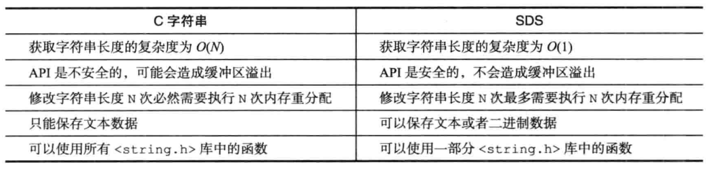

[toc]

# 一、简单动态字符串

Redis没有直接使用C语言传统的字符串表示（以空字符结尾的字符数组），而是自己构建了一种名为简单动态字符串（Simple Dynamic String，SDS）的抽象类型，并将SDS用作Redis的默认字符串表示。

在Redis里面，C字符串只会作为字符串字面量用在一些无须对字符串值进行修改的地方，比如打印日志。

当Redis需要的不仅仅是一个字符串字面量，而是一个可以被修改的字符串值时，Redis就会使用SDS来表示字符串值，比如在Redis的数据库里面，包含字符串值的键值对在底层都是由SDS实现的。

SDS的应用：
* 保存数据库中的字符串。
* 被用作缓冲区：AOF模块中的AOF缓冲区，以及客户端状态中的输入缓冲区。


## 1、SDS的定义

```C++
struct sdshdr {
    //记录buf数组中已使用字节的数量
    //等于SDS所保存字符串的长度（不包括结尾的'\0'），未使用的部分不包括在其中
    int len;

    //记录buf数组中未使用的字节的数量
    int free;

    //字节数组，用于保存字符串
    char buf[];
};
```


## 2、SDS与C字符串的区别

**SDS相较于C字符串的优点**：
* **SDS获取字符串长度的时间复杂度是O(1)**。因为C语言的字符串并不记录自身长度，所以获取长度的复杂度为O(n)；而SDS结构里用len属性记录了字符串长度，所以复杂度为O(1)。
* **SDS不仅可以保存文本数据，还可以保存二进制数据**。因为SDS使用len属性的值而不是空字符来判断字符串是否结束，并且SDS的所有API都会以处理二进制的方式来处理SDS存放在buf[]数组里的数据。所以SDS不光能存放文本数据，而且能保存图片、音频、视频、压缩文件这样的二进制数据。
* **SDS API是安全的，拼接字符串不会造成缓冲区溢出**。因为SDS在拼接字符串之前会检查SDS空间是否满足要求，如果空间不够会自动扩容，所以不会导致缓冲区溢出的问题。
* **SDS能够减少修改字符串时带来的内存重分配次数**。因为C语言的字符串不记录自身的长度，每一次增长或者缩短一个C字符串都会导致内存重分配操作，故修改字符串长度N次**必然**需要执行N次内存重分配；而SDS采用空间与分配和惰性空间释放策略，使得修改字符串长度N次**最多**需要执行N次内存重分配。


1. 常数复杂度获取字符串的长度。
2. 杜绝缓冲区溢出。
3. 减少修改字符串时带来的内存重分配次数。
4. 二进制安全。
5. 兼容部分C字符串函数。




**SDS的空间预分配策略**：
* 如果对SDS进行修改之后，SDS的长度（也即是len属性的值）将**小于1MB**，那么**程序分配和len属性同样大小的未使用空间**，这时SDS len属性的值将和free属性的值相同。  
    例如：如果进行修改之后，SDS的len将变成13字节，那么程序也会分配13字节的未使用空间，SDS的buf数组的实际长度将变成13+13+1=27字节，额外的一字节用于保存空字符。
* 如果对SDS进行修改之后，SDS的长度将**大于等于1MB**，那么程序会**分配1MB的未使用空间**。  
    如果进行修改之后，SDS的len将变成30MB，那么程序会分配1MB的未使用空间，SDS的buf数组的实际长度将为30MB + 1MB + 1byte。


**SDS的惰性删除策略**：
惰性空间释放用于优化SDS的字符串缩短操作：当SDS的API需要缩短SDS保存的字符串时，程序并不立即使用内存重分配来回收缩短后多出来的字节，而是**使用free属性将这些字节的数量记录起来，并等待将来使用**。  
通过惰性空间释放策略，SDS避免了缩短字符串时所需的内存重分配操作，并为将来可能有的增长操作提供了优化。


# 二、链表

链表提供了高效的节点重排能力，以及顺序性的节点访问方式，并且可以通过增删节点来灵活地调整链表的长度。

列表键（List类型）的底层实现之一就是链表。当满足以下条件之一时，Redis会使用链表作为列表键的底层实现：
* 列表键包含了数量比较多的元素时；
* 列表中包含的元素都是比较长的字符串时。

链表的应用：
* 作为列表键的底层实现之一；
* 发布与订阅、慢查询、监视器等功能也用到了链表；
* Redis服务器本身使用链表来保存多个客户端的状态信息；
* Redis服务器本身使用链表来构建客户端输出缓冲区。


## 1、链表和链表节点的实现

```C++
//链表节点
typedef struct listNode {
    //前置节点
    struct listNode *prev;

    //后置节点
    struct listNode *next;

    //节点的值
    void *value;
} listNode;


//链表
typedef struct list {
    //表头节点
    struct listNode *head;

    //表尾节点
    struct listNode *tail;

    //链表所包含的节点数量
    unsigned long len;
    
    //节点值赋值函数
    void *(*dup) (void *ptr);

    //节点值释放函数
    void *(*free) (void *ptr);

    //节点值对比函数
    int (*match) (void *ptr, void *key);
} list;
```


Redis的链表实现的特性：
* 双端：链表节点带有prev和next指针，获取某个节点的前置节点和后置节点的复杂度都是O(1)。
* 无环：表头节点的prev指针和表尾节点的next指针都指向NULL，对链表的访问以NULL为终点。
* 带表头指针和表尾指针：通过list结构的head指针和tail指针，程序获取链表的表头节点和表尾节点的复杂度为O(1)。
* 带链表长度计数器：程序使用list结构的len属性来对list持有的链表节点进行计数，程序获取链表中节点数量的复杂度为O(1)。
* 多态：链表节点使用void*指针来保存节点值，并且可以通过list结构的du
p、free、match三个属性为节点值设置类型特定函数，所以链表可以用于保存各种不同类型的值。


# 三、字典

字典，也称为符号表、关联数组或映射，是一种用于保存键值对的抽象数据结构。在字典中一个键可以和一个值进行关联。

字典中的每一个键值对都是独一无二的，可以再字典中根据键查找或更新与之关联的值，或者根据键值删除整个键值对。

哈希键（Hash类型）的底层实现之一就是字典。当满足以下条件之一时，Redis会使用字典作为哈希键的底层实现：
* 哈希键包含的键值对比较多时；
* 键值对中的元素都是比较长的字符串时。

字典的应用：
* 作为哈希键的底层实现之一；
* 作为Redis数据库的底层实现，对数据库的增删查改操作也是建立在对字典的操作之上。


## 1、字典的实现

**哈希表**：
```C++
typedef struct dictht{
    //哈希表数组
    dictEntry **table; //指向数组的指针，数组的元素类型为dictEntry*

    //哈希表大小
    unsigned long size;

    //哈希表大小掩码，用于计算索引值
    //总是等于size-1
    //和哈希值一起决定一个键应该被放到table数组的哪个索引上面
    unsigned long sizemask;

    //该哈希表已有的节点数量
    unsigned long used;
};
```

**哈希表结点**：
```C++
typedef struct dictEntry {
    //键
    void *key;

    //值
    //值可以是一个指针，或者是一个uint64_t整数，又或者是一个int64_t整数
    union {
        void *val;
        uint64_t u64;
        int64_t s64
    } v;

    //指向下个哈希表节点，形成链表
    //将多个哈希值相同的键值对连接在一起，解决键冲突的问题
    struct dictEntry *next;
} dictEntry;
```

**字典**：
```C++
typedef struct dict {
    //类型特定函数
    dictType *type

    //私有数据
    void *privdata;

    //哈希表
    dictht ht[2];

    //rehash索引
    //当没有rehash在进行时，值为-1
    int trehashidx;

} dict;
```
type属性和privdata属性是**针对不同类型的键值对，为创建多态字典而设置的**：
- type属性是一个指向dictType结构的指针，每个dictType结构保存了一簇用于操作特定类型键值对的函数，Redis会为用途不同的字典设置不同的类型特定函数。
- privdata属性则保存了需要传给那些类型特定函数的可选参数。
    ```C++
    typedef struct dictType {
        //计算哈希值的函数
        unsigned int (*hashfunction) (const void *key);

        //复制键的函数
        void *(*keyDup) (void *privdata, const void *key);

        //复制值的函数
        void *(*valDup) (void *privdata, const void *obj);

        //对比键的函数
        int (*keyCompare) (void *privdata, const void *key1, const void *key2);

        //销毁键的函数
        void *(*keyDestructor) (void *privdata, const void *key);

        //销毁值的函数
        void *(*valDestructor) (void *privdata, const void *obj);

    } dictType;
    ```

ht属性是一个包含两个项的数组，数组中的每个项都是一个dictht哈希表，一般情况下，字典只使用ht[0]哈希表，**ht[1]哈希表只会在对ht[0]哈希表进行rehash时使用**。  
除了ht[1]之外，另一个和rehash有关的属性就是rehashidx，它记录了rehash目前的进度，如果目前没有在进行rehash，那么它的值为-1。


## 2、哈希算法

当要将一个新的键值对添加到字典里面时，程序需要先根据键值对的键计算出哈希值和索引值，然后再根据索引值，将包含新键值对的哈希表节点放到哈希表数组的指定索引上面。  
> Redis计算哈希值和索引值的方法如下：
> #使用字典设置的哈希函数，计算key的哈希值
> hash = dict->type->hashFunction(key);
> 
> #使用哈希表的sizemask属性和哈希值，计算出索引值
> #根据情况不同，ht[x]可以是ht[0]或者ht[1]
> index = hash & dict->ht[x].sizemask;

Redis使用MurmurHash2算法来计算键的哈希值。MurmurHash算法的优点在于即使输入的键是有规律的，算法仍然能给出一个很好的随机分布性，并且计算速度也非常快。


## 3、解决哈希冲突

Redis的哈希表使用链地址法来解决键冲突。每个哈希表节点都有一个next指针，多个哈希表节点可以用next指针构成一个单向链表，被分配到同一个索引上的多个节点可以用这个单向链表链接起来，这就解决了键冲突的问题。

由于dictEntry节点组成的链表没有指向链表尾部的指针，所以为了速度考虑，程序总是**将新节点添加到链表的表头位置**（复杂度为O(1)），排在其他已有节点的前面。


## 4、Rehash

为了让哈希表的负载因子位置在一个合理的范围内，当哈希表保存的键值对数量太多或者太少时，程序需要对哈希表的大小进行相应的扩展或者收缩（通过rehash操作完成）。

Redis对字典的哈希表执行rehash的步骤：
1. 为字典的ht[1]哈希表分配空间。
    - 如果执行扩展操作，那么ht[1]的大小为第一个大于等于ht[0].used*2的2^n。
    - 如果执行收缩操作，那么ht[1]的大小为第一个大于等于ht[0].used的2^n。
2. 将保存在ht[0]中的所有键值对rehash到ht[1]上（重新计算键的哈希值和索引值，然后将键值对放置到ht[1]哈希表指定的位置上）。
3. 当ht[0]包含的所有键值对都迁移到了ht[1]之后，释放ht[0]，将ht[1]设置为ht[0]，并在ht[1]新创建一个空白哈希表，为下一次rehash做准备。


程序自动开始对哈希表执行扩展操作的条件：
* 服务器目前没有在执行BGSAVE命令或者BGREWRITEAOF命令，并且哈希表的负载因子大于等于1。
* 服务器目前正在执行BGSAVE命令或者BGREWRITEAOF命令，并且哈希表的负载因子大于等于5。  
其中，负载因子`load_factor = ht[0].used / ht[0].size;`  

根据BGSAVE命令或BGREWRITEAOF命令是否正在执行，服务器执行扩展操作所需的负载因子并不相同，这是因为在执行BGSAVE命令或BGREWRIEAOF命令的过程中，Redis需要创建当前服务器进程的子进程，而大多数操作系统都采用写时复制（copy-on-write）技术来优化子进程的使用效率，所以在子迸程存在期同，服务器会提高执行扩展操作所需的负载因子，从而**尽可能地避免在子进程存在期间进行哈希表扩展操作，这可以避免不必要的内存写人操作，最大限度地节约内存**。

当哈希表的负载因子小于0.1时，程序自动开始对哈希表执行收缩操作。


## 5、渐进式rehash

rehash过程中需要将ht[0]中的键值对迁移到ht[1]中，当ht[0]中存在海量键值对时，如果对键值对一次性、集中式地进行迁移的话，**庞大的计算量会导致服务器在一段时间内停止服务**。因此，为了避免rehash对服务器性能造成影响，服务器不是一次性将ht[0]里面的所有键值对全部rehash到ht[1]，而是**分多次、渐进式**地将ht[0]里面的键值对慢慢地rehash到ht[1]。

哈希表渐进式哈希的步骤：
1. 为ht[1]分配空间，让字典同时持有ht[0]和ht[1]两个哈希表。
2. 在字典中维持一个索引计数器变量rehashidx，并将它的值设置为0，表示rehash工作正式开始。
3. 在rehash进行期间，每次对字典执行添加、删除、查找或者更新操作时，程序除了执行指定的操作以外，还会顺带将ht[0]哈希表在rehashidx索引上的所有键值对rehash到ht[1]，当rehash工作完成之后，程序将rehashidx的值增一。
4. 随着字典操作的不断执行，最终在某个时间点上，ht[0]的所有键值对都会被rehash至ht[1]，这时程序将rehashidx属性的值设为-1，表示rehash操作已完成。

渐进式rehash的优点：采取分而治之的方法，将rehash键值对所需的计算工作均摊到对字典的每个添加、删除、查找和更新操作上，从而避免了集中式rehash带来的庞大计算量。

渐进式rehash执行期间的哈希表操作：
因为在进行渐进式rehash的过程中，字典会同时使用ht[0]和ht[1]两个哈希表，所以在渐进式rehash进行期间，字典的删除、查找、更新等操作会在两个哈希表上进行。
* 要在字典里面查找一个键的话，程序会先在ht[0]里面进行查找，如果没找到的话，就会继续到ht[1]里面进行查找，诸如此类。
* 在渐进式rehash执行期间，新添加到字典的键值对一律会被保存到ht[1]里面，而ht[0]则不再进行任何添加操作，这一措施保证了ht[0]包含的键值对数量会只减不增，并随着rehash操作的执行而最终变成空表。


# 四、跳跃表

跳跃表（skiplist）是一种**有序数据结构**，它通过在每个节点中维持多个指向其他节点的指针，从而达到快速访问节点的目的。跳跃表支持平均O(logN)、最坏O(N)复杂度的节点查找，还可以通过顺序性操作来批量处理节点。大部分情况下跳跃表的效率何以平衡树相媲美，且跳跃表的实现比平衡树更加简单。

Redis的有序集合（ZSet类型）的底层实现之一就是跳跃表。当满足以下条件时，Redis会使用跳跃表作为有序集合的底层实现：
* 一个有序集合包含的元素数量比较多时；
* 有序集合中元素的成员是比较长的字符串时。

跳跃表的应用：
* 作为有序集合的底层实现之一；
* 在集群节点中用作内部数据结构。


## 1、跳跃表的实现


