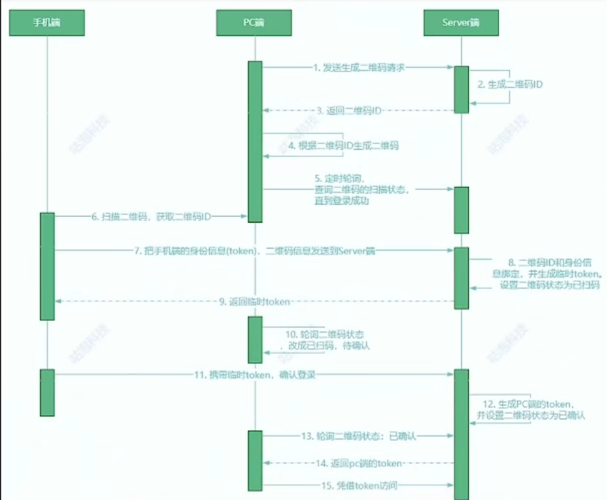

[toc]

# 二维码扫码登录流程的理解

二维码最常用的场景之一就是通过手机端应用扫描PC或者WEB端的二维码，来登录同一个系统。比如手机微信扫码登录PC端微信，手机淘宝扫码登录PC端淘宝。

# 二维码登录的本质

扫码登录的本质也是一种登录认证方式，一般登录认证我们需要做两件事：  
1. 告诉系统我是谁  
2. 证明系统我是谁  

比如账号密码的登录过程，账号就是告诉系统我是谁的操作，密码就是向系统证明我是谁，比如手机验证码登录，手机号就是告诉系统我是谁，验证码就是证明系统我是谁。

这两件事的具体实现过程是什么样的呢？
一般情况下，只有当我们使用的应用下载下来后，第一次登录的时候，才需要进行一个账号密码的登录，那之后我们都不用再使用账号密码登录，它可以自动登录，或者通过手机验证码就可以登录。

# 系统认证机制

这种登录的原理是怎么实现的呢？其实也是基于token的认证机制：
1. 账号密码登录时，客户端会将设备信息[账号、密码、设备信息]一起传递给服务端；
2. 如果账号密码校验通过，服务端会把账号与设备进行一个绑定，存在服务端的数据结构中，这个数据结构中包含了客户端输入的账号ID、设备ID、设备类型等；然后服务端会生成一个token,用它来映射数据结构，这个token其实就是一串有着特殊意义的字符串，它的意义就在于，通过它可以找到对应的账号与设备信息；
3. 客户端得到这个token后，需要进行一个本地保存，每次访问系统API都携带着这个token与设备信息；
4. 服务端就可以通过客户端携带的token找到与它绑定的账号与设备信息，然后把绑定的设备信息与客户端每次传来的设备信息进行比较，如果相同，那么校验通过，返回api接口响应数据，否则校验不通过拒绝访问。

# 扫描二维码登录的具体步骤

1. 扫码前，手机端应用应该是已登录状态，PC端显示一个二维码，等待扫描；
2. 手机端打开应用，扫描PC端的二维码，扫描后会提示已扫描，请在手机端确认；
3. 用户在手机端点击确认，确认后PC端登录就成功了。
    二维码有3个状态：待扫描、已扫描待确认、已确认。

# 二维码准备

1. PC端向服务端发起请求，告诉服务端，我要生成用户登录的二维码，并且把PC端设备信息也传递给服务端；
2. 服务端收到PC端的请求后，它生成二维码ID，并将二维码ID与PC端设备信息进行绑定；
3. 然后把二维码ID返回给PC端；
4. PC端收到二维码ID后，生成二维码，这个二维码中肯定包含了二维码ID；
5. 为了及时知道二维码的状态，客户端在展示二维码后，PC端不断的轮询服务端比如每隔一秒就轮询一次，请求服务端告诉当前二维码的状态及相关信息。

以上步骤是PC端请求服务端，二维码已生成，此时二维码是待扫描状态；以下是手机扫描二维码步骤：  
1. 用户用手机去扫描PC端的二维码，通过二维码内容获取到其中的二维码ID；
2. 再调用服务端API将移动端的身份信息与二维码ID一起发送给服务端；
3. 服务端接收到后，它可以将身份信息与二维码ID进行绑定，生成临时token，然后返回给手机端；
4. 因为PC端一直在轮询二维码状态所以这时候二维码状态发生了改变，它就可以在界面上把二维码状态更新为已扫描待确认阶段。
    > 这里服务端给手机返回临时token的作用是：相当于一个身份凭证，为的是手机端在下一步操作时，可以用它作为凭证，以此确保扫码和登录两步操作是同一个手机端发出；

以上步骤完后，二维码状态是已扫描待确定状态，接下来是二维码的状态确认阶段：
1. 手机端在接收到临时token后会弹出确认登录界面，用户点击确认时，手机端携带临时token用来调用服务端的接口，告诉服务端，我已确认；
2. 服务端收到确认后，根据二维码ID绑定的设备信息与账号信息，生成用户PC端登录的token；
3. 这时候PC端的轮询接口，它就可以得知二维码的状态已经变成了“已确认”，并且从服务端可以获取到用户登录的token；
4. 然后，登录成功，后端PC端就可以用token去访问服务端的资源了。

[二维码扫码登录的原理](https://juejin.cn/post/7052617301333393438)

[二维码扫码登录是什么原理](https://juejin.cn/post/6940976355097985032)

[二维码扫描登录原理](https://blog.csdn.net/Erica_1230/article/details/129571476)