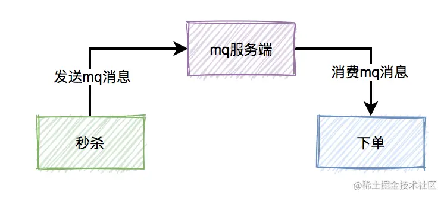
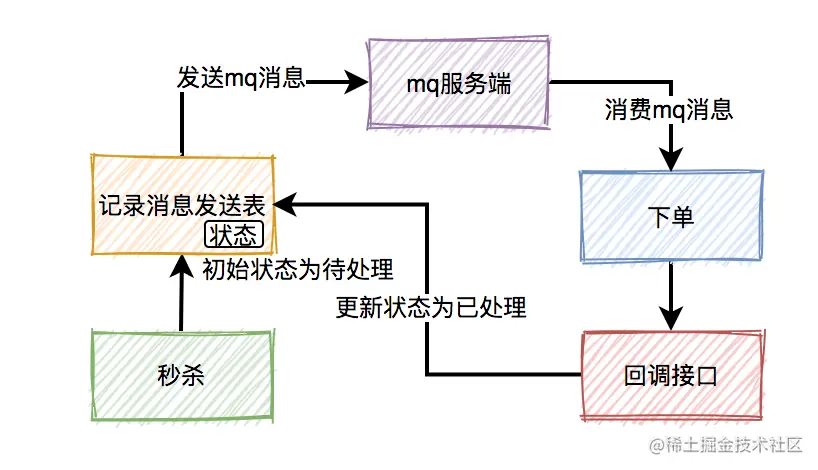
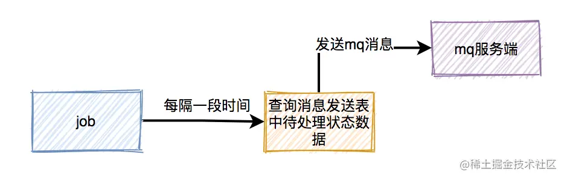
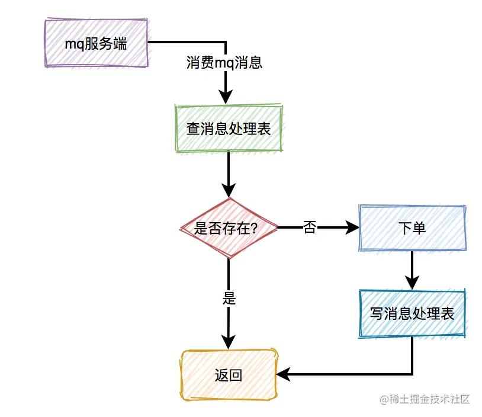
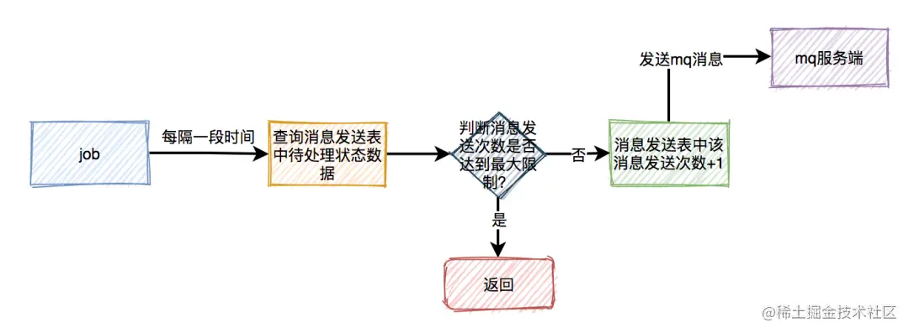
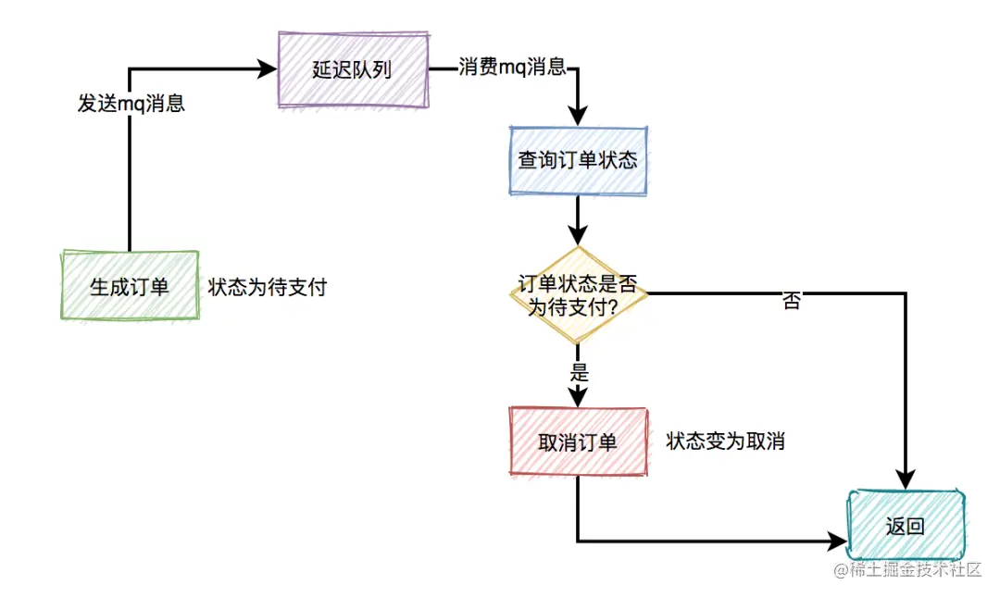

[toc]

# 一、秒杀系统的问题

## 1、高并发

秒杀开始前不久涌入大量用户，结束后用户流量立刻减少。

时间极短，瞬时用户量极大。不能导致系统崩溃（OOM、数据库失效等）。

## 2、超卖问题

不能存量100的货物最终卖出去200个。

## 3、恶意请求

防止重复的请求，刷单的请求，恶意的请求

## 4、链接暴露

用户可以通过浏览器的开发者模式查看秒杀链接（通过在秒杀开始前对按钮灰化，禁止点击），开发者也可以通过查看源代码获取秒杀链接。需要避免连接暴露导致的提前秒杀。

## 5、数据库

秒杀每秒的请求数（QPS）极大，直接对数据库请求可能导致数据库崩溃。需要避免数据库因为大量请求二崩溃，以及影响到秒杀之外的其他业务。

# 二、前端所做的处理

## 1、资源静态化

活动页面绝大多数内容是固定的，比如：商品名称、商品描述、图片等。

为了减少不必要的服务端请求，通常情况下，会对活动页面做静态化处理。**用户浏览商品等常规操作，并不会请求到服务端**。只有到了秒杀时间点，并且用户主动点了秒杀按钮才允许访问服务端。

将静态资源放入**CDN服务器**（内容分发网络）中，使用户就近获取所需内容，降低网络拥塞，提高用户访问响应速度和命中率。

## 2、秒杀链接加盐

方案一：对于请求，加时间验证，判断是否是在秒杀开始后的请求。
    问题：提前获取URL能够通过程序不断获取时间，可以达到毫秒级别，一到时间就发送多次秒杀请求。

方案二：**URL动态化**，通过时间和hash算法或者md5算法等摘要算法加密随机的字符串去做URL，然后通过前端代码获取URL后台校验才能通过。

## 3、限流

秒杀活动开始前灰化点击按钮；秒杀活动开始后，用户点击了一次之后的一段时间内按钮灰化。

# 三、Nginx

Nginx是一个占用内存小，并发能力强的高性能http反向代理服务器，使用Nginx可以增大并发能力。

# 四、风控

防止机器人账号或者购买的账号，通过风控团队（大数据分析）对请求秒杀的账户进行数据分析处理，如果这个用户是真实用户的概率没有其他用户概率大，那就认为他是机器了，丢弃他的请求。

# 五、后端所做的处理

## 1、服务单一职责

秒杀业务单独一个服务，单独建立数据库，避免影响到其他的业务。

## 2、Redis集群

## 3、库存预热

提前把商品的库存加载到Redis中，避免用户请求直接访问数据库，导致数据库崩溃。

多个并发请求查询到Redis中的缓存库存只有1个，于是都进行减库存操作，那么就会导致超卖，因此还需要添加分布式锁。

# 六、消息队列异步处理请求

秒杀场景中，有三个核心流程：秒杀、下单、支付。这三个核心流程中，真正并发量大的是秒杀功能，下单和支付功能实际并发量很小。所以，我们在设计秒杀系统时，有必要把下单和支付功能从秒杀的主流程中拆分出来，特别是下单功能要做成消息队列异步处理的。

对于下单，可能有很多流程：验证库存，扣除库存，生成订单，发送通知等。为了减少主流程减轻负担，可以将发送通知着一些的动作放到消息队列当中。

消息队列是只的是在应用中传递数据，消息可能有多种类型，消息队列是一种在应用之间传递消息的通信方式，消息发送后立即返回，消息发布者只管将消息放到消息队列中，而不管谁去取。而消息使用者就会不管这个消息是谁发送的，而只管着去取用数据。

使用消息队列后，秒杀后下单的流程变成如下：

## 1、消息丢失问题

秒杀成功了，往mq发送下单消息的时候，有可能会失败。原因有很多，比如：网络问题、broker挂了、mq服务端磁盘问题等。这些情况都可能会造成消息丢失。

为了防止消息丢失，需要添加一张**消息发送表**。

在生产者发送MQ消息之前，先把该条消息写入消息发送表，初始状态是待处理，然后再发送MQ消息。消费者消费消息时，处理完业务逻辑之后，再回调生产者的一个接口，修改消息状态为已处理。

如果生产者把消息写入消息发送表之后，再发送MQ消息到MQ服务端的过程中失败了，造成了消息丢失。这时候，需要使用job，**增加重试机制**。用job每隔一段时间去查询消息发送表中状态为待处理的数据，然后重新发送MQ消息。

## 2、重复消费问题

消费者消费消息时，在ack应答的时候，如果网络超时，本身就可能会消费重复的消息。但由于消息发送者增加了重试机制，会导致消费者重复消息的概率增大。

为了解决重复消息问题，需要加一张**消息处理表**。

消费者读到消息之后，先判断一下消息处理表，是否存在该消息，如果存在，表示是重复消费，则直接返回。如果不存在，则进行下单操作，接着将该消息写入消息处理表中，再返回。注意：下单和写消息处理表，要放在同一个事务中，保证原子操作。

## 3、垃圾消息问题

如果出现了消息消费失败的情况。比如：由于某些原因，消息消费者下单一直失败，一直不能回调状态变更接口，这样job会不停的重试发消息。最后，会产生大量的垃圾消息。

为了解决来及消息的问题，需要在每次在job重试时，需要先判断一下消息发送表中该消息的发送次数是否达到最大限制，如果达到了，则直接返回。如果没有达到，则将次数加1，然后发送消息。这样如果出现异常，只会产生少量的垃圾消息，不会影响到正常的业务。

## 4、延迟消费问题

通常情况下，如果用户秒杀成功了，下单之后，在15分钟之内还未完成支付的话，该订单会被自动取消，回退库存。

为了实现延迟消费，需要使用延迟队列（例如rocketmq，自带了延迟队列的功能）。

下单时消息生产者会先生成订单，此时状态为待支付，然后会向延迟队列中发一条消息。达到了延迟时间，消息消费者读取消息之后，会查询该订单的状态是否为待支付。如果是待支付状态，则会更新订单状态为取消状态。如果不是待支付状态，说明该订单已经支付过了，则直接返回。此外，用户完成支付之后，会修改订单状态为已支付。

# 七、限流

## 1、对同一用户限流

为了防止某个用户，请求接口次数过于频繁，可以只针对该用户做限制。

使用一个计数器记录**同一个用户请求**的次数，每次请求则将计数器+1，当到达了某个阈值后，再来自该用户的请求就会失败。

## 2、对同一ip限流

对于某个用户限流还远远不够，可以模拟多个用户的请求，这种就无法通过对用以用户限流进行识别了。这就需要对IP进行限流了。

使用一个计数器记录**同一个IP请求**的次数，每次请求则将计数器+1，当到达了某个阈值后，再来自该IP的请求就会失败。

这种限流方式可能会有误杀的情况，比如同一个公司或网吧的出口ip是相同的，如果里面有多个正常用户同时发起请求，有些用户可能会被限制住。

## 3、对接口限流

单纯对用户和IP限流也还不够，可以使用代理，每个请求都更换一个IP。这是就可以限制请求的接口的次数。

使用一个计数器记录**同一个接口URL请求**的次数，每次请求则将计数器+1，当到达了某个阈值后，再来自该接口URL的请求就会失败。

在高并发场景下，这种限制对于系统的稳定性是非常有必要的。但可能由于有些非法请求次数太多，达到了该接口的请求上限，而影响其他的正常用户访问该接口。

## 4、加验证码

相对于上面三种方式，加验证码的方式可能更精准一些，同样能限制用户的访问频次，好处是不会存在误杀的情况，但是会影响用户体验。

用户在请求之前，需要先输入验证码。用户发起请求之后，服务端会去校验该验证码是否正确。只有正确才允许进行下一步操作，否则直接返回，并且提示验证码错误。验证码一般是一次性的，同一个验证码只允许使用一次，不允许重复使用。

* 普通验证码，由于生成的数字或者图案比较简单，可能会被破解。优点是生成速度比较快，缺点是有安全隐患。
* 移动滑块验证码，它生成速度比较慢，但比较安全。

## 5、提高业务门槛

* 将集中请求分散开，降低用户的并发量（分时段秒杀）
* 提高参与门槛（会员才能参与）