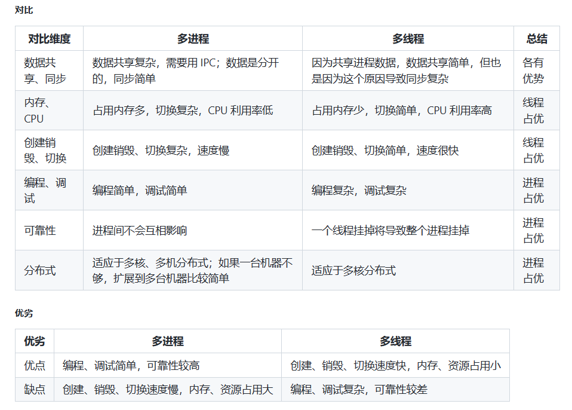
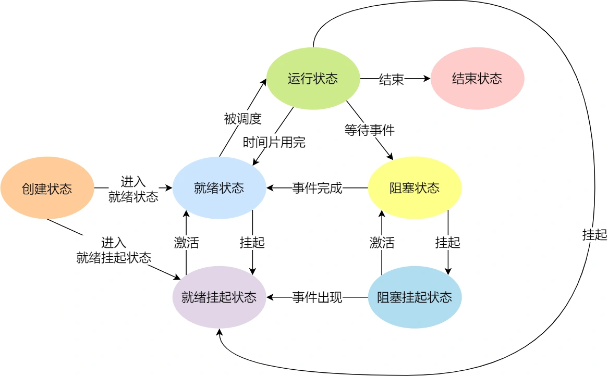

[toc]

# 1、进程、线程、协程的区别和联系


# 2、进程和线程的区别

* 进程是系统分配资源的基本单位；线程是CPU调度的基本单位。
* 进程有自己独立的地址空间；进程内的线程共享进程的地址空间。
* 线程依赖于进程存在，一个进程至少拥有一个线程，且主线程和进程相互依赖。
* 进程是拥有系统资源的独立单位（拥有CPU资源、内存资源、文件资源等）；线程独占栈、程序计数器、一组寄存器等资源，和其他线程共享进程资源（内存、文件、CPU等资源）。
* 进程切换时，需要保存当前CPU环境以及设置新进程的CPU环境；线程切换只需要保存和设置少量的寄存器内容，不涉及存储器管理方面的操作。
* 进程之间通信需要使用IPC方法；线程之间共享进程资源，无需进行通信，但需要对共享的进程资源进行同步。
* 一个进程的崩溃不会导致另一个进程的崩溃；一个线程的崩毁会导致整个进程崩溃（发出信号杀掉进程）。


同一进程中的线程所共享的资源：进程的的代码区、进程的数据区、进程的堆、进程的打开文件描述符、进程的当前目录、信号处理函数、进程ID和进程组ID

同一进程中的线程所独占的资源：线程ID、栈、程序计数器、一组寄存器、错误返回码、信号掩码/信号屏蔽字


# 3、一个进程可以创建多少线程，和什么有关？

* 对于32位操作系统，进程的虚拟内存空间为4G，其中高地址的1G分给内核空间，低地址的3G为用户空间。使用`ulimit -a`命令查看到进程创建线程时默认分配的栈空间大小为8192KB，那么就是差不多能创建300个(3G/8M)左右的线程。
* 对于64为操作系统，用户态空间和内核空间都是128T，分别占用内存空间的最低和最高地址，中间的部分是未定义部分，理论上创建的线程数不会受限制，但是会收到内核参数的限制：
    - `/proc/sys/kernel/threads-max`，表示系统支持的最大线程数，默认值是14553；
    - `/proc/sys/kernel/pid_max`，表示系统全局的PID号数值的限制，每一个进程或线程都有ID，ID的值超过这个数，进程或线程就会创建失败，默认值是32768；
    - `/proc/sys/vm/max_map_count`，表示限制一个进程可以拥有的VMA(虚拟内存区域)的数量，具体什么意思我也没搞清楚，反正如果它的值很小，也会导致创建线程失败，默认值是65530。

综上所述，**一个进程可以创建的线程数，与进程的虚拟内存空间大小、系统参数限制有关**。

注意：过多的线程将会导致大量的时间浪费在线程切换上，给程序运行效率带来负面影响，无用线程要及时销毁。


# 4、外中断和异常有什么区别？

外中断：由处理器外部硬件产生，不是执行某条指令的结果，也无法预测发生的时机。由于中断独立于当前执行的程序，所以中断是异步事件。中断包括I/O设备发出的I/O中断、定时器发出的时钟中断、调试程序中设置断点引起的调试中断等。

异常：是一种错误情况，是CPU执行当前指令的结果，可能被错误处理程序修正，也可能直接终止程序。异常是同步事件，因为是指由于执行当前指令而产生的错误情况。异常包括除法异常、缺页异常、地址越界、算术溢出等。


# 5、进程线程模型你知道多少？

多线程：
在一个文件内的多个函数通常都是按照main函数中出现的顺序来执行，但是在分时系统下，我们可以让每个函数都作为一个逻辑流并发执行，最简单的方式就是采用多线程策略。在main函数中调用多线程接口创建线程，每个线程对应特定的函数（操作），这样就可以不按照main函数中各个函数出现的顺序来执行，避免了忙等的情况。

引入线程的好处：
- 将顺序执行的程序逻辑拆分为几个独立的逻辑流，这些逻辑流可以独立完成一些任务。
- 作为处理机调度的最小单位，线程调度只需要保存线程栈、寄存器数据和程序计数器即可，相比进程切换开销要小很多。

线程基本操作的接口：参考(./APUE/11-线程/11-线程.md)


多进程：
每一个进程是资源分配的基本单位。进程结构由以下几个部分组成：代码段、堆栈段、数据段。在父进程创建子进程之后，父、子进程除了pid外，几乎所有的部分几乎一样。子进程在读写数据时会通过写时复制机制将父进程的数据重新拷贝一份，之后在拷贝出的数据上进行操作。如果子进程想要运行自己的代码段，可以通过调用exec族函数重新加载新的代码段。

Linux进程控制：
* 进程地址空间：Linux进程的地址空间底部是保留给用户程序的，包括文本、数据、堆、栈等，其中文本区和数据区是通过存储器映射方式将磁盘中可执行文件的相应段映射至虚拟存储器地址空间中。
* 进程控制块（PCB）：进程的调度实际就是内核选择相应的进程控制块，被选择的进程控制块中包含了一个进程基本的信息。
* 上下文切换：内核管理所有进程控制块，而进程控制块记录了进程全部状态信息。每一次进程调度就是一次上下文切换，所谓的上下文本质上就是当前运行状态，主要包括通用寄存器、浮点寄存器、状态寄存器、程序计数器、用户栈和内核数据结构（页表、进程表、文件表）等。进程执行时刻，内核可以决定抢占当前进程并开始新的进程，这个过程由内核调度器完成，当调度器选择了某个进程时称为该进程被调度，该过程通过上下文切换来改变当前状态。一次完整的上下文切换通常是进程原先运行于用户态，之后因系统调用或时间片到切换到内核态执行内核指令，完成上下文切换后回到用户态，此时已经切换到进程B。




[多线程与多进程](https://blog.csdn.net/lishenglong666/article/details/8557215)


# 6、进程调度算法你了解多少？

1. 先来先服务（FCFS）：按照请求的顺序进行调度。
    非抢占式调度算法，开销小，无饥饿问题，响应时间不确定。有利于长进程而不利于短进程，不利于I/O密集型进程。
2. 短作业优先（SJF）：按照估计运行时间最短的顺序进行调度。
    非抢占式调度算法，吞吐量高，开销可能较大，对短进程提供好的响应式时间，可能导致饥饿问题（一直有短进程到来，导致长进程一直无法被调度）。
3. 最短剩余时间优先：按照剩余时间的顺序进行调度。
    短作业优先的抢占式版本（如果有新的作业到来且需要运行的时间小于当前运行进程的剩余时间，则会发生抢占），吞吐量高，开销可能较大，提供好的响应时间，可能导致饥饿，对长进程不利。
4. 时间片轮转：将所有的进程按照先来先服务的顺序排列成一个队列，每次调度时为队首进程分配一个时间片，当时间片用完后触发时钟中断，操作系统将该进程排到队列的最后面，同时将又时间片分给当前队首的进程。
    抢占式调度算法（时间片用完时发生抢占），开销小，无饥饿问题，为短进程提供良好的响应时间。
    时间片轮转算法的效率和时间片的大小有关：若时间片太小，进程切换频繁，在上下文切换上耗时过多，吞吐量低；如时间片太大，实时性得不到保证，极限情况退化成FCFS。
5. 优先级调度：为每个进程分配一个优先级，按照优先级进行调度。为了防止低优先级的进程永远等不到调度，可以随着时间的推移增加等待进程的优先级。
6. 最高响应比优先：选择就绪队列中响应比最高的进程（响应比 = 1+等待时间/响应时间）。同时考虑了等待时间的长短和预计需要执行的时间长短，平衡了长短进程。
    非抢占式调度算法，吞吐量高，开销可能较大，提供好的响应时间，无饥饿问题。
7. 多级反馈队列：设置多个就绪队列，优先级递减，时间片递增，只有等到更高的对量为空时才会调度当前队列中的进程，如果进程用完了当前队列中的时间片还未执行完，则会被移动到下一级的队列。
    抢占式调度算法，开销可能较大，对I/O密集型进程有利（CPU密集型进程的优先级下降得块，I/O密集型进程停留在高优先级队列），可能出现饥饿问题（如果有过多I/O密集型进程，就会不断占用CPU，导致优先级低的队列中的进程一直无法被调度）。


# 7、Linux下进程间通信方式？

* 匿名管道：一种半双工通信方式，数据只能单向流动，如果要进行双向通信则需要建立两个匿名管道，它只能在具有亲缘关系的进程之间使用，通信数据都遵循先进先出原则，管道实际使用的是内核中的缓存，需要进行用户态和内核态之间的数据拷贝。
    优点：简单方便
    缺点：局限于单向通行；只能创建在具有亲缘关系的进程之间；缓冲区有限
* 命名管道：一种半双工通信方式，数据只能单向流动，如果要进行双向通信则需要建立两个命名管道，它允许在无亲缘关系的进程之间进行通信，通信数据都遵循先进先出原则，和匿名管道一样，也会存在用户态和内核态之间的数据拷贝。
    优点：可实现任意进程之间的通信
    缺点：长期存在与系统中，使用不当易出错；缓冲区有限
* 消息队列：是消息的链表，存放在内核中并由消息队列标识符标识。
    优点：可以进行任意进程之间的通信；读进程可以根据消息类型有选择性地读取消息；通过系统调用函数实现消息发送和接收之间的同步，无需考虑同步问题；克服了信号传递信息少、管道只能承载无格式字节流及缓冲区受限等缺点
    缺点：每个消息体具有最大长度限制，无法进行大数据的传输；通信过程中存在用户态与内核态之间的数据拷贝。
* 共享内存：映射一段能被其他进程所访问的内存，这段共享内存由一个进程创建，但多个进程都可以访问。
    优点：无需进行数据的拷贝，是最快的进程间通信方式
    缺点：存在进程间读写操作的同步问题；不方便进行网络通信
* 信号：用于通知接收进程某个事件已经发生。信号是进程间通信机制中唯一的异步通信机制。
* 信号量：是一个计数器，可以用来控制多个进程对共享资源的访问。主要用于实现进程间的互斥与同步，而不是用于缓存进程间通信的数据。信号量初始为1，实现互斥；信号量初始为0，实现同步。
* 套接字：适用于不同机器之间的进程通信，在本地也可以作为两个进程之间的通信方式。


# 8、Linux下同步机制？

信号量：可以用于进程同步，也可用于线程同步。
互斥锁+条件变量：只能用于线程同步。


# 9、如果系统中具有快表后，那么地址的转换过程变成什么样了？

1. CPU给出逻辑地址，由某个硬件计算得出页号、页内偏移量，将页号和快表（TLB）中的所有页号进行对比。
2. 如果在快表中找到了匹配的页号，则说明要访问的页表项在快表中存在副本，则直接从快表中取出该页对应的内存块号，再将内存块号和页内偏移量计算得到物理地址，访问该物理地址对应的物理内存。因此，如果快表命中，则只需要一次访存即可访问到某个逻辑地址。
3. 如果在快表中没有找到匹配的页号，则需要访问内存中的页表，找到对应的页表项，得到页面存放的内存块号，再将内存块号和页内偏移量计算得到物理地址，然后访问该物理地址对应的物理内存，同时将该页表项放入快表中，以便后续再次访问（如果快表已满则按照规定的算法进行替换）。因此，如果快表未命中，则需要两次访存才能访问到某个逻辑地址。

由于**查询快表的速度比查询页表的速度快很多**，因此只要快表命中，就可以节省很多时间。 因为局部性原理，–般来说快表的命中率可以达到90%以上。


# 10、内存交换和覆盖有什么区别？

覆盖：依据程序的逻辑结构，将程序划分为对各相对独立的模块，不会同时执行的程序将共享同一块内存。
   - 只能发生在没有调用关系的模块间
   - 程序员必须给出模块间的覆盖结构
   - 发生在同一程序/进程的内部模块间

内存交换：将暂时不运行的程序交换到外存中。
   - 以进程为单位，发生在进程之间
   - 不需要模块间的逻辑覆盖结构


# 11、动态分区分配算法有哪几种？

* 首次适应算法：每次都从低地址开始查找，找到**第一个**能满足大小的空闲分区。
    - 实现：空闲分区以地址递增的次序排列，每次分配内存时**顺序查找**空闲分区链（或空闲分区表），找到大小能满足要求的第一块空闲分区。
    - 优点：简单；在高地址处又大块的空闲分区
    - 缺点：外部碎片；分配大块时较慢
* 最佳适应算法：为了保证当“大进程”到来时能有连续的大片空间，可以尽可能多地留下大片的空闲区，即优先使用更小的空闲区（分配n字节时使用不小于n的**最小**的空闲分区）。
    - 实现：空闲分区按容量递增次序链接，每次分配内存时顺序查找空闲分区链(或空闲分区表)，找到大小能满足要求的第一个空闲分区。
    - 优点：可以避免大的空闲分区被拆分；可以减小外部碎片的大小
    - 缺点：容易产生很多无用的小碎片
* 最坏适应算法：为了解决最佳适应算法留下太多难以利用的小碎片的问题，可以在每次分配时优先使用最大的连续空闲区（分配n字节时使用不小于n的**最大**的空闲分区），这样分配后剩余的空闲区就不会太小，更方便使用。
    - 实现：空闲分区按容量递减次序链接。每次分配内存时顺序查找空闲分区链(或空闲分区表)，找到大小能满足要求的第一个空闲分区。
    - 优点：中等大小内存分配较多时效果好；避免出现太多的小碎片
    - 缺点：容易破坏大的空闲分区。导致后续难以分配大内存；外部碎片
* 临近适应算法：首次适应算法每次都从链头开始查找的。这可能会导致低地址部分出现很多小的空闲分区，而每次分配查找时，都要经过这些分区，因此也增加了查找的开销。如果每次都从上次查找结束的位置开始检索，就能解决上述问题。
    - 实现：空闲分区以地址递增的顺序排列(可排成一个循环链表)。每次分配内存时**从上次查找结束的位置开始查找**空闲分区链(或空闲分区表)，找到大小能满足要求的第一个空闲分区。


# 12、虚拟技术你了解吗？

虚拟技术**把一个物理实体转换为多个逻辑实体**。

主要有两种虚拟技术：时（时间）分复用技术和空（空间）分复用技术。

多进程与多线程：多个进程能在同一个处理器上并发执行使用了时分复用技术，让每个进程轮流占用处理器，每次只执行一小个时间片并快速切换。

虚拟内存使用了空分复用技术，它将物理内存抽象为地址空间，每个进程都有各自的地址空间，地址空间的页被映射到物理内存，地址空间的页并不需要全部在物理内存中，当使用到一个没有在物理内存的页时，执行页面置换算法，将该页置换到内存中。


# 13、进程状态的切换你知道多少？

* 创建状态：进程正在被创建时的状态；
* 就绪状态：由于其他进程处于运行状态而暂时停止运行，一旦被CPU调度就能立马运行；
* 运行状态：进程占用CPU；
* 阻塞状态：该进程正在等待某一事件发生（如等待输入/输出操作的完成）而暂时停止运行，这时，即使给它CPU控制权，它也无法运行；
* 结束状态：进程正在从系统中消失时的状态；


注意：
- 只有就绪态和运行态可以相互转换，其它的都是单向转换。就绪状态的进程通过调度算法从而获得 CPU 时间，转为运行状态；而运行状态的进程，在分配给它的 CPU 时间片用完之后就会转为就绪状态，等待下一次调度。
- 阻塞状态是缺少需要的资源从而由运行状态转换而来，但是该资源不包括 CPU 时间，缺少 CPU 时间会从运行态转换为就绪态。




# 14、一个程序从开始运行到结束的完整过程，你能说出来多少？

答案一：
1. 创建一个具有独立虚拟地址空间的进程。
2. 检查可执行文件格式的有效性。
3. 设置动态链接器的路径。
4. 读取而可执行文件的文件头，建立虚拟空间和可执行文件之间的映射。
5. 初始化进程环境，将CPU的指令寄存器设置为可执行文件的入口地址，启动运行。


答案二：
1. 操作系统在创建进程后，把控制权交到程序的入口，这个入口往往是运行库中的某个入口函数
2. 入口函数对运行库和程序运行环境进行初始化，包括堆、I/O、线程、全局变量的构造
3. 入口函数在完成初始化后，调用main函数，正式开始执行程序主体部分
4. main函数执行完毕后，返回到入口函数，入口函数进行清理工作，包括全局变量析构、堆销毁、关闭I/O等，然后系统调用结束进程


# 15、通过例子讲解逻辑地址转换为物理地址的基本过程

1. 根据逻辑地址计算页号和页内偏移量(页号=逻辑地址/页面大小，页内偏移量=逻辑地址%页面大小)。判断页号是否越界，如果是则触发异常。
2. 先在快表中查询是否存在对应页号，如果存在则直接取出页号对应的物理内存块号；如果不存在，则进入内存中页表中查询对应的页号，取出对应的物理内存块号，同时将该页号对应的页表项放入快表中。
3. 根据获取的物理内存块号和页内偏移地址，计算实际的物理地址（物理地址=物理内存块号*页面大小+页内偏移量）。

注意：通常会在系统中设置一个页表寄存器(PTR)，存放页表在内存中的起始地址F和页表长度M。进程未执行时，页表的始址和页表长度放在进程控制块(PCB) 中，当进程被调度时，操作系统内核会把它们放到页表寄存器中。


# 16、进程同步的四种方法？

* 临界区：进程中对临界资源进行访问而需要互斥执行的那段代码叫做临界区。
    ```
    entry section //进入区，检查可否进入临界区的一段代码，如可进入则设置正在访问临界区标志
    critical section //临界区：访问临界资源
    exit section //退出区：清除正在访问临界区标志
    remainder section //剩余区：代码中的其余部分
    ```
    临界区访问规则：空闲则入、忙则等待、有限等待、让权等待
* 信号量：一个整型变量，可以对其P和V操作。
    P操作：将sem减1，相减后，如果sem<0，则进程/线程进入阻塞等待，否则继续，表明P操作可能会阻塞。
    V操作：将sem加1，相加后，如果sem<=0，唤醒一个等待中的进程/线程，表明V操作不会阻塞。
    P和V操作需要被设计成原语，不可分割，通常的做法是在执行这些操作的时候屏蔽中断。
    如果信号量的取值只能为0或者1，那么就成为了互斥量，0表示临界区已经加锁，1表示临界区解锁。
* 管程：管程将共享变量以及对这些共享变量的操作封装起来，形成一个具有一定接口的功能模块，这样只能通过管程提供的某个过程才能访问管程中的资源。进程只能互斥地使用管程，使用完之后必须释放管程并唤醒入口等待队列中的进程。


# 17、操作系统在对内存进行管理的时候需要做些什么?

* 操作系统负责内存空间的分配与回收。
* 操作系统需要提供某种技术从逻辑上对内存空间进行扩充。
* 操作系统需要提供地址转换功能，负责程序的逻辑地址与物理地址的转换。
* 操作系统需要提供内存保护功能。保证各进程在各自存储空间内运行，互不干扰。


# 18、进程通信方法（Linux和windows下），线程通信方法（Linux和windows下）

进程通信方法：
* 管道(pipe)：允许一个进程和另一个与它有共同祖先的进程之间进行通信。
* 命名管道(FIFO)：类似于管道，但是它可以用于任何两个进程之间的通信，命名管道在文件系统中有对应的文件名。命名管道通过命令mkfifo或系统调用mkfifo来创建。
* 消息队列(MQ)：消息队列是消息的连接表，包括POSIX消息对和System V消息队列。有足够权限的进程可以向队列中添加消息，被赋予读权限的进程则可以读走队列中的消息。消息队列克服了信号承载信息量少，管道只能成该无格式字节流以及缓冲区大小受限等缺点。
* 信号量(semaphore)：信号量主要作为进程间以及同进程不同线程之间的同步手段。
* 共享内存(shared memory)：它使得**多个进程可以访问同一块内存空间**，**是最快的可用IPC形式**。这是针对其他通信机制运行效率较低而设计的。它往往与其他通信机制，如信号量结合使用，以达到进程间的同步及互斥。
* 信号(signal)：信号是比较复杂的通信方式，用于通知接收进程有某种事情发生，除了用于进程间通信外，进程还可以发送信号给进程本身。
* 内存映射(mapped memory)：内存映射允许任何多个进程间通信，每一个使用该机制的进程通过**把一个共享的文件映射到自己的进程地址空间**来实现它
* Socket：它是更为通用的进程间通信机制，可用于不同机器之间的进程间通信。


线程通信方法：
* 信号：类似进程间的信号处理
* 锁机制：互斥锁、读写锁和自旋锁
* 条件变量：使用通知的方式解锁，与互斥锁配合使用
* 信号量：包括无名线程信号量和命名线程信号量


# 19、进程间通信有哪几种方式？

goto 7


# 20、虚拟内存的目的是什么？

虚拟内存的目的是为了**让物理内存扩充成更大的逻辑内存，从而让程序获得更多的可用内存**。

操作系统将内存抽象为地址空间。每个进程都拥有自己的地址空间，这个地址空间被分成大小相等的页，这些页被映射到物理内存；不需要映射到来连续的物理内存，也不需要所有的页都在物理内存中，当程序引用到不在物理内存中的页时，由操作系统将缺失的部分装入物理内存，然后再重新执行失败的指令。这样，对于程序来说，逻辑上似乎有很大的内存空间，只是实际上有一部分是存储在磁盘上，因此叫做虚拟内存。


# 21、说一下你理解中的内存？他有什么作用呢？

内存是用于存放数据的硬件。程序执行前需要先放入内存中才能被CPU处理。

我们的程序和数据都是存储在内存，存储的区域是线性的。

内存的地址是从0开始编号的，然后自增排列，最后一个地址为内存总字节数-1，这种结构好似我们程序里的数组，所以内存的读写任何一个数据的速度都是一样的。


# 22、操作系统经典问题之哲学家进餐问题

五个哲学家围着一张圆桌，每个哲学家面前放着食物。哲学家的生活有两种交替活动：吃饭以及思考。当一个哲学家吃饭时，需要先拿起自己左右两边的两根筷子，并且一次只能拿起一根筷子。

如果所有哲学家同时拿起左手边的筷子，那么所有哲学家都在等待其它哲学家吃完并释放自己手中的筷子，导致死锁。

为了防止死锁的发生，可以设置两个条件：
* 必须同时拿起左右两根筷子；
* 只有在两个邻居都没有进餐的情况下才允许进餐。


# 23、操作系统经典问题之读者-写者问题

允许多个进程同时对数据进行读操作，但是不允许读和写以及写和写操作同时发生。

一个整型变量 count 记录在对数据进行读操作的进程数量，一个互斥量 count_mutex 用于对 count 加锁，一个互斥量 data_mutex 用于对读写的数据加锁。
```C++
typedef int semaphore;
semaphore count_mutex = 1;
semaphore data_mutex = 1;
int count = 0;

void reader() {
    while(TRUE) {
        down(&count_mutex);
        count++;
        if(count == 1) down(&data_mutex); // 第一个读者需要对数据进行加锁，防止写进程访问
        up(&count_mutex);
        read();
        down(&count_mutex);
        count--;
        if(count == 0) up(&data_mutex);//最后一个读者要对数据进行解锁，防止写进程无法访问
        up(&count_mutex);
    }
}

void writer() {
    while(TRUE) {
        down(&data_mutex);
        write();
        up(&data_mutex);
    }
}
```


# 24、介绍一下几种典型的锁？

读写锁：
- 多个读者可以同时读；
- 写者互斥（只允许一个写者写，有写者写时不允许读者读，读者读时不允许写者写）。
- 读写锁在读多写少的场景，能发挥出优势。

读写锁类型：
- 读优先锁：读锁能被更多的线程持有，以便提高读线程的并发性。当线程先持有了读锁，后续的线程获取写锁时会被阻塞，但是获取读锁的线程依然可以获取读锁，直到所有读锁释放后阻塞的获取写锁的线程才能成功获取写锁。如果一直有要获取读锁的线程，那么写线程将永远获取不到写锁，造成了写线程饥饿。
- 写优先锁：优先服务写线程。当读线程先持有了读锁，写线程在获取写锁的时候，会被阻塞，并且在阻塞过程中，后续来的读线程获取读锁时会失败而被阻塞，只要读线程释放读锁后，写线程就可以成功获取写锁。如果一直有写线程获取写锁，读线程也会被饿死。
- 公平读写锁：用队列把获取锁的线程排队，不管是写线程还是读线程都按照先进先出的原则加锁即可，这样读线程仍然可以并发，也不会出现饥饿的现象。


互斥锁：
* 一次只能一个线程拥有互斥锁，其他线程只有等待。互斥锁加锁失败后，线程会释放 CPU ，给其他线程。
* 对于互斥锁加锁失败而阻塞的现象，是由操作系统内核实现的，内核帮我们切换线程，从而造成了两次上下文切换成本（内核将无法获取互斥锁的线程从运行状态切换至休眠状态，唤醒时又从休眠状态切换至运行状态）。
* 如果被锁住的代码执行时间很短，就不应该用互斥锁，而应该选用自旋锁。


条件变量：
互斥锁一个明显的缺点是他只有两种状态：锁定和非锁定。而条件变量通过允许线程阻塞和等待另一个线程发送信号的方法弥补了互斥锁的不足，他常和互斥锁一起使用，以免出现竞态条件。**当条件不满足时，线程往往解开相应的互斥锁并阻塞线程然后等待条件发生变化。一旦其他的某个线程改变了条件变量，他将通知相应的条件变量唤醒一个或多个正被此条件变量阻塞的线程。**总的来说互斥锁是线程间互斥的机制，条件变量则是同步机制。


自旋锁：
* 自旋锁是通过 CPU 提供的 CAS 函数（Compare And Swap），在「用户态」完成加锁和解锁操作，不会主动产生线程上下文切换，所以相比互斥锁来说，会快一些，开销也小一些（自旋锁加锁失败后，线程会忙等待，直到它拿到锁）。
* 自旋锁开销少，在多核系统下一般不会主动产生线程切换，适合异步、协程等在用户态切换请求的编程方式，但如果被锁住的代码执行时间过长，自旋的线程会长时间占用 CPU 资源，故自旋锁一般应用于加锁时间很短的场景，这个时候效率比较高。


# 25、逻辑地址和物理地址

逻辑地址指的是在进程的地址空间中的地址，是CPU所分配的虚拟地址。
物理地址指的是实际存放在硬件中的空间地址，是实际地址。


# 26、怎么回收线程？有哪几种方法？

如果某个信号的默认动作是终止进程，那么，将这个信号发送到线程会终止整个进程。

单个线程的退出方式：
1. 线程只是从启动例程中返回，返回值是线程的退出码。
2. 线程被同一进程中的其他线程取消。
3. 线程主动调用`pthread_exit()`函数。

线程的回收方式：
1. 使用`pthread_join()`函数，主线程调用，等待子线程退出并回收其资源，类似于进程中wait/waitpid回收僵尸进程，调用pthread_join的线程会被阻塞。
2. 使用`pthread_detach()`函数，主线程、子线程均可调用。主线程中pthread_detach(tid)，子线程中pthread_detach(pthread_self())，调用后和主线程分离，子线程结束时自己立即回收资源。


# 27、内存的覆盖是什么？有什么特点？

内存覆盖的目的：在较小的内存中运行较大的程序。

方法：依照程序的逻辑结构，将程序划分为功能相对独立的模块，不会同时执行的模块将共享同一块内存（覆盖区）。

由于程序运行时并非任何时候都要访问程序及数据的各个部分（尤其是大程序），因此可以把用户空间分成为一个固定区和若干个覆盖区。将经常活跃的部分放在固定区，其余部分按照调用关系分段，首先将那些即将要访问的段放入覆盖区，其他段放在外存中，在需要调用前，系统将其调入覆盖区，替换覆盖区中原有的段。

覆盖技术的特点：是打破了必须将一个进程的全部信息装入内存后才能运行的限制，但当同时运行程序的代码量大于主存时仍不能运行，而且内存中能够更新的地方只有覆盖区的段，不在覆盖区的段会常驻内存。

- 只能发生在没有调用关系的模块间
- 程序员必须给出模块间的覆盖结构
- 发生在同一程序/进程的内部模块间


# 28、内存交换是什么？有什么特点？

内存交换的目的：增加正在运行或者需要运行的程序的内存。

实现方法：将暂时不运行的程序交换到外存中。

换入换出的基本单位是整个进程的地址空间。换出是把一个进程的整个地址空间换到外存，换入是把外存中某个进程的地址空间读入到内存。

- 以进程为单位，发生在进程之间
- 不需要模块间的逻辑覆盖结构


# 29、什么时候会进行内存的交换？

内存交换通常在许多进程运行且内存吃紧时进行，而系统负荷降低就暂停。例如:在发现许多进程运行时经常发生缺页，就说明内存紧张，此时可以换出一些进程;如果缺页率明显下降，就可以暂停换出。


# 30、终端退出，终端运行的进程会怎样？

终端退出时，会发送SIGHUP信号给对应的bash进程，bash进程收到SIGHUP信号后，将这个信号发送给当前会话中的进程，如果进程未定义信号处理函数，则默认关闭。


# 31、如何让进程后台运行

* 命令后面加上&即可，实际上，这样是将命令放入到一个作业队列中了
* ctrl + z 挂起进程，使用jobs查看序号，在使用bg %序号后台运行进程.
* nohup + &，将标准输出和标准错误缺省会被重定向到nohup.out文件中，忽略所有挂断（SIGHUP）信号。
* 运行指令前面 + setsid，使其父进程编程init进程，不受HUP信号的影响。
* 将 命令+ &放在()括号中，也可以是进程不受HUP信号的影响。


# 32、什么是快表，你知道多少关于快表的知识？

多级页表虽然解决了空间上的问题，但是虚拟地址到物理地址的转换就多了几道转换的工序，这显然就降低了这俩地址转换的速度，也就是带来了时间上的开销。程序是有局部性的，即在一段时间内，整个程序的执行仅限于程序中的某一部分。相应地，执行所访问的存储空间也局限于某个内存区域。我们就可以利用这一特性，把最常访问的几个页表项存储到访问速度更快的硬件，于是计算机科学家们，就在 CPU 芯片中，加入了一个专门存放程序最常访问的页表项的 Cache，这个 Cache 就是 TLB（Translation Lookaside Buffer） ，通常称为页表缓存、转址旁路缓存、快表等。


快表，又称联想寄存器(TLB) ，是一种访问速度比内存快很多的高速缓冲存储器，用来存放当前访问的若干页表项，以加速地址变换的过程。与此对应，内存中的页表常称为慢表。

goto 9


# 33、地址变换中，有快表和没快表，有什么区别？

没有快表：先根据逻辑地址计算页号和页内偏移量，验证页号是否越界，然后访问页表，找到对应的内存块号，再根据内存块号和页内偏移量计算逻辑地址。（需要两次访存）

有快表：在计算出页号和页内偏移量且验证页号合法性后，先在快表中查找是否存在对应的页号，如果存在则直接计算逻辑地址，如果不存在，则再访问页表查找页号，找到对应的内存块号，计算逻辑地址，并把这个页表项放入快表中。（如果快表命中，则只需一次访存，未命中则需要两次）。


# 34、在执行malloc申请内存的时候，操作系统是怎么做的？

malloc实际是使用brk()和mmap()两个系统调用来申请内存的。

当要申请的内存大小大于128kb时，使用mmap()系统调用在文件映射区分配一块内存。free时直接将该内存释放，归还给操作系统。

当要申请的额内存大小小于128kb时，使用brk()系统调用，将堆顶指针向高地址移动，从而获得内存。free时不会立即将该内存归还给操作系统，而是将其并入空闲块链表中，以便后续使用。

malloc申请的都是虚拟内存，实际第一次访问的时候会引发缺页中断，然后将操作系统再将对应的物理内存和虚拟内存之间建立映射。

mmap频繁调用会导致运行态的转换，还会发生缺页中断。brk则可以在内存池中直接去除空闲内存块，而且可能虚拟地址和物理地址的映射还存在，减少了系统调用和缺页中断的次数。但是brk会导致外部碎片问题。


# 35、 守护进程、僵尸进程和孤儿进程

守护进程：守护进程（daemon）是生存期长的一种进程。它们常常**在系统引导装入时启动，仅在系统关闭时才终止**。因为它们没有控制终端，所以说它们是在**后台运行**的。

创建守护进程：
1. **让程序在后台执行**。方法是调用fork()产生一个子进程，然后使父进程退出。
2. **调用setsid()创建一个新会话**。控制终端、登录会话和进程组通常是从父进程继承下来的，守护进程要摆脱它们，不受它们的影响，方法是调用setsid()使进程成为一个会话组长。setsid()调用成功后，进程成为新的会话组长和进程组长，并与原来的登录会话、进程组和控制终端脱离。
3. **禁止进程重新打开控制终端**。经过以上步骤，进程已经成为一个无终端的会话组长，但是它可以重新申请打开一个终端。为了避免这种情况发生，可以通过使进程不再是会话组长来实现。再一次通过fork()创建新的子进程，使调用fork的进程退出。
4. **关闭不再需要的文件描述符**。子进程从父进程继承打开的文件描述符。如不关闭，将会浪费系统资源，造成进程所在的文件系统无法卸下以及引起无法预料的错误。首先获得最高文件描述符值，然后用一个循环程序，关闭0到最高文件描述符值的所有文件描述符。
5. 将当前目录更改为根目录。
6. 子进程从父进程继承的文件创建屏蔽字可能会拒绝某些许可权。为防止这一点，使用unmask(0)将屏蔽字清零。
7. 处理SIGCHLD信号。对于服务器进程，在请求到来时往往生成子进程处理请求。如果子进程等待父进程捕获状态，则子进程将成为僵尸进程（zombie），从而占用系统资源。如果父进程等待子进程结束，将增加父进程的负担，影响服务器进程的并发性能。在Linux下可以简单地将SIGCHLD信号的操作设为SIG_IGN。这样，子进程结束时不会产生僵尸进程。


孤儿进程：一个其父进程已经终止的进程称为孤儿进程，这种进程由init进程收养，并由init进程对它们完成状态收集工作。同样的，进程组也可以成为孤儿进程组。


僵死进程：已经终止、但是其父进程尚未对其进行善后处理（获取终止子进程的有关信息、释放它仍占用的资源）的进程。

设置僵尸进程的目的是维护子进程的信息，以便父进程在以后某个时候获取。这些信息至少包括进程ID，进程的终止状态，以及该进程使用的CPU时间，所以当终止子进程的父进程调用wait或waitpid时就可以得到这些信息。如果一个进程终止，而该进程有子进程处于僵尸状态，那么它的所有僵尸子进程的父进程ID将被重置为1（init进程）。继承这些子进程的init进程将清理它们（也就是说init进程将wait它们，从而去除它们的僵尸状态）。


# 36、如何避免僵尸进程？

* 在父进程中调用wait或者waitpid函数，以获取子进程的终止状态等相关信息，并由父进程释放这些资源。如果尚且无子进程结束，父进程就会被阻塞。waitpid提供了`WNOHANG`选项使得父进程不阻塞立即返回。
* 如果父进程很忙，可以使用`signal()`注册信号处理函数，在信号处理函数中调用wait/waitpid等待子进程退出。
* 调用两次fork()。父进程先调用一次fork()并wait子进程终止，然后子进程调用一次fork()，接着终止子进程，它会由父进程回收，此时孙进程成为了孤儿进程，被init进程收养，孙进程结束后会由init进程回收。


# 37、局部性原理你知道吗？主要有哪两大局部性原理？各自是什么？

空间局部性：当前指令和邻近的几条指令，当前访问的数据和临近的几个数据都可能在较短的时间内被访问（高速缓冲技术：将近期会频繁访问的数据放到更高速的存储器中）。

时间局部性：一条指令的一次执行和下次执行，一个数据的访问和下次访问都集中在一个较短的时间内（快表：将近期常访问到的页表项副本放到更高速的硬件中）。


# 38、父进程、子进程、进程组、作业和会话

父进程：已经创建一个或多个子进程的进程。


子进程：由fork()函数创建的进程成为子进程。该函数调用一次返回两次，在父进程中返回的是子进程的pid，在子进程中返回的是0。

将子进程id返回给父进程的理由是：因为一个进程的子进程可以多于一个，没有一个函数使一个进程可以获得其所有子进程的进程id。对子进程来说，之所以fork返回0给它，是因为它随时可以调用getpid()来获取自己的pid；也可以调用getppid()来获取父进程的id。(进程id 0总是由交换进程使用，所以一个子进程的进程id不可能为0)。

fork之后，操作系统会复制一个与父进程完全相同的子进程，这2个进程共享代码空间，但是数据空间是互相独立的，子进程数据空间中的内容是父进程的完整拷贝，指令指针也完全相同，子进程拥有父进程当前运行到的位置（两进程的程序计数器pc值相同，也就是说，子进程是从fork返回处开始执行的），但有一点不同，如果fork成功，子进程中fork的返回值是0，父进程中fork的返回值是子进程的进程号，如果fork不成功，父进程会返回错误。

子进程从父进程继承的有：进程的资格(真实/有效/已保存用户号和组号)、环境、堆栈、内存、进程组号。

子进程独有：进程号、不同的父进程号、资源使用设定为0。


进程组：进程组就是多个进程的集合，其中肯定有一个组长，其进程PID等于进程组的PGID。只要在某个进程组中一个进程存在，该进程组就存在，这与其组长进程是否终止无关。


作业：shell分前后台来控制的不是进程而是作业（job）或者进程组（Process Group）。

一个前台作业可以由多个进程组成，一个后台也可以由多个进程组成，shell可以运行一个前台作业和任意多个后台作业，这称为作业控制

**某时刻只能运行一个前台作业**，因为当我们在前台新起了一个作业，shell就被提到了后台，因此shell就没有办法再继续接受我们的指令并且解析运行了。但是如果前台进程退出了，shell就会有被提到前台来，就可以继续接受我们的命令并且解析运行。

作业与进程组的区别：如果作业中的某个进程有创建了子进程，则该子进程是不属于该作业的。一旦作业运行结束，shell就把自己提到前台（子进程还存在，但是子进程不属于作业），如果原来的前台进程还存在（这个子进程还没有终止），他将自动变为后台进程组


会话：会话（Session）是一个或多个进程组的集合。一个会话可以有一个控制终端。在xshell或者WinSCP中打开一个窗口就是新建一个会话。


# 39、进程终止的几种方式？

五种正常终止方式：
* 在main函数中执行return语句。
* 调用exit函数，其调用包括调用各种终止程序，然后关闭所有的标准I/O。
* 调用_exit或_Exit函数，为进程提供一种无需运行终止处理程序或信号处理程序而终止的方法。
* 进程最后一个线程从启动例程中执行return语句（该线程的返回值不作为进程的返回值，进程的终止状态为0）。
* 进程中的最后一个线程调用pthread_exit函数（进程的终止状态为0）。

三种异常终止方式：
* 调用abort函数，产生SIGABRT信号。
* 当进程接收到某些信号时。
* 进程中的最后一个线程对“取消”请求做出响应（默认情况下，“取消”以延迟方式发生：一个线程要求取消另一个线程，若干时间之后，目标线程终止）。


# 40、Linux中异常和中断的区别

goto 4

中断：由硬件设备产生，不是执行某条指令的结果，无法预测其发生的时机。当硬件产生中断时，由中断处理器将其发送给CPU，CPU判断该中断始于那个硬件设备，然后由CPU发送给内核，由内核执行处理。属于异步事件，包括IO中断、时钟中断等。

异常：由于执行某条指令产生的错误，是CPU执行当前指令的结果，可能被错误处理程序修正，也可能被直接终止程序。异常由CPU产生，同时会将其发送给内核，由内核处理这些异常。异常时同步事件。

相同点：
- 最后都是由CPU发送给内核，由内核去处理
- 处理程序的流程设计上是相似的

不同点：
- 产生源不相同，异常是由CPU产生的，而中断是由硬件设备产生的
- 内核需要根据是异常还是中断调用不同的处理程序
- 中断不是时钟同步的（异步），这意味着中断可能随时到来；异常由于是CPU产生的，所以它是时钟同步的
- 当处理中断时，处于中断上下文中；处理异常时，处于进程上下文中


# 41、Windows和Linux环境下内存分布情况

C++中的内存分区，分别是堆、栈、自由存储区、全局/静态存储区、常量存储区和代码区。

32位操作系统的内存大小为4G，其中高地址的1G被分配给了操作系统内核。

* 栈：包括局部变量和函数调用的上下文。在执行函数时，函数内局部变量的存储单元都可以在栈上创建，函数执行结束时这些存储单元自动被释放。栈内存分配运算内置于处理器的指令集中，效率很高，但是分配的内存容量有限，从高地址向低地址扩容。
* 保留区：堆和栈之间未使用的区域，可用于对堆和栈进行扩容。
* 内存映射区：映射装载的动态链接库、共享内存等。
* 堆：动态分配的内存块，从低地址向高地址扩容。
* 未初始化数据段(.bss)：保存未初始化的数据，和.data段共同构成了全局/静态存储区。
* 初始化数据段(.data)：保存已经初始化的数据，和.bss段共同构成了全局/静态存储区。
* 常量存储段：存储常量，只读。
* 代码段：存储函数体的二进制代码。


# 42、一个由C/C++编译的程序占用的内存分为哪几个部分？

goto 41


# 43、一般情况下在Linux/windows平台下栈空间的大小

Linux平台下栈的空间大小是由操作系统（环境变量）决定的，可以通过`ulimit -a`命令查看，默认为8192kb，可以通过`ulimit -s 大小`来修改栈的大小。

Windows平台下栈的大小是由编译器决定的，并且会被记录在可执行文件中，通常默认为1M，需要在编译器中进行修改。


# 44、程序从堆中动态分配内存时，虚拟内存上怎么操作的？

在堆中进行动态分配内存时，操作系统会在硬盘中创建或申请一段虚拟内存空间，并更新到页表中（分配一个页表项PTE，使该页表项指向硬盘上这个新创建的虚拟页），通过页表项建立虚拟页和物理页（尚且在硬盘上，还未加载进内存中）的映射关系。


# 45、常见的几种磁盘调度算法

读写一个磁盘块的时间的影响因素有：
* 旋转时间（主轴转动盘面，使得磁头移动到适当的扇区上）。
* 寻道时间（制动手臂移动，使得磁头移动到适当的磁道上）。
* 实际的数据传输时间。
其中，寻道时间最长，因此磁盘调度的主要目标是使磁盘的平均寻道时间最短。

1. 先来先服务：按照磁盘请求访问磁道的顺序进行调度。
    特点：公平，简单，但是当请求访问的磁道很分散时，寻道时间长，性能差

2. 最短寻道时间优先：优先选择与当前磁头所在磁道距离最短（所需寻道时间最短）的磁道。
    特点：平均寻道时间比较低，但是如果新到的磁道请求总是比等待的磁道请求距离磁头近，那么就会出现饥饿现象。

3. 电梯扫描算法：磁头在一个方向上移动，访问所有未完成的请求，直到磁头到达该方向上的最后的磁道，才调换方向。
    特点：算法性能较好，不会产生饥饿现象，但是中间部分的磁道相比其他部分响应的频率会比较多（即每个磁道的响应频率存在差异）。

4. 循环扫描算法：只有磁头朝某个特定方向移动时，才处理磁道访问请求，而返回时直接快速移动至最靠边缘的磁道（即复位磁头），并且返回中途不处理任何请求。
    特点：各个位置磁道响应频率相对比较平均


# 46、交换空间与虚拟内存的关系

交换空间：
Linux中的交换空间（Swap space）在物理内存（RAM）被充满时被使用。如果系统需要更多的内存资源，而物理内存已经充满，内存中不活跃的页就会被移到交换空间去。虽然交换空间可以为带有少量内存的机器提供帮助，但是这种方法**不应该被当做是对内存的取代**。交换空间位于硬盘驱动器上，它比进入物理内存要慢。交换空间可以是一个专用的交换分区（推荐的方法），交换文件，或两者的组合。交换空间的总大小应该相当于你的计算机内存的两倍和32MB这两个值中较大的一个，但是它不能超过2048MB（2GB）。

虚拟内存：
虚拟内存是文件数据交叉链接的活动文件。是WINDOWS目录下的一个"WIN386.SWP"文件，这个文件会不断地扩大和自动缩小。 就速度方面而言,CPU的L1和L2缓存速度最快，内存次之，硬盘再次之。但是虚拟内存使用的是硬盘的空间，为什么我们要使用速度最慢的硬盘来做为虚拟内存呢？因为电脑中所有运行的程序都需要经过内存来执行，如果执行的程序很大或很多，就会导致我们只有可怜的256M/512M内存消耗殆尽。而硬盘空间动辄几十G上百G，为了解决这个问题，Windows中运用了虚拟内存技术，即拿出一部分硬盘空间来充当内存使用。


# 47、抖动你知道是什么吗？它也叫颠簸现象

刚刚换出的页面马上又要换入内存，刚刚换入的页面马上又要换出外存，这种频繁的页面调度行为称为抖动，或颠簸。

产生抖动的主要原因是进程频繁访问的页面数目高于可用的物理块数(分配给进程的物理块不够)。

为进程分配的物理块太少，会使进程发生抖动现象。为进程分配的物理块太多，又会降低系统整体的并发度，降低某些资源的利用率。因此需要在并发水平和缺页率之间达到一个平衡。


# 48、从堆和栈上建立对象哪个快？（考察堆和栈的分配效率比较）

* 分配和释放：在堆上需要先检查空闲内存块链表，如果无可用空闲内存块还需要通过系统调用申请虚拟内存，在第一次访问开辟的虚拟内存时还会引发缺页中断，将磁盘上的对应空间加载到内存中，而后才能建立对象；而栈直接在栈顶建立对象，不需要这些额外的工作。
* 访问时间：访问堆中的单元，需要先访问指向堆中的指针，然后再访问堆中的数据；而栈只需要访问一次。此外，堆的内容被操作系统交换到外存的概率比栈大，栈一般是不会被交换出去的。


# 49、常见内存分配方式有哪些？

* **从静态存储区域分配**。内存在程序编译的时候就已经分配好，这块内存在程序的整个运行期间都存在。例如全局变量，static变量。
* **在栈上创建**。在执行函数时，函数内局部变量的存储单元都可以在栈上创建，函数执行结束时这些存储单元自动被释放。栈内存分配运算内置于处理器的指令集中，效率很高，但是分配的内存容量有限。
* **从堆上分配**，亦称动态内存分配。程序在运行的时候用malloc或new申请任意多少的内存，程序员自己负责在何时用free或delete释放内存。动态内存的生存期由我们决定，使用非常灵活，但问题也最多。


# 50、常见内存分配错误

* 内存分配未成功，却使用了它。
* 内存分配成功，但尚未初始化就引用了。
* 访问越界。
* 未释放内存，造成内存泄漏。
* 释放了内存，但是却继续使用它。


# 51、内存交换中，被换出的进程保存在哪里？

保存在磁盘中，也就是外存中。具有对换功能的操作系统中，通常把磁盘空间分为文件区和对换区两部分。文件区主要用于存放文件，主要追求存储空间的利用率，因此对文件区空间的管理采用离散分配方式；对换区空间只占磁盘空间的小部分，**被换出的进程数据就存放在对换区**。由于对换的速度直接影响到系统的整体速度，因此对换区空间的管理主要追求换入换出速度，因此通常对换区采用连续分配方式。总之，对换区的I/O速度比文件区的更快。


# 52、在发生内存交换时，有些进程是被优先考虑的？你可以说一说吗？

* 可优先换出被阻塞的进程；
* 可换出优先级低的进程（防止优先级高的进程被换出后又立马被换入）；
* 还可以考虑进程再内存中的驻留时间（注意，进程控制块常驻内存，不会被换出内存）


# 53、ASCII、Unicode和UTF-8编码的区别？

ASCII：ASCII只有127个字符，表示英文字母的大小写、数字和一些符号，但由于其他语言用ASCII编码表示字节不够，例如：常用中文需要两个字节，且不能和ASCII冲突，中国定制了GB2312编码格式，相同的，其他国家的语言也有属于自己的编码格式。

Unicode：由于每个国家的语言都有属于自己的编码格式，在多语言编辑文本中会出现乱码，这样Unicode应运而生，Unicode就是将这些语言统一到一套编码格式中，通常两个字节表示一个字符，而ASCII是一个字节表示一个字符，这样如果你编译的文本是全英文的，用Unicode编码比ASCII编码需要多一倍的存储空间，在存储和传输上就十分不划算。

UTF-8：为了解决上述问题，又出现了把Unicode编码转化为“可变长编码”UTF-8编码，**UTF-8编码将Unicode字符按数字大小编码为1-6个字节**，英文字母被编码成一个字节，常用汉字被编码成三个字节，如果你编译的文本是纯英文的，那么用UTF-8就会非常节省空间，并且ASCII码也是UTF-8的一部分。

三者之间的联系：
- 在计算机内存中，统一使用Unicode编码，当需要保存到硬盘或者需要传输的时候，就转换为UTF-8编码
- 用记事本编辑的时候，从文件读取的UTF-8字符被转换为Unicode字符到内存里，编辑完成后，保存的时候再把Unicode转换为UTF-8保存到文件。
- 浏览网页的时候，服务器会把动态生成的Unicode内容转换为UTF-8再传输到浏览器。


# 54、原子操作的是如何实现的

处理器保证从系统内存中读取或者写入一个字节是原子的，意思是当一个处理器读取一个字节时，其他处理器不能访问这个字节的内存地址。但是复杂的内存操作处理器是不能自动保证其原子性的，比如跨总线宽度、跨多个缓存行和跨页表的访问。

处理器使用基于对**缓存加锁**或**总线加锁**的方式来实现多处理器之间的原子操作。

总线锁：使用处理器提供的一个LOCK＃信号，当一个处理器在总线上输出此信号时，其他处理器的请求将被阻塞住，那么该处理器可以独占共享内存。（总线加锁将CPU和内存之间的通信锁住了，锁定期间其他处理器都不能访问内存，开销较大）。

缓存锁：内存区域如果被缓存在处理器的缓存行中，并且在Lock操作期间被锁定，那么当它执行锁操作回写到内存时，处理器不在总线上声言LOCK＃信号，而是修改内部的内存地址，并允许它的缓存一致性机制来保证操作的原子性。因为**缓存一致性机制会阻止同时修改由两个以上处理器缓存的内存区域数据，当其他处理器回写已被锁定的缓存行的数据时，会使缓存行无效**。


# 55、内存交换你知道有哪些需要注意的关键点吗？

* 交换需要备份存储，通常是快速磁盘，它必须足够大，并且提供对这些内存映像的直接访问。
* 为了有效使用CPU，**需要每个进程的执行时间比交换时间长**，而影响交换时间的主要是转移时间，转移时间与所交换的空间内存成正比。
* 交换空间通常作为磁盘的一整块，且独立于文件系统，因此使用就可能很快。
* 交换通常**在有许多进程运行且内存空间吃紧时开始启动**，而系统负荷降低就暂停。
* 普通交换使用不多，但交换的策略的某些变种在许多系统中（如UNIX系统）仍然发挥作用。


# 56、系统并发和并行，分得清吗？

并发：在一段时间内，多个任务都会被处理；但在某一时刻，只有一个任务在执行，宏观上表现成多个任务同时运行。单核处理器可以做到并发。
并行：在同一时刻，有多个任务在执行。这个需要多核处理器才能完成，在微观上就能同时执行多条指令，不同的程序被放到不同的处理器上运行，这个是物理上的多个进程同时进行。


# 57、页面置换算法

1. 最佳置换算法：置换以后不需要或者最长时间内不访问的页面。
    理论上最优的算法，但是程序访问页面时是动态的，无法预知每个页面在下一次访问前的等待时间，故不可以实现。可以用来衡量其他页面置换算法的效率。

2. 先进先出置换算法(FIFO)：选择在内存驻留时间最长的页面进行中置换。
    实现方法：将调入内存的页面排成一个队列，需要置换页面时，置换出队首的页面。
    缺点：有可能将经常访问的页面置换出去了，使得缺页率升高，还会出现Belady现象（随着给进程分配的物理页面数的增加，缺页率不降反升）。
    产生Belady现象的原因：FIFO算法的置换特征与进程访问内存的动态特征矛盾，被置换出去的页面并不一定是进程近期不会访问的。

3. 最近最久未使用置换算法(LRU)：选择最近最长时间没有被访问的页面进行置换。
    实现方法：在内存中维护一个所有页面的链表，最近最多使用的页面在表头，最近最少使用的页面在表尾，访问内存时找到相应的页面并将其移动到队首，缺页时置换链表尾部的页面。
    缺点：LRU算法实现难度大，算法开销大，每次访问内存时都需要更新整个链表，在链表中找到要访问的链表，将其移动到表头。

4. 时钟置换算法(Clock)：FIFO和LRU的折中方法，在页表项中增加访问位用以描述页面在过去一段时间内的访问情况
    实现方法：将各个页面组织成环形链表，指针指向最先调入的页面，访问页面时在页表项中记录页面访问情况，缺页时，从指针开始处顺序查找未被访问的页面进行置换（如果访问位为0则置换该页面，访问位为1则将其置0，指针移至下一位置，直到找到为0的访问位进行置换）。
    缺点：未考虑页面的修改情况。

5. 改进的时钟置换算法：在时钟置换算法中增加了修改页，减少修改页的处理开销。
    实现方法：将所有可能被置换的页面排成一个循环队列，第一轮：指针循环扫描，搜索到第一个（0，0）则直接淘汰，若未找到则进行第二轮；第二轮：指针循环扫描，搜索到第一个（0，1）则直接淘汰，其他页面的访问位置0，重复第一轮（注意，0，1出现的情况只可能是在算法的上一次循环中，被算法修改了，因为读取或者写都会把访问位置1）。

6. 最不常用置换算法(LFU)：选择访问次数最少的那个页面进行置换。
    实现方法：对每个页面设置一个计数器，每当一个页面被访问时，该页面的访问计数器就累加1。在发生缺页中断时，淘汰计数器值最小的那个页面。
    缺点：增加计数器的硬件成本高，效率不高，且没有考虑时间问题（以前访问频率高，但是现在没访问了，可能误伤以前不怎么访问但现在开始高频率访问的页面）。
    


# 58、共享是什么？

共享指的是系统中的资源可以同时被多个并发进程使用。
两种共享方式：互斥共享(临界资源)、同时共享


# 59、死锁相关

死锁指的是由于竞争资源或通信关系，两个或更多线程在执行中出现永远相互等待的现象。
死锁的产生会导致程序卡死，不解锁程序将永远无法进行下去。

死锁产生的原因：
* 互斥：任何时刻只能有一个线程使用一个资源。
* 持有并等待：线程至少持有一个资源，并正在等待获取其他线程持有的资源。
* 不可抢占：已经分配给一个进程的资源不能被强制性抢占，只能在线程使用后自愿释放。
* 循环等待：多个线程要获取的资源构成了环形链。

死锁预防：确保系统永远不会进入死锁状态。
* 破坏互斥条件：将互斥的共享资源封装成可同时访问。
* 破坏持有并等待条件：进程运行前一次性向系统申请所有需要使用的资源，或者必须在没有占用资源的时候才能申请资源（申请前先释放所占有的资源）。
    缺点：很多时候无法预测一个进程所需要的全部资源；资源利用率低，因为有的资源并不是进程一开始执行就会使用，这时候其实可以将这部分资源交由其他的进程使用。
* 破坏不可抢占条件：允许进程强行抢占其他进程占有的资源。
* 破坏循环等待条件：对所有资源进行编号，所有进程对资源的请求的请求必须按照序号递增的顺序（占有了小号资源后才能申请大号资源，避免大号资源再去申请小号资源）。
    缺点：同破坏持有并等待的处理方法一样，存在资源利用率低的问题。

死锁避免：动态地检测资源分配状态，以确保系统处于安全状态（存在某种对进程资源的分配顺序，使得每一个进程运行完毕），只有在出于安全状态时才会进行资源的分配。
* 银行家算法：不断地去找一个进程所需要的资源数量小于能提供的资源数量。

死锁检测：允许系统进入死锁状态，只是维护系统资源分配图，定期调用死锁检测算法（通过资源分配图来检测是否存在环来实现）来搜索图中是否存在死锁，出现死锁时使用死锁恢复机制进行恢复。

死锁恢复：
* 利用抢占：挂起某些进程，并抢占它的资源。但应防止某些进程被长时间挂起而处于饥饿状态。
* 利用回滚：让某些进程回退到足以解除死锁的地步，进程回退时自愿释放资源。要求系统保持进程的历史信息，设置还原点。
* 利用杀死进程：强制杀死某些进程直到死锁解除为止，可以按照优先级进行。

鸵鸟策略：把头埋在沙子里，假装根本没发生问题。由于解决死锁问题的代价很高，因此鸵鸟策略这种不采取任何措施的方案会获得更高的性能。当发生死锁时不会对用户造成多大影响，或发生死锁的概率很低，可以采用鸵鸟策略。


# 60、为什么分段式存储管理有外部碎片而无内部碎片？为什么固定分区分配有内部碎片而不会有外部碎片？

分段式分配是按需分配，而固定式分配是固定分配的方式。


# 61、内部碎片与外部碎片

内碎片：分配给某些进程的内存区域中有些部分没用上，常见于固定分配方式。

外碎片：内存中某些空闲区因为比较小，而难以利用上，一般出现在内存动态分配方式中。


# 62、如何消除碎片文件？

对于外部碎片，通过紧凑技术消除，就是操作系统不时地对进程进行移动和整理。但是这需要动态重定位寄存器地支持，且相对费时。

解决外部内存碎片的问题就是内存交换。


# 63、冯诺依曼结构有哪几个模块？分别对应现代计算机的哪几个部分？

* 存储器：内存
* 控制器：南桥北桥芯片
* 运算器：CPU
* 输入设备：键盘鼠标
* 输出设备：显示器、网卡


# 64、多进程和多线程的区别是什么？换句话说，什么时候该用多线程，什么时候该用多进程？

* 频繁修改：需要频繁创建和销毁的优先使用多线程
* 计算量：需要大量计算的优先使用多线程，因为需要消耗大量CPU资源且切换频繁，所以多线程好一点
* 相关性：任务间相关性比较强的用多线程，相关性比较弱的用多进程。因为线程之间的数据共享和同步比较简单。
* 多分布：可能要扩展到多机分布的用多进程，多核分布的用多线程。

多进程与多线程的选取策略
多线程优势：天然的共享内存，便捷的通信方式，资源分配更少，上下文切换开销更小

多线程劣势：
* 由于多线程通信十分便捷，就导致多线程通信方式完全由设计者决定，没有遵循某种规范
* C++的线程崩溃（访问非法内存，不确定有无影响到其他线程）会导致进程崩溃，稳定性欠佳

多进程劣势：IPC依然系统提供接口，资源消耗更多，上下文切换开销更大

多进程优势：
* 进程之间的空间被彻底隔离，如果单个进程出现问题不会影响其他进程
* 有系统提供的明确IPC接口，可靠性更强

写出完全可靠的多线程架构代码也并非完全不可能，但是相对于多进程架构，难度要高出一个数量级


# 65、服务器高并发的解决方案你知道多少？

* 应用数据与静态资源分离：将静态资源（图片，视频，js，css等）单独保存到专门的静态资源服务器中，在客户端访问的时候从静态资源服务器中返回静态资源，从主服务器中返回应用数据。
* 客户端缓存：因为效率最高，消耗资源最小的就是纯静态的html页面，所以可以把网站上的页面尽可能用静态的来实现，在页面过期或者有数据更新之后再将页面重新缓存。或者先生成静态页面，然后用ajax异步请求获取动态数据。
* 集群和分布式：可以使用服务器集群和分布式架构，使得原本属于一个服务器的计算压力分散到多个服务器上。同时加快请求处理的速度。(集群是所有的服务器都有相同的功能，请求哪台都可以，主要起分流作用。分布式是将不同的业务放到不同的服务器中，处理一个请求可能需要使用到多台服务器，起到加快请求处理的速度。)
* 反向代理：在访问服务器的时候，服务器通过别的服务器获取资源或结果返回给客户端。


# 66、I/O多路复用（select、poll、epoll）

select/poll/epoll
* 文件描述符数量
  - linux系统本身有fd上限，进程有fd上限
  - select内部使用数组描述fd集合，其头文件宏规定了监视的fd最大值为1024，改变需要修改linux源码重新编译内核
  - poll是链表描述，fd max size受系统参数、进程参数、内存大小的短板影响
  - epoll内部是红黑树，最大fd max size受系统参数、进程参数、内存大小的短板影响
* 文件描述符集合如何从用户传递给内核
  - 每次调用select与poll，都需要拷贝整个文件描述符集合到内核
  - epoll则通过epoll_create()创建红黑树以后，使用epoll_ctl()封装的系统调用添加文件描述符集合到内核，调用epoll_wait()没有拷贝动作
  - 故对于短期活跃数大的连接，epoll效率可能比poll与select效率低，但是对于长期稳定的连接，epoll效率较高
* 工作模式
  - select poll只能工作在LT下，epoll支持ET与LT，ET模式更为高效
* 内核判断就绪的文件描述符
  - select轮询的是读写异常集，poll轮询所有fd集合，epoll只会查看epoll就绪队列
  - epoll_create时，内核帮我们建立了用以存储fd的红黑树外，还会再建立一个list链表，存储准备就绪的事件，当某个fd的事件就绪时，会主动调用回调函数，将该就绪fd插入链表，
  - 当epoll_wait调用时，只需要判断这个list链表有没有数据即可
* 用户判断就绪的文件描述符
  - select poll只返回了发生事件的文件描述符个数，用户需要自己遍历fd集合
  - epoll直接返回发生了事件的个数与事件数组（fd与其时间类型），用户处理十分方便
* 应用场景
  - 当fd数量较小且都处于活跃连接，建议使用select与poll
  - 当监测的fd数目非常大，成千上万，且单位时间只有其中的一部分fd处于就绪状态，这个时候使用epoll能够明显提升性能

为什么epoll比poll/select的效率高？
1. select/poll在醒着的时候，需要主动轮询所有fd集合，而epoll_wait在醒着的时候只需要访问就绪链表，可以节省大量CPU时间。
2. 往内核拷贝文件描述符集合，select/poll调用一次就要拷贝一次，而epoll只会在epoll_ctl时拷贝一次。


# 67、信号处理的流程

由于信号会打断阻塞的系统调用，所以在进行阻塞的系统调用时需要判断真错假错（EINTER）。

信号概括：
- 信号是进程通信的唯一异步通信方式
- 信号是更高层软件形式的异常
- 信号响应：信号是从内核态到用户态的路上得到响应的
- 执行信号处理函数：在用户态执行信号处理函数

以kill命令为例，分析流程：
1. 内核将指定pid的进程pending bit map对应bit置1；
2. 向进程发出中断，用户态->内核态；
3. 内核将进程的上下文保存至PCB，按某种次序，查看进程的mask与pending位图的每一位，全为1就需要执行对应的信号处理函数，若不全为1则不执行；
4. 内核将进程的PC设置为信号处理函数的入口地址；
5. 内核态->用户态，执行信号处理程序，执行期间屏蔽所有信号（所有信号的mask置0，但是期间到来的信号还会对pending指定位置1），执行完毕后回到内核态；
6. 内核继续处理bitmap中的信号。

