[toc]

# 1、用户态和内核态的区别，用户态如何切换到内核态

为了限制不同程序的访问能力，防止一些程序访问其它程序的内存数据，CPU划分了用户态和内核态两个权限等级。
- 用户态只能受限地访问内存，且不允许访问外围设备，没有占用CPU的能力，CPU资源可以被其它程序获取；
- 内核态可以访问内存所有数据以及外围设备，也可以进行程序的切换。
所有用户程序都运行在用户态，但有时需要进行一些内核态的操作，CPU就会切换到内核态，执行相应的服务，再切换为用户态并返回系统调用的结果。

区别：
主要在于**特权级不同**。用户态处于低特权级，程序使用用户空间时即在用户态执行；内核态拥有着最高的特权级，操作系统运行在内核态。

区分内核态和用户态的原因：
* 安全性：防止用户程序恶意或者不小心破坏系统/内存/硬件资源。
* 封装性：用户程序不需要实现更加底层的代码。
* 利于调度：如果多个用户程序都在等待键盘输入，这时就需要进行调度；统一交给操作系统调度更加方便。

用户态切换到内核态：
* 系统调用：操作系统为用户程序提供相应服务的接口。
* 中断：由CPU指令以外的事件引起，如IO中断、时钟中断。
* 异常：CPU执行当前指令导致的，如地址越界、算术溢出等。

其中，系统调用是主动的，中断和异常是被动的。系统调用和异常是同步的，中断时异步的。
用户态切换到内核态时，CPU需要保存当前状态，一边操作系统处理结束后能够恢复应用程序的执行。

# 2、进程和线程之间的区别和联系

* 进程是系统分配资源的基本单位；线程是CPU调度的基本单位。
* 进程有自己独立的地址空间；进程内的线程共享进程的地址空间。
* 线程依赖于进程存在，一个进程至少拥有一个线程，且主线程和进程相互依赖。
* 进程是拥有系统资源的独立单位（拥有CPU资源、内存资源、文件资源等）；线程独占栈、程序计数器、一组寄存器等资源，和其他线程共享进程资源（内存、文件、CPU等资源）。
* 进程切换时，需要保存当前CPU环境以及设置新进程的CPU环境；线程切换只需要保存和设置少量的寄存器内容，不涉及存储器管理方面的操作。
* 进程之间通信需要使用IPC方法；线程之间共享进程资源，无需进行通信，但需要对共享的进程资源进行同步。
* 一个进程的崩溃不会导致另一个进程的崩溃；一个线程的崩毁会导致整个进程崩溃（发出信号杀掉进程）。

同一进程中的线程所共享的资源：进程的的代码区、进程的数据区、进程的堆、进程的打开文件描述符、进程的当前目录、信号处理函数、进程ID和进程组ID

同一进程中的线程所独占的资源：线程ID、栈、程序计数器、一组寄存器、错误返回码、信号掩码/信号屏蔽字

进程控制块PCB：描述进程的基本信息和运行状态，创建和销毁进程都是对PCB进行操作。

# 3、进程间通信方式

* 匿名管道：一种半双工通信方式，数据只能单向流动，如果要进行双向通信则需要建立两个匿名管道，它只能在具有亲缘关系的进程之间使用，通信数据都遵循先进先出原则，管道实际使用的是内核中的缓存，需要进行用户态和内核态之间的数据拷贝。
    优点：简单方便
    缺点：局限于单向通行；只能创建在具有亲缘关系的进程之间；缓冲区有限
* 命名管道：一种半双工通信方式，数据只能单向流动，如果要进行双向通信则需要建立两个命名管道，它允许在无亲缘关系的进程之间进行通信，通信数据都遵循先进先出原则，和匿名管道一样，也会存在用户态和内核态之间的数据拷贝。
    优点：可实现任意进程之间的通信
    缺点：长期存在与系统中，使用不当易出错；缓冲区有限
* 消息队列：是消息的链表，存放在内核中并由消息队列标识符标识。
    优点：可以进行任意进程之间的通信；读进程可以根据消息类型有选择性地读取消息；通过系统调用函数实现消息发送和接收之间的同步，无需考虑同步问题；克服了信号传递信息少、管道只能承载无格式字节流及缓冲区受限等缺点
    缺点：每个消息体具有最大长度限制，无法进行大数据的传输；通信过程中存在用户态与内核态之间的数据拷贝。
* 共享内存：映射一段能被其他进程所访问的内存，这段共享内存由一个进程创建，但多个进程都可以访问。
    优点：无需进行数据的拷贝，是最快的进程间通信方式
    缺点：存在进程间读写操作的同步问题；不方便进行网络通信
* 信号：用于通知接收进程某个事件已经发生。信号是进程间通信机制中唯一的异步通信机制。
* 信号量：是一个计数器，可以用来控制多个进程对共享资源的访问。主要用于实现进程间的互斥与同步，而不是用于缓存进程间通信的数据。信号量初始为1，实现互斥；信号量初始为0，实现同步。
* 套接字：适用于不同机器之间的进程通信，在本地也可以作为两个进程之间的通信方式。

## 3.1 匿名管道和命名管道的区别

匿名管道和命名管道之间除了建立、打开、删除的方式不同外，几乎一样。都是通过**内核缓冲区**实现数据传输的。

* 匿名管道使用系统调用`pipe()`创建；命名管道使用系统调用`mkfifo()`创建。
* 匿名管道只能在具有情缘关系的进程之间使用；命名管道可以在任意两个进程之间使用。

## 3.2、管道和消息队列本质是什么

* 管道的本质是内核中的一串缓存。向管道写数据即缓存在内核缓存中，向管道读数据即向内核缓存读数据。
* 消息队列本质是保存在内核中的消息链表。发送消息时会分为一个个独立的数据块。如果读进程读取了消息体，则内核可以将该消息体从内核删除。

## 3.3、消息队列和管道的区别

* 消息队列能够同时存在多个发送者和接收者，可以进行双向通信；管道只能用于两个进程之间的通信，且是半双工。
* 消息队列的信息是消息体；管道的信息是字节流。
* 消息队列可以根据消息体的类型有选择性地接收信息；管道只能按照先进先出的顺序进行读取。
* 消息队列以链表存储在内核中，可以存储较多消息；管道的消息的大小受限于缓冲区，当缓冲区被无空闲时，写端还有数据写，那么写端就会被阻塞，直到读端读取了数据之后才能继续写。

## 3.4、最快的通信方式是什么，为什么共享内存快

共享内存的机制，就是拿出一块虚拟地址空间来，映射到相同的物理内存中。允许多个进程共享一个给定的存储区。

一旦共享内存建立，内核就基本不参与进程间通信。对于像管道和消息队列等通信方式，需要内核参与，需要在内核和用户空间进行数据拷贝。而共享内存因为数据不需要在进程之间复制，所以这是最快的一种IPC。

# 4、物理地址、虚拟地址、分页、页表、MMU、缺页中断、页面置换算法这一整套东西

**物理内存**
物理内存的四个层次：寄存器、L1、L2、L3高速缓存、主存、磁盘
物理地址：实际存放在硬件中的空间地址，是实际地址。

**虚拟内存**
虚拟内存的目的：**为了让物理内存扩充为更大的逻辑内存，从而让程序获得更多的可用内存**。

操作系统为每一个进程分配一个独立的内存空间，就是虚拟内存。操作系统负责将虚拟内存映射到物理内存上。

虚拟地址分为两个部分：页面号、存储偏移量

进程运行时使用的都是虚拟地址，CPU中的内存管理单元(MMU)根据虚拟地址和物理地址的映射关系，采用页表寻址的方式，将虚拟地址转换为物理地址，然后再通过物理地址访问内存。

**分页**
操作系统将内存抽象为地址空间。每个程序都拥有自己的地址空间，这个地址空间被分成大小相等的页，这些页被映射到物理内存；不需要映射到来连续的物理内存，也不需要所有的页都在物理内存中，当程序引用到不在物理内存中的页时，由操作系统将缺失的部分装入物理内存，然后再重新执行失败的指令。这样，对于程序来说，逻辑上似乎有很大的内存空间，只是实际上有一部分是存储在磁盘上，因此叫做虚拟内存。

**分页系统地址映射**
虚拟地址与物理地址之间通过**页表**来映射，页表存储着页（程序地址空间）和页框（物理内存空间）的映射表。页表是存储在内存里的，内存管理单元(MMU)将虚拟内存地址翻译成物理地址。

工作过程:
操作系统为每一个进程分配一个独立的地址空间。每当加载程序的时候，就给程序分配相应的物理页，并为程序准备一个新的页表，在页表中填写程序用到的虚拟页到这些物理页的映射关系。
等到程序运行的时候，操作系统就把之前为这个程序填写好的页表设置到MMU中，MMU就会根据页表的内容进行地址转换，把程序的虚拟地址空间映射到操作系统所希望的物理地址空间上。

**缺页中断**
如果正在使用的虚拟内存对应的页面没有被加载到物理内存中，那么系统就会产生缺页中断，此时操作系统会根据页表中的外存地址在外存中找到所缺的页面，然后将其调入内存，恢复进程的进行。

缺页中断的处理步骤：
1. 保护CPU现场；
2. 分析中断原因；
3. 转入缺页中断处理程序；
4. 恢复CPU现场，继续执行。

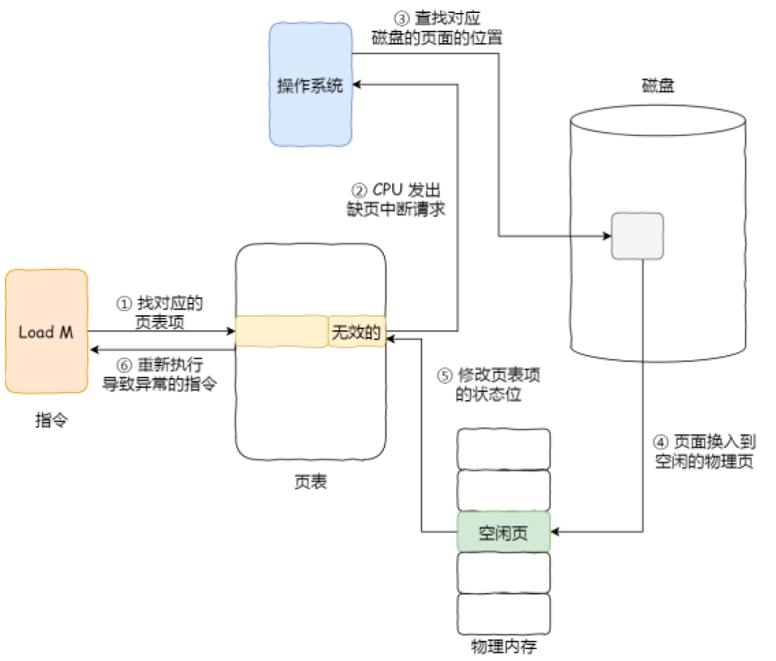

1. 在CPU访问一条LoadM指令，然后CPU会去找M所对应的页表项；
2. 如果该页表项的状态位是有效的，那CPU可以直接访问物理内存；如果状态位是无效的CPU就会发送缺页中断请求；
3. 操作系统收到了缺页中断，会执行缺页中断处理函数，查找到该页面在磁盘中的页面的位置；
4. 找到磁盘中的对应页面后，把页面换入到物理内存中，在换入前，需要在物理内存中找空闲页，如果找到空闲页，就把页面换入到物理内存中；如果没有找到空闲页，则使用页面置换算法置换出一些页，再将目标页面换入到物理内存中；
5. 页面从磁盘换入到物理内存完成后，则把页表项中的状态位修改为有效的。
6. 最后，CPU重新执行导致缺页异常的指令。

页面置换算法
1. 最佳置换算法：置换以后不需要或者最长时间内不访问的页面。
    理论上最优的算法，但是程序访问页面时是动态的，无法预知每个页面在下一次访问前的等待时间，故不可以实现。可以用来衡量其他页面置换算法的效率。

2. 先进先出置换算法(FIFO)：选择在内存驻留时间最长的页面进行中置换。
    实现方法：将调入内存的页面排成一个队列，需要置换页面时，置换出队首的页面。
    缺点：有可能将经常访问的页面置换出去了，使得缺页率升高，还会出现Belady现象（随着给进程分配的物理页面数的增加，缺页率不降反升）。
    产生Belady现象的原因：FIFO算法的置换特征与进程访问内存的动态特征矛盾，被置换出去的页面并不一定是进程近期不会访问的。

3. 最近最久未使用置换算法(LRU)：选择最近最长时间没有被访问的页面进行置换。
    实现方法：在内存中维护一个所有页面的链表，最近最多使用的页面在表头，最近最少使用的页面在表尾，访问内存时找到相应的页面并将其移动到队首，缺页时置换链表尾部的页面。
    缺点：LRU算法实现难度大，算法开销大，每次访问内存时都需要更新整个链表，在链表中找到要访问的链表，将其移动到表头。

4. 时钟置换算法(Clock)：FIFO和LRU的折中方法，在页表项中增加访问位用以描述页面在过去一段时间内的访问情况
    实现方法：将各个页面组织成环形链表，指针指向最先调入的页面，访问页面时在页表项中记录页面访问情况，缺页时，从指针开始处顺序查找未被访问的页面进行置换（如果访问位为0则置换该页面，访问位为1则将其置0，指针移至下一位置，直到找到为0的访问位进行置换）。
    缺点：未考虑页面的修改情况。

5. 改进的时钟置换算法：在时钟置换算法中增加了修改页，减少修改页的处理开销。
    实现方法：将所有可能被置换的页面排成一个循环队列，第一轮：指针循环扫描，搜索到第一个（0，0）则直接淘汰，若未找到则进行第二轮；第二轮：指针循环扫描，搜索到第一个（0，1）则直接淘汰，其他页面的访问位置0，重复第一轮（注意，0，1出现的情况只可能是在算法的上一次循环中，被算法修改了，因为读取或者写都会把访问位置1）。

6. 最不常用置换算法(LFU)：选择访问次数最少的那个页面进行置换。
    实现方法：对每个页面设置一个计数器，每当一个页面被访问时，该页面的访问计数器就累加1。在发生缺页中断时，淘汰计数器值最小的那个页面。
    缺点：增加计数器的硬件成本高，效率不高，且没有考虑时间问题（以前访问频率高，但是现在没访问了，可能误伤以前不怎么访问但现在开始高频率访问的页面）。

# 5、死锁的条件

死锁指的是由于竞争资源或通信关系，两个或更多线程在执行中出现永远相互等待的现象。
死锁的产生会导致程序卡死，不解锁程序将永远无法进行下去。

**死锁产生的条件**：
* 互斥：一个资源一次只能被一个进程使用。
* 持有并等待：进程持有至少一个资源，并等待获取其他进程的持有的资源。
* 不可抢占：已经分配给一个进程的资源不能被强制抢占，只能在进程使用完毕后自愿释放。
* 循环等待：多个进程要获取的资源形成了环形链。

**死锁预防**：确保系统永远不会进入死锁状态。
* 破坏互斥条件：将互斥的共享资源封装成可同时访问。
* 破坏持有并等待条件：进程运行前一次性向系统申请所有需要使用的资源，或者必须在没有占用资源的时候才能申请资源（申请前先释放所占有的资源）。
    缺点：很多时候无法预测一个进程所需要的全部资源；资源利用率低，因为有的资源并不是进程一开始执行就会使用，这时候其实可以将这部分资源交由其他的进程使用。
* 破坏不可抢占条件：允许进程强行抢占其他进程占有的资源。
* 破坏循环等待条件：对所有资源进行编号，所有进程对资源的请求的请求必须按照序号递增的顺序（占有了小号资源后才能申请大号资源，避免大号资源再去申请小号资源）。
    缺点：同破坏持有并等待的处理方法一样，存在资源利用率低的问题。

**死锁避免**：动态地检测资源分配状态，以确保系统处于安全状态（即便所有进程突然请求对资源的最大需求，也存在某种对进程资源的分配顺序，使得每一个进程运行完毕），只有在处于安全状态时才会进行资源的分配。
* 银行家算法：不断地去找一个进程所需要的资源数量小于能提供的资源数量。

**死锁检测**：允许系统进入死锁状态，只是维护系统资源分配图，定期调用死锁检测算法（通过资源分配图来检测是否存在环来实现）来搜索图中是否存在死锁，出现死锁时使用死锁恢复机制进行恢复。

**死锁恢复**：
* 利用抢占：挂起某些进程，并抢占它的资源。但应防止某些进程被长时间挂起而处于饥饿状态。
* 利用回滚：让某些进程回退到足以解除死锁的地步，进程回退时自愿释放资源。要求系统保持进程的历史信息，设置还原点。
* 利用杀死进程：强制杀死某些进程直到死锁解除为止，可以按照优先级进行。

鸵鸟策略：把头埋在沙子里，假装根本没发生问题。由于解决死锁问题的代价很高，因此鸵鸟策略这种不采取任何措施的方案会获得更高的性能。当发生死锁时不会对用户造成多大影响，或发生死锁的概率很低，可以采用鸵鸟策略。

# 6、NIO/BIO/AIO的区别

对于一次I/O访问（以read操作为例），通常包含两个阶段：
1. 等待数据准备就绪（数据被拷贝到操作系统的内核缓冲区）；
2. 从内核向进程复制数据（从操作系统的内核缓冲区拷贝到进程地址空间）。

**阻塞式I/O**(Blocking I/O)：
用户进程发起一个I/O操作后，如果数据尚未准备就绪，那么应用进程就会被阻塞，直到内核缓冲区数据准备就绪并从内核缓冲区拷贝到进程空间，或者发生错误才会返回。

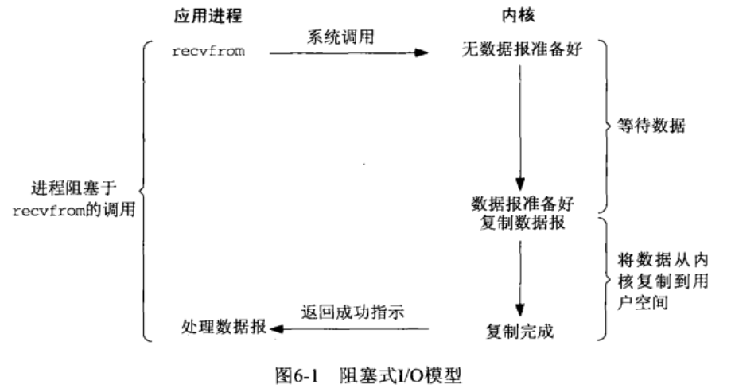

阻塞过程中，该用户进程可以被挂起，然后其他进程可以占用CPU执行指令，CPU的利用率相对较高。

**非阻塞式I/O**(Non-blocking I/O)：
用户进程发起一次I/O操作后，如果数据尚未准备就绪，那么应用进程不会被阻塞，而是立刻返回一个错误码(EWOULDBLOCK)，用户进程判断结果是一个EWOULDBLOCK error时，它就知道数据还没有准备好，于是它将再次发起I/O操作（**轮询**），直到数据准备好，然后将数据拷贝到进程空间并返回。

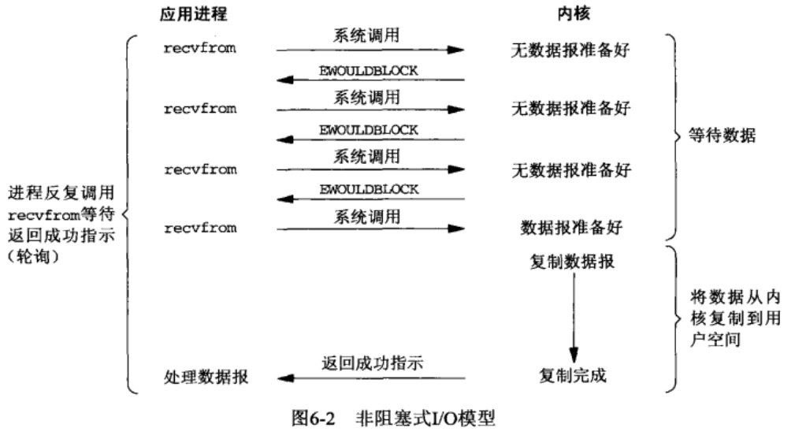

由于CPU要不断地轮询，执行很多系统调用，导致CPU利用率较低。

**I/O多路复用**(I/O multiplexing)：
**使得单个进程同时处理多个I/O请求**。用户进程发起一次I/O操作后，如果数据尚未准备就绪，那么应用进程会被阻塞在select/poll/epoll_wait系统调用上，而非阻塞在真正的I/O系统调用上。等到数据准备就绪后，select/poll/epoll_wait系统调用返回对应的可读的事件，然后对其进行I/O操作。

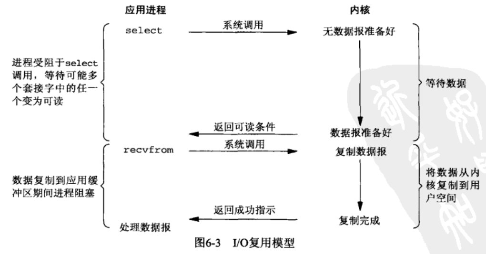

**信号驱动式I/O**(Signal driven I/O)：
应用进程先注册SIGIO的信号处理函数，等待内核缓冲区中的数据就绪后，操作系统会给进程发送一个SIGIO信号，应用进程再来进行I/O操作，将数据拷贝到进程空间。

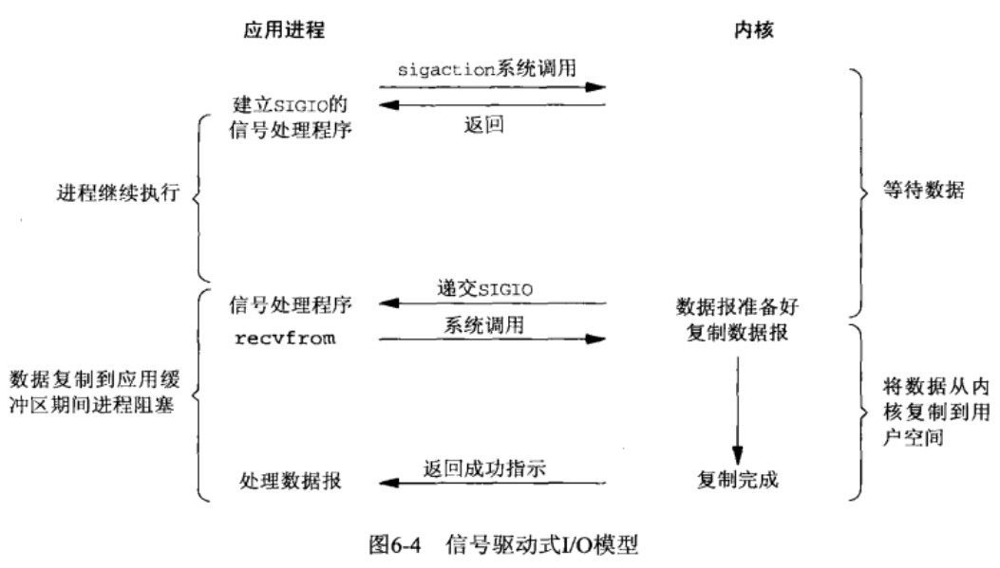

**异步I/O**(Asynchronous I/O)：
用户进程发起一次I/O操作后，如果数据尚未准备就绪，用户进程不会被阻塞，等到内核缓冲区数据准备就绪并拷贝到用户进程空间后，内核发送指定的信号通知用户进程数据已准备就绪。

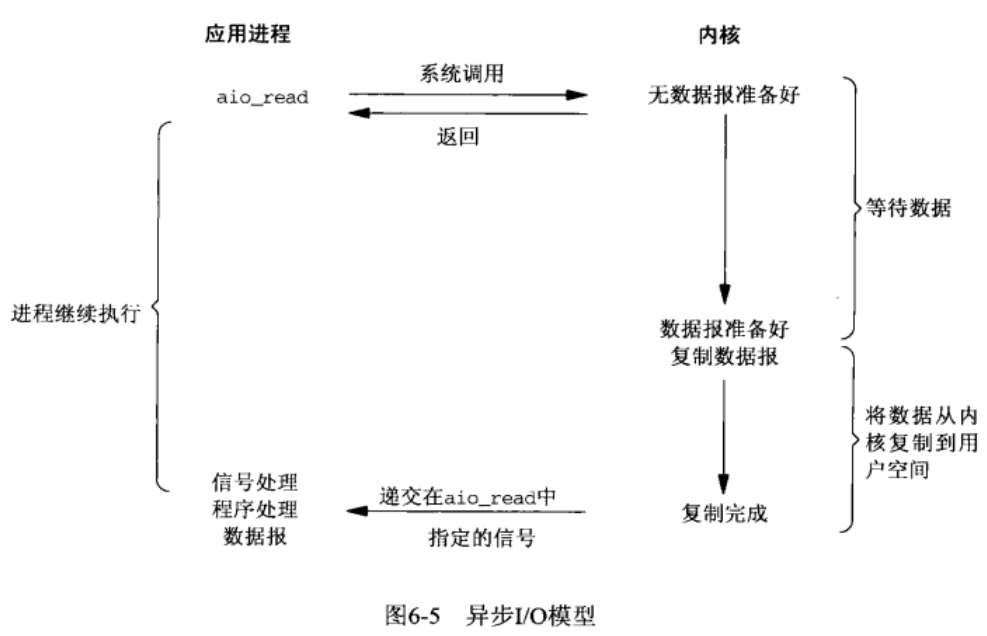

信号驱动式I/O和异步I/O的区别在于，信号驱动式I/O是通知应用进程可以开始进行I/O（数据已经在内核缓冲区准备就绪）；异步I/O是通知应用进程I/O已经完成（可以直接在进程缓冲区中使用了）。

区别：
阻塞I/O、非阻塞I/O、I/O多路复用、信号驱动式I/O都是**同步**的，应用进程需要等待将内核缓冲区的数据拷贝到用户缓冲区；异步I/O是**异步**的，内核数据准备就绪和拷贝到应用进程两个步骤都不需要等待。

**缓冲与非缓冲I/O**：文件操作的标准库是可以实现数据的缓存，那么根据**是否利用标准库缓冲**，可以把文件I/O分为缓冲I/O和非缓冲I/O：
* 缓冲I/O：利用的是标准库的缓存实现文件的加速访问，而标准库再通过系统调用访问文件。
* 非缓冲I/O：直接通过系统调用访问文件，不经过标准库缓存。
这里所说的「缓冲」特指标准库内部实现的缓冲。

**直接与非直接I/O**：根据**是否利用操作系统的缓存**，可以把文件I/O分为直接I/O与非直接I/O：
* 直接I/O：不会发生内核缓存和用户程序之间数据复制，而是直接经过文件系统访问磁盘。
* 非直接I/O：读操作时，数据从内核缓存中拷贝给用户程序，写操作时，数据从用户程序拷贝给内核缓存，再由内核决定什么时候写入数据到磁盘。

# 7、select/poll/epoll的区别

* **文件描述符的数量**
    - select使用`fd_set`结构体（本质是bitsmap）记录要监视的文件描述符，能够监视的文件描述符的数量由宏`FD_SETSIZE`限制，其默认值为1024，因此默认只能监视0~1023号文件描述符；如果需要监视更多的文件描述符，则需要修改`FD_SETSIZE`的值，并重新编译。
    - poll使用一个`pollfd`结构体的数组记录要监视的文件描述符，能够监视的文件描述符的数量没有限制，实际取决于系统参数、进程参数、内存大小等因素。
    - epoll使用`epoll_event`结构体记录要监视的文件描述符，能够监视的文件描述符的数量没有限制，实际取决于系统参数、进程参数、内存大小等因素。
* **文件描述符的重用**
    - select每次有就绪的事件发生后，会将描述符集合中其他未就绪的事件对应的位置为0，再次调用select之前需要重新设置要监视的集合。
    - poll不需要。
    - epoll不需要。
* **事件类型**
    - select只能监视可读、可写、异常事件。
    - poll整体上看也是支持可读、可写、异常事件，但是它将其事件类型划分更细致（如普通数据可读、优先级带数据可读、高优先级数据可读）。
    - epoll中事件有EPOLLIN、EPOLLOUT、EPOLLPRI、EPOLLRDHUP、EPOLLERR、EPOLLET、EPOLLONESHOT等。
* **工作模式**
  - select只能工作在LT下。
  - poll只能工作在LT下。
  - epoll支持ET与LT，ET模式更为高效。
* **文件描述符集合如何从用户传递给内核**
  - select需要拷贝整个文件描述符集合到内核。
  - poll需要拷贝整个文件描述符集合到内核。
  - epoll通过epoll_create()创建红黑树以后，使用epoll_ctl()封装的系统调用添加文件描述符集合到内核。
* **内核如何存储文件描述符集合**
    - select使用数组。
    - poll使用链表。
    - epoll使用红黑树。
* **内核判断就绪的文件描述符**
  - select轮询的是读写异常集合。
  - poll轮询所有fd集合。
  - epoll通过回调函数确定就虚的文件描述符，并将其添加到就绪链表（epoll_create时，专门用于存储准备就绪的事件）中。
* **用户判断就绪的文件描述符**
  - select只返回了发生事件的文件描述符个数，用户需要自己遍历fd集合。
  - poll只返回了发生事件的文件描述符个数，用户需要自己遍历fd集合。
  - epoll直接返回就绪事件的个数与事件数组（fd与其时间类型），用户处理十分方便。
* **可移植性**
    - 几乎所有系统都支持select。
    - 只有比较新的系统支持poll。
    - 只有Linux支持epoll。
* **应用场景**
  - 当fd数量较小且都处于活跃连接，建议使用select与poll。
  - 当监测的fd数目非常大，成千上万，且单位时间只有其中的一部分fd处于就绪状态，这个时候使用epoll能够明显提升性能。

**应用场景**

select应用场景
select的timeout参数精度为微妙，而poll和epoll为毫秒，因此select更加适用实时性要求比较高的场景，比如核反应堆的控制。select可移植性更好，几乎被所有主流平台所支持。

poll应用场景
poll没有最大描述符数量的限制，如果平台支持并且对实时性要求不高，应该使用poll而不是select。

epoll应用场景
只需要运行在Linux平台上，有大量的描述符需要同时轮询，并且这些连接最好是长连接。需要同时监控小于1000个描述符，就没有必要使用epoll，因为这个应用场景下并不能体现epoll的优势。需要监控的描述符状态变化多，而且都是非常短暂的，也没有必要使用epoll。因为epoll中的所有描述符都存储在内核中，造成每次需要对描述符的状态改变都需要通过epoll_ctl()进行系统调用，频繁系统调用降低效率。并且epoll的描述符存储在内核，不容易调试。

# 8、进程的状态、线程的状态

* 创建状态：进程正在被创建时的状态；
* 就绪状态：由于其他进程处于运行状态而暂时停止运行，一旦被CPU调度就能立马运行；
* 运行状态：进程占用CPU，正在执行指令；
* 阻塞状态：该进程正在等待某一事件发生（如等待输入/输出操作的完成）而暂时停止运行，这时，即使给它CPU控制权，它也无法运行；
* 结束状态：进程正在从系统中消失时的状态。

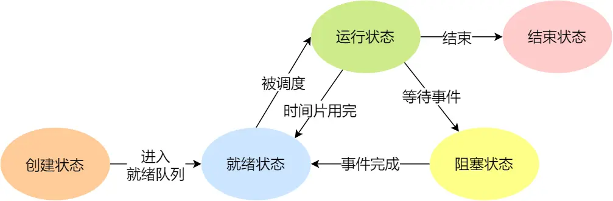

注意：
- 只有就绪态和运行态可以相互转换，其它的都是单向转换。就绪状态的进程通过调度算法从而获得CPU时间，转为运行状态；而运行状态的进程，在分配给它的CPU时间片用完之后就会转为就绪状态，等待下一次调度。
- 阻塞状态是缺少需要的资源从而由运行状态转换而来，但是该资源不包括CPU时间，缺少CPU时间会从运行态转换为就绪态。

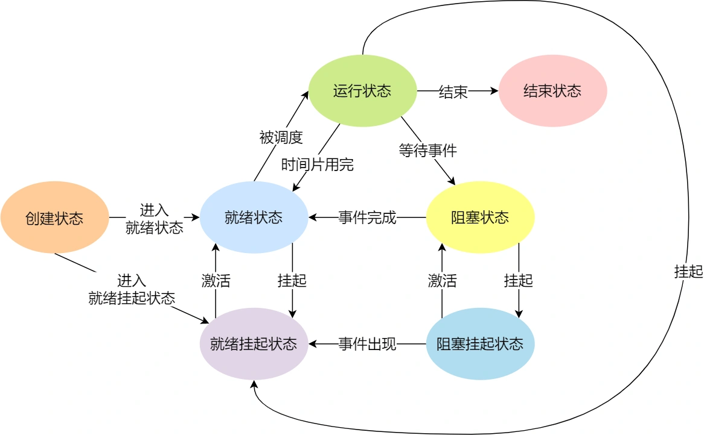

# 9、fork系统调用，子进程和父进程具体有哪些一样，哪些不一样

相同内容：父子进程的内存、寄存器、程序计数器、所有打开文件描述符的状态、用户态代码和数据均完全相同。
不同内容：父子进程的PID、虚拟地址空间不同。

注意：执行完fork之后，父子进程的页表尚且还是相同的（浅拷贝），直到子进程修改时才会复制一份（写时复制）。

# 10、为什么说进程上下文切换代价比线程大，具体都切换了哪些东西

进程上下文切换的过程：
1. 挂起一个进程，将这个进程在CPU中的状态（上下文信息）存储于内存的进程控制块(PCB)中。
2. 在PCB中检索下一个进程的上下文并将其在CPU的寄存器中恢复。
3. 跳转到程序计数器所指向的位置（即跳转到进程被中断时的代码行）并恢复该进程。

引起进程切换的原因：
* 当前正在执行的任务完成，系统的CPU正常调度下一个任务。
* 当前正在执行的任务遇到I/O等阻塞操作，调度器挂起此任务，继续调度下一个任务。
* 当前任务被一个优先级更高的任务抢占。
* 多个任务并发抢占锁资源，当前任务没有抢到锁资源，被调度器挂起，继续调度下一个任务。
* 用户的代码挂起当前任务，比如线程执行yield()方法，让出CPU。
* 硬件中断。

进程上下文切换的内容：
主要包括虚拟内存（页表、TLB等）、栈、全局变量、寄存器等。

线程上下文切换的内容：
主要包括栈、一组寄存器、程序计数器。

# 11、进程调度策略

1. 先来先服务（FCFS）：按照请求的顺序进行调度。
    非抢占式调度算法，开销小，无饥饿问题，响应时间不确定。有利于长进程而不利于短进程，不利于I/O密集型进程。
2. 短作业优先（SJF）：按照估计运行时间最短的顺序进行调度。
    非抢占式调度算法，吞吐量高，开销可能较大，对短进程提供好的响应式时间，可能导致饥饿问题（一直有短进程到来，导致长进程一直无法被调度）。
3. 最短剩余时间优先：按照剩余时间的顺序进行调度。
    短作业优先的抢占式版本（如果有新的作业到来且需要运行的时间小于当前运行进程的剩余时间，则会发生抢占），吞吐量高，开销可能较大，提供好的响应时间，可能导致饥饿，对长进程不利。
4. 时间片轮转：将所有的进程按照先来先服务的顺序排列成一个队列，每次调度时为队首进程分配一个时间片，当时间片用完后触发时钟中断，操作系统将该进程排到队列的最后面，同时将时间片分给当前队首的进程。
    抢占式调度算法（时间片用完时发生抢占），开销小，无饥饿问题，为短进程提供良好的响应时间。
    时间片轮转算法的效率和时间片的大小有关：若时间片太小，进程切换频繁，在上下文切换上耗时过多，吞吐量低；如时间片太大，实时性得不到保证，极限情况退化成FCFS。
5. 优先级调度：为每个进程分配一个优先级，按照优先级进行调度。为了防止低优先级的进程永远等不到调度，可以随着时间的推移增加等待进程的优先级。
6. 最高响应比优先：选择就绪队列中响应比最高的进程（响应比 = 1+等待时间/响应时间）。同时考虑了等待时间的长短和预计需要执行的时间长短，平衡了长短进程。
    非抢占式调度算法，吞吐量高，开销可能较大，提供好的响应时间，无饥饿问题。
7. 多级反馈队列：设置多个就绪队列，优先级递减，时间片递增，只有等到更高的对量为空时才会调度当前队列中的进程，如果进程用完了当前队列中的时间片还未执行完，则会被移动到下一级的队列。
    抢占式调度算法，开销可能较大，对I/O密集型进程有利（CPU密集型进程的优先级下降得块，I/O密集型进程停留在高优先级队列），可能出现饥饿问题（如果有过多I/O密集型进程，就会不断占用CPU，导致优先级低的队列中的进程一直无法被调度）。

不同环境的调度算法目标不同，因此不同的环境适用的调度算法也不同。
* 批处理系统：
    批处理系统没有太多的用户操作，调度算法目标是保证吞吐量和周转时间。
    先来先服务、短作业优先、最短剩余时间优先
* 交互式系统
    交互系统有大量的用户交互操作，在该系统中调度算法的目标是快速地进行响应。
    时间片轮转、优先级调度、最高响应比、多级反馈队列

# 12、简要描述中断的过程

硬件中断的实质是一个数字信号，当设备有事件需要通知CPU的时候，就会发出中断信号，这个信号最终会传到CPU中。支持中断机制的设备控制器都有一个中断引脚，这个引脚会和CPU的INTR引脚相连，**CPU每次执行完一条指令的时候，都会看看INTR引脚**，看是否有设备的中断请求到来，如果中断到来的时候，CPU没有处在关中断状态，它就要马上响应到来的中断请求，中断控制器会生成一个中断号，CPU将会保存中断上下文，然后根据这个中断号在**中断描述表**(IDT)中进行索引，找到并跳转到入口地址，进行一些和设备相关的处理。

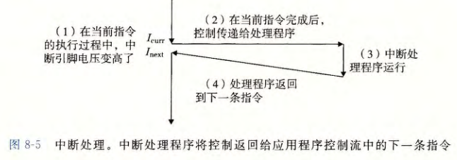

# 13、Linux常用指令

[Linux命令](https://mp.weixin.qq.com/s/JJM6eZMUKfgpfU2Kjj__Sw)

**快捷键**
* Tab：补全命令和文件名。连续键入两下还可以查看所有以已输入的字符为前缀的全部命令。
* Ctrl+C：发送SIGINT信号，表示终止正在运行的进程。
* Ctrl+Z：发送SIGTSTP信号，表示停止进程的运行，但是尚未终止。使用fg恢复前台运行，使用bg恢复后台运行。
    注意SIGTSTP信号是可以被捕获和忽略的，但是SIGSTOP不可以。
* Ctrl+D：结束键盘键入，表示EOF。

**求助**
* --help：指令的基本用法和选项介绍。
* man：将指令的具体信息显示出来，查看指令的帮助。
    - 1：可执行程序或shell命令
    - 2：系统调用（内核提供的函数）
    - 3：库调用（程序库中的函数）
    - 4：特殊文件（通常在/dev/中找到）
    - 5：文件格式和约定，例如/etc/passwd
    - 6：游戏
    - 7：杂项（包括宏包和约定），例如man（7）、groff（7）
    - 8：系统管理命令（通常仅适用于root用户）
    - 9：内核例程

**文件与目录的基本操作**
* ls：列出文件或者目录的信息。
    - -a：列出全部文件
    - -d：仅列出目录本身
    - -l：以长数据串行列出，包含文件的属性和权限等数据
* cd：更换当前目录。
* mkdir：创建目录。
    - -m：配置目录权限
    - -p：递归创建目录
* rmdir：删除目录，目录必须为空才能删除。
* touch：更新文件时间或者创建新的文件夹。
* cp：复制文件。如果源文件有两个以上，则目的文件必须是目录。
    > cp SOURCE DEST
    > 将SOURCE文件复制为DEST文件，如果DEST是一个目录，则将SOURCE复制到目录下
* rm：删除文件。
* mv：移动文件。

**获取文件内容**
* cat：获取文件内容。
* tac：cat的反向操作，从最后一行开始打印。
* more：与cat类似，与cat的不同是它可以一页一页查看文件内容，比较适合大文件的查看。
* less：与more类似，多了一个向前翻页的功能。
* head：取得文件的前几行。
* tail：取得文件的后几行。

**管道命令**
* 管道是将一个命令的标准输出作为另一个命令的标准输入，在数据需要经过多个步骤的处理之后才能得到我们想要的内容时就可以使用管道。
在命令之间使用`│`分隔各个管道命令。

**提取指令**
* cut：对数据进行切分，取出想要的部分。

**进程命令**
* kill：向进程发送终止信号。
* pwd：显示工作目录路径。
* ps：查看进程情况。
* top：查看操作系统的信息，比如进程、CPU占有率、内存信息等。

# 14、kill -9 或者 ctrl+C到底发生了什么

`kill -9`命令给进程发送SIGKILL信号，用于立即结束该进程；`ctrl+c`，命令产生SIGINT命令，表示终止该进程。

信号是进程间通信机制中唯一的**异步通信**方式。因为可以在任意时间发送信号给一个进程。

可以通过`kill -l`命令查看所有信号。

信号事件的来源主要有软件来源和硬件来源：
- 软件来源比如如果进程在后台运行，可以通过kill命令的方式给进程发送信号；
- 硬件来源比如通过键盘输入某些组合键，给进程发送信号。

一旦有信号产生，我们就有下面这几种用户进程对信号的处理方式:
1. 执行默认操作。Linux对每种信号都规定了默认操作，比如SIGKILL就是终止进程的意思；
2. 捕捉信号。可以为信号定义一个信号处理函数。当信号发生时，就执行相应的信号处理函数。
3. 忽略信号。如果不希望处理某些信号的时候，可以忽略该信号，不做任何处理。

有两个信号是应用程序无法捕捉和忽略的，即SIGKILL和SEGSTOP，它们用于在任何时候终止或者暂停某一进程。

# 15、互斥量和信号量

在共享内存通信中，如果多个进程同时修改一个共享内存，很有可能会发生冲突。为了防止多进程竞争共享资源造成数据错误，需要保护机制，使得共享资源在任意时刻只有一个进程访问。

信号量：
信号量是一个整型变量，主要用于实现进程间的同步和互斥。可以对其进行down和up操作。
* down操作（P操作）：将sem减1，相减后，如果sem < 0，则进程/线程进入阻塞等待，否则继续，表明P操作可能会阻塞；
* up操作（V操作）：将sem加1，相加后，如果sem <= 0，唤醒一个等待中的进程/线程，表明V操作不会阻塞。

P、V操作通常需要被设计为原子语句，不可分割，通常的做法是在执行这些操作的时候屏蔽中断。

互斥量：
如果信号量的取值只能为0或者1，那么就成了互斥量，0表示临界区已经加锁（临界资源已被占用），1表示临界区解锁（可使用临界资源）。
> Mutex变量是非0即1的，可看作一种资源的可用数量，初始化时Mutex是1，表示有一个可用资源，加锁时获得该资源，将Mutex减到0，表示不再有可用资源，解锁时释放该资源，将Mutex重新加到1，表示又有了一个可用资源。使得任何时候只允许至多一个线程访问共享资源。

# 16、守护进程、僵尸进程和孤儿进程是什么

**守护进程**
守护进程（daemon）是生存期长的一种进程。它们常常**在系统引导装入时启动，仅在系统关闭时才终止**。因为它们没有控制终端，所以说它们是在**后台运行**的。

创建守护进程：
1. **让程序在后台执行**。方法是调用fork()产生一个子进程，然后使父进程退出。
2. **调用setsid()创建一个新会话**。控制终端、登录会话和进程组通常是从父进程继承下来的，守护进程要摆脱它们，不受它们的影响，方法是调用setsid()使进程成为一个会话组长。setsid()调用成功后，进程成为新的会话组长和进程组长，并与原来的登录会话、进程组和控制终端脱离。
3. **禁止进程重新打开控制终端**。经过以上步骤，进程已经成为一个无终端的会话组长，但是它可以重新申请打开一个终端。为了避免这种情况发生，可以通过使进程不再是会话组长来实现。再一次通过fork()创建新的子进程，使调用fork的进程退出。
4. **关闭不再需要的文件描述符**。子进程从父进程继承打开的文件描述符。如不关闭，将会浪费系统资源，造成进程所在的文件系统无法卸下以及引起无法预料的错误。首先获得最高文件描述符值，然后用一个循环程序，关闭0到最高文件描述符值的所有文件描述符。
5. 将当前目录更改为根目录。
6. 子进程从父进程继承的文件创建屏蔽字可能会拒绝某些许可权。为防止这一点，使用unmask(0)将屏蔽字清零。
7. 处理SIGCHLD信号。对于服务器进程，在请求到来时往往生成子进程处理请求。如果子进程等待父进程捕获状态，则子进程将成为僵尸进程（zombie），从而占用系统资源。如果父进程等待子进程结束，将增加父进程的负担，影响服务器进程的并发性能。在Linux下可以简单地将SIGCHLD信号的操作设为SIG_IGN。这样，子进程结束时不会产生僵尸进程。

**孤儿进程**
一个其父进程已经终止的进程称为孤儿进程，这种进程由init进程收养，并由init进程对它们完成状态收集工作。同样的，进程组也可以成为孤儿进程组。由于孤儿进程会被init进程收养并完成状态收集工作，故孤儿进程并不会对系统造成危害。

**僵死进程**
僵死进程指已经终止、但是其父进程尚未对其进行善后处理（获取终止子进程的有关信息、释放它仍占用的资源）的进程。

设置僵尸进程的目的是维护子进程的信息，以便父进程在以后某个时候获取。这些信息至少包括进程ID，进程的终止状态，以及该进程使用的CPU时间，所以当终止子进程的父进程调用wait或waitpid时就可以得到这些信息。如果一个进程终止，而该进程有子进程处于僵尸状态，那么它的所有僵尸子进程的父进程ID将被重置为1（init进程）。继承这些子进程的init进程将清理它们（也就是说init进程将wait它们，从而去除它们的僵尸状态）。

系统所能使用的进程号是有限的，如果产生大量僵尸进程，将因为没有可用的进程号而导致系统不能产生新的进程。

**要消灭系统中大量的僵尸进程，只需要将其父进程杀死**，此时僵尸进程就会变成孤儿进程，从而被init进程所收养，这样init进程就会释放所有的僵尸进程所占有的资源，从而结束僵尸进程。

# 17、分段是什么，与分页的区别

分段：
内存分段是根据程序的逻辑角度，将内存空间分为了不同属性的段（栈段、堆段、数据段、代码段）。分段的做法是将每个进程的地址空间分成段，一个短构成一个独立的空间，每个段的长度可以不同，并且可以动态增长。

分段机制下，虚拟地址分为两个部分：段选择子、段内偏移量。

将虚拟地址映射为物理地址：
虚拟地址中的段选择子中有一个段号，先在段表中找到对应的段内描述符，段内描述符包含对应的段在物理内存中的段基地址以及段界限（段的大小），确定了段基地址后就可以根据段选择子中的段内偏移量确定实际的物理地址。

分段粒度太大，会导致大量内存碎片，不利于管理，现在大部分操作系统都不再使用分段机制。

分页与分段的区别：
* 对程序员的透明性：分页透明；分段需要程序员显式划分每个段。
* 地址空间的维度：分页是一维空间；分段是二维的。
* 大小是否可以改变：页的大小不可变，段的大小可以动态改变。
* 出现原因∶分页主要用于实现虚拟内存，从而获得更大的地址空间；分段主要是为了使程序和数据可以被划分为逻辑上独立的地址空间，并且有助于共享和保护。

段页式
结合分段和分页式内存，将进程的地址空间分为多个拥有独立地址空间的段，每个段上的地址空间划分为大小相同的页。这样既可以拥有分段式的共享和保护的优点，又具有分页式的虚拟内存功能。

段页式地址结构由**段号、段内页号、页内位移**三部分组成。

每一个程序一张段表，每个段又建立一张页表，段表中的地址是页表的起始地址，而页表中的地址为某页的物理页号。段页式地址转换为物理地址需要经过三次内存访问：
1. 第一个访问段表，得到页表的起始地址。
2. 第二次访问对应的页表，得到物理页号。
3. 第三次将物理页号和页内位移组合，得到物理地址。

# 18、零拷贝是什么

零拷贝：没有在内存层面去拷贝数据，所有数据都是通过DMA(直接内存访问)进行传输，即全程没有通过CPU来搬运数据。零拷贝大大提高了应用程序性能，减少了内核和用户之间的切换以及数据拷贝的次数。

Sendfile()实现零拷贝：
1. 用户进程调用sendfile()，从用户态陷入内核态；
2. DMA控制器使用scatter功能把数据从硬盘拷贝到内核缓冲区进行离散存储；
3. CPU把包含内存地址和数据长度的缓冲区描述符拷贝到套接字缓冲区，DMA控制器能够根据这些信息生成网络包数据分组的报头和报尾；
4. DMA控制器根据缓冲区描述符里的内存地址和数据大小，使用scatter-gather功能开始从内核缓冲区收集离散的数据并组包，最后直接把网络包数据拷贝到网卡完成数据传输；
5. sendfile()返回，上下文从内核态切换回用户态。

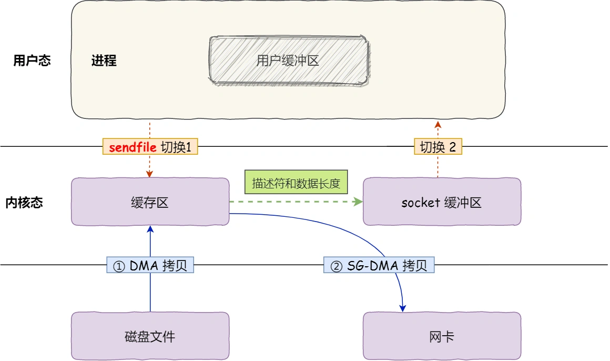

# 19、exec和fork的区别

fork()：
fork()函数用来创建一个子进程。fork会使操作系统根据父进程复制出一个子进程，父进程和子进程的PCB状态相同，用户态代码和数据也相同。
对于父进程，fork()调用成功返回新创建的子进程的PID；对于子进程，fork()调用成功返回0。

exec()：
很多时候用户需要子进程和父进程执行完全不同的任务，为此提供了exec接口。
一个进程一旦调用exec类函数，系统把代码段替换成新的程序的代码，废弃原有的数据段和堆栈段，并为新程序分配新的数据段与堆栈段，唯一留下的，就是进程号。
不过exec类函数中有的还允许继承环境变量之类的信息，这个通过exec系列函数中的一部分函数的参数可以得到。

如果把进程看成一个状态机，fork相当于复制了一个状态机，exex相当于重置了这个状态机。

# 20、描述符

句柄/资源描述符是管理和指向资源的指针。

句柄
1. 句柄就是一个标识符，只要获得对象的句柄，我们就可以对对象进行任意的操作。
2. 句柄不是指针，操作系统用句柄可以找到一块内存，这个句柄可能是标识符、map的key或者指针，看操作系统怎么处理的了。Linux有相应机制，但没有统一的句柄类型，各种类型的系统资源由各自的类型来标识，由各自的接口操作。
3. 在操作系统层面上，文件操作也有类似于FILE的一个概念，在Linux里，这叫做文件描述符fd(FileDescriptor)，而在Windows里，叫做句柄(Handle)。用户通过某个函数打开文件以获得句柄，此后用户操纵文件皆通过该句柄进行。

# 21、TLB

程序是有局部性的，即在一段时间内，整个程序的执行仅限于程序中的某一部分。相应地，执行所访问的存储空间也局限于某个内存区域。我们就可以利用这一特性，把最常访问的几个页表项存储到访问速度更快的硬件，于是计算机科学家们，就在CPU芯片中，加入了一个专门存放程序最常访问的页表项的Cache，这个Cache就是TLB（Translation Lookaside Buffer），通常称为页表缓存、转址旁路缓存、快表等。

快表，又称联想寄存器(TLB) ，是一种访问速度比内存快很多的高速缓冲存储器，用来存放当前访问的若干页表项，以加速地址变换的过程。与此对应，内存中的页表常称为慢表。

有了TLB后，在CPU寻址时，会先查TLB，如果没有找到，才会继续查常规的页表。

# 22、DMA

**直接内存访问**（DMA）技术：在进行I/O设备和内存的数据传输的时候，数据搬运的工作全部交给DMA控制器，而CPU不再参与任何与数据搬运相关的事情，这样CPU就可以去处理别的事务。

有DMA技术后，I/O过程：
1. 用户进程调用read方法，向操作系统发出I/O请求，请求读取数据到自己的内存缓冲区中，进程进入阻塞状态；
2. 操作系统收到请求后，进一步将I/O请求发送DMA，然后让CPU执行其他任务；
3. DMA进一步将I/O请求发送给磁盘；
4. 磁盘收到DMA的I/O请求，把数据从磁盘读取到磁盘控制器的缓冲区中，当磁盘控制器的缓冲区被读满后，向DMA发起中断信号，告知自己缓冲区已满；
5. DMA收到磁盘的信号，将磁盘控制器缓冲区中的数据拷贝到内核缓冲区中，此时不占用CPU，CPU可以执行其他任务；
6. 当DMA 取了足够多的数据，就会发送中断信号给CPU；
7. CPU收到DMA的信号，知道数据已经准备好，于是将数据从内核拷贝到用户空间，系统调用返回。

有了DMA技术后，CPU不再参与将数据从磁盘控制器缓冲区拷贝到内核缓冲区这个过程，CPU就能够进行其他任务（但是CPU还是要参与，将传输的数据类型、传输到哪里等信息告诉DMA）。

# 23、系统调用

在用户态下的进程不能直接访问操作系统的内核空间，如果要进入内核空间，需要通过系统调用。

系统调用的过程：
1. 当应用进程执行了一个系统调用后，会产生一个中断。
2. 发生中断后，CPU中断当前正在执行的用户程序，跳转到执行中断处理程序，也就是执行内核程序。
3. 内核处理完毕后，主动触发中断，将CPU执行权限交还给应用进程，回到用户态继续执行。

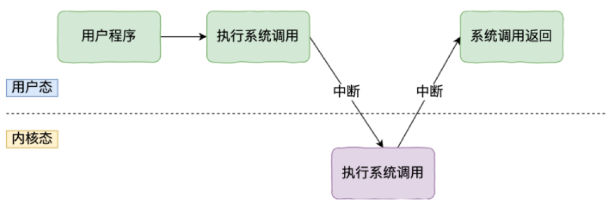

Linux中系统调用函数：
* 进程控制：fork()、exit()、wait()
* 进程通信：pipe()、shmget()、mmap()
* 文件操作：open()、read()、write()
* 设备操作：ioctl()、read()、write()
* 信息维护：getpid()、alarm()、sleep()
* 安全：chmod()、umask()、chown()

# 24、进程&线程

进程的概念：

进程是资源分配的基本单位。进程对应着一个运行的程序，仿佛独占CPU，每个进程有独立的地址空间。

进程控制块(Process Control Block，PCB)描述进程的基本信息和运行状态，所谓的创建进程和撤销进程，都是指对PCB的操作。

进程调度原则：
* CPU利用率：调度程序应确保CPU始终匆忙的状态。
* 系统吞吐量：吞吐量表示的是**单位时间内CPU完成进程的数量**，长作业的进程会占用较长的CPU资源，因此会降低吞吐量，相反，短作业的进程会提升系统吞吐量。
* 周转时间：周转时间是**进程运行和阻塞时间的总和**，一个进程的周转时间越小越好。
* 等待时间：这个等待时间不是阻塞状态的时间，而是进程**处于就绪队列的时间**等待的时间越长，用户越不满意。
* 响应时间：**用户提交请求到系统第一次产生响应所花费的时间**，在交互式系统中，响应时间是衡量调度算法好坏的主要标准。

进程同步:
* 临界区：对临界资源进行访问的那段代码叫做临界区。为了互斥访问临界资源，每个进程在进入临界区之前，需要先进行检查。
* 同步与互斥：
    - 同步：多个进程因为合作产生的直接制约关系，使得进程有一定的先后执行关系。
    - 互斥：多个进程在同一时刻只有一个进程能进入临界区。

线程的概念
线程是独立调度的基本单位。线程是进程当中的一条执行流程，一个进程中可以有多个线程，它们可以并发执行，共享进程资源。

> 1. 线程间共享完整的地址空间(所有数据，包括代码，全局变量)。所有指令取指、执行都作用在同一个地址空间
> 2. 线程独立拥有寄存器(rip、rsp)，栈（独立栈通过为每个线程分配不同的
rsp寄存器实现）

SIGCHLD
当一个子进程改变了它的状态时（停止运行，继续运行或退出），有两件事会发生在父进程中：
1. 得到SIGCHLD信号
2. waitpid()或wait()调用会返回
其中，子进程发送的SIGCHLD信号包含了子进程的信息，比如进程ID、进程状态、进程使用CPU的时间等。

在子进程退出时，它的进程描述符不会立即释放，这是为了让父进程得到子进程的信息，父进程通过wait()和waitpid()来获得一个已经退出的子进程的信息。

wait()
`pid_t wait(int* status);`
父进程调用wait会一直阻塞，直到收到一个子进程退出的SIGCHILD信号，之后wait()函数会销毁子进程并返回。如果成功，返回被手机的子进程PID；如果调用进程没有子进程，调用失败，返回-1，同时errno被置为ECHILD。
参数status用来保存被收集的子进程退出时的状态，如果对这个子进程时如何终止的并不在意，则可以将status参数设置为NULL。

waitpid()
`pid_t waitpid(pid_t pid, int* status, int options);`
作用和wait()完全相同，但是多了两个可由用户控制的参数pid和options。
pid参数指示一个子进程的ID，表示只关心这个子进程退出的SIGCHLD信号。如果pid=-1时，那么和wait()作用相同，都是关心所有子进程退出的SIGCHLD信号。
options参数主要有WNOHANG和WUNTRACED两个选项，WNOHANG可以使waitpid()调用变成非阻塞的，也就是说它会立即返回，父进程可以继续执行其它任务。

# 25、三种线程模型

1. **一对一模型**：一个用户使用的线程唯一对应一个内核使用的线程（但是反过来不一定，一个内核中的线程在用户态不一定有对应的线程存在）。  
    优点：线程之间的并发是真正的并发，一个线程被阻塞时其他线程的执行不会受影响。
    缺点：1、由于许多操作系统限制了内核线程的数量，因此一对一线程会让用户的线程数量受到限制。2、许多操作系统内核线程调度时，上下文切换的开销较大，导致用户线程的执行效率下降。  

    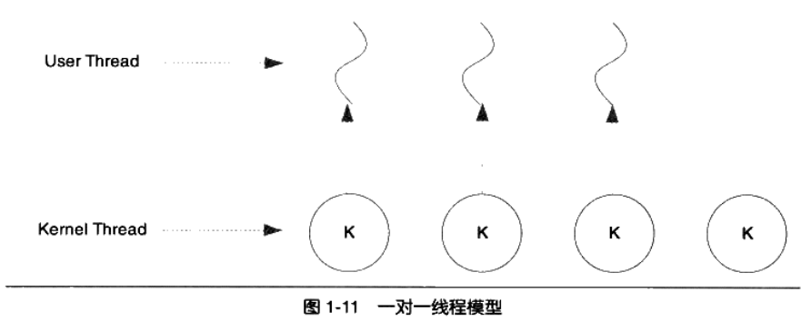

2. **多对一模型**：将多个用户线程映射到一个内核线程上，线程之间的切换由用户态的代码来进行。  
    优点：由于在用户态进行线程切换，因此线程上下文切换的速度快；用户线程数量几乎无限制。  
    缺点：1、如果一个用户线程阻塞了，那么和该线程对应同一个内核线程的所有的用户线程都无法执行，即对应的内核线程被阻塞了。2、在多处理器系统上对于线程的性能也无明显的提升。  

    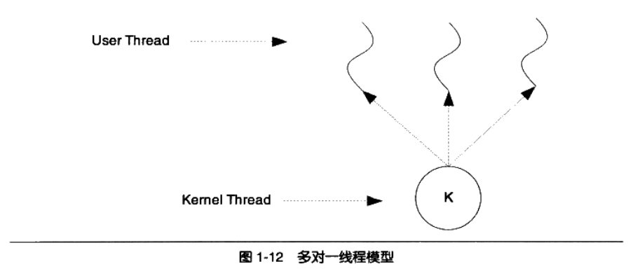

3. **多对多模型**：将多个用户线程映射到少数但是不值一个内核线程上，结合了一对一和多对一模型的特点。
    在多对多模型中，一个用户线程阻塞并不会使得所有的用户线程阻塞，因为此时还有别的线程可以被调度来执行。另外，多对多模型对用户线程的数量也没什么限制，在多处理器系统上，多对多模型的线程也能得到一定的性能提升，不过提升的幅度不如一对一模型高。  

    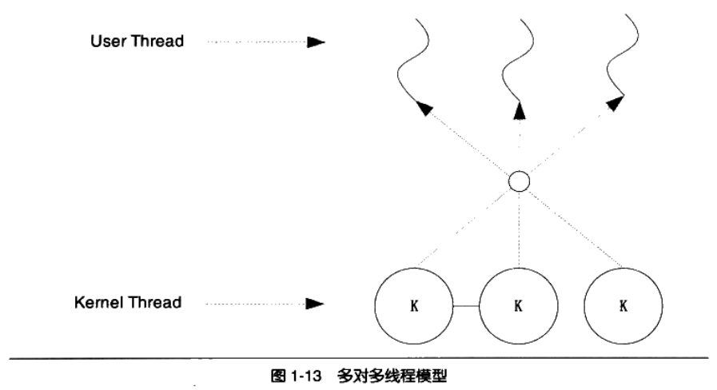

