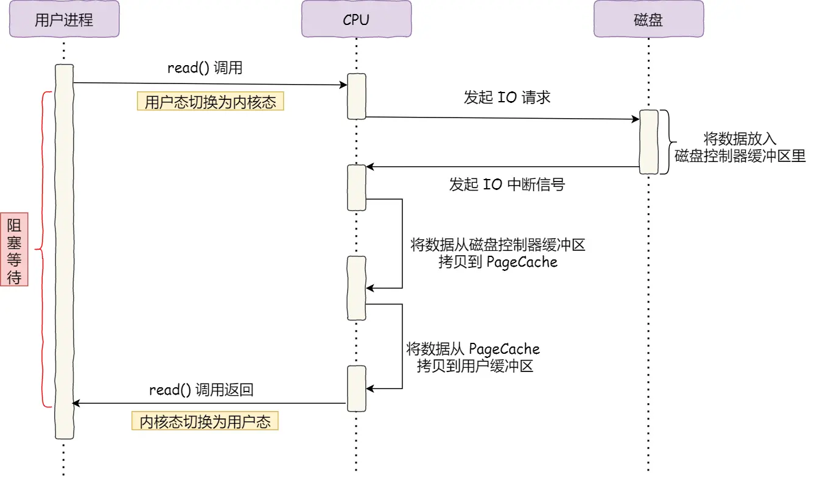

[toc]

# Socket网络模型

## 基础的Socket模型


* socket()：创建指定网络协议、传输协议的Socket。
* bind()：将Socket绑定到一个IP地址和端口号上。
* listen()：监听是否有客户端发来的请求连接。
* accept()：从内核获取客户端的连接，如果尚无连接，则服务端阻塞。
* connect()：客户端创建好Socket后调用connect()函数向服务端发起来连接（三次握手）。
* close()：关闭Socket连接。


bind()函数：
- 绑定端口的目的：当内核收到TCP报文时，通过端口号来将报文中的数据送到指定的应用程序。
- 绑定IP地址的目的：一台服务器可以有多个网卡，每个网卡都具有一个IP地址，当绑定一个网卡IP地址时，限定该套接字只接受目的IP为该IP地址的客户连接。


**bind()函数并不是必须的**：
未绑定端口：在调用connect或者listen时，内核为相应的套接字选择一个临时的端口（对于TCP客户来说很常见，TCP服务器来说很罕见）。
未绑定IP地址：TCP客户未绑定IP地址时，内核根据外出的网络接口选择源IP地址（外出网络接口却决于到达服务器所需的路径）；TCP服务器未绑定IP地址时，将所接收到的SYN报文的目的IP地址作为服务器的源IP地址。


操作系统内核为任何一个给定的监听套接字维护两个队列：
* 半连接队列：尚未完成三次握手，服务端处于SYN_RCVD状态。
* 全连接队列：已经完成三次握手，服务端处于ESTABLISHED状态。
调用accept即从全连接队列中取出一个已连接的Socket。


TCP连接四元组：源IP地址、源端口号、目的IP地址、目的端口号

服务的最大连接数主要受限于：
1. 文件描述符：单进程打开的文件描述符的个数是有限的。
2. 系统内存：每个TCP连接都是占用内存的。


## 多进程模型

多进程模型：为一个客户端分配一个进程执行请求。


缺点：
* 处理客户端响应的子进程要做好回收工作，避免成为僵尸进程，消耗系统资源。 
* 当客户端数量很高时，产生大量进程，占用大量系统资源，且进程之间的切换会导致效率很低。


## 多线程模型

多线程模型：使用线程来执行客户端请求，避免进程切换带来的效率问题。

由于频繁创建、销毁线程的开销也不小，故使用线程池的方式来避免现成的频繁创建和销毁。

线程池：提前创建若干个线程，这样当由新连接建立时，将这个已连接的Socket放入到一个队列里，然后线程池里的线程负责从队列中取出已连接Socket进行处理（为避免对队列操作时的多线程竞争，线程在操作队列时需要加锁）。


缺点：还是无法解决客户端数量非常大的情况。


## I/O多路复用

I/O多路复用：使用一个进程维护多个Socket，使用I/O多路复用的函数将要维护的Socket交由操作系统监视，当某个Socket有请求发送过来时，操作系统将其返回给进程进行处理。

select/poll/epoll函数是内核提供给用户态的多路复用系统调用，进程可以通过一个系统调用函数从内核中获取多个事件。


select函数：
* 实现原理：将所有要监视的事件都放入到文件描述符集合中，然后调用select函数将文件描述符集合拷贝到内核中，由内核来检查是否有事件就绪（通过遍历集合来检查），当检查到有事件就绪后，将文件描述符集合拷贝到用户态，由进程对其进行处理。
* 效率较低，需要进行两次用户态和内核态之间的拷贝，内核检查时间就绪和用户进程查找就绪的事件都需要进行遍历。
* 文件描述符集合使用固定长度的BitMap，所支持的文件描述符的个数是有限的，内核中由宏`FD_SETSIZE`限制，默认值为1024，只能监听0~1023号文件描述符。如果需要修改此值，只能修改该宏，修改后需要重新编译。

poll函数：
poll函数本质上基本一致，只是poll未使用BitMap的方式来描述要监视的文件描述符，而是使用`pollfd`结构体来描述，通过`pollfd`的数组来描述所有的要监视的事件，那么就不在拘束于select函数中最大只能监视1024个文件描述符的限制了。
```C
struct pollfd{
    int fd;         //要监视的文件描述符
    short events;   //文件描述符的状态
    short revents;  //就绪后该文件描述符的状态
};
```

epoll函数：
* epoll函数的用法：
    ```C++
    int epfd = epoll_create(...); //创建epoll对象epfd
    poll_ctl(epfd, ...); //将所有需要监听的事件添加到epfd中
    while(1) {
        int n = epoll_wait(...); //从就绪队列中取出已就绪的事件
        
        //处理
    }
    ```
* epoll在内核中使用红黑树来保存所有要监视的文件描述符。通过`epoll_ctl()`函数将要检测的文件描述符添加到内核的红黑树中。每次只需要传入一个待监视的事件，减少了内核态和用户态之间的数据拷贝。
* epoll使用事件驱动，在内核中维护了一个链表来记录就绪事件，当有事件就绪时通过回调函数内核会将其添加到这个就绪事件链表中，当用户调用epoll_wait()函数时，只会返回有事件发生的文件描述符的个数，不需要像select/poll那样轮询扫描整个集合，大大提高了检测的效率。


边缘触发(ET)和水平触发(LT)：
* 边缘触发：使用边缘触发模式时，被监视的事件就绪时，只会从epoll_wait中唤醒一次，即使进程没有调用read()函数从内核读取数据，也依旧只被唤醒一次，等下一次事件再次就绪时，才会再次被唤醒。因此进程要保证一次性将缓冲区数据读完。为避免数据读完后进程被阻塞，边缘触发模式需要和非阻塞I/O搭配使用。
* 水平触发：使用水平触发模式时，被监视的事件就绪时，会不断地从epoll_wait中唤醒，直到内核缓冲区中的数据被读取完毕。

select、poll只有水平触发模式；epoll默认的触发模式是水平触发，但是可以设置为边缘触发模式。


以epoll为例进行说明
LT：默认的模式（水平触发），支持block与non-block，只要该socket还有数据可读写，每次epoll_wait都会返回它的事件，提醒用户程序去操作。
ET：“高速”模式（边缘触发），只支持non_block，只会提示一次，直到下次再有数据流入之前都不会再提示，无论fd中是否还有数据可读。所以ET模式下，read一个fd时，一定要把它的buffer读完，即读到read返回值小于请求值或遇到EAGAIN错误。ET的意义而采用ET，当被监控的文件描述符上有可读写事件发生时，epoll_wait会通知处理程序去读写。若这次没有把数据全部读写完(如读写缓冲区太小)，则下次调用epoll_wait时，它不会通知你，即只会通知你一次，直到该文件描述符上出现第二次可读写事件才通知你。这比水平触发效率高，系统不会充斥大量你不关心的就绪文件描述符。

问：为什么epoll工作在ET模式下，需要使用非阻塞IO？答：ET模式下，读程序需要一次性将缓冲区程序读完，也就是while(true)的代码模式，若采用阻塞IO，程序会阻塞在最后一次read处，直到有新的读事件到来，epoll_wait才会返回fd，会造成信息混乱。


LT模式和ET模式的使用场景：
LT的编程会比ET的编程更简洁的场景：
对于可读事件，ET模式下的编程需要read到EAGAIN位置，发来的数据量多且并发量大的时候，还可能造成其他事件的饥饿，需要在应用层再额外代码以保证及时响应。而LT可直接每个消息事件read固定大小以保证每个连接公平(不管是单线程还是多线程模型)，数据量大的且没读完的下次还会继续触发。

ET相比LT更加高效的场景：
要write1M数据，而缓冲区只有2kb，则需要epoll_wait()可写事件EPOLLOUT。对于ET模式，等写完后则直接就可以了。如果一次性没写完，需要再次注册，然后只需要等待下一轮EPOLLOUT事件即可。而如果是LT模式，在写完后，需要再调用一次epoll_ctl来删去EPOLLOUT事件，否则下次调用epoll_wait还是会继续触发返回可写事件。如果一次没写完，那就不需要删除EPOLLOUT事件，等下次触发时继续读。

[](https://zhuanlan.zhihu.com/p/21374980)


# 零拷贝

## DMA技术

在没有DMA技术前，I/O的过程：
1. CPU发出对应的指令给磁盘控制器，然后返回；
2. 磁盘控制器收到指令后，于是就开始准备数据，会把数据放入到磁盘控制器的内部缓冲区中，然后产生一个中断；
3. CPU收到中断信号后，停下手头的工作，接着把磁盘控制器的缓冲区的数据一次一个字节地读进自己的寄存器，然后再把寄存器里的数据写入到内存，因此数据传输的期间CPU是无法执行其他任务的。




**直接内存访问**（DMA）技术：在进行I/O设备和内存的数据传输的时候，数据搬运的工作全部交给DMA控制器，而CPU不再参与任何与数据搬运相关的事情，这样CPU就可以去处理别的事务。


有DMA技术后，I/O过程：
1. 用户进程调用read方法，向操作系统发出I/O请求，请求读取数据到自己的内存缓冲区中，进程进入阻塞状态；
2. 操作系统收到请求后，进一步将I/O请求发送DMA，然后让CPU执行其他任务；
3. DMA进一步将I/O请求发送给磁盘；
4. 磁盘收到DMA的I/O请求，把数据从磁盘读取到磁盘控制器的缓冲区中，当磁盘控制器的缓冲区被读满后，向DMA发起中断信号，告知自己缓冲区已满；
5. DMA收到磁盘的信号，将磁盘控制器缓冲区中的数据拷贝到内核缓冲区中，此时不占用CPU，CPU可以执行其他任务；
6. 当DMA 取了足够多的数据，就会发送中断信号给CPU；
7. CPU收到DMA的信号，知道数据已经准备好，于是将数据从内核拷贝到用户空间，系统调用返回。


有了DMA技术后，CPU不再参与将数据从磁盘控制器缓冲区拷贝到内核缓冲区这个过程，CPU就能够进行其他任务（但是CPU还是要参与，将传输的数据类型、传输到哪里等信息告诉DMA）。


## 传统的文件传输

传统I/O的工作方式是，数据读取和写入是从**用户空间到内核空间来回复制**，而内核空间的数据是通过操作系统层面的I/O接口从磁盘读取或写入。


图中可以看出：
* 发生了四次用户态-内核态上下文切换：
    - 第一次切换：read系统调用，从用户态切换到内核态。
    - 第二次切换：read返回，从内核态切换到用户态。
    - 第三次切换：write系统调用，从用户态切换到内核态。
    - 第四次切换：write返回，从内核态切换到用户态。
* 发生了四次数据拷贝：
    - 第一次拷贝，把磁盘上的数据拷贝到操作系统内核的缓冲区里，这个拷贝的过程是通过DMA搬运的。
    - 第二次拷贝，把内核缓冲区的数据拷贝到用户的缓冲区里，于是我们应用程序就可以使用这部分数据了，这个拷贝到过程是由CPU完成的。
    - 第三次拷贝，把刚才拷贝到用户的缓冲区里的数据，再拷贝到内核的socket的缓冲区里，这个过程依然还是由CPU搬运的。
    - 第四次拷贝，把内核的socket缓冲区里的数据，拷贝到网卡的缓冲区里，这个过程又是由DMA搬运的。


要想提高文件传输的性能，就需要**减少用户态与内核态的上下文切换和内存拷贝的次数**。


## 如何实现零拷贝

零拷贝技术是指计算机执行操作时，CPU不需要先将数据从某处内存复制到另一个特定区域。这种技术通常用于通过网络传输文件时节省CPU周期和内存带宽。


零拷贝的作用：
* 减少甚至完全避免操作系统内核和用户应用程序地址空间这两者之间进行数据拷贝操作，从而减少用户态和内核态上下文切换带来的系统开销。
* 减少甚至完全避免操作系统内核缓冲区之间进行数据拷贝操作。
* 帮助用户进程绕开操作系统内核空间直接访问硬件存储接口操作数据。
* 利用DMA而非CPU来完成硬件接口和内核缓冲区之间的数据拷贝，从而解放CPU，使之能去执行其他的任务，提升系统性能。


### mmap + write

read()系统调用的过程中会把内核缓冲区的数据拷贝到用户的缓冲区里，于是为了减少这一步开销，可以用mmap()替换read()系统调用函数。

mmap()系统调用函数会直接把内核缓冲区里的数据**映射**到用户空间，这样，操作系统内核与用户空间就不需要再进行任何的数据拷贝操作。


1. 应用进程调用了mmap()后，DMA会把磁盘的数据拷贝到内核的缓冲区里。接着，应用进程跟操作系统内核共享这个缓冲区；
2. 应用进程再调用write()，操作系统直接将内核缓冲区的数据拷贝到socket缓冲区中，这一切都发生在内核态，由CPU来搬运数据；
3. 最后，把内核的socket缓冲区里的数据，拷贝到网卡的缓冲区里，这个过程是由DMA搬运的。

相比于传统的文件传输方式，**减少了一次CPU数据拷贝过程**。


### sendfile

在Linux内核版本2.1中，提供了一个专门发送文件的系统调用函数sendfile()，可以替代前面的read()和write()这两个系统调用，这样就可以减少一次系统调用，也就减少了2次上下文切换的开销。


1. 应用进程调用了sendfile()后，DMA会把磁盘的数据拷贝到内核的缓冲区里；
2. 操作系统直接将内核缓冲区的数据拷贝到socket缓冲区中，这一切都发生在内核态，由CPU来搬运数据；
3. 最后，把内核的socket缓冲区里的数据，拷贝到网卡的缓冲区里，这个过程是由DMA搬运的。

相比于传统的文件传输方式，**只进行一次系统调用，减少了两次用户态和内核态之间的上下文切换，同时减少了一次CPU数据拷贝过程**。


### sendfile + SG-DMA

Linux在内核2.4版本里引入了DMA的scatter/gather（分散/收集）功能，并修改了sendfile()的代码使之和DMA适配。


scatter使得DMA拷贝可以不再需要把数据存储在一片连续的内存空间上，而是允许离散存储。gather则能够让DMA控制器根据少量的元信息：一个包含了内存地址和数据大小的缓冲区描述符，收集存储在各处的数据，最终还原成一个完整的网络包，直接拷贝到网卡而非套接字缓冲区，避免了最后一次的CPU拷贝。


1. 用户进程调用sendfile()，从用户态陷入内核态；
2. DMA控制器使用scatter功能把数据从硬盘拷贝到内核缓冲区进行离散存储；
3. CPU把包含内存地址和数据长度的缓冲区描述符拷贝到套接字缓冲区，DMA控制器能够根据这些信息生成网络包数据分组的报头和报尾；
4. DMA控制器根据缓冲区描述符里的内存地址和数据大小，使用scatter-gather功能开始从内核缓冲区收集离散的数据并组包，最后直接把网络包数据拷贝到网卡完成数据传输；
5. sendfile()返回，上下文从内核态切换回用户态。

相比于传统的文件传输方式，**减少了2次上下文切换和数据拷贝次数，只需要2次上下文切换和数据拷贝次数，就可以完成文件的传输，而且2次的数据拷贝过程，都不需要通过CPU，2次都是由DMA来搬运**（严格意义上来说CPU还是会有一次拷贝，但是只是拷贝的数据描述符和数据长度，以便DMA生成对应的数据分组）。