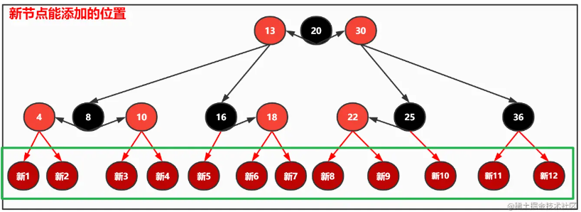
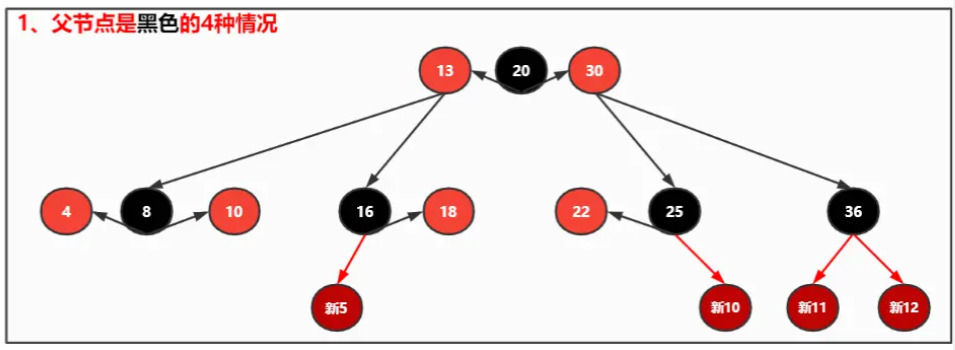
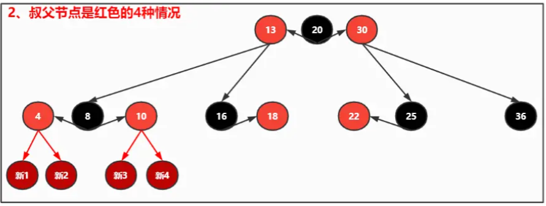
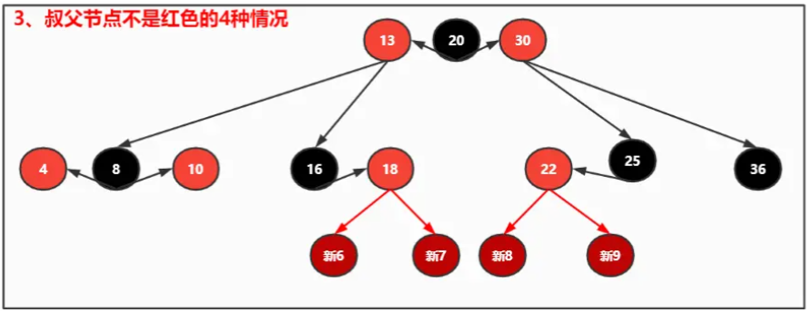

[toc]

# 一、二叉树

[如何构建一棵二叉搜索树？](https://juejin.cn/post/7168286143430000671)

## 1、二叉树、真二叉树、完全二叉树、满二叉树、二叉搜索树、平衡二叉树的概念

* 二叉树：每个结点最多有两个子树的有序树。
* 真二叉树：所有节点的出度都要么为0，要么为2，不能为1。
* 完全二叉树：叶节点只能出现在最底部的两层，且最底层叶节点均处于次底层叶节点的左侧。
* 满二叉树：每一层的节点数都达到饱和，树的结点数n=2^k^-1(k为二叉树的深度)。
* 二叉搜索树：中序有序的二叉树。
* 平衡二叉树：
    - 理想平衡：包含n个节点的二叉树，高度不可能小于floor(logn)。若树高恰好为floor(logn)，则称作理想平衡树。例如完全二叉树、满二叉树。
    - 适度平衡：在渐进意义下适当放松标准之后的二叉树。例如AVL树、红黑树。

## 2、引入二叉搜索树的原因

考虑在n个动态的整数中查找某一个整数：
* 假设使用动态数组存放元素，那就是从头开始遍历搜索，平均时间复杂度O(n)。
* 如果这 n 个数是一个有序的，那么使用二分法查找动态数组中的元素，最坏的时间复杂度O(logn)，但是添加、删除的平均复杂度是O(n)。
* 这时候，引入了高效的二叉搜索树，可以将添加、删除、搜索的最坏时间复杂度都优化至O(logn)。

## 3、二叉树的插入和删除

* 插入：先找到要插入的位置，然后进行插入
* 删除：如果要删除的节点的出度为2，先找到要删除节点的直接后继节点，将两者交换（于是要删除的节点就位于叶子上了），然后再删除。

# 二、AVL树

[透过AVL树的实现，学习树的旋转](https://juejin.cn/post/7172467470928707591)

AVL树：自平衡二叉搜索树，任一节点对应的两棵子树的高度差的绝对值不大于1。

AVL树的添加、删除、搜索的时间复杂度是O(h) = O(logn)。

## 1、AVL树的插入

AVL树在插入节点后，最坏情况下可能会导致它的所有祖先节点都失衡。仅仅需要在失衡节点中，找到**离添加节点最近的祖先节点**，将其修复，那么再上面的所有祖先节点都随之一起修复了。

插入节点后，要顺着插入节点的父节点依次遍历祖先节点：
* 如果是平衡的节点，那么它的高度肯定会发生变化，因为它的下面多了一个子孙节点，也就需要更新高度。
* 如果是失衡的节点，那么我们需要将它先恢复为平衡的节点，再去更新它的高度。

插入节点后旋转的情况有四种：
1. 在左子树的左子树添加元素（单旋）

2. 在右子树的右子树添加元素（单旋）

3. 在左子树的右子树添加元素（双旋）

4. 在右子树的左子树添加元素（双旋）

## 2、AVL树的删除

AVL树在删除节点后，也可能会导致节点失衡，但是最多有一个节点失衡，要么是父节点，要么是祖先节点。

删除后最多只有一个节点失衡的原因：当删除节点后某一个节点失衡了，那么肯定只能是该节点**较矮**的那边被删除了，这个时候**该失衡的节点整体高度是不变的**，那么在往上查找，也就不会有第二个失衡的节点了。

失衡的节点通过一次或者多次旋转后恢复平衡了，但是有可能导致失衡的父节点失衡，因此需要遍历至根节点，查找是否有失衡的节点，有就通过旋转操作进行重平衡。即**失衡可能会传递到根节点**。

缺点：由于删除之后失衡可能会传递到根节点，故删除操作之后的重平衡可能需做多达O(logn)次旋转，从而频繁地导致全树整体拓扑结构的大幅度变化。

# 三、红黑树

[初识红黑树](https://juejin.cn/post/7176536651651350589)
[红黑树的添加](https://juejin.cn/post/7177716251215527997)
[红黑树的删除](https://juejin.cn/post/7179080837726470202)

为了解决「AVL树删除操作之后的重平衡可能需做多达O(logn)次旋转，从而频繁地导致全树整体拓扑结构的大幅度变化」这个缺点，引出了红黑树。

红黑树通过为节点指定颜色，并巧妙地动态调整，可保证：在每次插入或删除操作之后的重平衡过程中，**全树拓扑结构的更新仅涉及常数个节点**。尽管最坏情况下需对多达O(logn)个节点重染色，但就分摊意义而言仅为O(1)个。

此外，红黑树还进一步放宽了AVL树种的适度平衡的标准，红黑树中的适度平衡标准可表述为：**任一节点左、右子树的高度，相差不得超过两倍**，从另一角度来说，**红黑树的平衡是一种黑高度平衡**（考虑和4阶B树的关系）。

红黑树的特征：
1. 节点是红色或者黑色的；
2. 根节点是黑色的；
3. 外部节点（假想出来的空节点）是黑色的；
4. 红色节点的父子节点均为黑色（不能有两个连续的红色节点）；
5. 从任一节点到其每个外部节点的所有路径都包含相同数目的黑色节点（这点保证了没有一条路径会比其它路径长出两倍）。

## 1、红黑树的插入

将红黑树的红节点上提，可以得到一个4阶B树，B树内部节点的颜色分布只可能是4种：红黑红、黑红、红黑、黑。

插入操作整体来说可以分为三种情况：
1. 父节点是黑色------不需要处理
    

2. 叔父节点是红色------通过合并解决
    将祖父节点置为红色，父节点和叔父节点置为黑色，然后进行4阶B树的上溢操作，将祖父节点上溢，直至无上溢情况出现。如果一直上溢到根节点，则需要将上溢结束后的根节点置成黑色。
    

3. 叔父节点不是红色------通过旋转解决
    先染色，再进行单旋或者双旋。
    

## 2、红黑树的删除

# 四、B树

[你心里有B树吗？](https://juejin.cn/post/7174639541272199226)

B树是一种**平衡的多路搜索树**，多用于文件系统、数据库的实现。查找数据、顺序访问、插入数据及删除的时间复杂度均为O(logn)。

m阶B树：
* 根节点的**分支数介于2和m之间**，根节点中包含的**关键码的个数介于1和m-1之间**。
* 每个内部节点的**分支数介于ceil(m/2)和m之间**，每个内部节点中包含的**关键码的个数介于ceil(m/2)-1和m-1之间**。

## 1、B树的插入 + 上溢与分裂

如果B树插入关键码后，某个节点中包含的关键码个数大于m-1，那么就需要进行上溢于分裂。假设该节点最中间元素的位置为 k，则解决方案是：
1. 将k位置的元素向上与父节点合并；
2. 将[0, k-1] 和 [k+1, m-1]位置的元素分裂成2个子节点。

## 2、B树的删除 + 下溢与合并

同二叉树的删除一样，先找到要删除关键码的直接后继关键码，将两者交换（于是要删除的节点就位于叶子上了），然后再删除。

下溢和合并分为三种情况：

1. V的左兄弟L存在，且至少包含ceil(m/2)个关键码

2. V的右兄弟R存在，且至少包含ceil(m/2)个关键码

3. V的左、右兄弟L和R或者不存在，或者其包含的关键码均不足ceil(m/2)个

# 五、日志结构合并树（LSM树）

[LSM 算法的原理是什么？](https://www.zhihu.com/question/19887265/answer/1714901833)

[LSM树详解](https://zhuanlan.zhihu.com/p/181498475)

LSM树（log-structured merge-tree）是一种对**频繁写操作**非常友好的数据结构，同时兼顾了查询效率。

LSM树是许多key-value型或日志型数据库所依赖的核心数据结构，例如BigTable、HBase、Cassandra、LevelDB、SQLite、Scylla、RocksDB等。

LSM树的核心特点是**利用顺序写来提高写性能**，但因为分层(此处分层是指的分为内存和文件两部分)的设计会稍微降低读性能，但是通过牺牲小部分读性能换来高性能写，使得LSM树成为非常流行的存储结构。

## LSM树与B树的对比

主流的关系型数据库均以B/B+树作为其构建索引的数据结构，这是因为B树提供了理论上最高的查询效率O(logn)。 

但对查询性能的追求也造成了B树的相应缺点，即每次插入或删除一条数据时，均需要更新索引，从而造成一次磁盘IO。这种特性决定了**B树只适用于频繁读、较少写的场景**。

如果在频繁写的场景下，将造成大量的磁盘IO，从而导致性能骤降。这种应用场景在传统的关系型数据库中比较常见。而LSM树则避免了频繁写场景下的磁盘IO开销，尽管其查询效率无法达到理想的O(log⁡n)，但依然非常快，可以接受。

所以从本质上来说，**LSM树相当于牺牲了一部分查询性能，换取了可观的写入性能**。这对于key-value型或日志型数据库是非常重要的。