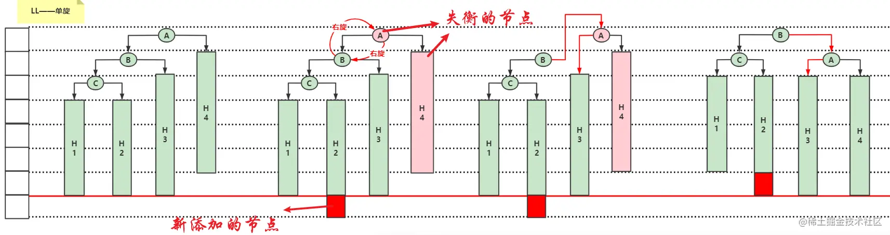
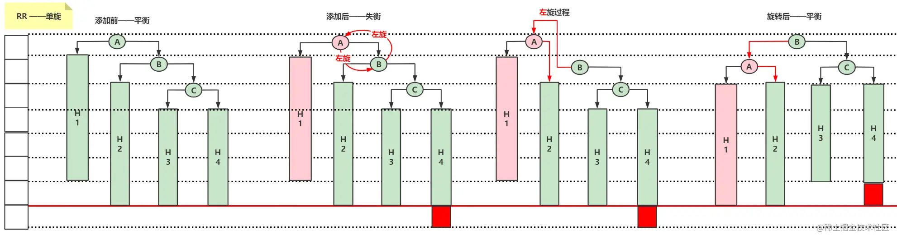
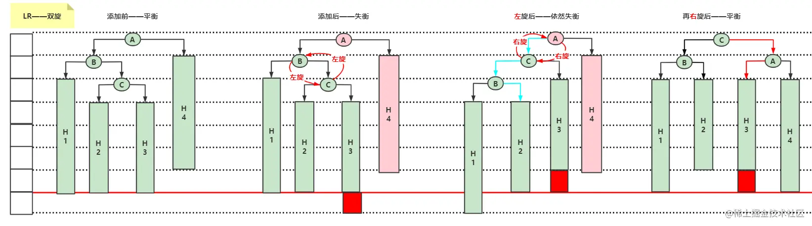
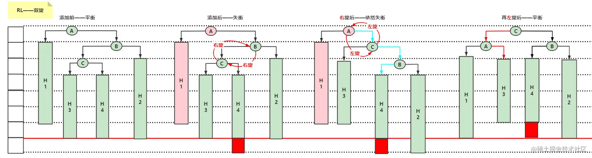
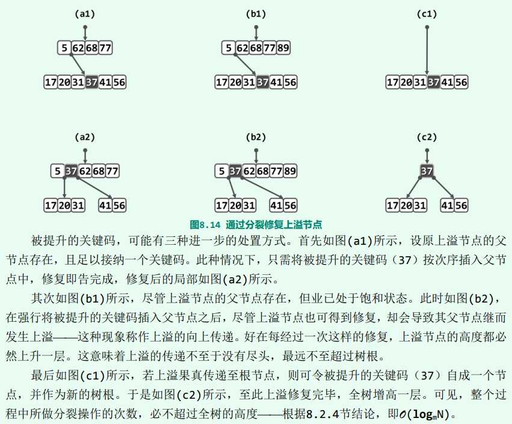
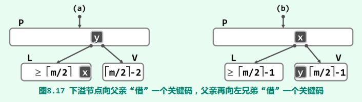
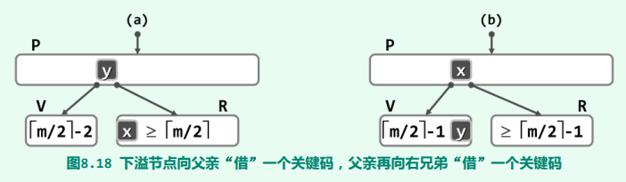
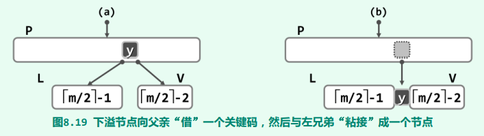

[toc]

# 二叉树

[如何构建一棵二叉搜索树？](https://juejin.cn/post/7168286143430000671)

## 二叉树、真二叉树、完全二叉树、满二叉树、二叉搜索树、平衡二叉树的概念

* 二叉树：每个结点最多有两个子树的有序树。
* 真二叉树：所有节点的出度都要么为0，要么为2，不能为1。
* 完全二叉树：叶节点只能出现在最底部的两层，且最底层叶节点均处于次底层叶节点的左侧。
* 满二叉树：每一层的节点数都达到饱和，树的结点数n=2^k^-1(k为二叉树的深度)。
* 二叉搜索树：中序有序的二叉树。
* 平衡二叉树：
    - 理想平衡：包含n个节点的二叉树，高度不可能小于ceil(logn)。若树高恰好为ceil(logn)，则称作理想平衡树。例如完全二叉树、满二叉树。
    - 适度平衡：在渐进意义下适当放松标准之后的二叉树。例如AVL树、红黑树。

## 引入二叉搜索树的原因

考虑在n个动态的整数中查找某一个整数：
* 假设使用动态数组存放元素，那就是从头开始遍历搜索，平均时间复杂度O(n)。
* 如果这 n 个数是一个有序的，那么使用二分法查找动态数组中的元素，最坏的时间复杂度O(logn)，但是添加、删除的平均复杂度是O(n)。
* 这时候，引入了高效的二叉搜索树，可以将添加、删除、搜索的最坏时间复杂度都优化至O(logn)。

## 二叉树的插入和删除

* 插入：先找到要插入的位置，然后进行插入
* 删除：先找到要删除节点的直接后继节点，将两者交换（于是要删除的节点就位于叶子上了），然后再删除。

# AVL树

[透过AVL树的实现，学习树的旋转](https://juejin.cn/post/7172467470928707591)

AVL树：自平衡二叉搜索树，任一节点对应的两棵子树的高度差的绝对值不大于1。

AVL树的添加、删除、搜索的时间复杂度是O(h) = O(logn)。

## AVL树的插入

AVL树在插入节点后，最坏情况下可能会导致它的所有祖先节点都失衡。仅仅需要在失衡节点中，找到**离添加节点最近的祖先节点**，将其修复，那么再上面的所有祖先节点都随之一起修复了。

插入节点后，要顺着插入节点的父节点依次遍历祖先节点：
* 如果是平衡的节点，那么它的高度肯定会发生变化，因为它的下面多了一个子孙节点，也就需要更新高度。
* 如果是失衡的节点，那么我们需要将它先恢复为平衡的节点，再去更新它的高度。

插入节点后旋转的情况有四种：
1. 在左子树的左子树添加元素（单旋）

2. 在右子树的右子树添加元素（单旋）

3. 在左子树的右子树添加元素（双旋）

4. 在右子树的左子树添加元素（双旋）

## AVL树的删除

AVL树在删除节点后，也可能会导致节点失衡，但是最多有一个节点失衡，要么是父节点，要么是祖先节点。

删除后最多只有一个节点失衡的原因：当删除节点后某一个节点失衡了，那么肯定只能是该节点**较矮**的那边被删除了，这个时候**该失衡的节点整体高度是不变的**，那么在往上查找，也就不会有第二个失衡的节点了。

失衡的节点通过一次或者多次旋转后恢复平衡了，但是有可能导致失衡的父节点失衡，因此需要遍历至根节点，查找是否有失衡的节点，有就通过旋转操作进行重平衡。即**失衡可能会传递到根节点**。

# B树

[你心里有B树吗？](https://juejin.cn/post/7174639541272199226)

B树是一种**平衡的多路搜索树**，多用于文件系统、数据库的实现。查找数据、顺序访问、插入数据及删除的时间复杂度均为O(logn)。

m阶B树：
* 根节点的**分支数介于2和m之间**，根节点中包含的**关键码的个数介于1和m-1之间**。
* 每个内部节点的**分支数介于floor(m/2)和m之间**，每个内部节点中包含的**关键码的个数介于floor(m/2)-1和m-1之间**。

## B树的插入 + 上溢与分裂

如果B树插入关键码后，某个节点中包含的关键码个数大于m-1，那么就需要进行上溢于分裂。假设该节点最中间元素的位置为 k，则解决方案是：
1. 将k位置的元素向上与父节点合并；
2. 将[0, k-1] 和 [k+1, m-1]位置的元素分裂成2个子节点。

## B树的删除 + 下溢与合并

同二叉树的删除一样，先找到要删除关键码的直接后继关键码，将两者交换（于是要删除的节点就位于叶子上了），然后再删除。

下溢和合并分为三种情况：

1. V的左兄弟L存在，且至少包含floor(m/2)个关键码

2. V的右兄弟R存在，且至少包含floor(m/2)个关键码

3. V的左、右兄弟L和R或者不存在，或者其包含的关键码均不足floor(m/2)个

