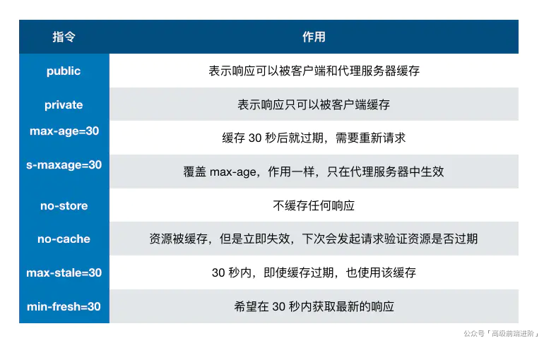
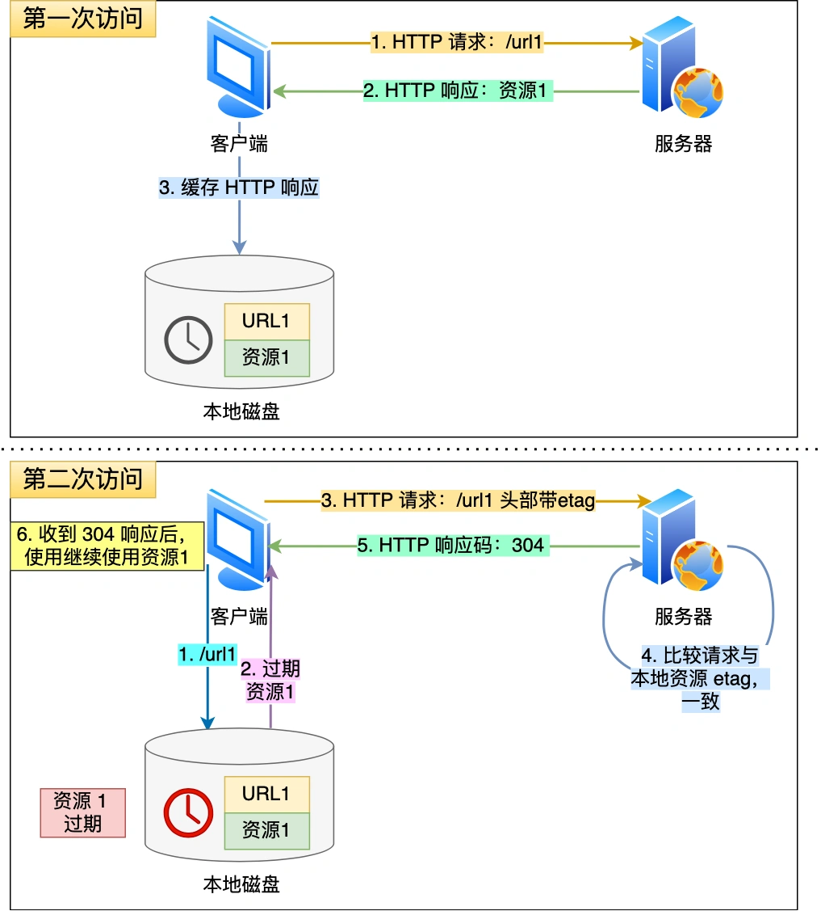
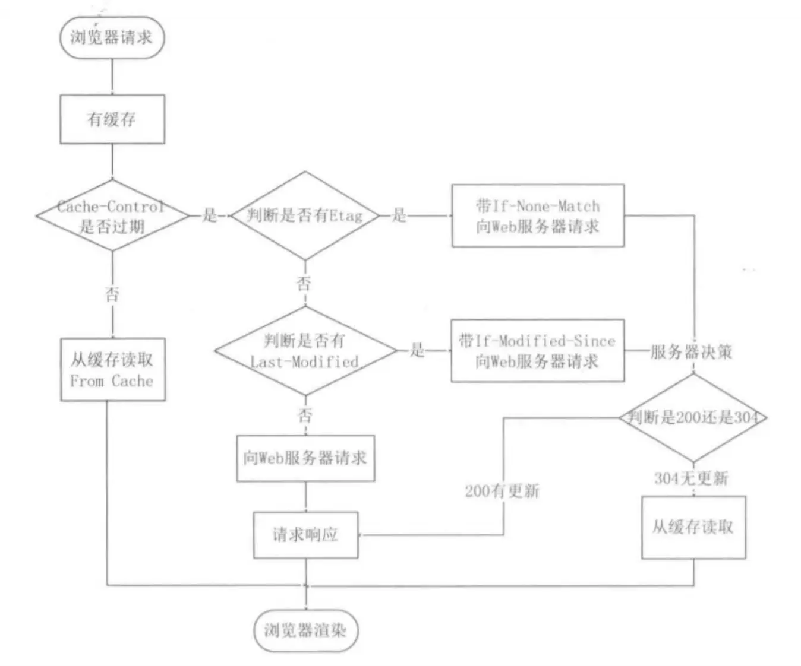
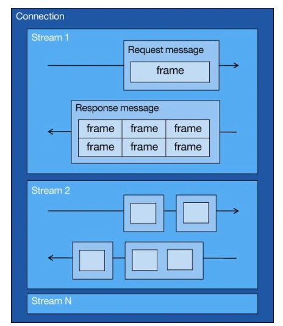

[toc]

# HTTP缓存技术

对于重复性的HTTP请求，可以将"请求-响应"的数据**缓存到浏览器本地**，下次再进行相同的请求时，直接读取本地缓存的数据，而不需要通过网络向服务器获取资源了。

HTTP缓存有两种实现方式：**强制缓存、协商缓存**

## 强制缓存

强缓存指的是只要浏览器判断缓存没有过期，则直接使用浏览器的本地缓存，决定是否使用缓存的主动性在于浏览器这边。

强制缓存是利用两个HTTP响应头部字段实现的，它们都用来表示资源在客户端缓存的有效期：
* `Cache-Control`，是一个相对时间；
* `Expires`，是一个绝对时间。

如果HTTP响应头部同时有Cache-Control和Expires字段的话，Cache-Control的优先级高于Expires。

使用Cache-Control进行强制缓存的流程：
1. 当浏览器第一次请求访问服务器资源时，服务器会在返回这个资源的同时，在HTTP响应报文头部加上Cache-Control，Cache-Control中设置了过期时间大小；
2. 浏览器再次请求访问服务器中的该资源时，会先通过请求资源的时间与Cache-Control中设置的过期时间大小，来计算出该资源是否过期，如果没有，则使用该缓存，否则重新请求服务器；
3. 服务器再次收到请求后，会再次更新响应报文头部的Cache-Control。

## 协商缓存

当强制缓存中的数据过期后，可以使用协商缓存来向服务器进行协商，由服务器告知浏览器已过期的本地缓存数据是否还能被使用。

协商缓存可以基于两种头部实现：
* 基于时间实现：请求头部的`If-Modified-Since`字段和响应头部的`Last-Modified`字段：
    - 响应头部中的`Last-Modified`：标识这个响应资源的最后修改时间；
    - 请求头部中的`If-Modified-Since`：当资源过期了，发现响应头中具有Last-Modified声明，则再次发起请求的时候带上Last-Modified的时间，服务器收到请求后发现有If-Modified-Since则与被请求资源的最后修改时间进行对比，如果资源被改过，则返回最新资源，HTTP 200 OK；如果资源无新修改，响应HTTP 304，浏览器使用本地缓存。

* 基于唯一标识实现：请求头部中的`If-None-Match`字段与响应头部中的`ETag`字段：
    - 响应头部中`Etag`：唯一标识响应资源；
    - 请求头部中的`If-None-Match`：当资源过期时，浏览器发现响应头里有Etag，则再次向服务器发起请求时，会将请求头If-None-Match值设置为Etag的值。服务器收到请求后进行比对，如果资源没有变化返回304，如果资源变化了返回200。

当浏览器的协商的请求报文中同时带有If-Modified-Since和If-None-Match字段，那么If-None-Match的优先级更高。先检查Etag是否有变化，如果有变化则不必再检查Last_Modified。

注意，**协商缓存这两个字段都需要配合强制缓存中Cache-Control字段来使用，只有在未能命中强制缓存的时候，才能发起带有协商缓存字段的请求**。

# HTTP/1.1、HTTP/2、HTTP/3演变

## HTTP/1.1相比于HTTP/1.0提高了什么性能？

HTTP/1.1相比于HTTP/1.0性能上的改进：
* 使用长连接，不必完成一次请求后就断开连接。
* 支持管道网络传输（流水线方式），不必等服务端响应就能发送下一个请求。

HTTP/1.1性能瓶颈：
* 请求/响应头部未经压缩就发送，首部信息越多延迟越大。只能压缩实体体部分。
* 发送冗长的首部。每次互相发送相同的首部造成较多浪费。
* 服务器是按请求的顺序响应的，如果服务器响应慢，会导致客户端一直请求不到数据，造成响应队头阻塞。
* 没有请求的优先级控制。
* 请求只能从客户端开始，服务器只能被动响应。

## HTTP/2做了什么优化？

HTTP/2协议是基于HTTPS的，所以HTTP/2的安全性也是有保障的。

HTTP/2相比于HTTP/1.1性能上的改进：
* 头部压缩：如果同时发出的多个请求的头部是一样的或者相似的，那么HTTP/2会压缩头，消除重复的部分。即在客户端和服务器同时维护一张头信息表，所有字段都存入这个表，并生成一个索引号。发送时只需发送索引号即可，就可以提高速度。
* 二进制格式：HTTP/2全面采用二进制格式，头信息和数据体都是二进制，并统称为帧（头信息帧、数据帧）。计算机无需再将明文的报文转换为二进制，增加了数据传输的效率。
* 并发传输：为解决HTTP/1.1中的队头阻塞问题，HTTP/2中引出Stream概念，多个Stream复用一条TCP连接。
    
    1个TCP连接包含多个Stream，Stream里可以包含1个或多个Message，Message对应HTTP/1中的请求或响应，由HTTP头部和包体构成。Message里包含一条或者多个Frame，Frame是HTTP/2最小单位，以二进制压缩格式存放HTTP/1中的内容（头部和包体）。
* 消息推送：HTTP/2改善了传统的"请求-应答"模式，使服务器也可以主动向客户端发送消息。
    服务器和客户端都可以创建Stream，客户端建立的Stream的ID必须是奇数号，而服务器建立的Stream的ID必须是偶数号。

HTTP/2的缺陷：
虽然HTTP/2层面上没有了队头阻塞，但是在TCP层面依旧存在队头阻塞的问题（TCP的累计确认机制，会导致某一个报文段丢失后，后续的报文段都无法被确认，造成了队头阻塞）。

## HTTP/3做了哪些优化？

由于HTTP/2在TCP层面上依旧存在队头阻塞，HTTP/3将下层的TCP协议改成了UDP协议，同时在应用层使用QUIC协议保证UDP的可靠传输。

QUIC协议的特点：
* 无队头阻塞
* 更快建立连接
* 连接迁移

**HTTP/3.0相较于HTTP/2.0的改进**:
HTTP/3.0采用了基于UDP的QUIC协议。

* 1RTT快速握手与0RTT快速恢复连接：
  - 对于HTTP/2.0使用的TLS1.2而言、TCP与TLS是分层的，分别属于内核实现的传输层与openssl库实现的表示层（应用层下面一层），因此他们难以合并，需要分批次握手。
  - 而对于HTTP/3.0的QUIC协议并没有与TLS分层，而是QUIC内部包含了TLS，使用的版本是TLS1.3，TLS1.3握手只需要1RTT，QUIC协议握手只需要1RTT（交换连接ID），而由于QUIC协议内部包含了TLS，故TLS握手与QUIC握手可以同步进行，共需要1RTT。（QUIC协议底层使用了UDP，没有TCP的握手过程）
  - 使用Pre-shared Key技术，使得QUIC协议实现0RTT快速恢复连接
- 网络变动连接无需迁移：QUIC连接采用pre-shared技术，原理类似于session ticket，用户方会缓存以往对话经服务器私钥加密后的会话秘钥以及该对话的session ticket，网络发生变动时，会在client hello内携带session ticket与会话秘钥，与第一次的HTTP请求一起发送，服务器验证未过期后直接建立连接，进行对请求的回应。
- 改进拥塞控制：TCP慢启动会导致建立连接初期通信较慢，而QUIC协议实际上在应用层实现拥塞算法，能够根据具体业务场景控制拥塞程度
- 双级别流控：TCP通过滑动窗口机制实现流量控制，QUIC更新了滑动窗口机制，在UDP层与数据流层两个级别分别进行流量控制，UDP连接的窗口大小是所有数据流窗口大小的总和
- 没有队头阻塞的多路复用：UDP协议不存在队头阻塞，若某个数据流发生丢包时，只会阻塞此流，其他流不会受影响
- 更新迭代便捷：可以理解为将TCP层的更新工作搬迁至应用层，更新更加轻便快捷
- 采用了更先进的头部压缩Q-PACK算法

# 网络攻击

## DDos攻击

客户端向服务端发送请求链接数据包，服务端向客户端发送确认数据包，客户端不向服务端发送确认数据包，大量的半连接导致服务器瘫痪。

没有彻底根治的办法，除非不使用TCP
DDos 预防：
1. 限制同时打开SYN半链接的数目。
2. 缩短SYN半链接的Time out时间。
3. 关闭不必要的服务。

## SYN洪泛攻击

SYN洪泛攻击是一种典型的DoS攻击（拒绝服务攻击），其效果就是使服务器的连接资源耗尽，无法响应正常的TCP连接请求。

服务器端的资源分配是在二次握手时分配的，而客户端的资源是在完成三次握手时分配的，所以服务器容易受到SYN洪泛攻击。

SYN洪泛攻击的原理与实现：
攻击方在短时间内伪造大量不存在的IP地址，并向服务器不断地发送SYN请求报文，服务器则回复确认报文，为这些半开连接分配资源，并等待客户端确认，由于源地址不存在，因此服务器需要不断重发直至超时，这些伪造的SYN包将长时间占用未连接队列，导致服务器的连接资源被耗尽，正常的SYN请求因为队列满而被丢弃，从而引起网络拥塞甚至系统瘫痪。

SYN攻击检测：
通过`netstat -n -p TCP | grep SYN_RECV`命令检测，如果服务器上存在大量的半连接状态时，特别是源IP地址是随机的，基本上可以断定这是一次SYN攻击。

常见的防御SYN攻击的方法有如下几种：
* 缩短超时（SYN Timeout）时间
* 增加最大半连接数
* 过滤网关防护
* SYN cookies技术：当服务器接收到一个SYN请求报文后，不会为其生成一个半开连接，而是生成一个cookie值，将这个cookie值作为初始序列号给客户端发送确认报文。如果客户是合法的，那么会返回一个确认报文，于是服务器再为客户请求的连接分配资源；如果客户不合法，则不会分配任何资源。