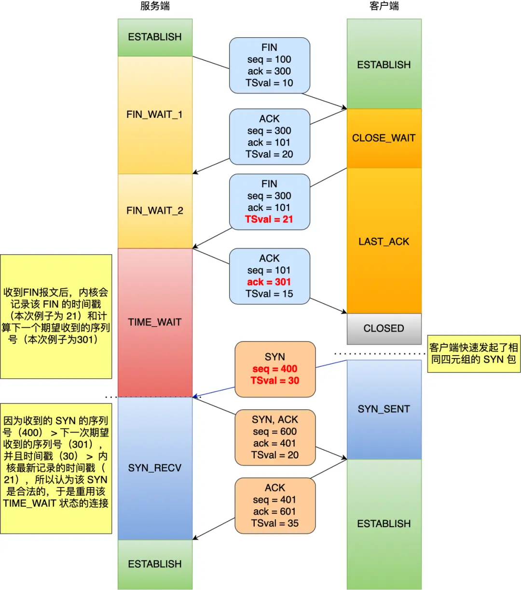

[toc]

# TCP简介

## TCP头部格式

TCP头部格式（固定部分20字节）：源端口号（16位）、目的端口号（16位）、序列号（32位）、确认号（32位）、首部长度（4位）、SYN（1位）、ACK（1位）、RST（1位）、FIN（1位）、接收窗口长度（16位）、校验和（16位）、紧急指针（16位）

序列号：用于解决网络包乱序的问题
确认号：用于解决丢包的问题


UDP首部格式（8字节）：源端口号（16位）、目的端口号（16位）、UDP包长度（16位）、校验和（16位）


## 为何需要TCP协议

IP层是不可靠的，它不保证网络包的交付、不保证网络包的按序交付、也不保证网络包中的数据的完整性。如果需要保障网络数据包的可靠性，那么就需要由上层（传输层）的TCP协议来负责。

因为TCP是一个工作在传输层的可靠数据传输的服务，它能确保接收端接收的网络包是无差错、不丢失、不重复、按需到达。


## 如何确定一个TCP连接

TCP四元组：源IP + 源端口号 + 目的IP + 目的端口

最大TCP连接数 = 客户端IP数 * 客户端端口数

最大TCP连接数实际受以下因素影响：
- 文件描述符限制
- 内存限制


## TCP和UDP可以使用同一个端口

传输层有两个传输协议分别是TCP和UDP，在内核中是两个完全独立的软件模块。

当主机收到数据包后，可以在IP包头的协议号字段知道该数据包是TCP/UDP，所以可以根据这个信息确定送给哪个模块（TCP/UDP）处理，送给TCP/UDP模块的报文根据端口号确定送给哪个应用程序处理。


# TCP三次握手

## 不使用两次/四次握手的原因

三次握手能够保证：
* 确认双方均有收发能力
* 避免历史连接重新初始化连接
* 同步双方的序列号
* 避免资源浪费


## 为什么每次建立TCP连接时，初始化的序列号都要求不一样？

* 防止历史报文被下一个相同的四元组连接接收。
* 防止黑客伪造相同的序列号的TCP报文被对方接收。

初始序列号随机产生的方法：
初始序列号 = 时钟 + Hash(源IP，源端口，目的IP，目的端口)

序列号是32位的，因此最大值为4G，当到达最大值后会发生回绕（循环到0），这意味着**无法根据序列号来判断新老数据**。
为了解决这个问题，就需要有**TCP时间戳**。tcp_timestamps 参数是默认开启的，开启了tcp_timestamps参数，TCP头部就会使用时间戳选项，**时间戳有两个好处，一个是便于精确计算RTT，另一个是能防止序列号回绕（PAWS）**。


## TCP序列号和确认号是怎么变化的？

发送的 TCP 报文：
* 序列号 = 上一次发送的序列号 + len（数据长度）。特殊情况，如果上一次发送的报文是 SYN 报文或者 FIN 报文，则改为 上一次发送的序列号 + 1。
* 确认号 = 上一次收到的报文中的序列号 + len（数据长度）。特殊情况，如果收到的是 SYN 报文或者 FIN 报文，则改为上一次收到的报文中的序列号 + 1。


## 既然IP层会分片，为什么TCP层还需要MSS分片?

因为当如果一个IP分片丢失，整个IP报文的所有分片都得重传，效率低下。而在TCP层分片，一个TCP报文段丢失，那么就只需要重传丢失的分片即可。


## 第一次握手丢失了，会发生什么？

会触发**超时重传**机制，重传SYN报文，而且重传的SYN报文的序列号都是一样的。每次超时的时间是上一次的2倍。达到最大重传次数后，会继续等待一段时间（上一次超时时间的2倍），如果还是没有收到确认报文，则断开TCP连接。

在Linux里，客户端的SYN报文最大重传次数由`tcp_syn_retries`内核参数控制，这个参数是可以自定义的，默认值一般是5。


## 第二次握手丢失了，会发生什么？

客户端收不到第二次握手的报文段，会认为自己的发出的第一次握手的报文段丢失了，于是重传SYN报文。最大重传次数由`tcp_syn_retries`内核参数控制。
服务器端收不到第三次握手的报文段，会认为自己发出的第二次握手报文段丢失，于是重传SYN_ACK报文。最大重传次数由`tcp_synack_retries`内核参数控制。


## 第三次握手丢失了，会发生什么？

如果服务器端收不到客户端发来的第三次握手的确认报文，那么服务器端就会重传SYN_ACK报文。
注意：如果客户端发送的第三次握手报文中没有携带数据，那么客户端是不会重传这个第三次握手的报文的（**ACK报文是不会有重传的，当ACK丢失了，就由对方重传对应的报文**）。


# TCP四次挥手

## 第一次挥手丢失了，会发生什么？

会触发超时重传机制，重传FIN报文，重发次数由`tcp_orphan_retries`参数控制。如果经过重传后还是无法接收到确认报文，那么直接进入close状态。


## 第二次挥手丢失了，会发生什么？

由于ACK报文是不会重传的，所以如果服务端的第二次挥手丢失了，只有客户端会触发超时重传机制，重传FIN报文，直到收到服务端的第二次挥手，或者达到最大的重传次数。


## 第三次挥手丢失了，会发生什么？

会触发超时重传机制，重传FIN报文，重发次数由`tcp_orphan_retries`参数控制。如果经过重传后还是无法接收到确认报文，那么直接进入close状态。和第一次挥手丢失的控制方式一样的。


## 第四次挥手丢失了，会发生什么？

服务器端收不到第四次挥手的报文，那么就会重传FIN报文，重发次数仍然由`tcp_orphan_retries`参数控制。客户端接收到了重传的FIN报文后，会重启2MSL计时。


## 为什么TIME_WAIT的等待时间为2MSL？

* 如果发生重传，确保重传的FIN报文能够到达客户端。
* 如果未发生重传，确保网络中该链接的所有历史报文都能消失。


## TIME_WAIT 过多有什么危害？

* 占用系统资源，比如文件描述符、内存资源、CPU 资源、线程资源等；
* 占用端口资源，端口资源也是有限的，一般可以开启的端口为32768～61000，也可以通过`net.ipv4.ip_local_port_range`参数指定范围。

在客户端存在大量TINE_WAIT：
占满了所有端口资源，那么就无法对「目的 IP+ 目的 PORT」都一样的服务端发起连接了，但是被使用的端口，还是可以继续对另外一个服务端发起连接的。

在服务端存在大量TINE_WAIT：
会占用系统资源，比如文件描述符、内存资源、CPU 资源、线程资源等。


## 服务器出现大量 TIME_WAIT 状态的原因有哪些？

短时间内服务器端主动关闭了大量连接。

服务器端主动关闭连接的场景：
1. HTTP没有使用长连接
2. HTTP长连接超时
3. HTTP长连接接收的请求数量达到上限


## 服务器出现大量 CLOSE_WAIT 状态的原因有哪些？

当服务端出现大量 CLOSE_WAIT 状态的连接的时候，说明服务端的程序没有调用 close 函数关闭连接（通常都是代码的问题）。


## 如果已经建立了连接，但是客户端突然出现故障了怎么办？

客户端出现故障指的是客户端的主机发生了宕机，或者断电的场景。

发生这种情况的时候，如果服务端一直不会发送数据给客户端，那么服务端是永远无法感知到客户端宕机这个事件的，也就是服务端的 TCP 连接将一直处于 ESTABLISH 状态，占用着系统资源。

**TCP保活机制**用于处理这种情况：定义一个时间段，在这个时间段内，如果没有任何连接相关的活动，TCP 保活机制会开始作用，每隔一个时间间隔，发送一个探测报文，该探测报文包含的数据非常少，如果连续几个探测报文都没有得到响应，则认为当前的 TCP 连接已经死亡，系统内核将错误信息通知给上层应用程序。

如果开启了 TCP 保活，需要考虑以下几种情况：
1. 对端程序是正常工作的。当 TCP 保活的探测报文发送给对端, 对端会正常响应，这样 TCP 保活时间会被重置，等待下一个 TCP 保活时间的到来。
2. 对端主机宕机并重启。当 TCP 保活的探测报文发送给对端后，对端是可以响应的，但由于没有该连接的有效信息，会产生一个 RST 报文，这样很快就会发现 TCP 连接已经被重置。
3. 对端主机宕机（注意不是进程崩溃，进程崩溃后操作系统在回收进程资源的时候，会发送 FIN 报文，而主机宕机则是无法感知的，所以需要 TCP 保活机制来探测对方是不是发生了主机宕机），或对端由于其他原因导致报文不可达。当 TCP 保活的探测报文发送给对端后，石沉大海，没有响应，连续几次，达到保活探测次数后，TCP 会报告该 TCP 连接已经死亡。


## 如果已经建立了连接，但是服务端的进程崩溃会发生什么？

TCP 的连接信息是由内核维护的，所以当服务端的进程崩溃后，内核需要回收该进程的所有 TCP 连接资源，于是内核会发送第一次挥手 FIN 报文，后续的挥手过程也都是在内核完成，并不需要进程的参与，所以即使服务端的进程退出了，还是能与客户端完成 TCP 四次挥手的过程。


# Socket编程


1. 服务端和客户端初始化 socket，得到文件描述符；
2. 服务端调用 bind，将 socket 绑定在指定的 IP 地址和端口；
3. 服务端调用 listen，进行监听；
4. 服务端调用 accept，等待客户端连接；
5. 客户端调用 connect，向服务端的地址和端口发起连接请求；
6. 服务端 accept 返回用于传输的 socket 的文件描述符；
7. 客户端调用 write 写入数据；服务端调用 read 读取数据；
8. 客户端断开连接时，会调用 close，那么服务端 read 读取数据的时候，就会读取到了 EOF，待处理完数据后，服务端调用 close，表示连接关闭。


## accept发生在三次握手的哪一步？


客户端 connect 成功返回是在第二次握手，服务端 accept 成功返回是在三次握手成功之后（也就是说connect、accept都会被阻塞）。


## 客户端调用 close 了，连接是断开的流程是什么？


服务端接收到了 FIN 报文，**TCP 协议栈会为 FIN 包插入一个文件结束符 EOF 到接收缓冲区中**，应用程序可以通过 read 调用来感知这个 FIN 包。这个 EOF 会被放在已排队等候的其他已接收的数据之后，这就意味着服务端需要处理这种异常情况，因为 EOF 表示在该连接上再无额外数据到达。


## 没有 accept，能建立 TCP 连接吗？

**可以！**

accpet 系统调用并不参与 TCP 三次握手过程，它**只是负责从 TCP 全连接队列取出一个已经建立连接的 socket**，用户层通过 accpet 系统调用拿到了已经建立连接的 socket，就可以对该 socket 进行读写操作了。


## 没有 listen，能建立 TCP 连接吗？

如果服务器端没有listen，那么则不能建立TCP连接。客户端对服务端发起了连接建立，服务端会回RST报文。

但是没有listen，是可以建立TCP连接的。有以下两个场景：
* 客户端是可以自己连自己的形成连接（TCP自连接）
* 两个客户端同时向对方发出请求建立连接（TCP同时打开）

这两个情况都有个共同点，就是没有服务端参与，也就是没有listen，就能建立连接。其原因为：
- 因为在**执行listen方法时，会创建半连接队列和全连接队列**。三次握手的过程中会在这两个队列中暂存连接信息。所以形成连接，前提是你得有个地方存放着，方便握手的时候能根据IP端口等信息找到socket信息。
- **客户端调用connect()并不会创建半连接队列与全连接队列**，服务端在调用listen()后内核才会为该套接字创建半连接队列与全连接队列。

TCP协议除了支持主动打开的socket和被动打开的socket之间连接，也支持两个主动打开的socket之间的互连，即两个主动打开的socket同时向对方发起connect() ，此时并不需要有socket在监听。
* TCP自连接：
    流程：客户端调用bind()，绑定本地回环地址与指定端口，然后调用connect()发送，然后将tcp_sock放入bhash与ehash。SYN报文经虚拟网卡又转回本地，然后根据SYN报文中的dst IP + dst port在ehash中寻找并命中，然后直接建立连接。
    ehash相关详解 https://zhuanlan.zhihu.com/p/25313903
    ```C++
    #include <sys/types.h> 
    #include <sys/socket.h>
    #include <netinet/in.h>
    #include <unistd.h>
    #include <stdlib.h>
    #include <stdio.h>
    #include <string.h>
    #include <errno.h>

    #define LOCAL_IP_ADDR		(0x7F000001) // IP 127.0.0.1
    #define LOCAL_TCP_PORT		(34567) // 端口

    int main(void)
    {
        struct sockaddr_in local, peer;
        int ret;
        char buf[128];
        int sock = socket(AF_INET, SOCK_STREAM, 0);

        memset(&local, 0, sizeof(local));
        memset(&peer, 0, sizeof(peer));

        local.sin_family = AF_INET;
        local.sin_port = htons(LOCAL_TCP_PORT);
        local.sin_addr.s_addr = htonl(LOCAL_IP_ADDR);

        peer = local;	

        int flag = 1;
        ret = setsockopt(sock, SOL_SOCKET, SO_REUSEADDR, &flag, sizeof(flag));
        if (ret == -1) {
            printf("Fail to setsocket SO_REUSEADDR: %s\n", strerror(errno));
            exit(1);
        }

        ret = bind(sock, (const struct sockaddr *)&local, sizeof(local));
        if (ret) {
            printf("Fail to bind: %s\n", strerror(errno));
            exit(1);
        }
        
        ret = connect(sock, (const struct sockaddr *)&peer, sizeof(peer));
        if (ret) {
            printf("Fail to connect myself: %s\n", strerror(errno));
            exit(1);
        }
        
        printf("Connect to myself successfully\n");

        //发送数据
        strcpy(buf, "Hello, myself~");
        send(sock, buf, strlen(buf), 0);

        memset(buf, 0, sizeof(buf));
        
        //接收数据
        recv(sock, buf, sizeof(buf), 0);
        printf("Recv the msg: %s\n", buf);

        sleep(1000);
        close(sock);
        return 0;
    }
    ```
* TCP同时打开：
    只有部分操作系统支持此种方式建立与关闭连接。双端既是客户端又是服务端。
    同时打开：双方几乎同时发送SYN报文，收到后再回应SYN+ACK报文。
    同时关闭：双方几乎同时发送FIN+ACK报文，收到后再回应ACK报文。
    
    


# TCP重传机制

## 超时重传的超时时间RTO设置得过大/过小会有什么问题？

* RTO设置过大：丢包后过了太久才会重传，降低了网络的传输效率。
* RTO设置过小：可能会导致数据包尚未到达对端就进行了重传，导致网络拥塞，导致更多的超时，进而导致更严重的拥塞。

因此，超时重传时间 RTO 的值应该**略大于**报文往返 RTT 的值。

如果超时重发的数据，再次超时的时候，又需要重传的时候，TCP 的策略是**超时间隔加倍**（说明网络环境差，不宜频繁地重传）。


## SACK方法（选择性重传）

快速重传的缺点：
当客户端收到的服务器端发送的连续三个相同的ACK号时，就能判断对应的数据包已经丢失，于是不用等待超时时间到，就立刻重传该报文。但是重传时面临一个问题：**是只重传ACK号对应的那个报文，还是重传ACK号以及它之后所有已发送过的报文**？
这两种方法都有不妥：
- 如果只选择重传一个报文，那么重传的效率很低。因为对于丢失的报文可能不止一个，还得在后续收到三个重复的ACK号才能触发重传。
-如果选择重传已发送的所有报文，虽然能同时重传多个已丢失的报文，但是也会重传已经被接收过的报文，浪费资源。

于是提出了选择性重传方法（SACK）：
* 全局参数net.ipv4.tcp_sack开启。
* ACK报文的TCP头部选项字段添加SACK，只能应用于SYN报文段，在连接建立阶段，**主动连接方在它的SYN报文中指定是否开启SACK**
* SACK告诉对端的信息是：我**已经收到的数据的信息**
  - 我的接收缓冲区内，缺失部分紧邻的后续连续区间，报告方式是左开右闭
* **SACK最多放置4个缺失部分紧邻的后续连续区间**
  - 比如接收缓冲区内现在有0-499，1000-1499，2000-2500，3000-3500，4000-4500，5000-5500，
  - SACK = 1000-1499，2000-2500，3000-3500，4000-4500（最多四个）


# TCP流量控制

## 糊涂窗口综合征

如果接收方腾出几个字节并告诉发送方现在有几个字节的窗口，而发送方会义无反顾地发送这几个字节，这就是糊涂窗口综合症。

糊涂窗口综合症的现象是可以发生在发送方和接收方：接收方可以通告一个小的窗口，而发送方可以发送小数据。

要解决糊涂窗口综合症，就要同时解决两个问题：
- 让接收方不通告小窗口给发送方：当窗口大小小于min(MSS，缓存空间/2)时，就会向发送方通告窗口大小为0。
- 让发送方避免发送小数据：使用Nagle算法，延时处理，将小包合并为大包再发送。
    Nagle需要满足以下条件中的任意一个才会发送数据：
    1. 要等到窗口大小 >= MSS 并且 数据大小 >= MSS；
    2. 收到之前发送数据的 ack 回包。

注意，如果接收方不能满足「不通告小窗口给发送方」，那么即使开了 Nagle 算法，也无法避免糊涂窗口综合症，因为如果对端 ACK 回复很快的话（达到 Nagle 算法的条件二），Nagle 算法就不会拼接太多的数据包，这种情况下依然会有小数据包的传输，网络总体的利用率依然很低。

所以，接收方得满足「不通告小窗口给发送方」+ 发送方开启 Nagle 算法，才能避免糊涂窗口综合症。

另外，Nagle 算法默认是打开的，如果对于一些需要小数据包交互的场景的程序，比如，telnet 或 ssh 这样的交互性比较强的程序，则需要关闭 Nagle 算法。

可以在 Socket 设置 TCP_NODELAY 选项来关闭这个算法（关闭 Nagle 算法没有全局参数，需要根据每个应用自己的特点来关闭）。


# TCP优化

## 三次握手的性能提升

* 客户端优化：根据网络的稳定性和目标服务器的繁忙程度修改 SYN 的重传次数，调整客户端的三次握手时间上限(当网络繁忙、不稳定时，报文丢失就会变严重，此时应该调大重发次数，反之调小)。
* 服务端优化：调整半连接队列、全连接队列的大小，调整SYN_ACK的重发次数。
* 绕过三次握手：TCP Fast Open功能（需要客户端和服务端同时支持）。

TCP Fast Open功能流程：
- 在客户端首次建立连接时的过程：
    1. 客户端发送 SYN 报文，该报文包含 Fast Open 选项，且该选项的 Cookie 为空，这表明客户端请求 Fast Open Cookie；
    2. 支持 TCP Fast Open 的服务器生成 Cookie，并将其置于 SYN-ACK 数据包中的 Fast Open 选项以发回客户端；
    3. 客户端收到 SYN-ACK 后，本地缓存 Fast Open 选项中的 Cookie。
- 如果客户端再次向服务器建立连接时的过程：
    1. 客户端发送 SYN 报文，该报文包含「数据」（对于非 TFO 的普通 TCP 握手过程，SYN 报文中不包含「数据」）以及此前记录的 Cookie；
    2. 支持 TCP Fast Open 的服务器会对收到 Cookie 进行校验：如果 Cookie 有效，服务器将在 SYN-ACK 报文中对 SYN 和「数据」进行确认，服务器随后将「数据」递送至相应的应用程序；如果 Cookie 无效，服务器将丢弃 SYN 报文中包含的「数据」，且其随后发出的 SYN-ACK 报文将只确认 SYN 的对应序列号；
    3. 如果服务器接受了 SYN 报文中的「数据」，服务器可在握手完成之前发送「数据」，这就减少了握手带来的 1 个 RTT 的时间消耗；
    4. 客户端将发送 ACK 确认服务器发回的 SYN 以及「数据」，但如果客户端在初始的 SYN 报文中发送的「数据」没有被确认，则客户端将重新发送「数据」。


## 四次挥手的性能提升

* 主动关闭方的优化：
    1. FIN_WAIT1状态的优化：调整主动关闭方的FIN报文的重传次数、调整孤儿连接（调用了close的连接）的最大数量。
    2. FIN_WAIT2状态的优化：调整FIN_WAIT2状态的持续时间（超时后直接关闭连接）。
    3. TIME_WAIT状态的优化：参考出现大量TIME_WAIT状态连接的解决方案
* 被动关闭方的优化：检查程序问题（存在大量CLOSE_WAIT）、整被动关闭方的FIN报文的重传次数。
* 传输数据性能的优化：扩大窗口大小、调整发送缓冲区范围、调整接收缓冲区范围、打开接收缓冲区动态调节、调整内存范围


# 网络异常相关

## 为什么 TCP 每次建立连接时，初始化序列号都要不一样呢？

* 防止历史报文被下一个相同的四元组连接接收。
* 防止黑客伪造相同的序列号的TCP报文被对方接收。

初始序列号随机产生的方法：
初始序列号 = 时钟 + Hash(源IP，源端口，目的IP，目的端口)

序列号是32位的，因此最大值为4G，当到达最大值后会发生回绕（循环到0），这意味着**无法根据序列号来判断新老数据**。
为了解决这个问题，就需要有**TCP时间戳**。tcp_timestamps 参数是默认开启的，开启了tcp_timestamps参数，TCP头部就会使用时间戳选项，**时间戳有两个好处，一个是便于精确计算RTT，另一个是能防止序列号回绕（PAWS）**。


## SYN 报文什么时候情况下会被丢弃？

* 使用NAT网络并且开启了`tcp_tw_recycle`选项，导致开启了pre-host的PAWS机制（只对对端IP做PAWS检查）：
    - 当客户端存在大量的TIME_WAIT状态连接的时候，可以开启`tcp_tw_recycle`选项，使得处于TIME_WAIT状态的连接被快速回收（前提是要开启时间戳选项）；
    - 而开启时间戳可以处理序列号回绕的情况，如果发现收到的数据包中时间戳不是递增的，则表示该数据包是过期的，就会直接丢弃这个数据包；
    - 由于客户端网络环境使用了NAT网关，那么客户端环境的每一台机器通过NAT网关后，都会是相同的IP地址，在服务端看来，就好像只是在跟一个客户端打交道一样，无法区分出来；
    - 当客户端A通过NAT网关和服务器建立TCP连接，然后服务器主动关闭并且快速回收TIME-WAIT状态的连接后，客户端B也通过NAT网关和服务器建立TCP连接，注意客户端A和客户端B因为经过相同的NAT网关，所以是用相同的IP地址与服务端建立TCP连接，如果客户端B的timestamp比客户端A的timestamp小，那么由于服务端的per-host的PAWS机制的作用，服务端就会丢弃客户端主机B发来的SYN包。
    - 如果它是对TCP四元组做PAWS检查，而不是对「相同的IP做PAWS检查」，那么就不会存在这个问题了。

* 半连接队列满了，导致新到来的SYN报文被丢弃。
    可以使用tcp_syncookies，那么SYN报文不会被丢弃，而是生成一个syncookie作为SYN_ACK报文的序列号，如果能够收到ACK报文才创建TCP全连接。

* 全连接队列满了，新到来的SYN报文也会被丢弃。


## 已建立连接的TCP，收到SYN会发生什么？

1. 客户端的SYN报文里的端口号与历史连接不相同:
    此时四元组不同，服务器认为是新的连接，然后进行三次握手建立连接。旧连接中处于ESTABLISH状态的服务器端向客户端发送数据或者检测报文（TCP保活机制）时，客户端会因为旧的连接已经关闭而发送RST报文，使服务器的历史连接释放掉。

2. 客户端的SYN报文里的端口号与历史连接相同：
    处于Established状态的服务端，如果收到了客户端的SYN报文（注意此时的SYN报文其实是随机的，并不是已连接TCP中的那个序列号），会回复一个携带了正确序列号和确认号的ACK报文，紧接着客户端收到这个ACK报文，发现确认号并不是自己期望收到的，于是就会回RST报文，服务端收到后，就会释放掉该连接。
    


引申：如何关闭一个TCP连接？
如果处于 Established 状态的服务端，收到四元组相同的 SYN 报文后，会回复一个 Challenge ACK，这个 ACK 报文里的「确认号」，正好是服务端下一次想要接收的序列号，说白了，就是可以通过这一步拿到服务端下一次预期接收的序列号。然后用这个确认号作为 RST 报文的序列号，发送给服务端，此时服务端会认为这个 RST 报文里的序列号是合法的，于是就会释放连接！


## 四次挥手中收到乱序的FIN包会如何处理？

在FIN_WAIT2状态时，如果收到乱序的FIN报文，那么就被会加入到「乱序队列」，并不会进入到TIME_WAIT状态。

等再次收到前面被网络延迟的数据包时，会判断乱序队列有没有数据，然后会检测乱序队列中是否有可用的数据，如果能在乱序队列中找到与当前报文的序列号保持的顺序的报文，就会看该报文是否有FIN标志，如果发现有FIN标志，这时才会进入TIME_WAIT状态。


## 在TIME_WAIT状态的TCP连接，收到SYN后会发生什么？

这个问题关键是要看SYN的「序列号和时间戳」是否合法，
- 合法SYN：客户端的SYN的「序列号」比服务端「期望下一个收到的序列号」要大，并且SYN的「时间戳」比服务端「最后收到的报文的时间戳」要大。
- 非法SYN：客户端的SYN的「序列号」比服务端「期望下一个收到的序列号」要小，或者SYN的「时间戳」比服务端「最后收到的报文的时间戳」要小。

**当收到合法的SYN报文**：
如果处于 TIME_WAIT 状态的连接收到「合法的 SYN 」后，就会重用此四元组连接，跳过 2MSL 而转变为 SYN_RECV 状态，接着就能进行建立连接过程。


**当收到非法的SYN报文**：
如果处于 TIME_WAIT 状态的连接收到「非法的 SYN 」后，就会再回复一个第四次挥手的 ACK 报文，客户端收到后，发现并不是自己期望收到确认号（ack num），就回 RST 报文给服务端。


引申：在TIME_WAIT状态，收到RST会断开连接吗？
处于TIME_WAIT状态的连接，收到RST会不会断开连接，取决于`net.ipv4.tcp_rfc1337`这个内核参数（默认情况是为 0）：
* 如果这个参数设置为 0， 收到 RST 报文会提前结束 TIME_WAIT 状态，释放连接。
* 如果这个参数设置为 1， 就会丢掉 RST 报文。


## TCP 连接，一端断电和进程崩溃有什么区别？

1. 进程崩溃：
    操作系统回收崩溃进程的所有资源，会对该进程的所有TCP连接发送第一次挥手的FIN报文，后续的挥手也都在内核中完成，并不需要进程的参与，能够正常完成四次挥手。
2. 主机崩溃、无数据传输、无保活机制：
    对端的TCP连接将一直处于ESTABLISH状态，直到服务器重启进程。
3. 主机崩溃、无数据传输、有保活机制：
    一定时间后出发保活机制，对端发送检测报文，无应答，于是对端会释放该TCP链接。
4. 有数据传输，主机宕机又迅速重启：
    在客户端主机宕机后，服务端向客户端发送的报文会得不到任何的响应，在一定时长后，服务端就会触发超时重传机制，重传未得到响应的报文。服务端重传报文的过程中，客户端主机重启完成后，客户端的内核就会接收重传的报文，然后根据报文的信息传递给对应的进程：
    - 如果客户端主机上没有进程绑定该 TCP 报文的目标端口号，那么客户端内核就会回复 RST 报文，重置该 TCP 连接；
    - 如果客户端主机上有进程绑定该 TCP 报文的目标端口号，由于客户端主机重启后，之前的 TCP 连接的数据结构已经丢失了，客户端内核里协议栈会发现找不到该 TCP 连接的 socket 结构体，于是就会回复 RST 报文，重置该 TCP 连接。
    
    所以，**只要有一方重启完成后，收到之前 TCP 连接的报文，都会回复 RST 报文，以断开连接**。
5. 有数据传输，主机宕机，一直没有重启：
    对端重传一定次数后，释放TCP连接。


## 拔掉网线后， 原本的 TCP 连接还存在吗？

首先，**拔掉网线这个操作并不会影响TCP的状态**。
TCP 连接在 Linux 内核中是一个名为 struct socket 的结构体，该结构体的内容包含 TCP 连接的状态等信息。当拔掉网线的时候，操作系统并不会变更该结构体的任何内容，所以 TCP 连接的状态也不会发生改变。

**拔掉网线后，有数据传输**：
* 在客户端拔掉网线后，如果服务端发送了数据报文，那么在服务端重传次数没有达到最大值之前，客户端就插回了网线，那么双方原本的 TCP 连接还是能正常存在。
* 在客户端拔掉网线后，如果服务端发送了数据报文，在客户端插回网线之前，服务端重传次数达到了最大值时，服务端就会断开 TCP 连接。等到客户端插回网线后，向服务端发送了数据，因为服务端已经断开了与客户端相同四元组的 TCP 连接，所以就会回 RST 报文，客户端收到后就会断开 TCP 连接。

**拔掉网线后，没有数据传输**：
* 如果双方都没有开启 TCP keepalive 机制，那么在客户端拔掉网线后，如果客户端一直不插回网线，那么客户端和服务端的 TCP 连接状态将会一直保持存在。
* 如果双方都开启了 TCP keepalive 机制，那么在客户端拔掉网线后，如果客户端一直不插回网线，TCP keepalive 机制会探测到对方的 TCP 连接没有存活，于是就会断开 TCP 连接。而如果在 TCP 探测期间，客户端插回了网线，那么双方原本的 TCP 连接还是能正常存在。


## TCP Keepalive 和 HTTP Keep-Alive 是一个东西吗？

TCP的KeepAlive是保活机制。
HTTP的Keep-Alive是开启长连接。


## TCP 协议有什么缺陷？

* 升级TCP的工作很困难：TCP协议是在内核中实现的，如果要想升级TCP协议，那么只能升级内核。
* TCP建立连接的延迟：每次建立TCP连接都需要进行三次握手，延迟较大。可以使用TCP FAST OPEN特性在第二次连接时进行快速建立连接，但是客户端、服务端要同时支持。
* 安全问题：利用TSL协议加密是在应用层进行的，无法对TCP报文段中的序列号、确认号等进行加密（即为明文），那么就存在安全问题。（如伪造一个具有相同的SYN报文，获取服务端的序列号和确认号，从而伪造两个RST终止该连接）。
* TCP存在队头阻塞问题：TCP层必须保证收到的字节数据是完整且有序的，如果序列号较低的TCP段在网络传输中丢失了，即使序列号较高的TCP段已经被接收了，应用层也无法从内核中读取到这部分数据。
* 网络迁移需要重新建立TCP连接：当移动设备的网络从4G切换到WIFI时，意味着IP地址变化了，那么就必须要断开连接，然后重新建立TCP连接。


## TCP 和 UDP 可以同时绑定同一个端口吗？

TCP和UDP**可以**使用同一个端口！
传输层有两个传输协议分别是TCP和UDP，在内核中是两个**完全独立**的软件模块。当主机收到数据包后，可以在IP包头的「协议号」字段知道该数据包是TCP/UDP，所以可以根据这个信息确定送给哪个模块（TCP/UDP）处理，送给TCP/UDP模块的报文根据「端口号」确定送给哪个应用程序处理。


## 多个TCP服务进程可以绑定同一个端口吗？

如果两个TCP服务进程同时绑定的IP地址和端口都相同，那么执行bind()时候就会出错，错误是“Address already in use”。因为TCP是通过端口号决定将数据交给哪个服务进程，如果两个服务进程的IP和端口均相同，那么就无法确定将数据交付给哪个进程。

注意：如果有一个进程A绑定的IP地址是0.0.0.0，那么其他的进程就都不能绑定进程A所绑定端口号（即便IP地址不为0.0.0.0），因为0.0.0.0代表任意地址，相当于把主机上的所有IP地址都绑定了。


## 重启TCP服务进程时，为什么会有“Address in use”的报错信息？

重启TCP服务进程时，相当于是服务端主动断开了连接，而后该TCP连接会处于TIME_WAIT状态，在TIME_WAIT状态结束之前，其IP和端口还是被认为是一个有效的组合，故重启TCP服务进程后不能绑定该IP+端口，所以出现了“Address alread in use”报错。等待TIME_WAIT状态结束后就可以连接了。


## 客户端的端口可以重复使用吗？

**客户端的端口可以重复使用**！
TCP连接是由四元组（源IP地址，源端口，目的IP地址，目的端口）唯一确认的，那么只要四元组中其中一个元素发生了变化，那么就表示不同的TCP连接的。


## 多个客户端可以 bind 同一个端口吗？

只要绑定的IP地址和端口号不同时相同，就可以。
如果IP地址和端口号都相同，那么就会报"Address already in use"错误。


## 服务端没有listen，客户端发起连接建立，会发生什么？

服务端如果只 bind 了 IP 地址和端口，而没有调用 listen 的话，然后客户端对服务端发起了连接建立，**服务端会回 RST 报文**。


## 没有 listen，能建立 TCP 连接吗？

**没有listen，可以建立TCP连接**：
* TCP自连接
* TCP同时打开
这两个情况都有个共同点，就是没有服务端参与，也就是没有listen，就能建立连接。


## 没有 accept，能建立 TCP 连接吗？

**没有 accept，可以建立 TCP 连接！**
accpet 系统调用并不参与 TCP 三次握手过程，它**只是负责从 TCP 全连接队列取出一个已经建立连接的 socket**，用户层通过 accpet 系统调用拿到了已经建立连接的 socket，就可以对该 socket 进行读写操作了。


## 全连接队列满了会怎么样？

如果队列满了，服务端还收到客户端的第三次握手ACK，默认当然会丢弃这个ACK。同时：
* 如果`tcp_abort_on_overflow`参数设置为0，全连接队列满了之后，会丢弃这个第三次握手ACK包，并且开启定时器，重传第二次握手的SYN+ACK，如果重传超过一定限制次数，还会把对应的半连接队列里的连接给删掉。
* 如果`tcp_abort_on_overflow`参数设置为1，全连接队列满了之后，就直接发RST给客户端。


## 半连接队列满了会怎么样？

* 未设置`tcp_syncookies`时，会将SYN报文丢弃。
* 设置了`tcp_syncookies`时，会生成一个syncookies作为SYN_ACK的序列号，如果收到了第三次握手报文，直接建立连接，放入全连接队列。

syncookies方案的缺点：
* 服务器不会保存连接信息，如果包含syncookies的SYN_ACK报文丢失了，也不会重发。
* 编码解码syncookies需要耗费CPU资源。


