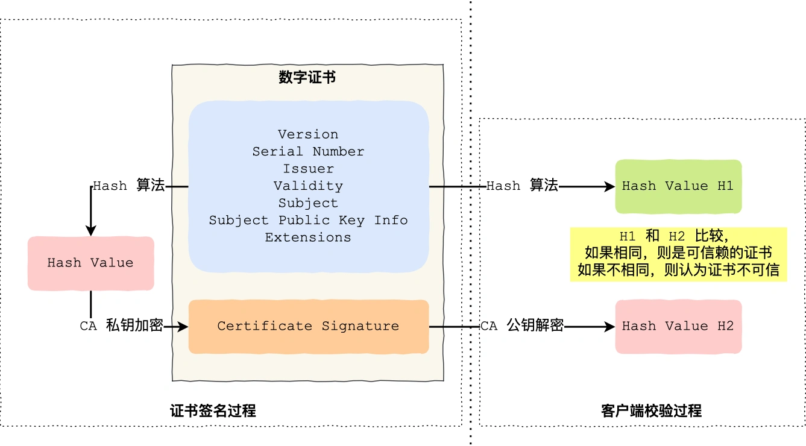

[toc]

# 1、浏览器中输入一个URL并回车会发生什么？

1. 域名解析，将统一资源定位器（URL）解析为对应的IP地址。浏览器首先搜素自己的DNS缓存，如果没有则查询操作系统的DNS缓存，如果没有则查询操作系统的hosts文件（将一些常用的网址域名与其对应的IP地址建立的一个关联“数据库），如果依旧没有找到，就查询本地DNS服务器的DNS缓存，如果没有则由本地DNS服务器向根服务器、顶级域服务器、权威服务器等查询目标IP地址（迭代/递归查询），然后将查询到的IP地址返回给浏览器，并逐级缓存。
2. 浏览器获取到域名对应的IP地址后，浏览器委托协议栈进行HTTP请求的传输。浏览器以一个随机的端口号向服务器的80端口号发起TCP连接请求，进行三次握手，建立TCP连接。
3. TCP连接建立后，浏览器向服务器发送HTTP请求报文，由运输层将HTTP请求报文封装成报文段，再由网络层将报文段封装成IP数据报，数据层将IP数据包封装成帧，最后通过物理层以比特流的形式传输到服务器端。
4. 服务器端收到对应的比特流后，通过层层解析，获取到浏览器发出的HTTP请求报文并进行解析，然后生成一个HTTP响应报文，将其发送给浏览器。
5. 浏览器收到服务器发送的HTTP响应报文后，对其进行解析，然后渲染到浏览器显示窗口。
6. 如果采用的是短连接，通信完成关闭连接；如果是长连接，连接保持，等待继续发送新的请求报文。


# 2、OSI七层模型及每层简要功能描述


* 应用层：为特定的应用程序提供交互服务。
* 表示层：主要负责数据格式的转换（例如加密解密、转换翻译、压缩解压缩等），是应用程序不必关心各主机内部数据格式不同的问题。
* 会话层：负责在网络中两节点之间建立、管理、终止会话。
* 运输层：为进程之间的通信提供数据传输服务，定义通用的运输层协议可以支持不断增多的应用层协议。
* 网络层：选择合适的路由和交换节点，为主机提供多个网络间的数据传输服务（分组转发、路由选择）。
* 数据链路层：为同一链路的主机提供数据传输服务。
* 物理层：实现相邻节点之间的比特流的透明传输，尽可能屏蔽传输介质和通行手段的差异，使数据链路层感受不到这些差异。


# 3、TCP/IP协议分层模型及每层的常见协议

* 应用层：为特定的应用程序之间提供交互。
    HTTP：超文本传输协议，端口号80
    FTP：文件传输协议，端口号21
    SMTP：简单邮件传输协议，端口号25
    DNS：域名系统，端口号53

* 运输层：为进程之间的通信提供数据传输服务。
    TCP：传输控制协议
    UDP：用户数据报协议

* 网络层：选择合适的路由和交换节点，为主机提供多个网络间的数据传输服务。
    IP：网际协议
    ICMP：网际控制报文协议
    ARP：地址解析协议（五层协议中将其放到了数据链路层）
    IGMP：网际组管理协议

* 网络接口层：相当于五层体系结构中的数据链路层和物理层的合并，主要负责实际数据的传输。


# 4、DNS解析过程，DNS基于哪种传输层协议

DNS解析过程：
1. 浏览器查询自己的DNS缓存，如果存在，则直接返回。
2. 如果浏览器DNS缓存中没有，则查询操作系统的DNS缓存，如果存在，则直接返回。
3. 如果操作系统DNS缓存中没有，则查询操作系统的hosts文件，如果存在，则直接返回。
4. 如果hosts文件中也没有，则查询本地DNS服务器，如果存在，则直接返回。
5. 如果本地DNS服务器中没有，则向根DNS服务器发送查询请求。
    根DNS服务器返回顶级DNS服务器的地址；本地服务器再向顶级DNS服务器发送查询请求，顶级DNS服务器返回权威服务器的地址；本地服务器再向权威DNS服务器发送查询请求，权威DNS服务器返回所查询的IP地址。（这个过程是**迭代**查询）
    如果本地DNS服务器中没有，则向根DNS服务器发送查询请求，根DNS服务器再向顶级DNS服务器发送查询请求，顶级DNS服务器再向权威DNS服务器发送查询请求，权威DNS服务器返回所查询的IP地址，然后逐层返回给本地DNS服务器。（这个过程是**递归**查询）
6. 本地DNS服务器将IP返回给操作系统，同时将域名和对应的IP地址缓存在DNS缓存中。
7. 操作系统将IP地址返回给浏览器，同时将域名和对应的IP地址记录在hosts文件中，并缓存在操作系统的DNS缓存中。
8. 浏览器获得对应的IP地址，同时将域名和对应的IP地址缓存在浏览器的DNS缓存中。


DNS使用的传输层协议：
DNS可以使用UDP和TCP进行传输，端口号是53。大多数情况下DNS使用UDP进行传输，这就要求域名服务器必须有自己处理超时和重传的机制来保证可靠性。在以下情况下使用TCP进行传输：
* 如果响应超过512字节（UDP最大支持512字节的数据）。
* 区域传送（区域传送指的是上级域名服务器向下级域名服务器**传送发生了变化的那部分数据**）。


# 5、UDP、TCP的区别、应用场景

UDP、TCP的区别：
* UDP(用户数据报传输协议)是无连接的，发送数据之前无需建立连接；TCP(传输控制协议)是面向连接的，发送数据之前需要建立连接。
* UDP不提供可靠传输，只尽最大可能交付；TCP使用滑动窗口、确认应答机制、超时重传机制提供可靠传输，无差错、不丢失、不重复且按序到达。
* UDP是面向报文的传输（对于应用层报文，不进行分片、合并等操作，只是添加UDP头部）；TCP是面向字节流的传输（将应用层报文视为字节流，把字节流组织成大小不等的数据块）。
* UDP不提供拥塞控制，网络出现拥塞时不会降低传输速度；TCP提供拥塞控制，网络出现拥塞时会降低传输速度。
* UPD提供一对一、一对多、多对一、多对多的通信；TCP只提供一对一通信。
* UPD头部只有8字节；TCP头部有20字节。
* UDP用于对高速传输和实时性有较高要求的通信；TCP用于要求可靠传输的情况。

应用场景：
UDP用于对高速传输和实时性有较高要求的通信；TCP用于要求可靠传输的情况。

|运输层协议|应用层协议|应用|
|----|----|----|
|TCP|SMTP（简单邮件传输协议）|电子邮件|
|TCP|HTTP（超文本传输协议）|Web|
|TCP|FTP（文本传输协议）|文件传输|
|TCP|Telnet（远程终端协议）|远程控制|
|UDP|DNS（域名系统）|域名转换|
|UDP|TFTP|文件传输|
|UDP|SNMP|网络管理|
|UDP|NFS|远程文件服务器|


# 6、TCP三次握手、四次挥手的详细过程

三次握手：


1. 首先，服务器端处于Listen状态，等待客户端发送连接请求。
2. 第一次握手：客户端请求建立TCP连接，向服务器发送一个SYN请求报文，其中的SYN字段置为1，并随机生成一个序列号x，发送后客户端进入SYN_SENT状态。
3. 第二次握手：服务器收到客户端发送的SYN请求报文，如果服务器同意建立连接，则发送一个ACK确认报文，其中ACK字段置为1，SYN字段置为1，将其确认号置为客户端SYN报文中序列号x+1，同时生成一个服务器端的序列号y，发送后服务器进入SYN_RCVD状态。
4. 第三次握手：客户端接收到服务器发送的ACK确认报文，还需要向服务器发送确认报文，其中ACK置为1，确认号为服务器端序列号y+1，序列号为x+1，发送后客户端进入ESTABLISHED状态。
5. 服务器端收到客户端的确认报文后，进入ESTABLISHED状态，完成连接。


四次挥手：


以客户端主动请求关闭为例：
1. 第一次挥手：客户端主动请求关闭，向服务器端发送一个FIN释放报文，其中FIN置为1，并发送一个序列号u，发送后客户端从ESTABLISHED状态转为FIN_WAIT1状态，客户端停止向服务器端发送数据，但还可以接收来自服务器端的数据。
2. 第二次挥手：服务器端收到客户端发送的FIN释放报文后，向客户端发送一个ACK确认报文，其中ACK置为1，确认号为客户端FIN释放报文中的序列号u+1，并发送一个序列号v，发送后服务器端从ESTABLISHED状态转为CLOSE_WAIT状态，等待向服务器端传送完数据后关闭。此时TCP进入半关闭状态，服务器端还能向客户端发送数据，客户端不再向服务器端发送数据。客户端收到了来自服务器端的ACK确认报文后，转为FIN_WAIT2状态。
3. 第三次挥手：当服务器不再向客户端发送数据后，服务器被动关闭，向客户端发送一个FIN释放报文，其中FIN置为1，ACK置为1，确认号为客户端FIN释放报文中的序列号u+1，并发送一个序列号w，服务器端转为LAST_ACK状态。
4. 第四次挥手：客户端收到了服务器的FIN释放报文后，向服务器发送一个ACK确认报文，其中ACK置为1，确认号为服务器序列号w+1，序列号为u+1，此时TCP连接不会立即释放掉，而是进入TIME+WAIT状态，等待2MSL（MSL为报文最大存活时间）时间后再关闭TCP连接，进入CLOSED状态。
5. 服务器端收到客户端的确认报文后，关闭TCP连接，进入CLOSED状态。


# 7、什么是TIME_WAIT状态，为什么要有这个状态

当主动关闭方接收到被动关闭方发送的FIN释放报文后，并不会立马关闭TCP连接，而是进入TIME_WAIT状态，等待2MSL时间后再关闭TCP连接。

TIME_WAIT状态存在的原因：
* **保证主动关闭连接的那一方最后发送的ACK确认报文能够到达被动关闭方**。主动关闭方的ACK确认报文可能会因为某种原因没有到达被动关闭方，那么被动关闭方就会重传FIN释放报文，主动关闭方就能在2MSL时间内收到FIN释放报文，并重启2MSL计时，最终两端都进入CLOSED状态。但是如果没有TIME_WAIT等待时间，那么主动关闭方就不能响应被动关闭方重传的释放报文，会导致被动关闭方无法正常进入CLOSED状态。
* **保证本链接持续的时间内所产生的所有报文段都从网络中消失**，使得下一个连接中不会出现旧连接中的请求。（设置为2MSL是为了保证主动关闭方发送的确认报文和重发的确认报文都能够消失）


# 8、TCP如何保证可靠传输?滑动窗口、确认应答、超时重传、流量控制、拥塞控制机制

TCP主要提供了**检验和、序列号/确认应答、超时重传、滑动窗口、拥塞控制、流量控制**等方法实现了可靠性传输。
* 检验和：通过检验和的方式，接收端可以检测出来数据是否有差错和异常，假如有差错就会直接丢弃TCP段，重新发送。
* 序列号/确认应答：
    序列号的作用不仅仅是应答的作用，有了序列号能够将接收到的数据根据序列号排序，并且去掉重复序列号的数据。
    TCP传输的过程中，每次接收方收到数据后，都会对传输方进行确认应答。也就是发送ACK报文，这个ACK报文当中带有对应的确认序列号，告诉发送方，接收到了哪些数据，下一次的数据从哪里发。
* 滑动窗口：滑动窗口既提高了报文传输的效率，也避免了发送方发送过多的数据而导致接收方无法正常处理的异常。
* 超时重传：超时重传是指发送出去的数据包到接收到确认包之间的时间，如果超过了这个时间会被认为是丢包了，需要重传。最大超时时间是动态计算的。
* 拥塞控制：在数据传输过程中，可能由于网络状态的问题，造成网络拥堵，此时引入拥塞控制机制，在保证TCP可靠性的同时，提高性能。
* 流量控制：如果主机A一直向主机B发送数据，不考虑主机B的接受能力，则可能导致主机B的接受缓冲区满了而无法再接受数据，从而会导致大量的数据丢包，引发重传机制。而在重传的过程中，若主机B的接收缓冲区情况仍未好转，则会将大量的时间浪费在重传数据上，降低传送数据的效率。所以引入流量控制机制，主机B通过告诉主机A自己接收缓冲区的大小，来使主机A控制发送的数据量。流量控制与TCP协议报头中的窗口大小有关。


**TCP超时重传**：
如果一个已经发送的报文段在超时时间内没有收到确认，那么就重传这个报文段。

一个报文段从发送再到接收到确认所经过的时间称为往返时间RTT，加权平均往返时间RTTs计算如下：
`RTTs = (1-α) * RTTs + α * RTT`，其中0≤α＜1，通常α取0.125。

**超时时间RTO应该略大于RTTs**，TCP使用的超时时间为`RTO = RTTs + RTTd`，其中RTTd为偏差的加权平均值。最大超时时间是动态计算的。


**TCP滑动窗口**：
在进行数据传输时，如果传输的数据比较大。就会拆分为多个数据包进行发送，TCP协议需要对数据进行确认后才可以继续发送下一个数据包，这样就会在等待确认应答上浪费时间。

于是引入了滑动窗口概念。窗口大小就是指无需等待确认应答，而可以继续发送数据的最大值。

窗口的实现实际上是操作系统开辟的一个缓存空间，发送方主机在等到确认应答返回之前，必须在缓冲区中保留已发送的数据。如果按期收到确认应答，此时数据就可以从缓存区清除。


发送方和接收方都有一个滑动窗口，接收方通过TCP报文段中的**接收窗口字段**告诉发送方自己的窗口大小，发送方根据这个值和其他信息设置自己的窗口大小。

发送窗口内的字节都允许被发送，接收窗口内的字节都允许被接收。如果发送窗口左部的字节已经发送并收到了确认，那么发送窗口就可以向右移动一定距离，直到最左端的字节不是已发送并被确认状态。接收窗口类似，接收窗口左部的字节已经发送确认且交付主机了，就向右滑动接收窗口。

接收窗口会对窗口内最后一个**按序到达**的字节进行确认，发送方得到一个字节的确认后，就可以知道该字节及其之前的所有字节都被接收了（**累计确认**）。


**TCP流量控制**：
使用滑动窗口协议实现流量控制。防止发送方发送速率太快，接收方缓存区不够导致溢出。接收方会维护一个接收窗口receiver window（窗口大小单位是字节），**接受窗口的大小是根据自己的资源情况动态调整的**，在返回ACK时将接受窗口大小放在TCP报文中的窗口字段告知发送方。发送窗口的大小不能超过接受窗口的大小，只有当发送方发送并收到确认之后，才能将发送窗口右移。

**发送窗口的上限为接受窗口和拥塞窗口中的较小值**。接受窗口表明了接收方的接收能力，拥塞窗口表明了网络的传送能力。

如果接收方暂时无可用资源，那么在发送给发送方的确认报文段中，会将接收窗口字段的大小置为0，那么发送方就不能再发送数据，同时发送方会启动一个持续计时器，一段时间后向接收方发送一个**零窗口探测报文**（其大小为1字节），以查看接收窗口状态。如果接收方能够接收数据，就会在返回的报文中更新接收窗口大小，恢复数据传送。


**TCP拥塞控制**：
如果网络发生拥塞，会导致分组丢失，发送方会超时重传，导致网络的拥塞程度更高。因此当网络出现拥塞时，需要控制发送方的发送速率。

TCP主要通过四个算法来进行拥塞控制：**慢开始、拥塞避免、快重传、快恢复**。

发送方需要维护一个拥塞窗口（cwnd）的状态变量，发送方实际能发送多少取决于发送窗口（接收窗口和拥塞窗口的较小值）。


* 慢开始与拥塞避免：
    发送最初执行慢开始，令拥塞窗口cwnd=1，发送方只能发送一个报文段，当收到确认后，将cwnd加倍，因此之后发送方能发送的报文段数量为2、4、8……
    慢开始每轮都将cwnd加倍，使得发送方的发送速度增快，那么网络出现拥塞的可能性也就增大。于是设置一个慢开始门限（ssthresh），当cwnd>ssthresh时，进入拥塞避免阶段，每轮只将cwnd加1。如果出现了超时，则令ssthresh=cwnd/2，然后重新执行慢开始。
* 快恢复与快重传：
    
    在接收方，要求每次接收到报文段应该对最后一个已经收到的有序报文段进行确认（例如已经接收到M1和M2，此时收到M4，应当发送对M2的确认）。
    当发送方收到三个重复的确认，那么就可以知道下一个报文段丢失，于是执行快重传，立即重传下一个报文段（例如连续收到三个M2的确认报文段，那么M3丢失，立即重传M3）。
    在这种情况下，只是丢失个别报文段，并不是网络拥塞，因此执行快恢复，令ssthresh=cwnd/2，cwnd=sstresh，直接进入到拥塞避免阶段。


# 9、HTTP有哪些方法，GET和POST的区别

客户端发送的HTTP请求报文中的第一行为请求行，请求行包含了方法字段。

HTTP方法：
* Get：获取资源，当前网络请求中，绝大部分使用GET方法。
* POST：传输实体主体，从客户端向服务器端发送数据（提交表单、上传文件等）。
* HEAD：获取报文首部，和GET方法类似，但是只返回HTTP报文的消息头，不返回报文的实体主体。主要用于确认URL的有效性以及资源更新时间等。
* PUT：上传文件，对服务器上的文件进行替换，如果指定文件不存在则创建该文件。其自身不带安全验证机制，存在安全性问题。
* PATCH：对资源进行部分修改。PUT方法是完全替代原始资源，PATCH能够进行部分修改。
* DELETE：删除文件。与PUT功能相反，也不带安全验证机制。
* OPTIONS：查询指定的URL能够支持的方法。
* CONNECT：要求与代理服务器通信时建立隧道。使用SSL和TSL协议把通信内容加密后经网络隧道传输。
* TRACE：追踪路径，服务器将通信路径返回给客户端。


Get和POST的区别：
* 作用：GET方法用于获取服务器端指定资源；POST方法用于从客户端向服务器端发送数据，根据这些数据对指定的资源作出处理。
* 参数：GET和POST都能使用额外参数，GET的参数以查询字符串的形式出现在URL中（URL必须是ASCII字符）；POST的参数存储在实体中（实体中的字符可以是任意格式）。
* 安全：GET方法是安全的；POST方法不是安全的。
    （安全的HTTP方法不会改变服务器的状态，POST不安全是因为其传送实体主体内容可能会存储在服务器上，是服务器状态发生了改变）。
    安全的方法：GET、HEAD、OPTION
    不安全的方法：POST、PUT、DELETE
* 幂等性：GET方法是幂等的；POST方法不是幂等的。
    幂等的HTTP方法，同样的请求执行一次和连续执行多次的效果是一样，服务器状态也是一样的（即会得到相同的结果）。
    所有的安全的方法都是幂等的，在正确条件下实现的PUT、DELETE也是幂等的。
* 可缓存性：GET可以缓存；POST在多数情况下不可以缓存。


HTTP常见字段：
* Host字段：客户端发送请求时，用来指定服务器的域名。
* Content_Length字段：本次请求/响应中，消息实体的数据的长度。
* Connection字段：用于客户端要求服务器使用HTTP长连接机制，以便其他请求复用。Connection字段取值：Keep-Alive（请求长连接）、close（关闭长连接）。
* Content-Type字段：服务器告诉客户端本次数据的格式。
* Accpet字段：客户端声明自己可以接受的数据格式。
* Content-Encoding字段：数据压缩的方式。
* Accept-Encoding字段：客户端在请求时，说明自己可以接受哪些压缩方法。


# 10、HTTPS连接过程


在客户端和服务器端完成了TCP三次握手后，开始进行TLS四次握手：
1. TLS第一次握手：客户端向服务器端发送请求，消息中包含TLS版本号、支持的密码套件列表，以及客户端生成的一个客户端随机数。
2. TLS第二次握手：当服务器端收到了客户端的请求后，会确认TLS版本号是否支持，并从密码套件列表中选择一个密码套件，同时生成一个服务器端随机数。接着服务器端返回响应信息，包含前述的信息，同时还包含服务器使用的数字证书。
    - 服务器使用的数字证书通常包含了公钥、持有者信息、证书认证机构（CA）的信息、CA对这份文件的数字签名以及使用的算法、证书有效期、其他的额外信息等。其作用是认证公钥持有者的身份，以防第三方冒充。
    
    - 证书签发的过程：
    1、首先CA会将持有者的公钥、用途、颁发者、有效期等信息进行打包，并对这些信息进行hash计算，得到一个hash值。2、然后CA使用自己的私钥将hash值进行加密，作为证书签名。3、将证书签名添加到文件证书中，生成文件证书。
    - 客户端校验过程：
    1、首先客户端对持有者的公钥、用途、颁发者、有效期等信息使用同样的hash算法进行计算，得到数字证书的hash值H1。2、客户端再使用CA的公钥对证书签名进行解密（通常浏览器和操作系统中集成了CA的公钥信息），得到hash值H2。3、比较H1和H2，如果值相等，那么该数字证书为可信赖的证书，否则不可信。
3. TLS第三次握手：客户端收到服务器发送的数字证书并认证其可信后，会生成一个新的随机数，并通过服务器公钥将其加密后发送给服务器端。同时，客户端根据客户端随机数、服务器端随机数、新的随机数生成一个共享的会话密钥（对称密钥，用于后续HTTP报文的加密解密）。生成完会话密钥后，客户端通知服务器端开始使用共享会话密钥进行加密方式发送消息。接着，客户端再将之前所有发送的信息作一个摘要，使用共享会话密钥加密后发送给服务器端，让服务器验证加密通信是否可用以及之前的握手信息是否被篡改过。
4. TSL第四次握手：服务器端收到新的随机数后使用同样的方法生成共享会话密钥，然后也会发送使用加密通话信息和前面握手摘要信息，如果双方都验证加密解密可信后，即完成了整个握手过程。


使用RSA密钥协商算法的最大问题是**不支持前向保密**。因为客户端传递随机数（用于生成对称加密密钥的条件之一）给服务端时使用的是公钥加密的，服务端收到后，会用私钥解密得到随机数。所以一旦服务端的私钥泄漏了，过去被第三方截获的所有TLS通讯密文都会被破解。为了解决这个问题，后面就出现了ECDHE密钥协商算法。


# 11、IP地址的分类A/B/C/D类指的是什么？什么是子网掩码

IP地址长度为32比特（4字节），由四段组成，每个字段是一个字节。IP地址可以分为两部分：网络地址（网络号）、主机地址（主机号）。网络地址表示其属于互联网的哪一个网络，主机地址表示其属于该网络中的哪一台主机。

**分类编址的IP地址**：


* A类：前8位为网络号，后24位为主机号。网络号的第一比特位固定为0，网络范围为1~126，其中最小网络号0保留不指派，最大网络号127作为本地换回测试地址，不指派。每个网络中可分配的IP地址数量为2^24-2=16777214个（需要出去主机号全0的网络地址和主机号全1的广播地址），一般用于大型网络。
* B类：前16位为网络号，后16位为主机号。网络号的前两位比特位固定为10，网络范围为128~191。每个网络中可分配的IP地址数量为2^16-2=65534个，一般用于中等规模的网络。
* C类：前24位为网络号，后8位为主机号。网络号的前三比特位固定为110，网络范围为192~223。每个网络中可分配的IP地址数量为2^8-2=254个，一般用于小型网络。
* D类：多播地址。前四比特位固定为1110。没有主机号的，不可用于主机IP。网络范围为224~239，用于多路广播。
* E类：保留地址。前四比特位固定为1111。没有主机号的，不可用于主机IP。网络范围为240~255。

分类编址的缺点：
* 同一网络下没有地址层次（例如公司下面还要分部门，不同的部门使用不同的子网）。
* 不能很好的与实际网络相匹配（C类地址只能分配254个主机地址，太少，B类地址能分配6w+的主机号，又太多）。


**无分类编址的IP地址（CIDR）**：

32比特的IP地址被划分为两部分，前面是网络号，后面是主机号。无分类编址的IP地址的表示形式为`a.b.c.d/x`，其中x表示前x位为网络号，x的范围为0~32，这就使得IP地址更具有灵活性。


**划分子网的IP地址**：

子网划分实际上是将主机地址分为两个部分：子网网络地址和子网主机地址。
IP地址 = {<网络号>,<子网号>,<主机号>}

要使用子网，就必须配备子网掩码。子网掩码的作用是将某个IP地址划分为网络地址和主机地址两部分。子网掩码是一个32位地址，用于屏蔽IP地址的一部分以区别网络标识和主机标识，并说明IP地址是在局域网上还是在远程网上（将子网掩码和IP地址进行与运算，就能获取到所在子网的网络号），还能用于将一个大的网络划分为多个小的子网。


# 12、ARP（地址解析协议）的作用、简要原理

网络层实现主机之间的通信，链路层实现具体每段链路之间的通信。因此在通信过程中，IP数据报的源IP地址和目的IP地址一直保持不变，每一跳的源MAC地址和目的MAC地址随着链路的改变而改变。

> MAC地址是链路层地址，用于唯一标识网络适配器（网络接口）。拥有多个网络接口的主机或路由器具有与之相关联的多个MAC地址（例如笔记本电脑存在无线网络适配器和有线网络适配器，那么它就有两个MAC地址）。

ARP协议的作用：
ARP协议完成了IP地址到MAC地址的映射。

原理：
每个主机都有一个ARP高速缓存表，其中保存着本局域网内的各个主机和路由器的IP地址到MAC地址的映射表。
当源主机要向目的主机发送数据包时，会先检查自己的ARP表中是否存在目的主机的MAC地址，如果有就直接将这个数据包发送到对应的MAC地址；如果没有，那么就以广播的方式向所在局域网中发送一个ARP请求分组（包含源主机的IP地址、MAC地址，目的主机的IP地址），局域网中的其他主机收到该ARP广播数据包后，检查其中的目的IP地址和自己的IP地址是否一致，如果一致，则先将源主机的IP地址和MAC地址保存到自己的ARP表中，然后给源主机发送一个ARP响应数据包（包含自己的MAC地址）。源主机收到该ARP响应数据包后，在自己的APR表中添加目的主机的IP地址、MAC地址的映射，再进行数据传送。


如果源主机和目的主机不在同一个局域网内，那么就要通过ARP找到一个位于本局域网内的路由器的硬件地址，然后将数据包发送给该路由器（默认网关），通过路由器来进行路由选择和分组转发，将数据包发送给下一个网络。


# 13、能不能两次、四次握手？为什么握手三次可以，挥手却要四次？

使用三次握手的原因：
* 确保双方具有发送和接受的能力
    - 第一次握手：客户端发送请求报文，服务端可以确定用户端的发送能力以及自己的接受能力。
    - 第二次握手：服务端发送确认报文，客户端可以确保服务端的接收能力和发送能力，自己接受能力，服务端确定了自己的发送能力，但尚且未确定客户端的接收能力。
    - 第三次握手：客户端发送确认报文，服务器端确定了客户端的接收功能。

* 避免已经失效的历史连接产生错误
    场景：客户端首先发送了一个连接请求，然后马上宕机，这个连接请求被网络阻塞了，接着客户端重启，重新向服务端建立连接（两次的序列号不同）
    
    

* 同步双方的初始序列号
    TCP协议的通信双方，都必须维护一个序列号，序列号是可靠传输的一个关键因素，它的作用：接收方可以去除重复的数据、接收方可以根据数据包的序列号按序接收、可以标识发送出去的数据包中哪些是已经被对方收到的。
    所以当客户端发送携带初始序列号的SYN报文的时候，需要服务端回一个ACK应答报文，表示客户端的SYN报文已被服务端成功接收，那当服务端发送初始序列号给客户端的时候，依然也要得到客户端的应答回应，这样一来一回，才能确保双方的初始序列号能被可靠的同步。

* 避免浪费资源
    如果只有两次握手，当客户端发生的SYN报文在网络中阻塞，客户端没有接收到ACK报文，就会重新发送SYN，由于没有第三次握手，服务端每收到一个SYN就只能先主动建立一个连接。如果客户端重复发送多次SYN报文，那么服务端在收到请求后就会建立多个冗余的无效链接，造成不必要的资源浪费。

三次握手是理论上最少的可靠连接建立次数，通过三次握手就能保证通信双方的收发能力，完成初始序列号的同步等工作，且不会存在历史连接造成的错误和资源浪费，所以不需要使用更多的通信次数。


挥手需要四次的原因：
客户端发送了FIN连接释放报文之后，服务器收到这个报文时，很可能还有数据要想客户端发送，因此并不会立即关闭连接，所以服务器端先回复一个ACK报文，告诉客户端我收到你的连接释放报文了。进入CLOSE_WAIT状态，只有等到服务器端所有的报文都发送完了，这时服务器端才能发送FIN连接释放报文，之后两边才会真正的断开连接。所以需要四次挥手。

当然，如果被动关闭方**没有数据要发送并且开启了TCP延迟确认机制**，那么第二和第三次挥手就会合并传输，这样就出现了三次挥手。


# 14、TCP快重传和快恢复、延迟确认应答、捎带应答

快重传和快恢复：

在接收方，要求每次接收到报文段应该对最后一个已经收到的有序报文段进行确认（例如已经接收到M1和M2，此时收到M4，应当发送对M2的确认）。
当发送方收到三个重复的确认，那么就可以知道下一个报文段丢失，于是执行快重传，立即重传下一个报文段（例如连续收到三个M2的确认报文段，那么M3丢失，立即重传M3）。
在这种情况下，只是丢失个别报文段，并不是网络拥塞，因此执行快恢复，令ssthresh=cwnd/2，cwnd=sstresh，直接进入到拥塞避免阶段。


延迟确认应答：
当发送没有携带数据的ACK，它的网络效率也是很低的，因为它也有40个字节的IP头和TCP头，但却没有携带数据报文。为了解决ACK传输效率低问题，所以就衍生出了TCP延迟确认。TCP延迟确认的策略：
* 当有响应数据要发送时，ACK会随着响应数据一起立刻发送给对方。
* 当没有响应数据要发送时，ACK将会延迟一段时间，以等待是否有响应数据可以一起发送。
* 如果在延迟等待发送ACK期间，对方的第二个数据报文又到达了，这时就会立刻发送ACK。


捎带应答：
对客户端发送到服务端的数据的确认，被服务器装载在一个承载着服务端要发送到客户端的数据的报文段中，这被称为捎带应答。


# 15、Cookie和Session的区别

Cookie：
Cookie是服务器发送到用户浏览器并保存在本地的一小块数据，它会在浏览器下次向同一服务器再发起请求时被携带并发送到服务器上。通常，它用于告知服务端两个请求是否来自同一浏览器，如保持用户的登录状态。Cookie使基于无状态的HTTP协议记录稳定的状态信息成为了可能。


Cookie和Session的区别：
* 作用范围不同：Cookie保存在客户端；Session保存在服务器端。
* 有效期不同：Cookie可以设置为长时间保持；Session一般失效时间较短，客户端关闭或者Session超时都会导致失效。
* 隐私策略不同：Cookie存储在客户端，容易被窃取；Session存储在服务端，安全性较Cookie而言较好。
* 存储大小不同：单个Cookie保存的数据大小不能超过4k；Session的存储没有上限，但是出于服务器性能考虑，Session内不要放太多数据，并且需要设置Session删除机制。


# 16、CSRF攻击和XSS攻击原理及防护

CSRF攻击（跨站点请求伪造Cross-Site Request Forgery）

原理：
用户正常登录访问受信网站A，网站A产生cookie返回到浏览器。同时，在相同浏览器访问网站B，网站B返回攻击性代码请求要求访问第三方站点A；在用户不知情下携带Cookie信息，向网站A发出请求。站点A并不知道该请求是由B发起的，会根据用户的Cookie信息以用户的权限处理该请求，导致来自站点B的恶意代码被执行。

防护:
1. 将cookie设置为HttpOnly。程序（js、Applet等）将无法读取到cookie，避免了伪造cookie情况出现。
2. 验证码。CSRF攻击一般是在用户不知情的情况下构造了网络请求，而验证会强制用户必须与应用进行交互，才能完成最终请求。
3. 在请求中添加token验证。CSRF攻击之所以能够成功，是因为攻击者可以完全伪造用户的请求，该请求中所有的用户验证信息都是存在于Cookie中，因此攻击者可以在不知道这些验证信息的情况下直接利用用户自己的Cookie 来通过安全验证。要抵御CSRF，关键在于在请求中放入攻击者所不能伪造的信息，并且该信息不存在于Cookie之中。可以在HTTP请求中以参数的形式加入一个随机产生的token，并在服务器端建立一个拦截器来验证这个token，如果请求中没有token或者token内容不正确，则认为可能是CSRF攻击而拒绝该请求。


XSS攻击（跨站脚本攻击Cross Site Scripting）

原理：
攻击者往Web页面中插入恶意Script代码，当用户浏览该页时，嵌入Web里面的Script代码会被执行，从而达到恶意攻击用户的目的。类似于SQL注入。

防护：
1. 将Cookie设置为HTTPOnly。
2. 输入检测、字符过滤。对于用户的任何输入要进行检查、过滤和转义。过滤掉特殊的HTML标签；过滤掉Javascript事件标签。
3. 检查输出。除富文本的输出外，在变量输出到HTML页面时，可以使用编码或转义的方式来防御XSS攻击。例如利用sanitize-html对输出内容进行有规则的过滤之后再输出到页面中。


# 17、HTTP请求报文和响应报文的格式，请求行和响应行都有什么

HTTP请求报文：
* 请求行：包括请求方法、访问资源URL、使用的HTTP版本。
* 请求头部：每一个首部都有一个首部名称，以及对应的值。格式为"属性名：属性值"，服务端根据请求头部获取客户端的信息，主要有cookie、host、connection、accept_language、accept_encoding、user_agent等。
* 空行：使用一个空行来分隔请求头部和请求体。
* 请求体：用户的请求数据。

HTTP响应报文：
* 状态行：包括协议版本、状态码、状态描述短语。
* 响应头部：首部内容，字段主要有connection、content_type、content_encoding、set_cookie等。
* 空行：使用一个空行来分隔响应头部和内容主体。
* 内容主体：服务器返回给客户端的数据。


# 18、HTTP常见状态码及含义

服务器返回的响应报文中第一行为状态行，包含了状态码以及状态描述短语，用于告知客户端请求的结果。

|状态码|类别|含义|
|----|----|----|
|1XX|Information（信息性状态码）|接收的请求正在处理|
|2XX|Success（成功状态码）|请求正常处理完毕|
|3XX|Redirection（重定向状态码）|需要进行附加的操作以完成请求|
|4XX|ClientError（客户端错误状态码）|服务器无法处理请求|
|5XX|ServerError（服务端错误状态码）|服务器处理请求出错|

* 1XX：表示通知信息，如请求收到了或正在进行处理
    - 100 Continue：继续，客户端应继续其请求。
    - 101 Switching Protocols：切换协议。服务器根据客户端的请求切换协议。只能切换到更高级的协议，例如，切换到HTTP的新版本协议。
* 2XX：表示成功
    - 200 OK：请求成功。
    - 202 Accepted：表示请求已被接收，需要时间处理。
    - 204 No Content：请求已经成功处理，但是返回的响应报文不包含实体的主体部分。一般在只需要从客户端往服务器端发送信息，而不需要返回数据时使用。
    - 206 Partical Content：表示成功获取资源的一部分，用于HTTP的分块下载与断点传输。
* 3XX：表示重定向，如要完成还需要进行进一步的行动
    - 301 Moved Permanently：永久性重定向，说明资源已经永久性转移了。
    - 302 Found：临时性重定向，说明资源还在，但是暂时需要另一个URL访问。新URL在消息头的 [Location] 字段声明。
    - 303 See Other：和302功能相同，但是303明确要求客户端应该采用GET方法获取资源。
    - 304 Not Modified：即使客户端有缓存资源，但是依然向服务器发出资源请求，因为需要确保内容一定是最新的，而服务器如果判定该资源未更新可以使用缓存，则会使用此状态码。
* 4XX：表示客户端错误，如请求中有错误或不能完成
    - 400 Bad Request：请求报文中存在语法错误
    - 401 Unauthorized：请求要求用户的身份验证。
    - 403 Forbidden：请求被拒绝，服务器禁止访问资源。
    - 404 Not Found：请求资源在服务器上不存在。
* 5XX：表示服务端错误，处理请求出错
    - 500 Internal Server Error：服务器正在执行请求时发生错误。
    - 501 Not Implemented：客户端请求的功能尚不支持。
    - 502 Bad Gateway：代理服务器正常，但是代理要去访问源站服务提供者发生错误了，代理服务器接收到无效的应答。
    - 503 Server Unaviailble：服务器暂时处于超负载或正在进行停机维护，现在无法处理请求。


# 19、HTTP与HTTPS的区别，HTTPS使用的是非对称加密还是对称加密

HTTP与HTTPS的区别：
* 端口号不同：HTTP使用的端口号为80；HTTPS使用的端口号为443.
* 安全性：HTTP信息是明文传输，安全性较差；HTTPS是具有安全性的SSL加密传输协议。
* 资源消耗：HTTP不进行加密，资源消耗少；HTTPS需要进行加密处理，资源消耗多。
* 是否需要证书：HTTP不需要证书；HTTPS需要向CA购买证书。
* 协议：HTTP运行于TCP协议之上；HTTPS运行于SSL协议之上，SSL协议运行于TCP协议上。


HTTPS的加密方式：
HTTPS采用混合加密机制
   * 先使用非对称加密方式，传输对称加密所需要的会话密钥，从而保证安全性。
   * 获取到会话密钥后，在进行对称加密，从而保证效率。


# 20、HTTP1.0/2.0/3.0的区别和特点

**HTTP/1.0和HTTP/1.1的区别**：
* **长连接**：HTTP/1.0默认使用短链接，每次请求都需要建立新的TCP连接（可以通过设置connection字段keep-alive开启长连接）；HTTP/1.1默认使用长连接，一次请求结束后不会关闭TCP连接，可以继续发送请求。
* **管道通信**：HTTP/1.0一个请求发出后，需要等待收到服务器的响应后才会发送下一个请求；HTTP/1.1可以开启管道通信（流水线处理），一个请求发出后不必等待收到服务器响应就可以继续发送下一个请求（默认是关闭的），但是服务器还是会按请求的顺序进行响应。
* **断点续传**：HTTP/1.0不支持断点续传；HTTP/1.1新增了Range字段，可以用来指定数据字节位置，只请求资源的某个部分（响应码为206 Partical Content）。
* **错误状态响应码**：HTTP/1.1新增了24个错误状态响应码（例如410 Gone表示服务器上的某个资源被永久性删除了）。
* **Host头处理**：HTTP/1.0中认为每台服务器都绑定唯一的IP地址，因此请求信息的URL没有传递主机名；HTTP/1.1增加了host信息，以处理一个服务器有多个虚拟主机（共享同一个IP地址，HTTP/1.0无法判断报文传递给哪个主机）的情况。
* **身份验证**：HTTP1.0直接传递应用层报文；HTTP1.1会首先发送一个不含实体的请求，如果服务器因为权限拒绝了请求，就会回复响应码401 Unauthorized，要求验证用户身份，否则回复100 Continue，之后客户端再发送包含实体的完整报文。
* **缓存优化**：HTTP/1.1提供了更多的缓存头选项来控制缓存策略。


**HTTP/1.1存在的问题**：
* 请求/响应头部未经压缩就发送，首部信息越多延迟越大（TCP拆包会增加网络中的包的数量，导致拥塞）。只能压缩实体体部分。
* 发送冗长的首部。每次互相发送相同的首部造成较多浪费。
* 服务器是按请求的顺序响应的，如果服务器响应慢，会导致客户端一直请求不到数据，造成响应队头阻塞。
* 没有请求的优先级控制。
* 请求只能从客户端开始，服务器只能被动响应。
* 报文是纯文本形式，计算机还需要转换为二进制格式。


**HTTP/1.1和HTTP/2.0的区别**：
* **安全性**：HTTP/2.0基于HTTPS，相比于HTTP/1.1，保证了传输的安全性。
* **头部压缩**：HTTP/1.1的头部带有大量信息，并且对于请头部相同或者类似的情况，会重复发送这些相同的部分；HTTP/2.0会压缩头部，消除重复的部分，有效减少头部信息的大小（在客户端和服务端同时维护头信息表，分为静态表和动态表两种，将常用字段存入信息表中，并生成索引号，发送时只需要发送索引号即可，对于未转化成数字索引的信息，会使用Huffman编码来进行压缩）。
* **二进制分帧**：HTTP/1.1基于文本格式传输数据；HTTP/2.0采用二进制格式传输数据，头信息和数据体都称为帧（头信息帧、数据帧），计算机无需再将明文报文转换为二进制，增加了数据传输效率。
* **流式传输**：HTTP/1.1中服务器要按照请求顺序进行响应；HTTP/2.0采用流式传输，为每个数据包声明其所属的数据流和序号，可以进行乱序发送，然后接收端通过Stream ID有序组装成HTTP报文·。
* **多路复用**：HTTP/1.1中如果不使用管道传输，那么要实现并发处理请求，只能依赖于多个TCP连接，即便使用了管道传输，服务器端也只能按照请求顺序进行相应（会导致响应队头阻塞问题，处理一个请求时阻塞，后续的请求也无法被处理）；HTTP/2.0中基于流式传输，多个Stream复用在一条TCP连接，允许同时发送多个请求或响应，这些请求和响应能够并行传输而不被阻塞，避免了在HTTP层面出现响应队头阻塞问题。
* **服务器推送**：HTTP/1.1只能由客户端发起请求，是传统的"请求-响应"模式；HTTP/2.0使得服务器也可以主动向客户端传递数据，无需客户端发送请求。
* **请求优先级**：HTTP/1.1没有请求的优先级控制；HTTP/2.0中支持请求的优先级控制，客户端可以指定请求数据流的优先级，优先级高的数据流会被服务器优先处理并返回给客户端（客户端创建的Stream的Id必须是奇数，服务端创建的Stream的Id必须是偶数）。


**HTTP/2.0存在的问题**：
* 虽然HTTP/2层面上没有了队头阻塞，但是在TCP层面依旧存在队头阻塞的问题（TCP的累计确认机制，会导致某一个报文段丢失后，后续的报文段都无法被确认，造成了队头阻塞）。
* TCP协议本身问题：
  - TCP与TLS握手时延：需要TCP三次握手+TLS四次握手，握手次数较多，连接时时延较大。
  - 由于TCP的拥塞控制的慢启动过程，导致TCP连接刚建立时，收发数据速度较慢。
  - 一旦网络变化（WIFI->5G），由于TCP四元组改变，所以TCP连接必须要重新建立，会造成明显的时延。


**HTTP/3.0相较于HTTP/2.0的改进**:
由于HTTP/2在TCP层面上依旧存在队头阻塞，HTTP/3将下层的TCP协议改成了UDP协议，同时在应用层使用QUIC协议保证UDP的可靠传输。

QUIC协议的特点：
* 无队头阻塞：使用UDP避免TCP层面的队头阻塞，通过QUIC来保证可靠传输，即便某个流在UDP传输中发生了丢包，也不会影响其他的流。
* 更快建立连接：QUIC中包含了TLS（使用TLS1.3，优化了TLS握手过程，只需要1RTT），同时由于使用了UDP，不用进行三次握手，只在TLS握手过程中交换连接ID即可。
* 连接迁移：缓存当前会话的上下文，下次恢复会话时只需要将之前的缓存传递给服务器，验证通过就能进行传输了。


# 21、IPv4和IPv6的区别，IPv6的改进有哪些？

IPv4是32位的IP地址，分为4段，每段占8比特位，段与段之间使用点隔开（点分十进制）。
IPv6是128位的IP地址，分为8段，每段占16比特位，段与段之间使用冒号隔开（十六进制表示）。


IPv6相比IPv4的首部改进：
* 取消了首部校验和字段：因为在数据链路层和传输层都会校验，因此IPv6直接取消了IP的校验。
* 取消了分片/重新组装相关字段：分片与重组是耗时的过程，IPv6不允许在中间路由器进行分片与重组，这种操作只能在源与目标主机，这将大大提高了路由器转发的速度。
* 取消选项字段：选项字段不再是标准IP首部的一部分了，但它并没有消失，而是可能出现在IPv6首部中的下一个首部指出的位置上。删除该选项字段使的IPv6的首部成为固定长度的40字节。


与IPv4相比，IPv6的优势：
* IPv6具有更大的地址空间。
* IPv6使用更小的路由表：IPv6的地址一开始就遵循聚类的原则，使得路由器能在路由表中用一条记录表示一片子网，减小了路由器中路由表的长度，提高了路由器转发数据报的速度。
* IPv6具有更高的安全性：在IPv4中，安全性主要取决于网站和应用程序。它不是针对安全性而开发的IP协议。而IPv6集成了Internet协议安全标准（IPSec)。IPv6的网络安全不像IPv4是可选项，IPv6里的网络安全项是强制性的。


# 22、DNS的递归查询和迭代查询

本地DNS服务器向根DNS服务器发送查询请求：
* 根DNS服务器返回顶级DNS服务器的地址；本地服务器再向顶级DNS服务器发送查询请求，顶级DNS服务器返回权威服务器的地址；本地服务器再向权威DNS服务器发送查询请求，权威DNS服务器返回所查询的IP地址。（这个过程是**迭代**查询）
* 根DNS服务器再向顶级DNS服务器发送查询请求，顶级DNS服务器再向权威DNS服务器发送查询请求，权威DNS服务器返回所查询的IP地址，然后逐层返回给本地DNS服务器。（这个过程是**递归**查询）


# 23、DNS为什么使用UDP协议，DNS什么时候可以使用TCP协议

DNS大多数情况使用的都是UDP协议（域名解析时），只有在两种情况下会使用TCP协议：
* 响应长度超过512字节（UDP最大支持512字节的数据）；
* 区域传送（上级域名服务器向下级域名服务器传递已经更改的数据）。


# 24、域名劫持和域名投毒是什么

域名劫持：
域名服务器上都会保存一大堆的域名记录（每条记录包含“域名”和“IP地址”)。当收到域名查询的时候，域名服务器会从这堆记录中找到对方想要的，然后回应给对方。
如果**域名服务器上的某条记录被人为修改成错的**，那么一旦要查询这条记录，得到的就是错误的结果。这种情况称之为“域名劫持”。

域名投毒：
当你的电脑向域名服务器发送了“域名查询”的请求，然后域名服务器把回应发送给你的电脑，这之间是有一个时间差的。如果某个攻击者能够**在域名服务器的“DNS应答”还没有到达你的电脑之前，先伪造一个错误的“DNS应答”发给你电脑**。那么你的电脑收到的就是错误的信息，并得到一个错误的IP地址。


# 25、如何实现UDP的可靠传输

传输层无法保证数据的可靠传输，那么就只能由应用层来保证了。所以要实现UDP的可靠传输，就需要在应用层上实现。最简单的方法就是在应用层模仿TCP的可靠传输的实现。
* 在应用层对报文进行分配，使得只需要重传丢失的部分。
* 添加序列号/确认应答机制，确保数据发送到对端。
* 添加超时重传机制，借助定时器实现。
* 添加发送窗口和接收窗口，以实现流量控制和拥塞控制。


# 26、TCP和UDP的校验和如何计算

UDP和TCP的校验和是将首部和数据部分一起校验。

校验方法：
在发送端，首先是将伪首部以及UDP用户数据报看成是由许多16bit的字节串接起来。将这些数据采用进位回滚的方式相加，然后取这些16bit字节和的二进制反码，作为校验和字段，然后发送UDP用户数据报。
在接收端，将收到的UDP用户数据报和伪首部一起，也采用进位回滚的方式相加，然后与校验和字段相加，没有差错时，结果应该都为1。否则，就表明有差错出现，接收端应该将此UDP用户数据报丢弃。


# 27、什么是SYN攻击

SYN洪泛攻击是一种典型的DoS攻击（拒绝服务攻击），其效果就是使服务器的连接资源耗尽，无法响应正常的TCP连接请求。

服务器端的资源分配是在二次握手时分配的，而客户端的资源是在完成三次握手时分配的，所以服务器容易受到SYN洪泛攻击。


SYN洪泛攻击的原理与实现：
攻击方在短时间内伪造大量不存在的IP地址，并向服务器不断地发送SYN请求报文，服务器则回复确认报文，为这些半开连接分配资源，并等待客户端确认，由于源地址不存在，因此服务器需要不断重发直至超时，这些伪造的SYN包将长时间占用未连接队列，导致服务器的连接资源被耗尽，正常的SYN请求因为队列满而被丢弃，从而引起网络拥塞甚至系统瘫痪。


SYN攻击检测：
通过`netstat -n -p TCP | grep SYN_RECV`命令检测，如果服务器上存在大量的半连接状态时，特别是源IP地址是随机的，基本上可以断定这是一次SYN攻击。


常见的防御SYN攻击的方法有如下几种：
* 缩短超时（SYN Timeout）时间
* 增加最大半连接数
* 过滤网关防护（防火墙）
* SYN cookies技术：当服务器接收到一个SYN请求报文后，不会为其生成一个半开连接，而是生成一个cookie值，将这个cookie值作为初始序列号给客户端发送确认报文。如果客户是合法的，那么会返回一个确认报文，于是服务器再为客户请求的连接分配资源；如果客户不合法，则不会分配任何资源。


# 28、TCP粘包是什么？有哪些原因

TCP粘包：如果客户端连续不断的向服务端发送数据包时，服务端接收的数据会出现两个数据包粘在一起的情况。


粘包原因：
* 发送方原因：发送方使用Nagle算法，会收集多个小分组，在一个确认到来时一起发送；此时接收方接收到的包就是首尾粘在一起包。
* 接收方原因：接收方接收到分组放到接收缓存，由应用程序去缓存中取数据。如果TCP接收分组的速度超过应用程序取分组的速度时，应用程序就会一次读到多个首尾相连的包。

粘包解决办法：
* 发送方**关闭Nagle算法**，TCP接收到消息就直接发送。
* 保证发送的是**固定长度的消息**，但是不够灵活。
* **使用特殊字符作为边界**，但是如果消息中也存在这个特殊字符，可能会导致解析出无效的消息，因此需要对消息中的字符进行转义。
* **自定义消息结构**，在结构体中记录消息的长度。


# 29、服务器存在大量TIME_WAIT或者CLOSE_WAIT是因为什么，怎么解决

**大量TIME_WAIT**
原因：
- 从服务器来讲，短时间内主动关闭了大量的TCP连接，就会造成服务器上出现大量的TIME_WAIT状态的连接，严重消耗着服务器的资源，导致**套接字数量**达到上限，此时部分客户端就会显示连接不上。
- 从客户端来讲，客户端TIME_WAIT过多，就会导致**端口资源**被占用，那么就无法对目的IP、目的端口都一样的服务端发起连接了，但是被使用的端口，还是可以继续对另外一个服务端发起连接的（只要四元组不一样即可）。

解决办法：
* 服务器可以设置SO_REUSEADDR套接字选项来避免TIME_WAIT状态，此套接字选项告诉内核，即使此端口正忙（处于TIME_WAIT状态），也请继续并重用它。
* 调整系统内核参数，修改/etc/sysctl.conf文件，即修改`net.ipv4.tcp_tw_reuse 和 tcp_timestamps`
> `net.ipv4.tcp_tw_reuse = 1 `表示开启重用。允许将TIME_WAIT sockets重新用于新的TCP连接，默认为0，表示关闭；
> `net.ipv4.tcp_tw_recycle = 1 `表示开启TCP连接中TIME_WAIT sockets的快速回收，默认为0，表示关闭。
* 强制关闭，发送RST包越过TIME_WAIT状态，直接进入CLOSED状态。


**大量CLOSE_WAIT**
原因：被动关闭方一直没有进行第三次挥手（可能是服务器内部业务处理占用了过多时间，都没能处理完业务；或者还有数据需要发送；或者服务器的业务逻辑有问题，没有执行close()方法），会导致被动关闭方存在大量CLOSE_WAIT状态的连接。这种情况会影响服务器性能，同样可能导致套接字数量达到服务器上限。

解决办法：
* 修改业务逻辑/bug
* 缩短CLOSE_WAIT配置的时间


-----
★TIME_WAIT数量过多如何处理
https://www.cnblogs.com/lulu/p/4149312.html
* 服务端若TIME_WAIT状态过多
  - 可以选择开启SO_REUSEADDR，复用TIME_WAIT连接
  - 可以调大tcp_tw_buckets，增大最大同时能拥有的TIME_WAIT的量
* 客户端若TIME_WAIT状态过多，可以打开TCP端口复用（net.ipv4.tcp_tw_reuse）
  - 使用前提：打开TCP时间戳支持（net.ipv4.tcp_timestamps）
  - 仅在TCP套接字作为客户端调用connect时使用，对于服务器而言，一般不会有那么多的主动连接动作，所以对于绝大部分服务器其实是无用的
  - 开启了该功能，客户端调⽤ connect()函数时，内核会随机找⼀个time_wait状态超 > 1 秒的连接给新的连接复⽤
* 设置net.ipv4.tcp_max_tw_bucket参数（不建议使用）
  - 在TIME_WAIT数量等于tcp_max_tw_buckets时，不会有新的TIME_WAIT产生。
  - 该值默认为18000
  - 对端潜在问题1：若当前TIME_WAIT数量>= tcp_max_tw_buckets时，作为主动关闭方，在收到对端发送的FIN报文后就结束了，对端本应收到ACK报文，却意外的收到了RST报文，违反TCP协议
  - 潜在问题2：第三次挥手后，主动关闭方已经？？？
* 使用套接字选项SO_LINGER
    ```C++
    struct linger{
	    int l_onoff;
	    int l_linger;
    }
    ```
  - l_onoff = 0，关闭本选项，调用close()时为默认行为，内核会保证将此时套接字发送缓冲区内剩余数据全部发送到对端，再发送FIN报文，进行挥手。
  - l_onoff != 0 && l_linger = 0，调用close()时，会丢弃该套接字发送缓冲区数据，发送RST给对端以代替TCP四次挥手，危害是跳过了TIME_WAIT状态，若连接被复用，可能有旧数据传递至新连接发生错误。 
  - l_onoff != 0 &&l_linger != 0，那么此时close函数在阻塞直到l_linger时间超时或者数据发送完毕，发送队列在超时时间段内继续尝试发送，如果发送完成则皆大欢喜，超时则直接丢弃缓冲区内容并RST掉连接。
-----


# 30、重定向和转发的区别

转发是服务器行为，重定向是客户端行为。

转发是服务器请求资源，**服务器直接访问目标地址的URL，把那个URL的响应内容读取过来，然后把这些内容再发给浏览器**。浏览器根本不知道服务器发送的内容从哪里来的，因为这个**跳转过程实在服务器实现的**，并不是在客户端实现的所以客户端并不知道这个跳转动作，所以它的地址栏还是原来的地址。


重定向是服务端根据逻辑，发送一个状态码，告诉浏览器重新去请求那个地址。所以地址栏显示的是新的URL。如果服务器返回301或者302，则浏览器会到新的网址重新请求该资源。


转发和重定向的区别：
* 从地址栏显示来说：转发是服务器请求资源，服务器直接访问目标地址的URL，把那个URL的响应内容读取过来，然后把这些内容再发给浏览器。浏览器根本不知道服务器发送的内容从哪里来的，所以它的地址栏还是原来的地址。重定向是服务端根据逻辑，发送一个状态码，告诉浏览器重新去请求那个地址，所以地址栏显示的是新的URL。
* 从数据共享来说：转发页面和转发到的页面可以共享请求里面的数据。重定向不能共享数据。
* 从运用地方来说：转发一般用于用户登陆的时候，根据角色转发到相应的模块。重定向一般用于用户注销登陆时返回主页面和跳转到其它的网站等。
* 从效率来说：转发的效率高。重定向的效率低。


# 31、域名系统DNS

DNS是一个分布式数据库（每个站点只保留自己的那部分数据），提供了域名和IP地址之间的相互转换服务。

域名具有层次结构，从上往下依次为：根域名、顶级域名、二级域名

DNS也具有层次结构：根域名服务器、顶级域名服务器、权威域名服务器

DNS可以使用UDP（域名解析）或TCP（区域传送）进行传输，端口号为53。


# 32、UDP&TCP

UDP首部格式：


UDP首部固定8字节，包括源端口号、目的端口号、长度、校验和。
12字节的伪首部是为了计算校验和时临时加上的，实际并不存在于UDP首部中。


TCP首部格式：


序号：对字节流进行编号。  
确认号：期待收到的下一个报文段的序号。  
数据偏移：即首部长度，记录数据部分离报文段起始位置的偏移量。  
ACK：当ACK=1时，确认号字段有效，否则无效。TCP规定，在连接建立后，所有传送的报文段都必须把ACK置为1。  
RST：复位连接。  
SYN：在连接建立时用来同步序号。当SYN=1，ACK=0时表示这是一个连接请求报文段。若对方同意建立连接，则响应报文中SYN=1，ACK=1。  
FIN：用来释放一个连接，当FIN=1时，表示此报文段发送方的数据已经发送完毕，要求释放连接。  
接收窗口大小：窗口值作为接收方让发送方设置其发送窗口的依据。因为接收方的数据缓存空间是有限的。  
校验和  
紧急指针  

TCP首部中包含选项字段，故TCP首部的长度是可变的，其中20字节固定。


# 33、HTTP&HTTPS

HTTP协议的特点：
1. HTTP允许传输任意类型的数据，传输的类型由Content-Type加以标记。
2. 无状态。对于客户端每次发送的请求，服务器都认为是一个新的请求，上一次会话和下一次会话之间没有联系。
3. 支持客户端/服务器模式。


HTTP的安全性问题：
* 使用明文进行通信，内容容易被窃听。
* 不验证通信方的身份，通信方的身份可能遭遇伪装。
* 无法证明报文的完整性，报文有可能遭遇篡改。


HTTPS：
HTTPS并不是新的协议，而是让HTTP先和SSL（安全套接层，Secure Socket Layer）通信，再由SSL和TCP进行通信，即HTTPS使用了隧道进行通信。


加密：
1. 对称加密：加密和解密使用同一个密钥
    优点：效率高
    缺点：无法安全地将密钥传送给对方
2. 非对称加密：加密和解密使用不同的密钥。
    公钥所有人都可以获得，发送方收到接收方可信的公钥后可以使用其进行加密，接受方再使用其私钥解密。
    优点：可以更安全地将公开密钥传输给发送方
    缺点：效率低


认证：
使用证书来对通信方进行认证。证书需要向CA（证书认证机构）进行购买。CA是通信双方都信赖的第三方机构。

证书的签发：CA先将申请者的公钥、用途、持有者、有效期等信息进行打包，并计算出一个hash值，然后使用CA私钥对这个hash值进行加密，将结果作为证书签名添加到文件证书中。

证书的验证：发送方接收到接收方发出的数字证书后，要进行证书的验证。首先按照同样的方式对公钥、用途、持有者、有效期等信息计算一个hash值H1，再将证书签名使用CA公钥解密，得到hash值H2，如果H1和H2相等，则说明证书有效，对方可信，即可取出其公钥使用。


完整性保护：
SSL提供报文摘要功能来进行完整性保护。
HTTP也提供了MD5报文摘要功能，但不是安全的。例如报文内容被篡改之后，同时重新计算MD5的值，通信接收方是无法意识到发生了篡改。
HTTPS的报文摘要功能之所以安全，是因为它结合了加密和认证这两个操作。如果加密之后的报文遭到篡改，也很难重新计算报文摘要，因为无法轻易获取明文。


HTTPS的缺点：
* 需要进行加密解密等过程，速度会更慢。
* 需要支付证书授权的高额费用。


# 34、Cookie & Session

Cookie：
**HTTP协议是无状态的**，主要是为了让HTTP协议尽可能简单，使得它能够处理大量事务。HTTP/1.1引入Cookie来保存状态信息。
Cookie是服务器发送到用户浏览器并**保存在本地**的一小块数据，它会在浏览器之后向同一服务器再次发起请求时被携带上用于告知服务端两个请求是否来自同一浏览器。由于之后每次请求都会需要携带Cookie数据，因此会带来额外的性能开销（尤其是在移动环境下)。


Cookie用途：
* 会话状态管理（如用户登录状态、购物车、游戏分数或其它需要记录的信息)
* 个性化设置（如用户自定义设置、主题等)
* 浏览器行为跟踪（如跟踪分析用户行为等)


Session：
除了可以将用户信息通过Cookie存储在用户浏览器中，也可以**利用Session存储在服务器端**，存储在服务器端的信息更加安全。
Session可以存储在服务器上的文件、数据库或者内存中。也可以将Session存储在Redis这种内存型数据库中，效率会更高。

使用Session维护用户登录状态的过程如下：
1. 用户进行登录时，用户提交包含用户名和密码的表单，放入HTTP请求报文中；
2. 服务器验证该用户名和密码，如果正确则把用户信息存储到Redis中，它在Redis中的Key称为Session ID；
3. 服务器返回的响应报文的Set-Cookie首部字段包含了这个Session ID，客户端收到响应报文之后将该Cookie值存入浏览器中；
4. 客户端之后对同一个服务器进行请求时会包含该Cookie值，服务器收到之后提取出Session ID，从Redis中取出用户信息，继续之前的业务操作。

应该注意Session ID的安全性问题，不能让它被恶意攻击者轻易获取，那么就不能产生一个容易被猜到的Session ID值。此外，还需要经常重新生成Session ID。在对安全性要求极高的场景下，例如转账等操作，除了使用Session管理用户状态之外，还需要对用户进行重新验证，比如重新输入密码，或者使用短信验证码等方式。
